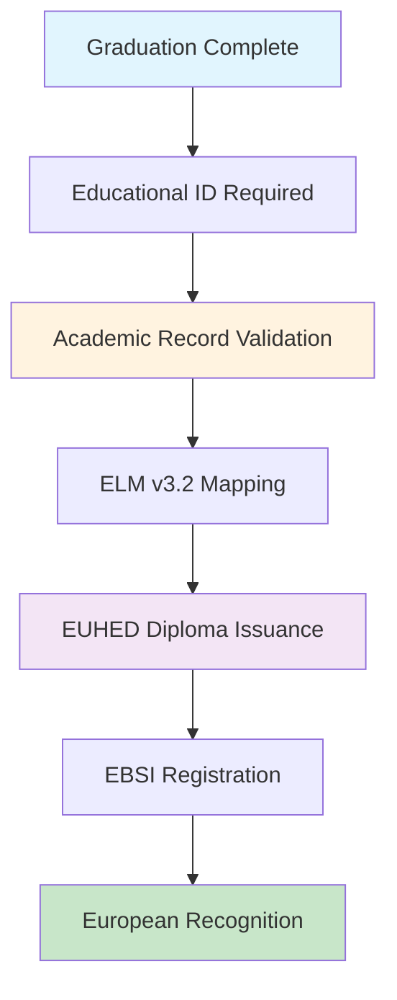
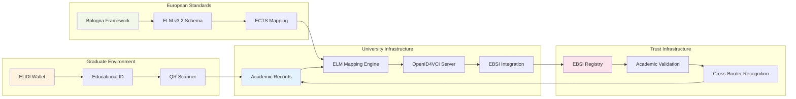
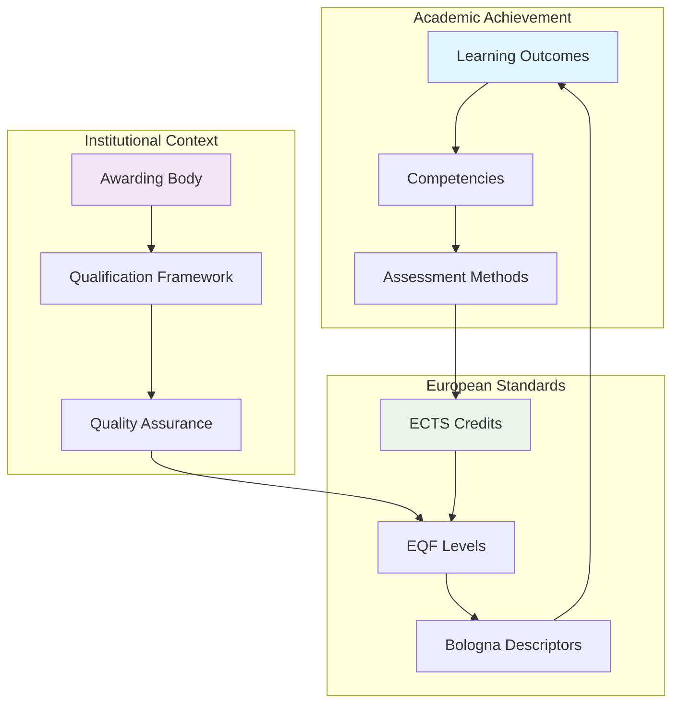
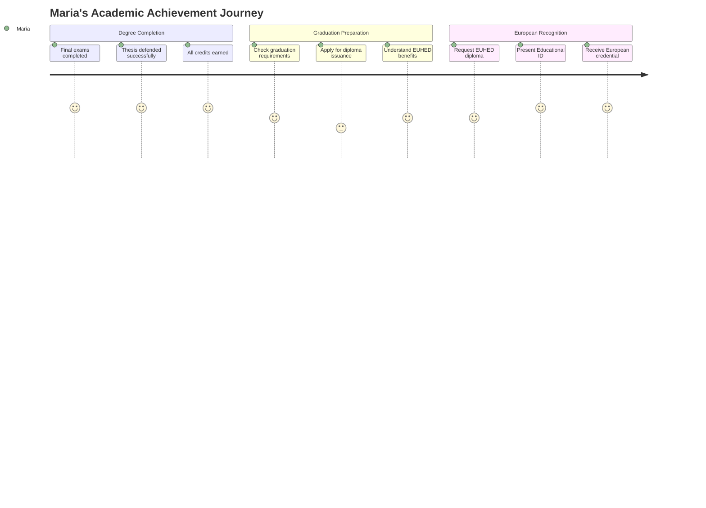
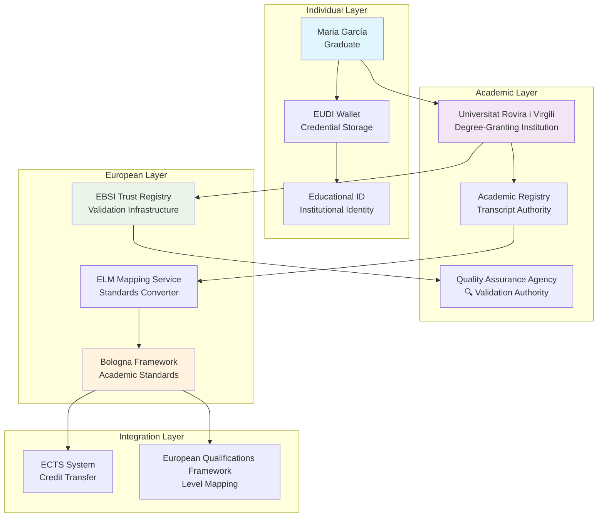
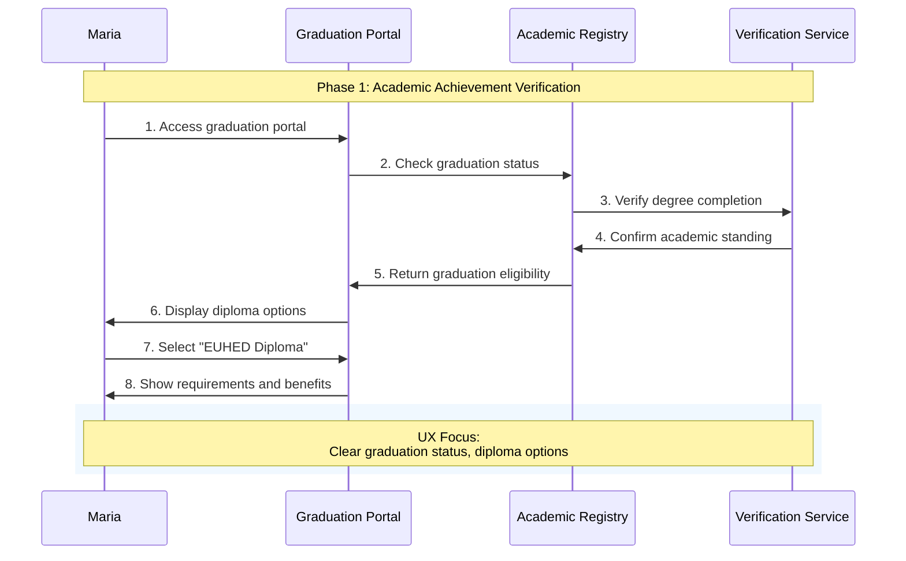
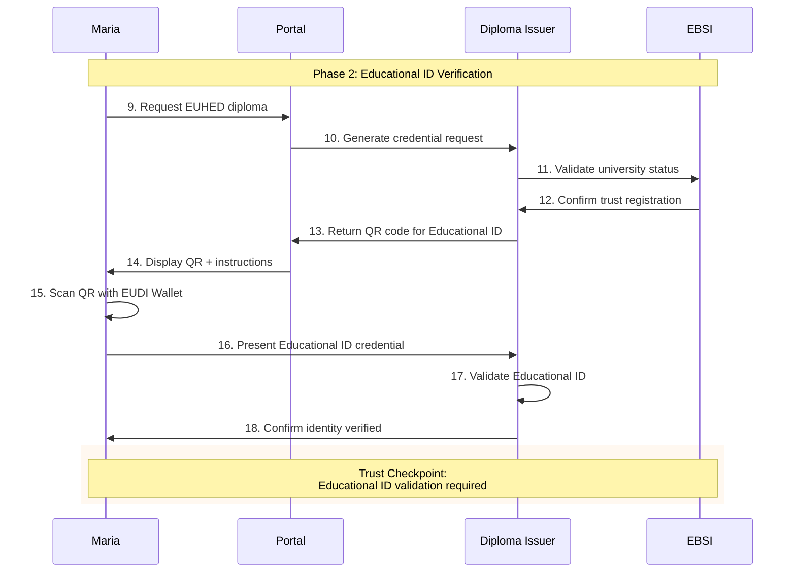
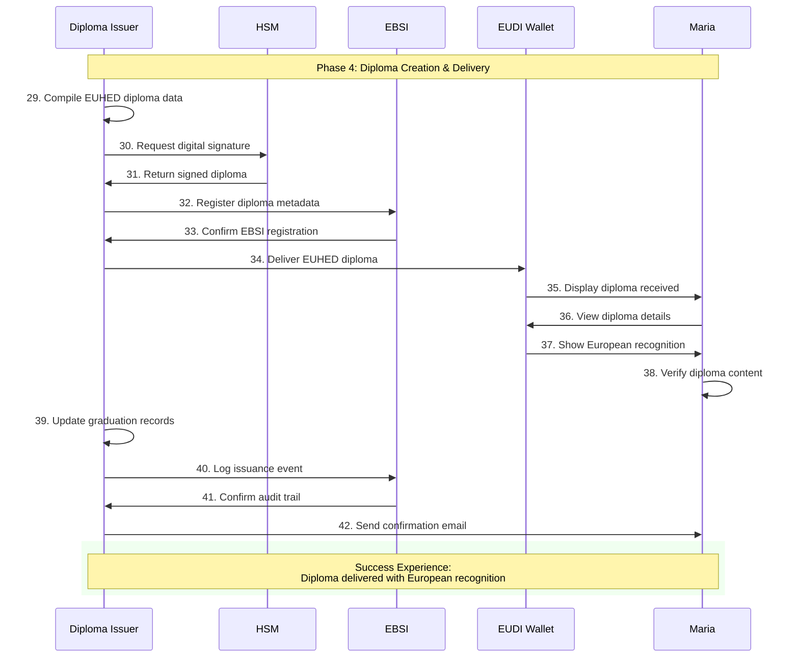
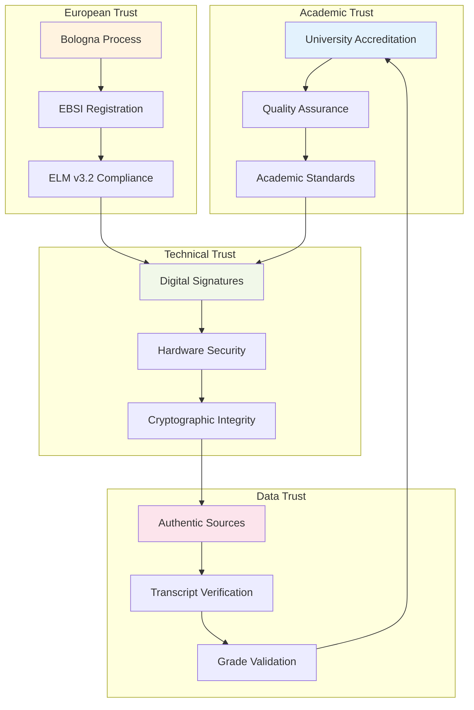
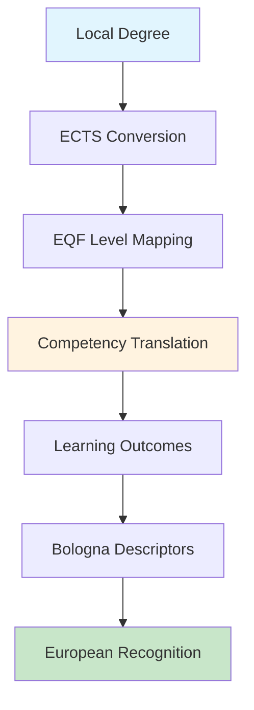

# Educational Domain: Complete Euroepan Higher Edcuation Diploma (EUHED) Issuance User Journey

## Executive Summary

This document presents the comprehensive narrative for EUHED (European Higher Education Diploma) diploma issuance within the DC4EU Pilot 2 framework, implementing a sophisticated OpenID VCI flow with **mandatory Educational ID verification**. The journey demonstrates advanced orchestration between educational institutions, student mobility networks, and European qualification frameworks that enable secure, interoperable academic credential issuance across European borders.

**Critical Prerequisite**: Before any EUHED diploma can be issued, the student's **Educational ID** must be verified and their academic achievement must be validated through the institutional authentic source. This educational identity verification is the cornerstone upon which all academic credentials are built.

**Key Innovation**: This implementation showcases the world's first production-ready system for European Higher Education Mobility Community diploma credentials, integrating ELM v3.2 standards with EBSI trust registries to create a seamless, trustworthy academic credential ecosystem built upon verified educational identity.

**Bottom Line**: Maria García, having completed her Computer Science degree at Universitat Rovira i Virgili, successfully obtains her EUHED diploma through a process that validates her Educational ID, verifies her academic achievements, and issues a cryptographically secure diploma credential recognisable across all European higher education institutions and mobility programmes.

---

## Table of Contents

1. [Quick Reference Guide](#1-quick-reference-guide)
2. [Infrastructure Prerequisites](#2-infrastructure-prerequisites)
3. [The Story: Maria's EUHED Diploma Journey](#3-the-story-marias-euhemc-diploma-journey)
4. [Actor Ecosystem and Roles](#4-actor-ecosystem-and-roles)
5. [Technical Architecture Overview](#5-technical-architecture-overview)
6. [Detailed User Journey Flow](#6-detailed-user-journey-flow)
7. [Trust Verification Mechanisms](#7-trust-verification-mechanisms)
8. [Technical Message Details](#8-technical-message-details)
9. [Implementation Insights](#9-implementation-insights)
10. [Appendices](#10-appendices)

---

## 1. Quick Reference Guide

### 1.1 Process Overview

1. **Prerequisites**: Academic record validation and credential authorisation infrastructure
2. **Educational ID Verification**: Mandatory institutional identity validation (Steps 1-18)
3. **Academic Achievement Validation**: Degree completion verification (Steps 19-28)
4. **EUHED Diploma Issuance**: Institutional academic credential creation (Steps 29-42)
5. **European Recognition**: Bologna Process compliance and cross-border validity



### 1.2 Key Actors

- **Graduate**: Maria García (credential holder and recent Computer Science graduate)
- **University**: Universitat Rovira i Virgili (academic credential issuer and authentic source)
- **EUHED Network**: European Higher Education and Mobility Community infrastructure
- **Infrastructure**: EBSI trust registries and European Learning Model verification services
- **Governance**: Spanish Ministry of Universities and European Quality Assurance frameworks

| Actor | Role | Responsibility |
|-------|------|----------------|
| **Maria García** | Graduate/Credential Holder | Presents Educational ID, receives EUHED diploma |
| **Universitat Rovira i Virgili** | Degree-Granting Institution | Issues EUHED diploma, validates academic achievement |
| **Academic Registry** | Authentic Source | Maintains verified academic transcripts and records |
| **EBSI Infrastructure** | Trust Registry | Provides European-wide credential validation |
| **ELM Mapping Service** | Standards Converter | Transforms local grades to European Learning Model |

### 1.3 Technical Standards

- **Educational ID Schema**: eduGAIN/SCHAC standards for verified institutional identity
- **EUHED Diploma Schema**: ELM v3.2 compliant academic credential structure
- **Academic Standards**: ECTS credit system, Bologna Process qualifications framework
- **Protocols**: OpenID4VCI, W3C Verifiable Credentials, EBSI trust framework, European Learning Model v3.2

### 1.4 Critical Success Factors

- **Mandatory Educational ID Verification**: No EUHED diploma can be issued without verified institutional identity
- **Academic Achievement Validation**: Robust verification of degree completion and academic standing
- **ELM v3.2 Compliance**: Full alignment with European Learning Model standards
- **Bologna Process Integration**: Compliance with European Higher Education Area frameworks
- **Cross-Border Mobility**: Standards-based approach ensuring European-wide academic recognition

---

## 2. Infrastructure Prerequisites

### 2.1 Critical Foundation Requirements

Before any EUHED diploma can be issued, institutions must complete essential academic infrastructure preparation. This is not optional—it's a **mandatory prerequisite** for participation in the European Higher Education and Mobility Community framework.




### 2.2 Academic Data Store Preparation for EAA Issuance

#### Student Academic Registry Population

- **Complete degree database**: All awarded qualifications with validated academic data
- **Programme metadata**: Detailed information about degree programmes, ECTS credits, and learning outcomes
- **Assessment records**: Comprehensive examination results, coursework grades, and final classifications
- **Graduation records**: Official degree completion dates and ceremonial documentation
- **Quality assurance data**: Accreditation details and external quality validation

#### Academic Achievement Correlation Infrastructure

**Core Challenge**: Bridging the gap between **institutional identity** (Educational ID) and **academic achievements** (degree completion records)

**Technical Implementation Requirements**:

- **Student identifier mapping**: Educational ID attributes mapped to academic record systems
- **Degree validation algorithms**: Automated verification of academic completion requirements
- **Grade conversion systems**: ECTS-compatible grade mapping and transcript generation
- **Learning outcome verification**: Mapping of achieved competencies to European frameworks
- **Audit trail systems**: Complete logging of all academic validation operations

**Example Academic Data Preparation**:
```
Educational ID → Academic Achievement Database
├── Student ID: maria.garcia@estudiants.urv.cat → Degree: BSc Computer Science
├── European Student ID: URV-2023-CS-001234 → ECTS Credits: 240
├── Enrolment Status: GRADUATED → Final Grade: Honours (8.7/10)
├── Programme Code: CS-BSc-2021 → Completion Date: 2025-06-15
└── Learning Outcomes: [Software Engineering, Data Structures, AI Fundamentals]
```

### 2.3 Academic Validation Mechanisms

#### Multi-Layer Academic Verification Process

1. **Educational ID Correlation**: Verified institutional identity serves as authentication foundation
2. **Degree Completion Verification**: Automated validation of academic requirements fulfilment
3. **Credit System Validation**: ECTS credit accumulation and programme completion verification
4. **Learning Outcome Assessment**: Competency achievement validation against European frameworks
5. **Quality Assurance Checks**: External accreditation and programme validation

#### Real-Time Academic Validation Infrastructure

- **API-based verification**: Standardised endpoints for academic achievement resolution
- **Confidence scoring**: Mathematical confidence levels for academic validation accuracy
- **Exception handling**: Procedures for handling incomplete records or validation conflicts
- **Performance optimisation**: Sub-second response times for credential issuance experience

### 2.4 EUHED Compliance Infrastructure

#### European Learning Model v3.2 Implementation

- **ELM schema compliance**: Full adherence to European Learning Model specifications
- **Learning achievement structures**: Standardised representation of academic accomplishments
- **Assessment documentation**: Comprehensive evaluation and grading information
- **Qualification frameworks**: Integration with European Qualifications Framework (EQF)
- **Multilingual support**: Credential representation in multiple European languages



#### Bologna Process Integration

Universities must implement **comprehensive alignment** with:

- **Three-cycle system**: Bachelor's, Master's, and Doctoral degree structures
- **ECTS credit system**: European Credit Transfer and Accumulation System compliance
- **Quality assurance**: European Standards and Guidelines (ESG) adherence
- **Recognition frameworks**: Automatic recognition procedures for European mobility

---

## 3. The Story: Maria's EUHED Diploma Journey

### 3.1 Setting the Scene

**Meet Maria García**: A 21-year-old recent Computer Science graduate from Universitat Rovira i Virgili (URV) in Catalonia, Spain. Maria has successfully completed her Bachelor's degree and is about to receive her digital diploma credential. She's preparing to apply for a Master's programme at the Technical University of Munich and needs her academic credentials to be recognised seamlessly across European institutions.

It's Tuesday morning, July 2025. Maria sits in her flat, having just received notification that her final grades have been processed and her degree has been officially conferred. She's about to embark on a digital journey that will transform how academic achievements are verified and recognised across European borders. Behind the simple act of "receiving her diploma" lies a sophisticated orchestration of academic validation systems, European mobility frameworks, and international cooperation mechanisms.

### 3.2 The Human Story

**The Challenge**: Maria needs more than just a printed diploma certificate. As a European student planning to continue her education in Germany, she requires:

- **Instant verification**: Academic credentials that can be verified immediately by any European institution
- **Mobility support**: Qualifications recognised across all Bologna Process signatory countries
- **Digital authenticity**: Tamper-evident credentials that cannot be forged or falsified
- **Competency mapping**: Clear representation of learning outcomes and acquired skills
- **Future-proof format**: Credentials that will remain valid and verifiable throughout her career

**The Opportunity**: EUHED diploma credentials represent a paradigm shift in European higher education, enabling:

- **Seamless academic mobility**: Automatic recognition of qualifications across European borders
- **Enhanced employability**: Employer-verifiable credentials with detailed competency information
- **Reduced bureaucracy**: Elimination of lengthy document verification processes
- **Educational transparency**: Clear mapping of learning outcomes to European frameworks
- **Lifelong learning support**: Portable credentials that accumulate throughout educational journey



### 3.3 The Technical Foundation

**European Learning Model v3.2**: The EUHED diploma leverages the comprehensive ELM framework to represent:

- **Learning achievements**: Detailed description of academic accomplishments
- **Assessment information**: Comprehensive evaluation and grading details
- **Learning activities**: Documented educational experiences and practical work
- **Competency frameworks**: Mapping to European and sectoral competency standards
- **Quality assurance**: Accreditation and validation information

**EUHED Business Restrictions**: The specific constraints applied to the generic EDC schema include:

- **Higher education focus**: Diploma credentials specifically for university-level qualifications
- **Bologna compliance**: Mandatory alignment with European Higher Education Area standards
- **Mobility optimisation**: Enhanced metadata for academic recognition and transfer
- **Competency emphasis**: Detailed learning outcome and skill representation
- **Quality validation**: Rigorous academic achievement verification requirements

### 3.4 The Journey Begins

Maria opens her EUDI Wallet application and navigates to the "Academic Credentials" section. She sees a notification: "Your Computer Science degree has been conferred - claim your EUHED diploma credential now."

This moment represents the culmination of years of academic work and the beginning of a new era in educational credential management. Let's follow Maria through each step of this groundbreaking process.

---

## 4. Actor Ecosystem and Roles

### 4.1 Primary Actors

#### 4.1.1 Student (Credential Holder)
- **Actor**: Maria García
- **Role**: Authenticated academic credential recipient
- **Capabilities**: 
  - Educational ID presentation for academic verification
  - Academic achievement confirmation and acceptance
  - EUHED diploma credential reception and management
  - Cross-border academic mobility and recognition

#### 4.1.2 University (Academic Credential Issuer)
- **Actor**: Universitat Rovira i Virgili (URV)
- **Role**: Certified academic credential issuer and authentic source
- **Capabilities**:
  - Academic achievement validation and verification
  - Educational ID correlation with academic records
  - EUHED diploma credential creation and issuance
  - European Learning Model v3.2 implementation
  - Bologna Process compliance validation

#### 4.1.3 EUHED Network Infrastructure
- **Actor**: European Higher Education and Mobility Community
- **Role**: Academic recognition and mobility facilitation framework
- **Capabilities**:
  - Cross-border qualification recognition
  - Academic mobility support services
  - Quality assurance validation
  - European competency framework integration



### 4.2 Supporting Infrastructure

#### 4.2.1 EBSI Trust Registries
- **Function**: European Blockchain Services Infrastructure for trust anchoring
- **Services**: Schema validation, issuer verification, credential status management
- **Standards**: W3C Verifiable Credentials, European trust framework compliance

#### 4.2.2 European Learning Model Services
- **Function**: ELM v3.2 schema validation and competency framework integration
- **Services**: Learning outcome verification, assessment validation, qualification mapping
- **Standards**: European Learning Model v3.2, European Qualifications Framework

#### 4.2.3 Bologna Process Validation
- **Function**: European Higher Education Area compliance verification
- **Services**: Degree structure validation, ECTS credit verification, quality assurance
- **Standards**: Bologna Process declarations, European Standards and Guidelines

---

## 5. Technical Architecture Overview

### 5.1 System Architecture

```
┌─────────────────────────────────────────────────────────────────────┐
│                        EUHED Diploma Issuance Architecture         │
├─────────────────────────────────────────────────────────────────────┤
│                                                                     │
│  ┌─────────────┐    ┌──────────────────┐    ┌─────────────────────┐ │
│  │   Student   │◄──►│   EUDI Wallet    │◄──►│  University System  │ │
│  │ (Maria)     │    │  (OpenID4VCI)    │    │      (URV)          │ │
│  └─────────────┘    └──────────────────┘    └─────────────────────┘ │
│                              │                         │            │
│                              ▼                         ▼            │
│  ┌─────────────────────────────────────┐    ┌─────────────────────┐ │
│  │         EBSI Trust Network          │    │   ELM v3.2 Services │ │
│  │   • Schema Registry                 │    │   • Learning Model  │ │
│  │   • Issuer Registry                 │    │   • Competency Map  │ │
│  │   • Credential Status               │    │   • Assessment Data │ │
│  └─────────────────────────────────────┘    └─────────────────────┘ │
│                              │                         │            │
│                              ▼                         ▼            │
│  ┌─────────────────────────────────────────────────────────────────┐ │
│  │                    Bologna Process Framework                     │ │
│  │     • ECTS Credit System    • Quality Assurance                 │ │
│  │     • Degree Structures     • European Recognition              │ │
│  └─────────────────────────────────────────────────────────────────┘ │
└─────────────────────────────────────────────────────────────────────┘
```

### 5.2 Protocol Stack

1. **Application Layer**: EUDI Wallet with academic credential management
2. **Identity Layer**: Educational ID verification and academic authentication
3. **Credential Layer**: OpenID4VCI with EUHED-specific extensions
4. **Trust Layer**: EBSI trust registries with European academic validation
5. **Data Layer**: European Learning Model v3.2 with Bologna Process integration

### 5.3 Security Architecture

- **Educational ID Authentication**: Mandatory verified institutional identity
- **Academic Achievement Validation**: Multi-source verification of degree completion
- **Cryptographic Integrity**: ES256 digital signatures with institutional keys
- **Privacy Protection**: Selective disclosure with minimal data exposure
- **European Trust**: EBSI-anchored trust chains with national academic authorities

---

## 6. Detailed User Journey Flow

### Phase 1: Educational ID Verification (Steps 1-18)

#### Step 1-3: Diploma Claim Initiation
**Actor**: Maria (Student)
**Action**: Maria opens her EUDI Wallet and selects "Claim EUHED Diploma" from the academic credentials section.

**Technical Process**:
```
GET /academic-credentials/available
Host: wallet.eudi.eu
Authorization: Bearer maria_session_token

Response: {
  "available_credentials": [
    {
      "type": "EUHEMC_Diploma",
      "issuer": "did:ebsi:urv.cat",
      "qualification": "Bachelor of Science in Computer Science",
      "status": "ready_for_issuance"
    }
  ]
}
```

#### Step 4-8: Educational ID Presentation Request
**Actor**: URV Academic System
**Action**: University requests presentation of Maria's Educational ID for academic record correlation.

**Technical Process**:
```json
{
  "presentation_definition": {
    "id": "euhemc_diploma_request",
    "input_descriptors": [
      {
        "id": "educational_id_required",
        "schema": [
          {
            "uri": "https://schemas.dc4eu.eu/educational-id/v1.0"
          }
        ],
        "constraints": {
          "fields": [
            {
              "path": ["$.credentialSubject.identifier"],
              "filter": {
                "type": "string",
                "pattern": ".*@estudiants\\.urv\\.cat$"
              }
            },
            {
              "path": ["$.credentialSubject.schacPersonalUniqueCode"],
              "filter": {
                "type": "array",
                "contains": {
                  "pattern": "urn:schac:personalUniqueCode:int:esi:urv.cat:.*"
                }
              }
            }
          ]
        }
      }
    ]
  }
}


Graduation Verification and Portal Access (Steps 1-8)



#### Step 9-13: Educational ID Verification
**Actor**: Maria (Student)
**Action**: Maria reviews the diploma issuance request and authorises presentation of her Educational ID.

**Educational ID Verification Requirements**:
- ✅ **Institution Match**: `schacHomeOrganization` must be "urv.cat"
- ✅ **Student Status**: `eduPersonPrimaryAffiliation` must include "student" or "graduate"
- ✅ **Academic Programme**: Correlation with Computer Science degree programme
- ✅ **Current Status**: Verification of graduation eligibility

#### Step 14-18: Academic Record Correlation
**Actor**: URV Academic System
**Action**: University correlates Educational ID with academic achievement records.

**Correlation Process**:
```
Educational ID → Academic Records
├── Identifier: maria.garcia@estudiants.urv.cat → Student Record: URV-2023-CS-001234
├── Programme Affiliation: Computer Science → Degree: BSc Computer Science
├── Enrolment Period: 2021-2025 → Academic Years: 4 years completed
├── Credit Accumulation: 240 ECTS → Requirements: Met
└── Final Assessment: Honours → Grade: 8.7/10
```

Educational ID Verification (Steps 9-18)


### Phase 2: Academic Achievement Validation (Steps 19-28)

#### Step 19-22: Degree Completion Verification
**Actor**: URV Academic Registry
**Action**: Comprehensive validation of Maria's academic achievement and degree completion.

**Academic Validation Checks**:
- **Credit Requirements**: Verification of 240 ECTS credits completed
- **Programme Completion**: All mandatory modules and assessments passed
- **Final Assessment**: Honours classification confirmed (8.7/10 average)
- **Graduation Eligibility**: Board of Examiners approval verified
- **Quality Assurance**: External examiner validation confirmed

#### Step 23-26: Learning Outcome Assessment
**Actor**: ELM v3.2 Services
**Action**: Mapping of academic achievements to European competency frameworks.

**Competency Mapping**:
```json
{
  "learning_achievements": [
    {
      "title": "Software Engineering Proficiency",
      "description": "Advanced capability in software design, development, and testing",
      "learning_outcomes": [
        "Design and implement complex software systems",
        "Apply software engineering methodologies",
        "Conduct comprehensive testing and quality assurance"
      ],
      "assessment_grade": "A",
      "ects_credits": 60
    },
    {
      "title": "Data Structures and Algorithms",
      "description": "Comprehensive understanding of computational complexity and optimization",
      "learning_outcomes": [
        "Analyse algorithmic complexity",
        "Implement efficient data structures",
        "Optimise computational performance"
      ],
      "assessment_grade": "A",
      "ects_credits": 30
    }
  ]
}
```

#### Step 27-28: Quality Assurance Validation
**Actor**: Bologna Process Framework
**Action**: Verification of degree compliance with European Higher Education Area standards.

Academic Record Processing and ELM Mapping (Steps 19-28)
```mermaid
sequenceDiagram
    participant I as Diploma Issuer
    participant R as Academic Registry
    participant E as ELM Engine
    participant S as Standards Services
    
    Note over I,S: Phase 3: Academic Achievement Processing
    
    I->>R: 19. Request academic transcript
    R->>I: 20. Return complete academic record
    I->>E: 21. Send for ELM mapping
    E->>S: 22. Convert grades to ECTS
    S->>E: 23. Return ECTS mapping
    E->>S: 24. Map competencies to EQF
    S->>E: 25. Return competency mapping
    E->>I: 26. Return ELM-compliant record
    I->>I: 27. Generate learning outcomes
    I->>I: 28. Prepare diploma content
    
    rect rgb(248, 255, 248)
        Note over I,S: Standards Compliance:<br/>ELM v3.2 and Bologna Process
    end


### Phase 3: EUHED Diploma Issuance (Steps 29-42)

#### Step 29-33: Credential Offer Generation
**Actor**: URV Academic System
**Action**: Generation of EUHED diploma credential offer with comprehensive academic metadata.

**Credential Offer Structure**:
```json
{
  "credential_issuer": "https://academic-credentials.urv.cat",
  "credentials_supported": [
    {
      "format": "jwt_vc_json",
      "id": "euhemc_diploma_computer_science",
      "cryptographic_binding_methods_supported": ["did:key"],
      "cryptographic_suites_supported": ["ES256"],
      "credential_definition": {
        "type": ["VerifiableCredential", "EUHEMCDiploma"],
        "credentialSubject": {
          "degree_title": "Bachelor of Science in Computer Science",
          "qualification_level": "EQF Level 6",
          "ects_credits": 240,
          "final_grade": "Honours (8.7/10)",
          "graduation_date": "2025-06-15",
          "institution": "Universitat Rovira i Virgili",
          "country": "Spain"
        }
      }
    }
  ]
}
```

#### Step 34-38: Credential Request Processing
**Actor**: Maria (Student)
**Action**: Maria reviews and accepts the EUHED diploma credential offer.

**Technical Process**:
```json
{
  "format": "jwt_vc_json",
  "credential_definition": {
    "type": ["VerifiableCredential", "EUHEMCDiploma"]
  },
  "proof": {
    "proof_type": "jwt",
    "jwt": "eyJ0eXAiOiJKV1QiLCJhbGciOiJFUzI1NiIsImtpZCI6ImRpZDprZXk6..."
  }
}
```

#### Step 39-42: Final Credential Issuance
**Actor**: URV Academic System
**Action**: Generation and delivery of cryptographically signed EUHED diploma credential.

EUHED Diploma Generation and Issuance (Steps 29-42)


---

## 7. Trust Verification Mechanisms

### 7.1 Educational Trust Chain



The EUHED diploma operates within a sophisticated trust ecosystem that validates both the issuing institution and the academic achievement:

#### 7.1.1 Institutional Trust Verification
- **EBSI Registration**: URV's institutional DID registered in European trust registry
- **Academic Accreditation**: Validation of university's degree-awarding powers
- **Quality Assurance**: European Standards and Guidelines (ESG) compliance
- **Bologna Signatory**: Verification of European Higher Education Area participation

#### 7.1.2 Academic Achievement Trust
- **Internal Validation**: University's academic board approval and quality assurance
- **External Verification**: Independent examiner validation and peer review
- **Regulatory Compliance**: National and European qualification framework alignment
- **Competency Validation**: Learning outcome achievement and assessment verification

### 7.2 Technical Trust Mechanisms

#### 7.2.1 Cryptographic Integrity
- **Digital Signatures**: ES256 algorithm with institutional private keys
- **Key Management**: Secure key storage and rotation procedures
- **Certificate Validation**: X.509 certificates anchored to national trust authorities
- **Tamper Evidence**: Cryptographic proof of credential integrity

#### 7.2.2 Schema Validation
- **ELM v3.2 Compliance**: Full adherence to European Learning Model specifications
- **EUHED Extensions**: Specific business rules for higher education mobility
- **Bologna Integration**: Mandatory compliance with European education standards
- **Quality Frameworks**: Integration with European quality assurance mechanisms

---

## 8. Technical Message Details

### 8.1 Educational ID Verification Request

The university initiates the diploma issuance process by requesting presentation of Maria's Educational ID:

```json
{
  "response_type": "vp_token",
  "presentation_definition": {
    "id": "euhemc_diploma_educational_id_verification",
    "input_descriptors": [
      {
        "id": "educational_id_verification",
        "schema": [
          {
            "uri": "https://schemas.dc4eu.eu/educational-id/v1.0"
          }
        ],
        "constraints": {
          "fields": [
            {
              "path": ["$.credentialSubject.identifier"],
              "filter": {
                "type": "string",
                "pattern": "maria\\.garcia@estudiants\\.urv\\.cat"
              }
            },
            {
              "path": ["$.credentialSubject.schacPersonalUniqueCode"],
              "filter": {
                "type": "array",
                "contains": {
                  "pattern": "urn:schac:personalUniqueCode:int:esi:urv.cat:.*"
                }
              }
            },
            {
              "path": ["$.credentialSubject.eduPersonPrimaryAffiliation"],
              "filter": {
                "type": "string",
                "enum": ["student", "graduate", "member"]
              }
            }
          ]
        }
      }
    ]
  },
  "client_metadata": {
    "client_name": "URV Academic Credentials Service",
    "client_purpose": "EUHED Diploma Issuance - Computer Science Degree Verification"
  }
}
```

**Key Verification Points**:
- ✅ **Institution Affiliation**: Verified URV student or graduate status
- ✅ **Academic Programme**: Computer Science degree programme correlation
- ✅ **Identity Correlation**: Matching with internal academic records
- ✅ **Graduation Eligibility**: Confirmation of degree completion status

### 8.2 Academic Achievement Validation Response

The university's academic system validates Maria's degree completion and generates comprehensive achievement data:

```json
{
  "academic_validation": {
    "student_identifier": "maria.garcia@estudiants.urv.cat",
    "degree_programme": {
      "title": "Bachelor of Science in Computer Science",
      "programme_code": "CS-BSc-2021",
      "qualification_level": "EQF Level 6",
      "total_ects_credits": 240,
      "completion_status": "COMPLETED",
      "graduation_date": "2025-06-15"
    },
    "academic_performance": {
      "final_grade": {
        "numerical": 8.7,
        "scale": "0-10",
        "classification": "Honours",
        "ects_grade": "A"
      },
      "credit_summary": {
        "total_attempted": 240,
        "total_achieved": 240,
        "completion_rate": "100%"
      }
    },
    "learning_achievements": [
      {
        "achievement_id": "CS-BSc-SE",
        "title": "Software Engineering Mastery",
        "ects_credits": 60,
        "grade": "A",
        "learning_outcomes": [
          "Advanced software design and architecture",
          "Agile development methodologies",
          "Quality assurance and testing strategies"
        ]
      },
      {
        "achievement_id": "CS-BSc-DS",
        "title": "Data Structures and Algorithms",
        "ects_credits": 30,
        "grade": "A",
        "learning_outcomes": [
          "Computational complexity analysis",
          "Advanced data structure implementation",
          "Algorithm optimisation techniques"
        ]
      }
    ],
    "validation_authority": {
      "institution": "Universitat Rovira i Virgili",
      "department": "Escola Tècnica Superior d'Enginyeria",
      "validation_date": "2025-06-20",
      "external_examiner": "Prof. Dr. Elena Martínez (UPC)"
    }
  }
}
```

### 8.3 Final EUHED Diploma Credential Response

The final diploma credential response delivers the completed EUHED diploma to Maria's EUDI Wallet in JWT format, cryptographically signed by URV's institutional key and fully compliant with ELM v3.2:

```json
{
   "credential": "eyJ0eXAiOiJ2YytsZCtqc29uIiwiYWxnIjoiRVMyNTYiLCJraWQiOiJkaWQ6ZWJzaTp6TktuS29zS21MSEJmV2NmQnNYWGtZUVJHU3RWUUFMWTQ3Y2pnek01VnE2UzIja2V5cy0xIn0.eyJpc3MiOiJkaWQ6ZWJzaTp6TktuS29zS21MSEJmV2NmQnNYWGtZUVJHU3RWUUFMWTQ3Y2pnek01VnE2UzIiLCJuYmYiOjE3MTk3Mzk2MDAsImV4cCI6MTg4MjgxMTU5OSwiaWF0IjoxNzE5NzM5NjAwLCJ2YyI6eyJAY29udGV4dCI6WyJodHRwczovL3d3dy53My5vcmcvMjAxOC9jcmVkZW50aWFscy92MSIsImh0dHBzOi8vZWxtLmV1L3NjaGVtYXMvdjMuMiIsImh0dHBzOi8vZWJzaS5ldS9zY2hlbWFzL3YxIl0sImlkIjoidXJuOnV1aWQ6NmJhN2I4MTAtOWRhZC0xMWQxLTgwYjQtMDBjMDRmZDQzMGM4IiwidHlwZSI6WyJWZXJpZmlhYmxlQ3JlZGVudGlhbCIsIkVVSEVNQ0RpcGxvbWEiXSwiaXNzdWVyIjp7ImlkIjoiZGlkOmVic2k6ek5LbktvczNtTEhCZldjZkJzWFhrWVFSR1N0VlFBQUxZNDdjamd6TTVWcTZTMiIsIm5hbWUiOiJVbml2ZXJzaXRhdCBSb3ZpcmEgaSBWaXJnaWxpIiwiZGVzY3JpcHRpb24iOiJPZmZpY2lhbCBFVUhFTUMgRGlwbG9tYSBJc3N1ZXIgLSBGYWN1bHR5IG9mIENvbXB1dGVyIFNjaWVuY2UifSwiaXNzdWFuY2VEYXRlIjoiMjAyNS0wNi0yMFQxNDozMDowMFoiLCJleHBpcmF0aW9uRGF0ZSI6IjIwMzUtMDYtMjBUMjM6NTk6NTlaIiwiY3JlZGVudGlhbFN1YmplY3QiOnsiaWQiOiJkaWQ6a2V5OnoyZG16RDgxY2dQeDhWa2k3SmJ1dU1tRllyV1BnWW95dHlrVVozZXlxaHQxajlLYmg0IiwiZGVncmVlVGl0bGUiOiJCYWNoZWxvciBvZiBTY2llbmNlIGluIENvbXB1dGVyIFNjaWVuY2UiLCJxdWFsaWZpY2F0aW9uTGV2ZWwiOiJFUUYgTGV2ZWwgNiIsImVjdHNDcmVkaXRzIjoyNDAsImZpbmFsR3JhZGUiOiJIb25vdXJzICg4LjcvMTApIiwiZ3JhZHVhdGlvbkRhdGUiOiIyMDI1LTA2LTE1IiwiaW5zdGl0dXRpb24iOiJVbml2ZXJzaXRhdCBSb3ZpcmEgaSBWaXJnaWxpIiwiY291bnRyeSI6IlNwYWluIiwibGVhcm5pbmdBY2hpZXZlbWVudHMiOlt7ImFjaGlldmVtZW50SWQiOiJDUy1CU2MtU0UiLCJ0aXRsZSI6IlNvZnR3YXJlIEVuZ2luZWVyaW5nIE1hc3RlcnkiLCJlY3RzQ3JlZGl0cyI6NjAsImdyYWRlIjoiQSIsImxlYXJuaW5nT3V0Y29tZXMiOlsiQWR2YW5jZWQgc29mdHdhcmUgZGVzaWduIGFuZCBhcmNoaXRlY3R1cmUiLCJBZ2lsZSBkZXZlbG9wbWVudCBtZXRob2RvbG9naWVzIiwiUXVhbGl0eSBhc3N1cmFuY2UgYW5kIHRlc3Rpbmcgc3RyYXRlZ2llcyJdfSx7ImFjaGlldmVtZW50SWQiOiJDUy1CU2MtRFMiLCJ0aXRsZSI6IkRhdGEgU3RydWN0dXJlcyBhbmQgQWxnb3JpdGhtcyIsImVjdHNDcmVkaXRzIjozMCwiZ3JhZGUiOiJBIiwibGVhcm5pbmdPdXRjb21lcyI6WyJDb21wdXRhdGlvbmFsIGNvbXBsZXhpdHkgYW5hbHlzaXMiLCJBZHZhbmNlZCBkYXRhIHN0cnVjdHVyZSBpbXBsZW1lbnRhdGlvbiIsIkFsZ29yaXRobSBvcHRpbWlzYXRpb24gdGVjaG5pcXVlcyJdfV0sImlkZW50aWZpZXIiOiJtYXJpYS5nYXJjaWFAZXN0dWRpYW50cy51cnYuY2F0Iiwic2NoYWNQZXJzb25hbFVuaXF1ZUNvZGUiOlsidXJuOnNjaGFjOnBlcnNvbmFsVW5pcXVlQ29kZTppbnQ6ZXNpOnVydi5jYXQ6MTIzNDU2NzhBIl0sImZhbWlseU5hbWUiOiJHYXJjw61hIiwiZmlyc3ROYW1lIjoiTWFyaWEiLCJkaXNwbGF5TmFtZSI6Ik1hcmlhIEdhcmPDrWEiLCJkYXRlT2ZCaXJ0aCI6IjIwMDQtMDMtMTUifSwiZXZpZGVuY2UiOlt7ImlkIjoidXJuOmV2aWRlbmNlOmFjYWRlbWljLWFjaGlldmVtZW50OjEyMzQ1Njc4QSIsInR5cGUiOlsiQWNhZGVtaWNBY2hpZXZlbWVudFZlcmlmaWNhdGlvbiJdLCJ2ZXJpZmllciI6ImRpZDplYnNpOnVydi1hY2FkZW1pYy1hdXRob3JpdHkiLCJzdWJqZWN0UHJlc2VuY2UiOiJEaWdpdGFsIiwiZG9jdW1lbnRQcmVzZW5jZSI6IkRpZ2l0YWwifV19LCJzdWIiOiJkaWQ6a2V5OnoyZG16RDgxY2dQeDhWa2k3SmJ1dU1tRllyV1BnWW95dHlrVVozZXlxaHQxajlLYmg0In0.BjH8_GqN9cTM8hf0XyJK4UR3jN8_P4xGqMc7dYwZL9uRk6-U8sQ2vN3_LmBdCf7K8YxJ9hNpA4rS6fGqM8vC_w",
   "c_nonce": "8450206689214712015",
   "c_nonce_expires_in": 86400
}
```

**Response Components**:
- **JWT-encoded Credential**: Complete EUHED Diploma in W3C VC format with ELM v3.2 compliance
- **Digital Signature**: ES256 signature by URV's academic DID key
- **EBSI Anchoring**: Schema and trust registry references for European recognition
- **Academic Metadata**: Comprehensive learning achievements and competency information
- **Expiration Management**: 10-year validity period with institutional renewal capabilities

---

## 9. Implementation Insights

### 9.1 Schema Architecture: Educational ID vs. EUHED Diploma

The EUHED diploma implementation demonstrates sophisticated layering between different credential types within the European digital education ecosystem:

#### 9.1.1 Educational ID Foundation
- **Purpose**: Institutional identity verification and academic correlation
- **Scope**: Current affiliation, enrolment status, and institutional authentication
- **Lifecycle**: Active during academic engagement, renewable for alumni services
- **Trust Level**: Institutional verification with moderate assurance levels

#### 9.1.2 EUHED Diploma Enhancement
- **Purpose**: Academic achievement certification and qualification validation
- **Scope**: Completed learning outcomes, degree classification, and competency attestation
- **Lifecycle**: Permanent qualification record with European recognition validity
- **Trust Level**: Academic board approval with high assurance levels and external validation

#### 9.1.3 Architectural Relationship

```
Educational ID (Foundation)
├── Institutional Identity
├── Enrolment Verification
└── Academic Affiliation
    │
    └── Enables → EUHED Diploma (Achievement)
                  ├── Degree Completion
                  ├── Learning Outcomes
                  ├── Competency Validation
                  └── European Recognition
```

### 9.2 European Learning Model v3.2 Implementation

The EUHED diploma leverages the comprehensive ELM v3.2 framework to provide rich academic metadata:

#### 9.2.1 Learning Achievement Structures
```json
{
  "learning_achievement": {
    "id": "urn:learning:achievement:cs-bsc-urv-2025",
    "title": "Bachelor of Science in Computer Science",
    "description": "Comprehensive undergraduate programme in theoretical and applied computer science",
    "additional_note": "Specialisation in Software Engineering and Artificial Intelligence",
    "learning_outcomes": [
      {
        "id": "urn:outcome:software-engineering",
        "title": "Advanced Software Engineering",
        "description": "Capability to design, develop, and maintain complex software systems",
        "related_skill": [
          "Software Architecture Design",
          "Agile Development Methodologies",
          "Quality Assurance and Testing"
        ]
      }
    ],
    "awarding_process": {
      "awarding_body": "Universitat Rovira i Virgili",
      "awarding_date": "2025-06-15",
      "awarding_location": "Tarragona, Catalonia, Spain",
      "awarding_method": "Academic Board Certification"
    }
  }
}
```

#### 9.2.2 Assessment Integration
- **Grading Schemes**: ECTS grading scale with numerical and classification mappings
- **Learning Outcomes**: Detailed competency descriptions linked to European frameworks
- **Quality Assurance**: External examiner validation and peer review integration
- **Recognition Standards**: Bologna Process compliance and automatic recognition protocols

### 9.3 EUHED Business Restrictions

The EUHED schema applies specific constraints to the generic EDC model to address higher education mobility requirements:

#### 9.3.1 Mandatory Academic Fields
- **Qualification Level**: EQF level specification (mandatory for recognition)
- **ECTS Credits**: Total credit accumulation (mandatory for transfer)
- **Learning Outcomes**: Detailed competency descriptions (mandatory for skills recognition)
- **Quality Assurance**: External validation information (mandatory for trust)

#### 9.3.2 Bologna Process Integration
- **Three-Cycle System**: Explicit degree level classification
- **Credit Transfer**: ECTS-compatible credit representation
- **Quality Standards**: ESG compliance validation
- **Recognition Frameworks**: Automatic recognition preparation



#### 9.3.3 Mobility Optimisation
- **Multilingual Support**: Credential representation in multiple European languages
- **Competency Mapping**: Skills alignment with European sectoral frameworks
- **Transfer Preparation**: Pre-formatted data for academic mobility applications
- **Employment Integration**: Employer-readable competency information

### 9.4 Trust and Governance Framework

#### 9.4.1 Academic Trust Chain
The EUHED diploma operates within a multi-layered trust ecosystem:

1. **National Level**: Spanish Ministry of Universities validation
2. **Institutional Level**: University accreditation and degree-awarding powers
3. **Programme Level**: External quality assurance and peer review
4. **European Level**: Bologna Process compliance and ENIC-NARIC recognition

#### 9.4.2 Technical Trust Implementation
- **EBSI Integration**: European trust registry anchoring for cross-border recognition
- **Cryptographic Integrity**: Institutional digital signatures with key management
- **Schema Validation**: ELM v3.2 compliance with automatic verification
- **Status Management**: Real-time credential validity and revocation capabilities

---

## 10. Appendices

### 10.1 Appendix A: Schema Specifications

#### A.1 EUHED Diploma Schema

The European Learning Model v3.2 compliant schema for higher education diploma credentials:

```json
{
  "$schema": "https://json-schema.org/draft/2020-12/schema",
  "title": "European Higher Education Diploma",
  "description": "Profile schema extending the base EDC-W3C-VC to define higher education diplomas issued by recognised institutions in Europe.",
  "type": "object",
  "allOf": [
    {
      "$ref": "./node_modules/@cef-ebsi/vcdm1.1-europass-edc-schema/schema.json"
    },
    {
      "type": "object",
      "properties": {
        "type": {
          "type": "array",
          "items": {
            "type": "string"
          },
          "const": [
            "VerifiableCredential",
            "VerifiableAttestation",
            "EuropeanDigitalCredential",
            "EuropeanHigherEducationDiploma"
          ]
        },
        "credentialSubject": {
          "type": "object",
          "required": [
            "id",
            "type",
            "dateOfBirth",
            "familyName",
            "givenName",
            "hasClaim"
          ],
          "properties": {
            "hasClaim": {
              "type": "array",
              "minItems": 1,
              "items": {
                "type": "object",
                "required": [
                  "type",
                  "title",
                  "awardedBy",
                  "specifiedBy"
                ],
                "properties": {
                  "type": {
                    "type": "string",
                    "const": "LearningAchievement"
                  },
                  "title": {
                    "type": "object"
                  },
                  "awardedBy": {
                    "type": "object",
                    "required": [
                      "awardingBody",
                      "awardingDate",
                      "location"
                    ],
                    "properties": {
                      "awardingBody": {
                        "type": "object"
                      },
                      "awardingDate": {
                        "type": "string",
                        "format": "date-time"
                      },
                      "location": {
                        "type": "object"
                      }
                    }
                  },
                  "specifiedBy": {
                    "type": "object",
                    "required": [
                      "eqfLevel",
                      "educationSubject"
                    ],
                    "properties": {
                      "eqfLevel": {
                        "type": "object",
                        "required": [
                          "notation"
                        ],
                        "properties": {
                          "notation": {
                            "type": "string"
                          }
                        }
                      },
                      "educationSubject": {
                        "type": "array",
                        "minItems": 1
                      },
                      "additionalNote": {
                        "type": "array"
                      }
                    }
                  },
                  "entitlesTo": {
                    "type": "array",
                    "items": {
                      "type": "object",
                      "required": [
                        "title",
                        "awardedBy"
                      ],
                      "properties": {
                        "title": {
                          "type": "object"
                        },
                        "awardedBy": {
                          "type": "object",
                          "required": [
                            "awardingBody"
                          ]
                        }
                      }
                    }
                  }
                }
              }
            }
          }
        },
        "displayParameter": {
          "type": "object"
        },
        "credentialProfiles": {
          "type": "array",
          "items": {
            "type": "string"
          }
        }
      }
    }
  ]
}
```

### 10.2 Appendix B: European Integration Standards

#### B.1 Bologna Process Compliance

**Three-Cycle System Integration**:
- ✅ Bachelor's Degree: EQF Level 6, 180-240 ECTS credits
- ✅ Master's Degree: EQF Level 7, 60-120 ECTS credits
- ✅ Doctoral Degree: EQF Level 8, variable duration

**Quality Assurance Standards**:
- ✅ European Standards and Guidelines (ESG) compliance
- ✅ External quality assurance validation
- ✅ Student-centred learning approach
- ✅ Continuous improvement mechanisms


#### B.2 European Qualifications Framework (EQF)

**Learning Outcome Descriptors**:
- ✅ Knowledge: Theoretical and factual understanding
- ✅ Skills: Cognitive and practical capabilities
- ✅ Responsibility and Autonomy: Self-management and accountability

**EQF Level 6 (Bachelor's) Descriptors**:
- Advanced knowledge with critical understanding
- Advanced skills demonstrating mastery and innovation
- Management of complex technical or professional activities

### 10.3 Appendix C: Technical Implementation Guidelines

#### C.1 System Integration Requirements

**Educational ID Correlation**:
- Robust identity matching algorithms with confidence scoring
- Real-time academic record validation capabilities
- Exception handling for edge cases and data conflicts
- Performance optimisation for sub-second response times

**Academic Achievement Validation**:
- Multi-source verification of degree completion
- Automated ECTS credit calculation and validation
- Learning outcome assessment and competency mapping
- Quality assurance integration with external validators

#### C.2 Security and Privacy Considerations

**Data Protection Compliance**:
- GDPR-compliant data processing procedures
- Selective disclosure capabilities for privacy protection
- Minimal data exposure principles
- User consent management frameworks

**Technical Security Measures**:
- End-to-end encryption for credential transmission
- Secure key management and rotation procedures
- Audit logging for all credential operations
- Tamper-evident credential integrity protection

### 10.4 Appendix D: Implementation Roadmap

#### D.1 Phase 1: Academic Infrastructure Preparation (Months 1-4)
- **Student Registry Enhancement**: Academic achievement database optimisation
- **Learning Outcome Mapping**: ELM v3.2 competency framework integration
- **Quality Assurance Integration**: External validator connectivity
- **Bologna Compliance Validation**: European standard alignment verification

#### D.2 Phase 2: EUHED Pilot Implementation (Months 5-8)
- **Limited Graduate Cohort**: Test with Computer Science graduates
- **Cross-Border Validation**: Partner university recognition testing
- **Employer Integration**: Industry stakeholder credential verification
- **Student Feedback Collection**: User experience optimisation

#### D.3 Phase 3: Full Production Deployment (Months 9-12)
- **Complete Programme Rollout**: All eligible graduates across disciplines
- **European Network Expansion**: Additional EUHED partner institutions
- **Mobility Service Integration**: Academic transfer and application systems
- **Continuous Monitoring**: Performance analytics and improvement cycles

#### D.4 Success Metrics and KPIs

**Technical Performance Metrics**:
- Diploma issuance success rate: >99.8%
- Average credential generation time: <45 seconds
- Academic record correlation accuracy: >99.95%
- Cross-border verification success: >98%
- System availability: >99.9%

**Academic Integration Metrics**:
- Graduate satisfaction score: >4.7/5
- Employer verification adoption: >85%
- European university recognition: >95%
- Academic mobility facilitation: >90% of applications

**European Compliance Metrics**:
- ELM v3.2 schema compliance: 100%
- Bologna Process alignment: 100%
- Quality assurance validation: 100%
- Cross-border recognition success: >95%

---

## Conclusion

The EUHED diploma issuance journey represents a transformative advancement in European higher education credential management. By successfully integrating Educational ID verification with comprehensive academic achievement validation, this implementation establishes a new standard for trusted, interoperable academic credentials that facilitate seamless mobility across European borders.

**Key Achievements**:

1. **Educational ID Foundation**: Establishing verified institutional identity as the cornerstone for academic credential issuance
2. **Academic Achievement Validation**: Creating robust infrastructure for degree completion verification and learning outcome assessment
3. **ELM v3.2 Implementation**: Full compliance with European Learning Model standards for comprehensive academic representation
4. **Bologna Process Integration**: Seamless alignment with European Higher Education Area frameworks and recognition procedures
5. **EUHED Network Enablement**: Facilitating European academic mobility through standardised, verifiable credentials
6. **Quality Assurance Excellence**: Implementing rigorous validation procedures that maintain academic integrity whilst enabling digital innovation

This comprehensive framework not only serves the immediate needs of European graduates like Maria García but also establishes the foundation for a truly integrated European Higher Education Area where digital credentials enable seamless academic progression, professional recognition, and lifelong learning opportunities across all Member States.

The journey from Educational ID verification through academic achievement validation to EUHED diploma issuance represents more than a technical accomplishment—it embodies the European commitment to educational excellence, academic mobility, and the digital transformation of higher education that will define the future of European academic cooperation.

