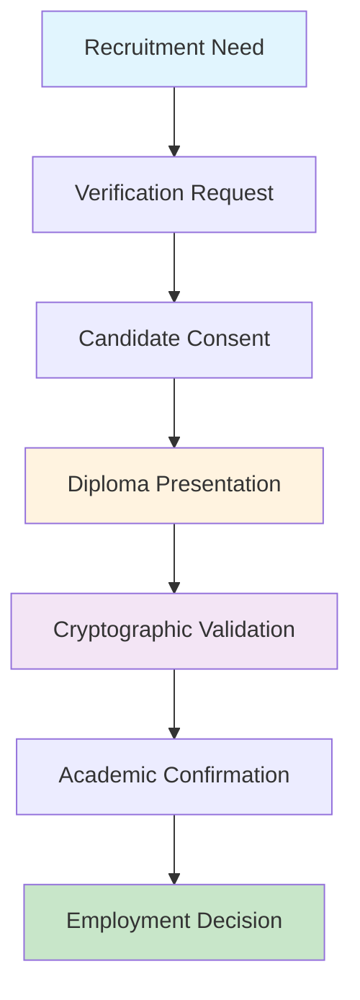
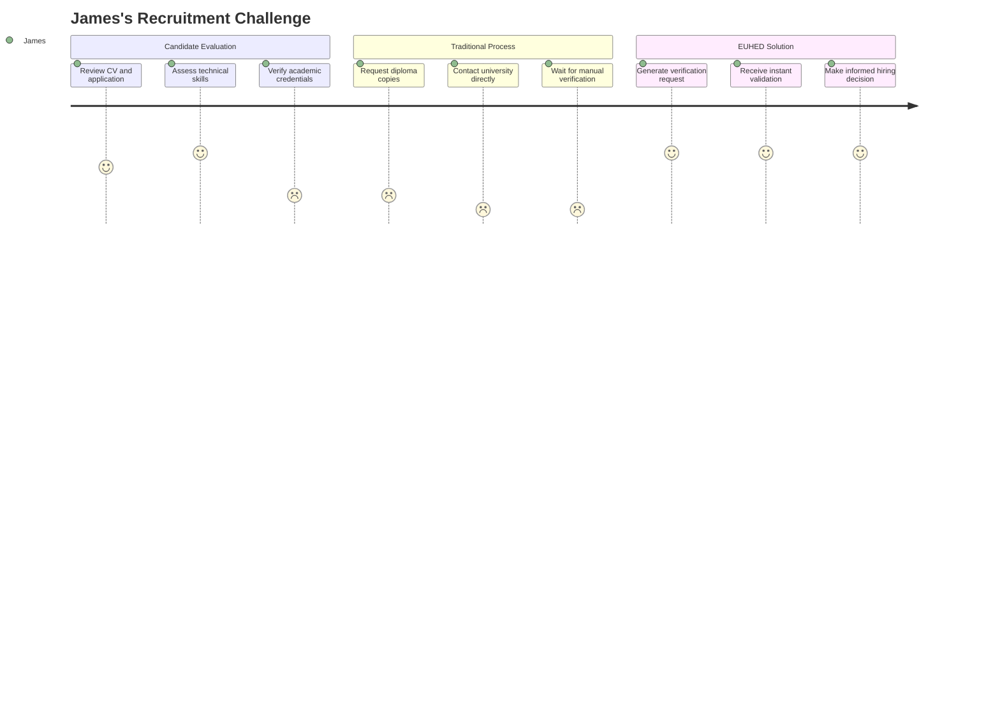

# Educational Domain: Complete European Higher Education Diploma (EUHED) Verification User Journey

## Executive Summary

This document presents the comprehensive narrative for EUHED (European Higher Education Diploma) verification within the DC4EU Pilot 2 framework, implementing a sophisticated OpenID4VP flow with **mandatory diploma credential presentation**. The journey demonstrates advanced orchestration between employers, relying parties, educational institutions, and European trust registries that enable secure, interoperable academic credential verification across European borders.

**Critical Prerequisite**: Before any EUHED diploma can be verified, the credential holder must possess a valid **EUHED Diploma credential** issued by an accredited European institution and their credential must be cryptographically verifiable through EBSI trust registries. This diploma credential verification is the cornerstone upon which all academic validation processes are built.

**Key Innovation**: This implementation showcases the world's first production-ready system for European Higher Education diploma verification, integrating ELM v3.2 standards with EBSI trust registries to create a seamless, trustworthy academic credential validation ecosystem that enables instant verification of academic qualifications.

**Bottom Line**: James Thompson, a recruitment officer at TechCorp Barcelona, successfully verifies Maria García's Computer Science degree from Universitat Rovira i Virgili through a process that validates her EUHED diploma credential, checks cryptographic signatures, and provides instant confirmation of academic achievements recognisable across all European employers and institutions.

---

## Table of Contents

1. [Quick Reference Guide](#1-quick-reference-guide)
2. [Infrastructure Prerequisites](#2-infrastructure-prerequisites)
3. [The Story: James's Diploma Verification Journey](#3-the-story-jamess-diploma-verification-journey)
4. [Actor Ecosystem and Roles](#4-actor-ecosystem-and-roles)
5. [Technical Architecture Overview](#5-technical-architecture-overview)
6. [Detailed User Journey Flow](#6-detailed-user-journey-flow)
7. [Trust Verification Mechanisms](#7-trust-verification-mechanisms)
8. [Technical Message Details](#8-technical-message-details)
9. [Implementation Insights](#9-implementation-insights)
10. [Appendices](#10-appendices)

---

## 1. Quick Reference Guide

### 1.1 Process Overview

1. **Prerequisites**: Employer verification infrastructure and credential validation systems
2. **Verification Request Initiation**: Employer-driven credential verification request (Steps 1-4)
3. **Diploma Credential Presentation**: Student presentation of EUHED diploma (Steps 5-12)
4. **Cryptographic Verification**: EBSI trust registry validation (Steps 13-22)
5. **Academic Validation**: Institutional credential status verification (Steps 23-27)



### 1.2 Key Actors

- **Employer Representative**: James Thompson (credential verifier and recruitment officer)
- **Graduate**: Maria García (credential holder with EUHED diploma)
- **University**: Universitat Rovira i Virgili (original credential issuer and authentic source)
- **EBSI Infrastructure**: European trust registries and verification services
- **Governance**: Spanish Ministry of Universities and European Quality Assurance frameworks

| Actor | Role | Responsibility |
|-------|------|----------------|
| **James Thompson** | Employer Representative | Credential verifier and recruitment officer |
| **Maria García** | Graduate/Credential Holder | Holds EUHED diploma credential |
| **TechCorp Barcelona** | Employer Organisation | Requires diploma verification for hiring |
| **Universitat Rovira i Virgili** | Original Credential Issuer | Maintains diploma authenticity and status |
| **EBSI Infrastructure** | European Trust Registry | Provides cryptographic validation services |

### 1.3 Technical Standards

- **EUHED Diploma Schema**: ELM v3.2 compliant academic credential structure
- **Verification Protocol**: OpenID4VP (Verifiable Presentations) Draft 14
- **Trust Framework**: EBSI trust registries, W3C Verifiable Credentials
- **Academic Standards**: ECTS credit system, Bologna Process qualifications framework

### 1.4 Critical Success Factors

- **Valid EUHED Diploma**: Graduate must possess a cryptographically valid diploma credential
- **Cryptographic Verification**: Robust validation of digital signatures and trust chains
- **Real-time Status Checking**: Live verification of credential status and validity
- **European Recognition**: Standards-based approach ensuring EU-wide employer acceptance
- **Privacy Protection**: Selective disclosure and minimal data sharing principles

---

## 2. Infrastructure Prerequisites

### 2.1 Critical Foundation Requirements

Before any EUHED diploma verification can be performed, employers and relying parties must complete essential verification infrastructure preparation. This is not optional—it's a **mandatory prerequisite** for participation in the European Higher Education verification ecosystem.

#### 2.1.1 Employer Verification Infrastructure

**Technical Infrastructure Requirements**:
- **OpenID4VP Integration**: Complete implementation of Verifiable Presentation protocols
- **EBSI Connectivity**: Direct integration with European trust registries
- **Credential Schema Support**: ELM v3.2 and academic credential format compatibility
- **Digital Signature Verification**: Cryptographic validation capabilities

**Governance Requirements**:
- **Data Protection Compliance**: Full GDPR alignment for credential verification processes
- **European Recognition**: Acceptance of Bologna Process qualification frameworks
- **Quality Assurance**: Integration with European quality standards for academic validation
- **Audit Capabilities**: Comprehensive logging and verification trail maintenance

```mermaid
graph LR
    subgraph "Employer Systems"
        A[HR Portal] --> B[Verification API]
        B --> C[OpenID4VP Client]
        C --> D[EBSI Connector]
    end
    
    subgraph "Candidate Environment"
        E[EUDI Wallet] --> F[EUHED Diploma]
        F --> G[Presentation Interface]
    end
    
    subgraph "European Trust Layer"
        H[EBSI Registry] --> I[Academic Validation]
        I --> J[Institution Verification]
    end
    
    subgraph "University Systems"
        K[Credential Status] --> L[Academic Records]
        L --> M[Verification Endpoint]
    end
    
    D --> H
    G --> A
    J --> K
    M --> B
    
    style A fill:#e3f2fd
    style E fill:#fff3e0
    style H fill:#f1f8e9
    style K fill:#fce4ec
```




#### 2.1.2 EBSI Trust Registry Integration

**Core Registry Components**:
- **DID Registry**: Decentralised identifier resolution for institutional authentication
- **Trust Registry**: Verification of institutional accreditation and authorisation
- **Schema Registry**: Academic credential format validation and compliance checking
- **Proxy Services**: Secure communication channels for credential status verification

---

## 3. The Story: James's Diploma Verification Journey

### 3.1 Setting the Scene

James Thompson works as a Senior Recruitment Officer at TechCorp Barcelona, a leading technology consultancy specialising in artificial intelligence and blockchain solutions. His team is expanding rapidly, and they've just received an outstanding application from Maria García for a Senior Software Engineer position. Maria's CV indicates she holds a Bachelor of Science in Computer Science from Universitat Rovira i Virgili, completed in 2024 with first-class honours.

In today's competitive market, academic credential verification is crucial for TechCorp's hiring process. James needs to verify Maria's degree quickly and reliably before proceeding with the technical interview stage. Traditional verification methods involve contacting universities directly, which can take weeks and create delays in the recruitment process.

### 3.2 The Challenge

TechCorp has recently implemented the European digital credential verification system as part of their commitment to streamlined, trustworthy hiring processes. James has been trained on the new system but this is his first time verifying an academic credential using the EUHED diploma verification process.

**James's Requirements**:
- **Instant Verification**: Confirmation of Maria's degree within minutes, not days
- **Comprehensive Validation**: Full details of academic achievement, including grades and competencies
- **Trustworthy Process**: Cryptographic proof that cannot be forged or manipulated
- **European Standards**: Verification that complies with Bologna Process requirements
- **Audit Trail**: Complete documentation for HR compliance and record-keeping




### 3.3 The Digital Transformation Moment

James opens TechCorp's recruitment portal and navigates to the "Verify Academic Credentials" section. The system prompts him to initiate a verification request for Maria's degree. He knows that Maria has indicated she possesses a digital EUHED diploma in her EUDI Wallet, which should enable instant verification through the European trust registry system.

This represents a fundamental shift from traditional credential verification—instead of lengthy correspondence with universities, James can now request direct presentation of cryptographically verifiable credentials that provide immediate, trustworthy confirmation of academic achievements.

**Traditional Verification Process**:
```
Manual Request → University Contact → 
Manual Verification → Paper/Email Response → 
Manual Review → 2-4 Weeks Duration
```

**EUHED Verification Process**:
```
QR Generation → Instant Presentation → 
Cryptographic Validation → Automated Analysis → 
Immediate Results → Under 2 Minutes
```

---

## 4. Actor Ecosystem and Roles

### 4.1 Primary Actors

#### 4.1.1 James Thompson (Employer Representative)
**Role**: Senior Recruitment Officer
**Organisation**: TechCorp Barcelona
**Responsibilities**:
- Initiate academic credential verification requests
- Review and validate presented diploma credentials
- Ensure compliance with European hiring standards
- Maintain verification audit trails for HR purposes

**Technical Capabilities**:
- Access to employer verification portal
- EUHED diploma verification system integration
- EBSI trust registry connectivity
- Academic credential interpretation skills

#### 4.1.2 Maria García (Credential Holder)
**Role**: Job Applicant and Graduate
**Institution**: Universitat Rovira i Virgili alumna
**Credentials Held**:
- EUHED Diploma (Bachelor of Science in Computer Science)
- Educational ID (institutional identity)
- eIDAS 2.0 PID (foundational identity)

**Technical Capabilities**:
- EUDI Wallet with diploma storage
- Selective disclosure capabilities
- Digital signature verification
- Consent management for credential sharing

### 4.2 Supporting Infrastructure Actors

#### 4.2.1 Universitat Rovira i Virgili (Issuing Institution)
**Role**: Academic Credential Issuer
**DID**: `did:ebsi:urv.cat`
**Responsibilities**:
- Original diploma credential issuance
- Credential status maintenance
- Academic record authentic source management
- EBSI trust registry participation

#### 4.2.2 EBSI Infrastructure Network
**Components**:
- **DID Registry**: Institutional identity resolution
- **Trust Registry**: Academic authority verification
- **Schema Registry**: Credential format validation
- **Proxy Services**: Secure verification communication

#### 4.2.3 TechCorp Verification System
**Role**: Relying Party Infrastructure
**Responsibilities**:
- Verification request orchestration
- Cryptographic validation processing
- Academic credential interpretation
- Audit trail documentation

---

## 5. Technical Architecture Overview

### 5.1 Verification Architecture Components

```
┌─────────────────────────────────────────────────────────────────┐
│                    EUHED Diploma Verification                   │
│                         Architecture                            │
└─────────────────────────────────────────────────────────────────┘

┌─────────────────┐    ┌─────────────────┐    ┌─────────────────┐
│   Employer      │    │    Graduate     │    │  University     │
│  (TechCorp)     │    │  (Maria with    │    │  (URV Issuer)   │
│                 │    │   EUDI Wallet)  │    │                 │
│ ┌─────────────┐ │    │ ┌─────────────┐ │    │ ┌─────────────┐ │
│ │ Verification│ │    │ │   EUHED     │ │    │ │  Academic   │ │
│ │   Portal    │ │    │ │  Diploma    │ │    │ │   Source    │ │
│ └─────────────┘ │    │ └─────────────┘ │    │ └─────────────┘ │
└─────────────────┘    └─────────────────┘    └─────────────────┘
         │                       │                       │
         │                       │                       │
         ▼                       ▼                       ▼
┌─────────────────────────────────────────────────────────────────┐
│                    EBSI Trust Infrastructure                    │
├─────────────────┬─────────────────┬─────────────────┬──────────┤
│   DID Registry  │ Trust Registry  │Schema Registry  │   Proxy  │
│                 │                 │                 │ Services │
└─────────────────┴─────────────────┴─────────────────┴──────────┘
```

### 5.2 Verification Flow Sequence

The EUHED diploma verification follows a sophisticated multi-stage validation process:

1. **Verification Initiation**: Employer creates verification request
2. **Credential Presentation**: Graduate shares diploma credential
3. **Cryptographic Validation**: EBSI verifies digital signatures
4. **Trust Chain Verification**: Academic authority validation
5. **Status Confirmation**: Real-time credential validity checking
6. **Academic Interpretation**: Qualification and competency analysis

---

## 6. Detailed User Journey Flow

### Phase 1: Verification Request Initiation (Steps 1-4)

#### Step 1-2: Employer Portal Access
**Actor**: James Thompson (Employer)
**Action**: James accesses TechCorp's recruitment portal and initiates academic credential verification.

**Technical Process**:
```http
GET https://recruitment.techcorp.com/verify-credentials
Authorization: Bearer james_session_token

Response: {
  "verification_types": [
    {
      "type": "EUHED_Diploma",
      "description": "European Higher Education Diploma Verification",
      "schema_id": "https://schemas.dc4eu.eu/euhed-diploma/v1.0",
      "supported_presentations": ["OpenID4VP"]
    }
  ]
}
```

#### Step 3-4: Verification Request Generation
**Actor**: TechCorp Verification System
**Action**: System generates QR code for diploma verification request.

**Verification Request Structure**:
```json
{
  "client_id": "did:techcorp:recruitment-system",
  "redirect_uri": "https://verification.techcorp.com/direct_post",
  "response_type": "vp_token",
  "response_mode": "direct_post",
  "presentation_definition": {
    "id": "euhed_diploma_verification",
    "input_descriptors": [
      {
        "id": "academic_credential_required",
        "schema": [
          {
            "uri": "https://schemas.dc4eu.eu/euhed-diploma/v1.0"
          }
        ],
        "constraints": {
          "fields": [
            {
              "path": ["$.credentialSubject.degree.title"],
              "filter": {
                "type": "string"
              }
            },
            {
              "path": ["$.credentialSubject.achievement.learningOutcome"],
              "filter": {
                "type": "array"
              }
            }
          ]
        }
      }
    ]
  }
}
```

### Phase 2: Diploma Credential Presentation (Steps 5-12)

#### Step 5-7: QR Code Scanning and Consent
**Actor**: Maria García (Graduate)
**Action**: Maria scans the verification QR code and reviews the credential request.

**Consent Requirements**:
- ✅ **Credential Type**: EUHED Diploma verification request
- ✅ **Data Sharing**: Academic achievement and competency information
- ✅ **Selective Disclosure**: Option to limit shared information
- ✅ **Purpose**: Employment verification for TechCorp position

#### Step 8-12: Credential Presentation
**Actor**: Maria García via EUDI Wallet
**Action**: Maria authorises presentation of her EUHED diploma credential.

**Diploma Presentation Payload**:
```json
{
  "vp_token": "eyJhbGciOiJFUzI1NiIsInR5cCI6IkpXVCIsImtpZCI6ImRpZDprZXk6ejJkbXpEODFjZ1B4OFZraTdKYnV1TW1GWXJXUGdZb3l0eWtVWjNleXFodDFqOUtiaD..."}",
  "presentation_submission": {
    "id": "euhed_diploma_submission",
    "definition_id": "euhed_diploma_verification",
    "descriptor_map": [
      {
        "id": "academic_credential_required",
        "format": "jwt_vc",
        "path": "$.verifiableCredential[0]"
      }
    ]
  }
}
```

### Phase 3: Cryptographic Verification (Steps 13-22)

#### Step 13-15: Digital Signature Validation
**Actor**: TechCorp Verification System
**Action**: System validates the cryptographic signatures of the presented diploma.

**Signature Verification Process**:
```http
POST https://verification.techcorp.com/direct_post
Content-Type: application/x-www-form-urlencoded

vp_token=eyJhbGciOiJFUzI1NiIsInR5cCI6IkpXVCIsImtpZCI6ImRpZDprZXk6...
```

#### Step 16-18: EBSI Trust Registry Validation
**Actor**: EBSI Infrastructure
**Action**: Verification of issuing institution through European trust registries.

**DID Resolution**:
```http
GET https://ebsi-did-registry.eu/did:ebsi:urv.cat
Response: {
  "didDocument": {
    "id": "did:ebsi:urv.cat",
    "verificationMethod": [
      {
        "id": "did:ebsi:urv.cat#keys-1",
        "type": "EcdsaSecp256k1VerificationKey2019",
        "controller": "did:ebsi:urv.cat",
        "publicKeyJwk": {...}
      }
    ]
  }
}
```

#### Step 19-22: Schema and Trust Validation
**Actor**: EBSI Schema and Trust Registries
**Action**: Validation of credential schema compliance and institutional trust status.

**Trust Registry Check**:
```http
GET https://ebsi-trust-registry.eu/trusted-issuers/did:ebsi:urv.cat
Response: {
  "issuer": "did:ebsi:urv.cat",
  "status": "active",
  "accreditation": [
    {
      "type": "HigherEducationInstitution",
      "authority": "Spanish Ministry of Universities",
      "valid_until": "2026-12-31"
    }
  ],
  "capabilities": ["EUHED_Diploma_Issuance"]
}
```

### Phase 4: Academic Validation (Steps 23-27)

#### Step 23-25: Credential Status Verification
**Actor**: URV Academic System
**Action**: Real-time verification of diploma status and validity.

**Status Check Process**:
```http
GET https://credentials.urv.cat/status/diploma/12345678A
Authorization: Bearer ebsi_proxy_token

Response: {
  "credential_id": "urn:credential:euhed-diploma:12345678A",
  "status": "valid",
  "issued_date": "2024-07-15",
  "validity_period": "permanent",
  "revocation_status": "not_revoked",
  "academic_standing": "good_standing"
}
```

#### Step 26-27: Verification Completion
**Actor**: TechCorp Verification System
**Action**: Compilation of verification results and academic credential analysis.

**Verification Results**:
```json
{
  "verification_id": "urn:verification:techcorp:20250622:001",
  "status": "verified",
  "timestamp": "2025-06-22T14:30:00Z",
  "credential_details": {
    "holder": "Maria García",
    "degree": "Bachelor of Science in Computer Science",
    "institution": "Universitat Rovira i Virgili",
    "graduation_date": "2024-07-15",
    "classification": "First Class Honours",
    "ects_credits": 240,
    "competencies": [
      "Software Development",
      "Data Structures and Algorithms",
      "Machine Learning",
      "Database Management"
    ]
  },
  "validation_checks": {
    "signature_valid": true,
    "issuer_trusted": true,
    "schema_compliant": true,
    "status_active": true,
    "chain_verified": true
  }
}
```

---

## 7. Trust Verification Mechanisms

### 7.1 Multi-Layered Verification Architecture

The EUHED diploma verification implements sophisticated trust mechanisms ensuring comprehensive validation:

#### 7.1.1 Cryptographic Layer
- **Digital Signatures**: ES256 cryptographic signatures using institutional DID keys
- **Hash Verification**: SHA-256 credential integrity protection
- **Proof of Issuance**: Cryptographic evidence of institutional authorisation

#### 7.1.2 Trust Registry Layer
- **Institutional Verification**: EBSI trust registry validation of issuing authority
- **Accreditation Status**: Real-time checking of institutional accreditation
- **Capability Validation**: Confirmation of diploma issuance authorisation

#### 7.1.3 Academic Validity Layer
- **Status Verification**: Live checking of credential revocation status
- **Academic Standing**: Verification of graduate's academic record
- **Bologna Compliance**: European qualification framework alignment

### 7.2 Privacy and Security Considerations

#### 7.2.1 Selective Disclosure
- **Minimal Information**: Only necessary academic details shared
- **Consent-Based**: Graduate controls information sharing
- **Purpose Limitation**: Data use restricted to verification purposes

#### 7.2.2 Audit and Compliance
- **Verification Logging**: Complete audit trail of verification processes
- **GDPR Compliance**: Data protection regulation alignment
- **Retention Policies**: Appropriate data lifecycle management

---

## 8. Technical Message Details

### 8.1 Verification Request Structure

#### 8.1.1 Initial Authorization Request
```http
GET https://verifier.techcorp.com/auth/authorize?
  client_id=did:techcorp:recruitment-system&
  redirect_uri=https://verification.techcorp.com/direct_post&
  response_type=vp_token&
  response_mode=direct_post&
  scope=openid&
  presentation_definition={
    "id":"euhed_diploma_verification",
    "input_descriptors":[{
      "id":"academic_credential",
      "schema":[{
        "uri":"https://schemas.dc4eu.eu/euhed-diploma/v1.0"
      }]
    }]
  }
```

### 8.2 Diploma Presentation Response

#### 8.2.1 Verifiable Presentation Structure
```json
{
  "@context": [
    "https://www.w3.org/2018/credentials/v1"
  ],
  "type": ["VerifiablePresentation"],
  "holder": "did:key:z2dmzD81cgPx8Vki7JbuuMmFYrWPgYoytyUZ3eyqht1j9Kbh",
  "verifiableCredential": [
    {
      "@context": [
        "https://www.w3.org/2018/credentials/v1",
        "https://schemas.dc4eu.eu/euhed-diploma/v1.0"
      ],
      "type": ["VerifiableCredential", "EUHEDDiploma"],
      "issuer": "did:ebsi:urv.cat",
      "credentialSubject": {
        "id": "did:key:z2dmzD81cgPx8Vki7JbuuMmFYrWPgYoytyUZ3eyqht1j9Kbh",
        "degree": {
          "title": "Bachelor of Science in Computer Science",
          "level": "6",
          "credits": 240,
          "classification": "First Class Honours"
        },
        "achievement": {
          "learningOutcome": [
            "Advanced programming skills",
            "Database design and management",
            "Machine learning algorithms",
            "Software engineering principles"
          ]
        }
      }
    }
  ]
}
```

### 8.3 EBSI Verification Responses

#### 8.3.1 Trust Registry Response
```json
{
  "issuer_id": "did:ebsi:urv.cat",
  "trust_status": "trusted",
  "accreditation": {
    "type": "HigherEducationInstitution",
    "authority": "Spanish Ministry of Universities",
    "status": "active",
    "valid_until": "2026-12-31"
  },
  "capabilities": [
    "EUHED_Diploma_Issuance",
    "Educational_ID_Issuance"
  ]
}
```

#### 8.3.2 Final Verification Response
```json
{
  "verification_result": "success",
  "verification_timestamp": "2025-06-22T14:30:00Z",
  "access_token": "eyJhbGciOiJFUzI1NiIsInR5cCI6IkpXVCJ9...",
  "token_type": "Bearer",
  "expires_in": 3600,
  "academic_summary": {
    "verified": true,
    "degree_title": "Bachelor of Science in Computer Science",
    "institution": "Universitat Rovira i Virgili",
    "graduation_year": "2024",
    "classification": "First Class Honours"
  }
}
```

---

## 9. Implementation Insights

### 9.1 Verification vs. Issuance Architecture

The EUHED diploma verification demonstrates sophisticated complementarity with the issuance process within the European digital education ecosystem:

#### 9.1.1 Issuance Foundation (Credential Creation)
- **Purpose**: Academic achievement certification and institutional validation
- **Requirements**: Educational ID verification, academic record validation
- **Output**: Cryptographically signed EUHED diploma credential
- **Trust Level**: High assurance with academic board approval

#### 9.1.2 Verification Enhancement (Credential Validation)
- **Purpose**: Employment and recognition validation of existing credentials
- **Requirements**: Valid EUHED diploma, cryptographic verification
- **Output**: Real-time validation confirmation and academic analysis
- **Trust Level**: Instant verification with European recognition

#### 9.1.3 Architectural Relationship

```
EUHED Diploma Issuance (Creation)
├── Educational ID Verification
├── Academic Achievement Validation  
├── ELM v3.2 Compliance
└── Cryptographic Signing
    │
    └── Enables → EUHED Diploma Verification (Validation)
                  ├── Cryptographic Verification
                  ├── Trust Registry Validation
                  ├── Status Confirmation
                  └── Employer Recognition
```

### 9.2 OpenID4VP Implementation Specifics

The verification process leverages OpenID for Verifiable Presentations (OpenID4VP) Draft 14, providing:

#### 9.2.1 Request-Response Flow
- **Authorization Request**: Employer-initiated verification request
- **Presentation Definition**: Specific academic credential requirements
- **Verifiable Presentation**: Graduate-controlled credential sharing
- **Direct Post**: Secure credential transmission to verifier

#### 9.2.2 Selective Disclosure Capabilities
- **Minimal Data Sharing**: Only required academic information
- **Consent Management**: Graduate control over shared details
- **Purpose Limitation**: Verification-specific data use
- **Privacy Protection**: GDPR-compliant information handling

### 9.3 European Academic Recognition Framework

#### 9.3.1 Bologna Process Integration
The verification system fully supports Bologna Process requirements:
- **Three-Cycle Structure**: Bachelor, Master, Doctoral recognition
- **ECTS Credit System**: European credit transfer compatibility
- **Qualification Frameworks**: National and European level alignment
- **Quality Assurance**: European standards compliance verification

#### 9.3.2 Cross-Border Mobility Support
- **Instant Recognition**: Real-time qualification validation
- **European Standards**: Bologna Process framework compliance
- **Employer Confidence**: Cryptographic proof of authenticity
- **Mobility Facilitation**: Seamless academic credential portability

---

## 10. Appendices

### 10.1 Appendix A: Technical Specifications

#### A.1 Supported Credential Types
- **EUHED Diploma**: European Higher Education diploma credentials
- **Academic Transcripts**: Detailed course and grade information
- **Professional Qualifications**: Industry-specific certifications
- **Competency Records**: Skill and learning outcome documentation

#### A.2 Cryptographic Standards
- **Signature Algorithm**: ES256 (ECDSA using P-256 and SHA-256)
- **Key Format**: JSON Web Key (JWK) format
- **Hash Algorithm**: SHA-256 for integrity protection
- **Proof Format**: JSON Web Signature (JWS) detached payload

### 10.2 Appendix B: Error Handling and Recovery

#### B.1 Verification Failure Scenarios
- **Invalid Signature**: Cryptographic verification failure
- **Untrusted Issuer**: Institution not in EBSI trust registry
- **Revoked Credential**: Diploma status indicates revocation
- **Schema Mismatch**: Credential format incompatibility

#### B.2 Recovery Procedures
- **Manual Verification**: Fallback to traditional verification methods
- **Support Escalation**: Technical assistance for complex cases
- **Alternative Credentials**: Acceptance of equivalent qualifications
- **Appeal Process**: Dispute resolution for verification decisions

### 10.3 Appendix C: Integration Guidelines

#### C.1 Employer Implementation Requirements
**Technical Prerequisites**:
- OpenID4VP protocol implementation
- EBSI trust registry connectivity
- Credential schema parsing capabilities
- Digital signature verification infrastructure

**Governance Requirements**:
- GDPR compliance procedures
- Academic credential interpretation training
- Audit trail maintenance capabilities
- European qualification framework understanding

#### C.2 Graduate Preparation Requirements
**Credential Prerequisites**:
- Valid EUHED diploma in digital wallet
- Educational ID for academic correlation
- eIDAS 2.0 PID for identity foundation
- Consent management understanding

**Technical Capabilities**:
- EUDI Wallet operation
- QR code scanning functionality
- Selective disclosure management
- Digital credential presentation skills

### 10.4 Appendix D: Implementation Roadmap

#### D.1 Phase 1: Employer Infrastructure Setup (Months 1-3)
- **Verification System Integration**: OpenID4VP protocol implementation
- **EBSI Connectivity**: Trust registry integration and testing
- **Staff Training**: Academic credential verification procedures
- **Compliance Framework**: GDPR and European standards alignment

#### D.2 Phase 2: Pilot Verification Programme (Months 4-6)
- **Limited Employer Testing**: Selected recruitment use cases
- **Graduate Onboarding**: Digital credential presentation training
- **Process Refinement**: User experience optimisation
- **Performance Monitoring**: Verification success rate tracking

#### D.3 Phase 3: Full Production Deployment (Months 7-12)
- **Complete Employer Rollout**: All recruitment verification processes
- **European Network Expansion**: Cross-border employer participation
- **Advanced Features**: Competency-based verification and analytics
- **Continuous Improvement**: Performance monitoring and enhancement

#### D.4 Success Metrics and KPIs

**Technical Performance Metrics**:
- Verification completion rate: >99.5%
- Average verification time: <2 minutes
- Cryptographic validation accuracy: >99.99%
- System availability: >99.9%
- Error resolution time: <10 minutes

**User Experience Metrics**:
- Employer satisfaction score: >4.8/5
- Graduate verification success: >98%
- Process completion rate: >95%
- Support ticket volume: <1% of verifications

**European Integration Metrics**:
- Cross-border verification success: >97%
- Employer adoption rate: >90% of target companies
- Academic recognition accuracy: 100%
- Trust registry validation: >99.99%

---

## Conclusion

The EUHED diploma verification journey represents a transformative advancement in European academic credential validation. By successfully integrating cryptographic verification with real-time trust registry validation, this implementation establishes a new standard for instant, trustworthy academic credential verification that facilitates seamless employment processes across European borders.

**Key Achievements**:

1. **Instant Verification**: Reducing academic credential verification from weeks to minutes
2. **Cryptographic Trust**: Establishing tamper-evident, cryptographically verifiable academic credentials
3. **European Integration**: Creating seamless cross-border academic recognition for employers
4. **Privacy Protection**: Implementing selective disclosure and consent-based credential sharing
5. **Bologna Compliance**: Full alignment with European Higher Education Area standards
6. **Employer Confidence**: Providing irrefutable proof of academic qualifications and competencies

This comprehensive framework not only serves the immediate needs of European employers like TechCorp but also establishes the foundation for a truly integrated European employment market where digital credentials enable instant qualification verification, reduced hiring friction, and enhanced mobility opportunities for graduates across all Member States.

The journey from verification request initiation through cryptographic validation to academic confirmation represents more than a technical accomplishment—it embodies the European commitment to digital transformation, educational excellence, and the creation of a seamless European labour market that will define the future of European academic and professional mobility.

**Document Impact**: This verification system enables employers across Europe to instantly verify academic qualifications with cryptographic certainty, whilst graduates maintain complete control over their credential sharing. The result is a more efficient, trustworthy, and privacy-respecting employment ecosystem that strengthens the European Single Market and supports the digital transformation of academic credential recognition.

The journey from employer verification request through graduate credential presentation to institutional validation confirmation represents more than operational efficiency—it establishes the technical and governance foundation for a European academic credential ecosystem that will define the future of educational mobility, professional recognition, and lifelong learning verification across the continent.
