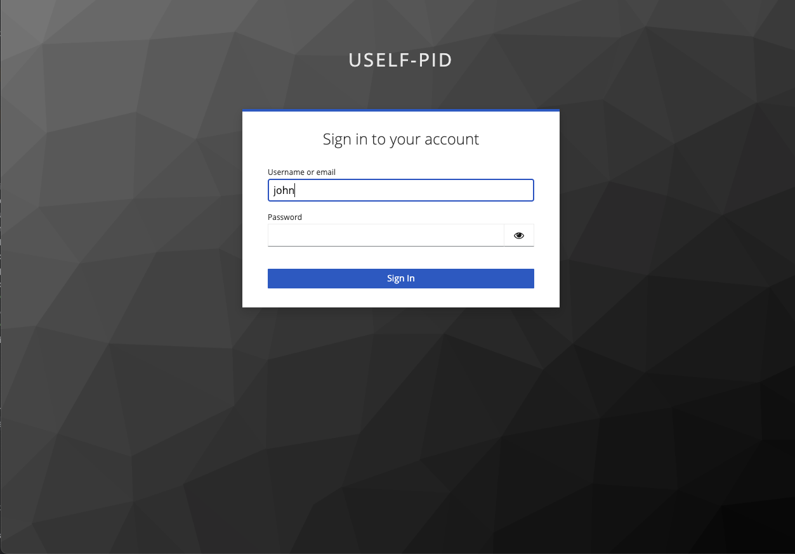
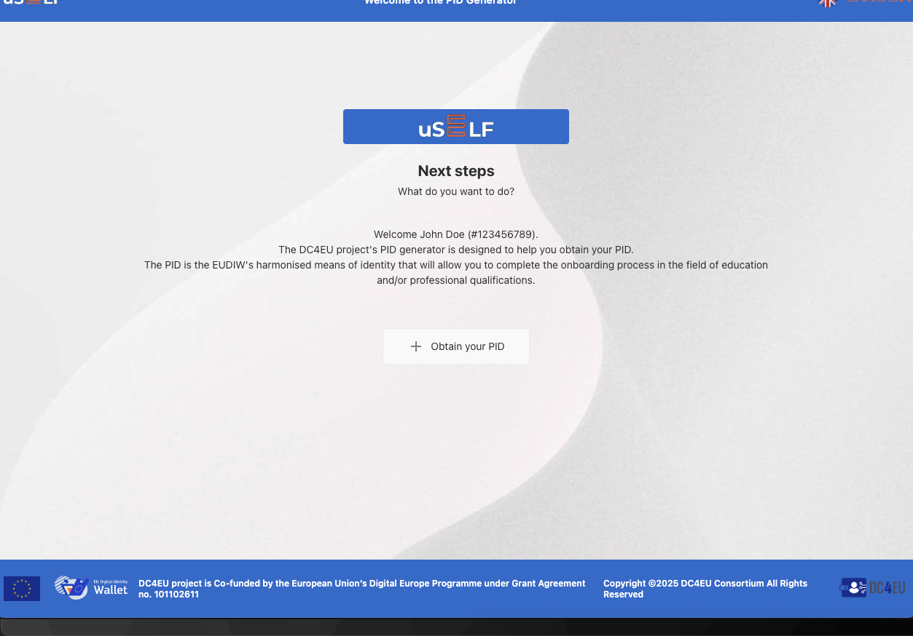
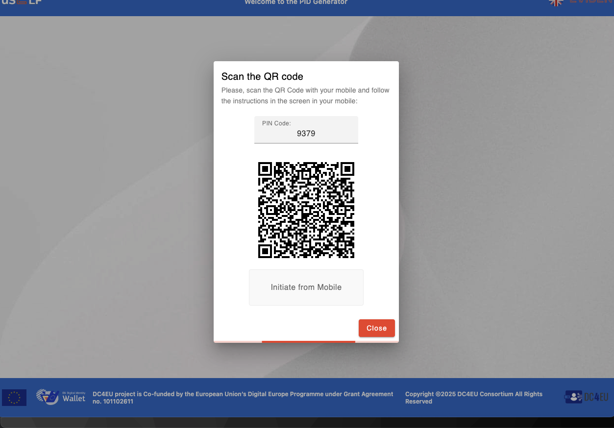
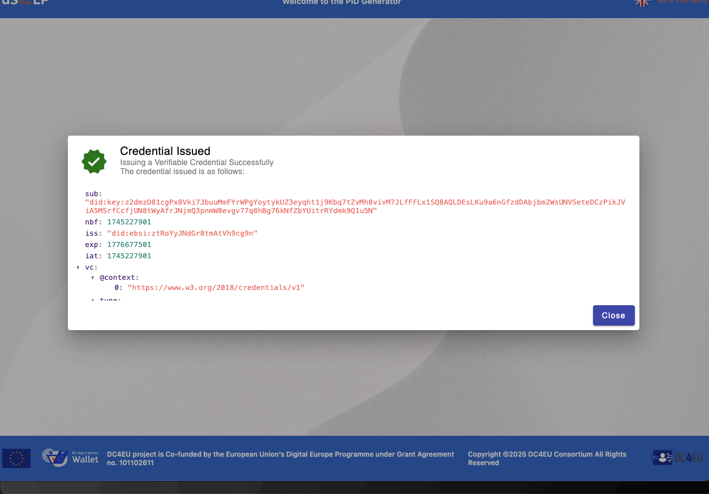

# PID Generator GUI for DC4EU

The **PID Generator** is a graphical user interface developed by **Atos** for the **DC4EU** project under Work Package 5 (Education and Professional Qualifications). It is designed to simulate obtaining a **Person Identification Data (PID)** in compliance with eIDAS 2.0, the EUDI Wallet ecosystem, and the W3C Verifiable Credentials standard.

## Key Features

### 1. Identify the Student for obtaining a PID issuing a username and password

The student needs to introduce his/her credentials in order to get identify by the system

### 2. The system show a welcome message for the student

By clicking in `+ Obtain your PID` button the system generated a QRCode with a credential offer for obtaining a PID with the mobile 

### 3. Generate QRCode for allowing to the student to obtain his/her PID

Using the mobile app, the student can read the QRCode for obtaining the PID

### 4. Shows the resume of the verifiable credential store in the student mobile application

Where the student can see the summary of the obtained the issued PID stored within the student mobile app.

## Related EU Strategies and Standards

The **PID Generator** aligns with:

- [eIDAS 2.0 Regulation](https://digital-strategy.ec.europa.eu/en/policies/eidas-regulation)
- [EUDI Wallet Architecture Reference Framework](https://ec.europa.eu/newsroom/dae/redirection/document/90784)
- [W3C Verifiable Credentials](https://www.w3.org/TR/vc-data-model/)
- [European Blockchain Services Infrastructure (EBSI)](https://ec.europa.eu/cefdigital/wiki/display/CEFDIGITAL/EBSI)

## License and Funding

Developed within the **DC4EU** project, co-funded by the **European Union’s Digital Europe Programme** under Grant Agreement No. **101102611**.
