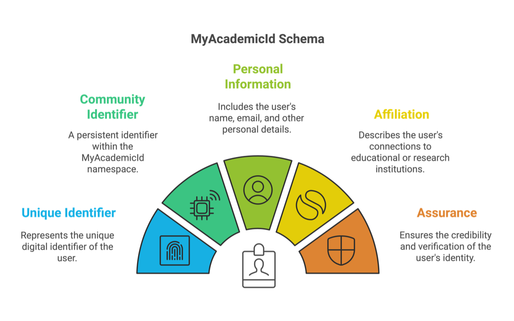
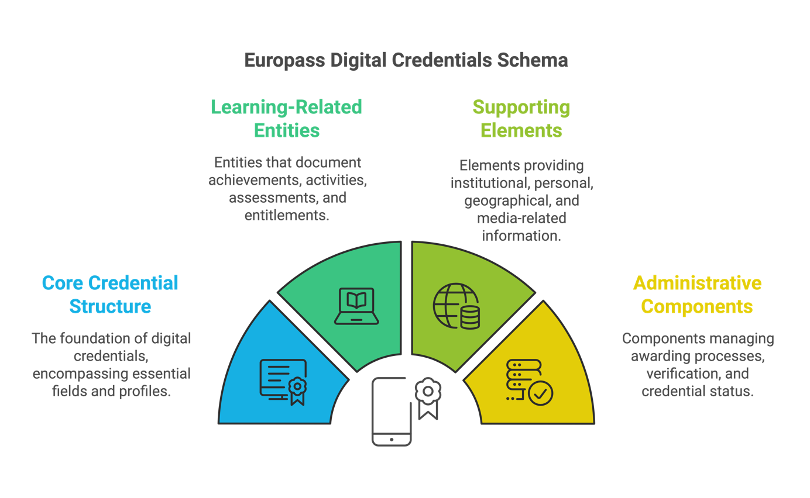
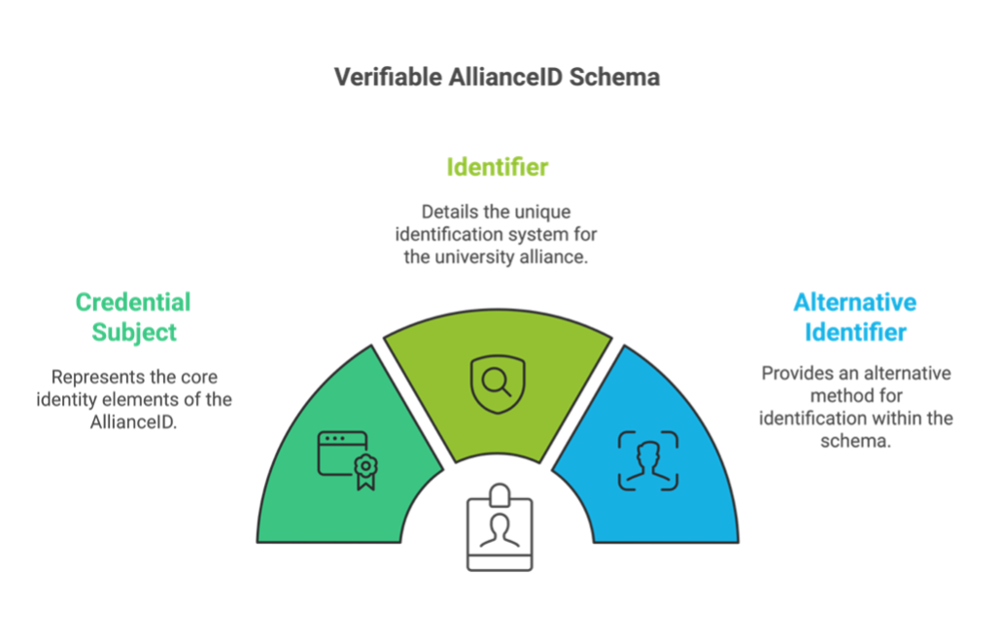
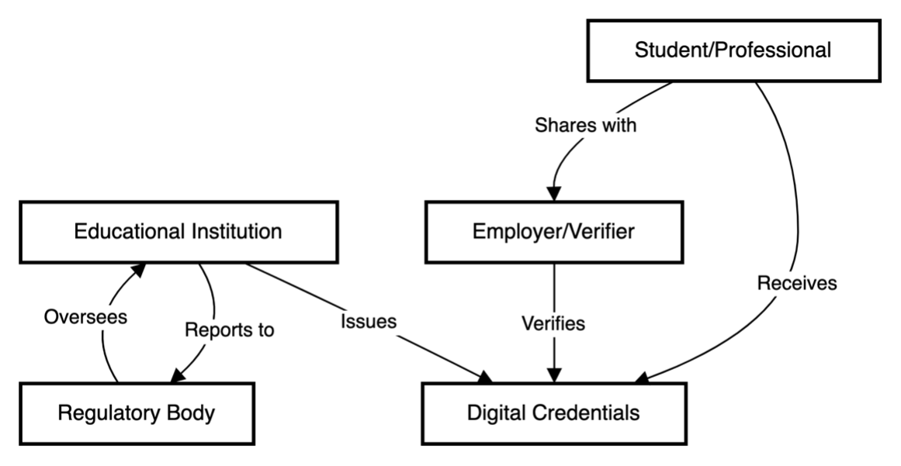
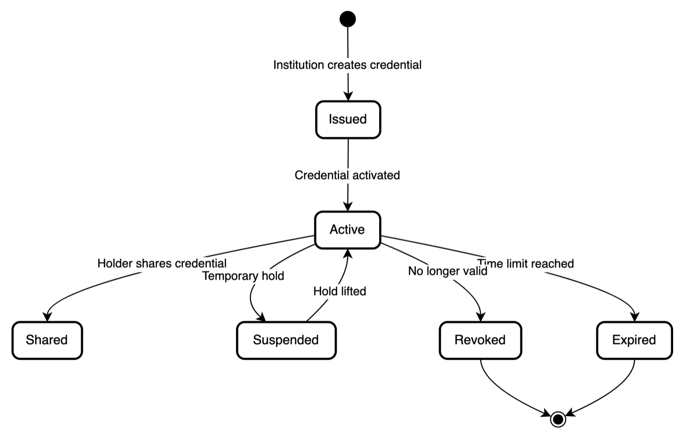
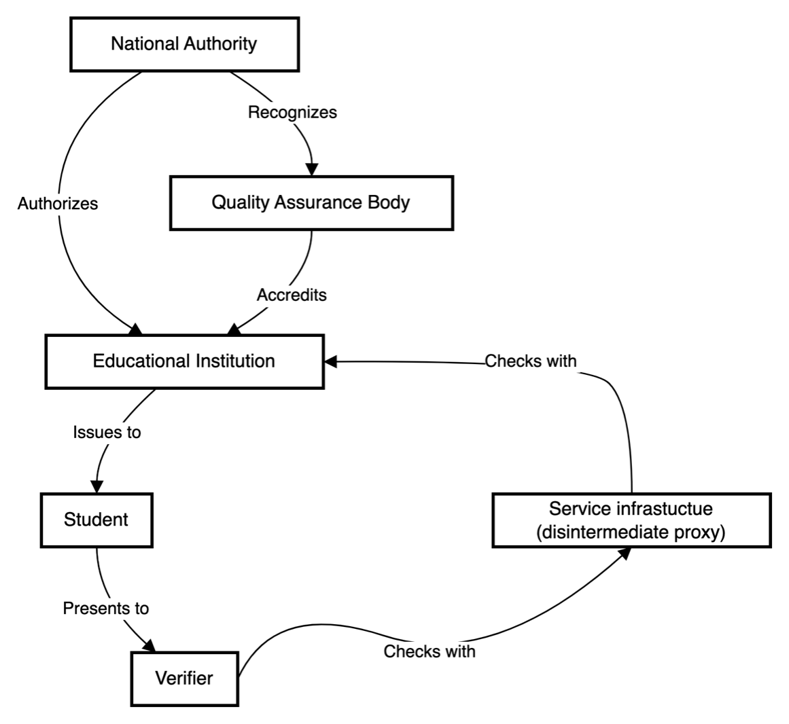
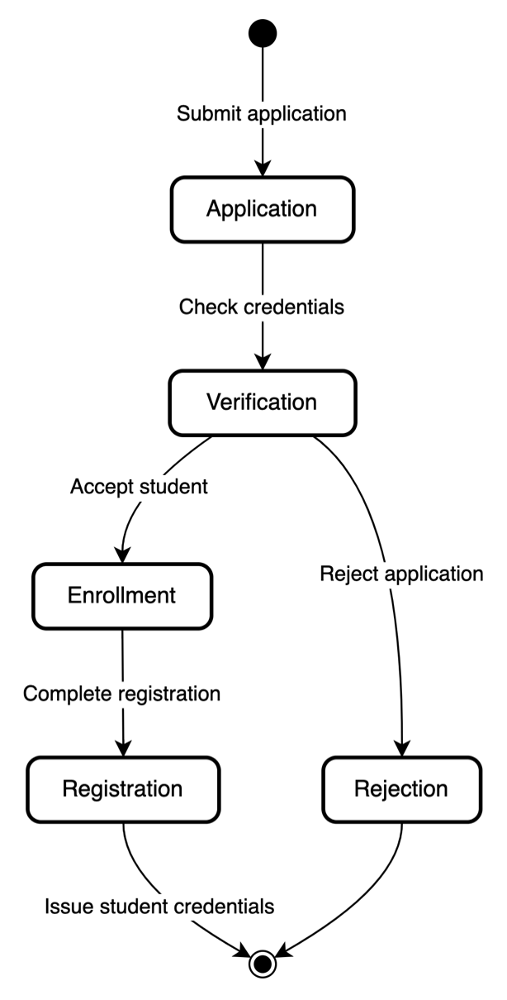
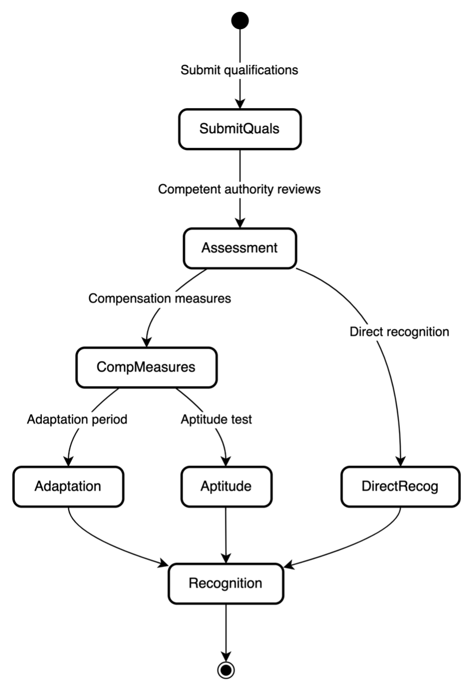
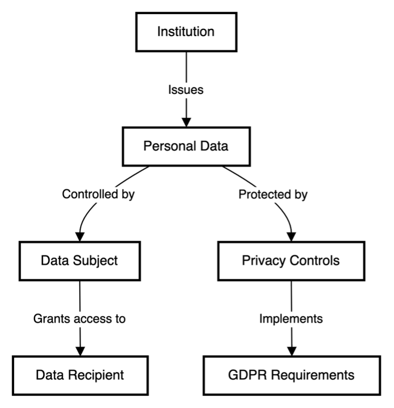

## Annex B: Technical diagrams and business flows

This annex provides visual representations of key business processes and relationships within the European educational credentialing ecosystem\. Each diagram emphasizes operational flows and organizational relationships while avoiding technical implementation details\.

1\. Core Ecosystem Components

This diagram provides a visual representation of the core components essential for implementing the DC4EU framework in educational and professional credentialing\. It includes foundational elements required for decentralised trust management, and how they interrelate within the broader ecosystem\. 

1\.1 Stakeholder Interaction Model

This diagram maps the core interactions between main participants in the digital credentials ecosystem\. It demonstrates how credentials flow from educational institutions to students, how these credentials are shared with employers, and how regulatory oversight maintains system integrity\. The model emphasizes the bi\-directional nature of trust relationships and verification processes\. This model serves as a framework for understanding each stakeholder’s responsibilities and how they collaborate to maintain the integrity and trustworthiness of digital credentials across the EU\. It highlights interaction pathways that support compliance, data privacy, and streamlined user experiences

1\.2 Credential Lifecycle

This diagram presents the complete lifecycle of a digital credential from issuance through various possible states including active use, suspension, expiration, and revocation\. It illustrates all possible status transitions and demonstrates how credentials are managed throughout their lifetime\.

2\. Trust Relationships

2\.1 Trust Network Structure

This diagram outlines how trust is established and maintained between different organizations\. It shows the hierarchical relationships between national authorities, educational institutions, and quality assurance bodies, demonstrating how trust flows enable credential verification and recognition\.

2\.2 Cross\-Border Recognition Flow

This visualization demonstrates how credentials are recognized across national borders\. It maps the interaction between home institutions, host country authorities, and European qualification frameworks, showing the process flow for international credential recognition\.

3\. Business Process Flows

3\.1 Student Enrollment Process

This diagram outlines the enrollment journey from initial application through credential verification to successful registration\. It identifies key decision points, verification steps, and the final issuance of student credentials, showing how digital systems streamline traditional processes\.

3\.2 Professional Qualification Recognition

This diagram maps the various pathways for recognizing professional qualifications across borders\. It shows assessment processes, compensation measures where needed, and the steps to achieve full recognition, illustrating how digital credentials facilitate professional mobility\.

4\. Data Protection and Privacy

4\.1 Personal Data Flow Controls

This diagram illustrates how personal data is protected throughout the credential ecosystem\. It shows control points, authorization flows, and privacy protection measures, demonstrating compliance with data protection requirements while maintaining system functionality\.

4\.2 Data Minimization Principle

This diagram demonstrates how the principle of data minimization is implemented in credential sharing\. It shows how credentials can be filtered to share only essential information based on specific needs, supporting privacy while enabling verification\.

5\. Implementation Guidelines

5\.1 Phased Adoption Model

This diagram presents a structured approach to implementing digital credentials\. It shows the progression from basic digital documentation through to full system integration, illustrating how organizations can manage the transition in controlled stages\.

5\.2 Integration Patterns

This diagram shows how new digital credential systems can be integrated with existing educational management systems\. It demonstrates the interfaces between legacy and new systems, showing how organizations can maintain continuity while modernizing their credential management\. This model supports stakeholders in identifying integration best practices that enhance system resilience and operational efficiency\.

