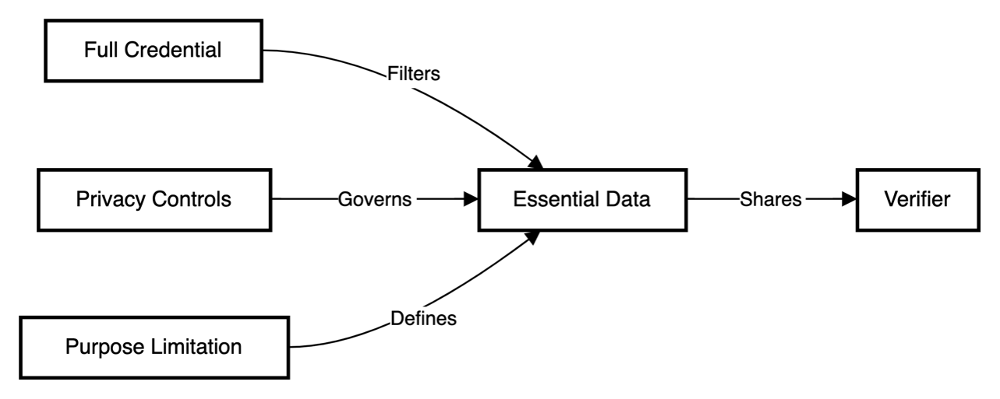
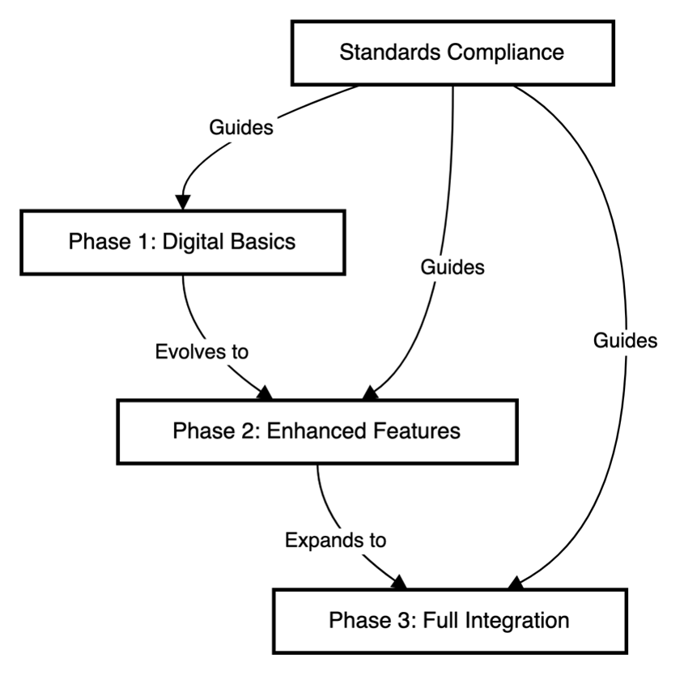
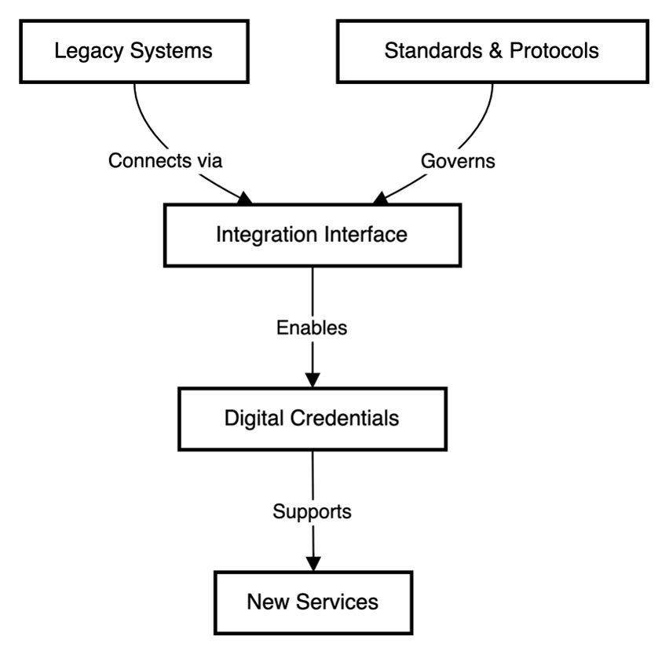
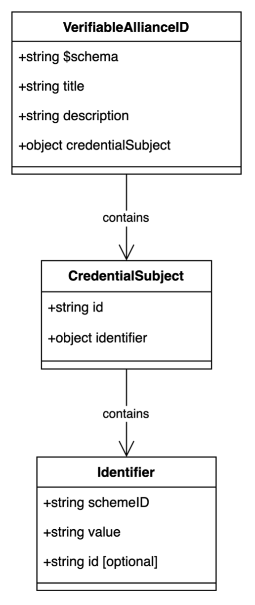

## Annex C: Data models

#### Introduction

Standardized data models are fundamental building blocks in modern information systems, providing a consistent framework for data organization, storage, and exchange across different platforms and applications\. Their implementation offers several key benefits:

1. Interoperability: Standardized data models enable seamless integration between different systems and stakeholders, reducing the complexity of data exchange and integration processes\.
2. Data Quality: By establishing uniform data structures and relationships, these models help maintain data consistency and reduce errors that often arise from disparate data formats\.
3. Efficiency: Development and maintenance costs are significantly reduced as standardized models eliminate the need for custom data mapping and transformation between systems\.
4. Scalability: As organizations grow and evolve, standardized data models provide a stable foundation for system expansion and modification\.

#### Structure and navigation

This chapter presents four essential data models that form the backbone of our information architecture\. Each model is designed to address specific business needs while maintaining consistency with the overall system architecture described in previous sections\.

The data models covered in this chapter are:

1. AllianceID Data Model
2. Educational ID Data Model
3. MyAcademicId Data Model
4. European Learning Model \(ELM\) Data Model

Each data model section includes:

- Purpose and scope
- Entity relationships
- Attribute definitions
- Implementation considerations

#### Relationship to Previous Sections

The data models presented in this annex build upon and support the concepts, requirements, and frameworks established in previous sections:

- Connection to Chapter 2: European Education Landscape
	- The data models accommodate the diverse approaches to educational licensing and credential management described in Section 2\.1
	- Support for both administrative and legislative approaches outlined in Section 2\.4
	- Integration with electronic diploma issuance practices discussed in Section 2\.7
	- Alignment with existing data models and ontologies covered in Section 2\.9
- Alignment with Chapter 3: Current Challenges
	- Addresses credential issuance and verification challenges outlined in Section 3\.1
	- Supports qualification recognition needs described in Section 3\.2
	- Resolves data management and interoperability issues identified in Section 3\.3
	- Accommodates stakeholder needs and concerns from Section 3\.6
- Support for Chapter 4: Operational Model
	- Implements the trust model and governance framework detailed in Section 4\.1
	- Enables credential lifecycle management processes outlined in Section 4\.2
	- Supports roles and responsibilities defined in Section 4\.3
	- Facilitates compliance monitoring requirements from Section 4\.4
- Implementation of Chapter 5: Onboarding Processes
	- Provides data structures needed for educational onboarding \(Section 5\.1\)
	- Supports professional qualifications onboarding \(Section 5\.2\)
	- Enables secure credential issuance and management throughout onboarding
- Foundation for Chapter 6: Use Cases
	- Enables non\-foundational identity scenarios from Section 6\.7\.1
	- Supports learning achievement use cases from Section 6\.7\.2
	- Facilitates professional qualification processes from Section 6\.7\.3
- Technical Framework Integration \(Chapter 8\)
	- Forms core component of technical architecture \(Section 8\.2\)
	- Supports country\-specific implementations \(Section 8\.4\)
	- Enables maintenance and updates described in Section 8\.6

These data models serve as the technical foundation that enables the business processes, governance frameworks, and user journeys described throughout the document\. By implementing standardized formats based on W3C\-VCDM and ELM specifications, they ensure interoperability while supporting the specific requirements of educational and professional credentialing across Europe\.

#### AllianceID Data Model

##### Introduction

The Verifiable AllianceID is a JSON\-schema based data model designed to represent and validate digital identifiers for natural persons participating in University Alliances\. This data model implements the W3C Verifiable Credentials Data Model 1\.1 specification, providing a standardized way to issue and verify digital credentials for alliance members\.

Key benefits of this data model include:

- Standardized identification across European University Alliances
- Interoperability with abroad initiatives \(e\.g\. OpenBadges\)
- Flexible identifier scheme for different alliance contexts

##### Implementation Considerations

- Identifier Format
	- Validate identifier format: \`urn:schac:europeanUniversityAllianceCode:int:euai:<sHO>:<code>\`
	- Implement proper escaping for special characters
	- Consider backward compatibility with legacy systems
- Schema Inheritance
	- Handle proper extension of VCDM1\.1 attestation schema
	- Implement validation for both base and extended schemas
	- Consider version management for schema updates

#### Field Specifications

Field

Path

Description

Type

Mandatory

Schema Reference

$schema

JSON Schema version reference

string

Yes

Title

title

Credential type identifier

string

Yes

Credential Subject ID

credentialSubject\.id

Unique identifier of the credential subject

string

Yes

Identifier

credentialSubject\.identifier

Container for alliance identification details

object

Yes

Scheme ID

credentialSubject\.identifier\.schemeID

Schema used for alternative identification

string

Yes

Value

credentialSubject\.identifier\.value

Alternative identification value

string

Yes

Identifier URI

credentialSubject\.identifier\.id

URI of the identifier

string \(URI\)

No

##### Schema Structure Visualization

##### JSON serialisation

\{

  "$schema": "https://json\-schema\.org/draft/2020\-12/schema",

  "title": "Verifiable AllianceID",

  "description": "Schema of an EBSI Verifiable University Alliance ID for a natural person participating in the Alliance",

  "type": "object",

  "allOf": \[

    \{

      "$ref": "\./node\_modules/@cef\-ebsi/vcdm1\.1\-attestation\-schema/schema\.json"

    \},

    \{

      "properties": \{

        "credentialSubject": \{

          "description": "Defines additional properties on credentialSubject to describe IDs that do not have a substantial level of assurance\.",

          "type": "object",

          "properties": \{

            "id": \{

              "description": "Defines a unique identifier of the credential subject",

              "type": "string"

            \},

            "identifier": \{

              "type": "object",

              "description": "Defines the identifier for the University Alliance\. Format: urn:schac:europeanUniversityAllianceCode:int:euai:<sHO>:<code>\. sHO: the schacHomeOrganization of the Alliance that issued the credential, <code> the university alliance code",

              "$ref": "\#/$defs/identifier"

            \}

          \},

          "required": \["id", "identifier"\]

        \}

      \}

    \}

  \],

  "$defs": \{

    "identifier": \{

      "description": "Defines an alternative Identifier object",

      "type": "object",

      "properties": \{

        "schemeID": \{

          "description": "Defines the schema used to define alternative identification",

          "type": "string"

        \},

        "value": \{

          "description": "Define the alternative identification value",

          "type": "string"

        \},

        "id": \{

          "description": "The URI of the identifier",

          "type": "string",

          "format": "uri"

        \}

      \},

      "required": \["schemeID", "value"\]

    \}

  \}

\}

#### Educational ID Data Model

##### Introduction

The Verifiable Educational ID is a comprehensive data model designed to represent educational identity credentials for natural persons participating in educational use cases\. This model extends the VCDM1\.1 attestation schema and incorporates standard educational attributes aligned with eduGAIN and SCHAC \(SCHema for ACademia\) specifications\. It provides a robust framework for representing educational identities with various attributes including personal information, institutional affiliations, and identity assurance levels\.

Key benefits:

- Standardized representation of educational identities across institutions
- Integration with existing educational identity frameworks \(eduGAIN\)
- Support for multiple affiliation types and roles
- Flexible identity assurance mechanisms

##### Implementation Considerations

- Identity Management
	- Implement proper handling of multiple affiliation types
	- Consider privacy implications of educational data
	- Manage credential expiration and renewal
- Data Validation
	- Validate email format and institutional domains
	- Implement proper date formatting \(yyyyMMdd\)
	- Handle multi\-value fields \(eduPersonAffiliation\)
- Integration
	- Interface with eduGAIN infrastructure
	- Handle SCHAC attribute synchronization
	- Implement proper error handling for missing required fields

##### Field Specifications

Field

Path

Description

Type

Mandatory

ID

credentialSubject\.id

DID:Key value generated by user wallet

string

Yes

Identifier

credentialSubject\.identifier

Global unique identifier \(eduPersonPrincipalName\)

string

Yes

Scoped Affiliation

credentialSubject\.eduPersonScopedAffiliation

Affiliations within Home Organization

array of strings

Yes

Personal Unique Code

credentialSubject\.schacPersonalUniqueCode

Institution or country\-specific unique codes

array of strings

No

Personal Unique ID

credentialSubject\.schacPersonalUniqueID

Country\-specific unique identifier

string

No

Home Organization

credentialSubject\.schacHomeOrganization

Home institution identifier

string

No

Family Name

credentialSubject\.familyName

Current family name\(s\)

string

No

First Name

credentialSubject\.firstName

Current first name\(s\)

string

No

Display Name

credentialSubject\.displayName

Name for white\-pages applications

string

No

Date of Birth

credentialSubject\.dateOfBirth

Birth date \(yyyyMMdd format\)

string \(date\)

No

Common Name

credentialSubject\.commonName

Birth name

string

No

Email

credentialSubject\.mail

Primary institutional email

string

No

Principal Name

credentialSubject\.eduPersonPrincipalName

Unique persistent identifier

string

No

Primary Affiliation

credentialSubject\.eduPersonPrimaryAffiliation

Primary role within organization

string

No

Affiliations

credentialSubject\.eduPersonAffiliation

All roles within organization

array of strings

No

Assurance

credentialSubject\.eduPersonAssurance

Identity assurance profiles

array of strings

No

Image

credentialSubject\.image

Profile image data

MediaObject

No

##### Schema Structure Visualization

##### JSON serialisation

\{

  "$schema": "https://json\-schema\.org/draft/2020\-12/schema",

  "title": "Verifiable Educational ID",

  "description": "Schema of a Verifiable Educational ID for a natural person participating in the educational use cases",

  "type": "object",

  "allOf": \[

    \{

      "$ref": "\./node\_modules/@cef\-ebsi/vcdm1\.1\-attestation\-schema/schema\.json"

    \},

    \{

      "properties": \{

        "credentialSubject": \{

          "description": "Defines additional properties on credentialSubject to describe IDs that do not have a substantial level of assurance\.",

          "type": "object",

          "properties": \{

            "id": \{

              "description": "Defines a unique identifier of the credential subject\. DID:Key value, generated by the user wallet and associated to the credential holder\. Refer specification available at https://api\-pilot\.ebsi\.eu/docs/specs/did\-methods/did\-method\-for\-natural\-person ",

              "type": "string"

            \},

            "identifier": \{

              "description": "Defines an alternative identifier for the credential subject and has as value the value of eduPersonPrincipalName attribute of the credential subject within the Home Organization \(needs to be globally unique and persistent\)\.",

              "type": "string"

            \},

            "schacPersonalUniqueCode": \{

              "description": " schacPersonalUniqueCode can have different forms urn:schac:personalUniqueCode:int:esi:<sHO>:<code> \(where <sHO> is the Higher Education Institution's schacHomeOrganization\) and urn:schac:personalUniqueCode:int:esi:<country\-code>:<code> \(<code> is a string that uniquely identifies the person\)\.",

              "type": "array",

              "items": \{

                "type": "string"

              \}

            \},

            "schacPersonalUniqueID": \{

              "description": "value is different in different countries, mostly urn:schac:personalUniqueID:<country\-code>:<code>\.",

              "type": "string"

            \},

            "schacHomeOrganization": \{

              "description": "Specifies the home organization of the credential subject",

              "type": "string"

            \},

            "familyName": \{

              "description": "Defines current family name\(s\) of the credential subject which corresponds to the eduGAIN attribute sn",

              "type": "string"

            \},

            "firstName": \{

              "description": "Defines current first name\(s\) of the credential subject which corresponds to the eduGAIN attribute givenName",

              "type": "string"

            \},

            "displayName": \{

              "description": "The name\(s\) that should appear in white\-pages\-like applications",

              "type": "string"

            \},

            "dateOfBirth": \{

              "description": "Defines date of birth of the credential subject \(format: yyyyMMdd\)",

              "type": "string",

              "format": "date"

            \},

            "commonName": \{

              "description": "Defines the first and the family name\(s\) of the credential subject at the time of their birth",

              "type": "string"

            \},

            "mail": \{

              "description": "\(primary\) e\-mail address of the credential subject as registered by the educational institution issuing the Verifiable Educational ID",

              "type": "string"

            \},

            "eduPersonPrincipalName": \{

              "description": "Unique, persistent identifier of the credential subject",

              "type": "string"

            \},

            "eduPersonPrimaryAffiliation": \{

              "description": "Primary Affiliation within Home Organization ",

              "type": "string"

            \},

            "eduPersonAffiliation": \{

              "description": "Affiliation within Home Organization\. It can contain multiple values such as member, student, employee, faculty, staff, affiliate, alumni, etc\.",

              "type": "array",

              "items": \{

                "type": "string"

              \}

            \},

            "eduPersonScopedAffiliation": \{

              "description": "The person's affiliations within Home Organization scoped with the Home Organization",

              "type": "array",

              "items": \{

                "type": "string"

              \}

            \},

            "eduPersonAssurance": \{

              "description": "represents identity assurance profiles \(IAPs\) https://wiki\.refeds\.org/display/ASS/REFEDS\+Assurance\+Framework\+ver\+1\.0",

              "type": "array",

              "items": \{

                "type": "string"

              \}

            \},

            "image": \{

              "$ref": "\#/$defs/MediaObjectType"

            \}

          \},

          "required": \["id", "identifier", "eduPersonScopedAffiliation"\]

        \}

      \}

    \}

  \],

  "$defs": \{

    "URIType": \{

      "type": "string",

      "format": "uri"

    \},

    "StringType": \{

      "type": "string"

    \},

    "LiteralType": \{

      "$ref": "\#/$defs/StringType"

    \},

    "IntegerType": \{

      "type": "integer"

    \},

    "GenericIdType": \{

      "allOf": \[

        \{

          "$ref": "\#/$defs/URIType"

        \},

        \{

          "if": \{

            "type": "string",

            "pattern": "^\(http|urn\)"

          \},

          "then": \{

            "type": "string",

            "pattern": "^\(http://data\.europa\.eu/snb/|http://publications\.europa\.eu/resource/authority/|urn:epass:\.\+:\[0\-9\]\+$|urn:epass:concept\(Scheme\)?:\[0\-9A\-Za\-z\\\\\-\]\*$\)"

          \}

        \}

      \]

    \},

    "Many\!LangStringType": \{

      "type": "object",

      "propertyNames": \{

        "pattern": "^\(aa|ab|ae|af|ak|am|an|ar|as|av|ay|az|ba|be|bg|bh|bi|bm|bn|bo|br|bs|ca|ce|ch|co|cr|cs|cu|cv|cy|da|de|dv|dz|ee|el|en|eo|es|et|eu|fa|ff|fi|fj|fo|fr|fy|ga|gd|gl|gn|gu|gv|ha|he|hi|ho|hr|ht|hu|hy|hz|ia|id|ie|ig|ii|ik|in|io|is|it|iu|iw|ja|ji|jv|jw|ka|kg|ki|kj|kk|kl|km|kn|ko|kr|ks|ku|kv|kw|ky|la|lb|lg|li|ln|lo|lt|lu|lv|mg|mh|mi|mk|ml|mn|mo|mr|ms|mt|my|na|nb|nd|ne|ng|nl|nn|no|nr|nv|ny|oc|oj|om|or|os|pa|pi|pl|ps|pt|qu|rm|rn|ro|ru|rw|sa|sc|sd|se|sg|sh|si|sk|sl|sm|sn|so|sq|sr|ss|st|su|sv|sw|ta|te|tg|th|ti|tk|tl|tn|to|tr|ts|tt|tw|ty|ug|uk|ur|uz|ve|vi|vo|wa|wo|xh|yi|yo|za|zh|zu\)$"

      \},

      "minProperties": 1

    \},

    "ConceptSchemeType": \{

      "type": "object",

      "additionalProperties": false,

      "properties": \{

        "id": \{

          "$ref": "\#/$defs/GenericIdType"

        \},

        "type": \{

          "const": "ConceptScheme"

        \}

      \},

      "required": \[\]

    \},

    "ConceptType": \{

      "type": "object",

      "additionalProperties": false,

      "properties": \{

        "id": \{

          "$ref": "\#/$defs/GenericIdType"

        \},

        "type": \{

          "const": "Concept"

        \},

        "prefLabel": \{

          "$ref": "\#/$defs/Many\!LangStringType"

        \},

        "notation": \{

          "$ref": "\#/$defs/LiteralType"

        \},

        "inScheme": \{

          "$ref": "\#/$defs/ConceptSchemeType"

        \},

        "definition": \{

          "$ref": "\#/$defs/Many\!LangStringType"

        \}

      \},

      "required": \[\]

    \},

    "MediaObjectType": \{

      "type": "object",

      "additionalProperties": false,

      "properties": \{

        "id": \{

          "$ref": "\#/$defs/GenericIdType"

        \},

        "type": \{

          "const": "MediaObject"

        \},

        "title": \{

          "$ref": "\#/$defs/Many\!LangStringType"

        \},

        "description": \{

          "$ref": "\#/$defs/Many\!LangStringType"

        \},

        "contentType": \{

          "$ref": "\#/$defs/ConceptType"

        \},

        "attachmentType": \{

          "$ref": "\#/$defs/ConceptType"

        \},

        "contentEncoding": \{

          "$ref": "\#/$defs/ConceptType"

        \},

        "contentSize": \{

          "$ref": "\#/$defs/IntegerType"

        \},

        "content": \{

          "$ref": "\#/$defs/StringType"

        \},

        "contentURL": \{

          "$ref": "\#/$defs/URIType"

        \}

      \},

      "required": \["contentType", "contentEncoding", "content"\]

    \}

  \}

\}

#### MyAcademicId Data Model

##### Introduction

The MyAcademicId data model defines a schema for verifiable credentials specifically designed for academic identity management across European educational institutions\. This model implements the eduPerson standard attributes and incorporates the European Student Identifier \(ESI\) framework, making it particularly valuable for academic mobility and cross\-institutional identity management\.

Key benefits:

- Standardized academic identity representation across European institutions
- Support for student mobility through European Student Identifier \(ESI\)
- Integration with REFEDS Assurance Framework \(RAF\)
- Compatibility with eduPerson attribute schema
- Persistent and non\-revocable identification through community identifiers

##### Implementation Considerations

- Identifier Management
	- Implement hex\-based identifier generation \(64 digits max\)
	- Ensure identifier uniqueness within erasmus\.eduteams\.org scope
	- Handle identifier persistence requirements
- Affiliation Handling
	- Validate affiliation syntax against eduPerson standard
	- Implement proper scope handling for affiliations
	- Manage multiple organization affiliations
- Integration Requirements
	- Interface with REFEDS Assurance Framework
	- Handle proper URI formatting for assurance values
	- Implement proper ESI lifecycle management

##### Field Specifications

Field

Path

Description

Type

Mandatory

ID

credentialSubject\.id

User's DID identifier

string

Yes

Community User ID

credentialSubject\.communityUserIdentifier

Unique, persistent identifier in MyAcademicId namespace

string

Yes

Display Name

credentialSubject\.displayName

User's full name \(firstname lastname\)

string

Yes

Given Name

credentialSubject\.givenName

User's given name\(s\)

string

Yes

Family Name

credentialSubject\.familyName

User's surname\(s\)

string

Yes

Email Address

credentialSubject\.emailAddress

User's email address

string \(email\)

Yes

Assurance

credentialSubject\.assurance

Identity assurance levels \(RAF\)

array of URIs

Yes

European Student ID

credentialSubject\.europeanStudentIdentifier

ESI for student mobility

array of strings

No

External Affiliation

credentialSubject\.externalAffiliation

Affiliations with home organizations

array of strings

No

Organization

credentialSubject\.organization

User's primary organization

string

No

Entitlements

credentialSubject\.entitlements

User's rights and privileges

array of strings

No

##### Schema Structure Visualization

##### JSON serialisation

\{

  "$schema": "https://json\-schema\.org/draft/2020\-12/schema",

  "title": "MyAcademicId",

  "description": "Schema of an MyAcademicId Verifiable Credential",

  "type": "object",

  "allOf": \[

    \{

      "$ref": "\./node\_modules/@cef\-ebsi/vcdm1\.1\-attestation\-schema/schema\.json"

    \},

    \{

      "properties": \{

        "credentialSubject": \{

          "description": "Defines additional properties on credentialSubject to describe IDs that do not have a substantial level of assurance\.",

          "type": "object",

          "properties": \{

            "id": \{

              "description": "Defines a unique identifier of the credential subject\. DID of the user",

              "type": "string"

            \},

            "communityUserIdentifier": \{

              "description": "User’s Community Identifier is an opaque and non\-revocable identifier \(i\.e\. it cannot change over time\) that follows the syntax of eduPersonUniqueId  attribute of eduPerson\. It consists of “uniqueID” part and fixed scope “erasmus\.eduteams\.org”, separated by at sign\. The uniqueID part contains up to 64 hexadecimal digits \(a\-f, 0\-9\)\. The identifier is unique and persistent within the MyAcademicId namespace\. The identifier can be used for identity matching, etc\. OID: 1\.3\.6\.1\.4\.1\.5923\.1\.1\.1\.13 Definition: https: //wiki\.refeds\.org/display/STAN/eduPerson\+2021\-11\#eduPerson202111\-eduPersonUniqueId",

              "type": "string"

            \},

            "europeanStudentIdentifier": \{

              "description": "The European Student Identifier \(ESI\) of the user\. ESI ensures mobility\. Lifetime is limited to the period of student's mobility\. ESI structure is defined in the document referenced below\. ESI SHOULD NOT be parsed to extract information about the originating organisation of the student since the identifier structure is subject to a change\. OID: 1\.3\.6\.1\.4\.1\.25178\.1\.2\.14 Definition: https: //wiki\.geant\.org/display/SM/European\+Student\+Identifier",

              "type": "array",

              "items": \{

                "type": "string"

              \}

            \},

            "externalAffiliation": \{

              "description": "Affiliation within Home Organization\.  One or more home organisations \(such as, universities, research institutions or private companies\) this user is affiliated with\. The syntax and semantics follows eduPersonScopedAffiliation attribute\. Affiliation is external to the MyAcademicId\. OID: 1\.3\.6\.1\.4\.1\.25178\.4\.1\.11 Definition: https: //wiki\.refeds\.org/display/STAN/eduPerson\+2021\-11\#eduPerson202111\-eduPersonScopedAffiliation",

              "type": "array",

              "items": \{

                "type": "string"

              \}

            \},

            "organization": \{

              "description": "This attribute describes the organization of this user\. OID: 1\.3\.6\.1\.4\.1\.25178\.1\.2\.9",

              "type": "string"

            \},

            "displayName": \{

              "description": "User’s name \(firstname lastname\)\. For more complex names\. OID: 2\.16\.840\.1\.113730\.3\.1\.241 Definition: https: //wiki\.refeds\.org/display/STAN/eduPerson\+2021\-11\#eduPerson202111\-displayName",

              "type": "string"

            \},

            "givenName": \{

              "description": "strings that are the part of a person's name that is not their surname \(see RFC4519\)\. OID: 2\.5\.4\.Definition: https: //wiki\.refeds\.org/display/STAN/eduPerson\+2021\-11\#eduPerson202111\-givenName",

              "type": "string"

            \},

            "familyName": \{

              "description": "strings that are a person's surname \(see RFC4519\)\. OID: 2\.5\.4\.4 Definition: https: //wiki\.refeds\.org/display/STAN/eduPerson\+2021\-11\#eduPerson202111\-sn",

              "type": "string"

            \},

            "emailAddress": \{

              "description": "address of the user\. OID: 0\.9\.2342\.19200300\.100\.1\.3 Definition: https: //wiki\.refeds\.org/display/STAN/eduPerson\+2021\-11\#eduPerson202111\-homePostalAddress",

              "type": "string",

              "format": "email"

            \},

            "entitlements": \{

              "description": "This attribute describes the entitlements of this user\. OID: 1\.3\.6\.1\.4\.1\.5923\.1\.1\.1\.7 Definition: https: //wiki\.refeds\.org/display/STAN/eduPerson\+2021\-11\#eduPerson202111\-eduPersonEntitlement",

              "type": "array",

              "items": \{

                "type": "string"

              \}

            \},

            "assurance": \{

              "description": "Assurance of the identity of the user, following REFEDS Assurance Framework \(RAF\)\. OID: 1\.3\.6\.1\.4\.1\.5923\.1\.1\.1\.11 Definition: https: //wiki\.refeds\.org/display/STAN/eduPerson\+2021\-11\#eduPerson202111\-eduPersonAssurance",

              "type": "array",

              "items": \{

                "type": "string",

                "format": "uri"

              \}

            \}

          \},

          "required": \[

            "id",

            "communityUserIdentifier",

            "displayName",

            "givenName",

            "familyName",

            "emailAddress",

            "assurance"

          \]

        \}

      \}

    \}

  \]

\}

#### European Learning Model \(ELM\) Data Model

##### Introduction

The Europass EDC schema defines the structure for European Digital Credentials based on ELM \(European Learning Model\) 3\.2\. This comprehensive data model implements the W3C Verifiable Credentials Data Model and provides a standardized way to represent educational credentials in the European context\.

Key benefits:

- Full compliance with European Learning Model 3\.2
- Support for multilingual content
- Rich metadata for credential display and verification
- Comprehensive learning outcome documentation
- Flexible credential profiling system
- Support for multiple assessment and grading schemes
- Integration with European educational frameworks

##### Implementation Considerations

- Multilingual Support
	- Implement proper language tag handling
	- Handle right\-to\-left script requirements
	- Manage translation consistency
- Display Requirements
	- Implement proper rendering of credential displays
	- Handle different device and format requirements
	- Manage credential visualization standards
- Technical Integration
	- Interface with European Learning Model
	- Handle proper version management
	- Implement assessment and grading schemes

##### Field Specifications

Field

Path

Description

Type

Mandatory

Credential Profiles

credentialProfiles

Defines the credential's classification

ConceptType array

Yes

Display Parameter

displayParameter

Visual presentation parameters

DisplayParameterType

Yes

Issuer

issuer

Credential issuing organization

Agent/Person/Organization

Yes

Credential Subject

credentialSubject

The recipient of the credential

Agent/Person/Organization

Yes

Issue Date

issued

Credential issuance date

DateTime

Yes

Valid From

validFrom

Credential validity start date

DateTime

Yes

Credential Schema

credentialSchema

Schema validation information

CredentialSchemaType

Yes

Identifier

identifier

Credential unique identifiers

Identifier/LegalIdentifier

No

Attachment

attachment

Associated media objects

MediaObject array

No

Expiration Date

expirationDate

Credential expiry date

DateTime

No

Evidence

evidence

Supporting evidence

EvidenceType array

No

Terms of Use

termsOfUse

Usage conditions

TermsOfUseType array

No

Credential Status

credentialStatus

Verification status

CredentialStatusType

No

Proof

proof

Cryptographic proof

ProofType array

No

##### Schema Structure Visualization

##### JSON serialisation

\{

  "$schema": "https://json\-schema\.org/draft/2020\-12/schema",

  "title": "Europass EDC credential",

  "description": "Schema for EDC credential based on ELM 3\.2",

  "type": "object",

  "allOf": \[

    \{

      "$ref": "\./node\_modules/@cef\-ebsi/vcdm1\.1\-attestation\-schema/schema\.json"

    \},

    \{

      "$ref": "\#/$defs/EuropeanDigitalCredentialType"

    \}

  \],

  "$defs": \{

    "CredentialSubjectType": \{

      "$ref": "\#/$defs/AgentOrPersonOrOrganisationType"

    \},

    "IntegerType": \{

      "type": "integer"

    \},

    "PositiveIntegerType": \{

      "type": "integer",

      "minimum": 0

    \},

    "PercentageIntegerType": \{

      "type": "integer",

      "minimum": 0,

      "maximum": 100

    \},

    "DecimalType": \{

      "type": "number"

    \},

    "BooleanType": \{

      "type": "boolean"

    \},

    "IRIType": \{

      "type": "string"

    \},

    "URIType": \{

      "type": "string",

      "format": "uri"

    \},

    "Many\!HTMLType": \{

      "anyOf": \[

        \{

          "$ref": "\#/$defs/HTMLType"

        \},

        \{

          "type": "array",

          "items": \{

            "$ref": "\#/$defs/HTMLType"

          \}

        \}

      \]

    \},

    "HTMLType": \{

      "type": "string"

    \},

    "DateTimeType": \{

      "type": "string",

      "format": "date\-time"

    \},

    "EmailType": \{

      "type": "string",

      "anyOf": \[

        \{

          "format": "email"

        \},

        \{

          "format": "uri",

          "pattern": "^mailto:\[^@\]\*\[^\\\\\.\]@\[^\\\\\.\]\($|\[^@\]\*\[^\\\\\.\]$\)"

        \}

      \]

    \},

    "DurationType": \{

      "type": "string",

      "format": "duration"

    \},

    "Many\!PeriodOfTimeType": \{

      "anyOf": \[

        \{

          "$ref": "\#/$defs/PeriodOfTimeType"

        \},

        \{

          "type": "array",

          "items": \{

            "$ref": "\#/$defs/PeriodOfTimeType"

          \}

        \}

      \]

    \},

    "PeriodOfTimeType": \{

      "type": "object",

      "additionalProperties": false,

      "properties": \{

        "id": \{

          "$ref": "\#/$defs/GenericIdType"

        \},

        "type": \{

          "const": "PeriodOfTime"

        \},

        "startDate": \{

          "$ref": "\#/$defs/DateTimeType"

        \},

        "endDate": \{

          "$ref": "\#/$defs/DateTimeType"

        \},

        "prefLabel": \{

          "$ref": "\#/$defs/Many\!LangStringType"

        \}

      \},

      "required": \[\]

    \},

    "Many\!StringType": \{

      "anyOf": \[

        \{

          "$ref": "\#/$defs/StringType"

        \},

        \{

          "type": "array",

          "items": \{

            "$ref": "\#/$defs/StringType"

          \}

        \}

      \]

    \},

    "StringType": \{

      "type": "string"

    \},

    "GenericIdType": \{

      "$ref": "\#/$defs/URIType"

    \},

    "LiteralType": \{

      "$ref": "\#/$defs/StringType"

    \},

    "Many\!AgentType": \{

      "anyOf": \[

        \{

          "$ref": "\#/$defs/AgentType"

        \},

        \{

          "type": "array",

          "items": \{

            "$ref": "\#/$defs/AgentType"

          \}

        \}

      \]

    \},

    "AgentType": \{

      "type": "object",

      "additionalProperties": false,

      "properties": \{

        "id": \{

          "$ref": "\#/$defs/GenericIdType"

        \},

        "type": \{

          "const": "Agent"

        \},

        "identifier": \{

          "$ref": "\#/$defs/Many\!IdentifierOrLegalIdentifierType"

        \},

        "altLabel": \{

          "$ref": "\#/$defs/Many\!LangStringType"

        \},

        "prefLabel": \{

          "$ref": "\#/$defs/Many\!LangStringType"

        \},

        "location": \{

          "$ref": "\#/$defs/Many\!LocationType"

        \},

        "contactPoint": \{

          "$ref": "\#/$defs/Many\!ContactPointType"

        \},

        "additionalNote": \{

          "$ref": "\#/$defs/Many\!NoteType"

        \},

        "groupMemberOf": \{

          "$ref": "\#/$defs/Many\!GroupType"

        \},

        "dateModified": \{

          "$ref": "\#/$defs/DateTimeType"

        \}

      \},

      "required": \[\]

    \},

    "Many\!PersonType": \{

      "anyOf": \[

        \{

          "$ref": "\#/$defs/PersonType"

        \},

        \{

          "type": "array",

          "items": \{

            "$ref": "\#/$defs/PersonType"

          \}

        \}

      \]

    \},

    "PersonType": \{

      "type": "object",

      "additionalProperties": false,

      "properties": \{

        "id": \{

          "$ref": "\#/$defs/GenericIdType"

        \},

        "type": \{

          "const": "Person"

        \},

        "identifier": \{

          "$ref": "\#/$defs/Many\!IdentifierOrLegalIdentifierType"

        \},

        "location": \{

          "$ref": "\#/$defs/LocationType"

        \},

        "nationalID": \{

          "$ref": "\#/$defs/LegalIdentifierType"

        \},

        "fullName": \{

          "$ref": "\#/$defs/LangStringType"

        \},

        "givenName": \{

          "$ref": "\#/$defs/LangStringType"

        \},

        "familyName": \{

          "$ref": "\#/$defs/LangStringType"

        \},

        "birthName": \{

          "$ref": "\#/$defs/Many\!LangStringType"

        \},

        "patronymicName": \{

          "$ref": "\#/$defs/Many\!LangStringType"

        \},

        "memberOf": \{

          "$ref": "\#/$defs/Many\!OrganisationType"

        \},

        "dateOfBirth": \{

          "$ref": "\#/$defs/DateTimeType"

        \},

        "placeOfBirth": \{

          "$ref": "\#/$defs/LocationType"

        \},

        "citizenshipCountry": \{

          "$ref": "\#/$defs/Many\!ConceptType"

        \},

        "gender": \{

          "$ref": "\#/$defs/ConceptType"

        \},

        "contactPoint": \{

          "$ref": "\#/$defs/Many\!ContactPointType"

        \},

        "groupMemberOf": \{

          "$ref": "\#/$defs/Many\!GroupType"

        \},

        "dateModified": \{

          "$ref": "\#/$defs/DateTimeType"

        \},

        "hasCredential": \{

          "$ref": "\#/$defs/Many\!EuropeanDigitalCredentialType"

        \},

        "hasClaim": \{

          "$ref": "\#/$defs/Many\!ClaimNodeType"

        \}

      \},

      "required": \[\]

    \},

    "Many\!EuropeanDigitalCredentialType": \{

      "anyOf": \[

        \{

          "$ref": "\#/$defs/EuropeanDigitalCredentialType"

        \},

        \{

          "type": "array",

          "items": \{

            "$ref": "\#/$defs/EuropeanDigitalCredentialType"

          \}

        \}

      \]

    \},

    "Many\!ClaimNodeType": \{

      "anyOf": \[

        \{

          "$ref": "\#/$defs/ClaimNodeType"

        \},

        \{

          "type": "array",

          "items": \{

            "$ref": "\#/$defs/ClaimNodeType"

          \}

        \}

      \]

    \},

    "ClaimNodeType": \{

      "anyOf": \[

        \{

          "$ref": "\#/$defs/LearningAchievementType"

        \},

        \{

          "$ref": "\#/$defs/LearningActivityType"

        \},

        \{

          "$ref": "\#/$defs/LearningAssessmentType"

        \},

        \{

          "$ref": "\#/$defs/LearningEntitlementType"

        \},

        \{

          "$ref": "\#/$defs/ClaimTypeNodeType"

        \}

      \]

    \},

    "Many\!OrganisationType": \{

      "anyOf": \[

        \{

          "$ref": "\#/$defs/OrganisationType"

        \},

        \{

          "type": "array",

          "items": \{

            "$ref": "\#/$defs/OrganisationType"

          \}

        \}

      \]

    \},

    "OrganisationType": \{

      "type": "object",

      "additionalProperties": false,

      "properties": \{

        "id": \{

          "$ref": "\#/$defs/GenericIdType"

        \},

        "type": \{

          "const": "Organisation"

        \},

        "dcType": \{

          "$ref": "\#/$defs/Many\!ConceptType"

        \},

        "identifier": \{

          "$ref": "\#/$defs/Many\!IdentifierOrLegalIdentifierType"

        \},

        "altLabel": \{

          "$ref": "\#/$defs/Many\!LangStringType"

        \},

        "homepage": \{

          "$ref": "\#/$defs/Many\!WebResourceType"

        \},

        "additionalNote": \{

          "$ref": "\#/$defs/Many\!NoteType"

        \},

        "location": \{

          "$ref": "\#/$defs/Many\!LocationType"

        \},

        "accreditation": \{

          "$ref": "\#/$defs/Many\!AccreditationType"

        \},

        "eIDASIdentifier": \{

          "$ref": "\#/$defs/LegalIdentifierType"

        \},

        "registration": \{

          "$ref": "\#/$defs/LegalIdentifierType"

        \},

        "legalName": \{

          "$ref": "\#/$defs/Many\!LangStringType"

        \},

        "vatIdentifier": \{

          "$ref": "\#/$defs/Many\!LegalIdentifierType"

        \},

        "taxIdentifier": \{

          "$ref": "\#/$defs/Many\!LegalIdentifierType"

        \},

        "logo": \{

          "$ref": "\#/$defs/MediaObjectType"

        \},

        "hasSubOrganization": \{

          "$ref": "\#/$defs/Many\!OrganisationType"

        \},

        "subOrganizationOf": \{

          "$ref": "\#/$defs/OrganisationType"

        \},

        "hasMember": \{

          "$ref": "\#/$defs/Many\!PersonType"

        \},

        "groupMemberOf": \{

          "$ref": "\#/$defs/Many\!GroupType"

        \},

        "contactPoint": \{

          "$ref": "\#/$defs/Many\!ContactPointType"

        \},

        "dateModified": \{

          "$ref": "\#/$defs/DateTimeType"

        \}

      \},

      "required": \["legalName", "location"\]

    \},

    "MediaObjectType": \{

      "type": "object",

      "additionalProperties": false,

      "properties": \{

        "id": \{

          "$ref": "\#/$defs/GenericIdType"

        \},

        "type": \{

          "const": "MediaObject"

        \},

        "title": \{

          "$ref": "\#/$defs/Many\!LangStringType"

        \},

        "description": \{

          "$ref": "\#/$defs/Many\!LangStringType"

        \},

        "contentType": \{

          "$ref": "\#/$defs/ConceptType"

        \},

        "attachmentType": \{

          "$ref": "\#/$defs/ConceptType"

        \},

        "contentEncoding": \{

          "$ref": "\#/$defs/ConceptType"

        \},

        "contentSize": \{

          "$ref": "\#/$defs/IntegerType"

        \},

        "content": \{

          "$ref": "\#/$defs/StringType"

        \},

        "contentURL": \{

          "$ref": "\#/$defs/URIType"

        \}

      \},

      "required": \["contentType", "contentEncoding", "content"\]

    \},

    "Many\!AccreditationType": \{

      "anyOf": \[

        \{

          "$ref": "\#/$defs/AccreditationType"

        \},

        \{

          "type": "array",

          "items": \{

            "$ref": "\#/$defs/AccreditationType"

          \}

        \}

      \]

    \},

    "Many\!IssuerNodeType": \{

      "anyOf": \[

        \{

          "$ref": "\#/$defs/IssuerNodeType"

        \},

        \{

          "type": "array",

          "items": \{

            "$ref": "\#/$defs/IssuerNodeType"

          \}

        \}

      \]

    \},

    "IssuerNodeType": \{

      "type": "object",

      "additionalProperties": false,

      "properties": \{

        "id": \{

          "$ref": "\#/$defs/GenericIdType"

        \},

        "type": \{

          "const": "IssuerNode"

        \},

        "eidasLegalIdentifier": \{

          "$ref": "\#/$defs/LegalIdentifierType"

        \}

      \},

      "required": \["eidasLegalIdentifier"\]

    \},

    "AccreditationType": \{

      "type": "object",

      "additionalProperties": false,

      "properties": \{

        "id": \{

          "$ref": "\#/$defs/GenericIdType"

        \},

        "type": \{

          "const": "Accreditation"

        \},

        "dcType": \{

          "$ref": "\#/$defs/ConceptType"

        \},

        "identifier": \{

          "$ref": "\#/$defs/IdentifierOrLegalIdentifierType"

        \},

        "title": \{

          "$ref": "\#/$defs/Many\!LangStringType"

        \},

        "description": \{

          "$ref": "\#/$defs/Many\!LangStringType"

        \},

        "homepage": \{

          "$ref": "\#/$defs/Many\!WebResourceType"

        \},

        "dateIssued": \{

          "$ref": "\#/$defs/DateTimeType"

        \},

        "additionalNote": \{

          "$ref": "\#/$defs/Many\!NoteType"

        \},

        "supplementaryDocument": \{

          "$ref": "\#/$defs/Many\!WebResourceType"

        \},

        "decision": \{

          "$ref": "\#/$defs/ConceptType"

        \},

        "report": \{

          "$ref": "\#/$defs/WebResourceType"

        \},

        "organisation": \{

          "$ref": "\#/$defs/Many\!OrganisationType"

        \},

        "limitQualification": \{

          "$ref": "\#/$defs/QualificationType"

        \},

        "limitField": \{

          "$ref": "\#/$defs/Many\!ConceptType"

        \},

        "limitEQFLevel": \{

          "$ref": "\#/$defs/Many\!ConceptType"

        \},

        "limitJurisdiction": \{

          "$ref": "\#/$defs/Many\!ConceptType"

        \},

        "limitCredentialType": \{

          "$ref": "\#/$defs/Many\!ConceptType"

        \},

        "accreditingAgent": \{

          "$ref": "\#/$defs/OrganisationType"

        \},

        "reviewDate": \{

          "$ref": "\#/$defs/DateTimeType"

        \},

        "expiryDate": \{

          "$ref": "\#/$defs/DateTimeType"

        \},

        "landingPage": \{

          "$ref": "\#/$defs/Many\!WebResourceType"

        \},

        "status": \{

          "$ref": "\#/$defs/StringType"

        \},

        "dateModified": \{

          "$ref": "\#/$defs/DateTimeType"

        \}

      \},

      "required": \["title", "accreditingAgent", "dcType"\]

    \},

    "Many\!QualificationType": \{

      "anyOf": \[

        \{

          "$ref": "\#/$defs/QualificationType"

        \},

        \{

          "type": "array",

          "items": \{

            "$ref": "\#/$defs/QualificationType"

          \}

        \}

      \]

    \},

    "QualificationType": \{

      "type": "object",

      "additionalProperties": false,

      "properties": \{

        "id": \{

          "$ref": "\#/$defs/GenericIdType"

        \},

        "type": \{

          "const": "Qualification"

        \},

        "dcType": \{

          "$ref": "\#/$defs/Many\!ConceptType"

        \},

        "identifier": \{

          "$ref": "\#/$defs/IdentifierOrLegalIdentifierType"

        \},

        "title": \{

          "$ref": "\#/$defs/Many\!LangStringType"

        \},

        "description": \{

          "$ref": "\#/$defs/Many\!LangStringType"

        \},

        "additionalNote": \{

          "$ref": "\#/$defs/Many\!NoteType"

        \},

        "supplementaryDocument": \{

          "$ref": "\#/$defs/Many\!WebResourceType"

        \},

        "homepage": \{

          "$ref": "\#/$defs/Many\!WebResourceType"

        \},

        "altLabel": \{

          "$ref": "\#/$defs/Many\!LangStringType"

        \},

        "category": \{

          "$ref": "\#/$defs/Many\!LangStringType"

        \},

        "dateModified": \{

          "$ref": "\#/$defs/DateTimeType"

        \},

        "language": \{

          "$ref": "\#/$defs/Many\!ConceptType"

        \},

        "volumeOfLearning": \{

          "$ref": "\#/$defs/DurationType"

        \},

        "mode": \{

          "$ref": "\#/$defs/Many\!ConceptType"

        \},

        "learningOutcomeSummary": \{

          "$ref": "\#/$defs/NoteType"

        \},

        "thematicArea": \{

          "$ref": "\#/$defs/Many\!ConceptType"

        \},

        "educationSubject": \{

          "$ref": "\#/$defs/Many\!ConceptType"

        \},

        "creditPoint": \{

          "$ref": "\#/$defs/Many\!CreditPointType"

        \},

        "educationLevel": \{

          "$ref": "\#/$defs/Many\!ConceptType"

        \},

        "learningSetting": \{

          "$ref": "\#/$defs/ConceptType"

        \},

        "maximumDuration": \{

          "$ref": "\#/$defs/DurationType"

        \},

        "targetGroup": \{

          "$ref": "\#/$defs/Many\!ConceptType"

        \},

        "entryRequirement": \{

          "$ref": "\#/$defs/NoteType"

        \},

        "learningOutcome": \{

          "$ref": "\#/$defs/Many\!LearningOutcomeType"

        \},

        "influencedBy": \{

          "$ref": "\#/$defs/Many\!LearningActivitySpecificationType"

        \},

        "provenBy": \{

          "$ref": "\#/$defs/Many\!LearningAssessmentSpecificationType"

        \},

        "entitlesTo": \{

          "$ref": "\#/$defs/Many\!LearningEntitlementSpecificationType"

        \},

        "awardingOpportunity": \{

          "$ref": "\#/$defs/Many\!AwardingOpportunityType"

        \},

        "hasPart": \{

          "$ref": "\#/$defs/Many\!QualificationType"

        \},

        "isPartOf": \{

          "$ref": "\#/$defs/Many\!QualificationType"

        \},

        "specialisationOf": \{

          "$ref": "\#/$defs/Many\!QualificationType"

        \},

        "generalisationOf": \{

          "$ref": "\#/$defs/Many\!QualificationType"

        \},

        "isPartialQualification": \{

          "$ref": "\#/$defs/BooleanType"

        \},

        "eqfLevel": \{

          "$ref": "\#/$defs/ConceptType"

        \},

        "nqfLevel": \{

          "$ref": "\#/$defs/Many\!ConceptType"

        \},

        "accreditation": \{

          "$ref": "\#/$defs/Many\!AccreditationType"

        \},

        "qualificationCode": \{

          "$ref": "\#/$defs/Many\!ConceptType"

        \},

        "status": \{

          "$ref": "\#/$defs/StringType"

        \}

      \},

      "required": \["title"\]

    \},

    "Many\!LearningOutcomeType": \{

      "anyOf": \[

        \{

          "$ref": "\#/$defs/LearningOutcomeType"

        \},

        \{

          "type": "array",

          "items": \{

            "$ref": "\#/$defs/LearningOutcomeType"

          \}

        \}

      \]

    \},

    "LearningOutcomeType": \{

      "type": "object",

      "additionalProperties": false,

      "properties": \{

        "id": \{

          "$ref": "\#/$defs/GenericIdType"

        \},

        "type": \{

          "const": "LearningOutcome"

        \},

        "dcType": \{

          "$ref": "\#/$defs/ConceptType"

        \},

        "identifier": \{

          "$ref": "\#/$defs/IdentifierOrLegalIdentifierType"

        \},

        "title": \{

          "$ref": "\#/$defs/Many\!LangStringType"

        \},

        "additionalNote": \{

          "$ref": "\#/$defs/Many\!NoteType"

        \},

        "reusabilityLevel": \{

          "$ref": "\#/$defs/ConceptType"

        \},

        "relatedSkill": \{

          "$ref": "\#/$defs/Many\!ConceptType"

        \},

        "relatedESCOSkill": \{

          "$ref": "\#/$defs/Many\!ConceptType"

        \}

      \},

      "required": \["title"\]

    \},

    "Many\!ContactPointType": \{

      "anyOf": \[

        \{

          "$ref": "\#/$defs/ContactPointType"

        \},

        \{

          "type": "array",

          "items": \{

            "$ref": "\#/$defs/ContactPointType"

          \}

        \}

      \]

    \},

    "ContactPointType": \{

      "type": "object",

      "additionalProperties": false,

      "properties": \{

        "id": \{

          "$ref": "\#/$defs/GenericIdType"

        \},

        "type": \{

          "const": "ContactPoint"

        \},

        "additionalNote": \{

          "$ref": "\#/$defs/Many\!NoteType"

        \},

        "description": \{

          "$ref": "\#/$defs/Many\!LangStringType"

        \},

        "address": \{

          "$ref": "\#/$defs/Many\!AddressType"

        \},

        "phone": \{

          "$ref": "\#/$defs/Many\!PhoneType"

        \},

        "emailAddress": \{

          "$ref": "\#/$defs/Many\!MailboxType"

        \},

        "contactForm": \{

          "$ref": "\#/$defs/Many\!WebResourceType"

        \}

      \},

      "required": \[\]

    \},

    "Many\!NoteType": \{

      "anyOf": \[

        \{

          "$ref": "\#/$defs/NoteType"

        \},

        \{

          "type": "array",

          "items": \{

            "$ref": "\#/$defs/NoteType"

          \}

        \}

      \]

    \},

    "NoteType": \{

      "type": "object",

      "additionalProperties": false,

      "properties": \{

        "id": \{

          "$ref": "\#/$defs/GenericIdType"

        \},

        "type": \{

          "const": "Note"

        \},

        "noteLiteral": \{

          "$ref": "\#/$defs/Many\!LangStringType"

        \},

        "subject": \{

          "$ref": "\#/$defs/ConceptType"

        \},

        "noteFormat": \{

          "$ref": "\#/$defs/ConceptType"

        \}

      \},

      "required": \["noteLiteral"\]

    \},

    "Many\!AddressType": \{

      "anyOf": \[

        \{

          "$ref": "\#/$defs/AddressType"

        \},

        \{

          "type": "array",

          "items": \{

            "$ref": "\#/$defs/AddressType"

          \}

        \}

      \]

    \},

    "AddressType": \{

      "type": "object",

      "additionalProperties": false,

      "properties": \{

        "id": \{

          "$ref": "\#/$defs/GenericIdType"

        \},

        "type": \{

          "const": "Address"

        \},

        "identifier": \{

          "$ref": "\#/$defs/IdentifierOrLegalIdentifierType"

        \},

        "fullAddress": \{

          "$ref": "\#/$defs/NoteType"

        \},

        "countryCode": \{

          "$ref": "\#/$defs/ConceptType"

        \}

      \},

      "required": \["countryCode"\]

    \},

    "Many\!PhoneType": \{

      "anyOf": \[

        \{

          "$ref": "\#/$defs/PhoneType"

        \},

        \{

          "type": "array",

          "items": \{

            "$ref": "\#/$defs/PhoneType"

          \}

        \}

      \]

    \},

    "PhoneType": \{

      "type": "object",

      "additionalProperties": false,

      "properties": \{

        "id": \{

          "$ref": "\#/$defs/GenericIdType"

        \},

        "type": \{

          "const": "Phone"

        \},

        "phoneNumber": \{

          "$ref": "\#/$defs/StringType"

        \},

        "countryDialing": \{

          "$ref": "\#/$defs/StringType"

        \},

        "areaDialing": \{

          "$ref": "\#/$defs/StringType"

        \},

        "dialNumber": \{

          "$ref": "\#/$defs/StringType"

        \}

      \},

      "required": \[\]

    \},

    "Many\!MailboxType": \{

      "anyOf": \[

        \{

          "$ref": "\#/$defs/MailboxType"

        \},

        \{

          "type": "array",

          "items": \{

            "$ref": "\#/$defs/MailboxType"

          \}

        \}

      \]

    \},

    "MailboxType": \{

      "type": "object",

      "additionalProperties": false,

      "properties": \{

        "id": \{

          "$ref": "\#/$defs/EmailType"

        \},

        "type": \{

          "const": "Mailbox"

        \}

      \},

      "required": \[\]

    \},

    "Many\!WebResourceType": \{

      "anyOf": \[

        \{

          "$ref": "\#/$defs/WebResourceType"

        \},

        \{

          "type": "array",

          "items": \{

            "$ref": "\#/$defs/WebResourceType"

          \}

        \}

      \]

    \},

    "WebResourceType": \{

      "type": "object",

      "additionalProperties": false,

      "properties": \{

        "id": \{

          "$ref": "\#/$defs/GenericIdType"

        \},

        "type": \{

          "const": "WebResource"

        \},

        "title": \{

          "$ref": "\#/$defs/Many\!LangStringType"

        \},

        "language": \{

          "$ref": "\#/$defs/ConceptType"

        \},

        "contentURL": \{

          "$ref": "\#/$defs/URIType"

        \}

      \},

      "required": \["contentURL"\]

    \},

    "Many\!ConceptType": \{

      "anyOf": \[

        \{

          "$ref": "\#/$defs/ConceptType"

        \},

        \{

          "type": "array",

          "items": \{

            "$ref": "\#/$defs/ConceptType"

          \}

        \}

      \]

    \},

    "Single\!ConceptType": \{

      "anyOf": \[

        \{

          "$ref": "\#/$defs/ConceptType"

        \},

        \{

          "type": "array",

          "items": \{

            "$ref": "\#/$defs/ConceptType"

          \},

          "minItems": 1,

          "maxItems": 1

        \}

      \]

    \},

    "ConceptType": \{

      "type": "object",

      "additionalProperties": false,

      "properties": \{

        "id": \{

          "$ref": "\#/$defs/GenericIdType"

        \},

        "type": \{

          "const": "Concept"

        \},

        "prefLabel": \{

          "$ref": "\#/$defs/Many\!LangStringType"

        \},

        "notation": \{

          "$ref": "\#/$defs/LiteralType"

        \},

        "inScheme": \{

          "$ref": "\#/$defs/ConceptSchemeType"

        \},

        "definition": \{

          "$ref": "\#/$defs/Many\!LangStringType"

        \}

      \},

      "required": \[\]

    \},

    "ConceptSchemeType": \{

      "type": "object",

      "additionalProperties": false,

      "properties": \{

        "id": \{

          "$ref": "\#/$defs/GenericIdType"

        \},

        "type": \{

          "const": "ConceptScheme"

        \}

      \},

      "required": \[\]

    \},

    "Many\!LocationType": \{

      "anyOf": \[

        \{

          "$ref": "\#/$defs/LocationType"

        \},

        \{

          "type": "array",

          "items": \{

            "$ref": "\#/$defs/LocationType"

          \}

        \}

      \]

    \},

    "LocationType": \{

      "type": "object",

      "additionalProperties": false,

      "properties": \{

        "id": \{

          "$ref": "\#/$defs/GenericIdType"

        \},

        "type": \{

          "const": "Location"

        \},

        "identifier": \{

          "$ref": "\#/$defs/IdentifierOrLegalIdentifierType"

        \},

        "description": \{

          "$ref": "\#/$defs/Many\!LangStringType"

        \},

        "address": \{

          "$ref": "\#/$defs/Many\!AddressType"

        \},

        "geographicName": \{

          "$ref": "\#/$defs/Many\!AddressType"

        \},

        "spatialCode": \{

          "$ref": "\#/$defs/Many\!ConceptType"

        \},

        "geometry": \{

          "$ref": "\#/$defs/Many\!GeometryType"

        \}

      \},

      "required": \["address"\]

    \},

    "Many\!GeometryType": \{

      "anyOf": \[

        \{

          "$ref": "\#/$defs/GeometryType"

        \},

        \{

          "type": "array",

          "items": \{

            "$ref": "\#/$defs/GeometryType"

          \}

        \}

      \]

    \},

    "GeometryType": \{

      "type": "object",

      "additionalProperties": false,

      "properties": \{

        "id": \{

          "$ref": "\#/$defs/GenericIdType"

        \},

        "type": \{

          "const": "Geometry"

        \},

        "longitude": \{

          "$ref": "\#/$defs/StringType"

        \},

        "latitude": \{

          "$ref": "\#/$defs/StringType"

        \}

      \},

      "required": \[\]

    \},

    "Many\!GroupType": \{

      "anyOf": \[

        \{

          "$ref": "\#/$defs/GroupType"

        \},

        \{

          "type": "array",

          "items": \{

            "$ref": "\#/$defs/GroupType"

          \}

        \}

      \]

    \},

    "GroupType": \{

      "type": "object",

      "additionalProperties": false,

      "properties": \{

        "id": \{

          "$ref": "\#/$defs/GenericIdType"

        \},

        "type": \{

          "const": "Group"

        \},

        "prefLabel": \{

          "$ref": "\#/$defs/Many\!LangStringType"

        \},

        "altLabel": \{

          "$ref": "\#/$defs/Many\!LangStringType"

        \},

        "additionalNote": \{

          "$ref": "\#/$defs/Many\!NoteType"

        \},

        "location": \{

          "$ref": "\#/$defs/Many\!LocationType"

        \},

        "contactPoint": \{

          "$ref": "\#/$defs/Many\!ContactPointType"

        \},

        "member": \{

          "$ref": "\#/$defs/Many\!AgentOrPersonOrOrganisationType"

        \}

      \},

      "required": \["prefLabel"\]

    \},

    "Many\!AgentOrPersonOrOrganisationType": \{

      "anyOf": \[

        \{

          "$ref": "\#/$defs/AgentOrPersonOrOrganisationType"

        \},

        \{

          "type": "array",

          "items": \{

            "$ref": "\#/$defs/AgentOrPersonOrOrganisationType"

          \}

        \}

      \]

    \},

    "AgentOrPersonOrOrganisationType": \{

      "anyOf": \[

        \{

          "$ref": "\#/$defs/AgentType"

        \},

        \{

          "$ref": "\#/$defs/PersonType"

        \},

        \{

          "$ref": "\#/$defs/OrganisationType"

        \}

      \]

    \},

    "LearningAchievementSpecificationOrSpecificationType": \{

      "anyOf": \[

        \{

          "$ref": "\#/$defs/LearningAchievementSpecificationType"

        \},

        \{

          "$ref": "\#/$defs/QualificationType"

        \}

      \]

    \},

    "IdentifierOrLegalIdentifierType": \{

      "anyOf": \[

        \{

          "$ref": "\#/$defs/IdentifierType"

        \},

        \{

          "$ref": "\#/$defs/LegalIdentifierType"

        \}

      \]

    \},

    "Many\!IdentifierType": \{

      "anyOf": \[

        \{

          "$ref": "\#/$defs/IdentifierType"

        \},

        \{

          "type": "array",

          "items": \{

            "$ref": "\#/$defs/IdentifierType"

          \}

        \}

      \]

    \},

    "IdentifierType": \{

      "type": "object",

      "additionalProperties": false,

      "properties": \{

        "id": \{

          "$ref": "\#/$defs/GenericIdType"

        \},

        "type": \{

          "const": "Identifier"

        \},

        "dcType": \{

          "$ref": "\#/$defs/Many\!ConceptType"

        \},

        "notation": \{

          "$ref": "\#/$defs/LiteralType"

        \},

        "schemeAgency": \{

          "$ref": "\#/$defs/LangStringType"

        \},

        "creator": \{

          "$ref": "\#/$defs/IRIType"

        \},

        "dateIssued": \{

          "$ref": "\#/$defs/DateTimeType"

        \},

        "schemeName": \{

          "$ref": "\#/$defs/StringType"

        \},

        "schemeVersion": \{

          "$ref": "\#/$defs/StringType"

        \},

        "schemeId": \{

          "$ref": "\#/$defs/URIType"

        \}

      \},

      "required": \["notation"\]

    \},

    "Many\!LegalIdentifierType": \{

      "anyOf": \[

        \{

          "$ref": "\#/$defs/LegalIdentifierType"

        \},

        \{

          "type": "array",

          "items": \{

            "$ref": "\#/$defs/LegalIdentifierType"

          \}

        \}

      \]

    \},

    "LegalIdentifierType": \{

      "type": "object",

      "additionalProperties": false,

      "properties": \{

        "id": \{

          "$ref": "\#/$defs/GenericIdType"

        \},

        "type": \{

          "const": "LegalIdentifier"

        \},

        "dcType": \{

          "$ref": "\#/$defs/Many\!ConceptType"

        \},

        "notation": \{

          "$ref": "\#/$defs/LiteralType"

        \},

        "schemeAgency": \{

          "$ref": "\#/$defs/LangStringType"

        \},

        "creator": \{

          "$ref": "\#/$defs/IRIType"

        \},

        "dateIssued": \{

          "$ref": "\#/$defs/DateTimeType"

        \},

        "schemeName": \{

          "$ref": "\#/$defs/StringType"

        \},

        "schemeVersion": \{

          "$ref": "\#/$defs/StringType"

        \},

        "schemeId": \{

          "$ref": "\#/$defs/URIType"

        \},

        "spatial": \{

          "$ref": "\#/$defs/ConceptType"

        \}

      \},

      "required": \["notation", "spatial"\]

    \},

    "Many\!CreditPointType": \{

      "anyOf": \[

        \{

          "$ref": "\#/$defs/CreditPointType"

        \},

        \{

          "type": "array",

          "items": \{

            "$ref": "\#/$defs/CreditPointType"

          \}

        \}

      \]

    \},

    "CreditPointType": \{

      "type": "object",

      "additionalProperties": false,

      "properties": \{

        "id": \{

          "$ref": "\#/$defs/GenericIdType"

        \},

        "type": \{

          "const": "CreditPoint"

        \},

        "framework": \{

          "$ref": "\#/$defs/ConceptType"

        \},

        "point": \{

          "$ref": "\#/$defs/StringType"

        \}

      \},

      "required": \["framework", "point"\]

    \},

    "AmountType": \{

      "type": "object",

      "additionalProperties": false,

      "properties": \{

        "id": \{

          "$ref": "\#/$defs/GenericIdType"

        \},

        "type": \{

          "const": "Amount"

        \},

        "unit": \{

          "$ref": "\#/$defs/ConceptType"

        \},

        "value": \{

          "$ref": "\#/$defs/DecimalType"

        \}

      \},

      "required": \["unit", "value"\]

    \},

    "Many\!LangStringType": \{

      "type": "object",

      "propertyNames": \{

        "pattern": "^\(aa|ab|ae|af|ak|am|an|ar|as|av|ay|az|ba|be|bg|bh|bi|bm|bn|bo|br|bs|ca|ce|ch|co|cr|cs|cu|cv|cy|da|de|dv|dz|ee|el|en|eo|es|et|eu|fa|ff|fi|fj|fo|fr|fy|ga|gd|gl|gn|gu|gv|ha|he|hi|ho|hr|ht|hu|hy|hz|ia|id|ie|ig|ii|ik|in|io|is|it|iu|iw|ja|ji|jv|jw|ka|kg|ki|kj|kk|kl|km|kn|ko|kr|ks|ku|kv|kw|ky|la|lb|lg|li|ln|lo|lt|lu|lv|mg|mh|mi|mk|ml|mn|mo|mr|ms|mt|my|na|nb|nd|ne|ng|nl|nn|no|nr|nv|ny|oc|oj|om|or|os|pa|pi|pl|ps|pt|qu|rm|rn|ro|ru|rw|sa|sc|sd|se|sg|sh|si|sk|sl|sm|sn|so|sq|sr|ss|st|su|sv|sw|ta|te|tg|th|ti|tk|tl|tn|to|tr|ts|tt|tw|ty|ug|uk|ur|uz|ve|vi|vo|wa|wo|xh|yi|yo|za|zh|zu\)$"

      \},

      "minProperties": 1

    \},

    "LangStringType": \{

      "allOf": \[

        \{

          "$ref": "\#/$defs/Many\!LangStringType"

        \},

        \{

          "type": "object",

          "maxProperties": 1

        \}

      \]

    \},

    "Many\!LearningAchievementType": \{

      "anyOf": \[

        \{

          "$ref": "\#/$defs/LearningAchievementType"

        \},

        \{

          "type": "array",

          "items": \{

            "$ref": "\#/$defs/LearningAchievementType"

          \}

        \}

      \]

    \},

    "LearningAchievementType": \{

      "type": "object",

      "additionalProperties": false,

      "properties": \{

        "id": \{

          "$ref": "\#/$defs/GenericIdType"

        \},

        "type": \{

          "const": "LearningAchievement"

        \},

        "dcType": \{

          "$ref": "\#/$defs/Many\!ConceptType"

        \},

        "title": \{

          "$ref": "\#/$defs/Many\!LangStringType"

        \},

        "description": \{

          "$ref": "\#/$defs/Many\!LangStringType"

        \},

        "identifier": \{

          "$ref": "\#/$defs/IdentifierOrLegalIdentifierType"

        \},

        "additionalNote": \{

          "$ref": "\#/$defs/Many\!NoteType"

        \},

        "supplementaryDocument": \{

          "$ref": "\#/$defs/Many\!WebResourceType"

        \},

        "learningOpportunity": \{

          "$ref": "\#/$defs/LearningOpportunityType"

        \},

        "creditReceived": \{

          "$ref": "\#/$defs/Many\!CreditPointType"

        \},

        "provenBy": \{

          "$ref": "\#/$defs/Many\!LearningAssessmentType"

        \},

        "influencedBy": \{

          "$ref": "\#/$defs/Many\!LearningActivityType"

        \},

        "awardedBy": \{

          "$ref": "\#/$defs/AwardingProcessType"

        \},

        "entitlesTo": \{

          "$ref": "\#/$defs/Many\!LearningEntitlementType"

        \},

        "specifiedBy": \{

          "$ref": "\#/$defs/LearningAchievementSpecificationOrQualificationType"

        \},

        "hasPart": \{

          "$ref": "\#/$defs/Many\!LearningAchievementType"

        \},

        "isPartOf": \{

          "$ref": "\#/$defs/Many\!LearningAchievementType"

        \}

      \},

      "required": \["title", "awardedBy"\]

    \},

    "Many\!LearningAchievementSpecificationType": \{

      "anyOf": \[

        \{

          "$ref": "\#/$defs/LearningAchievementSpecificationType"

        \},

        \{

          "type": "array",

          "items": \{

            "$ref": "\#/$defs/LearningAchievementSpecificationType"

          \}

        \}

      \]

    \},

    "LearningAchievementSpecificationType": \{

      "type": "object",

      "additionalProperties": false,

      "properties": \{

        "id": \{

          "$ref": "\#/$defs/GenericIdType"

        \},

        "type": \{

          "const": "LearningAchievementSpecification"

        \},

        "dcType": \{

          "$ref": "\#/$defs/Many\!ConceptType"

        \},

        "identifier": \{

          "$ref": "\#/$defs/IdentifierOrLegalIdentifierType"

        \},

        "title": \{

          "$ref": "\#/$defs/Many\!LangStringType"

        \},

        "description": \{

          "$ref": "\#/$defs/Many\!LangStringType"

        \},

        "additionalNote": \{

          "$ref": "\#/$defs/Many\!NoteType"

        \},

        "supplementaryDocument": \{

          "$ref": "\#/$defs/Many\!WebResourceType"

        \},

        "homepage": \{

          "$ref": "\#/$defs/Many\!WebResourceType"

        \},

        "altLabel": \{

          "$ref": "\#/$defs/Many\!LangStringType"

        \},

        "category": \{

          "$ref": "\#/$defs/Many\!LangStringType"

        \},

        "dateModified": \{

          "$ref": "\#/$defs/DateTimeType"

        \},

        "language": \{

          "$ref": "\#/$defs/Many\!ConceptType"

        \},

        "volumeOfLearning": \{

          "$ref": "\#/$defs/DurationType"

        \},

        "mode": \{

          "$ref": "\#/$defs/Many\!ConceptType"

        \},

        "learningOutcomeSummary": \{

          "$ref": "\#/$defs/NoteType"

        \},

        "thematicArea": \{

          "$ref": "\#/$defs/Many\!ConceptType"

        \},

        "educationSubject": \{

          "$ref": "\#/$defs/Many\!ConceptType"

        \},

        "creditPoint": \{

          "$ref": "\#/$defs/Many\!CreditPointType"

        \},

        "educationLevel": \{

          "$ref": "\#/$defs/Many\!ConceptType"

        \},

        "learningSetting": \{

          "$ref": "\#/$defs/ConceptType"

        \},

        "maximumDuration": \{

          "$ref": "\#/$defs/DurationType"

        \},

        "targetGroup": \{

          "$ref": "\#/$defs/Many\!ConceptType"

        \},

        "entryRequirement": \{

          "$ref": "\#/$defs/NoteType"

        \},

        "learningOutcome": \{

          "$ref": "\#/$defs/Many\!LearningOutcomeType"

        \},

        "influencedBy": \{

          "$ref": "\#/$defs/Many\!LearningActivitySpecificationType"

        \},

        "provenBy": \{

          "$ref": "\#/$defs/Many\!LearningAssessmentSpecificationType"

        \},

        "entitlesTo": \{

          "$ref": "\#/$defs/Many\!LearningEntitlementSpecificationType"

        \},

        "awardingOpportunity": \{

          "$ref": "\#/$defs/Many\!AwardingOpportunityType"

        \},

        "hasPart": \{

          "$ref": "\#/$defs/Many\!LearningAchievementSpecificationOrQualificationType"

        \},

        "isPartOf": \{

          "$ref": "\#/$defs/Many\!LearningAchievementSpecificationOrQualificationType"

        \},

        "specialisationOf": \{

          "$ref": "\#/$defs/Many\!LearningAchievementSpecificationOrQualificationType"

        \},

        "generalisationOf": \{

          "$ref": "\#/$defs/Many\!LearningAchievementSpecificationOrQualificationType"

        \},

        "status": \{

          "$ref": "\#/$defs/StringType"

        \}

      \},

      "required": \["title"\]

    \},

    "Many\!LearningActivityType": \{

      "anyOf": \[

        \{

          "$ref": "\#/$defs/LearningActivityType"

        \},

        \{

          "type": "array",

          "items": \{

            "$ref": "\#/$defs/LearningActivityType"

          \}

        \}

      \]

    \},

    "LearningActivityType": \{

      "type": "object",

      "additionalProperties": false,

      "properties": \{

        "id": \{

          "$ref": "\#/$defs/GenericIdType"

        \},

        "type": \{

          "const": "LearningActivity"

        \},

        "dcType": \{

          "$ref": "\#/$defs/Many\!ConceptType"

        \},

        "title": \{

          "$ref": "\#/$defs/Many\!LangStringType"

        \},

        "description": \{

          "$ref": "\#/$defs/Many\!LangStringType"

        \},

        "identifier": \{

          "$ref": "\#/$defs/Many\!IdentifierOrLegalIdentifierType"

        \},

        "additionalNote": \{

          "$ref": "\#/$defs/Many\!NoteType"

        \},

        "supplementaryDocument": \{

          "$ref": "\#/$defs/Many\!WebResourceType"

        \},

        "temporal": \{

          "$ref": "\#/$defs/Many\!PeriodOfTimeType"

        \},

        "location": \{

          "$ref": "\#/$defs/Many\!LocationType"

        \},

        "learningOpportunity": \{

          "$ref": "\#/$defs/LearningOpportunityType"

        \},

        "workload": \{

          "$ref": "\#/$defs/DurationType"

        \},

        "directedBy": \{

          "$ref": "\#/$defs/Many\!AgentOrPersonOrOrganisationType"

        \},

        "awardedBy": \{

          "$ref": "\#/$defs/AwardingProcessType"

        \},

        "influences": \{

          "$ref": "\#/$defs/Many\!LearningAchievementType"

        \},

        "specifiedBy": \{

          "$ref": "\#/$defs/LearningActivitySpecificationType"

        \},

        "hasPart": \{

          "$ref": "\#/$defs/Many\!LearningActivityType"

        \},

        "isPartOf": \{

          "$ref": "\#/$defs/Many\!LearningActivityType"

        \},

        "levelOfCompletion": \{

          "$ref": "\#/$defs/PercentageIntegerType"

        \}

      \},

      "required": \["title", "awardedBy"\]

    \},

    "Many\!LearningActivitySpecificationType": \{

      "anyOf": \[

        \{

          "$ref": "\#/$defs/LearningActivitySpecificationType"

        \},

        \{

          "type": "array",

          "items": \{

            "$ref": "\#/$defs/LearningActivitySpecificationType"

          \}

        \}

      \]

    \},

    "LearningActivitySpecificationType": \{

      "type": "object",

      "additionalProperties": false,

      "properties": \{

        "id": \{

          "$ref": "\#/$defs/GenericIdType"

        \},

        "type": \{

          "const": "LearningActivitySpecification"

        \},

        "dcType": \{

          "$ref": "\#/$defs/Many\!ConceptType"

        \},

        "identifier": \{

          "$ref": "\#/$defs/Many\!IdentifierOrLegalIdentifierType"

        \},

        "title": \{

          "$ref": "\#/$defs/Many\!LangStringType"

        \},

        "description": \{

          "$ref": "\#/$defs/Many\!LangStringType"

        \},

        "additionalNote": \{

          "$ref": "\#/$defs/Many\!NoteType"

        \},

        "supplementaryDocument": \{

          "$ref": "\#/$defs/Many\!WebResourceType"

        \},

        "homepage": \{

          "$ref": "\#/$defs/Many\!WebResourceType"

        \},

        "altLabel": \{

          "$ref": "\#/$defs/Many\!LangStringType"

        \},

        "category": \{

          "$ref": "\#/$defs/Many\!LangStringType"

        \},

        "dateModified": \{

          "$ref": "\#/$defs/DateTimeType"

        \},

        "language": \{

          "$ref": "\#/$defs/Many\!ConceptType"

        \},

        "volumeOfLearning": \{

          "$ref": "\#/$defs/DurationType"

        \},

        "contactHour": \{

          "$ref": "\#/$defs/Many\!StringType"

        \},

        "mode": \{

          "$ref": "\#/$defs/Many\!ConceptType"

        \},

        "influences": \{

          "$ref": "\#/$defs/Many\!LearningAchievementSpecificationOrQualificationType"

        \},

        "hasPart": \{

          "$ref": "\#/$defs/Many\!LearningActivitySpecificationType"

        \},

        "isPartOf": \{

          "$ref": "\#/$defs/Many\!LearningActivitySpecificationType"

        \},

        "specialisationOf": \{

          "$ref": "\#/$defs/Many\!LearningActivitySpecificationType"

        \},

        "generalisationOf": \{

          "$ref": "\#/$defs/Many\!LearningActivitySpecificationType"

        \},

        "status": \{

          "$ref": "\#/$defs/StringType"

        \}

      \},

      "required": \["title"\]

    \},

    "Many\!LearningAssessmentType": \{

      "anyOf": \[

        \{

          "$ref": "\#/$defs/LearningAssessmentType"

        \},

        \{

          "type": "array",

          "items": \{

            "$ref": "\#/$defs/LearningAssessmentType"

          \}

        \}

      \]

    \},

    "LearningAssessmentType": \{

      "type": "object",

      "additionalProperties": false,

      "properties": \{

        "id": \{

          "$ref": "\#/$defs/GenericIdType"

        \},

        "type": \{

          "const": "LearningAssessment"

        \},

        "dcType": \{

          "$ref": "\#/$defs/Many\!ConceptType"

        \},

        "title": \{

          "$ref": "\#/$defs/Many\!LangStringType"

        \},

        "description": \{

          "$ref": "\#/$defs/Many\!LangStringType"

        \},

        "identifier": \{

          "$ref": "\#/$defs/Many\!IdentifierOrLegalIdentifierType"

        \},

        "additionalNote": \{

          "$ref": "\#/$defs/Many\!NoteType"

        \},

        "supplementaryDocument": \{

          "$ref": "\#/$defs/Many\!WebResourceType"

        \},

        "dateIssued": \{

          "$ref": "\#/$defs/DateTimeType"

        \},

        "location": \{

          "$ref": "\#/$defs/LocationType"

        \},

        "grade": \{

          "$ref": "\#/$defs/NoteType"

        \},

        "gradeStatus": \{

          "$ref": "\#/$defs/ConceptType"

        \},

        "shortenedGrading": \{

          "$ref": "\#/$defs/ShortenedGradingType"

        \},

        "resultDistribution": \{

          "$ref": "\#/$defs/ResultDistributionType"

        \},

        "idVerification": \{

          "$ref": "\#/$defs/ConceptType"

        \},

        "awardedBy": \{

          "$ref": "\#/$defs/AwardingProcessType"

        \},

        "assessedBy": \{

          "$ref": "\#/$defs/Many\!AgentOrPersonOrOrganisationType"

        \},

        "proves": \{

          "$ref": "\#/$defs/Many\!LearningAchievementType"

        \},

        "hasPart": \{

          "$ref": "\#/$defs/Many\!LearningAssessmentType"

        \},

        "isPartOf": \{

          "$ref": "\#/$defs/Many\!LearningAssessmentType"

        \},

        "specifiedBy": \{

          "$ref": "\#/$defs/Many\!LearningAssessmentSpecificationType"

        \}

      \},

      "required": \["title", "grade", "awardedBy"\]

    \},

    "Many\!LearningAssessmentSpecificationType": \{

      "anyOf": \[

        \{

          "$ref": "\#/$defs/LearningAssessmentSpecificationType"

        \},

        \{

          "type": "array",

          "items": \{

            "$ref": "\#/$defs/LearningAssessmentSpecificationType"

          \}

        \}

      \]

    \},

    "LearningAssessmentSpecificationType": \{

      "type": "object",

      "additionalProperties": false,

      "properties": \{

        "id": \{

          "$ref": "\#/$defs/GenericIdType"

        \},

        "type": \{

          "const": "LearningAssessmentSpecification"

        \},

        "dcType": \{

          "$ref": "\#/$defs/ConceptType"

        \},

        "identifier": \{

          "$ref": "\#/$defs/Many\!IdentifierOrLegalIdentifierType"

        \},

        "title": \{

          "$ref": "\#/$defs/Many\!LangStringType"

        \},

        "description": \{

          "$ref": "\#/$defs/Many\!LangStringType"

        \},

        "additionalNote": \{

          "$ref": "\#/$defs/Many\!NoteType"

        \},

        "supplementaryDocument": \{

          "$ref": "\#/$defs/Many\!WebResourceType"

        \},

        "homepage": \{

          "$ref": "\#/$defs/Many\!WebResourceType"

        \},

        "altLabel": \{

          "$ref": "\#/$defs/Many\!LangStringType"

        \},

        "category": \{

          "$ref": "\#/$defs/Many\!LangStringType"

        \},

        "dateModified": \{

          "$ref": "\#/$defs/DateTimeType"

        \},

        "language": \{

          "$ref": "\#/$defs/Many\!ConceptType"

        \},

        "mode": \{

          "$ref": "\#/$defs/Many\!ConceptType"

        \},

        "gradingScheme": \{

          "$ref": "\#/$defs/GradingSchemeType"

        \},

        "proves": \{

          "$ref": "\#/$defs/Many\!LearningAchievementSpecificationOrQualificationType"

        \},

        "hasPart": \{

          "$ref": "\#/$defs/Many\!LearningAssessmentSpecificationType"

        \},

        "isPartOf": \{

          "$ref": "\#/$defs/Many\!LearningAssessmentSpecificationType"

        \},

        "specialisationOf": \{

          "$ref": "\#/$defs/Many\!LearningAssessmentSpecificationType"

        \},

        "generalisationOf": \{

          "$ref": "\#/$defs/Many\!LearningAssessmentSpecificationType"

        \},

        "status": \{

          "$ref": "\#/$defs/StringType"

        \}

      \},

      "required": \["title"\]

    \},

    "Many\!LearningEntitlementType": \{

      "anyOf": \[

        \{

          "$ref": "\#/$defs/LearningEntitlementType"

        \},

        \{

          "type": "array",

          "items": \{

            "$ref": "\#/$defs/LearningEntitlementType"

          \}

        \}

      \]

    \},

    "LearningEntitlementType": \{

      "type": "object",

      "additionalProperties": false,

      "properties": \{

        "id": \{

          "$ref": "\#/$defs/GenericIdType"

        \},

        "type": \{

          "const": "LearningEntitlement"

        \},

        "dcType": \{

          "$ref": "\#/$defs/Many\!ConceptType"

        \},

        "title": \{

          "$ref": "\#/$defs/Many\!LangStringType"

        \},

        "description": \{

          "$ref": "\#/$defs/Many\!LangStringType"

        \},

        "identifier": \{

          "$ref": "\#/$defs/Many\!IdentifierOrLegalIdentifierType"

        \},

        "additionalNote": \{

          "$ref": "\#/$defs/Many\!NoteType"

        \},

        "supplementaryDocument": \{

          "$ref": "\#/$defs/Many\!WebResourceType"

        \},

        "dateIssued": \{

          "$ref": "\#/$defs/DateTimeType"

        \},

        "expiryDate": \{

          "$ref": "\#/$defs/DateTimeType"

        \},

        "awardedBy": \{

          "$ref": "\#/$defs/AwardingProcessType"

        \},

        "entitledBy": \{

          "$ref": "\#/$defs/Many\!LearningAchievementType"

        \},

        "hasPart": \{

          "$ref": "\#/$defs/Many\!LearningEntitlementType"

        \},

        "isPartOf": \{

          "$ref": "\#/$defs/Many\!LearningEntitlementType"

        \},

        "specifiedBy": \{

          "$ref": "\#/$defs/Many\!LearningEntitlementSpecificationType"

        \}

      \},

      "required": \["title", "awardedBy"\]

    \},

    "Many\!LearningEntitlementSpecificationType": \{

      "anyOf": \[

        \{

          "$ref": "\#/$defs/LearningEntitlementSpecificationType"

        \},

        \{

          "type": "array",

          "items": \{

            "$ref": "\#/$defs/LearningEntitlementSpecificationType"

          \}

        \}

      \]

    \},

    "LearningEntitlementSpecificationType": \{

      "type": "object",

      "additionalProperties": false,

      "properties": \{

        "id": \{

          "$ref": "\#/$defs/GenericIdType"

        \},

        "type": \{

          "const": "LearningEntitlementSpecification"

        \},

        "dcType": \{

          "$ref": "\#/$defs/Single\!ConceptType"

        \},

        "identifier": \{

          "$ref": "\#/$defs/Many\!IdentifierOrLegalIdentifierType"

        \},

        "title": \{

          "$ref": "\#/$defs/Many\!LangStringType"

        \},

        "description": \{

          "$ref": "\#/$defs/Many\!LangStringType"

        \},

        "additionalNote": \{

          "$ref": "\#/$defs/Many\!NoteType"

        \},

        "supplementaryDocument": \{

          "$ref": "\#/$defs/Many\!WebResourceType"

        \},

        "homepage": \{

          "$ref": "\#/$defs/Many\!WebResourceType"

        \},

        "altLabel": \{

          "$ref": "\#/$defs/Many\!LangStringType"

        \},

        "category": \{

          "$ref": "\#/$defs/Many\!LangStringType"

        \},

        "dateModified": \{

          "$ref": "\#/$defs/DateTimeType"

        \},

        "entitlementStatus": \{

          "$ref": "\#/$defs/ConceptType"

        \},

        "limitOrganisation": \{

          "$ref": "\#/$defs/Many\!OrganisationType"

        \},

        "limitJurisdiction": \{

          "$ref": "\#/$defs/Many\!ConceptType"

        \},

        "limitOccupation": \{

          "$ref": "\#/$defs/Many\!ConceptType"

        \},

        "limitNationalOccupation": \{

          "$ref": "\#/$defs/Many\!ConceptType"

        \},

        "entitledBy": \{

          "$ref": "\#/$defs/Many\!LearningAchievementSpecificationOrQualificationType"

        \},

        "hasPart": \{

          "$ref": "\#/$defs/Many\!LearningEntitlementSpecificationType"

        \},

        "isPartOf": \{

          "$ref": "\#/$defs/Many\!LearningEntitlementSpecificationType"

        \},

        "specialisationOf": \{

          "$ref": "\#/$defs/Many\!LearningEntitlementSpecificationType"

        \},

        "generalisationOf": \{

          "$ref": "\#/$defs/Many\!LearningEntitlementSpecificationType"

        \},

        "status": \{

          "$ref": "\#/$defs/StringType"

        \}

      \},

      "required": \["title", "entitlementStatus", "dcType"\]

    \},

    "Many\!LearningOpportunityType": \{

      "anyOf": \[

        \{

          "$ref": "\#/$defs/LearningOpportunityType"

        \},

        \{

          "type": "array",

          "items": \{

            "$ref": "\#/$defs/LearningOpportunityType"

          \}

        \}

      \]

    \},

    "LearningOpportunityType": \{

      "type": "object",

      "additionalProperties": false,

      "properties": \{

        "id": \{

          "$ref": "\#/$defs/GenericIdType"

        \},

        "type": \{

          "const": "LearningOpportunity"

        \},

        "dcType": \{

          "$ref": "\#/$defs/Many\!ConceptType"

        \},

        "identifier": \{

          "$ref": "\#/$defs/Many\!IdentifierOrLegalIdentifierType"

        \},

        "title": \{

          "$ref": "\#/$defs/Many\!LangStringType"

        \},

        "description": \{

          "$ref": "\#/$defs/Many\!LangStringType"

        \},

        "additionalNote": \{

          "$ref": "\#/$defs/Many\!NoteType"

        \},

        "homepage": \{

          "$ref": "\#/$defs/Many\!WebResourceType"

        \},

        "supplementaryDocument": \{

          "$ref": "\#/$defs/Many\!WebResourceType"

        \},

        "temporal": \{

          "$ref": "\#/$defs/PeriodOfTimeType"

        \},

        "duration": \{

          "$ref": "\#/$defs/DurationType"

        \},

        "mode": \{

          "$ref": "\#/$defs/Many\!ConceptType"

        \},

        "learningSchedule": \{

          "$ref": "\#/$defs/ConceptType"

        \},

        "scheduleInformation": \{

          "$ref": "\#/$defs/NoteType"

        \},

        "admissionProcedure": \{

          "$ref": "\#/$defs/NoteType"

        \},

        "priceDetail": \{

          "$ref": "\#/$defs/Many\!PriceDetailType"

        \},

        "providedBy": \{

          "$ref": "\#/$defs/OrganisationType"

        \},

        "grant": \{

          "$ref": "\#/$defs/Many\!GrantType"

        \},

        "location": \{

          "$ref": "\#/$defs/Many\!LocationType"

        \},

        "learningAchievementSpecification": \{

          "$ref": "\#/$defs/LearningAchievementSpecificationOrQualificationType"

        \},

        "learningActivitySpecification": \{

          "$ref": "\#/$defs/LearningActivitySpecificationType"

        \},

        "hasPart": \{

          "$ref": "\#/$defs/Many\!LearningOpportunityType"

        \},

        "isPartOf": \{

          "$ref": "\#/$defs/Many\!LearningOpportunityType"

        \},

        "bannerImage": \{

          "$ref": "\#/$defs/MediaObjectType"

        \},

        "applicationDeadline": \{

          "$ref": "\#/$defs/Many\!DateTimeType"

        \},

        "defaultLanguage": \{

          "$ref": "\#/$defs/ConceptType"

        \},

        "descriptionHtml": \{

          "$ref": "\#/$defs/Many\!HTMLType"

        \},

        "dateModified": \{

          "$ref": "\#/$defs/DateTimeType"

        \},

        "status": \{

          "$ref": "\#/$defs/StringType"

        \}

      \},

      "required": \["title"\]

    \},

    "Many\!PriceDetailType": \{

      "anyOf": \[

        \{

          "$ref": "\#/$defs/PriceDetailType"

        \},

        \{

          "type": "array",

          "items": \{

            "$ref": "\#/$defs/PriceDetailType"

          \}

        \}

      \]

    \},

    "PriceDetailType": \{

      "type": "object",

      "additionalProperties": false,

      "properties": \{

        "id": \{

          "$ref": "\#/$defs/GenericIdType"

        \},

        "type": \{

          "const": "PriceDetail"

        \},

        "identifier": \{

          "$ref": "\#/$defs/Many\!IdentifierOrLegalIdentifierType"

        \},

        "prefLabel": \{

          "$ref": "\#/$defs/Many\!LangStringType"

        \},

        "description": \{

          "$ref": "\#/$defs/Many\!LangStringType"

        \},

        "additionalNote": \{

          "$ref": "\#/$defs/Many\!NoteType"

        \},

        "amount": \{

          "$ref": "\#/$defs/AmountType"

        \}

      \},

      "required": \[\]

    \},

    "Many\!ResultCategoryType": \{

      "anyOf": \[

        \{

          "$ref": "\#/$defs/ResultCategoryType"

        \},

        \{

          "type": "array",

          "items": \{

            "$ref": "\#/$defs/ResultCategoryType"

          \}

        \}

      \]

    \},

    "ResultCategoryType": \{

      "type": "object",

      "additionalProperties": false,

      "properties": \{

        "id": \{

          "$ref": "\#/$defs/GenericIdType"

        \},

        "type": \{

          "const": "ResultCategory"

        \},

        "label": \{

          "$ref": "\#/$defs/StringType"

        \},

        "score": \{

          "$ref": "\#/$defs/StringType"

        \},

        "maximumScore": \{

          "$ref": "\#/$defs/StringType"

        \},

        "minimumScore": \{

          "$ref": "\#/$defs/StringType"

        \},

        "count": \{

          "$ref": "\#/$defs/PositiveIntegerType"

        \}

      \},

      "required": \["label", "count"\]

    \},

    "Many\!ResultDistributionType": \{

      "anyOf": \[

        \{

          "$ref": "\#/$defs/ResultDistributionType"

        \},

        \{

          "type": "array",

          "items": \{

            "$ref": "\#/$defs/ResultDistributionType"

          \}

        \}

      \]

    \},

    "ResultDistributionType": \{

      "type": "object",

      "additionalProperties": false,

      "properties": \{

        "id": \{

          "$ref": "\#/$defs/GenericIdType"

        \},

        "type": \{

          "const": "ResultDistribution"

        \},

        "description": \{

          "$ref": "\#/$defs/Many\!LangStringType"

        \},

        "resultCategory": \{

          "$ref": "\#/$defs/Many\!ResultCategoryType"

        \}

      \},

      "required": \[\]

    \},

    "Many\!ShortenedGradingType": \{

      "anyOf": \[

        \{

          "$ref": "\#/$defs/ShortenedGradingType"

        \},

        \{

          "type": "array",

          "items": \{

            "$ref": "\#/$defs/ShortenedGradingType"

          \}

        \}

      \]

    \},

    "ShortenedGradingType": \{

      "type": "object",

      "additionalProperties": false,

      "properties": \{

        "id": \{

          "$ref": "\#/$defs/GenericIdType"

        \},

        "type": \{

          "const": "ShortenedGrading"

        \},

        "percentageLower": \{

          "$ref": "\#/$defs/IntegerType"

        \},

        "percentageEqual": \{

          "$ref": "\#/$defs/IntegerType"

        \},

        "percentageHigher": \{

          "$ref": "\#/$defs/IntegerType"

        \}

      \},

      "required": \["percentageLower", "percentageEqual", "percentageHigher"\]

    \},

    "Many\!VerificationCheckType": \{

      "anyOf": \[

        \{

          "$ref": "\#/$defs/VerificationCheckType"

        \},

        \{

          "type": "array",

          "items": \{

            "$ref": "\#/$defs/VerificationCheckType"

          \}

        \}

      \]

    \},

    "VerificationCheckType": \{

      "type": "object",

      "additionalProperties": false,

      "properties": \{

        "id": \{

          "$ref": "\#/$defs/GenericIdType"

        \},

        "type": \{

          "const": "VerificationCheck"

        \},

        "dcType": \{

          "$ref": "\#/$defs/ConceptType"

        \},

        "description": \{

          "$ref": "\#/$defs/Many\!LangStringType"

        \},

        "verificationStatus": \{

          "$ref": "\#/$defs/ConceptType"

        \},

        "elmSubject": \{

          "$ref": "\#/$defs/EuropeanDigitalCredentialType"

        \}

      \},

      "required": \["verificationStatus", "subject", "dcType"\]

    \},

    "Many\!EvidenceType": \{

      "anyOf": \[

        \{

          "$ref": "\#/$defs/EvidenceType"

        \},

        \{

          "type": "array",

          "items": \{

            "$ref": "\#/$defs/EvidenceType"

          \}

        \}

      \]

    \},

    "EvidenceType": \{

      "type": "object",

      "additionalProperties": false,

      "properties": \{

        "id": \{

          "$ref": "\#/$defs/GenericIdType"

        \},

        "type": \{

          "const": "Evidence"

        \},

        "evidenceStatement": \{

          "$ref": "\#/$defs/StringType"

        \},

        "evidenceTarget": \{

          "$ref": "\#/$defs/AgentOrPersonOrOrganisationType"

        \},

        "embeddedEvidence": \{

          "$ref": "\#/$defs/Many\!MediaObjectType"

        \},

        "accreditation": \{

          "$ref": "\#/$defs/AccreditationType"

        \},

        "dcType": \{

          "$ref": "\#/$defs/ConceptType"

        \}

      \},

      "required": \[\]

    \},

    "Many\!TermsOfUseType": \{

      "anyOf": \[

        \{

          "$ref": "\#/$defs/TermsOfUseType"

        \},

        \{

          "type": "array",

          "items": \{

            "$ref": "\#/$defs/TermsOfUseType"

          \}

        \}

      \]

    \},

    "TermsOfUseType": \{

      "type": "object",

      "additionalProperties": false,

      "properties": \{

        "id": \{

          "$ref": "\#/$defs/GenericIdType"

        \},

        "type": \{

          "const": "TermsOfUse"

        \}

      \},

      "required": \[\]

    \},

    "Many\!ProofType": \{

      "anyOf": \[

        \{

          "$ref": "\#/$defs/ProofType"

        \},

        \{

          "type": "array",

          "items": \{

            "$ref": "\#/$defs/ProofType"

          \}

        \}

      \]

    \},

    "ProofType": \{

      "type": "object",

      "additionalProperties": false,

      "properties": \{

        "id": \{

          "$ref": "\#/$defs/GenericIdType"

        \},

        "type": \{

          "const": "Proof"

        \}

      \},

      "required": \[\]

    \},

    "Many\!CredentialStatusType": \{

      "anyOf": \[

        \{

          "$ref": "\#/$defs/CredentialStatusType"

        \},

        \{

          "type": "array",

          "items": \{

            "$ref": "\#/$defs/CredentialStatusType"

          \}

        \}

      \]

    \},

    "CredentialStatusType": \{

      "type": "object",

      "additionalProperties": false,

      "properties": \{

        "id": \{

          "$ref": "\#/$defs/GenericIdType"

        \},

        "type": \{

          "type": "string",

          "enum": \["StatusList2021Entry"\]

        \}

      \},

      "required": \[\]

    \},

    "Many\!CredentialSchemaType": \{

      "anyOf": \[

        \{

          "$ref": "\#/$defs/CredentialSchemaType"

        \},

        \{

          "type": "array",

          "items": \{

            "$ref": "\#/$defs/CredentialSchemaType"

          \}

        \}

      \]

    \},

    "CredentialSchemaType": \{

      "type": "object",

      "additionalProperties": false,

      "properties": \{

        "id": \{

          "$ref": "\#/$defs/GenericIdType"

        \},

        "type": \{

          "type": "string",

          "enum": \["ShaclValidator2017", "JsonSchema"\]

        \}

      \},

      "required": \[\]

    \},

    "Many\!AmountType": \{

      "anyOf": \[

        \{

          "$ref": "\#/$defs/AmountType"

        \},

        \{

          "type": "array",

          "items": \{

            "$ref": "\#/$defs/AmountType"

          \}

        \}

      \]

    \},

    "Many\!AwardingProcessType": \{

      "anyOf": \[

        \{

          "$ref": "\#/$defs/AwardingProcessType"

        \},

        \{

          "type": "array",

          "items": \{

            "$ref": "\#/$defs/AwardingProcessType"

          \}

        \}

      \]

    \},

    "AwardingProcessType": \{

      "type": "object",

      "additionalProperties": false,

      "properties": \{

        "id": \{

          "$ref": "\#/$defs/GenericIdType"

        \},

        "type": \{

          "const": "AwardingProcess"

        \},

        "identifier": \{

          "$ref": "\#/$defs/Many\!IdentifierOrLegalIdentifierType"

        \},

        "description": \{

          "$ref": "\#/$defs/Many\!LangStringType"

        \},

        "location": \{

          "$ref": "\#/$defs/LocationType"

        \},

        "additionalNote": \{

          "$ref": "\#/$defs/Many\!NoteType"

        \},

        "used": \{

          "$ref": "\#/$defs/Many\!LearningAssessmentType"

        \},

        "awards": \{

          "$ref": "\#/$defs/Many\!ClaimNodeType"

        \},

        "awardingBody": \{

          "$ref": "\#/$defs/Many\!AgentOrPersonOrOrganisationType"

        \},

        "awardingDate": \{

          "$ref": "\#/$defs/DateTimeType"

        \},

        "educationalSystemNote": \{

          "$ref": "\#/$defs/ConceptType"

        \}

      \},

      "required": \["awardingBody"\]

    \},

    "Many\!DisplayParameterType": \{

      "anyOf": \[

        \{

          "$ref": "\#/$defs/DisplayParameterType"

        \},

        \{

          "type": "array",

          "items": \{

            "$ref": "\#/$defs/DisplayParameterType"

          \}

        \}

      \]

    \},

    "DisplayParameterType": \{

      "type": "object",

      "additionalProperties": false,

      "properties": \{

        "id": \{

          "$ref": "\#/$defs/GenericIdType"

        \},

        "type": \{

          "const": "DisplayParameter"

        \},

        "title": \{

          "$ref": "\#/$defs/Many\!LangStringType"

        \},

        "description": \{

          "$ref": "\#/$defs/Many\!LangStringType"

        \},

        "language": \{

          "$ref": "\#/$defs/Many\!ConceptType"

        \},

        "primaryLanguage": \{

          "$ref": "\#/$defs/ConceptType"

        \},

        "summaryDisplay": \{

          "$ref": "\#/$defs/StringType"

        \},

        "individualDisplay": \{

          "$ref": "\#/$defs/Many\!IndividualDisplayType"

        \}

      \},

      "required": \["title", "language", "primaryLanguage", "individualDisplay"\]

    \},

    "Many\!IndividualDisplayType": \{

      "anyOf": \[

        \{

          "$ref": "\#/$defs/IndividualDisplayType"

        \},

        \{

          "type": "array",

          "items": \{

            "$ref": "\#/$defs/IndividualDisplayType"

          \}

        \}

      \]

    \},

    "IndividualDisplayType": \{

      "type": "object",

      "additionalProperties": false,

      "properties": \{

        "id": \{

          "$ref": "\#/$defs/GenericIdType"

        \},

        "type": \{

          "const": "IndividualDisplay"

        \},

        "language": \{

          "$ref": "\#/$defs/ConceptType"

        \},

        "displayDetail": \{

          "$ref": "\#/$defs/Many\!DisplayDetailType"

        \}

      \},

      "required": \["language", "displayDetail"\]

    \},

    "Many\!DisplayDetailType": \{

      "anyOf": \[

        \{

          "$ref": "\#/$defs/DisplayDetailType"

        \},

        \{

          "type": "array",

          "items": \{

            "$ref": "\#/$defs/DisplayDetailType"

          \}

        \}

      \]

    \},

    "DisplayDetailType": \{

      "type": "object",

      "additionalProperties": false,

      "properties": \{

        "id": \{

          "$ref": "\#/$defs/GenericIdType"

        \},

        "type": \{

          "const": "DisplayDetail"

        \},

        "image": \{

          "$ref": "\#/$defs/MediaObjectType"

        \},

        "page": \{

          "$ref": "\#/$defs/PositiveIntegerType"

        \}

      \},

      "required": \["image", "page"\]

    \},

    "Many\!EuropeanDigitalPresentationType": \{

      "anyOf": \[

        \{

          "$ref": "\#/$defs/EuropeanDigitalPresentationType"

        \},

        \{

          "type": "array",

          "items": \{

            "$ref": "\#/$defs/EuropeanDigitalPresentationType"

          \}

        \}

      \]

    \},

    "EuropeanDigitalPresentationType": \{

      "type": "object",

      "additionalProperties": false,

      "properties": \{

        "id": \{

          "$ref": "\#/$defs/GenericIdType"

        \},

        "type": \{

          "const": "EuropeanDigitalPresentation"

        \},

        "verifiableCredential": \{

          "$ref": "\#/$defs/Many\!EuropeanDigitalCredentialType"

        \},

        "verificationCheck": \{

          "$ref": "\#/$defs/Many\!VerificationCheckType"

        \},

        "holder": \{

          "$ref": "\#/$defs/Many\!AgentOrPersonOrOrganisationType"

        \},

        "proof": \{

          "$ref": "\#/$defs/Many\!ProofType"

        \}

      \},

      "required": \[\]

    \},

    "Many\!GradingSchemeType": \{

      "anyOf": \[

        \{

          "$ref": "\#/$defs/GradingSchemeType"

        \},

        \{

          "type": "array",

          "items": \{

            "$ref": "\#/$defs/GradingSchemeType"

          \}

        \}

      \]

    \},

    "GradingSchemeType": \{

      "type": "object",

      "additionalProperties": false,

      "properties": \{

        "id": \{

          "$ref": "\#/$defs/GenericIdType"

        \},

        "type": \{

          "const": "GradingScheme"

        \},

        "identifier": \{

          "$ref": "\#/$defs/Many\!IdentifierOrLegalIdentifierType"

        \},

        "title": \{

          "$ref": "\#/$defs/Many\!LangStringType"

        \},

        "description": \{

          "$ref": "\#/$defs/Many\!LangStringType"

        \},

        "supplementaryDocument": \{

          "$ref": "\#/$defs/Many\!WebResourceType"

        \}

      \},

      "required": \["title"\]

    \},

    "Many\!GrantType": \{

      "anyOf": \[

        \{

          "$ref": "\#/$defs/GrantType"

        \},

        \{

          "type": "array",

          "items": \{

            "$ref": "\#/$defs/GrantType"

          \}

        \}

      \]

    \},

    "GrantType": \{

      "type": "object",

      "additionalProperties": false,

      "properties": \{

        "id": \{

          "$ref": "\#/$defs/GenericIdType"

        \},

        "type": \{

          "const": "Grant"

        \},

        "dcType": \{

          "$ref": "\#/$defs/ConceptType"

        \},

        "title": \{

          "$ref": "\#/$defs/Many\!LangStringType"

        \},

        "description": \{

          "$ref": "\#/$defs/Many\!LangStringType"

        \},

        "supplementaryDocument": \{

          "$ref": "\#/$defs/Many\!WebResourceType"

        \},

        "contentURL": \{

          "$ref": "\#/$defs/URIType"

        \}

      \},

      "required": \["title"\]

    \},

    "Many\!ClaimTypeNodeType": \{

      "anyOf": \[

        \{

          "$ref": "\#/$defs/ClaimTypeNodeType"

        \},

        \{

          "type": "array",

          "items": \{

            "$ref": "\#/$defs/ClaimTypeNodeType"

          \}

        \}

      \]

    \},

    "ClaimTypeNodeType": \{

      "type": "object",

      "additionalProperties": false,

      "properties": \{

        "id": \{

          "$ref": "\#/$defs/GenericIdType"

        \},

        "type": \{

          "const": "ClaimTypeNode"

        \},

        "title": \{

          "$ref": "\#/$defs/Many\!LangStringType"

        \},

        "description": \{

          "$ref": "\#/$defs/Many\!LangStringType"

        \},

        "identifier": \{

          "$ref": "\#/$defs/Many\!IdentifierOrLegalIdentifierType"

        \},

        "additionalNote": \{

          "$ref": "\#/$defs/Many\!NoteType"

        \},

        "supplementaryDocument": \{

          "$ref": "\#/$defs/Many\!WebResourceType"

        \},

        "awardedBy": \{

          "$ref": "\#/$defs/AwardingProcessType"

        \}

      \},

      "required": \["title", "awardedBy"\]

    \},

    "EuropeanDigitalCredentialType": \{

      "type": "object",

      "properties": \{

        "id": \{

          "$ref": "\#/$defs/GenericIdType"

        \},

        "type": \{

          "type": "array",

          "items": \{

            "type": "string",

            "enum": \[

              "VerifiableCredential",

              "VerifiableAttestation",

              "EuropeanDigitalCredential"

            \]

          \},

          "minItems": 3,

          "uniqueItems": true

        \},

        "identifier": \{

          "$ref": "\#/$defs/Many\!IdentifierOrLegalIdentifierType"

        \},

        "credentialProfiles": \{

          "$ref": "\#/$defs/Many\!ConceptType"

        \},

        "attachment": \{

          "$ref": "\#/$defs/Many\!MediaObjectType"

        \},

        "displayParameter": \{

          "$ref": "\#/$defs/DisplayParameterType"

        \},

        "issuer": \{

          "anyOf": \[

            \{

              "$ref": "\#/$defs/AgentOrPersonOrOrganisationType"

            \},

            \{

              "$ref": "\#/$defs/GenericIdType"

            \}

          \]

        \},

        "credentialSubject": \{

          "$ref": "\#/$defs/AgentOrPersonOrOrganisationType"

        \},

        "issuanceDate": \{

          "$ref": "\#/$defs/DateTimeType"

        \},

        "issued": \{

          "$ref": "\#/$defs/DateTimeType"

        \},

        "validFrom": \{

          "$ref": "\#/$defs/DateTimeType"

        \},

        "expirationDate": \{

          "$ref": "\#/$defs/Many\!DateTimeType"

        \},

        "validUntil": \{

          "$ref": "\#/$defs/DateTimeType"

        \},

        "proof": \{

          "$ref": "\#/$defs/Many\!ProofType"

        \},

        "evidence": \{

          "$ref": "\#/$defs/Many\!EvidenceType"

        \},

        "termsOfUse": \{

          "$ref": "\#/$defs/Many\!TermsOfUseType"

        \},

        "credentialSchema": \{

          "$ref": "\#/$defs/Many\!CredentialSchemaType"

        \},

        "credentialStatus": \{

          "$ref": "\#/$defs/Many\!CredentialStatusType"

        \},

        "holder": \{

          "$ref": "\#/$defs/Many\!AgentOrPersonOrOrganisationType"

        \}

      \},

      "required": \[

        "credentialProfiles",

        "displayParameter",

        "issuer",

        "credentialSubject",

        "issued",

        "validFrom",

        "credentialSchema"

      \]

    \},

    "Many\!IdentifierOrLegalIdentifierType": \{

      "anyOf": \[

        \{

          "$ref": "\#/$defs/IdentifierOrLegalIdentifierType"

        \},

        \{

          "type": "array",

          "items": \{

            "$ref": "\#/$defs/IdentifierOrLegalIdentifierType"

          \}

        \}

      \]

    \},

    "Many\!MediaObjectType": \{

      "anyOf": \[

        \{

          "$ref": "\#/$defs/MediaObjectType"

        \},

        \{

          "type": "array",

          "items": \{

            "$ref": "\#/$defs/MediaObjectType"

          \}

        \}

      \]

    \},

    "Many\!DateTimeType": \{

      "anyOf": \[

        \{

          "$ref": "\#/$defs/DateTimeType"

        \},

        \{

          "type": "array",

          "items": \{

            "$ref": "\#/$defs/DateTimeType"

          \}

        \}

      \]

    \},

    "Many\!LearningAchievementSpecificationOrQualificationType": \{

      "anyOf": \[

        \{

          "$ref": "\#/$defs/LearningAchievementSpecificationOrQualificationType"

        \},

        \{

          "type": "array",

          "items": \{

            "$ref": "\#/$defs/LearningAchievementSpecificationOrQualificationType"

          \}

        \}

      \]

    \},

    "LearningAchievementSpecificationOrQualificationType": \{

      "anyOf": \[

        \{

          "$ref": "\#/$defs/LearningAchievementSpecificationType"

        \},

        \{

          "$ref": "\#/$defs/QualificationType"

        \}

      \]

    \},

    "Many\!AwardingOpportunityType": \{

      "anyOf": \[

        \{

          "$ref": "\#/$defs/AwardingOpportunityType"

        \},

        \{

          "type": "array",

          "items": \{

            "$ref": "\#/$defs/AwardingOpportunityType"

          \}

        \}

      \]

    \},

    "AwardingOpportunityType": \{

      "type": "object",

      "additionalProperties": false,

      "properties": \{

        "id": \{

          "$ref": "\#/$defs/GenericIdType"

        \},

        "type": \{

          "const": "AwardingOpportunity"

        \},

        "identifier": \{

          "$ref": "\#/$defs/Many\!IdentifierOrLegalIdentifierType"

        \},

        "location": \{

          "$ref": "\#/$defs/LocationType"

        \},

        "temporal": \{

          "$ref": "\#/$defs/PeriodOfTimeType"

        \},

        "awardingBody": \{

          "$ref": "\#/$defs/Many\!AgentOrPersonOrOrganisationType"

        \},

        "learningAchievementSpecification": \{

          "$ref": "\#/$defs/LearningAchievementSpecificationOrQualificationType"

        \}

      \},

      "required": \["awardingBody"\]

    \}

  \}

\}