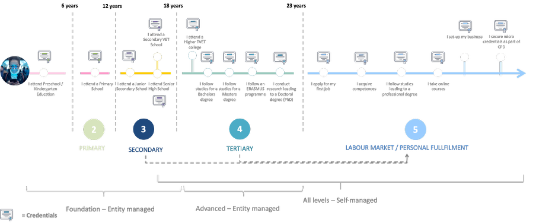
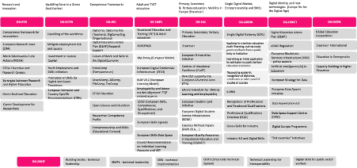

## Chapter 0: The learning belongs to the learner

### A student's journey

Meet Jacob, a bright student from Malta with aspirations to pursue a Master's degree in the Netherlands. His academic record speaks of excellence, having graduated from one of Europe's most prestigious universities. Yet, what should have been a straightforward application process turned into a maze of bureaucratic hurdles and unexpected costs.

The first shock came when Jacob contacted his former university to obtain his degree credentials. Despite having paid substantial tuition fees throughout his studies, he discovered he needed to pay an additional fee merely to access his own academic records through their proprietary system. This payment wasn't just a small administrative cost - it represented an unexpected financial burden for a recent graduate.

But the challenges didn't end there. After paying the fee and sharing his credentials with the Dutch university, Jacob faced a new obstacle. The receiving institution couldn't verify his qualifications through the digital service provided. The system, though modern in appearance, lacked cross-border recognition. What's more, the Dutch university couldn't authenticate the digital identity of Jacob's former institution.

Weeks turned into months as university staff manually processed his application. They made numerous phone calls, sent countless emails, and spent considerable time researching the equivalence of his courses. All this effort to verify information that should have been readily available and trustworthy.

These challenges are systematically addressed through the operational model detailed in [Chapter 4](chapter4.md) and the technical framework outlined in [Chapter 8](chapter8.md).

### The root of the problem

Jacob's experience brings to light several critical issues in current educational systems:

1. Ownership and access rights

- Students must pay to access their own academic achievements
- Universities maintain exclusive control over educational records
- Learners lack sovereignty over their own educational data

2. Trust and verification

- No standard method exists for cross-border credential verification
- Manual processes dominate verification procedures
- Digital solutions remain fragmented and incompatible

3. Data portability

- Educational records stay locked within institutional systems
- No common format exists for sharing credentials
- Students cannot easily transfer their records between institutions

### The educational journey: two perspectives

From an institutional viewpoint, education appears as distinct segments. Each school, university, and training centre operate independently, maintaining separate systems, different credential formats, and unique verification processes. These institutions see only their piece of a student's educational path.

Yet for students like Jacob, education forms one continuous journey. From primary school through university and into professional life, each achievement builds upon previous ones. This personal learning path knows no institutional boundaries - it's a single story of growth and development.

*figure 1 - educational journey*

The European educational space adds another layer of complexity. Different directorates manage various aspects of education, each with its own systems and requirements. This fragmentation makes cross-border mobility particularly challenging for students and professionals.

*figure 2 - EC educational landscape*

### A new paradigm through eIDAS 2.0

The European Digital Identity framework (eIDAS 2.0) introduces revolutionary changes to address these challenges. At its core sits the European Digital Identity Wallet - a secure digital container where citizens can store and manage their credentials.

For students like Jacob, this means:

- Complete control over their educational records
- Instant sharing capabilities with any institution
- Guaranteed acceptance across European borders
- Privacy protection by default

The wallet works alongside a comprehensive trust infrastructure that:

- Validates credentials without compromising privacy
- Supports existing educational frameworks
- Enables automatic verification
- Functions across borders and institutions

### DC4EU: Making it real

The DC4EU project focuses on turning this vision into reality for education and professional qualifications. Through detailed technical specifications and practical implementations, it demonstrates how:

- Students can store all their qualifications in their personal wallet
- Universities can issue and verify credentials instantly
- Employers can trust and verify qualifications easily
- Professional bodies can recognise qualifications across borders

The technical infrastructure includes:

- Standard formats for educational credentials
- Secure verification protocols
- Privacy-preserving mechanisms
- Cross-border recognition systems

This infrastructure ensures that:

- Credentials remain valid and verifiable
- Privacy stays protected
- Institutions maintain their authority
- Students control their data

Through these changes, learning truly returns to the learner. Students like Jacob will no longer face unnecessary barriers when pursuing their educational goals. They'll have full control over their achievements while institutions maintain their role as trusted credential issuers.

The practical implementation of these solutions is demonstrated through the use cases in [Chapter 7](chapter7.md), with specific guidance for adoption provided in [Chapter 8](chapter8.md).