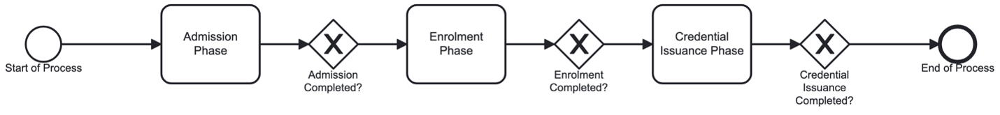
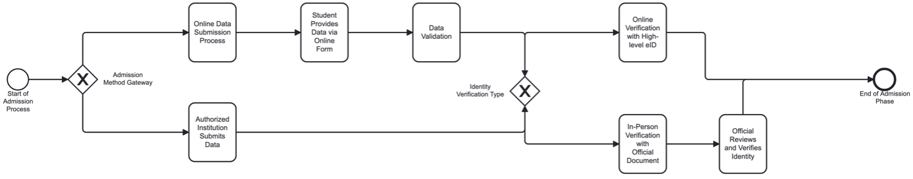
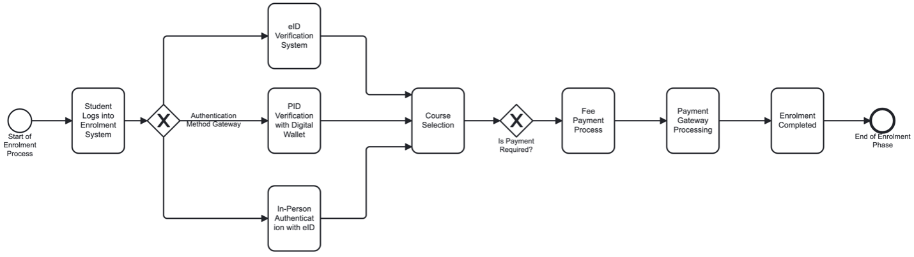
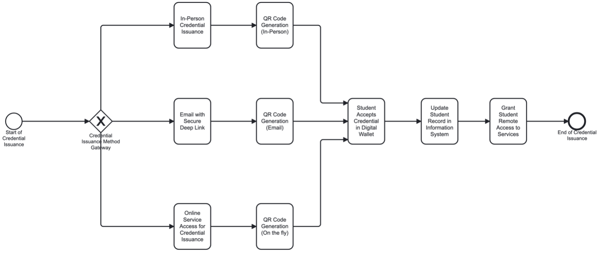
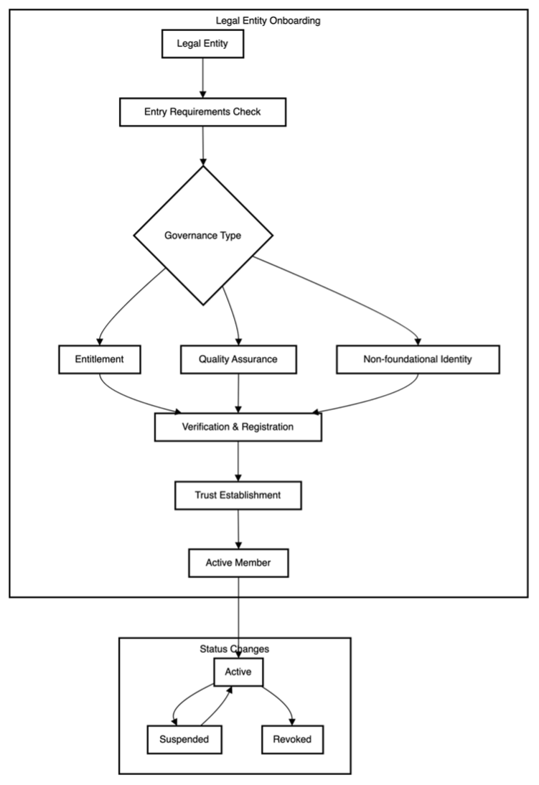

## Chapter 5: Natural persons and legal entities onboarding process

This chapter describes the onboarding process for integrating individuals - students and professionals - and legal entities into the digital credential ecosystem. Covering both educational and professional pathways, the chapter highlights the streamlined approach to verifying user identity and credential eligibility. Effective onboarding is essential for ensuring security, user control over personal data, and seamless credential issuance, setting a reliable foundation for lifelong credential portability within the European Union.

### 5.1 Educational onboarding process

#### Overview

This section describes the student onboarding process within an educational institution. The process is divided into three distinct phases: admission, enrolment, and credential issuance. Each phase involves a series of actions, decision points, and interactions between various actors and systems.

#### Process description

The student onboarding process ensures that a prospective student progresses from initial application to full enrolment and finally receives their digital credential. Each phase is interconnected and relies on the successful completion of the previous phase.

The credential issuance process follows standardized formats based on the **W3C Verifiable Credentials Data Model** and **European Learning Model**, ensuring that credentials are both human and machine-readable while maintaining compatibility with European-wide systems.

#### Overall process flow

Once admission, enrolment and first credential issuance phases are completed, the student is fully onboarded into the institution, with their admission approved, enrolment confirmed, and credential issued.

**BPMN Diagram**

#### Educational onboarding phases overview

| Phase | Primary Objective | Key Activities | Success Criteria |
|-------|-------------------|----------------|------------------|
| **Phase 1: Admission** | Verify student eligibility and identity | • Data submission • Identity verification • Data validation • Institutional review | Data successfully validated and admission approved |
| **Phase 2: Enrolment** | Complete course registration and payment | • Identity authentication • Course selection • Payment processing • Enrolment confirmation | Student successfully enrolled in selected courses |
| **Phase 3: Credential Issuance** | Provide digital credentials and system access | • Credential creation • QR code generation • Credential acceptance • System access grant | Digital credential issued and accepted in EUDI wallet |

#### Phase 1: Admission

The admission phase is the first stage of the onboarding process. Prospective students begin by submitting their personal and academic details for review.

**Key actors and responsibilities:**

| Actor | Primary Responsibilities | Interaction Method |
|-------|-------------------------|-------------------|
| **Student** | Provides personal and academic details | Online admission portal or authorised institution |
| **Educational Institution Official** | Reviews applications and verifies identity | Internal verification systems |
| **Authorised Institution Official** | Submits data on behalf of student (if applicable) | Institutional data submission systems |

**Process workflow:**
1. **Data submission**: Student submits data through institution's online admission portal
2. **Identity verification**: Institution uses identity verification system to confirm applicant's identity
3. **Data validation**: Data validated for accuracy and compliance with institutional requirements
4. **Alternate submission**: If authorised institution submits data, same validation steps apply

#### Phase 2: Enrolment

The enrolment phase begins once the admission process has been completed. During this phase, the student authenticates their identity, selects courses, and completes any necessary payments.

**Key actors and systems:**

| Actor/System | Role | Authentication Methods |
|--------------|------|----------------------|
| **Student** | Logs in, selects courses, makes payments | National eID, EUDI wallet PID, in-person verification |
| **Enrolment Management System** | Manages enrolment process and course selection | System-generated authentication tokens |
| **Authentication System** | Verifies student identity | Multiple verification pathways |
| **Payment System Provider** | Processes course enrolment payments | Secure payment gateway integration |

**Process workflow:**
1. **Authentication**: Student logs in and authenticates identity using national eID, EUDI wallet with PID, or in-person verification
2. **Course selection**: Access to course catalogue and selection of desired courses
3. **Payment**: Secure payment processing if required for chosen programme
4. **Enrolment completion**: Confirmation of course selection and payment completion

#### Phase 3: Credential Issuance

The credential issuance phase involves providing the student with a digital credential (EducationalID), which grants them access to institutional services.

**Credential issuance options:**

| Delivery Method | Process | Requirements | User Experience |
|----------------|---------|--------------|-----------------|
| **In-person** | Visit academic secretary's office, official generates QR code | Physical presence, identity verification | Direct assistance, immediate resolution |
| **Email** | Secure deep link sent to registered email address | Valid email, secure link authentication | Convenient, self-service |
| **Online** | Login to online portal, authenticate, scan QR code | Portal access, authentication credentials | Flexible, immediate access |

**Process workflow:**
1. **Credential creation**: System generates digital credential according to institutional standards
2. **QR code generation**: Secure QR code created for credential acceptance
3. **Credential acceptance**: Student scans QR code and accepts credential into EUDI wallet
4. **System updates**: Student record updated and remote access granted

#### Educational onboarding systems overview

| System/Actor | Primary Function | Integration Points | Security Requirements |
|--------------|------------------|-------------------|---------------------|
| **Student** | Initiates process, provides data, receives credentials | All system touchpoints | Personal data protection, secure authentication |
| **Educational Institution Official** | Reviews applications, verifies identity | Admission portal, verification systems | Role-based access, audit logging |
| **Online Admission Portal** | Receives and forwards student data | Validation systems, institutional databases | Data encryption, secure transmission |
| **Identity Verification System** | Confirms applicant identity | National databases, institutional systems | Multi-factor authentication, fraud detection |
| **Enrolment Management System** | Manages course selection and enrolment | Authentication, payment, student information systems | Secure session management, data integrity |
| **Credential Issuance System** | Creates and manages digital credentials | QR generation, student records, wallet integration | Cryptographic security, tamper protection |
| **Student Information System** | Maintains comprehensive student records | All institutional systems | Data consistency, backup procedures |
| **Remote Access System** | Provides post-credential institutional access | Credential verification, service authorization | Continuous authentication, access logging |

### 5.2 Professional qualifications onboarding process

#### Overview

This section describes the professional qualifications onboarding process within authorized professional bodies and associations. The process follows a similar three-phase structure to educational onboarding but addresses the specific needs of professional qualification verification and issuance.

#### Professional vs Educational onboarding comparison

| Aspect | Educational Onboarding | Professional Onboarding | Key Differences |
|--------|----------------------|------------------------|-----------------|
| **Initial Phase** | Admission (academic eligibility) | Request (professional eligibility) | Professional focus on experience and qualifications vs academic prerequisites |
| **Second Phase** | Enrolment (course selection) | Enrolment (credential selection) | Course-based vs credential-type selection |
| **Final Phase** | Educational credential issuance | Professional credential issuance | Academic credentials vs professional certifications |
| **Primary Actors** | Educational institutions, students | Professional bodies, working professionals | Different regulatory and oversight requirements |
| **Verification Focus** | Academic achievements, identity | Professional experience, competencies, identity | Enhanced focus on professional standing and industry requirements |

#### Professional onboarding phases overview

| Phase | Primary Objective | Key Activities | Professional-Specific Requirements |
|-------|-------------------|----------------|-----------------------------------|
| **Phase 1: Request** | Verify professional eligibility | • Platform access • Identity verification • Data validation • Professional history review | Professional experience validation, industry-specific requirements |
| **Phase 2: Enrolment** | Complete credential selection | • Professional authentication • Credential type selection • Payment processing • Enrolment confirmation | Professional standing verification, regulatory compliance |
| **Phase 3: Credential Issuance** | Issue professional credentials | • Credential creation • QR code generation • Credential acceptance • Registry updates | Professional registry updates, regulatory body notifications |

#### Professional onboarding actors and systems

| Actor/System | Role | Professional-Specific Functions |
|--------------|------|--------------------------------|
| **Professional** | Initiates request, provides professional history, receives credentials | Professional experience documentation, competency verification |
| **Professional Association Official** | Reviews applications, verifies professional standing | Professional standards assessment, regulatory compliance verification |
| **Platform Access System** | Manages professional login and data submission | Professional membership verification, role-based access |
| **Identity Verification System** | Verifies professional identity | Enhanced verification for regulatory compliance |
| **Credential Issuance System** | Creates professional credentials | Industry-specific credential formats, regulatory requirements |
| **Central Registry System** | Updates professional records | Professional licensing databases, regulatory notifications |
| **Authentication System** | Provides identity verification during enrolment | Professional-grade authentication, audit requirements |
| **Payment Gateway** | Processes professional fees | Professional association billing, regulatory fee processing |

### 5.3 Legal entities onboarding process

#### 5.3.1 Introduction

Legal entities must join the trust framework through a structured process that maintains quality and trust across the credentialing ecosystem. This section explains how organisations become authorised members of the framework.

The inclusion of legal entities in the trust framework represents a critical step in establishing a reliable credential ecosystem. Each organisation's participation adds to the framework's value, creating a network of trusted credential issuers and verifiers across Europe. This process builds upon existing regulatory structures while adding the necessary digital trust layer for modern credential management.

The onboarding process follows the [non-delegated trust model](chapter4.md#41-trust-model-and-governance-framework) from [Chapter 4](chapter4.md), with each organisation retaining direct control of their credentials within the European framework. This approach respects institutional autonomy while ensuring consistent standards across the network.

#### Participating organisations framework

The framework's effectiveness depends on the participation of diverse organisations across the education and professional qualification sectors:

| Organisation Category | Organisation Types | Primary Functions | Value to Ecosystem |
|-----------------------|-------------------|-------------------|-------------------|
| **Educational bodies** | • Universities • Higher education institutions • Vocational education providers • Professional education centres • Continuing education organisations | Primary academic and professional qualification issuance | Foundation for career development and further education |
| **Professional organisations** | • Professional associations • Industry certification bodies • Regulatory bodies • Quality control agencies | Sector-specific expertise and validation | Industry standards compliance and professional requirements |
| **Accreditation bodies** | • National accreditors • Subject-specific accreditors • International accreditors | Quality assurance across the network | Standards validation for educational and professional credentials |
| **Public authorities** | • Education ministries • Professional regulators • Quality oversight bodies | Regulatory framework establishment | Official recognition at national and European levels |

#### 5.3.2 Entry requirements framework

The entry requirements establish baseline standards for participation in the trust framework, balancing rigorous verification with practical implementation considerations.

#### Legal and technical requirements comparison

| Requirement Category | Legal Standards | Technical Standards | Implementation Approach |
|---------------------|----------------|-------------------|-------------------------|
| **Foundation Requirements** | • Registration in home country • Education law compliance • Qualification authority • Good standing proof | • Protected IT setup • Data safeguards • Digital signatures • Recovery plans | Legal verification through national authorities, technical assessment through capability testing |
| **Operational Requirements** | • Education standards compliance • Professional recognition • Data protection measures • Cross-border permissions | • API readiness • Identity systems • Credential tools • Checking processes | Regulatory compliance verification, technical interoperability testing |
| **Quality Assurance** | • Current accreditation • Quality systems • External reviews • Written procedures | • File management • Record tracking • Staff preparation • Problem response | Quality audits and assessments, technical capability evaluation |

#### 5.3.3 Three-tier governance onboarding process

The joining process addresses three distinct governance types that shape how legal entities participate in the trust framework:

#### Governance type comparison matrix

| Governance Type | Primary Purpose | Key Activities | Verification Requirements |
|----------------|-----------------|----------------|--------------------------|
| **Entitlement governance** | Establish legal authority to act within education/professional domains | • National authority confirmation • Legal scope definition • Cross-border recognition • Framework registration | Legal basis verification, regulatory compliance, authority scope documentation |
| **Quality assurance regime** | Integrate into quality assurance framework | • Standards mapping • Assessment processes • Audit establishment • Accreditation integration | Quality framework alignment, audit procedures, standards compliance |
| **Non-foundational identity** | Enable non-foundational identity credential issuance | • Credential type definition • Technical integration • Operational procedures • Privacy safeguards | Identity systems setup, verification infrastructure, privacy controls |

#### Detailed governance process workflows

| Process Step | Entitlement Governance | Quality Assurance | Non-foundational Identity |
|--------------|----------------------|-------------------|--------------------------|
| **Initial Verification** | National authority confirmation, legal scope definition | Standards mapping, assessment process review | Credential type definition, issuance scope |
| **Authority Establishment** | Qualification issuing rights, professional recognition scope | Audit schedule setting, assessment criteria | Verification mechanisms, privacy safeguards |
| **Framework Integration** | Legal entity identifier assignment, public registry inclusion | Recognition processes, cross-border applicability | Identity systems setup, operational procedures |
| **Ongoing Requirements** | Status publication, regulatory compliance maintenance | Review procedures, renewal processes | Status update mechanisms, privacy protection measures |

#### 5.3.4 Onboarding process flow

The onboarding of legal entities into the trust framework follows a structured process that addresses three distinct governance types: entitlement, quality assurance, and non-foundational identity. Each flow represents a specific aspect of establishing trust and authority within the framework.

#### Implementation considerations

**Process coordination:**
- Multiple governance types may apply to single organisations
- Parallel processing where appropriate to reduce onboarding time
- Clear communication of requirements and timelines
- Regular progress monitoring and stakeholder updates

**Quality assurance:**
- Comprehensive verification at each governance level
- Regular review and audit procedures
- Continuous improvement based on onboarding feedback
- Alignment with European regulatory requirements

**Technical integration:**
- System interoperability testing
- Security and privacy verification
- Performance and reliability assessment
- Ongoing technical support and maintenance