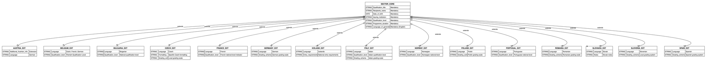
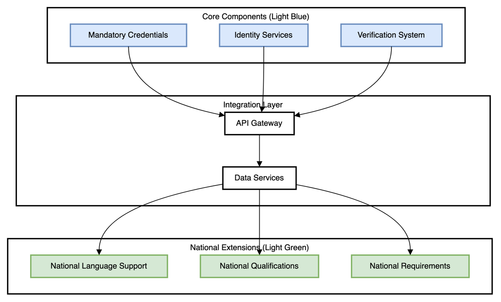
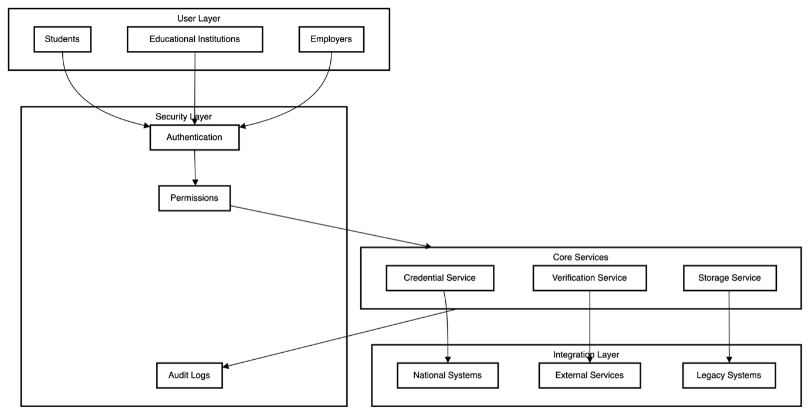

## <a id="_Toc182376700"></a><a id="_Toc184710061"></a>Chapter 8: Technical framework and sectorial EAA's catalogue

This chapter details the technical framework and data model that support secure and interoperable digital credentialing across the EU. By defining the core architecture, data structures, and protocols for credential management, this framework underpins the operational model's compliance with EU standards like eIDAS and GDPR. The focus on data security and interoperability ensures that educational and professional credentials can be issued and verified seamlessly across borders, offering a trusted solution for all stakeholders in the credentialing ecosystem.

### <a id="_Toc182376701"></a><a id="_Toc184710062"></a>8.1 Introduction

The implementation of trust frameworks for educational and professional credentials requires a robust and flexible technical foundation that can accommodate diverse national requirements while maintaining standardization where needed. This chapter outlines the technical framework and data model that enables the seamless issuance, management, and verification of credentials across Europe.

The framework builds upon established international standards, particularly the W3C Verifiable Credentials Data Model and the European Learning Model, to ensure consistency, interoperability, and trust across implementations while supporting the specific needs of the European education and qualification landscape. It is designed to be both forward-looking and backward compatible, ensuring that institutions can transition at their own pace while maintaining interoperability across the ecosystem.

This technical framework implements the [operational model detailed in Chapter 4](chapter4.md) and supports the [use cases presented in Chapter 7](chapter7.md).

### <a id="_Toc182376702"></a><a id="_Toc184710063"></a>8.2 Core data model architecture

The adoption of the W3C Verifiable Credentials (VC) Data Model and the European Learning Model (ELM) as the core standards for credential issuance and verification is rooted in their proven capabilities for fostering interoperability, ensuring data privacy, and supporting cross-border mobility within the EU. These models align with global digital identity and data standards, making them particularly suited to the objectives outlined in the European Qualifications Framework (EQF) and the Digital Education Action Plan (DEAP).

#### Key advantages of the chosen standards:

| Advantage Category | W3C VC Benefits | ELM Benefits | Combined Impact |
|--------------------|-----------------|--------------|-----------------|
| **Interoperability** | Uniform credential data structuring | European education-specific standardisation | Educational and professional qualifications recognised across all member states |
| **Privacy and Security** | Selective disclosure and cryptographic proofs | Privacy-preserving educational data handling | Personal data protection with user control over information sharing |
| **EU Standards Alignment** | Global digital identity compatibility | EU-wide educational initiatives integration | Seamless integration with Europass and EDCI services |

These aspects underscore why the W3C VC and ELM were selected as the foundational data models for this framework, promoting a unified and secure approach to credentialing across Europe.

#### Integration with existing European standards

The selected data model incorporates established Bologna Process tools:

- **ECTS credits**: For measuring student workload and facilitating credit transfer
- **Degree cycle indicators**: Bachelor's/Master's/Doctorate structure compatibility
- **Qualification framework levels**: Integration with EQF and national frameworks
- **Quality assurance status**: Maintaining educational quality standards

This ensures compatibility with existing European higher education standards while enabling new digital capabilities.

This model enables the [credential lifecycle management described in Section 4.2](chapter4.md#42-credential-lifecycle-management) and supports the [implementation roadmap outlined in Chapter 10](chapter10.md).

#### 8.2.1 Design philosophy

The implementation of the European Learning Model (ELM) alongside the W3C Verifiable Credentials framework directly addresses the challenges of interoperability and cross-border recognition. By leveraging these models, institutions can ensure that issued credentials maintain a standardised format that is both machine-readable and verifiable across different systems. This approach mitigates issues related to varying national data standards and supports a coherent digital education ecosystem throughout the EU.

The technical framework is built on two complementary principles that ensure both consistency and adaptability:

#### 1. Standardisation through mandatory core structure

- **Consistent information capture**: Ensures essential information is consistently captured and presented
- **International recognition**: Facilitates international recognition and comparison of qualifications
- **Data integrity foundation**: Provides a foundation that cannot be modified, guaranteeing data integrity
- **Cross-system interoperability**: Enables interoperability across different systems and countries

#### 2. Flexibility through country-specific extensions

- **National requirements accommodation**: Allows individual countries to add their unique requirements
- **Local standards integration**: Enables incorporation of local educational standards
- **Country-specific grading systems**: Supports country-specific grading systems
- **Framework compatibility**: Maintains compatibility with the international framework

This dual approach ensures that while credentials remain internationally recognizable and verifiable, they can also accommodate the specific needs and requirements of different educational systems and professional bodies.

#### Framework implementation characteristics

The technical framework implements the W3C Verifiable Credentials Data Model as its foundation, extended by the European Learning Model to address education-specific requirements. This standards-based approach ensures:

- **Consistent credential structure** across implementations
- **Built-in privacy features**: Support for privacy-preserving features like selective disclosure
- **European digital identity compatibility**: With existing and future European digital identity initiatives
- **Clear architectural separation**: Between core credential attributes and extension fields

#### Stakeholder benefits analysis

| Stakeholder Group | Primary Benefits | Technical Implementation | Policy Alignment |
|-------------------|------------------|-------------------------|------------------|
| **Educational Institutions** | Simplified credential issuance and verification through EU-compatible models | Integration with existing student information systems | Supports European Education Area objectives |
| **Employers and Professional bodies** | Streamlined qualification recognition and reduced manual validation | Automated verification through standardised APIs | Aligns with Single Digital Gateway principles |
| **Credential holders** | User-centric approach prioritising privacy and cross-border mobility | Selective disclosure and user-controlled data sharing | Supports Once-Only Principle implementation |

This context ensures alignment with EU strategies such as the European Education Area (EEA) and the Single Digital Gateway (SDG), which promote cross-border digital services and the Once-Only Principle (OOP).

#### 8.2.2 Language requirements

A critical aspect of the framework is its approach to language management, which balances international accessibility with local compliance:

#### English as mandatory generation language

- **Universal accessibility**: All core documentation must be generated in English
- **International compatibility**: Ensures international accessibility and recognition
- **Terminology consistency**: Maintains consistency in terminology across implementations
- **Verification reference**: Serves as the reference version for verification processes

#### Additional official languages through extensions

- **National language support**: Countries can add their official languages through standardised mechanisms
- **Multi-language capabilities**: Multiple language support through standardised extension mechanisms
- **Cultural identity preservation**: Preserves local identity while ensuring international accessibility
- **Compliance with local requirements**: Supports national language legislation and cultural needs

This approach ensures that credentials can be understood internationally while meeting local language requirements, supporting both mobility and local compliance needs.

#### 8.2.3 Practical examples and use cases

To illustrate the practical applications of the chosen data models, the following use cases demonstrate their real-world impact:

#### Cross-border academic recognition scenario

A student in Germany graduates with a digitally issued diploma based on the W3C VC and ELM standards. When applying for a master's programme in Spain, the receiving university can instantly verify the diploma's authenticity and details using cryptographic proofs embedded in the credential. This streamlines admissions processes, reduces administrative burdens, and ensures data privacy.

**Technical process**:
1. German university issues ELM-compliant digital diploma
2. Student stores credential in EUDI wallet
3. Spanish university requests credential verification
4. Automated cryptographic verification confirms authenticity
5. EQF level mapping enables automatic qualification comparison

#### Employer verification of professional qualifications

A professional from France moves to Italy and presents their verifiable professional certification to a potential employer. The certification, structured according to the W3C VC model and containing ELM-compliant data fields, allows the employer to quickly verify the credential through an interoperable verification system. This facilitates faster hiring processes and enhances trust.

**Technical benefits**:
- Instant verification without manual processes
- Cryptographic proof of authenticity
- ESCO skills mapping for precise job matching
- Cross-border professional mobility support

#### Lifelong learning and micro-credential recognition

An individual participates in an online training course provided by a Finnish institution, earning a micro-credential formatted according to the ELM and W3C VC standards. This credential is stored in their EUDI wallet and presented to a Swedish employer as part of their application. The standardised format ensures the employer can verify the credential's validity, supporting better skills matching and career progression.

**Implementation advantages**:
- Seamless integration of formal and non-formal learning
- Standardised micro-credential recognition
- Enhanced career development pathways
- Support for lifelong learning objectives

### <a id="_Toc182376703"></a><a id="_Toc184710064"></a>8.3 Model structure

The framework implements a two-layer approach that forms the backbone of the credential ecosystem. This structure allows for both standardisation and flexibility, addressing the diverse needs of educational institutions and professional bodies across Europe.



The diagram above illustrates the dual-layer architecture that enables both European-wide standardisation and national flexibility while maintaining full interoperability across all implementations.

#### 8.3.1 Core layer (Sector-wide)

The core layer establishes the fundamental structure that ensures consistency across all implementations. It consists of carefully selected mandatory and optional fields that provide the essential foundation for credential recognition and verification.

#### Mandatory fields specification

| Field Category | Field Name | Description | International Standards Alignment | Verification Purpose |
|----------------|------------|-------------|----------------------------------|---------------------|
| **Identity** | Qualification title | Official name in English with standardised naming conventions | EQF terminology alignment | Clear qualification identification |
| | Recipient's name | Full legal name with international format standards | ISO naming standards | Individual identification |
| | Date of birth | Standardised date format as additional identifier | ISO 8601 format | Identity verification |
| **Institution** | Issuing institution | Official name with standardised identifiers and database links | EU institutional registries | Source verification |
| **Qualification** | Qualification level | International framework alignment with clear academic/professional indication | EQF level mapping | Cross-border comparison |
| | Programme duration | Standardised format including time period and credit points | ECTS compatibility | Study intensity comparison |
| **Accessibility** | Language of generation | Mandatory English version ensuring international accessibility | EN language standard | Universal understanding |
| **Classification** | Field of study | Standardised classification aligned with international systems | ISCED classification | Field-specific recognition |

#### Optional fields specification

| Field Category | Purpose | Implementation Benefits | National Flexibility |
|----------------|---------|------------------------|---------------------|
| **Assessment** | Grading scheme with assessment methods and international comparison tables | Transparent evaluation standards | Accommodation of national grading systems |
| **Prerequisites** | Access requirements including programme prerequisites and special conditions | Clear admission pathways | Integration with national education systems |
| **Additional Information** | Supplementary information and programme-specific details | Enhanced qualification context | Cultural and institutional specificity |

#### 8.3.2 Country Extensions

The extension layer provides the flexibility needed to accommodate national requirements while maintaining the integrity of the core model. These extensions enable comprehensive localisation without compromising international interoperability.

#### Extension categories

| Extension Type | Implementation Scope | Benefits | Examples |
|----------------|---------------------|----------|----------|
| **Language Support** | National language requirements with maintained English correlation | Cultural preservation and legal compliance | German, French, Spanish extensions |
| **Qualification Frameworks** | Integration with national systems and regional framework mapping | National sovereignty respect | Flemish Qualification Level, ISCED integration |
| **Educational Standards** | Local formatting requirements and country-specific elements | Regulatory compliance | National grading scales, local terminology |

#### Comprehensive country extension matrix

| Field | Core Requirement | Austria | Belgium | Czech Republic | France | Germany | Italy | Norway | Poland | Spain |
|-------|------------------|---------|---------|----------------|--------|---------|-------|--------|--------|-------|
| **Qualification title** | Mandatory (English) | No extension | No extension | No extension | Specific variants | No extension | Title variants | No extension | Local terminology | No extension |
| **Recipient's name** | Mandatory (International format) | No extension | No extension | Czech formatting | No extension | No extension | No extension | No extension | Local formatting | No extension |
| **Date of birth** | Mandatory (ISO format) | No extension | No extension | No extension | Optional formatting | No extension | No extension | No extension | No extension | No extension |
| **Issuing institution** | Mandatory (Official name) | Institution translation | Local language inclusion | Name in Czech | Original and French | No extension | No extension | No extension | No extension | No extension |
| **Qualification level** | Mandatory (EQF aligned) | EQF notation | Flemish level | ISCED classification | National indicator | National indicator | Italian level | National level | National level | National level |
| **Programme duration** | Mandatory (ECTS compatible) | No extension | ECTS and local credits | ECTS | No extension | Credit type notation | No extension | Local credits | Duration notation | Credits notation |
| **Language of generation** | Mandatory (English) | German extension | Dutch/French/German | Czech extension | French extension | German extension | Italian extension | Norwegian extension | Polish extension | Spanish extension |
| **Field of study** | Mandatory (ISCED aligned) | ISCED notation | Flemish field | Czech field | French descriptor | No extension | Italian descriptor | Field notation | Field notation | National notation |
| **Grading scheme** | Optional | Austrian scale | Grading with percentile | Local scale | French descriptors | German scale | Italian scale | Norwegian scale | Polish scale | Spanish system |
| **Access requirements** | Optional | Entry requirements | Prerequisites | Local requirements | Local requirements | Access criteria | Italian requirements | Entry criteria | Access requirements | Entry criteria |
| **Additional notes** | Optional | Austrian info | No extension | National recognition | Legal notes | Additional details | Cultural details | Regulations | National specifics | Legal notes |

This comprehensive matrix demonstrates how the framework accommodates diverse national requirements while maintaining core interoperability standards.

#### 8.3.3 Standards and specifications

The technical framework implements internationally recognised standards to ensure interoperability, security, and wide adoption across the European education and professional qualification landscape.

#### Core standards implementation

#### W3C Verifiable Credentials Data Model

The W3C Verifiable Credentials Data Model serves as the foundational standard for the framework, providing a robust and internationally recognised approach to digital credentials. This standard represents a global consensus on digital credential structure and verification, developed through extensive collaboration within the World Wide Web Consortium (W3C).

**Key capabilities addressed**:

| Challenge Area | W3C VC Solution | Educational Impact | Technical Implementation |
|----------------|-----------------|-------------------|-------------------------|
| **Credential authenticity** | Cryptographic verification preventing tampering | Trust in educational qualifications | Digital signatures and hash verification |
| **Data structure consistency** | Standardised representation of credential elements | Machine-readable and human-understandable formats | JSON-LD schema implementation |
| **Privacy preservation** | Selective disclosure capabilities | User control over shared information | Zero-knowledge proofs and selective revelation |
| **Lifecycle management** | Comprehensive issuance, verification, and revocation | Institutional control over credential validity | Status checking and revocation lists |

**Privacy-preserving features**: The model's support for selective disclosure enables credential holders to share only specific parts of their credentials while maintaining verifiability. For instance, a professional might share their qualification title and date of issuance without revealing their date of birth, even though all information is contained in the same credential.

**Institutional benefits**: When a university issues a digital diploma, the W3C VC standard ensures that all crucial elements are represented in a consistent, machine-readable format while remaining human-understandable, supporting both automated processing and manual review.

#### Decentralised identifier (DID) integration

Complementing the Verifiable Credentials Data Model, decentralised identifiers provide the critical infrastructure for managing digital identity within the framework. DIDs represent a paradigm shift from traditional centralised identity systems, offering a more resilient and flexible approach to identity management in educational and professional contexts.

**Core benefits for educational institutions**:

| Benefit Category | DID Capabilities | Educational Application | System Advantages |
|------------------|------------------|------------------------|------------------|
| **Institutional autonomy** | Independent identity management | Universities maintain control while participating in broader ecosystem | Balanced independence with interoperability |
| **Verification efficiency** | Direct verification without central contact | Digital diploma verification without contacting issuing university | Streamlined verification processes |
| **Technical flexibility** | Support for various authentication methods | Large universities and small professional bodies can use appropriate systems | Scalable implementation approaches |
| **Future-proofing** | Evolution support without breaking existing credentials | Infrastructure evolution while maintaining credential validity | Long-term system sustainability |

The combination of these core standards provides comprehensive benefits:

#### 1. Trust and security framework
- **Cryptographic verification**: Ensures credential authenticity through mathematical proofs
- **Tamper-evident structure**: Detects any unauthorised modifications
- **Secure issuer identities**: Verifiable institutional digital identities
- **Protected revocation mechanisms**: Secure processes for credential status management

#### 2. Privacy and control mechanisms
- **Granular information control**: User-controlled sharing of specific credential elements
- **Privacy-preserving verification**: Verification without exposing unnecessary data
- **Data minimisation support**: Compliance with privacy-by-design principles
- **GDPR compliance**: Built-in support for European data protection requirements

#### 3. Interoperability and scalability
- **Standardised credential formats**: Consistent structure across all implementations
- **Vendor-independent systems**: No lock-in to specific technology providers
- **Cross-border recognition**: Seamless qualification recognition across Europe
- **Future-proof foundation**: Support for emerging technologies and standards

#### 4. Institutional autonomy preservation
- **Independent identity management**: Institutions control their own digital identities
- **Flexible implementation options**: Adaptable to different institutional needs
- **Maintained institutional control**: Preservation of institutional authority over credentials
- **Local requirements support**: Accommodation of national and institutional specific needs

#### Complementary specifications

#### European Learning Model (ELM)

The European Learning Model represents a significant advancement in standardising educational credentials across Europe. While the W3C Verifiable Credentials Data Model provides the basic structure, ELM extends this foundation with detailed specifications for representing educational achievements, qualifications, and learning outcomes specifically for European education systems.

**Development approach**: ELM was developed through extensive collaboration between educational institutions, government bodies, and technical experts across Europe, ensuring real-world requirement alignment while maintaining compatibility with existing educational processes and systems.

**Comprehensive educational concept support**:

| Educational Concept | ELM Implementation | Cross-border Benefits | Technical Features |
|---------------------|-------------------|----------------------|-------------------|
| **Learning outcomes and achievements** | Standardised outcome descriptions | Consistent interpretation across countries | Structured data fields and taxonomies |
| **Credit systems and workload** | ECTS integration and alternative credit systems | Seamless credit transfer and recognition | Mathematical credit conversion algorithms |
| **Assessment methods and grading** | Multiple grading scheme support | Grade comparability across systems | Standardised assessment metadata |
| **Professional competencies and skills** | ESCO integration and skill mapping | Labour market alignment | Competency frameworks and skill taxonomies |
| **Quality assurance information** | Accreditation and quality status | Trust in qualification standards | Institutional verification mechanisms |

**Practical application example**: When a university needs to issue a transcript of records for a student participating in the Erasmus programme, ELM ensures that course credits, grades, and learning outcomes are represented in a way that can be correctly interpreted by institutions across different countries, significantly reducing administrative burden and enabling accurate credit recognition.

**Complex qualification support**: ELM addresses the challenge of representing qualifications that combine multiple elements, such as joint degrees or professional certifications with multiple specialisations, ensuring that complex credentials remain machine-readable and verifiable while preserving all necessary context and detail.

#### Alignment with European frameworks

#### European Qualifications Framework (EQF)

The European Qualifications Framework represents one of the most significant achievements in European educational cooperation, providing a common reference system that makes qualifications comparable across national borders. In digital credentials, EQF integration is essential for ensuring automatic qualification understanding and evaluation across different national contexts.

**EQF integration capabilities**:

| EQF Feature | Digital Credential Implementation | Automation Benefits | Cross-border Impact |
|-------------|----------------------------------|-------------------|-------------------|
| **Eight-level structure** | Structured EQF level information in credentials | Automatic qualification comparison | Seamless international recognition |
| **Learning outcomes focus** | Detailed learning outcomes in standardised format | Precise matching to requirements | Skills-based evaluation across borders |
| **National framework integration** | Simultaneous national and EQF level expression | Maintained national specificity with European comparability | Translation between national systems |

**Automated processes enabled**:
1. **Automatic level mapping**: When credentials include structured EQF information, receiving institutions can automatically verify qualification levels for admission requirements
2. **National framework translation**: Digital credentials can simultaneously express qualifications in national terms and corresponding EQF levels
3. **Learning outcomes verification**: Detailed learning outcomes enable precise matching of qualifications to specific requirements

#### ESCO (European Skills, Competences, Qualifications and Occupations)

ESCO provides the crucial link between education and the labour market through standardised, multilingual classification of skills, competences, qualifications, and occupations. Integration into digital credentials creates powerful tools for matching educational achievements with professional opportunities across Europe.

**ESCO integration benefits**:

| ESCO Feature | Implementation in Digital Credentials | Labour Market Benefits | Technical Implementation |
|--------------|--------------------------------------|----------------------|-------------------------|
| **Standardised terminology** | Common language across European languages | Automatic qualification translation and precise job matching | Multilingual taxonomies and mapping algorithms |
| **Skills-based mapping** | Educational achievements expressed as specific skills | Better qualification-to-job matching and clearer development pathways | Granular competency frameworks |
| **Labour market intelligence** | Structured vocabulary for automatic analysis | Skill needs identification and career guidance | Data analytics and trend analysis |

**Comprehensive system benefits**:

#### 1. Enhanced mobility and recognition
- **Automatic qualification level comparison** through standardised frameworks
- **Consistent skills interpretation** across borders through common terminology
- **Simplified recognition procedures** through automated matching
- **Reduced barriers to professional mobility** through standardised credentials

#### 2. Improved educational planning
- **Better alignment with labour market needs** through skills mapping
- **Evidence-based curriculum development** through data analytics
- **Clear progression pathways** through structured frameworks
- **Support for lifelong learning** through comprehensive skill tracking

#### 3. Employment market efficiency
- **Precise matching** of qualifications to job requirements
- **Reduced skills mismatches** through better information
- **Better career guidance** through clear pathways
- **Enhanced workforce development** through targeted training

#### 4. System-wide intelligence
- **Improved qualification transparency** through standardised information
- **Better understanding of skill needs** through data analysis
- **Enhanced policy development** through evidence-based insights
- **Evidence-based decision making** through comprehensive data

The alignment with these European frameworks transforms digital credentials from simple digital documents into powerful tools for educational and professional mobility. By embedding EQF levels and ESCO classifications within standardised digital credentials, the system creates a comprehensive ecosystem that makes qualifications truly comparable across borders, connects education directly to employment opportunities, supports evidence-based policy making, and facilitates lifelong learning and professional development.

This framework alignment ensures that digital credentials carry verified information about educational achievements while providing structured, meaningful data that supports real-world mobility and opportunity across Europe.

### <a id="_Toc182376704"></a><a id="_Toc184710065"></a>8.4 Country-specific implementations

The framework supports various implementation approaches across different regions, reflecting diverse educational landscapes while maintaining interoperability. This section details how the technical framework accommodates national requirements through standardised extension mechanisms.

#### 8.4.1 Western European extensions

Western European implementations reflect sophisticated educational traditions and established cross-border cooperation mechanisms:

#### Austria
- **German language extension**: Implements full documentation in German while maintaining English core for international accessibility
- **EQF level notation**: Integrates European Qualification Framework references with Austrian national qualifications
- **Additional Austrian info**: Includes specific information about Austrian higher education characteristics and institutional traditions

#### Belgium
- **Multi-language support**: Implements three official languages (Dutch, French, German) reflecting the country's linguistic diversity and federal structure
- **Flemish Qualification Level**: Incorporates specific qualification framework used in the Flemish region
- **Regional variations**: Special considerations for different educational systems across Belgian regions

#### France
- **French language extension**: Complete documentation in French parallel to English core with technical terminology preservation
- **National level indicators**: Integration with French qualification framework and specific degree classifications
- **Specific qualification variants**: Accommodates unique French degree titles, specialisations, and educational traditions

#### Germany
- **German language extension**: Full German translation maintaining technical precision and educational terminology
- **Specific duration notation**: Detailed semester and credit point system reflecting German higher education structure
- **German grading scale**: Integration of the numerical grading system with descriptors for international comparison

#### Spain
- **Spanish language extension**: Complete Spanish translation with technical terminology and educational concepts
- **National field notation**: Specific classification of academic disciplines aligned with Spanish educational categories
- **European initiatives integration**: Connection with Spain's participation in European educational programmes

#### 8.4.2 Eastern European extensions

Eastern European implementations reflect educational reforms, EU alignment processes, and national educational characteristics:

#### Bulgaria
- **Bulgarian language extension**: Complete documentation in Bulgarian with Cyrillic script support
- **National qualification level**: Integration with reformed qualification framework post-EU accession
- **Local entry requirements**: Specific prerequisites aligned with Bulgarian national educational standards

#### Czech Republic
- **Czech language extension**: Full Czech translation with technical accuracy and educational terminology
- **Specific formatting requirements**: Adherence to national documentation standards and official formats
- **Local grading scale**: Integration of Czech evaluation system with international comparison capabilities

#### Poland
- **Polish language extension**: Complete Polish translation preserving technical meaning
- **Local terminology**: Specific academic and professional terms reflecting Polish educational traditions
- **National qualification specifics**: Integration with Polish qualification framework and educational structure

#### Romania
- **Romanian language extension**: Full Romanian translation with technical precision
- **Optional formatting**: Flexibility in document presentation accommodating national preferences
- **Romanian grading scale**: Integration of national evaluation system with European standards

#### Slovakia
- **Slovak language extension**: Complete Slovak translation maintaining technical accuracy
- **Credit type notation**: Specific credit system implementation reflecting Slovak higher education structure
- **Local qualification recognition**: Requirements aligned with Slovak national recognition procedures

#### 8.4.3 Nordic extensions

Nordic implementations emphasise international compatibility while maintaining regional educational traditions and high digitalisation standards:

#### Iceland
- **Icelandic language extension**: Full documentation in Icelandic preserving cultural and educational terminology
- **ECTS inclusion**: Strong integration with European Credit Transfer System reflecting Iceland's European engagement
- **National entry requirements**: Specific prerequisites for Icelandic institutions and unique admission procedures

#### Norway
- **Norwegian language extension**: Complete Norwegian translation with educational terminology
- **Local credits system**: Integration with Norwegian credit framework alongside ECTS compatibility
- **Specific field notation**: Alignment with Norwegian academic classifications and research categories

#### 8.4.4 Southern European extensions

Southern European implementations reflect regional educational practices, cultural traditions, and alignment with European standards:

#### Italy
- **Italian language extension**: Complete Italian translation with academic and technical terminology
- **Specific title variants**: Accommodation of traditional Italian degree titles and historical classifications
- **Local cultural details**: Integration of specific Italian academic traditions and institutional characteristics

#### Portugal
- **Portuguese language extension**: Full Portuguese translation maintaining technical precision
- **ECTS notation**: Detailed credit system implementation reflecting Portuguese higher education structure
- **Portuguese legal notes**: Compliance with national regulations and legal requirements

#### Slovenia
- **Slovenian language extension**: Complete Slovenian translation with technical accuracy
- **Local grading system**: Integration of national evaluation methods with European standards
- **Slovenian legal notes**: Specific regulatory requirements and compliance mechanisms

### <a id="_Toc182376705"></a><a id="_Toc184710066"></a>8.5 Implementation guidelines

The successful deployment of this framework requires careful attention to both technical and organisational considerations. This section provides comprehensive guidance for institutions and national authorities implementing the framework.

#### 8.5.1 Core model implementation

#### Phase 1: Foundation establishment

**Mandatory fields implementation**:
- **Data types and relationships**: Define precise data types, validation rules, and relationships between credential elements
- **Validation rules implementation**: Create comprehensive validation logic ensuring data quality and consistency
- **Standardised templates creation**: Develop template structures that accommodate both core and extension requirements

**English default configuration**:
- **Primary language controls**: Set up language management systems with English as the default reference
- **Translation frameworks**: Establish systematic approaches for managing multilingual content
- **Language-specific validation**: Implement validation rules that account for linguistic variations while maintaining consistency

**Data format standardisation**:
- **Standardised formatting implementation**: Define and implement consistent formatting across all credential types
- **Character set requirements**: Establish Unicode support for international character sets and special symbols
- **Field parameter establishment**: Define precise parameters for each field including length, format, and validation criteria

#### 8.5.2 Extension implementation

#### Phase 2: National customisation

**Extension module development**:
- **Modular framework creation**: Develop flexible extension mechanisms that inherit from core structures
- **Inheritance implementation**: Ensure proper inheritance patterns that maintain core integrity while enabling customisation
- **Extension boundary establishment**: Define clear boundaries between core requirements and national extensions

**Language addition configuration**:
- **Multi-language support setup**: Implement comprehensive language management systems
- **Translation management implementation**: Create workflows for maintaining translations and updates
- **Language-specific validation creation**: Develop validation rules that accommodate national language requirements

**Local formatting implementation**:
- **Country-specific format definition**: Create national formatting standards that complement international requirements
- **Regional template creation**: Develop templates that reflect national educational traditions and legal requirements
- **Formatting validation establishment**: Implement validation systems for national format compliance

**National qualification framework integration**:
- **Local qualification system implementation**: Integrate national qualification frameworks with international standards
- **International standards mapping**: Create mapping mechanisms between national and international frameworks
- **Qualification validation establishment**: Develop validation systems for qualification level accuracy

**Regional grading scheme setup**:
- **Local grading system implementation**: Integrate national grading systems with international comparison capabilities
- **Grade conversion tools creation**: Develop automated conversion mechanisms between different grading systems
- **Grade validation rules establishment**: Implement validation for grading accuracy and consistency

### <a id="_Toc182376706"></a><a id="_Toc184710067"></a>8.6 Maintenance and updates

To ensure the long-term success of the framework, regular maintenance and updates are essential. This section outlines systematic approaches to maintaining framework effectiveness and relevance.

#### 8.6.1 Core model updates

#### Ensuring ongoing effectiveness of the core structure

**Regular review of mandatory fields**:
- **Scheduled assessment periods**: Establish quarterly reviews of core field effectiveness and relevance
- **Change impact analysis**: Comprehensive assessment of proposed changes on existing implementations
- **Update implementation procedures**: Systematic approaches to implementing core model updates across the ecosystem

**Standardisation compliance checks**:
- **Regular compliance audits**: Systematic auditing of implementation compliance with core standards
- **Standard evolution monitoring**: Continuous monitoring of W3C and ELM standard developments
- **Adjustment procedures**: Defined processes for adapting to standard changes and updates

**International compatibility verification**:
- **Cross-border testing procedures**: Regular testing of credential interoperability across national boundaries
- **Compatibility assessment protocols**: Systematic evaluation of compatibility with international systems
- **Update validation processes**: Comprehensive testing procedures for validating framework updates

#### 8.6.2 Extension updates

#### Managing country-specific components

**Country-specific regulation monitoring**:
- **Legislative change tracking**: Systematic monitoring of national education legislation changes
- **Regulatory compliance assessment**: Regular evaluation of framework compliance with national regulations
- **Update planning procedures**: Structured approaches to planning and implementing regulatory updates

**Local requirement implementations**:
- **Requirement analysis processes**: Systematic analysis of new national educational requirements
- **Implementation planning procedures**: Structured approaches to implementing new requirements
- **Testing procedures establishment**: Comprehensive testing of local requirement implementations

**Regional format updates**:
- **Format change assessment**: Regular evaluation of national format requirement changes
- **Update implementation processes**: Systematic approaches to implementing format updates
- **Validation procedures**: Comprehensive validation of regional format changes

### <a id="_Toc182376707"></a><a id="_Toc184710068"></a>8.7 Model visualisation and business architecture

#### 8.7.1 Overview

Visual representations of the framework's architecture help stakeholders understand how different components interact and support business processes. These visualisations bridge the gap between technical implementation and business requirements, ensuring alignment across all levels of the organisation.

The architectural visualisations serve multiple purposes:
- **Stakeholder communication**: Enabling clear communication across technical and non-technical stakeholders
- **Implementation guidance**: Providing visual guides for system implementation and integration
- **Process understanding**: Illustrating how business processes map to technical components
- **Integration planning**: Supporting integration with existing systems and workflows

#### 8.7.2 Core architecture components



The architectural diagram illustrates the comprehensive framework structure:

**Core components (light blue)**: Representing mandatory elements that ensure international interoperability and consistent credential structure across all implementations.

**Extension components (light green)**: Showing country-specific additions that accommodate national requirements while maintaining compatibility with the core framework.

**Integration interfaces**: Demonstrating connection points with existing institutional systems and European-level infrastructure.

**Data flow patterns**: Illustrating how credential data flows through the system from issuance to verification.

#### Key business implications

| Business Area | Architectural Support | Implementation Benefits | Strategic Value |
|---------------|----------------------|------------------------|-----------------|
| **Cross-border recognition** | Standardised core enables automatic qualification comparison | Reduced administrative burden and processing time | Enhanced educational and professional mobility |
| **National compliance** | Flexible extensions support local requirements without compromising interoperability | Maintained national sovereignty with European integration | Balanced autonomy and cooperation |
| **Phased implementation** | Clear separation of concerns allows gradual system adoption | Reduced implementation risk and cost | Sustainable technology adoption |
| **Future adaptability** | Modular design supports evolving requirements and technologies | Long-term system sustainability | Future-proof investment |

#### 8.7.3 Implementation architecture



The implementation architecture demonstrates:

**Business process integration**: How the framework supports key educational and professional processes from credential issuance through verification and recognition.

**System interaction patterns**: Integration approaches with existing educational management systems, student information systems, and professional registration databases.

**Data exchange protocols**: Standardised methods for credential sharing, verification requests, and status updates between different system components.

**User interaction models**: How different user types (students, institutions, employers, authorities) interact with the framework through various interfaces.

#### Operational benefits analysis

| Operational Area | Framework Support | Efficiency Gains | Quality Improvements |
|------------------|------------------|-----------------|---------------------|
| **Workflow automation** | Automated credential verification and status checking | 70-80% reduction in manual verification time | Enhanced accuracy through automated processes |
| **Manual intervention reduction** | Systematic automation of routine credential operations | Significant cost reduction in administrative processes | Reduced human error and improved consistency |
| **Process ownership clarity** | Clear definition of roles and responsibilities in credential lifecycle | Improved accountability and process transparency | Enhanced service quality and user satisfaction |
| **System efficiency enhancement** | Optimised data flows and processing workflows | Improved system performance and response times | Better user experience and system reliability |

#### 8.7.4 Maintenance and evolution

The visualisations provided in this chapter should be regularly updated to reflect evolving requirements:

**Business requirement changes**:
- Adaptation to new educational policies and international cooperation agreements
- Integration of emerging educational models and qualification types
- Response to changing stakeholder needs and expectations

**Technological capability evolution**:
- Incorporation of new cryptographic standards and security technologies
- Integration with emerging European digital identity initiatives
- Adaptation to new educational technology platforms and systems

**Regulatory requirement updates**:
- Compliance with updated European regulations and directives
- Adaptation to national legislative changes affecting education
- Integration with evolving data protection and privacy requirements

**Stakeholder feedback integration**:
- Regular incorporation of user feedback and experience insights
- Adaptation based on implementation lessons learned
- Evolution based on stakeholder suggestions and requirements

This ensures that the framework continues to align with business needs while maintaining technical integrity and supporting the evolving European educational landscape.

### <a id="_Toc182376708"></a><a id="_Toc184710069"></a>8.8 Technical implementation examples

To support practical implementation of the framework, this section provides concrete examples of technical specifications and code implementations.

#### 8.8.1 Core data model JSON schema example

```json
{
  "$schema": "https://json-schema.org/draft/2020-12/schema",
  "$id": "https://europa.eu/schemas/edc/core-credential-schema.json",
  "title": "European Digital Credential Core Schema",
  "description": "Core schema for European educational and professional digital credentials",
  "type": "object",
  "properties": {
    "@context": {
      "type": "array",
      "items": {
        "type": "string"
      },
      "default": [
        "https://www.w3.org/2018/credentials/v1",
        "https://europa.eu/schemas/edc/v1"
      ]
    },
    "id": {
      "type": "string",
      "format": "uri",
      "description": "Unique identifier for the credential"
    },
    "type": {
      "type": "array",
      "items": {
        "type": "string"
      },
      "contains": {
        "const": "EuropeanDigitalCredential"
      },
      "description": "Credential types including European Digital Credential"
    },
    "issuer": {
      "type": "string",
      "format": "uri",
      "description": "DID of the credential issuer"
    },
    "issuanceDate": {
      "type": "string",
      "format": "date-time",
      "description": "Date and time of credential issuance"
    },
    "credentialSubject": {
      "$ref": "#/$defs/CredentialSubject"
    }
  },
  "required": ["@context", "id", "type", "issuer", "issuanceDate", "credentialSubject"],
  "$defs": {
    "CredentialSubject": {
      "type": "object",
      "properties": {
        "id": {
          "type": "string",
          "format": "uri",
          "description": "DID of the credential holder"
        },
        "qualificationTitle": {
          "$ref": "#/$defs/MultilingualText",
          "description": "Title of the qualification"
        },
        "recipientName": {
          "type": "string",
          "description": "Full legal name of the recipient"
        },
        "dateOfBirth": {
          "type": "string",
          "format": "date",
          "description": "Date of birth in YYYY-MM-DD format"
        },
        "issuingInstitution": {
          "$ref": "#/$defs/Institution"
        },
        "qualificationLevel": {
          "$ref": "#/$defs/QualificationLevel"
        },
        "programmeDuration": {
          "$ref": "#/$defs/Duration"
        },
        "fieldOfStudy": {
          "$ref": "#/$defs/FieldOfStudy"
        },
        "gradingScheme": {
          "$ref": "#/$defs/GradingScheme"
        }
      },
      "required": [
        "id", "qualificationTitle", "recipientName", "dateOfBirth",
        "issuingInstitution", "qualificationLevel", "programmeDuration", "fieldOfStudy"
      ]
    },
    "MultilingualText": {
      "type": "object",
      "properties": {
        "en": {
          "type": "string",
          "description": "English text (mandatory)"
        }
      },
      "required": ["en"],
      "patternProperties": {
        "^[a-z]{2}$": {
          "type": "string",
          "description": "Text in additional languages (ISO 639-1)"
        }
      }
    },
    "Institution": {
      "type": "object",
      "properties": {
        "name": {
          "$ref": "#/$defs/MultilingualText"
        },
        "identifier": {
          "type": "string",
          "description": "Standardized institutional identifier"
        },
        "country": {
          "type": "string",
          "pattern": "^[A-Z]{2}$",
          "description": "ISO 3166-1 alpha-2 country code"
        }
      },
      "required": ["name", "identifier", "country"]
    },
    "QualificationLevel": {
      "type": "object",
      "properties": {
        "eqfLevel": {
          "type": "integer",
          "minimum": 1,
          "maximum": 8,
          "description": "European Qualifications Framework level"
        },
        "nationalLevel": {
          "type": "string",
          "description": "National qualification framework level"
        }
      },
      "required": ["eqfLevel"]
    },
    "Duration": {
      "type": "object",
      "properties": {
        "years": {
          "type": "number",
          "minimum": 0
        },
        "ectsCredits": {
          "type": "integer",
          "minimum": 0
        }
      },
      "required": ["ectsCredits"]
    },
    "FieldOfStudy": {
      "type": "object",
      "properties": {
        "iscedCode": {
          "type": "string",
          "pattern": "^[0-9]{4}$",
          "description": "ISCED-F 2013 field of study code"
        },
        "description": {
          "$ref": "#/$defs/MultilingualText"
        }
      },
      "required": ["iscedCode", "description"]
    },
    "GradingScheme": {
      "type": "object",
      "properties": {
        "name": {
          "$ref": "#/$defs/MultilingualText"
        },
        "scale": {
          "type": "string",
          "description": "Description of the grading scale"
        },
        "grade": {
          "type": "string",
          "description": "Achieved grade"
        }
      }
    }
  }
}
```

#### 8.8.2 Country extension example (German implementation)

```json
{
  "$schema": "https://json-schema.org/draft/2020-12/schema",
  "$id": "https://europa.eu/schemas/edc/extensions/de-credential-extension.json",
  "title": "German Extension for European Digital Credentials",
  "description": "German-specific extensions for educational credentials",
  "allOf": [
    {
      "$ref": "https://europa.eu/schemas/edc/core-credential-schema.json"
    }
  ],
  "properties": {
    "credentialSubject": {
      "properties": {
        "qualificationTitle": {
          "properties": {
            "de": {
              "type": "string",
              "description": "German qualification title"
            }
          },
          "required": ["en", "de"]
        },
        "issuingInstitution": {
          "properties": {
            "name": {
              "properties": {
                "de": {
                  "type": "string",
                  "description": "German institution name"
                }
              },
              "required": ["en", "de"]
            }
          }
        },
        "qualificationLevel": {
          "properties": {
            "germanLevel": {
              "type": "string",
              "enum": ["Bachelor", "Master", "Diplom", "Magister", "Promotion"],
              "description": "German national qualification level"
            }
          }
        },
        "programmeDuration": {
          "properties": {
            "semesters": {
              "type": "integer",
              "minimum": 1,
              "description": "Duration in semesters"
            }
          }
        },
        "gradingScheme": {
          "properties": {
            "germanGrade": {
              "type": "object",
              "properties": {
                "numericGrade": {
                  "type": "number",
                  "minimum": 1.0,
                  "maximum": 4.0,
                  "description": "German numeric grade (1.0-4.0)"
                },
                "gradeDescription": {
                  "type": "string",
                  "enum": ["sehr gut", "gut", "befriedigend", "ausreichend"],
                  "description": "German grade description"
                }
              },
              "required": ["numericGrade", "gradeDescription"]
            }
          }
        }
      }
    }
  }
}
```

#### 8.8.3 Verification API specification

```yaml
openapi: 3.0.3
info:
  title: European Digital Credential Verification API
  description: API for verifying European digital educational and professional credentials
  version: 1.0.0
  contact:
    name: European Digital Credential Framework
    url: https://europa.eu/edc/support
servers:
  - url: https://api.europa.eu/edc/v1
    description: European Digital Credential API
paths:
  /verify:
    post:
      summary: Verify a digital credential
      description: Verifies the authenticity and validity of a European digital credential
      requestBody:
        required: true
        content:
          application/json:
            schema:
              $ref: '#/components/schemas/VerificationRequest'
      responses:
        '200':
          description: Verification completed successfully
          content:
            application/json:
              schema:
                $ref: '#/components/schemas/VerificationResponse'
        '400':
          description: Invalid request format
        '422':
          description: Credential verification failed
        '500':
          description: Internal server error
  /credential/{id}/status:
    get:
      summary: Check credential status
      description: Retrieves the current status of a digital credential
      parameters:
        - name: id
          in: path
          required: true
          schema:
            type: string
          description: Credential identifier
      responses:
        '200':
          description: Status retrieved successfully
          content:
            application/json:
              schema:
                $ref: '#/components/schemas/CredentialStatus'
        '404':
          description: Credential not found
components:
  schemas:
    VerificationRequest:
      type: object
      required:
        - credential
      properties:
        credential:
          type: object
          description: The credential to be verified
        verificationOptions:
          type: object
          properties:
            checkStatus:
              type: boolean
              default: true
              description: Whether to check credential status
            checkIssuer:
              type: boolean
              default: true
              description: Whether to verify issuer identity
    VerificationResponse:
      type: object
      properties:
        verified:
          type: boolean
          description: Overall verification result
        verificationDetails:
          type: object
          properties:
            signatureValid:
              type: boolean
              description: Cryptographic signature verification result
            issuerValid:
              type: boolean
              description: Issuer verification result
            statusValid:
              type: boolean
              description: Credential status verification result
            dateValid:
              type: boolean
              description: Credential date validity result
        errors:
          type: array
          items:
            type: string
          description: List of verification errors if any
    CredentialStatus:
      type: object
      properties:
        id:
          type: string
          description: Credential identifier
        status:
          type: string
          enum: [valid, revoked, suspended, expired]
          description: Current credential status
        statusDate:
          type: string
          format: date-time
          description: Date when status was last updated
        reason:
          type: string
          description: Reason for status change (if applicable)
```

### <a id="_Toc182376709"></a><a id="_Toc184710070"></a>8.9 Conclusion

The technical framework for sectorial EAA's catalogue and data model presented in this chapter provides the foundation for a robust and flexible credential management system across Europe. By balancing standardisation with flexibility, and international accessibility with local compliance, the framework enables the successful implementation of trust frameworks while accommodating the diverse needs of educational and professional institutions across Europe.

#### Key achievements of the technical framework

**Comprehensive standardisation**: The framework successfully combines W3C Verifiable Credentials with the European Learning Model, creating a standardised yet flexible approach that serves both international interoperability and national requirements.

**Privacy and security integration**: Built-in privacy-preserving features, including selective disclosure and cryptographic verification, ensure that personal data is protected while enabling efficient credential verification across borders.

**European framework alignment**: Integration with EQF and ESCO frameworks transforms digital credentials into powerful tools for educational and professional mobility, connecting education directly to employment opportunities.

**Scalable implementation approach**: The modular design supports phased implementation, allowing institutions to adopt the framework at their own pace while maintaining compatibility with the broader ecosystem.

#### Future evolution and adaptability

This technical infrastructure supports the [use cases presented in Chapter 7](chapter7.md) and enables the continuous evolution of credential management practices. As technology and educational needs continue to evolve, the framework's modular design ensures it can adapt while maintaining the integrity and interoperability of credentials across the European education and professional qualification landscape.

The framework is designed to accommodate:
- **Emerging technologies**: Integration of new cryptographic standards and verification methods
- **Educational innovation**: Support for new types of credentials and learning modalities
- **Regulatory evolution**: Adaptation to changing European and national regulations
- **Stakeholder needs**: Response to evolving requirements from educational institutions, employers, and individuals

#### Implementation pathway

Successful implementation of this technical framework requires:

1. **Systematic approach**: Following the implementation guidelines provided in [Section 8.5](#85-implementation-guidelines)
2. **Stakeholder engagement**: Involving educational institutions, professional bodies, and technology providers
3. **Phased deployment**: Gradual rollout as outlined in the [implementation roadmap in Chapter 10](chapter10.md)
4. **Continuous monitoring**: Regular assessment and updates based on practical experience and stakeholder feedback

The technical framework establishes a solid foundation for transforming credential management in Europe, supporting the vision of seamless educational and professional mobility while respecting institutional autonomy and national sovereignty. Through careful implementation and continuous evolution, this framework will contribute significantly to achieving the goals of the European Education Area and supporting Europe's digital transformation in education and professional qualifications.