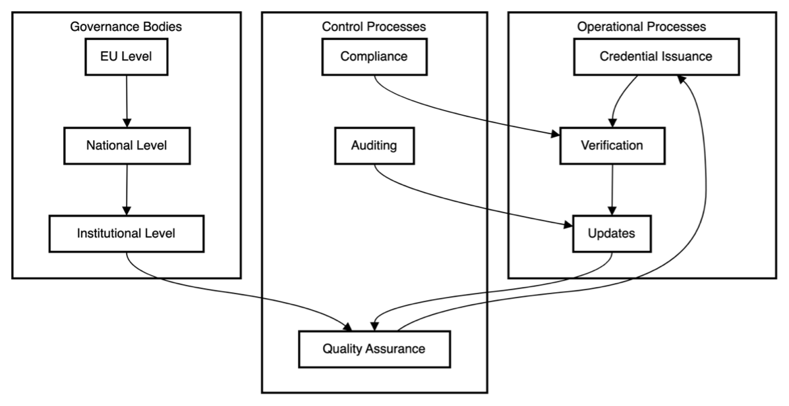
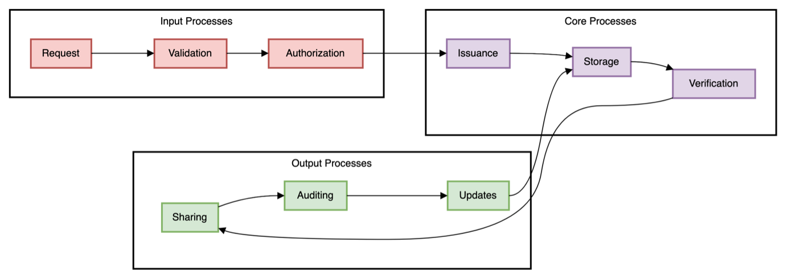
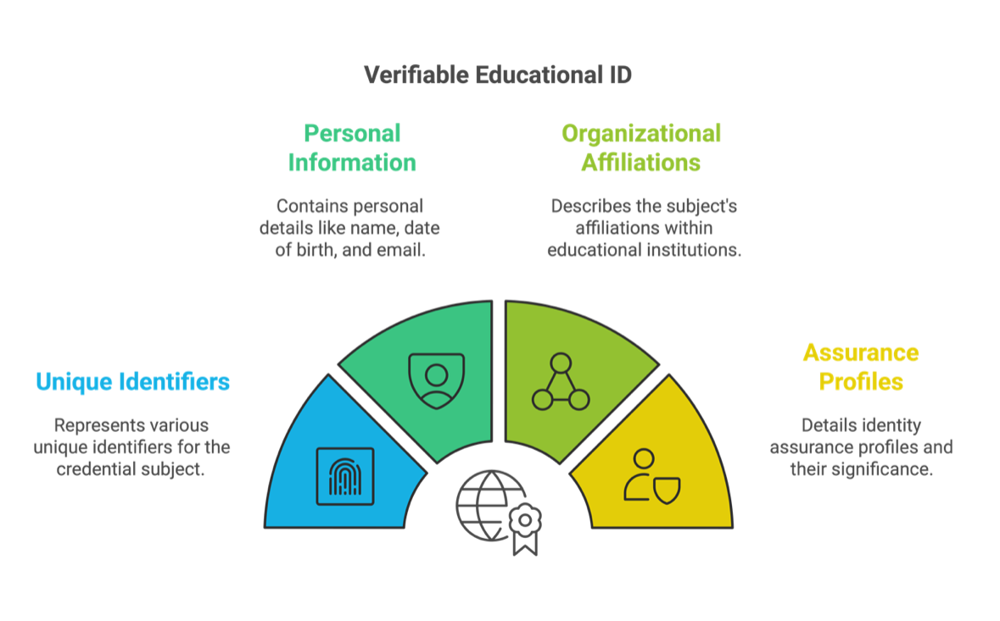

# Chapter 9: Data models

Proposed data models form part of the European Union's strategy to digitise educational credentials and streamline student mobility across Europe. They represent different layers of digital identity management in the educational context, from institutional identification to cross-border mobility and comprehensive learning records.

## Purpose and scope

Each model serves distinct yet complementary purposes:

- Managing institutional identities
- Supporting cross-border student mobility
- Enabling university alliance collaboration
- Recording comprehensive learning achievements
- Creating verifiable digital credentials

These schemas align with European standards for digital credentials and support the broader goals of the European Education Area by enabling seamless educational experiences across borders.

## 9.1 EducationalID

This data model represents a verifiable educational ID schema for individuals in educational settings. This model serves educational institutions by providing a standardised way to issue verifiable digital credentials that can be trusted across the European education sector while maintaining privacy and security standards.

The schema defines a structure for educational identification credentials that follows the json-schema.org draft 2020-12 standard.

### Structure overview

The main component of this schema is the credentialSubject object, which contains personal and educational information about an individual. Let's examine the key fields:

#### Core identification elements:

| Field | Description | Format | Purpose |
|-------|-------------|---------|---------|
| `id` | Unique identifier using DID:Key format | DID format | Generated by the user's wallet |
| `identifier` | Persistent global identifier | String | Linked to the person's eduPersonPrincipalName |
| `schacHomeOrganization` | Educational institution | String | Where the person belongs |

#### Personal information:

| Field | Description | Format | Purpose |
|-------|-------------|---------|---------|
| `familyName` | Current legal surname | String | Person's current legal name |
| `firstName` | Current legal first name | String | Person's current legal name |
| `displayName` | Preferred name | String | For directory listings |
| `dateOfBirth` | Birth date | yyyyMMdd | Additional identifier |
| `commonName` | Birth names | String | Original names at birth |
| `mail` | Primary email | String | Institutional email address |

#### Educational affiliations:

| Field | Description | Format | Purpose |
|-------|-------------|---------|---------|
| `eduPersonPrincipalName` | Persistent identifier | String | Within the institution |
| `eduPersonPrimaryAffiliation` | Main role | String | Primary role at institution |
| `eduPersonAffiliation` | All roles | Array of strings | Student, staff, faculty, etc. |
| `eduPersonScopedAffiliation` | Roles with context | Array of strings | Institutional context |
| `eduPersonAssurance` | Identity assurance levels | Array of strings | REFEDS framework standards |

### Additional features

The schema includes support for profile images through a MediaObject type definition, which can handle various media formats with proper content type and encoding specifications.

### Mandatory fields

Three mandatory fields exist:
- `id`
- `identifier`
- `eduPersonScopedAffiliation`

### Technical capabilities

The schema supports:
- Internationalisation through language codes
- Strict validation rules for URIs and other standardised identifiers
- Various media formats for profile images
- Educational sector-specific requirements

### Institutional focus

This model represents an institutional view, where the focus lies on:

- Recording formal relationships between a person and their educational institution
- Capturing multiple roles within the institution (student, staff, faculty)
- Managing institutional email and identification systems
- Recording specific institutional affiliations through schacHomeOrganization



**JSON serialisation**

See [Annex C: Data models](annexes/AnnexC/README.md) for complete JSON schema implementation.

## 9.2 MyAcademicID

This schema defines the MyAcademicId credential structure, which represents a standardised digital identity for academic and research communities in mobility across Europe. The schema enables educational institutions to issue standardised digital credentials that support academic mobility while maintaining proper identity management practices.

### Core identification fields:

| Field | Description | Format | Standards Compliance |
|-------|-------------|---------|---------------------|
| `id` | Unique identifier | DID format | W3C DID specification |
| `communityUserIdentifier` | Permanent identifier | eduPersonUniqueId format | Scoped to erasmus.eduteams.org |
| `europeanStudentIdentifier` | ESI values | Array of strings | Student mobility support |

### Personal information:

| Field | Description | Format | Standards Reference |
|-------|-------------|---------|-------------------|
| `displayName` | Full name | String | Complex naming structures |
| `givenName` | First names | String | RFC4519 standards |
| `familyName` | Surname | String | RFC4519 standards |
| `emailAddress` | Email contact | Email format | Format validation |
| `organization` | Affiliated organisation | String | Institutional affiliation |

### Affiliation and rights:

| Field | Description | Format | Purpose |
|-------|-------------|---------|---------|
| `externalAffiliation` | Academic relationships | Array of strings | eduPersonScopedAffiliation format |
| `entitlements` | Rights and capabilities | Array of strings | Granted permissions |
| `assurance` | Identity verification levels | Array of strings | REFEDS Assurance Framework |

### Mandatory fields

The schema requires seven mandatory fields:
1. `id`
2. `communityUserIdentifier`
3. `displayName`
4. `givenName`
5. `familyName`
6. `emailAddress`
7. `assurance`

### Standards integration

Each field links to official standards through Object Identifiers (OIDs) and follows established educational sector specifications from REFEDS and related frameworks.

### European academic community support

This model supports the European academic community by:

- Creating persistent identifiers that work across institutions
- Supporting student mobility through standardised European Student Identifiers
- Maintaining compatibility with existing educational directory services
- Providing clear identity assurance levels
- Supporting cross-border academic services


**JSON serialisation**

See [Annex C: Data models](annexes/AnnexC/README.md) for complete JSON schema implementation.

## 9.3 Europass Digital Credentials (European Learning Model v3.2)

This schema defines the structure for Europass Digital Credentials (EDC), which is built on the European Learning Model (ELM) version 3.2. The schema represents a comprehensive framework for digital educational credentials in Europe.

The EDC schema represents a comprehensive data model developed by the European Commission to standardise educational data exchange across Europe.

### Core structure and principles:

| Feature | Implementation | Benefit |
|---------|----------------|---------|
| **Standards base** | W3C Verifiable Credential data model | International compatibility |
| **Language support** | Available in 31 European languages | Pan-European accessibility |
| **Framework mapping** | ELMO, EQF, ESCO, EBSI integration | European standards alignment |
| **Security** | Authentic, tamper-evident digital credentials | Trust and integrity |

### Schema components

The main body of the schema comprises several key components:

#### Core credential structure:

| Component | Description | Purpose |
|-----------|-------------|---------|
| `EuropeanDigitalCredentialType` | Primary credential object | Foundation structure |
| Mandatory fields | Issuer, subject, validity dates, credential schema | Essential information |
| Credential profiles | Multiple profile support | Flexible implementation |
| Display parameters | Presentation control | User experience |

#### Learning-related entities:

| Entity | Function | Educational Value |
|--------|----------|-------------------|
| `LearningAchievement` | Records completed accomplishments | Educational outcomes |
| `LearningActivity` | Describes undertaken activities | Learning process |
| `LearningAssessment` | Documents evaluation methods and results | Quality assurance |
| `LearningEntitlement` | Specifies granted rights or permissions | Career progression |

#### Supporting elements:

| Element | Purpose | Implementation |
|---------|---------|----------------|
| `Organization` | Educational institutions | Legal identifiers |
| `Person` | Credential holders | Detailed information |
| `Location` | Geographical information | Standardised format |
| `MediaObject` | Attachments and visual elements | Multimedia support |
| `Evidence` | Verification support | Claims validation |

#### Administrative components:

| Component | Function | Benefit |
|-----------|----------|---------|
| `AwardingProcess` | Records credential granting | Process transparency |
| `VerificationCheck` | Manages verification | Trust assurance |
| `CredentialStatus` | Tracks current state | Lifecycle management |
| `DisplayParameter` | Controls presentation | User interface |

### Advanced features

The schema includes:
- Extensive multilingual support through `LangStringType`
- Standardised reference data using `ConceptType`
- Consistent interpretation across European education systems

### External standards integration

The model links with external standards and frameworks:

| Integration | Purpose | Benefit |
|-------------|---------|---------|
| Standard identifiers (URIs) | Concept identification | Universal recognition |
| Education-specific standards | Domain alignment | Sector compatibility |
| Grading schemes and credit systems | Assessment framework | Quality assurance |
| Verification through proof mechanisms | Security | Trust establishment |

Each component maintains strict validation requirements while offering flexibility to accommodate different educational contexts across Europe.



### Versatility and applications

The European Learning Model (ELM) can be used to issue credentials (referred to as Electronic Attestations of Attributes - EAAs), for a wide range of education and training levels and contexts. This includes tertiary, secondary, primary, and adult education, as well as formal, non-formal, and informal learning achievements. The model is highly adaptable and built on principles that support various types of learning outcomes, making it suitable for diverse use cases.

#### Examples of credentials supported by ELM:

**Formal Education:**
- **Tertiary**: VET, Master's and Bachelor's degrees, Diplomas, Doctorates
- **Secondary and Primary**: VET, Certificates of Completion, High School Diplomas

**Non-Formal Education:**
- **Micro-credentials**: Short learning programmes, skill certifications
- **Adult education achievements**: Continuing education courses, vocational training certificates

**Informal Education:**
- Certificates of participation or completion in workshops or training programmes
- Records of learning achievements gained through informal means, such as MOOCs or self-paced learning platforms

#### Features making ELM suitable for various education types:

| Feature | Description | Benefit |
|---------|-------------|---------|
| **Versatility** | Encoding information for different educational settings and levels | Comprehensive coverage |
| **Interoperability** | Alignment with W3C VC Data Model and European frameworks | System compatibility |
| **Customisation** | Tailored to different credentialing needs | Flexible implementation |
| **Recognition scope** | Support for structured and unstructured learning experiences | Complete learning journey |

### Supporting EU strategies:

| Strategy | ELM Support | Implementation |
|----------|-------------|----------------|
| **Micro-Credentials Framework** | Council Recommendation support | Standardised issuance, enhanced transparency, portability |
| **Digital Education Action Plan** | Digital credentialing processes | Lifelong learning, seamless mobility |
| **EBSI and eIDAS Integration** | Standards compliance | Verifiability and trust |

### Practical applications:

| Application | Description | Benefit |
|-------------|-------------|---------|
| **Master's Degree Issuance** | University issues credential in ELM format | EQF compatibility, cross-border recognition |
| **Micro-Credentials for Upskilling** | Online provider issues skill-specific credentials | EUDI Wallet integration |
| **Transcript of Records** | Erasmus+ participant receives digital transcript | Seamless credit transfer |

The ELM's flexibility and alignment with European and global standards make it an effective framework for issuing and verifying credentials across all types of education, facilitating recognition and mobility for learners and professionals.

**JSON serialisation**

See [Annex C: Data models](annexes/AnnexC/README.md) for complete JSON schema implementation.

## 9.4 AllianceID

This schema defines the structure for a verifiable University Alliance ID. It's designed to identify members of European university alliances. The schema represents a minimalist but effective approach to identity management within university alliances, requiring only essential identification elements while maintaining the verifiable nature of the credential.

### Schema structure

The schema contains two main sections:

#### Core credential subject fields:

| Field | Description | Format | Purpose |
|-------|-------------|---------|---------|
| `id` | Unique identifier | String | Individual identification |
| `identifier` | Structured object | Object | Alliance-specific details |

#### Identifier object components:

| Component | Description | Format | Purpose |
|-----------|-------------|---------|---------|
| `schemeID` | Identification scheme | String | Scheme definition |
| `value` | Identification value | String | Actual identifier |
| `id` | URI format identifier | URI | Linked reference |

### Alliance identification format

The schema uses a specific format for alliance identification:

```
urn:schac:europeanUniversityAllianceCode:int:euai:<sHO>:<code>
```

**Where:**
- `sHO`: The schacHomeOrganization of the issuing alliance
- `code`: The specific university alliance code

### Alliance support features

This model serves university alliances by:

| Feature | Purpose | Benefit |
|---------|---------|---------|
| **Standardised identifiers** | Alliance member identification | Consistent recognition |
| **EBSI compatibility** | Standards compliance | Technical interoperability |
| **Verifiable credentials** | Cryptographic security | Trust assurance |
| **Cross-alliance recognition** | Inter-alliance cooperation | Enhanced mobility |



**JSON serialisation**

See [Annex C: Data models](annexes/AnnexC/README.md) for complete JSON schema implementation.

---

## Integration and implementation

These data models are designed to work together as part of the comprehensive European digital credential ecosystem described in [Chapter 8: Technical framework and sectorial EAA's catalogue](chapter8.md). The technical specifications detailed in [Chapter 8](chapter8.md) provide the infrastructure necessary to implement these models effectively.

For practical implementation guidance, see [Chapter 10: Implementation roadmap](chapter10.md), which outlines the structured approach for adopting these data models across EU member states.

The operational context for these data models is established in [Chapter 4: Operational model](chapter4.md), while specific use cases demonstrating their application are provided in [Chapter 7: Use cases and implementation scenarios](chapter7.md).

## Regulatory compliance

All data models comply with the regulatory framework outlined in [Annex D: Regulatory references](annexes/AnnexD/README.md), ensuring alignment with European legislation including eIDAS, GDPR, and sector-specific regulations.

For comprehensive definitions of technical terms used throughout these data models, consult [Annex A: Glossary of terms](annexes/AnnexA/README.md).