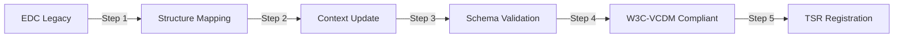
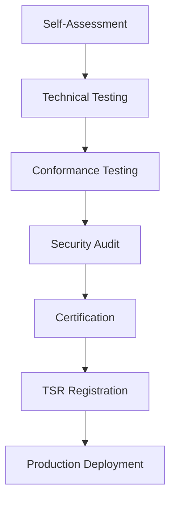

# Chapter 8: Technical framework and sectorial EAA's catalogue

## 8.1 Introduction

This chapter presents the comprehensive technical framework for implementing European Digital Credentials (EDC) aligned with the W3C Verifiable Credentials Data Model (VCDM) v1.1, as mandated by the first batch of eIDAS2 implementing acts. The technical specifications presented here are finalised in the DC4EU Sectorial EAA Catalogue and registered in the European Blockchain Services Infrastructure (EBSI) Trusted Schemas Registry.

The framework encompasses four major credential categories:
- **Foundational Identity**: Core identity credentials including PID
- **Formal Education**: Academic qualifications and learning achievements
- **Professional Qualifications**: Professional certifications and competencies
- **Non-Foundational Identity**: Educational and professional identity credentials

## 8.2 Sectorial EAA Catalogue Overview

### 8.2.1 Credential Categories and Types

The sectorial catalogue defines 30+ credential types across four main categories:

| Category | Credential Types | Standards | Registry |
|----------|-----------------|-----------|----------|
| **Foundational Identity** | PID, Legal Entity ID | eIDAS 2.0, ISO/IEC 18013-5 | EBSI TSR |
| **Formal Education** | 15 credential types | ELM v3.2, EDC-W3C-VCDM | EBSI TSR |
| **Professional Qualifications** | 6 credential types | W3C VCDM v1.1 | EBSI TSR |
| **Non-Foundational Identity** | 8 credential types | W3C VCDM v1.1, SCHAC | EBSI TSR |

### 8.2.2 Complete Credential Catalogue

#### Formal Education Credentials

| ID | Name | Description | Schema ID | Status |
|----|------|-------------|-----------|---------|
| **EUHED** | European Higher Education Diploma | Bachelor/Master degrees | `0x2488bbdc430d8e787487b5e83b2b688dfadb97797589ab5fa17b74ac92a11fea` | Active |
| **EUHEDS** | HE Diploma Supplement | Additional diploma information | `0xda6a87e64a6b7dd5cccd4fea7a3870a4f54a5a08ac893bb5c1a731e87f5a3c52` | Active |
| **EUHETOR** | HE Transcript of Records | Academic transcript | `0x802e3e93ce1bb7c7b86e2912fd322ed87aee7670f7c1a20a63c14f3` | Active |
| **EUHEPOE** | HE Proof of Enrolment | Student registration proof | `0x85e8c135a8b1e96f5a13cf937ba5c4d60e5f90e577e953cc93a23a52e9bf8cc3` | Active |
| **EUHEMC** | HE Micro-credential | Short learning programmes | `0x37510d93ed85e3f7c41e13c421ba7f8748c0c10c960e9e4ea944bc7ba1c2e743` | Active |
| **EUUSC** | Upper Secondary Certificate | Secondary education diploma | `0x901e24612f601d3f6932b3d20ba50615cfd6d64ce4e8c263312b5c3c3b2f9623` | Active |
| **EUUSTOR** | Upper Secondary Transcript | Secondary academic records | `0xaf79750aade036da40ba02a0b85f671d7232a1ad13df91b72df2ba0891f91aba` | Active |
| **EUVETMC** | VET Micro-credential | Vocational micro-credentials | TBD | Draft |
| **EUVETD** | VET Diploma | Vocational education diploma | TBD | Draft |
| **EUVETC** | VET Certificate | Vocational certificates | TBD | Draft |

#### Professional Qualifications Credentials

| ID | Name | Description | Schema ID | Status |
|----|------|-------------|-----------|---------|
| **CPC** | Certificate of Professional Competence | Professional competency attestation | TBD | Active |
| **PMC** | Professional Medical Certification | Medical professional certification | TBD | Active |
| **CPS** | Certificate of Professional Suitability | Professional suitability attestation | `0x2d5971743a402de5ba00aad9697200153cbac29ccb5b1852e704cd541213f994` | Active |
| **AMT** | Accreditation Medical Training | Medical training accreditation | `0xa92c40f0684db3bbcf2bb2600579dfaf7785a421515394c79eb9de41debf17a7` | Active |
| **CPD** | Continuous Professional Development | Professional development records | `z3RwKaN1kZciYkRpkqjwTW6whKV4WefiYx6wviWR7gzow` | Active |
| **PTC** | Professional Training Certificate | Professional training completion | `zCPP3GVyk2bK65E81K8BC6T2gdNYQNEeKgm9wEYuSgHTU` | Active |

#### Non-Foundational Identity Credentials

| ID | Name | Description | Schema ID | Status |
|----|------|-------------|-----------|---------|
| **EducationalID** | Educational Identity | Student/staff identification | `z7FY4pzTrkMBHvbYvBSLKJwaKD6pq5FdcGEqmCmQU1kPR` | Active |
| **AllianceID** | Alliance Identity | European University Alliance ID | `zCHc3ZfYg2871W2WftjLu4QNMQrDzG57oG5pvGoyHcagB` | Active |
| **MyAcademicID** | MyAcademic Identity | Academic mobility identifier | `z3XDm4kDtztE8DzLsVdhfshYvx2upnfLmqHtyVjkaXM1g` | Active |
| **ESC** | European Student Card | Digital student card | `0x0e46f9509c52e649d8b461216b66836bd8398b8779469a571404264ea02c3bd9` | Active |
| **ProfessionalID** | Professional Identity | Professional identification | `z2CHBovrL2TptHFFtszG5Jn8LZU1SxLfMY6Vg93ctKEAw` | Active |
| **DoctorID** | Doctor Identity | Medical professional ID | `zDD8wM8F6UsfrdACeph41EFmgEUUsDnC6SVqY4QFh8MFZ` | Active |
| **EngineerID** | Engineer Identity | Engineering professional ID | TBD | Draft |
| **AlumniID** | Alumni Identity | Graduate affiliation | TBD | Draft |

## 8.3 Core Technical Architecture

### 8.3.1 Standards Compliance Framework

All credentials must comply with the following standards hierarchy:

```
┌─────────────────────────────────────┐
│     eIDAS 2.0 Implementing Acts    │
└────────────┬────────────────────────┘
             │
┌────────────▼────────────────────────┐
│    W3C VCDM v1.1 Specification     │
└────────────┬────────────────────────┘
             │
┌────────────▼────────────────────────┐
│   European Learning Model v3.2      │
└────────────┬────────────────────────┘
             │
┌────────────▼────────────────────────┐
│    EBSI Trust Framework v2.0       │
└─────────────────────────────────────┘
```

### 8.3.2 Technical Components

| Component | Specification | Implementation |
|-----------|--------------|----------------|
| **Schema Format** | JSON Schema Draft 2020-12 | EBSI TSR registered |
| **Credential Format** | JSON-LD with W3C context | EDC-W3C-VCDM compliant |
| **Identifier System** | DIDs (did:ebsi, did:key) | EBSI DID Registry |
| **Proof Mechanism** | JSON Web Signature (ES256) | JOSE/COSE formats |
| **Trust Registry** | EBSI TIR/TAOR/TSR | Distributed ledger |
| **Revocation** | StatusList2021 | Privacy-preserving |
| **Selective Disclosure** | SD-JWT | BBS+ signatures |

## 8.4 Data Model Specifications

### 8.4.1 EDC to W3C-VCDM Conversion

The conversion from European Digital Credentials (EDC) to W3C-VCDM compliant format follows these mapping rules:

| EDC Element | W3C-VCDM Element | Transformation |
|-------------|------------------|----------------|
| `credential` wrapper | Root level | Flatten structure |
| `issued` | `issuanceDate` | ISO 8601 format |
| `validFrom` | `validFrom` | Maintain |
| `credentialProfiles` | `type[]` | Append to type array |
| `displayParameter` | Extension | Schema extension |
| `deliveryDetails` | Remove | Not required |

### 8.4.2 Core Credential Structure

All credentials follow this base structure:

```json
{
  "@context": [
    "https://www.w3.org/2018/credentials/v1",
    "https://api-pilot.ebsi.eu/trusted-schemas-registry/v3/contexts/[specific-context]"
  ],
  "id": "urn:uuid:[credential-uuid]",
  "type": ["VerifiableCredential", "VerifiableAttestation", "[SpecificType]"],
  "credentialSchema": {
    "id": "https://api-pilot.ebsi.eu/trusted-schemas-registry/v3/schemas/[schema-id]",
    "type": "JsonSchema2020"
  },
  "issuer": "did:ebsi:[issuer-did]",
  "issuanceDate": "2025-01-01T00:00:00Z",
  "credentialSubject": {
    "id": "did:key:[subject-did]",
    // Type-specific attributes
  },
  "proof": {
    "type": "JsonWebSignature2020",
    "created": "2025-01-01T00:00:00Z",
    "proofPurpose": "assertionMethod",
    "verificationMethod": "did:ebsi:[issuer-did]#keys-1",
    "jws": "eyJhbGc..."
  }
}
```

## 8.5 European Learning Model (ELM) Integration

### 8.5.1 ELM v3.2 Core Entities

The European Learning Model provides semantic definitions for educational credentials:

| Entity | Description | Usage |
|--------|-------------|-------|
| **LearningAchievement** | Acquired knowledge/skills/competences | All educational credentials |
| **LearningActivity** | Educational activities undertaken | Course descriptions |
| **LearningAssessment** | Evaluation of learning outcomes | Grading information |
| **LearningEntitlement** | Rights conferred by qualification | Professional practice rights |
| **LearningOpportunity** | Available learning programmes | Programme descriptions |
| **LearningSpecification** | Detailed learning definitions | Curriculum specifications |

### 8.5.2 ELM Controlled Vocabularies

| Vocabulary | Source | Examples |
|------------|--------|----------|
| **EQF Levels** | `http://data.europa.eu/snb/eqf/` | Levels 1-8 |
| **ESCO Skills** | `http://data.europa.eu/esco/` | Skills taxonomy |
| **ISCED-F** | `http://data.europa.eu/snb/isced-f/` | Field of study codes |
| **NUTS** | `http://data.europa.eu/nuts/` | Regional codes |
| **Grading Schemes** | National registries | Country-specific |

## 8.6 Trust Infrastructure

### 8.6.1 Trust Registry Architecture

```
┌──────────────────────────────────────────────┐
│     Trusted Issuers Registry (TIR)          │
│  - Issuer DIDs and accreditations           │
│  - Authorisation policies                    │
└──────────────────┬───────────────────────────┘
                   │
┌──────────────────▼───────────────────────────┐
│  Trusted Schemas Registry (TSR)             │
│  - Credential schemas                        │
│  - Version management                        │
└──────────────────┬───────────────────────────┘
                   │
┌──────────────────▼───────────────────────────┐
│  Trusted Accreditation Organisations (TAOR)  │
│  - Quality assurance bodies                  │
│  - Recognition authorities                   │
└──────────────────────────────────────────────┘
```

### 8.6.2 Issuer Accreditation Requirements

| Credential Category | Required Accreditation | Accrediting Body |
|--------------------|------------------------|------------------|
| **Higher Education** | HEI accreditation | National QA agencies |
| **VET** | VET provider accreditation | National VET authorities |
| **Professional** | Professional body membership | Regulatory bodies |
| **Non-foundational ID** | Institutional affiliation | Educational institutions |

## 8.7 Implementation Examples

### 8.7.1 Higher Education Diploma (EUHED)

```json
{
  "@context": [
    "https://www.w3.org/2018/credentials/v1",
    "https://api-pilot.ebsi.eu/trusted-schemas-registry/v3/contexts/european-digital-credential-v3.jsonld"
  ],
  "id": "urn:epass:credential:2c64bfb6-c3e9-4d95-8547-e0f9e5f47906",
  "type": [
    "VerifiableCredential",
    "VerifiableAttestation",
    "EuropeanDigitalCredential",
    "HigherEducationDiploma"
  ],
  "credentialSchema": {
    "id": "https://api-pilot.ebsi.eu/trusted-schemas-registry/v3/schemas/0x2488bbdc430d8e787487b5e83b2b688dfadb97797589ab5fa17b74ac92a11fea",
    "type": "JsonSchema2020"
  },
  "issuer": {
    "id": "did:ebsi:university-madrid",
    "preferredName": {
      "en": "Technical University of Madrid",
      "es": "Universidad Politécnica de Madrid"
    }
  },
  "issuanceDate": "2025-06-15T10:00:00Z",
  "credentialSubject": {
    "id": "did:key:z2dmzD81cgPx8Vki7JbuuMmFYrWPgYoytyKUZ3eyqht1j9Kbh4",
    "givenName": "María",
    "familyName": "García López",
    "learningAchievement": {
      "title": {
        "en": "Bachelor of Science in Computer Engineering",
        "es": "Grado en Ingeniería Informática"
      },
      "specifiedBy": {
        "eqfLevel": "http://data.europa.eu/snb/eqf/6",
        "creditPoint": [{
          "framework": "http://data.europa.eu/snb/education-credit/ects",
          "value": 240
        }],
        "iscedfCode": ["0613"]
      }
    }
  }
}
```

### 8.7.2 Professional Medical Certification (PMC)

```json
{
  "@context": [
    "https://www.w3.org/2018/credentials/v1",
    "https://api-pilot.ebsi.eu/trusted-schemas-registry/v3/contexts/professional-medical-v1.jsonld"
  ],
  "type": ["VerifiableCredential", "ProfessionalMedicalCertification"],
  "issuer": "did:ebsi:medical-board-spain",
  "credentialSubject": {
    "id": "did:key:practitioner-did",
    "personalAdministrativeNumber": "MD-2025-123456",
    "legallyEntitled": true,
    "medicalSpeciality": ["Cardiology", "Internal Medicine"],
    "professionalBoard": "Colegio de Médicos de Madrid"
  }
}
```

### 8.7.3 Educational ID with SCHAC Attributes

```json
{
  "@context": [
    "https://www.w3.org/2018/credentials/v1",
    "https://api-pilot.ebsi.eu/trusted-schemas-registry/v3/contexts/educational-id-v1.jsonld"
  ],
  "type": ["VerifiableCredential", "EducationalID"],
  "credentialSchema": {
    "id": "https://api-pilot.ebsi.eu/trusted-schemas-registry/v3/schemas/z7FY4pzTrkMBHvbYvBSLKJwaKD6pq5FdcGEqmCmQU1kPR",
    "type": "JsonSchema2020"
  },
  "issuer": "did:ebsi:university-alliance",
  "expirationDate": "2026-08-31T23:59:59Z",
  "credentialSubject": {
    "id": "did:key:student-did",
    "identifier": {
      "schemeID": "urn:schac:personalUniqueCode:int:esi:eu",
      "value": "ESI-EU-2025-123456"
    },
    "eduPersonPrincipalName": "maria.garcia@university.edu",
    "eduPersonScopedAffiliation": ["student@university.edu"],
    "eduPersonAffiliation": ["student", "member"],
    "eduPersonAssurance": [
      "https://refeds.org/assurance/IAP/low",
      "https://refeds.org/assurance/ATP/ePA-1m"
    ]
  }
}
```

## 8.8 Quality Assurance and Validation

### 8.8.1 Validation Requirements Matrix

| Validation Level | Requirements | Tools |
|-----------------|--------------|-------|
| **Schema Validation** | JSON Schema 2020-12 compliance | EBSI Conformance API |
| **Semantic Validation** | ELM v3.2 ontology alignment | Semantic validators |
| **Cryptographic Validation** | Signature verification | JOSE libraries |
| **Trust Chain Validation** | Issuer authorisation | TIR lookup |
| **Business Rules** | Domain-specific rules | Custom validators |

### 8.8.2 EBSI Validation Endpoints

| Service | Endpoint | Purpose |
|---------|----------|---------|
| **Schema Validation** | `https://api-pilot.ebsi.eu/conformance/v3/validate-schema` | Schema compliance |
| **Credential Verification** | `https://api-pilot.ebsi.eu/conformance/v3/verify-credential` | Full validation |
| **DID Resolution** | `https://api-pilot.ebsi.eu/did-registry/v4/identifiers/{did}` | DID document |
| **TSR Query** | `https://api-pilot.ebsi.eu/trusted-schemas-registry/v3/schemas/{id}` | Schema retrieval |
| **TIR Query** | `https://api-pilot.ebsi.eu/trusted-issuers-registry/v4/issuers/{did}` | Issuer verification |

## 8.9 Privacy and Data Protection

### 8.9.1 Selective Disclosure Mechanisms

| Method | Use Case | Implementation |
|--------|----------|----------------|
| **SD-JWT** | Selective attribute disclosure | Hash-based hiding |
| **BBS+ Signatures** | Zero-knowledge proofs | Pairing-based crypto |
| **Holder Binding** | Proof of possession | Key binding |
| **Pseudonymisation** | Privacy preservation | Derived identifiers |

### 8.9.2 GDPR Compliance Requirements

| Requirement | Implementation | Verification |
|-------------|----------------|--------------|
| **Data Minimisation** | Only essential attributes | Schema review |
| **Purpose Limitation** | Credential-specific use | Policy enforcement |
| **Storage Limitation** | Expiration dates | Automatic expiry |
| **Right to Erasure** | Revocation support | StatusList2021 |
| **Data Portability** | Standard formats | W3C VCDM |

## 8.10 Multilingual Support

### 8.10.1 Language Implementation Pattern

All text fields support multilingual content using ISO 639-1 codes:

```json
{
  "title": {
    "en": "Bachelor of Science",
    "es": "Grado en Ciencias",
    "fr": "Licence en Sciences",
    "de": "Bachelor der Wissenschaften",
    "it": "Laurea in Scienze"
  }
}
```

### 8.10.2 Required Language Support

| Credential Type | Primary Language | Additional Required | Optional |
|----------------|------------------|-------------------|----------|
| **National Credentials** | National language | English | Regional languages |
| **EU-wide Credentials** | English | Issuer's language | All EU languages |
| **Alliance Credentials** | English | Member languages | Partner languages |

## 8.11 Migration and Versioning

### 8.11.1 Schema Version Management

| Version | Release | Key Changes | Migration Required |
|---------|---------|-------------|-------------------|
| v0.9 | 2024-03 | Initial draft | - |
| v1.0 | 2024-06 | First stable release | No |
| v1.1 | 2024-09 | Added selective disclosure | No |
| v1.2 | 2025-01 | Enhanced privacy features | No |
| v2.0 | 2025-Q3 | W3C VCDM v2.0 alignment | Yes |

### 8.11.2 Migration Procedures



## 8.12 Implementation Roadmap

### 8.12.1 Deployment Phases

| Phase | Timeline | Scope | Deliverables |
|-------|----------|-------|--------------|
| **Phase 1** | Q1 2025 | Foundation | PID, Basic schemas |
| **Phase 2** | Q2 2025 | Education | HE/VET credentials |
| **Phase 3** | Q3 2025 | Professional | Professional qualifications |
| **Phase 4** | Q4 2025 | Full deployment | All credential types |

### 8.12.2 Adoption Metrics

| Metric | Target | Measurement |
|--------|--------|-------------|
| **Schema Registration** | 100% in TSR | Registry queries |
| **Issuer Onboarding** | 500+ institutions | TIR entries |
| **Credential Issuance** | 1M+ credentials | Transaction volume |
| **Cross-border Usage** | 25+ countries | Geographic distribution |

## 8.13 Technical Support and Resources

### 8.13.1 Documentation Resources

| Resource | URL | Description |
|----------|-----|-------------|
| **EBSI Documentation** | https://docs.ebsi.eu | Technical specifications |
| **DC4EU Schemas** | https://schemas.dc4eu.eu | Schema repository |
| **Implementation Guide** | https://guide.dc4eu.eu | Step-by-step guides |
| **API Reference** | https://api.dc4eu.eu/docs | API documentation |
| **Support Portal** | https://support.dc4eu.eu | Technical support |

### 8.13.2 Reference Implementations

| Component | Repository | Language |
|-----------|------------|----------|
| **Issuer Agent** | github.com/dc4eu/issuer | TypeScript |
| **Verifier Library** | github.com/dc4eu/verifier | JavaScript |
| **Schema Validator** | github.com/dc4eu/validator | Python |
| **Wallet SDK** | github.com/dc4eu/wallet-sdk | Kotlin/Swift |

## 8.14 Compliance and Certification

### 8.14.1 Compliance Framework

All implementations must pass:

1. **Technical Compliance**
   - EBSI Conformance Tests (100% pass rate)
   - W3C VCDM Test Suite
   - JSON Schema validation

2. **Regulatory Compliance**
   - eIDAS2 requirements
   - GDPR assessment
   - National regulations

3. **Interoperability Testing**
   - Cross-wallet compatibility
   - Cross-border verification
   - Multi-language support

### 8.14.2 Certification Process



## 8.15 Security Considerations

### 8.15.1 Security Requirements

| Layer | Requirement | Implementation |
|-------|-------------|----------------|
| **Cryptographic** | Strong key management | Hardware security modules |
| **Network** | Secure communication | TLS 1.3+ |
| **Application** | Input validation | Schema enforcement |
| **Infrastructure** | Secure storage | Encrypted databases |
| **Operational** | Incident response | 24/7 monitoring |

### 8.15.2 Threat Model

| Threat | Mitigation | Verification |
|--------|------------|--------------|
| **Credential Forgery** | Cryptographic signatures | Signature validation |
| **Identity Theft** | Holder binding | Proof of possession |
| **Data Breach** | Encryption at rest | Security audits |
| **Replay Attacks** | Timestamps, nonces | Freshness checks |
| **Revocation Delay** | Real-time status | StatusList2021 |

## 8.16 Annexes and Detailed Specifications

For complete technical specifications, schemas, and implementation details, refer to:

- **Annex A**: Complete JSON-LD schemas repository
- **Annex B**: Trust registry specifications (TIR, TAOR, TSR)
- **Annex C**: Detailed data models and schemas
- **Annex D**: Implementation guidelines and conversion tools
- **Annex E**: EAA characterisation framework
- **Annex F**: Compliance and audit requirements
- **Annex G**: Registry URLs and schema locations

## 8.17 Conclusions

The technical framework and sectorial EAA catalogue presented in this chapter provide a comprehensive foundation for implementing the full spectrum of European Digital Credentials. Key achievements include:

- **Complete Catalogue**: 30+ credential types across all sectors
- **Standards Alignment**: Full compliance with eIDAS2, W3C VCDM v1.1, and ELM v3.2
- **Trust Infrastructure**: Integration with EBSI trust services
- **Privacy by Design**: Advanced selective disclosure and zero-knowledge proofs
- **Interoperability**: Cross-border, cross-sector credential portability
- **Multilingual Support**: Comprehensive language handling for EU-wide deployment

### Next Steps

1. **Review Annex C** for detailed data model specifications
2. **Consult Implementation Guidelines** in Annex D
3. **Access Schema Registry** for latest versions
4. **Join pilot programmes** for hands-on experience

### Version Information

- **Document Version**: 2.0
- **Last Updated**: January 2025
- **Schema Baseline**: v1.2
- **Next Review**: Q3 2025

---

*For the most current specifications and updates, consult the EBSI Trusted Schemas Registry at https://api-pilot.ebsi.eu/trusted-schemas-registry and the DC4EU documentation portal at https://www.dc4eu.eu
```