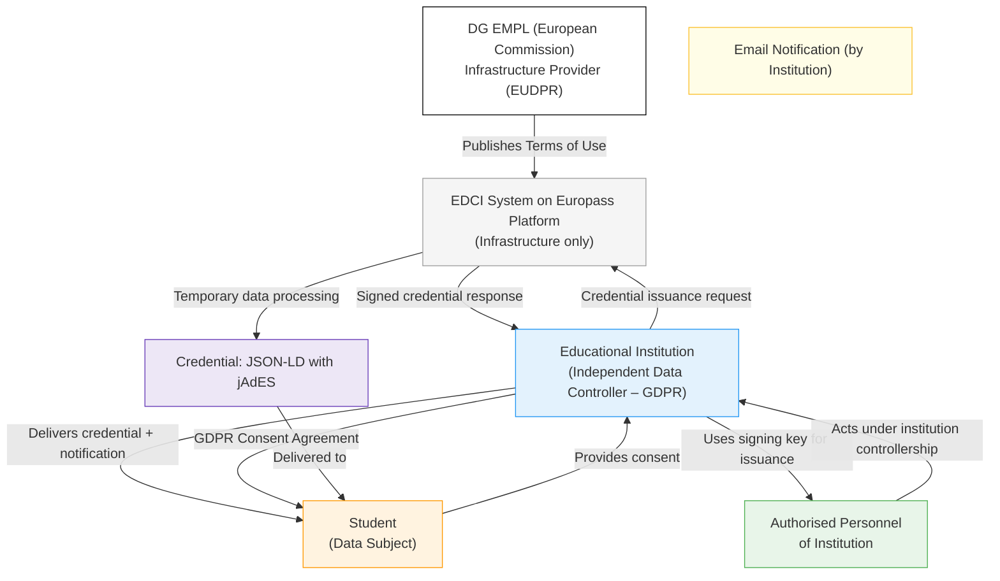
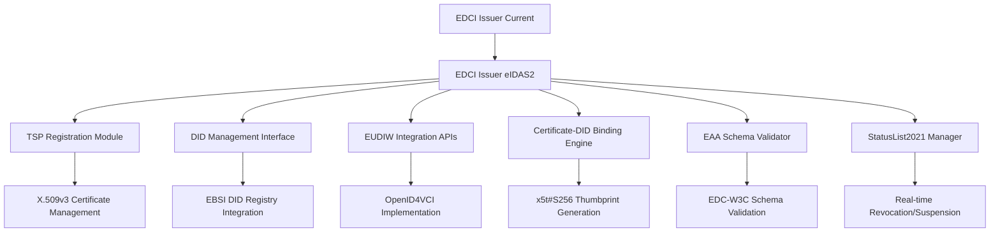
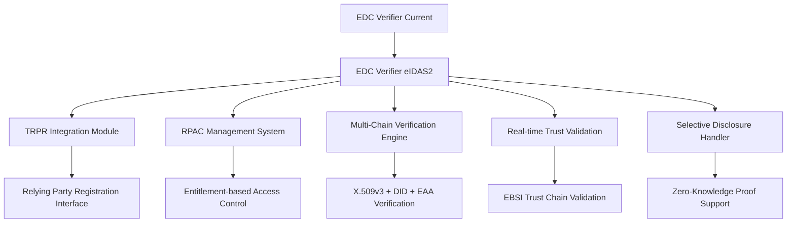
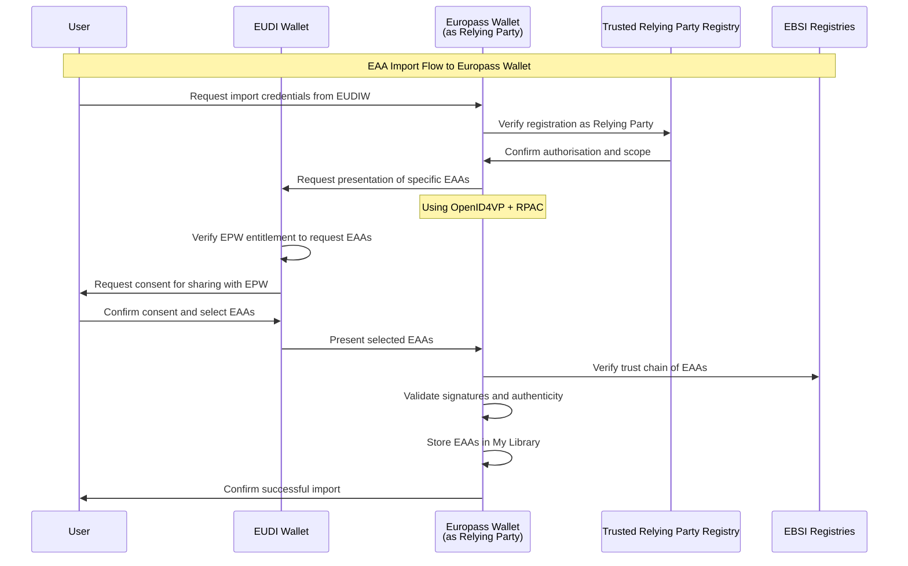
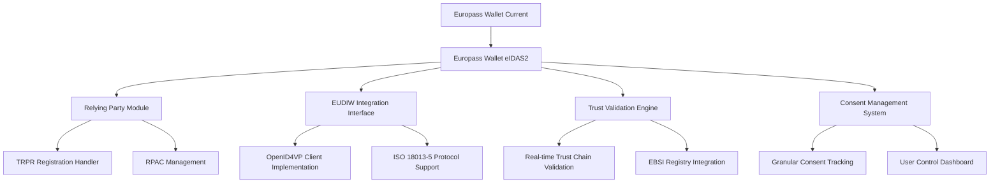
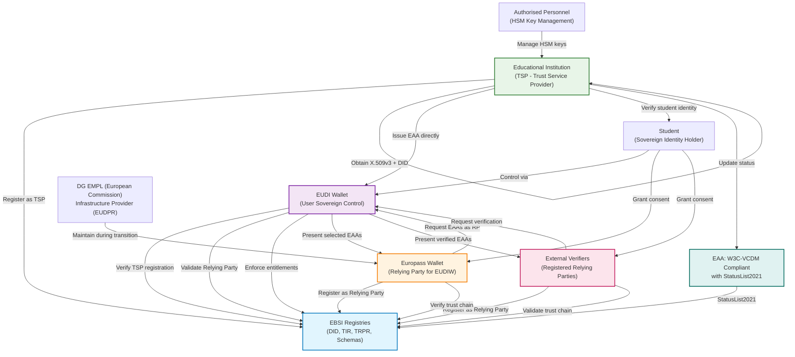

# European Digital Credentials for Learning: Transformation and Evolution in the eIDAS2 and EUDIW Era

**A comprehensive analysis of the current state, challenges, and strategic evolution pathway for educational digital credentials in Europe**

---

## Executive Summary

The European Digital Credentials for Learning (EDCL) system stands at a pivotal moment in its evolution. As the European Union advances towards a unified digital identity ecosystem through the revised eIDAS Regulation (eIDAS2) and the European Digital Identity Wallet (EUDIW), the educational credentials landscape faces fundamental transformation. This document provides a comprehensive analysis of the current EDCL infrastructure, examines the profound implications of eIDAS2 and EUDIW adoption, and outlines the strategic pathway for evolution from a centralised trust model to a decentralised, verifiable, and sovereign digital credentials ecosystem.

The transformation encompasses not merely technical migration but represents a paradigmatic shift from traditional certificate-based verification to a hybrid trust model combining classical Public Key Infrastructure (PKI) with Decentralised Identifiers (DIDs) and Electronic Attestations of Attributes (EAAs). This evolution promises enhanced security, cross-border interoperability, and user sovereignty whilst addressing current limitations in issuer accreditation, credential lifecycle management, and privacy protection.

Key findings indicate that whilst the technical foundations for this transformation are well-established—including the development of W3C Verifiable Credentials Data Model (VCDM) compliant schemas and sector-specific credential types—the practical implementation requires significant organisational change, substantial investment in PKI infrastructure, and coordinated governance across thousands of European educational institutions.

---

## 1. Introduction: The Current Educational Credentials Landscape

### 1.1 The Digital Transformation Imperative

The digitalisation of educational credentials represents one of the most significant advances in academic mobility and professional recognition within the European Higher Education Area (EHEA) and beyond. As labour markets become increasingly dynamic and learning pathways more diverse, the need for secure, verifiable, and portable digital credentials has never been more pressing. The COVID-19 pandemic further accelerated this transformation, highlighting the limitations of paper-based systems and the urgent need for digital-first approaches to credential verification.

The European Commission's commitment to digital transformation, as outlined in the Digital Education Action Plan (2021-2027), emphasises the crucial role of digital credentials in supporting lifelong learning, professional mobility, and skills recognition across member states. This digital transformation is not merely about converting paper certificates to digital formats; it represents a fundamental reimagining of how educational achievements are recorded, verified, and trusted across institutional and national boundaries.

### 1.2 The European Digital Credentials Infrastructure Context

The European Digital Credentials Infrastructure (EDCI), developed and maintained by the European Commission's Directorate-General for Employment, Social Affairs and Inclusion (DG EMPL), currently serves as the primary platform enabling educational institutions across Europe to issue digitally signed learning credentials. This infrastructure represents a significant achievement in educational digitalisation, processing thousands of credentials monthly and supporting institutions ranging from major research universities to specialised training providers.

However, the current system operates within the constraints of a centralised trust model that, whilst functional, presents limitations in terms of scalability, interoperability, and alignment with emerging European digital identity standards. The forthcoming implementation of eIDAS2 and the EUDIW framework necessitates a comprehensive evolution of this infrastructure to maintain its relevance and effectiveness in the new digital identity ecosystem.

---

## 2. Current State Analysis: EDCL Architecture and Capabilities

### 2.1 Current Technical Architecture: Validated As-Is State

The existing EDCI system comprises several interconnected components that collectively enable the creation, signing, storage, and verification of digital educational credentials. The following validated architecture diagram illustrates the current operational model:

#### 2.1.1 As-Is Architecture Diagram (Validated)



#### 2.1.2 EDCI Issuer Component

The EDCI Issuer serves as the primary interface for educational institutions seeking to create and issue digital credentials. Current capabilities include:

**Data Import and Validation Interface**: Educational institutions upload student data and credential information through standardised interfaces that validate incoming data against European Learning Model (ELM) requirements, ensuring consistency across different institutional systems and national contexts.

**Template Builder and Customisation Engine**: Institutions design and customise credential templates reflecting their specific academic programmes, visual identity, and regulatory requirements. This flexibility has enabled adoption across diverse educational contexts.

**Digital Signature Infrastructure**: The system supports multiple signing mechanisms:
- **NexU** for secure local signing via Secure Signature Creation Devices (SSCD)
- **Local Sealing** using PKCS#12 format for institutions hosting their own infrastructure
- **Audit Logging** with OIDC provider traceability for compliance

**Credential Export and Delivery Mechanisms**: Credentials can be delivered through multiple channels, including direct integration with the EDCI Wallet or traditional SMTP email delivery.

#### 2.1.3 EDCI Wallet (Europass Wallet) Component

The EDCI Wallet, implemented as part of the Europass platform's "My Library" service, provides secure storage and sharing capabilities:

**Secure Storage Infrastructure**: Credentials are stored within the Europass platform, providing learners with a centralised location for their educational achievements with persistent, cross-device accessibility.

**REST API Infrastructure**: The wallet exposes standardised APIs enabling third-party applications and services to interact with stored credentials, supporting integration with institutional systems and verification platforms.

**Credential Presentation Services**: Learners can generate presentations of their credentials for sharing whilst maintaining the cryptographic integrity of original credentials.

#### 2.1.4 EDCI Viewer Component

The EDCI Viewer provides comprehensive credential visualisation and verification capabilities:

**Multi-Format Display Engine**: The viewer renders credentials in multiple formats, supporting both machine-readable JSON-LD structures and human-readable presentations for technical and non-technical users.

**Verification Microservices**: Integrated verification services validate credential formal structure and verify digital seal integrity using the Digital Signature Service (DSS) library, providing automated verification whilst maintaining security standards.

**Export and Sharing Capabilities**: Users can export credentials in various formats (PDF, structured data) and utilise temporary sharing links for secure credential sharing without requiring account creation.

#### 2.1.5 Supporting Infrastructure

**Keycloak Authentication**: Provides identity federation and authentication across all EDCI components with session management and OIDC-based authentication for audit logging.

**MySQL Persistence Layer**: Serves as the data storage foundation for credential records, audit logs, and system metadata across EDCI Issuer and Wallet components.

**NexU Signing Middleware**: Facilitates secure local access to signature creation devices when required for institutional signing processes.

### 2.2 Current Credential Formats and Standards

#### 2.2.1 European Digital Credentials (EDC) Specification

The current EDC format represents a sophisticated implementation of the European Learning Model (ELM) optimised for digital credential use cases. Key characteristics include:

**JSON-LD Structure with Custom Extensions**: EDC credentials utilise JSON-LD (JavaScript Object Notation for Linked Data) as their core format, enabling semantic interoperability whilst maintaining human readability. The structure includes custom extensions specific to educational contexts that are not present in generic credential formats.

**jAdES Digital Signature Integration**: Credentials are signed using JSON Advanced Electronic Signatures (jAdES), providing legal-grade digital signatures that comply with European electronic signature regulations. This signature format ensures non-repudiation and tamper detection whilst maintaining compatibility with existing PKI infrastructure.

**European Learning Model Alignment**: All credentials strictly adhere to ELM 3.2 specifications, ensuring consistent representation of learning achievements, qualifications, and competencies across different educational systems and national frameworks.

#### 2.2.2 Supported Credential Types

The current system supports a comprehensive range of educational credential types, each designed to address specific use cases within the European educational ecosystem:

**Formal Education Credentials**: Including university degrees, diploma supplements, transcripts of records, and proof of enrolment documents. These credentials support traditional academic pathways and facilitate student mobility within the EHEA.

**Vocational Training Credentials**: Covering certificates from vocational education and training (VET) providers, professional development programmes, and industry-specific qualifications. These credentials are particularly important for addressing skills gaps and supporting career transitions.

**Micro-credentials and Modular Learning**: Supporting the growing trend towards bite-sized learning experiences, the system accommodates micro-credentials that can be stacked to form larger qualifications or used independently to demonstrate specific competencies.

### 2.3 Current Operational Model and Stakeholder Roles

#### 2.3.1 Data Protection and Governance Framework

The current EDCI system operates under a carefully structured governance model that addresses European data protection requirements whilst enabling efficient credential processing:

**European Commission Role**: DG EMPL serves as the data controller solely for the operation of the Europass platform infrastructure. Crucially, the Commission does not control or determine the purposes of processing student credential data submitted by educational institutions. This separation ensures compliance with both the General Data Protection Regulation (GDPR) for institutions and the European Union Data Protection Regulation (EUDPR) for EU institutions.

**Educational Institution Responsibilities**: Institutions function as independent data controllers under GDPR, bearing full responsibility for obtaining valid consent from students, determining the purposes and means of data processing, and ensuring compliance with applicable data protection regulations. This distributed responsibility model has proven effective but presents challenges for coordinated policy implementation.

**Student Rights and Control**: Students maintain comprehensive data subject rights, including access, rectification, erasure, and data portability. However, the current system's limitations in providing granular consent management and real-time rights exercise represent areas for improvement in the evolved system.

#### 2.3.2 Trust and Verification Model

The existing trust model relies primarily on classical PKI infrastructure with institutional digital seals:

**Institutional Digital Seals**: Educational institutions use qualified electronic seals to sign credentials, providing legal-grade authenticity and integrity protection. These seals are typically managed through secure signature creation devices or cloud-based signature services.

**Manual Verification Processes**: Credential verification often requires manual processes, including checking institutional accreditation, validating digital signatures, and confirming the authenticity of credential content. This manual element introduces latency and potential inconsistencies in verification outcomes.

**Limited Issuer Accreditation Verification**: Whilst digital signatures confirm that credentials have not been tampered with and originate from holders of specific signing keys, the system provides limited automated mechanisms for verifying that signing institutions are authorised to issue particular types of credentials.

---

## 3. Identified Limitations and Challenges

### 3.1 Technical and Security Limitations

#### 3.1.1 Trust Infrastructure Gaps

The current EDCI system, whilst secure and functional, exhibits several limitations that become more apparent in the context of modern digital identity requirements:

**Absence of Verifiable Issuer Accreditation**: The system lacks automated mechanisms for verifying that credential issuers are authorised to award specific types of qualifications. Whilst institutional digital seals confirm the authenticity of the signing entity, they do not automatically communicate the scope of that entity's accreditation or authorisation. This gap becomes particularly problematic in cross-border scenarios where verifying parties may be unfamiliar with foreign institutional accreditation systems.

**Limited Verifier Authentication**: Current verification processes do not require formal authentication of verifying parties or declaration of their purpose for accessing credential information. This limitation raises privacy concerns and prevents the implementation of fine-grained access control policies that could protect sensitive educational information.

**Static Trust Relationships**: The PKI-based trust model relies on relatively static certificate hierarchies that cannot easily accommodate the dynamic nature of educational accreditation, temporary authorisations, or context-specific trust relationships that characterise modern educational ecosystems.

#### 3.1.2 Lifecycle Management Deficiencies

**Credential Revocation and Suspension**: The current system provides no standardised interface for revoking or suspending issued credentials. This limitation means that credentials remain valid indefinitely, even if the awarding institution discovers errors, fraud, or changes in accreditation status. The absence of revocation mechanisms creates potential legal and practical problems for both issuers and relying parties.

**Key Management and Rotation**: Institutional signing keys have limited lifecycle management capabilities, with no standardised approaches for key rotation, backup, or recovery. This limitation creates long-term security risks and operational challenges for institutions managing their digital identity infrastructure.

**Status Monitoring and Updates**: Verifying parties have no reliable mechanism for checking the current status of credentials beyond the initial verification. This limitation prevents the detection of subsequently revoked credentials or updated institutional accreditation status.

### 3.2 Interoperability and Standards Compliance

#### 3.2.1 W3C Standards Alignment

Whilst the current EDC format is sophisticated and functional, it diverges from emerging international standards in several important ways:

**Non-Standard W3C Verifiable Credentials Compliance**: Current EDC credentials use a custom JSON structure with "credential" objects nested within the root document, rather than placing W3C Verifiable Credentials Data Model fields directly at the root level. This structural difference creates interoperability challenges with other credential systems and limits the ability to leverage standard verification libraries and tools.

**Missing Standard Fields**: The current format lacks several fields that are considered essential in the W3C VCDM specification, including standardised issuance and expiration dates, revocation mechanisms, and proof structures. These omissions limit compatibility with international credential verification systems and emerging digital identity wallets.

**Custom Delivery Mechanisms**: The inclusion of delivery-specific metadata (such as email delivery details) within credential structures creates unnecessary coupling between credential content and distribution mechanisms, reducing portability and reusability.

#### 3.2.2 Integration Challenges

**Limited API Standardisation**: Whilst the EDCI system provides APIs for credential management, these interfaces are not aligned with emerging standards such as OpenID for Verifiable Credential Issuance (OpenID4VCI) or OpenID for Verifiable Presentations (OpenID4VP). This misalignment creates integration challenges for third-party systems and limits ecosystem development.

**Protocol Compatibility**: The current system does not support modern credential exchange protocols that are becoming standard in the broader verifiable credentials ecosystem, limiting interoperability with other sectors and international systems.

### 3.3 Privacy and User Control Limitations

#### 3.3.1 Consent Management Deficiencies

**Institution-Side Consent Collection**: The current system relies on educational institutions to collect and manage student consent for credential issuance. This approach lacks standardisation and provides limited transparency for students regarding how their consent is recorded, used, and potentially withdrawn.

**Granular Consent Challenges**: Students cannot provide granular consent for specific uses of their credentials or easily withdraw consent for particular applications whilst maintaining consent for others. This limitation becomes increasingly problematic as credentials are used across multiple contexts and jurisdictions.

**Audit Trail Limitations**: The system provides limited audit trails for consent-related activities, making it difficult for institutions to demonstrate compliance with data protection requirements and for students to understand how their data is being used.

#### 3.3.2 User Sovereignty Constraints

**Limited Selective Disclosure**: Students cannot easily share specific subsets of their credential information for particular purposes, leading to over-disclosure of personal and academic information. This limitation conflicts with data minimisation principles and creates unnecessary privacy risks.

**Dependency on Institutional Systems**: Students' ability to access and share their credentials depends heavily on continued operation of institutional systems and platforms. This dependency creates potential long-term access issues and limits student autonomy over their educational records.

### 3.4 Operational and Governance Challenges

#### 3.4.1 Scalability Concerns

**Manual Verification Processes**: The reliance on manual verification processes for complex scenarios limits the system's ability to scale efficiently. As credential volumes increase and verification requirements become more sophisticated, these manual processes become bottlenecks that degrade user experience and increase operational costs.

**Institutional Resource Requirements**: The current system requires significant technical expertise and resources from participating institutions, creating barriers to adoption for smaller or less technically sophisticated educational providers.

#### 3.4.2 Cross-Border Recognition Challenges

**Legal Framework Variations**: Different member states have varying legal frameworks for educational credentials and digital signatures, creating complexity for cross-border credential recognition and verification.

**Accreditation System Diversity**: The diversity of national and regional accreditation systems makes it challenging for automated verification systems to determine the validity and scope of institutional authorisations across different jurisdictions.

---

## 4. The eIDAS2 and EUDIW Transformation Imperative

## 4. Specific Component Impact Analysis: eIDAS2 and EUDIW Transformation

### 4.1 EDCI Issuer Evolution: From Simple Signer to Trust Service Provider

#### 4.1.1 Mandatory Trust Service Provider Registration

The transformation of the EDCI Issuer represents one of the most significant changes required for eIDAS2 compliance. Educational institutions must evolve from simple credential signers to fully regulated Trust Service Providers (TSPs) with comprehensive legal and technical obligations.

**TSP Registration Requirements**:
- **Qualified X.509v3 Certificate Acquisition**: Institutions must obtain qualified certificates from recognised Certification Authorities, establishing their legal identity within the eIDAS framework
- **DID Registration in EBSI**: Each institution must register a Decentralised Identifier in the European Blockchain Services Infrastructure, providing a verifiable digital identity
- **Certificate-DID Binding**: Implementation of cryptographic binding between X.509v3 certificates and DIDs using x5t#S256 thumbprint mechanisms
- **Entitlement Specification**: Clear declaration of which types of educational credentials the institution is authorised to issue

**Enhanced EDCI Issuer Architecture**:



#### 4.1.2 Operational Process Transformation

**Current Issuance Flow**:
Institution → EDCI → Signed Credential → Email to Student

**Future eIDAS2 Flow**:
Institution TSP → EUDIW Verification → W3C EAA → Direct Delivery to Student's EUDIW

**New Operational Responsibilities**:

**Real-time Credential Lifecycle Management**: Implementation of StatusList2021 mechanisms enabling real-time revocation and suspension of issued credentials, addressing one of the most significant limitations of the current system.

**Automated Scope Verification**: Integration with EBSI trust registries to automatically verify that credential issuance requests fall within the institution's registered scope of authorisation, preventing unauthorised credential types.

**Enhanced Audit and Compliance**: Comprehensive audit trails meeting regulatory requirements for Trust Service Providers, including detailed logging of all issuance, revocation, and status change activities.

**Hardware Security Module Integration**: Mandatory use of Hardware Security Modules (HSMs) or qualified cloud signature services to meet eIDAS2 security requirements for private key protection.

### 4.2 EDC Verifier Transformation: Enhanced Trust Validation

#### 4.2.1 Mandatory Relying Party Registration

Current EDC verifiers operate with minimal authentication requirements. Under eIDAS2, all credential verifiers must register as trusted relying parties with specific entitlements and declared purposes.

**Trusted Relying Party Registry (TRPR) Registration**:
- **Legal Identity Declaration**: Comprehensive registration including legal entity information, contact details, and business purposes
- **Relying Party Access Certificate (RPAC)**: Obtaining certificates that specify exactly which types of EAAs the verifier is authorised to request
- **Purpose Declaration**: Clear statement of verification purposes, supporting privacy protection and data minimisation principles
- **Ongoing Compliance**: Regular audits and compliance monitoring to maintain trusted status

**Enhanced Verification Capabilities**:



#### 4.2.2 Advanced Verification Process

**Multi-Layer Trust Validation**:
1. **Verifiable Presentation Validation**: Verification of VP signatures and holder binding using cryptographic proofs
2. **EAA Signature Verification**: Validation of issuer signatures with certificate-DID binding confirmation
3. **Complete Trust Chain Validation**: Real-time verification of issuer accreditation and authorisation via EBSI registries
4. **EUDIW Integrity Verification**: Confirmation that EAAs were presented from authentic EUDIW instances
5. **Selective Disclosure Policy Enforcement**: Application of privacy-preserving disclosure rules based on verifier entitlements

### 4.3 Europass Wallet Critical Role Transformation: From Passive Storage to Active Relying Party

#### 4.3.1 The Europass Wallet as Relying Party Challenge

One of the most significant and often overlooked transformations involves the Europass Wallet's evolution from a passive credential storage service to an active relying party within the eIDAS2 ecosystem. When users wish to import their EAAs from their sovereign EUDIW to their Europass Wallet (for legacy compatibility or specific use cases), the Europass Wallet must function as a registered relying party.

**Critical Analysis of the New Role**:

The Europass Wallet, currently functioning as a simple repository for credentials delivered via email or direct upload, must evolve to interact with the EUDIW as a **registered Relying Party** when users want to import their EAAs from their sovereign wallets to maintain the familiar Europass experience.

**EAA Import Flow Architecture**:



#### 4.3.2 Europass Wallet Relying Party Requirements

**Mandatory Registration and Certification**:
- **TRPR Registration**: As an authorised entity for requesting educational EAAs
- **Specific RPAC**: Certificate specifying scope of EAAs it can request
- **Granular Entitlements**:
  - **Authorised to request**: Diplomas, transcripts, micro-credentials, proof of enrolment
  - **Not authorised without specific permission**: Detailed grading information
  - **Temporal limitations**: Only valid and non-revoked EAAs

**New Technical Capabilities Required**:



#### 4.3.3 User Experience Transformation

**Current User Flow**:
1. Institution issues credential via EDCI
2. Credential arrives via email to student
3. Student manually uploads to Europass Wallet

**Future eIDAS2 Flow**:
1. Institution TSP issues EAA directly to student's EUDIW
2. Student decides to import to Europass Wallet for specific use cases
3. Europass Wallet requests EAAs from EUDIW (as Relying Party)
4. EUDIW verifies authorisation and requests granular consent
5. Secure and verifiable transfer of selected EAAs

**Benefits of the New Model**:
- **Sovereign Control**: User maintains complete control via EUDIW
- **Flexibility**: Can utilise both EUDIW and Europass according to needs
- **Verifiability**: All transfers are traceable and verifiable
- **Compatibility**: Maintains familiar Europass experience for users who prefer it

### 4.4 Target Architecture: Validated To-Be State

#### 4.4.1 Comprehensive eIDAS2 Architecture Diagram



### 4.5 Component Transformation Impact Analysis

The following table summarises the specific transformations required for each system component:

| **Component** | **Current State** | **Required Transformation** | **New eIDAS2 Role** |
|---------------|-------------------|------------------------------|---------------------|
| **EDCI Issuer** | Signs credentials with institutional seal | TSP registration + DID + EUDIW integration | Regulated Trust Service Provider |
| **EDC Verifier** | Limited manual verification | TRPR registration + automated trust validation | Authenticated Relying Party |
| **Europass Wallet** | Passive credential storage | **New role**: Relying Party for EUDIW | **Active Relying Party** for import |
| **EUDI Wallet** | Does not exist | Complete implementation as trust broker | **Sovereign Trust Broker** |
| **EBSI Registries** | Not integrated | Full integration with all components | **Trust Infrastructure Backbone** |

#### 4.5.1 Critical Success Factors for Component Transformation

**Technical Infrastructure Investment**: Each component requires significant technical enhancement, including HSM integration for issuers, TRPR registration systems for verifiers, and sophisticated trust validation engines for all parties.

**Regulatory Compliance Implementation**: All components must implement comprehensive compliance monitoring, audit trail generation, and regulatory reporting capabilities to meet eIDAS2 requirements.

**User Experience Continuity**: Despite significant backend transformation, user-facing interfaces must maintain intuitive operation whilst providing enhanced control and transparency over credential management and sharing.

**Interoperability Assurance**: All components must implement standardised protocols (OpenID4VCI, OpenID4VP, ISO 18013-5) to ensure seamless interaction across the distributed ecosystem.

### 4.3 Technical Architecture Transformation Requirements

#### 4.3.1 Hybrid Trust Model Implementation

The evolution to eIDAS2 compliance requires the implementation of a hybrid trust model that combines traditional PKI infrastructure with decentralised identity technologies:

**X.509v3 Certificate Foundation**: Educational institutions must obtain qualified X.509v3 certificates that serve as the foundation for their digital identity. These certificates provide legal-grade identification and enable compliance with existing European electronic signature frameworks.

**Decentralised Identifier Integration**: Institutions must register Decentralised Identifiers (DIDs) in verifiable data registries such as the European Blockchain Services Infrastructure (EBSI). These DIDs provide a mechanism for publishing verifiable metadata about institutional capabilities, accreditation status, and authorised credential types.

**Certificate-DID Binding**: The hybrid model requires cryptographic binding between X.509v3 certificates and DIDs using mechanisms such as x5t#S256 thumbprints. This binding enables verifiers to leverage both the legal recognition of PKI certificates and the rich metadata capabilities of decentralised identity systems.

#### 4.3.2 Verifiable Data Registry Architecture

**Multi-Level Registry Hierarchy**: The new architecture requires verifiable data registries at multiple levels - European Union, sectoral, member state, regional, and institutional. These registries provide authoritative information about institutional accreditation, authorised credential types, and current operational status.

**Trusted Issuer Registry (TIR)**: Institutions must register in trusted issuer registries that provide verifiable information about their authorisation to issue specific types of educational credentials. These registries enable automatic verification of issuer credentials and scope of authorisation.

**Trusted Relying Party Registry (TRPR)**: Organisations that wish to verify educational credentials must register as trusted relying parties, declaring their identity, purposes for credential verification, and requesting specific access entitlements. This registration process enables fine-grained access control and privacy protection.

---

## 5. Data Model Evolution and Schema Transformation

### 5.1 From EDC to EDC-W3C: Structural Transformation

The migration from the current European Digital Credentials (EDC) format to fully W3C Verifiable Credentials Data Model (VCDM) compliant credentials represents one of the most significant technical transformations required for eIDAS2 compliance.

#### 5.1.1 Structural Realignment

**Root-Level Field Migration**: The current EDC format embeds credential information within a "credential" object nested inside the root document structure. The W3C-compliant EDC-W3C format moves essential fields such as issuer, credentialSubject, issuanceDate, and type to the root level, eliminating the custom nesting that created interoperability challenges.

**Standardised Temporal Management**: EDC-W3C introduces standardised fields for temporal credential management, including issuanceDate for creation timestamps, validFrom for validity commencement, validUntil for expiration, and expirationDate for multi-date expiry scenarios. This standardisation enables automated lifecycle management and reduces ambiguity about credential validity periods.

**Enhanced Status Management**: The new format includes credentialStatus fields that support standardised revocation and suspension mechanisms through StatusList2021 entries. This capability addresses one of the most significant limitations of the current system by enabling real-time status verification.

**Removal of Delivery-Specific Metadata**: EDC-W3C eliminates delivery-specific fields such as deliveryDetails that coupled credential content with distribution mechanisms. This decoupling improves credential portability and enables use across multiple distribution channels without modification.

#### 5.1.2 Proof and Verification Enhancement

**Standardised Proof Structures**: Whilst EDC-W3C maintains compatibility with jAdES D-Zero signatures for European legal compliance, it also supports W3C standard proof mechanisms. This dual compatibility enables interoperability with international systems whilst maintaining European legal requirements.

**Enhanced Verification Metadata**: The new format includes comprehensive verification metadata that enables automated validation of issuer authorisation, credential scope, and trust chain integrity. This metadata reduces reliance on manual verification processes and improves verification consistency.

### 5.2 Sector-Specific Schema Development

The evolution to EDC-W3C has enabled the development of sector-specific schemas that address the unique requirements of different educational credential types whilst maintaining interoperability through a common base structure.

#### 5.2.1 Higher Education Credential Schemas

**European Higher Education Microcredential (EUHEMC)**: This schema addresses the growing importance of modular learning and micro-credentials in higher education. Key constraints include ECTS credit limits (1-15 credits), EQF level restrictions (levels 6-8 for higher education), and mandatory competency mappings to support skills recognition and labour market alignment.

```json
{
  "type": [
    "VerifiableCredential",
    "VerifiableAttestation", 
    "EuropeanDigitalCredential",
    "EuropeanHigherEducationMicrocredential"
  ],
  "credentialSubject": {
    "hasClaim": [{
      "type": "LearningAchievement",
      "creditReceived": [{
        "framework": { "notation": "ECTS" },
        "point": "3"
      }],
      "specifiedBy": {
        "eqfLevel": { "notation": "6" },
        "educationSubject": [{
          "id": "https://digcomp.europa.eu/competence/1.1",
          "prefLabel": { "en": "Digital competence" }
        }]
      }
    }]
  }
}
```

**European Higher Education Diploma (EUHED)**: This schema supports traditional degree credentials with full ECTS requirements, comprehensive qualification classification, and detailed learning outcome specifications. The schema enforces business rules specific to formal higher education qualifications whilst maintaining compatibility with existing degree recognition frameworks.

**European Higher Education Diploma Supplement (EUHEDS)**: Addressing the specific requirements of the diploma supplement format used throughout the European Higher Education Area, this schema ensures compatibility with existing Bologna Process frameworks whilst enabling digital verification and portability.

#### 5.2.2 Vocational Education and Training Schemas

**European Vocational Education and Training Microcredential (EUVETMC)**: This schema addresses the specific needs of vocational education, including ECVET point constraints (1-15 points), EQF level restrictions appropriate for vocational qualifications (levels 1-5), and mandatory specification of learning modalities (work-based, school-based, or hybrid approaches).

**Competency and Skills Alignment**: VET schemas include extensive integration with the European Skills, Competences, Qualifications and Occupations (ESCO) framework, enabling precise mapping between learning outcomes and labour market requirements. This alignment supports career guidance, job matching, and skills gap analysis.

#### 5.2.3 Secondary Education Schemas

**European Upper Secondary Certificate (EUUSC)**: Supporting the digitalisation of upper secondary education credentials, this schema addresses the specific requirements of school-leaving certificates, including subject-specific grading, overall classification systems, and compatibility with national qualification frameworks.

**Transcript and Record Schemas**: Detailed schemas for academic transcripts support comprehensive record-keeping whilst enabling selective disclosure of specific subjects or academic periods. These schemas balance the need for comprehensive academic records with privacy protection requirements.

### 5.3 Business Rule Enforcement and Validation

#### 5.3.1 Automated Constraint Validation

**Credit and Point Limitations**: Each schema enforces specific constraints on credit or point allocations appropriate to the credential type. For example, microcredentials are limited to 1-15 ECTS or ECVET points, whilst full qualifications have different constraints based on their scope and level.

**EQF Level Enforcement**: Schemas automatically validate that credentials are issued at appropriate European Qualifications Framework levels, preventing institutions from issuing credentials outside their authorised scope. Higher education schemas restrict credentials to EQF levels 6-8, whilst VET schemas typically cover levels 1-5.

**Competency Mapping Requirements**: Advanced schemas require mapping to established competency frameworks such as DigComp for digital competencies or ESCO for occupational skills. This mapping enables interoperability with career guidance systems and skills matching platforms.

#### 5.3.2 Institutional Authorisation Validation

**Scope-Specific Issuance Rights**: Schemas include mechanisms for validating that issuing institutions are authorised to award specific types of credentials. This validation occurs through integration with trusted issuer registries and institutional accreditation databases.

**Temporal Authorisation Checking**: The system validates that institutions held appropriate authorisation at the time of credential issuance, addressing scenarios where institutional accreditation status may change over time.

---

## 6. Trust Governance and Verification Architecture

### 6.1 Multi-Layered Trust Infrastructure

The transformation to eIDAS2 compliance requires the implementation of a sophisticated multi-layered trust infrastructure that operates across European, national, sectoral, and institutional levels.

#### 6.1.1 European Blockchain Services Infrastructure (EBSI) Integration

**Decentralised Identifier Registry**: EBSI provides the foundational infrastructure for registering and resolving Decentralised Identifiers (DIDs) for educational institutions. This registry enables verifiable discovery of institutional metadata, accreditation status, and authorised credential types without relying on centralised authorities or proprietary systems.

**Verifiable Accreditation Framework**: EBSI supports a comprehensive framework for recording and verifying institutional accreditations through verifiable credentials issued by competent authorities. These accreditation credentials specify exactly which types of educational credentials an institution is authorised to issue, creating a machine-verifiable authorisation framework.

**Trust Chain Validation**: The blockchain-based infrastructure enables comprehensive validation of trust chains from credential issuers through their accrediting authorities to root trust anchors. This validation can be performed automatically and provides cryptographic assurance of authorisation validity.

#### 6.1.2 Sectoral Trust Registries

**Educational Qualifications Authority Integration**: National and regional qualifications authorities can register their accreditation decisions and scope determinations in verifiable registries, enabling automatic validation of institutional authorisation for specific credential types.

**Professional Body Recognition**: For credentials that lead to professional recognition or regulated practice rights, integration with professional body registries ensures that only appropriately authorised institutions can issue credentials that carry professional recognition.

**Quality Assurance Framework Integration**: Integration with European quality assurance frameworks such as the European Association for Quality Assurance in Higher Education (ENQA) provides additional verification layers for institutional credibility and authorisation.

### 6.2 Issuer Registration and Authorisation Framework

#### 6.2.1 Trust Service Provider Registration

**Multi-Step Authorisation Process**: Educational institutions seeking to issue eIDAS2-compliant credentials must complete a comprehensive registration process that includes legal identity verification, technical capability assessment, and scope-specific authorisation validation.

**Technical Infrastructure Requirements**: Institutions must demonstrate capability to securely manage cryptographic keys, implement appropriate signing procedures, and maintain audit trails that meet eIDAS2 requirements. This typically requires investment in Hardware Security Modules (HSMs) or qualified cloud signature services.

**Ongoing Compliance Monitoring**: Registration as a Trust Service Provider includes ongoing obligations for compliance monitoring, regular audits, and maintenance of technical and organisational security measures. These requirements ensure continued trustworthiness and legal compliance.

#### 6.2.2 Scope-Specific Entitlements

**Granular Authorisation Framework**: Rather than binary authorisation, the new system supports granular entitlements that specify exactly which types of credentials an institution can issue. For example, a university might be authorised to issue bachelor's degrees in specific subject areas but not doctoral degrees or professional certifications.

**Temporal and Contextual Constraints**: Authorisations can include temporal limitations (such as accreditation periods) and contextual constraints (such as geographic scope or specific programme authorisations). These constraints are automatically enforced during credential issuance and verification.

**Dynamic Authorisation Updates**: The system supports real-time updates to institutional authorisations, enabling immediate reflection of accreditation changes, programme approvals, or authorisation suspensions. This dynamic capability prevents the issuance of unauthorised credentials and maintains system integrity.

### 6.3 Relying Party Authentication and Access Control

#### 6.3.1 Trusted Relying Party Registry (TRPR)

**Identity and Purpose Declaration**: Organisations wishing to verify educational credentials must register in the Trusted Relying Party Registry, declaring their legal identity, business purposes for credential verification, and specific types of information they need to access. This registration process enables fine-grained access control and audit trails.

**Entitlement-Based Access Rights**: Rather than universal access to credential information, relying parties receive specific entitlements that define which types of credentials they can request and which attributes within those credentials they can access. For example, an employer might be entitled to verify degree completion but not detailed grade information.

**Sector-Specific Access Policies**: Different sectors have different legitimate needs for credential information. The system supports sector-specific access policies that reflect these varying requirements whilst protecting student privacy and complying with data protection regulations.

#### 6.3.2 Privacy-Preserving Verification

**Selective Disclosure Mechanisms**: The EUDIW framework supports selective disclosure technologies that enable credential holders to share only the specific information required for a particular verification purpose. Students can choose to disclose degree completion without revealing grades, or specific competencies without revealing the full qualification.

**Embedded Disclosure Controls**: Credentials can include embedded disclosure policies that automatically restrict which information can be shared with which types of relying parties. These policies are enforced by the EUDIW and cannot be overridden by requesting parties.

**Zero-Knowledge Proof Integration**: Advanced privacy protection mechanisms such as zero-knowledge proofs enable verification of credential attributes without revealing the underlying data. For example, an employer could verify that a candidate holds a degree from an accredited institution without learning the specific institution or programme details.

---

## 7. Implementation Roadmap and Strategic Considerations

### 7.1 Phased Implementation Strategy

The transformation from the current EDCL system to full eIDAS2 and EUDIW compliance requires a carefully orchestrated phased approach that minimises disruption whilst ensuring comprehensive modernisation.

#### 7.1.1 Phase 1: Technical Foundation Development (2025-2026)

**Schema Development and Validation**: The first phase focuses on completing the development and validation of sector-specific schemas for all major credential types. This includes extensive testing with pilot institutions, validation of business rule enforcement, and refinement based on real-world usage patterns.

**EBSI Integration Infrastructure**: Development of robust integration with EBSI registries, including DID registration systems, trust chain validation mechanisms, and automated verification services. This infrastructure provides the foundation for all subsequent phases.

**Pilot Institution Onboarding**: A carefully selected group of pilot institutions across different member states and educational sectors will complete the full registration process, including DID registration, certificate-DID binding, and technical system integration. These pilots will validate the implementation approach and identify potential challenges.

**Interoperability Testing**: Comprehensive testing of interoperability between the new EDC-W3C credentials and various EUDIW implementations, ensuring seamless integration across different wallet providers and verification systems.

#### 7.1.2 Phase 2: Gradual Migration and Scaling (2026-2027)

**Institutional Registration Campaign**: A systematic campaign to register educational institutions across Europe as Trust Service Providers, providing comprehensive support for technical implementation, staff training, and system integration. This campaign will prioritise institutions based on their impact, readiness, and strategic importance.

**Legacy System Bridge Development**: Development of bridge systems that enable coexistence between current EDC credentials and new EDC-W3C credentials during the transition period. These bridges ensure that existing credentials remain usable whilst new credentials are issued in the updated format.

**Verification Ecosystem Development**: Expansion of the verification ecosystem to include employers, professional bodies, and other relying parties. This includes development of user-friendly verification interfaces, integration with existing HR systems, and training for verification personnel.

**Cross-Border Recognition Validation**: Extensive testing and validation of cross-border credential recognition, ensuring that credentials issued in one member state are seamlessly recognised and verified in others. This testing includes both technical interoperability and legal recognition frameworks.

#### 7.1.3 Phase 3: Full Ecosystem Activation (2027-2028)

**Universal EUDIW Integration**: Complete integration with EUDIW infrastructure, enabling all European citizens to store and manage their educational credentials through their personal digital identity wallets. This integration includes sophisticated privacy controls, selective disclosure mechanisms, and comprehensive audit capabilities.

**Advanced Feature Deployment**: Deployment of advanced features such as zero-knowledge proof verification, dynamic access control policies, and real-time trust chain validation. These features provide enhanced privacy protection and security capabilities.

**Ecosystem Optimisation**: Comprehensive optimisation of the entire ecosystem based on operational experience, user feedback, and performance monitoring. This includes refinement of business rules, improvement of user interfaces, and enhancement of security mechanisms.

### 7.2 Organisational Change Management

#### 7.2.1 Institutional Transformation Requirements

**Technical Capability Development**: Educational institutions must develop significant new technical capabilities, including cryptographic key management, digital identity infrastructure, and integration with distributed trust systems. This transformation requires both technical investment and staff development.

**Critical Component-Specific Training Needs**:

**EDCI Issuer Staff**: Must understand TSP registration procedures, DID management, certificate-DID binding processes, and EUDIW integration protocols. Technical staff require HSM operation training and EAA lifecycle management skills.

**Europass Wallet Administrators**: Need comprehensive training on relying party registration, RPAC management, consent framework operation, and EUDIW integration protocols. Understanding of the wallet's new active role as a relying party is essential.

**Verification Personnel**: Require training on enhanced verification procedures, trust chain validation, selective disclosure handling, and real-time status checking via StatusList2021 mechanisms.

**Process Redesign**: Credential issuance processes must be redesigned to accommodate new verification requirements, consent management procedures, and lifecycle management capabilities. This redesign affects multiple institutional functions, from student services to IT operations.

**Governance and Compliance**: Institutions must establish new governance structures to ensure ongoing compliance with eIDAS2 requirements, manage trust service provider obligations, and maintain appropriate security and privacy protections.

#### 7.2.2 Component-Specific User Experience Enhancement

**EDCI Issuer User Experience**: Development of intuitive interfaces for TSP management, DID operations, and EAA issuance that hide technical complexity whilst providing necessary transparency for compliance and troubleshooting.

**Europass Wallet User Interface Evolution**: The wallet interface must clearly communicate its new role as a relying party when importing from EUDIW, provide transparent consent management for EAA imports, and maintain familiar user experience whilst adding sophisticated privacy controls.

**Enhanced Verification Interfaces**: Development of user-friendly verification interfaces that automatically handle multi-chain trust validation whilst providing clear verification results and audit trails for compliance purposes.

**Cross-Component Integration**: Seamless user experience across all components, ensuring that users can move between EUDIW, Europass Wallet, and verification systems without encountering unnecessary friction or confusion about system roles and capabilities.

### 7.3 Policy and Regulatory Considerations

#### 7.3.1 Cross-Border Legal Framework Harmonisation

**Legal Recognition Consistency**: Whilst eIDAS2 mandates mutual recognition of qualified electronic attestations, practical implementation requires harmonisation of national legal frameworks for educational credentials. This harmonisation affects both the technical implementation and the legal acceptance of digital credentials.

**Data Protection Compliance**: The distributed nature of the new system creates complex data protection compliance requirements that span multiple jurisdictions and legal frameworks. Clear guidelines and consistent interpretation are essential for successful implementation.

**Professional Recognition Integration**: For credentials that lead to professional recognition or regulated practice rights, integration with existing professional recognition frameworks is essential. This integration must respect both European directives and national professional regulation systems.

#### 7.3.2 Sectoral Governance Framework

**Educational Quality Assurance Integration**: The new system must integrate seamlessly with existing educational quality assurance frameworks whilst providing enhanced transparency and verification capabilities. This integration affects both institutional accreditation and programme approval processes.

**Skills Framework Alignment**: Comprehensive alignment with European skills frameworks such as ESCO and DigComp is essential for labour market relevance and career guidance integration. This alignment requires ongoing coordination between educational and employment sectors.

**Innovation and Flexibility Balance**: The governance framework must balance the need for standardisation and interoperability with the flexibility required for educational innovation and institutional autonomy. This balance is particularly challenging in the context of rapidly evolving educational technologies and methodologies.

---

## 8. Benefits and Opportunities

### 8.1 Enhanced Security and Trust

#### 8.1.1 Cryptographic Assurance

The evolution to eIDAS2 compliance provides significantly enhanced cryptographic assurance for educational credentials through multiple complementary mechanisms:

**Multi-Layered Verification**: The hybrid trust model combining PKI certificates with decentralised identifiers provides multiple independent verification paths for each credential. Verifiers can validate both the legal identity of issuers through PKI infrastructure and their specific authorisations through verifiable accreditation records, creating redundant security that significantly reduces fraud risks.

**Real-Time Trust Chain Validation**: Unlike current systems that rely on point-in-time verification, the new architecture enables real-time validation of complete trust chains from credential issuers through their accrediting authorities to root trust anchors. This capability ensures that verification reflects current authorisation status rather than historical snapshots.

**Tamper-Evident Infrastructure**: The combination of blockchain-based registries with cryptographic signatures creates a tamper-evident infrastructure where any attempt to modify credentials, issuer registrations, or accreditation records can be automatically detected and prevented.

#### 8.1.2 Fraud Prevention and Detection

**Automated Issuer Verification**: The requirement for institutions to register as Trust Service Providers with specific entitlements creates a comprehensive framework for preventing unauthorised credential issuance. Automated verification of issuer registration and scope prevents the acceptance of credentials from unaccredited institutions or credentials outside an institution's authorised scope.

**Sophisticated Audit Trails**: Every credential issuance, verification, and status change creates immutable audit trails that enable comprehensive fraud investigation and prevention. These audit trails provide evidence for legal proceedings whilst supporting proactive fraud detection through pattern analysis.

**Cross-Reference Validation**: Integration with multiple authoritative registries enables cross-reference validation that can detect inconsistencies or fraudulent claims. For example, credential claims can be validated against institutional programme registrations, accreditation databases, and quality assurance records.

### 8.2 Enhanced User Sovereignty and Privacy

#### 8.2.1 Granular Control Mechanisms

The EUDIW framework provides students with unprecedented control over their educational credentials and personal information:

**Selective Disclosure Capabilities**: Students can choose to share specific subsets of their credential information for particular purposes, enabling data minimisation that complies with privacy principles whilst meeting verification requirements. For example, a job applicant could share proof of degree completion without revealing specific grades or detailed academic records.

**Purpose-Specific Consent**: The system enables granular consent management where students can provide different levels of consent for different purposes and recipients. This capability ensures that credential sharing aligns with student intentions and legal requirements whilst providing clear audit trails for compliance purposes.

**Revocable Access Rights**: Students maintain the ability to revoke access to their credentials or modify sharing permissions at any time, providing ongoing control over their personal information even after initial consent has been granted.

#### 8.2.2 Enhanced Privacy Protection

**Cryptographic Privacy Technologies**: The integration of advanced cryptographic techniques such as zero-knowledge proofs enables verification of credential attributes without revealing the underlying data. This capability provides strong privacy protection whilst enabling necessary verification processes.

**Minimal Data Disclosure**: The architecture ensures that verifying parties receive only the minimum information necessary for their specific purposes, reducing unnecessary exposure of personal and academic information. This approach aligns with data protection principles whilst maintaining verification effectiveness.

**Anonymous Verification Options**: In appropriate circumstances, the system can support anonymous verification where the verifying party can confirm specific qualifications or competencies without learning the identity of the credential holder. This capability supports privacy-preserving recruitment and evaluation processes.

### 8.3 Improved Interoperability and Portability

#### 8.3.1 Cross-Border Mobility Enhancement

**Seamless European Recognition**: The mandatory mutual recognition of eIDAS2-compliant credentials eliminates many current barriers to academic and professional mobility within the European Union. Students and professionals can move between member states with confidence that their qualifications will be recognised and accepted.

**Automated Verification Processes**: The standardisation of verification procedures and technical interfaces enables automated processing of credential verification requests, reducing delays and administrative burdens that currently impede mobility and recognition processes.

**Language and Cultural Bridge**: Standardised credential formats with multilingual support enable effective communication of qualifications across language barriers, whilst semantic mapping to European qualification frameworks provides cultural translation of educational concepts.

#### 8.3.2 Global Interoperability

**W3C Standards Compliance**: Full compliance with W3C Verifiable Credentials Data Model ensures interoperability with international credential systems and digital identity infrastructures beyond Europe. This compliance positions European educational credentials for global recognition and portability.

**API Standardisation**: Adoption of standard protocols such as OpenID4VCI and OpenID4VP enables seamless integration with international verification systems and supports the development of a global ecosystem of compatible credential management tools.

**Future-Proof Architecture**: The modular and standards-based architecture ensures that the system can evolve to accommodate future technological developments and international standards without requiring fundamental redesign.

### 8.4 Ecosystem Innovation and Development

#### 8.4.1 Third-Party Service Innovation

**Verification Service Ecosystem**: The standardised interfaces and trust infrastructure enable the development of innovative third-party verification services that can provide value-added capabilities such as automated skills matching, career guidance, and qualification pathway planning.

**Integration Platform Development**: Educational technology companies can develop sophisticated integration platforms that connect credential systems with HR platforms, learning management systems, and professional development tools, creating comprehensive ecosystems for lifelong learning and career development.

**Analytics and Insights Services**: The rich metadata and standardised formats enable the development of analytics services that can provide insights into skills gaps, educational effectiveness, and labour market trends whilst maintaining individual privacy protection.

#### 8.4.2 Educational Innovation Support

**Modular Learning Recognition**: The comprehensive support for micro-credentials and modular learning enables educational institutions to develop innovative programmes that respond rapidly to changing skills requirements and learner needs.

**Cross-Institutional Collaboration**: The interoperable infrastructure supports sophisticated cross-institutional collaborations where students can accumulate credentials from multiple institutions towards combined qualifications or specialist programmes.

**Continuous Learning Integration**: The system's support for ongoing credential updates and additions enables seamless integration of formal education with professional development, online learning, and experiential learning recognition.

---

## 9. Challenges and Risk Management

### 9.1 Technical Implementation Challenges

#### 9.1.1 Infrastructure Complexity Management

The transformation to eIDAS2 compliance introduces significant technical complexity that must be carefully managed to ensure successful implementation:

**Integration Complexity**: Educational institutions must integrate multiple complex systems including PKI infrastructure, DID registries, trust service platforms, and EUDIW interfaces. This integration requires sophisticated technical expertise and careful coordination to ensure all components function correctly together.

**Scalability Requirements**: The system must support millions of credentials across thousands of institutions whilst maintaining performance and reliability standards. Scaling challenges include DID resolution performance, trust chain validation efficiency, and verification system responsiveness under high load conditions.

**Legacy System Migration**: Many educational institutions operate legacy student information systems that require significant modification or replacement to support the new credential formats and issuance procedures. This migration must be carefully planned to avoid disruption to ongoing educational operations.

**Security Infrastructure Investment**: Institutions must invest in Hardware Security Modules (HSMs) or qualified cloud signature services to meet eIDAS2 security requirements. These investments require significant capital expenditure and ongoing operational expertise.

#### 9.1.2 Interoperability Challenges

**Multi-Vendor Environment**: The distributed nature of the ecosystem means that credentials issued by one vendor's system must be verifiable by any other vendor's verification system. Ensuring consistent interoperability across diverse technical implementations requires comprehensive testing and standardisation efforts.

**Version Management**: As standards and schemas evolve, the system must maintain backward compatibility whilst enabling innovation and improvement. Version management across a distributed ecosystem with thousands of independent operators presents significant coordination challenges.

**Cross-Border Technical Variations**: Different member states may implement aspects of the technical infrastructure differently, creating potential interoperability challenges that must be identified and resolved through comprehensive testing and harmonisation efforts.

### 9.2 Organisational and Adoption Challenges

#### 9.2.1 Institutional Readiness Variations

**Resource Inequality**: Educational institutions vary dramatically in their technical resources, expertise, and financial capabilities. Smaller institutions may struggle to meet the technical and financial requirements for Trust Service Provider registration, potentially creating a two-tier system that excludes some institutions from digital credential issuance.

**Change Management Resistance**: The transformation requires significant changes to established institutional processes and procedures. Resistance to change, particularly in traditional academic environments, may slow adoption and create implementation challenges.

**Staff Training Requirements**: Successful implementation requires comprehensive training for institutional staff across multiple roles, from technical administrators to academic staff to senior management. The scale and complexity of this training requirement represents a significant challenge for many institutions.

**Governance Adaptation**: Institutions must adapt their governance structures to accommodate new responsibilities as Trust Service Providers, including compliance monitoring, audit requirements, and ongoing security obligations. These adaptations may require significant organisational change.

#### 9.2.2 User Adoption and Digital Literacy

**Student Digital Wallet Adoption**: The success of the system depends on widespread adoption of EUDIW by students and graduates. Factors affecting adoption include user experience quality, perceived value, privacy concerns, and digital literacy levels.

**Employer and Verifier Readiness**: Employers and other verifying parties must develop capabilities to interact with the new verification systems and understand the implications of enhanced credential capabilities. This readiness requires training, system integration, and process adaptation.

**Digital Divide Considerations**: The system must accommodate users with varying levels of digital literacy and access to technology. Exclusion of users due to digital divide issues could undermine the system's effectiveness and equity.

### 9.3 Legal and Regulatory Risks

#### 9.3.1 Cross-Border Legal Complexity

**Jurisdictional Compliance**: Educational credentials often involve multiple jurisdictions, particularly for international students, cross-border programmes, and mobile professionals. Ensuring compliance with varying national legal requirements whilst maintaining system coherence presents ongoing challenges.

**Professional Recognition Integration**: For credentials that lead to professional recognition or regulated practice rights, integration with national professional regulation systems may encounter legal and procedural obstacles that require careful navigation and potentially legislative change.

**Data Protection Compliance**: The distributed nature of the system creates complex data protection compliance requirements that span multiple jurisdictions and legal frameworks. Ensuring consistent compliance across all system components and operational procedures requires ongoing legal oversight and adaptation.

#### 9.3.2 Liability and Responsibility Framework

**Trust Service Provider Liability**: Institutions operating as Trust Service Providers assume new legal liabilities and responsibilities that may not be fully understood or adequately covered by institutional insurance and risk management frameworks.

**Verification Accuracy Responsibility**: The enhanced automation of verification processes raises questions about responsibility for verification accuracy and the consequences of verification errors. Clear frameworks for liability allocation and error correction are essential.

**Student Rights Protection**: The enhanced capabilities of the system create new possibilities for student rights violations if not properly managed. Ensuring robust protection of student rights requires ongoing vigilance and clear accountability mechanisms.

### 9.4 Risk Mitigation Strategies

#### 9.4.1 Technical Risk Management

**Comprehensive Testing and Validation**: Extensive testing programmes including interoperability testing, security testing, and performance testing can identify and resolve technical issues before they affect production systems. These programmes must include both automated testing and real-world pilot deployments.

**Redundancy and Backup Systems**: Critical infrastructure components require redundancy and backup systems to ensure continued operation in case of failures. This includes backup DID registries, alternative verification paths, and emergency credential issuance procedures.

**Gradual Migration Approach**: The phased implementation strategy enables identification and resolution of issues before they affect the entire ecosystem. Each phase should include comprehensive evaluation and refinement before proceeding to the next stage.

**Expert Technical Support**: Provision of expert technical support for implementing institutions can help overcome technical challenges and ensure consistent implementation quality across diverse institutional contexts.

#### 9.4.2 Adoption and Change Management

**Incentive Alignment**: Creating appropriate incentives for institutional adoption and user engagement can accelerate successful implementation. These incentives might include funding support, recognition programmes, and priority access to new capabilities.

**Comprehensive Training Programmes**: Well-designed training programmes that address both technical and procedural aspects of the new system can help overcome resistance and build competence across all stakeholder groups.

**User Experience Optimisation**: Careful attention to user experience design can improve adoption rates and reduce resistance to change. This includes both technical interface design and procedural simplification where possible.

**Community Building**: Creating communities of practice among implementing institutions can facilitate knowledge sharing, problem-solving, and peer support that accelerates successful adoption.

---

## 10. Future Perspectives and Strategic Implications

### 10.1 Long-Term Ecosystem Evolution

#### 10.1.1 Artificial Intelligence Integration

The mature eIDAS2-compliant educational credentials ecosystem will provide a rich foundation for artificial intelligence integration that could transform how educational achievements are recognised, validated, and utilised:

**Intelligent Qualification Recognition**: AI systems trained on the comprehensive credential metadata and semantic mappings could provide sophisticated automatic recognition of foreign qualifications, reducing barriers to international mobility and enabling more nuanced understanding of cross-cultural educational equivalencies.

**Skills Gap Analysis and Prediction**: Machine learning algorithms operating on anonymised credential data could identify emerging skills gaps, predict future educational needs, and inform policy decisions about programme development and resource allocation. This capability could significantly enhance the responsiveness of educational systems to economic and technological change.

**Personalised Learning Pathway Recommendation**: AI systems could analyse individual learning histories and career objectives to recommend optimal combinations of credentials, suggesting micro-credentials or modular learning opportunities that align with personal goals and market demands.

**Fraud Detection and Security Enhancement**: Advanced pattern recognition systems could identify potential fraud attempts, unusual verification patterns, or security threats in real-time, providing an additional layer of protection beyond cryptographic security measures.

#### 10.1.2 Blockchain Evolution and Emerging Technologies

**Enhanced Privacy Technologies**: The continued development of advanced cryptographic techniques such as homomorphic encryption and advanced zero-knowledge proof systems could enable even more sophisticated privacy-preserving verification capabilities, allowing for statistical analysis and verification without revealing individual data.

**Quantum-Resistant Cryptography**: As quantum computing technology advances, the credential system must evolve to incorporate quantum-resistant cryptographic algorithms. The modular architecture developed for eIDAS2 compliance should facilitate this transition when it becomes necessary.

**Distributed Autonomous Organisation Integration**: Future developments might include integration with Distributed Autonomous Organisation (DAO) structures for educational governance, enabling new forms of institutional collaboration and credential recognition that transcend traditional organisational boundaries.

### 10.2 Global Leadership and Standards Development

#### 10.2.1 International Standards Influence

The successful implementation of a comprehensive, eIDAS2-compliant educational credentials system positions Europe to lead global standards development in educational credential technology:

**W3C Standards Leadership**: European expertise gained through this implementation provides valuable input to ongoing W3C standards development, ensuring that future international standards reflect European values and requirements whilst maintaining global interoperability.

**UNESCO and International Organisation Engagement**: The technical expertise and policy experience gained through implementation enable European participation in international educational standards development through UNESCO, OECD, and other international organisations.

**Bilateral and Multilateral Recognition Agreements**: The robust technical infrastructure provides a foundation for negotiating sophisticated mutual recognition agreements with non-European countries, potentially extending the benefits of automated credential recognition globally.

#### 10.2.2 Economic and Competitive Advantages

**Digital Infrastructure Export**: The technologies, processes, and expertise developed for European implementation create opportunities for technology export and consulting services in other regions seeking to modernise their educational credential systems.

**Talent Attraction and Retention**: A sophisticated, user-friendly credential system enhances Europe's attractiveness to international students and skilled professionals, contributing to talent acquisition and retention in competitive global markets.

**Innovation Ecosystem Development**: The credential infrastructure provides a foundation for educational technology innovation that could establish Europe as a global leader in education technology development and deployment.

### 10.3 Societal Impact and Transformation

#### 10.3.1 Educational Equity and Access

The mature system has the potential to significantly impact educational equity and access across European society:

**Micro-Credential Recognition**: Comprehensive support for micro-credentials and alternative learning pathways could provide recognition for learners who cannot access traditional educational institutions, including those affected by geographic, economic, or social barriers.

**Skills-Based Progression**: The detailed competency mapping and skills recognition capabilities could enable more sophisticated recognition of experiential learning and non-formal education, providing pathways for career advancement that do not depend solely on traditional qualifications.

**Transparent Competency Assessment**: The standardised, verifiable nature of credentials could reduce bias in hiring and advancement decisions by providing objective, verifiable information about candidate capabilities and achievements.

#### 10.3.2 Labour Market Transformation

**Dynamic Skills Matching**: The rich metadata and standardised formats enable sophisticated matching between candidate skills and job requirements, potentially reducing unemployment and skills mismatches whilst improving job satisfaction and productivity.

**Continuous Learning Integration**: The seamless integration of formal education with professional development and continuous learning supports the development of adaptive workforces that can respond effectively to technological and economic change.

**Cross-Sector Mobility**: The interoperable credential system facilitates movement between different sectors and industries by providing clear, verifiable information about transferable skills and competencies.

### 10.4 Policy and Governance Evolution

#### 10.4.1 Evidence-Based Policy Development

The comprehensive data generated by the credential system (whilst maintaining individual privacy) provides unprecedented opportunities for evidence-based educational policy development:

**Educational Effectiveness Measurement**: Aggregated, anonymised data about learning outcomes and career progression could inform evidence-based assessment of educational programme effectiveness and inform policy decisions about resource allocation and programme development.

**Skills Policy Coordination**: The system provides a technical infrastructure for coordinating skills policy across educational, employment, and economic development sectors, enabling more coherent and effective policy responses to economic challenges.

**International Benchmarking**: Standardised credential formats and competency mappings enable sophisticated international comparisons of educational system performance and outcomes, informing policy development and best practice sharing.

#### 10.4.2 Governance Model Innovation

**Distributed Governance Mechanisms**: The technical infrastructure supports the development of new governance models that combine institutional autonomy with coordinated quality assurance and standards maintenance, potentially offering alternatives to traditional centralised regulation.

**Stakeholder Participation**: The transparent, verifiable nature of the system enables more sophisticated stakeholder participation in educational governance by providing clear, objective information about system performance and outcomes.

**Dynamic Policy Adaptation**: The real-time nature of the system enables more responsive policy adaptation as new challenges and opportunities emerge, moving beyond traditional policy cycles towards continuous improvement models.

---

## 11. Conclusions and Strategic Recommendations

### 11.1 Strategic Imperative Summary

The analysis presented in this document demonstrates that the transformation of European Digital Credentials for Learning to full eIDAS2 and EUDIW compliance represents far more than a technical upgrade—it constitutes a fundamental reimagining of how educational achievements are recorded, verified, and trusted across European society. The current EDCL system, whilst innovative and functional, operates within constraints that limit its potential to support the dynamic, interconnected, and privacy-conscious digital society that Europe is building.

The eIDAS2 framework and EUDIW architecture provide both the regulatory mandate and technical foundation for transcending these limitations. The hybrid trust model combining traditional PKI infrastructure with decentralised identity technologies creates unprecedented opportunities for secure, verifiable, and user-controlled credential management. The evolution from custom EDC formats to W3C-compliant standards ensures global interoperability whilst maintaining European values and legal requirements.

However, the transformation also presents significant challenges that require coordinated response across policy, technical, and organisational dimensions. The complexity of migrating thousands of educational institutions to new technical infrastructures, the need for comprehensive training and change management, and the requirement for ongoing compliance with evolving regulatory frameworks demand sustained commitment and sophisticated execution.

### 11.2 Critical Success Factors

#### 11.2.1 Technical Excellence and Reliability

**Robust Infrastructure Development**: The success of the transformation depends fundamentally on the development of robust, scalable, and reliable technical infrastructure that can support millions of credentials across thousands of institutions. This infrastructure must be designed for long-term operation with appropriate redundancy, security, and performance characteristics.

**Comprehensive Interoperability Testing**: Given the distributed nature of the ecosystem, extensive interoperability testing across different vendors, institutional contexts, and use cases is essential. This testing must be ongoing throughout implementation and operation to ensure continued compatibility as the system evolves.

**Security and Privacy Protection**: The enhanced capabilities of the new system create both opportunities and risks for security and privacy. Comprehensive security measures, privacy protection mechanisms, and ongoing monitoring are essential for maintaining public trust and regulatory compliance.

#### 11.2.2 Organisational Transformation Support

**Comprehensive Change Management**: Educational institutions require sophisticated support for organisational transformation, including technical training, process redesign, and governance adaptation. This support must be tailored to different institutional contexts and capabilities.

**Financial and Resource Support**: The transformation requires significant investment in technical infrastructure, staff training, and process adaptation. Appropriate financial support and resource sharing mechanisms are essential for ensuring equitable participation across different types of institutions.

**Community Building and Knowledge Sharing**: Creating communities of practice among implementing institutions can facilitate knowledge sharing, problem-solving, and peer support that accelerates successful adoption and reduces implementation risks.

#### 11.2.3 User Experience and Adoption

**Intuitive User Interface Design**: The complexity of the underlying technology must be hidden behind intuitive user interfaces that make credential management accessible to users with varying levels of technical expertise. Poor user experience could undermine adoption and system effectiveness.

**Value Proposition Communication**: Students, employers, and other stakeholders must understand the benefits of the new system and how to use it effectively. Comprehensive communication and education programmes are essential for driving adoption and maximising system benefits.

**Digital Inclusion Measures**: The system must accommodate users with varying levels of digital literacy and access to technology. Exclusion due to digital divide issues would undermine system effectiveness and social equity.

### 11.3 Strategic Recommendations

#### 11.3.1 Implementation Strategy

**Adopt Comprehensive Phased Approach**: Implement the transformation through carefully planned phases that allow for learning, adaptation, and refinement at each stage. Each phase should include specific success criteria and evaluation mechanisms to ensure effective progress.

**Prioritise Pilot Institution Success**: Invest heavily in ensuring the success of pilot institutions, as their experience will influence the broader adoption process. Comprehensive support for pilot institutions should include technical assistance, training, and ongoing monitoring.

**Develop Robust Support Infrastructure**: Create comprehensive support infrastructure including technical helpdesks, training programmes, documentation, and community platforms. This infrastructure should be designed to scale as adoption increases.

**Maintain Legacy System Bridge**: Develop and maintain bridge systems that enable coexistence between current and new credential formats during the transition period. This approach reduces risks and enables gradual migration.

#### 11.3.2 Policy and Governance

**Establish Clear Governance Framework**: Develop clear governance frameworks that define roles, responsibilities, and decision-making processes for ongoing system operation. This framework should balance institutional autonomy with coordinated standards maintenance.

**Create Appropriate Incentive Structures**: Design incentive structures that encourage institutional adoption and user engagement whilst maintaining quality and security standards. These incentives should address both technical adoption and cultural change.

**Develop Comprehensive Legal Framework**: Ensure that legal frameworks adequately address the new capabilities and responsibilities created by the system. This includes liability allocation, privacy protection, and cross-border recognition mechanisms.

**Plan for Continuous Evolution**: Design governance and technical systems that can adapt to changing requirements, emerging technologies, and evolving user needs. The system should be designed for continuous improvement rather than static operation.

#### 11.3.3 Ecosystem Development

**Foster Innovation Ecosystem**: Create conditions that encourage third-party innovation in credential-related services whilst maintaining security and privacy standards. This includes appropriate API design, sandbox environments, and partnership frameworks.

**Support Skills Ecosystem Integration**: Ensure that the credential system integrates effectively with broader skills and employment ecosystems, including career guidance services, job matching platforms, and professional development providers.

**Facilitate International Collaboration**: Develop partnerships with international organisations and other regions to extend the benefits of the system beyond Europe whilst maintaining European values and standards.

**Invest in Research and Development**: Support ongoing research and development to ensure that the system remains at the forefront of technological and methodological advancement in credential management and verification.

### 11.4 Long-Term Vision

The successful implementation of eIDAS2-compliant educational credentials represents a foundational step towards a broader transformation of how European society manages identity, qualifications, and trust in digital contexts. The technical infrastructure, governance models, and user experience patterns developed through this implementation will influence similar transformations across other sectors and potentially globally.

The vision extends beyond mere credential management to encompass a comprehensive ecosystem for lifelong learning, skills recognition, and career development that adapts dynamically to changing economic and technological conditions. This ecosystem would support individual autonomy and choice whilst providing employers, educators, and policymakers with the information they need to make effective decisions.

The transformation also represents an opportunity for Europe to demonstrate global leadership in balancing technological innovation with privacy protection, user empowerment, and social equity. The success of this implementation could establish European approaches as global standards for digital credential management and broader digital identity systems.

However, realising this vision requires sustained commitment, sophisticated execution, and ongoing adaptation as technology, society, and user needs continue to evolve. The foundations being laid through the current transformation must be designed not just for current requirements but for the unknown challenges and opportunities that will emerge in the decades ahead.

The European Digital Credentials for Learning transformation represents both a significant challenge and an extraordinary opportunity. Its success will require the best of European collaboration, innovation, and commitment to values-based technology development. The stakes are high, but the potential benefits—for individual citizens, educational institutions, employers, and European society as a whole—justify the effort and investment required for excellence in execution.

---

## Appendices

### Appendix A: Technical Specifications Summary

**Current EDC Format Structure**
```json
{
  "credential": {
    "id": "string",
    "type": ["array"],
    "credentialSubject": {},
    "issued": "datetime"
  },
  "deliveryDetails": {}
}
```

**Target EDC-W3C Format Structure**
```json
{
  "@context": ["array"],
  "id": "string",
  "type": ["VerifiableCredential", "VerifiableAttestation", "EuropeanDigitalCredential"],
  "issuer": "string",
  "credentialSubject": {},
  "issuanceDate": "datetime",
  "credentialSchema": [{}],
  "credentialStatus": [{}],
  "proof": {}
}
```

### Appendix B: Schema Registry Reference

| Schema Type | EBSI Registry URL | Constraints |
|-------------|------------------|-------------|
| EUHEMC | `0x05332a9dc53a4a26a15711262904f2a1dd081cf3da735350f42dac20426530a4` | ECTS: 1-15, EQF: 6-8 |
| EUVETMC | `0x690878adbdbc2c6b2865829003a1e34800df5d173d302ff11958836f8f977a26` | ECVET: 1-15, EQF: 1-5 |
| EUHED | `0x7663df08b9a50f226e185efb7ec08f3d69f4a95e653ebffd3137b3eb6923dda8` | Full qualification |

### Appendix C: Implementation Timeline

| Phase | Period | Key Milestones |
|-------|--------|----------------|
| 1 | 2025-2026 | Schema validation, EBSI integration, pilot onboarding |
| 2 | 2026-2027 | Institutional registration, legacy bridges, verification ecosystem |
| 3 | 2027-2028 | EUDIW integration, advanced features, ecosystem optimisation |

### Appendix E: Component-Specific Transformation Roadmap

| **Component** | **Phase 1 (2025-2026)** | **Phase 2 (2026-2027)** | **Phase 3 (2027-2028)** |
|---------------|--------------------------|--------------------------|--------------------------|
| **EDCI Issuer** | TSP registration pilots, HSM procurement, DID registration testing | Full TSP deployment, EUDIW integration, EAA lifecycle management | Advanced features, automated compliance, performance optimisation |
| **EDC Verifier** | TRPR registration, RPAC acquisition, trust validation pilots | Production verification deployment, selective disclosure support | Zero-knowledge proof integration, advanced analytics |
| **Europass Wallet** | **Relying party registration, EUDIW integration design** | **Production RP deployment, import flow optimisation** | **Advanced consent management, user experience refinement** |
| **EUDI Wallet** | Not applicable (external system) | Integration testing and validation | Full production integration |
| **EBSI Registries** | Registry setup, pilot institution onboarding | Full registry population, cross-border testing | Performance optimisation, advanced features |

### Appendix F: Critical Success Metrics by Component

| **Component** | **Success Metrics** | **Risk Indicators** |
|---------------|-------------------|---------------------|
| **EDCI Issuer** | TSP registration completion rate, EAA issuance volume, HSM uptime | Certificate expiry issues, DID resolution failures, EUDIW integration errors |
| **EDC Verifier** | TRPR registration rate, verification success rate, trust chain validation speed | RPAC validation failures, false verification results, performance degradation |
| **Europass Wallet** | **Import success rate from EUDIW, user adoption of RP features, consent management effectiveness** | **EUDIW integration failures, user confusion about RP role, privacy violations** |
| **EUDI Wallet** | User adoption rate, credential storage volume, verification request volume | Trust broker failures, performance issues, security incidents |
| **EBSI Registries** | Registry availability, query response time, data integrity | Network partitions, data inconsistencies, performance bottlenecks |

---

*This document represents a comprehensive analysis based on available information as of 2025. The rapidly evolving nature of digital identity technology and European regulatory frameworks may require updates to reflect new developments and requirements.*