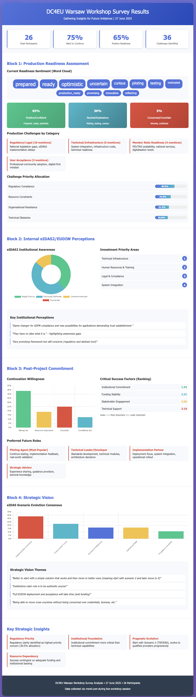

# DC4EU Warsaw Workshop Survey - "Beyond DC4EU" Assessment

## Introduction

This survey was conducted during the DC4EU Warsaw workshop by Work Package 9 (WP9) using a guided presentation format with menti.com for real-time response collection. The survey focused on assessing the current state of DC4EU solutions and evaluating aspects related to the future beyond the project's end on 31st July 2025.

The survey was structured around four critical evaluation blocks designed to capture honest assessments from piloting agents about production readiness, institutional dynamics, post-project commitment, and strategic vision.

## Survey Results Analysis

### Participation Overview
- **Survey Date:** 27 June 2025
- **Total Participants:** 26 responses
- **Response Quality:** High engagement with 60-80% response rate across all questions
- **Data Collection:** Real-time via menti.com during Warsaw workshop

---

### **Block 1: Production Readiness Assessment Results**

#### Q1: Current Readiness Sentiment (Word Cloud Analysis)
**20 responses received**

**Top Readiness Words:**
- "prepared" (4 mentions)
- "ready" (4 mentions) 
- "optimistic" (4 mentions)
- "uncertain" (3 mentions)
- "curious" (2 mentions)
- "pilot/piloting" (2 mentions)

**Sentiment Distribution:**
- **Positive/Confident:** 65% (prepared, ready, optimistic, production_ready)
- **Neutral/Exploratory:** 30% (piloting, testing, curious, reflecting)
- **Concerned/Uncertain:** 5% (uncertain, worried, conflicted)

#### Q2: Production Challenges (36 challenges identified)

**Challenge Categories:**
1. **Regulatory/Legal Issues** (10 mentions - highest) 
   - "Regulation", "legislation", "legal adoption at national level"
   - "We are 2 years away from production readiness on all fronts"

2. **Technical/Infrastructure** (6 mentions)
   - "Infrastructure costs, resources, time for maturization"
   - "Our infrastructure is not ready for connection with DC4EU"

3. **Member State Readiness** (4 mentions)
   - "Member states not ready with PID and TAO"
   - "General level of digitalisation in MS is too low"

4. **User Acceptance** (3 mentions)
   - "Acceptance of the wallet within the professional community"
   - "Willingness to accept 'digital first' as the norm"

#### Q3: Challenge Priority Rankings (19 responses)

**Average Priority Allocation (0-100 scale):**
1. **Regulatory compliance:** 30.5% (highest priority)
2. **Resource constraints:** 24.5%
3. **Organisational resistance:** 21.3%
4. **Technical obstacles:** 20.0% (lowest priority)

---

### **Block 2: Internal eIDAS2/EUDIW Perceptions Results**

#### Q4: Institutional eIDAS2 Perceptions

**Sentiment Categories:**
- **Highly Positive:** "promising", "game changer", "very important", "opportunity"
- **Cautiously Optimistic:** "hopeful", "clear and necessary" 
- **Uncertain/Unknown:** "quasi-unknown", "they have no idea what it is"
- **Concerned:** "not completely understood", "abstract tool"

**Key Finding:** Significant awareness gaps exist within institutions - "They have no idea what it is" indicates need for internal education.

#### Q5: Investment Requirements Analysis

**Investment Categories Identified:**
1. **Technical Infrastructure** - platforms, ecosystems, technical systems
2. **Human Resources & Training** - personnel development, legal training
3. **Legal & Compliance** - policy development, legal advice
4. **System Integration** - wallet integration, existing system connections
5. **Organisational Development** - business/IT strategy alignment

**Notable Quantified Investment:** One respondent specified "50k€" for implementation.

---

### **Block 3: Post-Project Commitment Results**

#### Q6: Continuation Willingness (16 responses)

**Commitment Categories:**
- **Strong Yes:** 7 responses (44%) - "Yes absolutely", "Definitely yes"
- **Conditional Yes:** 2 responses (13%) - "Yes, but..." 
- **Resource Dependent:** 3 responses (19%) - "Yes, if proper funding is made available"
- **Uncertain/Qualified:** 4 responses (25%)

**Overall Result:** 75% want to continue with various conditions, primarily funding-dependent.

#### Q7: Critical Elements for Continuity Rankings (16 responses)

**Average Importance Rankings (1=most important, 4=least important):**
1. **Institutional commitment:** 1.94 (most critical)
2. **Funding stability:** 2.31
3. **Stakeholder engagement:** 2.56
4. **Technical support:** 3.19 (least critical)

**Key Insight:** Institutional commitment and funding are the primary success factors, not technical capabilities.

#### Q8: Preferred Future Roles (18 responses)

**Role Preferences:** 
- **Piloting Agent:** Most common preference - continuing testing and feedback
- **Technical Leader/Developer:** Standards development, technical modules
- **Implementation Partner:** Deployment and integration focus
- **Strategic Advisor:** Experience sharing and guidance
- **Solution Provider:** Issuer/verifier capabilities for students

**Common Qualifier:** "Depending on budget and resource availability" - highlighting resource constraints.

---

### **Block 4: Strategic Vision Results**

#### Q9: eIDAS Scenario Evolution Vision (18 responses)

**Strategic Themes:**
1. **Scenario 2 Preference:** "Start with scenario 2 then move to better ones"
2. **Progressive Evolution:** Begin with TSP/EAA, evolve to qualified providers
3. **Cross-border Focus:** "Borderless data exchange", seamless European mobility
4. **Institutional Role:** "Institutions main role is to be authentic source"
5. **Implementation Realism:** "Full EUDIW deployment will take time and funding"

**Consensus Direction:** Start with Scenario 2 (non-qualified TSP) for easier implementation, then progress to Scenario 3/4 as Member State infrastructure matures.

---

## Key Strategic Insights

### **Critical Success Factors**
1. **Regulatory clarity** is the highest priority concern (30.5% of challenge allocation)
2. **Institutional commitment** ranks as most important continuity element
3. **Funding stability** essential for 75% of willing participants
4. **Member State readiness** is a significant external dependency

### **Readiness Assessment**
- **High motivation:** 65% positive readiness sentiment
- **Realistic concerns:** Well-identified challenges around regulation and resources
- **Strong continuation intent:** 75% want to continue with proper support

### **Strategic Consensus**
- **Pragmatic approach:** Start with Scenario 2, evolve progressively
- **Institution-centric:** Universities and qualification bodies as authentic sources
- **European vision:** Cross-border credential mobility as ultimate goal
- **Resource-dependent:** Success contingent on adequate funding and institutional backing

### **Implementation Recommendations**
1. **Address regulatory uncertainty** through clearer guidance and timelines
2. **Secure institutional commitment** at leadership level before technical deployment
3. **Establish sustainable funding models** for post-project continuation
4. **Focus on Scenario 2 implementation** as practical starting point
5. **Invest in institutional awareness** about eIDAS2 implications and opportunities

---

## Expected Outcomes

This comprehensive survey provided critical insights for:

1. **Realistic production readiness assessment** - 65% positive readiness with clear challenge identification
2. **Internal dynamics understanding** - significant awareness gaps requiring institutional education
3. **Post-project sustainability evaluation** - 75% continuation willingness dependent on funding and institutional support
4. **Strategic direction consensus** - pragmatic Scenario 2 starting point with progressive evolution

The results directly informed the transition strategy from formal DC4EU project conclusion to sustainable, community-driven continuation of digital credential initiatives across European educational and professional qualification sectors.

---

## Graphical overview

