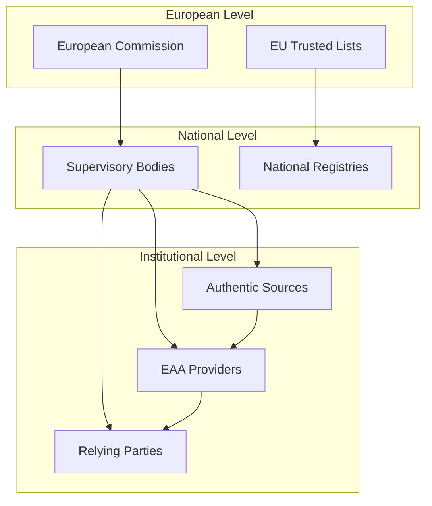

# DC4EU Legal Entity Ecosystem Framework
## A Comprehensive Guide to Organisational Roles and Relationships in European Digital Credentials

---

## Executive Summary

The DC4EU (Digital Credentials for Europe) project establishes a comprehensive legal framework defining how organisations interact within the European digital identity ecosystem for educational and professional qualifications. This framework centres on **legal entities assuming specific roles** and their **formalised relationships** within a trust network governed by eIDAS 2.0 Regulation.

The ecosystem operates through clearly defined **organisational roles**, **trust relationships**, and **compliance frameworks** that enable secure, interoperable digital credential management across EU Member States.

---

## Document Structure and Navigation

This framework consists of a main overview document (this page) and five comprehensive sub-documents that provide detailed guidance for different aspects of the ecosystem:

### 📋 **Core Framework Overview** (This Document)
- Executive summary and navigation
- Key concepts and principles
- Quick reference guides
- Integration overview

### 🏛️ **[Entity Roles & Responsibilities](./entities-main-framework.md)**
- **Purpose:** Define organisational capabilities and responsibilities
- **Key Focus:** Six primary roles (Authentic Sources, QEAA Providers, Pub-EAA Providers, EAA Providers, Relying Parties, Supervisory Bodies)
- **Content:** Legal requirements, eligible entities, multi-role scenarios
- **Audience:** Legal entities determining their ecosystem role(s)

### 🔗 **[Inter-Organisational Relationships](./entities/relationships.md)**  
- **Purpose:** Map inter-organisational dependencies and trust networks
- **Key Focus:** Authority, verification, and operational relationships
- **Content:** Trust chains, cross-border mechanisms, relationship lifecycle
- **Audience:** Entities establishing partnerships and trust relationships

### ⚖️ **[Regulatory Compliance Framework](./entities/compliance.md)**
- **Purpose:** Ensure systematic regulatory adherence
- **Key Focus:** Entity-specific compliance requirements and monitoring
- **Content:** Legal obligations, compliance checklists, enforcement mechanisms
- **Audience:** Compliance officers, auditors, supervisory bodies

### 🛠️ **[Implementation Guidance](./entities/implementation.mdimplementation.md)**
- **Purpose:** Provide practical onboarding procedures
- **Key Focus:** Step-by-step integration processes
- **Content:** Classical PKI and dPKI scenarios, technical requirements, testing frameworks
- **Audience:** Technical teams, project managers, implementation specialists

### 📊 **[Governance & Monitoring](./entities/governance.md)**
- **Purpose:** Establish systematic oversight and performance management
- **Key Focus:** Multi-level governance architecture and monitoring
- **Content:** Performance metrics, risk management, accountability frameworks
- **Audience:** Governance bodies, supervisory authorities, strategic planners

---

## Framework Principles: The Legal Entity-Centric Approach

The DC4EU ecosystem is fundamentally an **inter-organisational trust network** where:

### 🏢 **Institutional Identity First**
- **Educational institutions**, **professional bodies**, and **public authorities** assume defined roles
- **Organisational capabilities** determine ecosystem participation scope
- **Institutional accountability** maintains trust and reliability

### 🤝 **Formalised Trust Relationships**
- **Trust relationships** are established through formal accreditation and certification processes
- **Authority chains** define supervision and oversight responsibilities  
- **Operational agreements** enable day-to-day ecosystem functions

### ⚖️ **Regulatory Compliance Integration**
- **Regulatory compliance** is maintained through structured onboarding and monitoring frameworks
- **Legal obligations** are clearly defined for each organisational role
- **Enforcement mechanisms** ensure accountability and standards maintenance

### 🔧 **Technical Interoperability Standards**
- **Technical interoperability** is achieved through standardised organisational interfaces
- **Common protocols** enable seamless cross-border operations
- **Hybrid trust models** support both traditional and emerging technologies

---

## Quick Reference: Entity Roles Matrix

| **Legal Entity Type** | **Authentic Source** | **QEAA Provider** | **Pub-EAA Provider** | **EAA Provider** | **Relying Party** |
|----------------------|:-------------------:|:-----------------:|:--------------------:|:----------------:|:-----------------:|
| **Public Universities** | ✅ Student Records | ⚠️ If QTSP Status | ✅ Public Mandate | ✅ Digital Diplomas | ✅ Admissions |
| **Private Universities** | ⚠️ Limited Scope | ❌ Not Eligible | ❌ Not Eligible | ✅ Certifications | ✅ Verification |
| **Government Agencies** | ✅ Official Records | ⚠️ If QTSP Status | ✅ Designated Bodies | ⚠️ Limited Scope | ✅ Public Services |
| **Professional Bodies** | ✅ License Records | ⚠️ If QTSP Status | ✅ If Designated | ✅ Certifications | ✅ License Checks |
| **QTSPs** | ❌ Not Applicable | ✅ Primary Role | ❌ Not Applicable | ⚠️ Non-Qualified | ✅ Validation |
| **Training Providers** | ❌ Not Applicable | ❌ Not Eligible | ❌ Not Applicable | ✅ Course Certs | ✅ Background |

**Legend:** ✅ Recommended Role | ⚠️ Conditional/Limited | ❌ Not Applicable

---

## Implementation Pathways

### 🛤️ **Pathway 1: Classical PKI Implementation**
**Best for:** Organisations with existing PKI infrastructure
- Traditional X.509v3 certificate-based trust
- EU Trusted List integration
- Established QTSP relationships
- **→ [Start with Implementation Guidance](implementation.md#classical-pki-infrastructure)**

### 🛤️ **Pathway 2: Hybrid PKI + dPKI Implementation**  
**Best for:** Organisations seeking future-ready solutions
- Combines traditional certificates with EBSI DIDs
- Enhanced interoperability and verifiability
- Preparation for evolving standards
- **→ [Start with Implementation Guidance](implementation.md#dpki-ebsi-integration)**

---

## Compliance Quick Check

### ✅ **Pre-Onboarding Essentials**
Before beginning any onboarding process, ensure your organisation has:

- [ ] **Legal Entity Status**: Verified company/institution registration
- [ ] **Role Eligibility**: Confirmed eligibility for intended ecosystem role(s)
- [ ] **Technical Capability**: Infrastructure for secure digital operations
- [ ] **Regulatory Understanding**: Knowledge of applicable EU and national laws
- [ ] **Resource Commitment**: Budget and staffing for implementation and maintenance

**→ [Complete Compliance Assessment](compliance.md#entity-specific-compliance-requirements)**

---

## Trust Network Overview

**→ [Explore Detailed Trust Relationships](relationships.md#trust-relationship-networks)**

---

## Getting Started Checklist

### 📋 **For New Organisations**
1. **Determine Your Role(s)**: [Review Entity Roles & Responsibilities](entity-roles.md)
2. **Understand Relationships**: [Study Inter-Organisational Requirements](relationships.md)  
3. **Assess Compliance**: [Complete Compliance Framework Review](compliance.md)
4. **Plan Implementation**: [Follow Implementation Guidance](implementation.md)
5. **Establish Governance**: [Implement Monitoring Framework](governance.md)

### 📋 **For Existing Ecosystem Participants**
1. **Review Current Compliance**: [Use Compliance Tracking Tools](compliance.md#compliance-tracking-tools)
2. **Optimise Relationships**: [Assess Trust Network Position](relationships.md#relationship-lifecycle-management)
3. **Enhance Governance**: [Implement Advanced Monitoring](governance.md#performance-monitoring-framework)
4. **Expand Capabilities**: [Consider Additional Roles](entity-roles.md#multi-role-scenarios)

---

## Support and Resources

### 📚 **Documentation Suite**
- **[Entity Roles & Responsibilities](entity-roles.md)**: Comprehensive role definitions and requirements
- **[Inter-Organisational Relationships](relationships.md)**: Trust network mapping and management  
- **[Regulatory Compliance Framework](compliance.md)**: Systematic compliance assurance
- **[Implementation Guidance](implementation.md)**: Practical onboarding procedures
- **[Governance & Monitoring](governance.md)**: Oversight and performance management

### 🆘 **Additional Support**
- **Technical Assistance**: Contact your national supervisory body
- **Implementation Support**: Engage with certified implementation partners
- **Training Resources**: Access DC4EU training programmes and materials
- **Community Forums**: Participate in practitioner networks and user groups

---

## Framework Evolution and Updates

This framework is designed to evolve with the European digital identity landscape. Updates will be coordinated through:

- **European Commission** policy development and regulation updates
- **Standards bodies** technical specification evolution  
- **Practitioner feedback** from ecosystem participants
- **Research findings** from academic and industry collaborations

**Last Updated**: May 2025  
**Version**: 1.0  
**Next Review**: November 2025

---

*This framework supports the creation of a **unified European digital credential ecosystem** whilst respecting **institutional autonomy** and **national sovereignty** in educational and professional qualification systems. By focusing on legal entities and their relationships, it provides the foundation for trusted, interoperable, and legally compliant digital credential management across the European Union.*