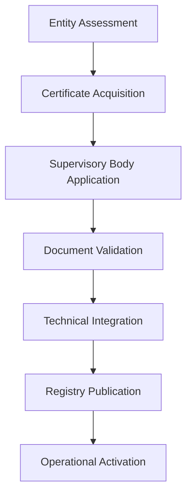

# DC4EU Implementation Guidance
## Practical Onboarding and Integration for Legal Entities

### Overview

This implementation guidance provides **step-by-step procedures** for legal entities seeking to integrate into the DC4EU ecosystem. The guidance covers both **Classical PKI** and **Classical PKI + dPKI (EBSI)** scenarios, addressing the practical aspects of organisational onboarding across different entity roles.

---

## Implementation Scenarios

### Scenario 1: Classical PKI
**Characteristics:**
- Traditional X.509v3 certificate-based trust
- EU Trusted List reliance for cross-border recognition
- Established PKI infrastructure utilisation
- Qualified Trust Service Provider integration

### Scenario 2: Classical PKI + dPKI (EBSI)
**Characteristics:**  
- Hybrid trust model combining traditional and distributed approaches
- EBSI integration for decentralised identifiers (DIDs)
- Enhanced interoperability and verifiability
- Future-ready architecture for evolving standards

---

## Pre-Implementation Assessment

### Organisational Readiness Evaluation

#### Legal Entity Preparation Checklist
- [ ] **Legal status verification:** Company registration, educational authority designation, public body status
- [ ] **Jurisdictional compliance:** Understanding of applicable national and EU regulations
- [ ] **Technical capability assessment:** Infrastructure, staffing, and system integration capacity
- [ ] **Financial resources:** Budget for certification, technology, and ongoing operational costs
- [ ] **Risk management:** Insurance coverage, liability assessment, business continuity planning

#### Role Selection Matrix

| Entity Type | Authentic Source | QEAA Provider | Pub-EAA Provider | EAA Provider | Relying Party |
|-------------|:----------------:|:-------------:|:----------------:|:------------:|:-------------:|
| **Universities** | ✓ (Student records) | ⚠ (If QTSP) | ✓ (If public) | ✓ (Digital diplomas) | ✓ (Admissions) |
| **Professional Bodies** | ✓ (Qualification records) | ⚠ (If QTSP) | ✓ (If designated) | ✓ (Certifications) | ✓ (License verification) |
| **Government Agencies** | ✓ (Official records) | ⚠ (If QTSP) | ✓ (Public services) | ⚠ (Limited scope) | ✓ (Service provision) |
| **Private Training** | ⚠ (Limited scope) | ✗ (Not eligible) | ✗ (Not eligible) | ✓ (Course certificates) | ✓ (Background checks) |
| **QTSPs** | ✗ (Not applicable) | ✓ (Primary role) | ✗ (Not applicable) | ⚠ (As non-qualified) | ✓ (Certificate validation) |

**Legend:** ✓ Recommended, ⚠ Conditional, ✗ Not applicable

---

## Onboarding Process by Entity Role

### Authentic Source Onboarding

#### Prerequisites
- **Authoritative data repository** with verified educational or professional records
- **Legal designation** under national law as authentic source
- **Technical infrastructure** for secure attribute verification
- **Data protection compliance** framework implementation

#### Classical PKI Process

**Detailed Steps:**

1. **Entity Assessment (5-10 days)**
   - Legal status verification
   - Authentic source designation validation
   - Technical capability assessment
   - Data protection compliance review

2. **Certificate Acquisition (10-15 days)**
   - Selection of EU Trusted List QTSP
   - Qualified certificate application and issuance
   - Certificate installation and testing
   - Key management procedure establishment

3. **Supervisory Body Application (15-30 days)**
   - Application document preparation
   - Digital signature of submission documents
   - Supervisory body review and evaluation
   - Clarification requests resolution

4. **Technical Integration (20-30 days)**
   - Verification interface development
   - Security protocol implementation  
   - Integration testing with EAA providers
   - Performance and availability validation

5. **Registry Publication (5-10 days)**
   - National registry inclusion
   - Trust anchor publication
   - Cross-border accessibility verification
   - Status monitoring activation

#### Classical PKI + dPKI (EBSI) Process
**Additional Steps for EBSI Integration:**

1. **DID Generation (2-5 days)**
   - EBSI DID creation using project tools
   - DID document structure development
   - Key management setup for distributed operations

2. **Certificate Integration (3-5 days)**
   - X.509v3 certificate embedding in DID document
   - Hybrid trust model configuration
   - Cross-reference validation testing

3. **EBSI Registry Integration (5-10 days)**
   - Distributed registry registration
   - Trust anchor publication in EBSI
   - Interoperability testing with other EBSI entities

### EAA Provider Onboarding

#### Prerequisites
- **Credential issuance capability** for educational or professional qualifications
- **Institutional accreditation** for qualification types to be issued
- **Technical infrastructure** for wallet integration
- **Quality management systems** for credential lifecycle

#### Implementation Process

**Phase 1: Preparation (10-15 days)**
- [ ] Accreditation document collection and validation
- [ ] Technical system specification and development planning
- [ ] Staff training programme design and delivery
- [ ] Quality assurance framework implementation

**Phase 2: Certification (15-30 days)**
- [ ] Certificate acquisition from EU Trusted List QTSP
- [ ] Digital identity establishment and testing
- [ ] Cryptographic key management setup
- [ ] Security control implementation and validation

**Phase 3: Integration (20-40 days)**
- [ ] Wallet interface development and testing
- [ ] Authentic source integration for attribute verification
- [ ] Credential format standardisation (W3C VC, ELM)
- [ ] Revocation and status management implementation

**Phase 4: Validation (10-20 days)**  
- [ ] End-to-end testing with pilot users
- [ ] Security assessment and penetration testing
- [ ] Performance and scalability validation
- [ ] Business continuity and disaster recovery testing

### Relying Party Onboarding

#### Prerequisites
- **Service provision rationale** for credential verification
- **Attribute usage justification** under data minimisation principles
- **Technical verification capability** for credential validation
- **Privacy protection framework** for user data handling

#### Registration Process

**Step 1: Registration Preparation (5-10 days)**
- [ ] Service description and attribute requirements definition
- [ ] Legal basis establishment for credential verification
- [ ] Privacy impact assessment completion
- [ ] Technical integration capability demonstration

**Step 2: Authority Registration (10-15 days)**
- [ ] Member State registry submission
- [ ] Supervisory body review and validation
- [ ] Attribute list approval (full or partial)
- [ ] Registration certificate issuance

**Step 3: Technical Implementation (15-25 days)**
- [ ] Wallet verification interface development
- [ ] Cryptographic validation procedure implementation
- [ ] User consent management system integration
- [ ] Audit logging and monitoring activation

---

## Technical Implementation Requirements

### Classical PKI Infrastructure

#### Certificate Requirements
- **Qualified certificates** from EU Trusted List QTSPs
- **Key length and algorithm** compliance (RSA 2048+, ECDSA P-256+)
- **Certificate validity period** appropriate for role requirements
- **Revocation checking capability** implementation

#### Security Controls
- **Hardware Security Modules (HSMs)** for key protection
- **Multi-factor authentication** for system access
- **Network security controls** (firewalls, intrusion detection)
- **Physical security measures** for critical infrastructure

### dPKI/EBSI Integration

#### DID Management
- **DID generation** using EBSI-compatible methods
- **DID document structure** following W3C specifications
- **Key rotation procedures** for distributed identifier management
- **Resolution services** for DID verification

#### Blockchain Integration
- **EBSI node connectivity** and synchronisation
- **Transaction signing** and submission procedures
- **Consensus participation** (where applicable)
- **Data privacy protection** in distributed ledger usage

---

## Quality Assurance and Testing

### Testing Framework

#### Unit Testing
- **Individual component functionality** verification
- **API endpoint** testing and validation
- **Cryptographic operation** accuracy testing
- **Error handling** and recovery testing

#### Integration Testing  
- **Cross-system interoperability** validation
- **End-to-end workflow** testing
- **Performance under load** testing
- **Security control effectiveness** testing

#### User Acceptance Testing
- **Real-world scenario** simulation
- **Stakeholder feedback** collection and incorporation
- **Usability assessment** and improvement
- **Training effectiveness** evaluation

### Pilot Implementation

#### Controlled Deployment
- **Limited user group** engagement (10-50 participants)
- **Monitored environment** with extensive logging
- **Feedback collection** and analysis procedures
- **Issue identification** and resolution processes

#### Gradual Scaling
- **Phased user expansion** (50-500-5000+ participants)
- **Performance monitoring** and capacity planning
- **Support system scaling** and process refinement
- **Full operational readiness** validation

---

## Support and Maintenance

### Ongoing Operational Requirements

#### Technical Maintenance
- **System updates** and security patches
- **Certificate renewal** and lifecycle management
- **Performance monitoring** and optimisation
- **Backup and recovery** procedure testing

#### Compliance Maintenance
- **Regulatory update** monitoring and implementation
- **Audit preparation** and evidence collection
- **Incident response** and reporting procedures
- **Continuous improvement** process management

### Support Resources

#### Technical Documentation
- **Implementation guides** and best practices
- **API specifications** and integration examples
- **Troubleshooting procedures** and FAQs
- **Training materials** and certification programmes

#### Community Support
- **Practitioner networks** and knowledge sharing
- **Vendor ecosystem** and partner programmes  
- **Standards bodies** participation and contribution
- **Research collaboration** and innovation projects

---

*This implementation guidance provides practical, actionable steps for legal entities to successfully integrate into the DC4EU ecosystem whilst maintaining compliance with regulatory requirements and achieving operational excellence.*