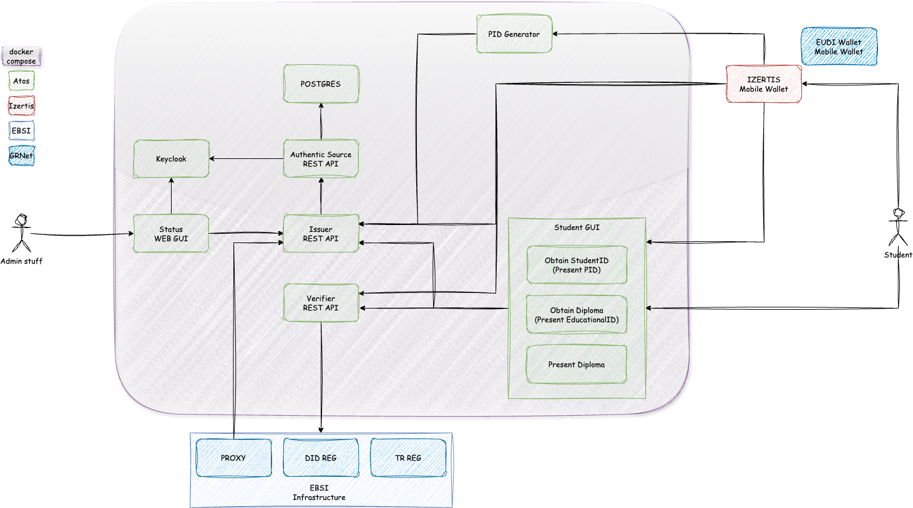

# Educational Pilot

## 1 About

This repository is created for describing the details associated to Educational Pilot

## 2 Architecture

The following diagrams show a high level detail of the different components to be deployed within the Educational Pilot

### 2.1 Components description

- Keycloak: tbd
- Status Web GUI: tbd
- PID Generator GUI: tbd
- Student Web GUI: tbd
- Issuer Agent: tbd
- Authentic Source: tbd
- Izertis Holder Wallet (mobile app): tbd
- EUDI Wallet (mobile app): tbd

## 3 Basic Building blocks

The basic operations implemented by the system are gathered in a RFCs format. The following section is devoted for describing them.

### 3.1.1 Approved RFCs

These are the approved RFCs identified. 

| **RFC #** | **RFC Title**                                                                                                |
| --------- | ------------------------------------------------------------------------------------------------------------ |
| RFC-001   | [Issue Verifiable Credentials Workflow - v1.0](docs/rfc001-issue-verifiable-credential.md)                   |
| RFC-002   | [Present Verifiable Credentials Workflow - v1.0](docs/rfc002-present-verifiable-credential.md)               |

#### 3.1.2 Candidate RFCs (Work in progress)

Following are the candidates' RFCs taken up. Note that the title, etc, may change.

| **RFC #** | **RFC Title**                                                                               |
| --------- | ------------------------------------------------------------------------------------------- |
| RFC-003   | [To be defined](docs/rfc003-to-be-defined.md) |

## 4. Use Cases by project

For each of the different projects where uSelf is han been applied, they have been identified some specific use cases. This section is devoted for providing a view of those specific uses cases by project

### 4.1 DC4EU

#### 4.1.1 Approved Use Cases

These are the approved use cases identified in DC4EU for applying in the Educational Pilot

| **Use Case #** | **Use Case Title**                                                                                           |
| -------------- | ------------------------------------------------------------------------------------------------------------ |
| DC4EU-001      | [Issue EducationalId using a PID for authentication - v1.0](docs/dc4eu/dc4eu-001-issue-eudcationalId.md)     |
| DC4EU-002      | [Issue a Diploma using a EducationalId for authentication - v1.0](docs/dc4eu/dc4eu-002-issue-diploma.md)        |
| DC4EU-003      | [Verify EducationalId for authentication - v1.0](docs/dc4eu/dc4eu-003-verify-diploma.md)                  |

#### 4.1.2 Candidate Use Cases (Work in progress)

Following are the candidates'Use cases taken up. Note that the title, etc, may change.

| **Use Case #** | **Use Case Title**                                                                                           |
| -------------- | ------------------------------------------------------------------------------------------------------------ |
| DC4EU-004      | [Issue a PID - v1.0](docs/dc4eu/dc4eu-004-issue-pid.md)                                                      |

## uSelf Compliance Test

Ledger uSelf is compliance with some test in order to assure the interoperability with others
### EUDI Wallet Compliance Test
This section needs to defined
### Ebsi Compliance Test

| Tool |Version | Holder | Issuer | Verifier | Trust Model |
| --------------------- | -------------------------------------------------------------------------------------------------------------------------------------------------------                   | :----: | :----: | :------:|:------: |
| uself-agent            | v0.0.3 |   ✅   |   ✅    |  ✅     |  ✅     |

### 5 Deployment

## Licensing

The content in this repository is copyrighted by ATOS IT SOLUTIONS AND SERVICES IBERIA, S.L. (hereinafter referred to as ATOS or EVIDEN) unless otherwise specified. Any other use is forbidden unless accepted in writing by ATOS”
