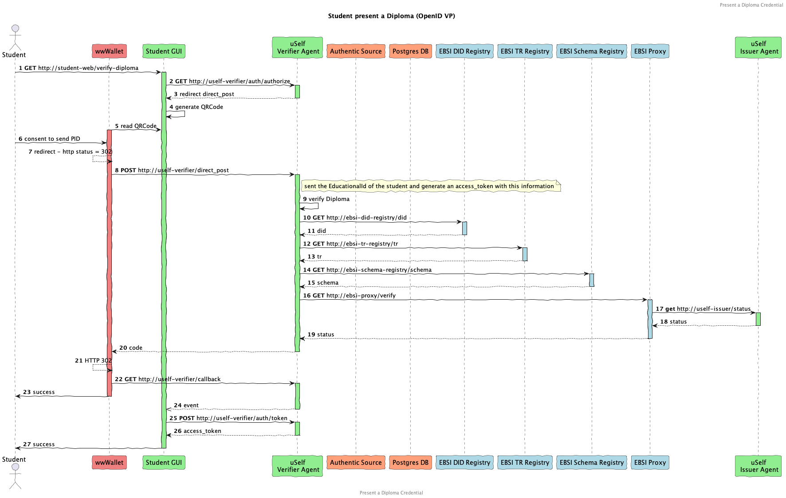

# Verify EducationalId for authentication - v1.0

**Authors:**

* Angel Palomares (<angel.palomares@eviden.com>)

**Reviewers:**

* LLuis Ariño ()


**Status:** Approved for v1.0

**Table of Contents:**

* [1 Summary](#1-summary)
* [2 Verification Flow](#2-verification-flow)
* [3 Message Details](#3-message-details)
  * [3.1 Authorization request](#31-authentication-request-authorize)
  * [3.2 Authorization response](#32-authentication-response-direct_post)
  * [3.3 Trigger Callback](#33-trigger-callback-callback)
  * [3.4 Obtain Token](#34-obtain-access-token-token)
* [4 Error Response Format](#4-error-response-format)
* [5 References](#5-references)

## [1 Summary](#1-summary)

This specification details the implementation of the OIDC4VP workflow for any verifier (relying party) in accordance with the reference specification of the European Wallet Ecosystem defined in the [ARF](https://eu-digital-identity-wallet.github.io/eudi-doc-architecture-and-reference-framework/1.1.0/arf/) and using EBSI infrastructure for Trust Model

The main aim of this use case is to shoe how an student can present an educationalID to be authenticate into the system.

## [2 Verification Flow](#2-verification-flow)

Figure 1 shows when the Relying Party only has a Front End:



          Figure 1: Verification Flow with a Relaying Party with a Front End and a Back End

## [3 Message Details](#3-message-details)

### [3.1 Authentication Request `/authorize`](#31-authentication-request-authorize)

#### 3.1.1 Request (Step 3)

The Relaying Party will execute the authorization request with the specific parameters that suits the specific verification flow operation at each moment. An example of how to invoke this request is as follows:
```http
GET from https://verifier.com/authorize?
  client_id=https://verifier.com
  &response_type=code
  &scope=com.example.pid
  &response_uri=https://verifier.com/direct_post
  &response_mode=direct_post
  &state=8d8b6a3d-4bc0-4234-9a9a-ed1928815502
  &nonce=d527c191-6e1d-4c3d-9843-9eaf2005fba9
```

#### 3.1.2 Response (Step 4)

In order to obtain a compact QR Code and therefore easier to be read by the mobile is recommended to response with a `request_uri` which means the authorization request is presented by reference. The Request URI has to be resolved to obtain the JWT, which contains the above fields in the claims. An example is as given below:

```http
HTTP 302 Location: openid://?request_uri=https://verifier.com/request_uri/a044aea-275d-43d6-8ec4-0ae88df46256
```

The reference as defined in JWT-Secured Authorization Request (JAR) via use of `request_uri` [3]. The custom URL scheme for authorization requests is `openid://`. An  example of the JAR object responded by the verifier is as given below:

```http
HTTP Response Payload: Content-Type plain/text

eyJraWQiOiJkaWQ6a2V5OnoyZG16RDgxY2dQeDhWa2k3SmJ1dU1tRllyV1BnWW95dHlrVVozZXlxaHQxajlLYnBpcjZjekJ6blJnNW1VM3VmUENtSlBCeFFGQ0VMZ2p0aHlRb0FzRFBUMWZoZG03Vzg2akNRQ3VjRGNkR2R2Mm0zdTdGdFBpb2FSajROUGhKSzl5bUdqczRyOEdiUDNwV0FZc2lZYmloNEZXQWdScmRFZDFxeXJnY1pBSDFiN3N6WTQjejJkbXpEODFjZ1B4OFZraTdKYnV1TW1GWXJXUGdZb3l0eWtVWjNleXFodDFqOUticGlyNmN6QnpuUmc1bVUzdWZQQ21KUEJ4UUZDRUxnanRoeVFvQXNEUFQxZmhkbTdXODZqQ1FDdWNEY2RHZHYybTN1N0Z0UGlvYVJqNE5QaEpLOXltR2pzNHI4R2JQM3BXQVlzaVliaWg0RldBZ1JyZEVkMXF5cmdjWkFIMWI3c3pZNCIsInR5cCI6IkpXVCIsImFsZyI6IkVTMjU2In0.eyJpc3MiOiJkaWQ6a2V5OnoyZG16RDgxY2dQeDhWa2k3SmJ1dU1tRllyV1BnWW95dHlrVVozZXlxaHQxajlLYnBpcjZjekJ6blJnNW1VM3VmUENtSlBCeFFGQ0VMZ2p0aHlRb0FzRFBUMWZoZG03Vzg2akNRQ3VjRGNkR2R2Mm0zdTdGdFBpb2FSajROUGhKSzl5bUdqczRyOEdiUDNwV0FZc2lZYmloNEZXQWdScmRFZDFxeXJnY1pBSDFiN3N6WTQiLCJyZXNwb25zZV90eXBlIjoidnBfdG9rZW4iLCJub25jZSI6ImQ1MjdjMTkxLTZlMWQtNGMzZC05ODQzLTllYWYyMDA1ZmJhOSIsImNsaWVudF9pZCI6Imh0dHBzOi8vdGFkcG9sZS1pbnRlcm5hbC1tYW1tYWwubmdyb2stZnJlZS5hcHAvYXV0aCIsInJlc3BvbnNlX21vZGUiOiJkaXJlY3RfcG9zdCIsImF1ZCI6Imh0dHBzOi8vdGFkcG9sZS1pbnRlcm5hbC1tYW1tYWwubmdyb2stZnJlZS5hcHAvYXV0aCIsInNjb3BlIjoib3BlbmlkIiwicHJlc2VudGF0aW9uX2RlZmluaXRpb24iOnsiaWQiOiJob2xkZXItd2FsbGV0LXF1YWxpZmljYXRpb24tcHJlc2VudGF0aW9uIiwiZm9ybWF0Ijp7Imp3dF92cCI6eyJhbGciOlsiRVMyNTYiXX0sImp3dF92YyI6eyJhbGciOlsiRVMyNTYiXX19LCJpbnB1dF9kZXNjcmlwdG9ycyI6W3siaWQiOiI8YW55IGlkLCByYW5kb20gb3Igc3RhdGljPiIsImZvcm1hdCI6eyJqd3RfdnAiOnsiYWxnIjpbIkVTMjU2Il19LCJqd3RfdmMiOnsiYWxnIjpbIkVTMjU2Il19fSwiY29uc3RyYWludHMiOnsiZmllbGRzIjpbeyJwYXRoIjpbIiQudmMudHlwZSJdLCJmaWx0ZXIiOnsidHlwZSI6ImFycmF5IiwiY29udGFpbnMiOnsiY29uc3QiOiJWZXJpZmlhYmxlQXR0ZXN0YXRpb24ifX19XX19LHsiaWQiOiI8YW55IGlkLCByYW5kb20gb3Igc3RhdGljPiIsImZvcm1hdCI6eyJqd3RfdnAiOnsiYWxnIjpbIkVTMjU2Il19LCJqd3RfdmMiOnsiYWxnIjpbIkVTMjU2Il19fSwiY29uc3RyYWludHMiOnsiZmllbGRzIjpbeyJwYXRoIjpbIiQudmMudHlwZSJdLCJmaWx0ZXIiOnsidHlwZSI6ImFycmF5IiwiY29udGFpbnMiOnsiY29uc3QiOiJWZXJpZmlhYmxlQXR0ZXN0YXRpb24ifX19XX19LHsiaWQiOiI8YW55IGlkLCByYW5kb20gb3Igc3RhdGljPiIsImZvcm1hdCI6eyJqd3RfdnAiOnsiYWxnIjpbIkVTMjU2Il19LCJqd3RfdmMiOnsiYWxnIjpbIkVTMjU2Il19fSwiY29uc3RyYWludHMiOnsiZmllbGRzIjpbeyJwYXRoIjpbIiQudmMudHlwZSJdLCJmaWx0ZXIiOnsidHlwZSI6ImFycmF5IiwiY29udGFpbnMiOnsiY29uc3QiOiJWZXJpZmlhYmxlQXR0ZXN0YXRpb24ifX19XX19XX0sInJlZGlyZWN0X3VyaSI6Imh0dHBzOi8vdGFkcG9sZS1pbnRlcm5hbC1tYW1tYWwubmdyb2stZnJlZS5hcHAvYXV0aC9kaXJlY3RfcG9zdCIsInN0YXRlIjoiOGQ4YjZhM2QtNGJjMC00MjM0LTlhOWEtZWQxOTI4ODE1NTAyIiwiZXhwIjoxNzExNTMyMDk5LCJpYXQiOjE3MTE1MzE3OTl9.bxeX3DoIKK1wKe4XwJyu9lVNhlD2L-riNjILok9oMcEb4f8OsvlgJtpLgYL6oh1sImLXjd1JiSFk4dMCGafXbA

```

### [3.2 Authentication Response `/direct_post`](#32-authentication-response-direct_post)

#### 3.2.1 Request (Step 11)

Verifiable credentials that meet the input descriptor constraints are included in the VP token. The presentation submission contains a descriptor map indicating which verifiable credentials fulfill the respective input descriptor constraints. These parameters, both `vp_token` and `presentation_submission`, are sent within HTTP POST to the direct post endpoint.

```http
POST https://verifier.com/direct_post
Content-Type: application/x-www-form-urlencoded

&vp_token=eyJraWQiOiJk...Z-1_msCBcxh7XEA
&presentation_submission={"definition_id":"9a044aea-275d-43d6-8ec4-0ae88df46256",...}
&state=475e634e-2633-4235-953d-eb879334cae7
```

Authorization response is sent to the previously obtained /direct_post URl including the `vp_token` and `presentation_submission` values.

On one hand the `vp_token` can be as follows:

``` jwt
eyJraWQiOiJkaWQ6a2V5OnoyZG16RDgxY2dQeDhWa2k3SmJ1dU1tRllyV1BnWW95dHlrVVozZXlxaHQxajlLYnBpcjZjekJ6blJnNW1VM3VmUENtSlBCeFFGQ0VMZ2p0aHlRb0FzRFBUMWZoZG03Vzg2akNRQ3VjRGNkR2R2Mm0zdTdGdFBpb2FSajROUGhKSzl5bUdqczRyOEdiUDNwV0FZc2lZYmloNEZXQWdScmRFZDFxeXJnY1pBSDFiN3N6WTQjejJkbXpEODFjZ1B4OFZraTdKYnV1TW1GWXJXUGdZb3l0eWtVWjNleXFodDFqOUticGlyNmN6QnpuUmc1bVUzdWZQQ21KUEJ4UUZDRUxnanRoeVFvQXNEUFQxZmhkbTdXODZqQ1FDdWNEY2RHZHYybTN1N0Z0UGlvYVJqNE5QaEpLOXltR2pzNHI4R2JQM3BXQVlzaVliaWg0RldBZ1JyZEVkMXF5cmdjWkFIMWI3c3pZNCIsInR5cCI6IkpXVCIsImFsZyI6IkVTMjU2In0.eyJzdWIiOiJkaWQ6a2V5OnoyZG16RDgxY2dQeDhWa2k3SmJ1dU1tRllyV1BnWW95dHlrVVozZXlxaHQxajlLYnBpcjZjekJ6blJnNW1VM3VmUENtSlBCeFFGQ0VMZ2p0aHlRb0FzRFBUMWZoZG03Vzg2akNRQ3VjRGNkR2R2Mm0zdTdGdFBpb2FSajROUGhKSzl5bUdqczRyOEdiUDNwV0FZc2lZYmloNEZXQWdScmRFZDFxeXJnY1pBSDFiN3N6WTQiLCJhdWQiOiJkaWQ6a2V5OnoyZG16RDgxY2dQeDhWa2k3SmJ1dU1tRllyV1BnWW95dHlrVVozZXlxaHQxajlLYnBpcjZjekJ6blJnNW1VM3VmUENtSlBCeFFGQ0VMZ2p0aHlRb0FzRFBUMWZoZG03Vzg2akNRQ3VjRGNkR2R2Mm0zdTdGdFBpb2FSajROUGhKSzl5bUdqczRyOEdiUDNwV0FZc2lZYmloNEZXQWdScmRFZDFxeXJnY1pBSDFiN3N6WTQiLCJuYmYiOjE3MTE1MzE4MDksImlzcyI6ImRpZDprZXk6ejJkbXpEODFjZ1B4OFZraTdKYnV1TW1GWXJXUGdZb3l0eWtVWjNleXFodDFqOUticGlyNmN6QnpuUmc1bVUzdWZQQ21KUEJ4UUZDRUxnanRoeVFvQXNEUFQxZmhkbTdXODZqQ1FDdWNEY2RHZHYybTN1N0Z0UGlvYVJqNE5QaEpLOXltR2pzNHI4R2JQM3BXQVlzaVliaWg0RldBZ1JyZEVkMXF5cmdjWkFIMWI3c3pZNCIsInZwIjp7IkBjb250ZXh0IjpbImh0dHBzOi8vd3d3LnczLm9yZy8yMDE4L2NyZWRlbnRpYWxzL3YxIl0sInR5cGUiOlsiVmVyaWZpYWJsZVByZXNlbnRhdGlvbiJdLCJpZCI6Ijc5NjEyN2ZjLWVkZTctNDVlYi1iYTE2LTIxZjdlMGQ3OWQwNCIsImhvbGRlciI6ImRpZDprZXk6ejJkbXpEODFjZ1B4OFZraTdKYnV1TW1GWXJXUGdZb3l0eWtVWjNleXFodDFqOUticGlyNmN6QnpuUmc1bVUzdWZQQ21KUEJ4UUZDRUxnanRoeVFvQXNEUFQxZmhkbTdXODZqQ1FDdWNEY2RHZHYybTN1N0Z0UGlvYVJqNE5QaEpLOXltR2pzNHI4R2JQM3BXQVlzaVliaWg0RldBZ1JyZEVkMXF5cmdjWkFIMWI3c3pZNCIsInZlcmlmaWFibGVDcmVkZW50aWFsIjpbXX0sImV4cCI6MTcxMTUzMjEwOSwiaWF0IjoxNzExNTMxODA5LCJub25jZSI6ImQ1MjdjMTkxLTZlMWQtNGMzZC05ODQzLTllYWYyMDA1ZmJhOSIsImp0aSI6Ijc5NjEyN2ZjLWVkZTctNDVlYi1iYTE2LTIxZjdlMGQ3OWQwNCJ9.FyZknGc7Xqj08UAa9kIAnxsl37UmMBF0MdGxd6JX7sOB0HNMDCpwgrSdFGmPTwcAVVcYzJMTFeayqlHiv_kkgg
```

On the other hand an example of `presentation_submission` is as follows:

```json
{
  "id": "a044aea-275d-43d6-8ec4-0ae88df46256",
  "definition_id": "841fd89b-f987-4052-88fc-30affccfd99c",
  "descriptor_map": [
    {
      "id": "2cfa0952-76ae-4172-a1c1-d223a8c00ce8",
      "format": "jwt_vp",
      "path": "$",
      "path_nested": {
        "id": "2cfa0952-76ae-4172-a1c1-d223a8c00ce8",
        "format": "jwt_vc",
        "path": "$.verifiableCredential[0]"
      }
    }
  ]
}
```

#### 3.2.2 Response (Step 14)

The response obtained will be a redirection (HTTP Status 302) to the mobile wallet which needs to follow the redirection to the callback URL previously defined in the `redirect_uri` in Step 3
An example of the response obtained is as follows:

```sh
HTTP 302 Location: https://verifier.com/callback?code=d527c191-6e1d-4c3d-9843-9eaf2005fba9&state=8d8b6a3d-4bc0-4234-9a9a-ed1928815502
```

### [3.3 Trigger Callback `/callback`](#33-trigger-callback-callback)

The Mobile Wallet will, following the redirection response, request the callback. In our case we have considered two different scenarios: when the Relaying Party has only one Front End (Figure 1) or when the Relaying Party uses a Front End and Back End (Figure 2).

#### 3.3.1 Request (Step 15)

An example for the use case described in the Figure 1 is as follows:
```http
GET from https://verifier.com/callback?
  code=d527c191-6e1d-4c3d-9843-9eaf2005fba9
  &state=8d8b6a3d-4bc0-4234-9a9a-ed1928815502
```

An example for the use case described in the Figure 2 is as follows:

```http
GET from https://relaying-party-backend.com/callback?
  code=d527c191-6e1d-4c3d-9843-9eaf2005fba9
  &state=8d8b6a3d-4bc0-4234-9a9a-ed1928815502
```

### [3.4 Obtain Access Token `/token`](#34-obtain-access-token-token)

As mentioned above this request can be executed by the Front End or by the Back End depending the specific case. However the details or both cases will be the same and they as follows:

#### 3.4.1 Request (Step 18 in Figure 1 and Step 17 in Figure 2)

```http
POST https://verifier.com/token
Content-Type: application/x-www-form-urlencoded

grant_type=authorization_code,
&client_id=did:key:z2dmzD81c...,
&code=d527c191-6e1d-4c3d-9843-9eaf2005fba9,
&code_verifier=random-secret
}
```

#### 3.4.2 Response (Step 19 in Figure 1 and Step 18 in Figure 2)

```http
HTTP Response Payload: Content-Type application/json
{
   "access_token":"eyJraWQiOiJkaWQ6a2V5OnoyZG16RDgxY2dQeDhWa2k3SmJ1dU1tRllyV1BnWW95dHlrVVozZXlxaHQxajlLYnBpcjZjekJ6blJnNW1VM3VmUENtSlBCeFFGQ0VMZ2p0aHlRb0FzRFBUMWZoZG03Vzg2akNRQ3VjRGNkR2R2Mm0zdTdGdFBpb2FSajROUGhKSzl5bUdqczRyOEdiUDNwV0FZc2lZYmloNEZXQWdScmRFZDFxeXJnY1pBSDFiN3N6WTQjejJkbXpEODFjZ1B4OFZraTdKYnV1TW1GWXJXUGdZb3l0eWtVWjNleXFodDFqOUticGlyNmN6QnpuUmc1bVUzdWZQQ21KUEJ4UUZDRUxnanRoeVFvQXNEUFQxZmhkbTdXODZqQ1FDdWNEY2RHZHYybTN1N0Z0UGlvYVJqNE5QaEpLOXltR2pzNHI4R2JQM3BXQVlzaVliaWg0RldBZ1JyZEVkMXF5cmdjWkFIMWI3c3pZNCIsInR5cCI6IkpXVCIsImFsZyI6IkVTMjU2In0.eyJhdWQiOiJodHRwczovL3RhZHBvbGUtaW50ZXJuYWwtbWFtbWFsLm5ncm9rLWZyZWUuYXBwL2lzc3VlciIsInN1YiI6ImRpZDprZXk6ejJkbXpEODFjZ1B4OFZraTdKYnV1TW1GWXJXUGdZb3l0eWtVWjNleXFodDFqOUticGlyNmN6QnpuUmc1bVUzdWZQQ21KUEJ4UUZDRUxnanRoeVFvQXNEUFQxZmhkbTdXODZqQ1FDdWNEY2RHZHYybTN1N0Z0UGlvYVJqNE5QaEpLOXltR2pzNHI4R2JQM3BXQVlzaVliaWg0RldBZ1JyZEVkMXF5cmdjWkFIMWI3c3pZNCIsImlzcyI6Imh0dHBzOi8vdGFkcG9sZS1pbnRlcm5hbC1tYW1tYWwubmdyb2stZnJlZS5hcHAvYXV0aCIsImNsYWltcyI6eyJhdXRob3JpemF0aW9uRGV0YWlscyI6bnVsbCwiY05vbmNlIjoiZDUyN2MxOTEtNmUxZC00YzNkLTk4NDMtOWVhZjIwMDVmYmE5IiwiY05vbmNlRXhwaXJlc0luIjoxNzExNTMyMTEyODUxLCJjbGllbnRJZCI6ImRpZDprZXk6ejJkbXpEODFjZ1B4OFZraTdKYnV1TW1GWXJXUGdZb3l0eWtVWjNleXFodDFqOUticGlyNmN6QnpuUmc1bVUzdWZQQ21KUEJ4UUZDRUxnanRoeVFvQXNEUFQxZmhkbTdXODZqQ1FDdWNEY2RHZHYybTN1N0Z0UGlvYVJqNE5QaEpLOXltR2pzNHI4R2JQM3BXQVlzaVliaWg0RldBZ1JyZEVkMXF5cmdjWkFIMWI3c3pZNCJ9LCJleHAiOjE3MTE1MzIxMTIsImlhdCI6MTcxMTUzMTgxMiwibm9uY2UiOiJkNTI3YzE5MS02ZTFkLTRjM2QtOTg0My05ZWFmMjAwNWZiYTkifQ.PfRIvQZ60BszV3HcynM-7BJHOKm0v5K9PGcoOrTw8dIZXqVdjZmuZVaQVEJ_DrQD_gLbfjOyJbxh6xfe6efWVw",
   "id_token":"eyJraWQiOiJkaWQ6a2V5OnoyZG16RDgxY2dQeDhWa2k3SmJ1dU1tRllyV1BnWW95dHlrVVozZXlxaHQxajlLYnBpcjZjekJ6blJnNW1VM3VmUENtSlBCeFFGQ0VMZ2p0aHlRb0FzRFBUMWZoZG03Vzg2akNRQ3VjRGNkR2R2Mm0zdTdGdFBpb2FSajROUGhKSzl5bUdqczRyOEdiUDNwV0FZc2lZYmloNEZXQWdScmRFZDFxeXJnY1pBSDFiN3N6WTQjejJkbXpEODFjZ1B4OFZraTdKYnV1TW1GWXJXUGdZb3l0eWtVWjNleXFodDFqOUticGlyNmN6QnpuUmc1bVUzdWZQQ21KUEJ4UUZDRUxnanRoeVFvQXNEUFQxZmhkbTdXODZqQ1FDdWNEY2RHZHYybTN1N0Z0UGlvYVJqNE5QaEpLOXltR2pzNHI4R2JQM3BXQVlzaVliaWg0RldBZ1JyZEVkMXF5cmdjWkFIMWI3c3pZNCIsInR5cCI6IkpXVCIsImFsZyI6IkVTMjU2In0.eyJzdWIiOiJkaWQ6a2V5OnoyZG16RDgxY2dQeDhWa2k3SmJ1dU1tRllyV1BnWW95dHlrVVozZXlxaHQxajlLYnBpcjZjekJ6blJnNW1VM3VmUENtSlBCeFFGQ0VMZ2p0aHlRb0FzRFBUMWZoZG03Vzg2akNRQ3VjRGNkR2R2Mm0zdTdGdFBpb2FSajROUGhKSzl5bUdqczRyOEdiUDNwV0FZc2lZYmloNEZXQWdScmRFZDFxeXJnY1pBSDFiN3N6WTQiLCJhdWQiOiJkaWQ6a2V5OnoyZG16RDgxY2dQeDhWa2k3SmJ1dU1tRllyV1BnWW95dHlrVVozZXlxaHQxajlLYnBpcjZjekJ6blJnNW1VM3VmUENtSlBCeFFGQ0VMZ2p0aHlRb0FzRFBUMWZoZG03Vzg2akNRQ3VjRGNkR2R2Mm0zdTdGdFBpb2FSajROUGhKSzl5bUdqczRyOEdiUDNwV0FZc2lZYmloNEZXQWdScmRFZDFxeXJnY1pBSDFiN3N6WTQiLCJpc3MiOiJodHRwczovL3RhZHBvbGUtaW50ZXJuYWwtbWFtbWFsLm5ncm9rLWZyZWUuYXBwL2F1dGgiLCJleHAiOjE3MTE1MzIxMTIsImlhdCI6MTcxMTUzMTgxMiwibm9uY2UiOiJkNTI3YzE5MS02ZTFkLTRjM2QtOTg0My05ZWFmMjAwNWZiYTkifQ.J4pf5vIUxJY34m4v7iX6HeKwzIZi_6eJTiUtseeOB5aHcm-P1B9-7Hb0vjrHuCLt2Eb3JUrHirGtCf0AD29ynQ",
   "token_type":"Bearer",
   "expires_in":1711532112851,
   "c_nonce":"d527c191-6e1d-4c3d-9843-9eaf2005fba9",
   "c_nonce_expires_in":1711532112851
}
```

## [4 Error Response Format](#4-error-response-format)

Standard HTTP response codes shall be supported.

```json
{
  "error": "invalid_request",
  "error_description": "Verification failed"
}
```

Some of the identifier deviations from success responses are as given:

<table>
  <tr>
   <td><strong>Response format</strong>
   </td>
   <td><strong>Description</strong>
   </td>
  </tr>
  <tr>
   <td>invalid_request
   </td>
   <td>Verification failed
   </td>
  </tr>
</table>

## [5 References](#5-references)

1. [OpenID for Verifiable Presentations (OID4VP)' Draft 14](https://openid.net/specs/openid-4-verifiable-presentations-1_0-14.html)
2. [The European Digital Identity Wallet Architecture and Reference Framework (v1.4.0)](https://github.com/eu-digital-identity-wallet/eudi-doc-architecture-and-reference-framework/releases/tag/v1.4.0)
3. [RFC 9101 OAuth 2.0 Authorization Framework: JWT-Secured Authorization Request (JAR)](https://www.rfc-editor.org/rfc/rfc9101.html#name-request-using-the-request_u)
4. [DIF Presentation Exchange](https://identity.foundation/presentation-exchange)

