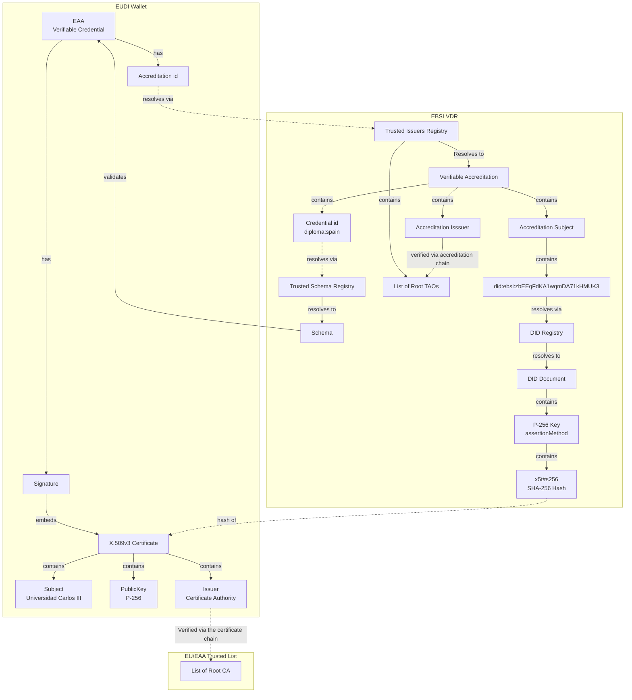

# A Comprehensive Guide to Binding X.509v3 Certificates with Decentralised Identifiers anchored in EBSI for issuing Electronic Attestations of Attributes <!-- omit in toc -->

**Date**: 28 May 2025
**Version**: 1.3
**Scope**: This guide focuses on the binding of X.509v3 certificates with DIDs and the issuance, presentation, and verification of EAAs using EBSI Verifiable Data Registries.

## 1. Introduction

This guide provides a comprehensive process for binding **X.509v3 certificates** with **Decentralised Identifiers (DIDs)**, establishing a hybrid trust model that combines **Decentralised Public Key Infrastructure (dPKI)** with traditional **Public Key Infrastructure (PKI)**. It specifically addresses legal entities enrolled in the **European Blockchain Services Infrastructure (EBSI)** that issue **Electronic Attestations of Attributes (EAAs)** to the **European Digital Identity Wallet (EUDIW)** according to the amended **eIDAS Regulation** (Regulation (EU) 2024/1183).

It is tailored for **Scenario 2** of the **Digital Credentials for Europe (DC4EU)** project, where public sector bodies (authentic data sources) or non-qualified Trust Service Providers (TSPs) issue non-qualified EAAs. The guide details each step required for **issuing**, **sharing**, and **verifying** EAAs, illustrating the workflow with Universidad Carlos III de Madrid as an example for academic credential issuance.

### 1.1 Objectives

- Enable legal entities to bind X.509v3 certificates to their EBSI DID public keys.
- Detail the processes for EAA issuance, sharing, and verification in EUDIW.
- Enhance trust in non-qualified EAAs using EBSI (Scenario 2).
- Demonstrate the workflow using Universidad Carlos III de Madrid.
- Ensure compliance with eIDAS, EBSI, and PKI standards.

### 1.2 Audience

- Technical implementers at legal entities.
- Certificate Authorities (CAs) supporting EBSI DID verification.
- Developers integrating dPKI and PKI for EAA issuance.
- Public sector bodies (authentic sources) issuing EAAs to EUDIW.
- Non-qualified TSPs issuing EAAs to EUDIW.

### 1.3 Context from DC4EU

The DC4EU project defines four EAA issuance scenarios:

1. **Scenario 1:** EAAs in closed systems (not EUDIW-compatible).
2. **Scenario 2:** EAAs issued by non-notified public sector bodies (Pub-EAAs) and non-qualified TSPs, with EBSI enhancing trust.
3. **Scenario 3:** EAAs issued by public sector bodies (Pub_EAAs).
4. **Scenario 4:** EAAs issued by qualified TSPs (QEAAs).

This guide addresses **Scenario 2**, where EBSI’s DID infrastructure and Verifiable Accreditation model fill trust gaps by verifying the issuer’s authorization and attribute authenticity, whether it is an authentic source or a non-qualified TSP.

## 2. Terminology

| Term                     | Definition                                                             |
| :----------------------- | :--------------------------------------------------------------------- |
| **DID**                  | Decentralised Identifier; resolves to a DID Document.                  |
| **DID Document**         | JSON structure containing public keys, services, and metadata.         |
| **EBSI**                 | European Blockchain Services Infrastructure.                           |
| **EAA**                  | Electronic Attestation of Attributes, as defined in eIDAS.             |
| **EUDIW**                | European Digital Identity Wallet for storing and presenting EAAs.      |
| **JWK**                  | JSON Web Key for representing cryptographic keys.                      |
| **x5t#S256**             | SHA-256 digest of a DER-encoded X.509 certificate.                     |
| **x5c**                  | Base64-encoded X.509 certificate chain.                                |
| **JWS**                  | JSON Web Signature for cryptographic signing of claims.                |
| **CSR**                  | Certificate Signing Request.                                           |
| **capabilityInvocation** | DID Document property for EBSI registry operations.                    |
| **assertionMethod**      | DID Document property for EAA signing.                                 |
| **authentication**       | DID Document property for verifying presentations.                     |
| **JWK Thumbprint**       | SHA-256 hash of a canonical JWK (per RFC 7638).                        |
| **VC**                   | Verifiable Credential (per W3C Verifiable Credentials Data Model 1.1). |
| **VDR**                  | Verifiable Data Registry (managed by EBSI).                            |

## 3. Overview of the Process

The workflow involves two primary components: (1) binding an X.509v3 certificate to a DID, and (2) issuing and presenting EAAs. The high-level steps are:

1. **Generate Cryptographic Key Pairs**: Generate public-private key pair.
2. **Generate X.509v3 CSR**: Initiate a CSR to request a certificte.
3. **Obtain Certificate**: Obtain an X.509v3 certificate from a CA.
4. **Create Issuer's DID**: Register the issuer DID in the EBSI DID Registry.
5. **Update DID Document**: Register the certificate digest using the `x5t#S256` JWK member in the DID Document.
6. **Register with EUDIW**: Register as a service provider or non-qualified TSP, as appropriate.
7. **Issue EAA**: Sign and deliver the EAA to EUDIW.
8. **Share EAA**: Present the EAA via EUDIW protocols.
9. **Verify EAA**: Validate signatures, bindings, and trust chains.

This process underpins **Scenario 2**, leveraging EBSI as a VDR to enhance trust for non-qualified EAAs.

## Overview of Key Elements and Their Relationships



With this model, we decouple the credential signing certificate lifecycle from the orgainsation's accreditation lifecycle.

## 4. Example: Universidad Carlos III de Madrid

The University, as a public sector body and authentic source, issues EAAs (e.g., academic diplomas) to EUDIW using EBSI and an X.509v3 certificate.

### 4.1 DID and DID Document

**DID**: `did:ebsi:zbEEqFdKA1wqmDA71kHMUK3`

**DID Document:**

```json
{
  "@context": [
    "https://www.w3.org/ns/did/v1",
    "https://w3id.org/security/suites/jws-2020/v1"
  ],
  "id": "did:ebsi:zbEEqFdKA1wqmDA71kHMUK3",
  "controller": ["did:ebsi:zbEEqFdKA1wqmDA71kHMUK3"],
  "verificationMethod": [
    {
      "id": "did:ebsi:zbEEqFdKA1wqmDA71kHMUK3#L3yUYRBQeUCYhOf8dyUi7lkqW_kr3JovF5XHWjBqnno",
      "type": "JsonWebKey2020",
      "controller": "did:ebsi:zbEEqFdKA1wqmDA71kHMUK3",
      "publicKeyJwk": {
        "kty": "EC",
        "crv": "secp256k1",
        "x": "xm7XSecv_g2KEH7gJiqd4unzeU2oe_T75qzMYGDcLXY",
        "y": "IsfOcbc95AA6gxqHUPeoUN4CupgqO5ehrdPVz9dTcX0",
        "alg": "ES256K"
      }
    },
    {
      "id": "did:ebsi:zbEEqFdKA1wqmDA71kHMUK3#uPJtfsQgb1zWV25SOE9HwU5yzjVRfoPQVLUh-eZ79RU",
      "type": "JsonWebKey2020",
      "controller": "did:ebsi:zbEEqFdKA1wqmDA71kHMUK3",
      "publicKeyJwk": {
        "x5t#s256": "2d4e6f8b9a1c3d5e7f9a0b2c4d6e8f0a1b3c5d7e9f0a2b4c6d8e",
        "kty": "EC",
        "crv": "P-256",
        "x": "MrBK9V6_tTVc5uzRkBF7OQNsnogDhYr7m8etQQ2DBvw",
        "y": "GDWLKktUKlFR6kJM16rRcwAuCswva7SREhpzUttixmk",
        "alg": "ES256"
      }
    }
  ],
  "authentication": [
    "did:ebsi:zbEEqFdKA1wqmDA71kHMUK3#L3yUYRBQeUCYhOf8dyUi7lkqW_kr3JovF5XHWjBqnno",
    "did:ebsi:zbEEqFdKA1wqmDA71kHMUK3#uPJtfsQgb1zWV25SOE9HwU5yzjVRfoPQVLUh-eZ79RU"
  ],
  "assertionMethod": [
    "did:ebsi:zbEEqFdKA1wqmDA71kHMUK3#uPJtfsQgb1zWV25SOE9HwU5yzjVRfoPQVLUh-eZ79RU"
  ],
  "capabilityInvocation": [
    "did:ebsi:zbEEqFdKA1wqmDA71kHMUK3#L3yUYRBQeUCYhOf8dyUi7lkqW_kr3JovF5XHWjBqnno"
  ]
}
```

**Explanation:**

- **secp256k1 Key:** Used for EBSI Verifiable Data Registry operations.
- **P-256 Key:** Used for signing EAAs and authentication.

### 4.2 X.509v3 Certificate

(No "SAN did:ebsi" should be included in the certificate)

**Certificate:**

```pem
-----BEGIN CERTIFICATE-----
MIICmDCCAgGgAwIBAgIBADANBgkqhkiG9w0BAQsFADBpMQswCQYDVQQGEwJlczEP
MA0GA1UECAwGTWFkcmlkMSkwJwYDVQQKDCBVbml2ZXJzaWRhZCBDYXJsb3MgSUlJ
IGRlIE1hZHJpZDENMAsGA1UEAwwEdWMzbTEPMA0GA1UEBwwGTWFkcmlkMB4XDTI1
MDUxMzE0MTE1OVoXDTI2MDUxMzE0MTE1OVowaTELMAkGA1UEBhMCZXMxDzANBgNV
BAgMBk1hZHJpZDEpMCcGA1UECgwgVW5pdmVyc2lkYWQgQ2FybG9zIElJSSBkZSBN
YWRyaWQxDTALBgNVBAMMBHVjM20xDzANBgNVBAcMBk1hZHJpZDBZMBMGByqGSM49
AgEGCCqGSM49AwEHA0IABMssEr1Xr7U1XObs0ZARezkDbJ6IA4WK+5vHrUENgwZ8
NYsqS1QqUVHqQkzXqtFzAC4KzC9rtJEyGnNS22LGaaOjVDBSMA4GA1UdDwEB/wQE
AwIGwDAdBgNVHQ4EFgQU6V5uV7r3yq1d7kZ8p9Y8qXJq3NkwHwYDVR0jBBgwFoAU
6V5uV7r3yq1d7kZ8p9Y8qXJq3NkwMA0GCSqGSIb3DQEBCwUAA4IBAQB0yK1g3gL8
l8Z9X3z1q1e8v9q2k3m4n5p6q7r8t9u0v1w2x3y4z5a6b7c8d9e0f1g2h3i4j5k
6l7m8n9o0p1q2r3s4t5u6v7w8x9y0z1a2b3c4d5e6f7g8h9i0j1k2l3m4n5o6p7q
8r9s0t1u2v3w4x5y6z7a8b9c0d1e2f3g4h5i6j7k8l9m0n1o2p3q4r5s6t7u8v9w
0x1y2z3a4b5c6d7e8f9g0h1i2j3k4l5m6n7o8p9q0r1s2t3u4v5w6x7y8z9a0b1c
2d3e4f5g6h7i8j9k0l1m2n3o4p5q6r7s8t9u0v1w2x3y4z5a6b7c8d9e0f1g2h3i
4j5k6l7m8n9o0p1q2r3s4t5u6v7w8x9y0z1a2b3c4d5e6f7g8h9i0j1k2l3m4n5o
6p7q8r9s0t1u2v3w4x5y6z7a8b9c0d1e2f3SA==
-----END CERTIFICATE-----
```

**Details:**

- **Subject:** Universidad Carlos III de Madrid, Spain, Madrid.
- **Issuer:** Trusted CA.
- **Public Key:** P-256, matches `assertionMethod` in DID Document.
- **Validity:** 13 May 2025 to 13 May 2026.
- **Signature:** ECDSA with SHA-256 (ES256).

### 4.3 Certificate Signing Request (CSR)

(No "SAN did:ebsi" should be included in the CSR)

**CSR:**

```pem
-----BEGIN CERTIFICATE REQUEST-----
MIIBjjCCARgCAQAwgYkxCzAJBgNVBAYTAmVzMQ8wDQYDVQQIDAZNYWRyaWQxKTAn
BgNVBAoMIVVuaXZlcnNpZGFkIENhcmxvcyBJSUkgZGUgTWFkcmlkMQ0wCwYDVQQD
DAR1YzNtMQ8wDQYDVQQHDQZNYWRyaWQwWTATBgcqhkjOPQIBBggqhkjOPQMBBwNC
AASzLBJ9V6+1NVzm7NGQEXs5A2yeiAOFivubx61BDYMGfDWLKktUKlFR6kJM16rR
cwAuCswva7SREhpzUttixmmjoTAjMCUGCSqGSIb3DQEJDjEWMBQwFAYDVR0RBA0w
C4IJZGlkOmVic2k6emJFRXFGREtBMXdxbURBNzFrSE1VSzMwDQYJKoZIhvcNAQEL
BQADggEBAE1k3gL8l8Z9X3z1q1e8v9q2k3m4n5p6q7r8t9u0v1w2x3y4z5a6b7c8
d9e0f1g2h3i4j5k6l7m8n9o0p1q2r3s4t5u6v7w8x9y0z1a2b3c4d5e6f7g8h9i0
j1k2l3m4n5o6p7q8r9s0t1u2v3w4x5y6z7a8b9c0d1e2f3g4h5i6j7k8l9m0n1o2
p3q4r5s6t7u8v9w0x1y2z3a4b5c6d7e8f9g0h1i2j3k4l5m6n7o8p9q0r1s2t3u4
v5w6x7y8z9a0b1c2d3e4f5g6h7i8j9k0l1m2n3o4p5q6r7s8t9u0v1w2x3y4z5a6
b7c8d9e0f1g2h3i4j5k6l7m8n9o0p1q2r3s4t5u6v7w8x9y0z1a2b3c4d5e6f7g8
h9i0j1k2l3m4n5o6p7q8r9s0t1u2v3w4x5y6z7a8b9c0d1e2f3g==
-----END CERTIFICATE REQUEST-----
```

**Features:**

- **Public Key:** P-256 from the DID Document.
- **Signature:** P-256 private key.

### 4.4 EUDIW Registration

- **Entitlement:** `Service_Provider` or `Non_Q_EAA_Provider`.
- **Certificate:** Wallet relying party access certificate.
- **Protocols:** ISO/IEC 18013-5:2021, ISO/IEC TS 18013-7:2024.
- **Format:** Verifiable Credentials Data Model v2.

## 5. Step-by-Step Binding and EAA Processes

### 5.1 Generate Key Pairs

- **P-256 Key:** For EAA signing and authentication.
- **secp256k1 Key:** For EBSI registry operations.
- **Secure Storage:** Use a Hardware Security Module (HSM).

### 5.2 Create CSR

- Use the P-256 key.
- Sign with the corresponding private key.

### 5.3 Submit to CA

- Send the CSR to the CA
- Registration Authority (RA) validates the CSR
- CA issues the X.509v3 certificate

### 5.4 Receive Certificate

- Obtain the X.509v3 certificate
- Verify certificate integrity

### 5.5 Register DID

- Generate a DID, e.g., `did:ebsi:zbEEqFdKA1wqmDA71kHMUK3`.
- Register the DID in EBSI DID Registry (using the secp256k1 key).
- Include both keys in the DID Document.

### 5.6 Update DID Document

- Add `x5t#S256` to the relevant DID public key.
- Update the stored DID Document.

### 5.7 Register with EUDIW

- Register as `Service_Provider` or `Non_Q_EAA_Provider`.
- Obtain the wallet relying party access certificate.
- Configure EUDIW protocols and VC format.

### 5.8 Issue EAA

Universidad Carlos III de Madrid issues an EAA (e.g., a degree certificate) to a student’s EUDIW.

**Steps:**

1. **Verify Holder Identity:**
   - Authenticate the student (e.g., via eID or institutional login).
   - Ensure attribute data accuracy (e.g., degree details).
2. **Create Verifiable Credential:**
   - Use the W3C Verifiable Credentials Data Model 1.1.
   - Example EAA:

  ```json
  {
    "protected": {
      "alg": "ES256",
      "x5c": ["M..."] ,
      "iat": "2025-05-13T16:46:00Z"
    },
    "payload": {
      "@context": [
        "https://www.w3.org/2018/credentials/v1",
        "https://www.w3.org/2018/credentials/examples/v1"
      ],
      "id": "urn:uuid:123e4567-e89b-12d3-a456-426614174000",
      "type": ["VerifiableCredential", "UniversityDegreeCredential"],
      "issuer": "did:ebsi:zbEEqFdKA1wqmDA71kHMUK3",
      "cnf": {
        "kid": "jwk thumbprint of student's public key: 8pu7IcW-wr0McRBbgzG_iQh2cmkPebmjiQPBpmQMx7Y"
      },
      "credentialSubject": {
        "degree": {
          "type": "BachelorDegree",
          "name": "Bachelor of Science in Computer Science",
          "dateOfAward": "2025-05-01",
          "awardingInstitution": "Universidad Carlos III de Madrid"
        }
      },
      "termsOfUse": [
        {
          "id": "https://api-test.ebsi.eu/trusted-issuers-registry/{accreditation-id}",
          "type": "VerifiableAccreditation"
        }
      ]
    },
    "signature": "MEUCIQD6q3m4n5p6q7r8t9u0v1w2x3y4z5a6b7c8d9e0f1g2h3i4j5k6l7m8n9o0p1q2r3s4t5u6v7w8x9y0z1a2b3c4d5e6f7g8h9i0j1k2l3m4n5o6p7q8r9s0t1u2v3w4x5y6z7a8b9c0d1e2f3g4h5i6j7k8l9m0n1o2p3q4r5s6t7u8v9w0x1y2z3a4b5c6d7e8f9g0h1i2j3k4l5m6n7o8p9q0r1s2t3u4v5w6x7y8z9a0b1c2d3e4f5g6h7i8j9k0l1m2n3o4p5q6r7s8t9u0v1w2x3y4z5a6b7c8d9e0f1g2h3i4j5k6l7m8n9o0p1q2r3s4t5u6v7w8x9y0z1a2b3c4d5e6f7g8h9i0j1k2l3m4n5o6p7q8r9s0t1u2v3w4x5y6z7a8b9c0d1e2f3g=="
  }
  ```

3. **Sign the EAA:**

   - Use the P-256 private key (from `assertionMethod` in the DID Document).
   - Create a JWS using the ES256 algorithm.

4. **Deliver EAA to EUDIW:**

   - Use EBSI VC issuance profile to issue credentials to the wallet.
   - Store the credential in the student’s EUDIW.

**Tools:** EUDIW APIs for credential issuance; cryptographic library (e.g., OpenSSL) for JWS.

### 5.10 Share EAA

The student shares the EAA with a relying party (e.g., an employer).

**Steps:**

1. **Initiate Sharing:**
   - Relying party requests EAA via EUDIW (e.g., QR code scan), using EBSI's OpenID4VP profile.
2. **Create Verifiable Presentation (VP):**
   - EUDIW generates a VP:

```json
{
  "protected": {
    "alg": "ES256",
    "jwk": {
      "kty": "EC",
      "use": "sig",
      "crv": "P-256",
      "x": "GzwTHU6VI7MnoYKwBz2iBz6e-WKhyfIn4zZAvKirasw",
      "y": "2icDj_oCvt_SUxdAvK_Jc9QgGcPw90aiVqEj7xqGKRI",
      "alg": "ES256"
    }
  },
  "payload": {
    "@context": ["https://www.w3.org/2018/credentials/v1"],
    "type": ["VerifiablePresentation"],
    "verifiableCredential": [
      /* EAA from 5.9 */
    ]
  },
  "signature": "[signature]"
}
```

3. **Sign the VP:**
   - Student signs the presentation with their EUDIW private key (ES256).
   - Include the public key in the VP's protected header via the `jwk` member.
   - Optionally, include an x509 certificate in the `x5c` member of `jwk` if needed.

4. **Transmit the VP:**
   - Send via EUDIW protocol (proximity or online flow).

**Tools:** EUDIW app for presentation; relying party’s EUDIW-compatible interface.

### 5.11 Verify EAA

The relying party verifies the EAA's authenticity and trustworthiness.

**Steps:**

1. **Validate Verifiable Presentation and Holder Binding:**
   - Verify the VP signature using student’s public key (from the `jwk` in the header).
   - Confirm holder binding by matching the VP JWK thumbprint with the `cnf.kid` in the Verifiable Credential.
2. **Validate EAA Signature:**
   - Extract EAA from the VP.
   - Verify the EAA issuer signature using the public key in the issuer’s DID Document, or from the certificate in the `x5c` header.
3. **Verify Certificate Binding:**
   - Compute the certificate thumbprint (`x5t#S256`) of the certificate in the `x5c` header.
   - Compare this with the `x5t#S256` in the issuer’s DID Document for the key.
4. **Check Certificate:**
   - Validate the certificate chain and its revocation status (CRL/OCSP).
5. **Verify Issuer Trust Chain:**
   - Query EBSI DID Registry for the issuer's accreditations.
   - Verify TSP accreditation via EBSI Verifiable Accreditation (e.g., authorized to issue degrees).
   - Confirm attribute authenticity by linking the degree to the university’s records.
6. **EUDIW Integrity:**
   - Ensure the EAA was presented from a valid EUDIW instance.

**Example Outcome:**

- The EAA is authentic, was issued by an accredited TSP, and the certificate-DID binding is validated. The relying party accepts the credential.

**Tools:**

- EBSI DID Resolver API
- Cryptographic library for JWS and thumbprint verification
- PKI tools for certificate checks

## 6. EBSI’s Role in Scenario 2

EBSI enhances trust in non-qualified EAAs via:

- **DID Registry:** Providing verifiable TSP identity.
- **Verifiable Accreditation:** Confirming TSP authorizations.
- **Trust Chain:** Linking EAAs to authentic sources.
- **Auditability:** Leveraging blockchain records for accountability.

## 7. Lifecycle Management

### 7.1 Key Rotation

- Generate a new P-256 key.
- Update DID Document and obtain a new certificate.
- Reissue EAAs with the new key, if necessary.

### 7.2 Certificate Revocation

- Monitor via CRL/OCSP.
- Update the `x5t#S256` if the certificate is revoked.

## 8. Security Considerations

- Use JWS with ES256/ES256K algorithms.
- Store private keys in HSMs.
- Avoid TOFU; always validate trust chains and registry data.
- Employ timestamps and unique hashes to mitigate attacks.
- Comply with ETSI, ENISA, and NIST best practices.

## 9. Privacy Considerations

- Applies to legal entities only.
- Exclude personal data from DID Documents.
- Ensure no personal information appears in public registries.

## 10. Limitations

- Only one certificate can only be bound to a single public key.
- CAs must support EBSI DID verification.
- Certificate revocation relies on PKI mechanisms, not EBSI.
- EUDIW requires wallet relying party certificates.

## 11. Verification Process (Summary)

- Validate VP and EAA signatures.
- Verify certificate–DID binding (hashes/thumbprints).
- Check certificate and EBSI trust chain.
- Confirm EUDIW integrity.

## 12. Conformance Requirements

**MUST**:

- Use RFC 7638 JWK thumbprints.
- Include `x5t#S256`.
- Support ES256/ES256K for JWS algorithms.

**SHOULD**:

- Support rotation and lifecycle management processes.

## 13. Summary

This guide outlines the binding of X.509v3 certificates with DIDs in EBSI for non-qualified TSPs issuing EAAs to EUDIW (Scenario 2). Using Universidad Carlos III de Madrid as an example, it covers:

- Secure DID and certificate binding processes.
- Issuance, sharing, and verification steps for EAAs, with practical examples.
- EBSI’s trust enhancements by means of accreditation and trust chains.
- Compliance requirements with eIDAS, EBSI, and PKI standards.

This enables trusted EAA issuance, bridging decentralized and traditional trust models effectively.
