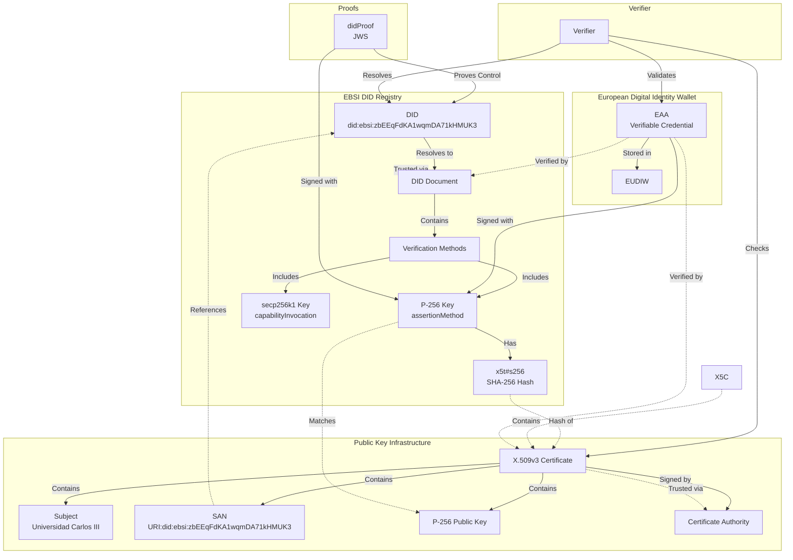

# A Comprehensive Guide to Binding X.509v3 Certificates with Decentralised Identifiers in EBSI for Electronic Attestations of Attributes

**Date**: 13 May 2025  
**Version**: 1.2  
**Scope**: Binding X.509v3 certificates with DIDs and issuing, sharing, and verifying EAAs in EBSI

## 1. Introduction

This guide provides a detailed process for binding **X.509v3 certificates** with **Decentralised Identifiers (DIDs)** to create a hybrid trust model combining **Decentralised Public Key Infrastructure (dPKI)** with traditional **Public Key Infrastructure (PKI)**. It focuses on legal entities within the **European Blockchain Services Infrastructure (EBSI)** issuing **Electronic Attestations of Attributes (EAAs)** to the **European Digital Identity Wallet (EUDIW)**, as per the amended **eIDAS Regulation** (Regulation (EU) 2024/1183).

The guide is tailored for **Scenario 2** of the **Digital Credentials for Europe (DC4EU)** project, where non-qualified Trust Service Providers (TSPs) issue EAAs. It includes steps for **issuing**, **sharing**, and **verifying** EAAs, using the **Universidad Carlos III de Madrid** as an example to issue academic credentials.

### 1.1 Objectives

- Enable legal entities to bind EBSI DIDs with X.509v3 certificates.
- Detail the issuance, sharing, and verification of EAAs in EUDIW.
- Enhance trust in non-qualified EAAs using EBSI (Scenario 2).
- Illustrate with the Universidad Carlos III de Madrid.
- Ensure compliance with eIDAS, EBSI, and PKI standards.

### 1.2 Audience

- Technical implementers at legal entities.
- Certificate Authorities (CAs) supporting EBSI DID verification.
- Developers integrating dPKI and PKI for EAA issuance.
- Non-qualified TSPs issuing EAAs to EUDIW.

### 1.3 Context from DC4EU

The DC4EU project outlines four EAA issuance scenarios:

1. **Scenario 1**: EAAs in closed systems (not EUDIW-compatible).
2. **Scenario 2**: EAAs by non-qualified TSPs (EBSI enhances trust).
3. **Scenario 3**: EAAs by public sector bodies (Pub_EAAs).
4. **Scenario 4**: EAAs by qualified TSPs (QEAAs).

This guide focuses on **Scenario 2**, where EBSI’s DID infrastructure and Verifiable Accreditation model address eIDAS trust model gaps by verifying TSP authorization and attribute authenticity.

## 2. Terminology

| Term                     | Definition                                                                            |
| ------------------------ | ------------------------------------------------------------------------------------- |
| **DID**                  | Decentralised Identifier, resolving to a DID Document.                                |
| **DID Document**         | JSON structure with public keys, services, and metadata.                              |
| **EBSI**                 | European Blockchain Services Infrastructure.                                          |
| **X.509v3 Certificate**  | PKI certificate with extensions like SAN.                                             |
| **EAA**                  | Electronic Attestation of Attributes, per eIDAS.                                      |
| **EUDIW**                | European Digital Identity Wallet for storing/presenting EAAs.                         |
| **JWK**                  | JSON Web Key for cryptographic keys.                                                  |
| **x5t#S256**             | SHA-256 digest of a DER-encoded X.509 certificate.                                    |
| **x5c**                  | Base64-encoded X.509 certificate chain.                                               |
| **JWS**                  | JSON Web Signature for signing claims.                                                |
| **SAN**                  | Subject Alternative Name, e.g., for DIDs.                                             |
| **CSR**                  | Certificate Signing Request.                                                          |
| **didProof**             | JWS proving DID and key control.                                                      |
| **capabilityInvocation** | DID Document property for EBSI registry operations.                                   |
| **assertionMethod**      | DID Document property for signing EAAs.                                               |
| **authentication**       | DID Document property for verifying presentations.                                    |
| **JWK Thumbprint**       | SHA-256 hash of a canonical JWK (RFC 7638).                                           |
| **VC**                   | Verifiable Credential, a format for EAAs (W3C Verifiable Credentials Data Model 1.1). |

## 3. Overview of the Process

The process involves binding an **X.509v3 certificate** to a DID public key and managing EAAs:

1. **Create DID**: Register in EBSI DID Registry.
2. **Generate CSR**: Create a CSR for a registered DID public key.
3. **Prove DID Control**: Sign a `didProof` to prove the certificate issuer control of the DID controlling key.
4. **Obtain Certificate**: From a CA. Optional: the x509 certificate may contain the DID as SAN URI.
5. **Update DID Document**: Compute and register the certificate digest via the `x5t` public key claim.
6. **Register with EUDIW**: As a non-qualified TSP.
7. **Issue EAA**: Sign and deliver to EUDIW.
8. **Share EAA**: Present via EUDIW protocols.
9. **Verify EAA**: Check signatures, binding, and trust chain.

This supports **Scenario 2**, enhancing trust in non-qualified EAAs via EBSI.

## Overview of key elements and their relationship



## 4. Example: Universidad Carlos III de Madrid

The Universidad, a non-qualified TSP, issues EAAs (e.g., academic diplomas) to EUDIW, using EBSI and an X.509v3 certificate.

### 4.1 DID and DID Document

**DID**: `did:ebsi:zbEEqFdKA1wqmDA71kHMUK3`

**DID Document**:

```json
{
  "@context": [
    "https://www.w3.org/ns/did/v1",
    "https://w3id.org/security/suites/jws-2020/v1"
  ],
  "id": "did:ebsi:zbEEqFdKA1wqmDA71kHMUK3",
  "controller": ["did:ebsi:zbEEqFdKA1wqmDA71kHMUK3"],
  "verificationMethod": [
    {
      "id": "did:ebsi:zbEEqFdKA1wqmDA71kHMUK3#L3yUYRBQeUCYhOf8dyUi7lkqW_kr3JovF5XHWjBqnno",
      "type": "JsonWebKey2020",
      "controller": "did:ebsi:zbEEqFdKA1wqmDA71kHMUK3",
      "publicKeyJwk": {
        "kty": "EC",
        "crv": "secp256k1",
        "x": "xm7XSecv_g2KEH7gJiqd4unzeU2oe_T75qzMYGDcLXY",
        "y": "IsfOcbc95AA6gxqHUPeoUN4CupgqO5ehrdPVz9dTcX0",
        "alg": "ES256K"
      }
    },
    {
      "id": "did:ebsi:zbEEqFdKA1wqmDA71kHMUK3#uPJtfsQgb1zWV25SOE9HwU5yzjVRfoPQVLUh-eZ79RU",
      "type": "JsonWebKey2020",
      "controller": "did:ebsi:zbEEqFdKA1wqmDA71kHMUK3",
      "publicKeyJwk": {
        "x5t#s256": "2d4e6f8b9a1c3d5e7f9a0b2c4d6e8f0a1b3c5d7e9f0a2b4c6d8e",
        "kty": "EC",
        "crv": "P-256",
        "x": "MrBK9V6_tTVc5uzRkBF7OQNsnogDhYr7m8etQQ2DBvw",
        "y": "GDWLKktUKlFR6kJM16rRcwAuCswva7SREhpzUttixmk",
        "alg": "ES256"
      }
    }
  ],
  "authentication": [
    "did:ebsi:zbEEqFdKA1wqmDA71kHMUK3#L3yUYRBQeUCYhOf8dyUi7lkqW_kr3JovF5XHWjBqnno",
    "did:ebsi:zbEEqFdKA1wqmDA71kHMUK3#uPJtfsQgb1zWV25SOE9HwU5yzjVRfoPQVLUh-eZ79RU"
  ],
  "assertionMethod": [
    "did:ebsi:zbEEqFdKA1wqmDA71kHMUK3#uPJtfsQgb1zWV25SOE9HwU5yzjVRfoPQVLUh-eZ79RU"
  ],
  "capabilityInvocation": [
    "did:ebsi:zbEEqFdKA1wqmDA71kHMUK3#L3yUYRBQeUCYhOf8dyUi7lkqW_kr3JovF5XHWjBqnno"
  ]
}
```

**Explanation**:

- **secp256k1 Key**: For EBSI registry operations.
- **P-256 Key**: For signing EAAs and authentication.

### 4.2 X.509v3 Certificate

**Certificate**:

```pem
-----BEGIN CERTIFICATE-----
MIICmDCCAgGgAwIBAgIBADANBgkqhkiG9w0BAQsFADBpMQswCQYDVQQGEwJlczEP
MA0GA1UECAwGTWFkcmlkMSkwJwYDVQQKDCBVbml2ZXJzaWRhZCBDYXJsb3MgSUlJ
IGRlIE1hZHJpZDENMAsGA1UEAwwEdWMzbTEPMA0GA1UEBwwGTWFkcmlkMB4XDTI1
MDUxMzE0MTE1OVoXDTI2MDUxMzE0MTE1OVowaTELMAkGA1UEBhMCZXMxDzANBgNV
BAgMBk1hZHJpZDEpMCcGA1UECgwgVW5pdmVyc2lkYWQgQ2FybG9zIElJSSBkZSBN
YWRyaWQxDTALBgNVBAMMBHVjM20xDzANBgNVBAcMBk1hZHJpZDBZMBMGByqGSM49
AgEGCCqGSM49AwEHA0IABMssEr1Xr7U1XObs0ZARezkDbJ6IA4WK+5vHrUENgwZ8
NYsqS1QqUVHqQkzXqtFzAC4KzC9rtJEyGnNS22LGaaOjVDBSMA4GA1UdDwEB/wQE
AwIGwDAdBgNVHQ4EFgQU6V5uV7r3yq1d7kZ8p9Y8qXJq3NkwHwYDVR0jBBgwFoAU
6V5uV7r3yq1d7kZ8p9Y8qXJq3NkwMA0GCSqGSIb3DQEBCwUAA4IBAQB0yK1g3gL8
l8Z9X3z1q1e8v9q2k3m4n5p6q7r8t9u0v1w2x3y4z5a6b7c8d9e0f1g2h3i4j5k
6l7m8n9o0p1q2r3s4t5u6v7w8x9y0z1a2b3c4d5e6f7g8h9i0j1k2l3m4n5o6p7q
8r9s0t1u2v3w4x5y6z7a8b9c0d1e2f3g4h5i6j7k8l9m0n1o2p3q4r5s6t7u8v9w
0x1y2z3a4b5c6d7e8f9g0h1i2j3k4l5m6n7o8p9q0r1s2t3u4v5w6x7y8z9a0b1c
2d3e4f5g6h7i8j9k0l1m2n3o4p5q6r7s8t9u0v1w2x3y4z5a6b7c8d9e0f1g2h3i
4j5k6l7m8n9o0p1q2r3s4t5u6v7w8x9y0z1a2b3c4d5e6f7g8h9i0j1k2l3m4n5o
6p7q8r9s0t1u2v3w4x5y6z7a8b9c0d1e2f3SA==
-----END CERTIFICATE-----
```

**Details**:

- **Subject**: Universidad Carlos III de Madrid, Spain, Madrid.
- **Issuer**: Trusted CA.
- **Public Key**: P-256, matching `assertionMethod`.
- **SAN**: `URI:did:ebsi:zbEEqFdKA1wqmDA71kHMUK3`.
- **Validity**: 13 May 2025 to 13 May 2026.
- **Signature**: ECDSA with SHA-256 (ES256).

### 4.3 Certificate Signing Request (CSR)

**CSR**:

```pem
-----BEGIN CERTIFICATE REQUEST-----
MIIBjjCCARgCAQAwgYkxCzAJBgNVBAYTAmVzMQ8wDQYDVQQIDAZNYWRyaWQxKTAn
BgNVBAoMIVVuaXZlcnNpZGFkIENhcmxvcyBJSUkgZGUgTWFkcmlkMQ0wCwYDVQQD
DAR1YzNtMQ8wDQYDVQQHDQZNYWRyaWQwWTATBgcqhkjOPQIBBggqhkjOPQMBBwNC
AASzLBJ9V6+1NVzm7NGQEXs5A2yeiAOFivubx61BDYMGfDWLKktUKlFR6kJM16rR
cwAuCswva7SREhpzUttixmmjoTAjMCUGCSqGSIb3DQEJDjEWMBQwFAYDVR0RBA0w
C4IJZGlkOmVic2k6emJFRXFGREtBMXdxbURBNzFrSE1VSzMwDQYJKoZIhvcNAQEL
BQADggEBAE1k3gL8l8Z9X3z1q1e8v9q2k3m4n5p6q7r8t9u0v1w2x3y4z5a6b7c8
d9e0f1g2h3i4j5k6l7m8n9o0p1q2r3s4t5u6v7w8x9y0z1a2b3c4d5e6f7g8h9i0
j1k2l3m4n5o6p7q8r9s0t1u2v3w4x5y6z7a8b9c0d1e2f3g4h5i6j7k8l9m0n1o2
p3q4r5s6t7u8v9w0x1y2z3a4b5c6d7e8f9g0h1i2j3k4l5m6n7o8p9q0r1s2t3u4
v5w6x7y8z9a0b1c2d3e4f5g6h7i8j9k0l1m2n3o4p5q6r7s8t9u0v1w2x3y4z5a6
b7c8d9e0f1g2h3i4j5k6l7m8n9o0p1q2r3s4t5u6v7w8x9y0z1a2b3c4d5e6f7g8
h9i0j1k2l3m4n5o6p7q8r9s0t1u2v3w4x5y6z7a8b9c0d1e2f3g==
-----END CERTIFICATE REQUEST-----
```

**Features**:

- **Public Key**: P-256 from DID Document.
- **SAN**: Includes DID.
- **Signature**: P-256 private key.

### 4.4 didProof

Next to the CSR, the actor MUST prove control of their DID Controlling key. To do so, the actor signs a DID Proof as presented below:

**didProof**:

```json
{
  "header": {
    "typ": "didp+jwt",
    "alg": "ES256",
    "jwk": {
      "kid": "did:ebsi:zbEEqFdKA1wqmDA71kHMUK3#uPJtfsQgb1zWV25SOE9HwU5yzjVRfoPQVLUh-eZ79RU",
      "kty": "EC",
      "crv": "P-256",
      "x": "MrBK9V6_tTVc5uzRkBF7OQNsnogDhYr7m8etQQ2DBvw",
      "y": "GDWLKktUKlFR6kJM16rRcwAuCswva7SREhpzUttixmk",
      "alg": "ES256"
    }
  },
  "payload": {
    "aud": "CA issuer identifier",
    "cst": "-BwC3ESc6acc2lTc",
    "iat": 1747241519,
    "exp": 1747327919
  },
  "signature": "MEUCIQD6q3m4n5p6q7r8t9u0v1w2x3y4z5a6b7c8d9e0f1g2h3i4j5k6l7m8n9o0p1q2r3s4t5u6v7w8x9y0z1a2b3c4d5e6f7g8h9i0j1k2l3m4n5o6p7q8r9s0t1u2v3w4x5y6z7a8b9c0d1e2f3g4h5i6j7k8l9m0n1o2p3q4r5s6t7u8v9w0x1y2z3a4b5c6d7e8f9g0h1i2j3k4l5m6n7o8p9q0r1s2t3u4v5w6x7y8z9a0b1c2d3e4f5g6h7i8j9k0l1m2n3o4p5q6r7s8t9u0v1w2x3y4z5a6b7c8d9e0f1g2h3i4j5k6l7m8n9o0p1q2r3s4t5u6v7w8x9y0z1a2b3c4d5e6f7g8h9i0j1k2l3m4n5o6p7q8r9s0t1u2v3w4x5y6z7a8b9c0d1e2f3g=="
}
```

- `typ` value MUST be "didp+jwt"
- `alg` is the value of the signing algorithm
- `jwk` MUST be the DID controlling key
  - `kid` MUST be the DID of the DID controlling key
- `aud` MUST be the CA's issuer identifier
- `cst` MUST be SHA256 the CSR certificate thumbprint (digest of the DER-encoded (binary) representation of the certificat)
- `iat` MUST be the unix timestamp at which the proof has been created
- `exp` MUST be the unix timestamp of the proof expiration time (default: iat+900s)

### 4.5 EUDIW Registration

- **Entitlement**: `Non_Q_EAA_Provider`.
- **Certificate**: Wallet-relying party access certificate.
- **Protocols**: ISO/IEC 18013-5:2021, ISO/IEC TS 18013-7:2024.
- **Format**: Verifiable Credentials Data Model v2.

## 5. Step-by-Step Binding and EAA Processes

### 5.1 Generate Key Pairs

- **P-256 Key**: For EAA signing and authentication.
- **secp256k1 Key**: For EBSI registry operations.
- **Storage**: Use HSM.

### 5.2 Register DID

- Generate `did:ebsi:zbEEqFdKA1wqmDA71kHMUK3`.
- Register in EBSI DID Registry with secp256k1 key.
- Include both keys in DID Document.

### 5.3 Create CSR

- Use P-256 key.
- Include DID in SAN.
- Sign with P-256 private key.

### 5.4 Sign didProof

- Create JWS with P-256 key.
- Include public key in payload.

### 5.5 Submit to CA

- Send CSR and `didProof` to CA.
- CA validates key, `didProof`, and DID registration.

### 5.6 Receive Certificate

- Obtain X.509v3 certificate with DID in SAN.
- Verify integrity.

### 5.7 Update DID Document

- Add `x5t#S256` to the DID public key
- Update the DID

### 5.8 Register with EUDIW

- Register as `Non_Q_EAA_Provider`.
- Obtain wallet-relying party access certificate.
- Configure EUDIW protocols and VC format.

### 5.9 Issue EAA

The Universidad issues an EAA (e.g., a degree certificate) to a student’s EUDIW.

**Steps**:

1. **Verify Holder Identity**:
   - Authenticate the student (e.g., via eID or institutional login).
   - Ensure attributes (e.g., degree details) are accurate.
2. **Create Verifiable Credential**:
   - Use W3C Verifiable Credentials Data Model 1.1.
   - Example EAA:

     ```json
     {
        "protected": {
          "alg": "ES256",
          "kid": "did:ebsi:zbEEqFdKA1wqmDA71kHMUK3#uPJtfsQgb1zWV25SOE9HwU5yzjVRfoPQVLUh-eZ79RU",
          "x5c": ["M..."],
          "iat": "2025-05-13T16:46:00Z",
        },
        "payload": {
          "@context": [
            "https://www.w3.org/2018/credentials/v1",
            "https://www.w3.org/2018/credentials/examples/v1"
          ],
          "id": "urn:uuid:123e4567-e89b-12d3-a456-426614174000",
          "type": ["VerifiableCredential", "UniversityDegreeCredential"],
          "issuer": "did:ebsi:zbEEqFdKA1wqmDA71kHMUK3",
          "cnf": {
            "kid": "jwk thumbprint of studen's public key: 8pu7IcW-wr0McRBbgzG_iQh2cmkPebmjiQPBpmQMx7Y"
          },
          "credentialSubject": {
            "degree": {
              "type": "BachelorDegree",
              "name": "Bachelor of Science in Computer Science",
              "dateOfAward": "2025-05-01",
              "awardingInstitution": "Universidad Carlos III de Madrid"
            }
          }
        },
        "signature": "MEUCIQD6q3m4n5p6q7r8t9u0v1w2x3y4z5a6b7c8d9e0f1g2h3i4j5k6l7m8n9o0p1q2r3s4t5u6v7w8x9y0z1a2b3c4d5e6f7g8h9i0j1k2l3m4n5o6p7q8r9s0t1u2v3w4x5y6z7a8b9c0d1e2f3g4h5i6j7k8l9m0n1o2p3q4r5s6t7u8v9w0x1y2z3a4b5c6d7e8f9g0h1i2j3k4l5m6n7o8p9q0r1s2t3u4v5w6x7y8z9a0b1c2d3e4f5g6h7i8j9k0l1m2n3o4p5q6r7s8t9u0v1w2x3y4z5a6b7c8d9e0f1g2h3i4j5k6l7m8n9o0p1q2r3s4t5u6v7w8x9y0z1a2b3c4d5e6f7g8h9i0j1k2l3m4n5o6p7q8r9s0t1u2v3w4x5y6z7a8b9c0d1e2f3g=="
      }
     ```

3. **Sign EAA**:
   - Use P-256 private key (from `assertionMethod`).
   - Create JWS with ES256 algorithm.

4. **Deliver to EUDIW**:
   - Use ISO/IEC 18013-7 protocol.
   - Transmit via secure channel (e.g., TLS).
   - Store in student’s EUDIW.

**Tools**:

- EUDIW APIs for credential issuance.
- Cryptographic library (e.g., OpenSSL) for JWS.

### 5.10 Share EAA

The student shares the EAA with a relying party (e.g., an employer).

**Steps**:

1. **Initiate Sharing**:
   - Relying party requests EAA via EUDIW (e.g., QR code scan).
   - Uses ISO/IEC 18013-5:2021 or ISO/IEC TS 18013-7:2024.

2. **Create Verifiable Presentation**:
   - EUDIW generates a Verifiable Presentation (VP):

     ```json
     {
      "protected": {
        "alg": "ES256",
        "jwk": {
          "kty": "EC",
          "use": "sig",
          "crv": "P-256",
          "x": "GzwTHU6VI7MnoYKwBz2iBz6e-WKhyfIn4zZAvKirasw",
          "y": "2icDj_oCvt_SUxdAvK_Jc9QgGcPw90aiVqEj7xqGKRI",
          "alg": "ES256"
        }
      },
      "payload": {
        "@context": ["https://www.w3.org/2018/credentials/v1"],
        "type": ["VerifiablePresentation"],
        "verifiableCredential": [
          {
            /* EAA from 5.9 */
          }
        ]
      },
      "signature": "[signature]"
     }
     ```

3. **Sign VP**:
   - Student signs the presentation with their EUDIW private key (e.g., ES256).
   - Student includes the public key in the VP protected header using the `jwk` member
   - Optional: if student's public key comes with an x509 certificate, it may be included in the `x5c` member
   - Ensures authenticity, integrity, and non-repudiation of the presentation.

4. **Transmit VP**:
   - Send via EUDIW protocol (e.g., proximity or online flow).

**Tools**:

- EUDIW app for presentation.
- Relying party’s EUDIW-compatible interface.

### 5.11 Verify EAA

The relying party verifies the EAA’s authenticity and trustworthiness.

**Steps**:

1. **Validate Verifiable Presentation and Holder Binding**:
   - Verify the VP signature using student’s public key (resolved from the  `jwk` member of the protected header).
   - Verify the holder binding by comparing the VP JWK thumbprint with the `cnf.kid` in the Verifiable Credential

2. **Validate EAA Signature**:
   - Extract EAA from VP.
   - Verify the issuer signature of the EAA using the issuer's public key resolved from their DID `did:ebsi:zbEEqFdKA1wqmDA71kHMUK3#uPJtfsQgb1zWV25SOE9HwU5yzjVRfoPQVLUh-eZ79RU` or the certificate in the x5c protected header member.

3. **Verify Certificate Binding**:
   - Compute the certificte thumbprint of the certificate in the `x5c` header
   - Compare it with the `x5t#S256` in the DID Document
   - Resolve the DID Document of the issuer for the time at the credential issuance and verify, that the certifiate has been bound to the DID public key

4. **Check Certificate**:
   - Validate the certificate chain and revocation status (CRL/OCSP).
   - Optional: Confirm DID in SAN.

5. **Issuer Trust Chain**:
   - Query EBSI DID Registry for `did:ebsi:zbEEqFdKA1wqmDA71kHMUK3` to obtain issuer's accreditations.
   - Verify TSP accreditation via EBSI Verifiable Accreditation (e.g., authorized to issue degrees).
   - Confirm attribute authenticity (e.g., degree linked to Universidad’s records).

6. **EUDIW Integrity**:
   - Ensure EAA was presented from a valid EUDIW instance.

**Example Outcome**:

- EAA is authentic, issued by an accredited TSP, and matches the certificate-DID binding.
- Relying party accepts the degree credential.

**Tools**:

- EBSI DID Resolver API.
- Cryptographic library for JWS and thumbprint verification.
- PKI tools for certificate checks.

## 6. EBSI’s Role in Scenario 2

EBSI enhances trust in non-qualified EAAs by:

- **DID Registry**: Verifiable TSP identity.
- **Verifiable Accreditation**: Confirms TSP authorization.
- **Trust Chain**: Links EAAs to authentic sources.
- **Auditability**: Blockchain records for liability.

## 7. Lifecycle Management

### 7.1 Key Rotation

- Generate new P-256 key.
- Update DID Document and certificate.
- Reissue EAAs with new key if necessary.

### 7.2 Certificate Revocation

- Check via CRL/OCSP.
- Update `x5t` if revoked.

## 8. Security Considerations

- Use JWS with ES256/ES256K.
- Store private keys in HSMs.
- Avoid TOFU; validate chains and registry.
- Use timestamps and unique hashes to prevent attacks.
- Comply with ETSI, ENISA, NIST.

## 9. Privacy Considerations

- For legal entities only.
- Exclude personal data from DID Documents.
- Ensure no personal information in public registries.

## 10. Limitations

- A single certificate can be bound to a single public key
- CAs must support EBSI DID verification.
- Revocation relies on PKI, not EBSI.
- EUDIW requires wallet-relying party certificates.

## 11. Verification Process (Summary)

- Validate VP and EAA signatures.
- Check certificate-DID binding (hashes, thumbprints).
- Verify certificate and EBSI trust chain.
- Confirm EUDIW integrity.

## 12. Conformance Requirements

**MUST**:

- Use RFC 7638 thumbprints.
- Include `x5t`
- Support ES256/ES256K JWS.

**SHOULD**:

- Include DID in SAN.
- Support rotation and lifecycle management.

## 13. Summary

This guide details binding X.509v3 certificates with DIDs in EBSI for
non-qualified TSPs issuing EAAs to EUDIW (Scenario 2). Using the Universidad
Carlos III de Madrid as an example, it covers:

- Secure DID and certificate binding.
- Issuing, sharing, and verifying EAAs with examples.
- EBSI’s trust enhancements via accreditation and trust chains.
- Compliance with eIDAS, EBSI, and PKI standards.

This enables trusted EAA issuance, bridging decentralised and traditional trust models.
