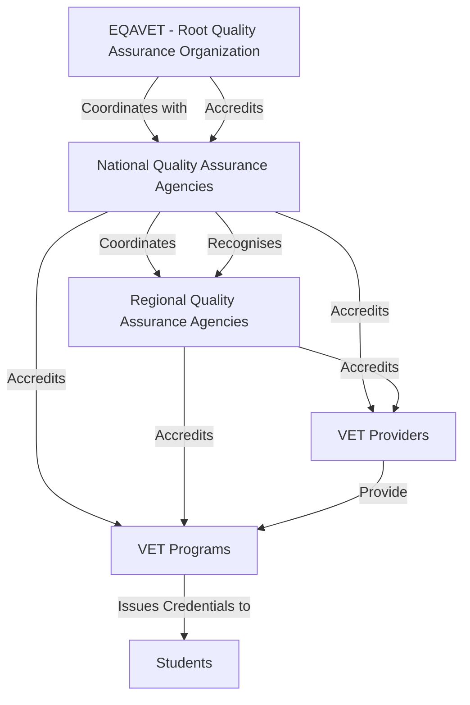
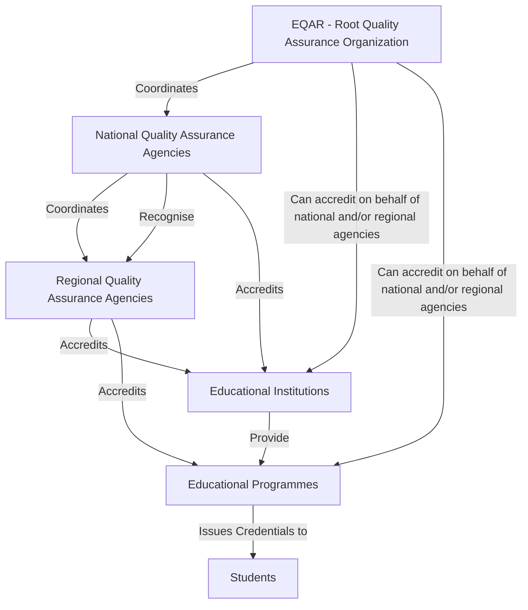

# Educational Quality Assurance Governance

This section provides a business-oriented explanation of how quality assurance (QA) in education is governed across the European Union, with a focus on trust, delegation, and cross-border recognition within the DC4EU framework.

---

## What is quality assurance in education?

Quality assurance refers to the process of ensuring that educational institutions and programmes meet defined standards of excellence, credibility, and transparency. This is essential to maintain the **trustworthiness** of degrees and qualifications — especially when learners move across borders.

---

## Is there a central European authority?

There is **no single European authority** with legal powers over all national QA systems.  
However, there are **European-level organisations** that play a **coordinating and harmonising role**, including:

- **ENQA** (European Association for Quality Assurance in Higher Education)  
- **EQAR** (European Quality Assurance Register for Higher Education)  
- **EQAVET** (for Vocational Education and Training)  
- **CEDEFOP** (for VET-related monitoring and policy)

These bodies do **not impose authority**, but ensure alignment with shared European standards — especially the **European Standards and Guidelines (ESG)** and **EQF**.

---

## How is QA governance structured in the Member States?

Each country defines its own **national QA system**, but most follow a **multi-tier model**:

1. **National-level QA Agency**  
   - Typically recognised by the Ministry of Education or equivalent.  
   - Responsible for accrediting institutions or regional QA bodies.  
   - Example: **ANECA** in Spain.

2. **Regional QA Bodies**  
   - Operate under national authorisation.  
   - Conduct quality reviews of universities or training providers.  
   - Example: **AQU Catalunya** in Catalonia.

3. **Educational Institutions**  
   - May be accredited for:
     - Institutional-level quality
     - Programme-level quality (e.g. per degree)

Each actor in this chain is **formally authorised**, and that authorisation can be captured in a digital, verifiable way through an **Electronic Attestation of Attributes (EAA)**.

## Overview for VET

## Overview for HE

## What are the benefits of this governance model?

- Enables **cross-border recognition** of accreditations  
- Maintains **national autonomy** while aligning with shared EU values  
- Makes it possible to **digitally verify** whether a programme has been quality-assured by a recognised agency  
- Helps learners, employers, and institutions **trust what a diploma represents**

---

## Example in practice

Let’s say a **university in Spain** offers a Master’s in Engineering. Before it can issue diplomas:

1. It must be **quality-assured** by a regional agency (e.g. AQU).
2. AQU must be **recognised** by a national agency (e.g. ANECA).
3. ANECA’s role must be **recognised** at the EU level (e.g. via EQAR listing).

Each of these relationships can be **digitally recorded and verified**, forming a **trust chain** that validates the legitimacy of the qualification.
