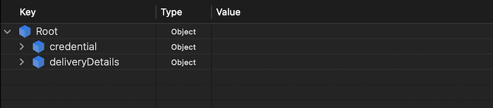
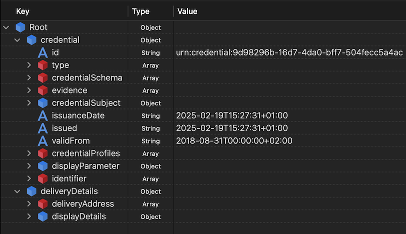

# Sectorial EAA Catalogue for Education and Professional Qualifications

## Overview

This Sectorial Electronic Attestation of Attributes (EAA) Rulebook contains all data models and schemas agreed at the sectorial level for Education and Professional Qualifications. It provides the technical specifications that implement the principles outlined in the [Sectorial Rulebook](../sectorial-rulebook/).

## EAA catalogue governance
For the definition of the EAA catalogue, it is essential to identify, for each entry in the catalogue, the party responsible for its creation and evolution - that is, the 'Attribute schema provider'.
The common thread throughout the entire EAA catalogue is the utilisation of the European Learning Model (ELM v3.2) as a shared ontology.
Given the absence of a central authority in education, yet recognising the necessity to establish this sectoral role, we might consider making an assignment based on competencies, bearing in mind that **DG-EAC** is responsible for Primary, Secondary and Tertiary education, whilst **DG-EMPL** oversees Adult education and TVET. OF course, Member States, as key satkeholders and comptencies' owners, should also be members of such governance.

## EAAs are not Diplómas

EAA is defined as an attestation in electronic form that allows attributes to be authenticated.

It is important to explain and clarify that there is a distinction between the Diploma itself and an EAA of the diploma (for example, in Spain this is legally required to be issued on A3 paper with specific weight and security measures, or, using digital means, the Diploma is stored, curated and preserved in a database record). 
The EAA does not replace the former, but holds equivalent legal value.

## European Learning Model (ELM)

ELM allows educational institutions, employers, learners, and credential-verifying bodies to communicate clearly and effectively about learning achievements and credentials.

Key benefits include:
- Interoperability across different European systems.
- Easier recognition of qualifications.
- Clear communication about learning outcomes and achievements.
- Standardised descriptions for educational credentials.

For further information on ELM, access [European Learning Model information](./elm/elm.md)

## European Digital Credentials for Learning (EDC)

European Digital Credentials for Learning (EDC) are verifiable digital representations of learning achievements, issued by educational institutions to document qualifications such as diplomas, training certificates, and micro-credentials. They are signed with an electronic seal from a trusted institution, ensuring authenticity and security. EDCs can be issued in all EU and Europass languages, facilitating cross-border recognition of qualifications. ​

Key benefits include:

- Enhanced security and authenticity: EDCs are electronically sealed, making them tamper-evident and legally equivalent to paper-based credentials. ​
- Efficient sharing and storage: Learners can store their EDCs securely in their Europass wallet (the "My Library" repository) and share them easily with employers or educational institutions. ​
- Standardized format: EDCs provide a consistent structure for describing learning achievements, promoting interoperability across different European systems. ​
- Support for various learning contexts: They can document formal education, non-formal learning, online courses, and volunteering experiences, among others. ​

For further information on EDC, access [European Digital Credentials for Learning]( https://europass.europa.eu/en/europass-digital-tools/european-digital-credentials-learning)

## EDC and ELM, closely realted but not the same

ELM (European Learning Model) is an ontology or conceptual data model describing learning achievements, qualifications, and educational credentials, covering formal, non-formal, and informal education. It is a general framework describing educational data clearly and consistently.
EDC (European Digital Credential) is an application profile that specifically implements the European Learning Model (ELM) to create digital credentials. EDC uses the concepts and structure defined by ELM, adding technical standards and constraints (e.g., SHACL constraints) to ensure data quality, authenticity, and validity specifically for digital credentialing purposes.
In other words:

- ELM provides the underlying conceptual model.
- EDC applies this model specifically to digital credentials, including concrete implementations, validations, and practical usage aligned closely —but not entirely— with W3C Verifiable Credentials.

## EDC and W3C-VC, inspired by but not equal to

European Digital Credentials (EDC) issued using Online Credential Builder (OCB) provided by DG-EMPL, it's a ELM serialisation inspired by W3C-VC but not fully compliant.

- Top-level structure: EDC credentials, as produced by OCB, uses "credential" instead of putting W3C fields directly at the root.
- Missed issuanceDate / expirationDate
- Missed revocation/suspension (not supported)
- deliveryDetails are linked to especific delivery mechanism used by OBC, it won't be required 

EDC JSON structure (view 1)

EDC JSON structure (view 2)

## European Digital Credentials – W3C Compliant (EDC-W3C)

EDC-W3C represents the European Digital Credentials for Learning (EDC) fully aligned with the W3C Verifiable Credentials Data Model (VCDM), as adopted in the first batch of the Implementing Acts under the European Digital Identity framework.

This enhanced version of EDC ensures full compliance with globally recognised standards for digital credentials, promoting interoperability beyond Europe and supporting secure, verifiable, and privacy-preserving learning achievements.

EDC-W3C is a W3C-VCDM serialisation of the European Learning Model (ELM) provided by DG EMPL (Directorate-General for Employment, Social Affairs and Inclusion).

Key benefits include:
- Global interoperability: Based on W3C-VCDM, EDC-W3C enables seamless cross-border and cross-sector recognition of credentials.
- Full alignment with EU and international digital identity standards: Supporting the vision of the European Digital Identity Wallet.
- Data integrity and privacy: Ensures secure, verifiable credentials while respecting the privacy of credential holders.
- Consistency with the European Learning Model: Structured data remains anchored in ELM while adopting the W3C format.

For further information on EDC-W3C, access:
- [EDC-W3C compliant with W3C-VCDM 1.0](https://code.europa.eu/ebsi/json-schema/-/tree/main/schemas/vcdm1.1/europass/edc) 
- [EDC-W3C compliant with W3C-VCDM 2.0](https://code.europa.eu/ebsi/json-schema/-/tree/main/schemas/vcdm2.0/edc)

## Table with available schemes

| Scope        | Data model name    | Brief explanation |Status/Detailed explanation |Schema URL     | Registry URL |
|-----------------------------|--------------------------|--------|------------------------------------------------------------------------------------|--------------------------------------------------------------------------------------------------------------------------------------------------------|--------------------------------------------------------------------------------------------------------|
| Foundational identity       | PID (Natural Person)     | Person Identification Data (PID) for foundational credentials compliant with eIDAS 2.0 and ARF |Available| [Schema](https://code.europa.eu/ebsi/json-schema/-/tree/main/schemas/vcdm1.1/vid/natural-person)                 | [Registry](https://api-pilot.ebsi.eu/trusted-schemas-registry/v3/schemas/z2bTCgjmBDY5kwNWGL3hfSQUZP6d8AZUnLFXe8coTa3zK) |
| Academic and professional achievements       |  EDC-W3C credential  | European Digital Credential compliant with W3C-VCDM v1.1 credential format based on ELM v3.2 in alignment to 1st batch of implementing acts, supports any type of educational and professional qualifications |[Detailed list below](https://github.com/dc4eu/educational-pilot/tree/main/sectorial-eaa-catalogue#table-with-available-datamodels-based-on-edc-w3c)| [Schema](https://code.europa.eu/ebsi/json-schema/-/tree/main/schemas/vcdm1.1/europass/edc)                        | [Registry](https://api-pilot.ebsi.eu/trusted-schemas-registry/v3/schemas/z5P8ebAhZjuvypiSXSHoba6vstbhTwnLhVuULWKenuiNJ) |
| Non-foundational identity   | EducationalID           | Identifies the natural person in the context of an educational organisation, including national extensions |Available| [Schema](https://code.europa.eu/ebsi/json-schema/-/tree/main/schemas/vcdm1.1/education/verifiable-education-id) | [Registry](https://api-pilot.ebsi.eu/trusted-schemas-registry/v3/schemas/zEmFZquJtANNz7XNE46thRi1E2cAfpQiXVLSBdDgLyfGP) |
| Non-foundational identity   | AllianceID               | Identifies a student or staff member as affiliated with a European university alliance |Available| [Schema](https://code.europa.eu/ebsi/json-schema/-/tree/main/schemas/vcdm1.1/alliance-id)                       | [Registry](https://api-pilot.ebsi.eu/trusted-schemas-registry/v3/schemas/zCHc3ZfYg2871W2WftjLu4QNMQrDzG57oG5pvGoyHcagB) |
| Non-foundational identity   | EuropeanStudentCard | European Student Card for student mobility, based on DG-EAC's service |[LocalSchema](./non-foundational-id/europeanStudentCard.md)| [W3C-VCDM-Schema](./non-foundational-id/europeanStudentCard.md)     | [EBSI Registry](https://api-pilot.ebsi.eu/trusted-schemas-registry/v3/schemas/z3XDm4kDtztE8DzLsVdhfshYvx2upnfLmqHtyVjkaXM1g) |
| Non-foundational identity   | MyAcademicID             | Identity credential for student mobility, based on MyAcademicID and eduGAIN infrastructure |Available| [Schema](https://code.europa.eu/ebsi/json-schema/-/tree/main/schemas/vcdm1.1/multi-uni-pilot/my-academic-id)     | [Registry](https://api-pilot.ebsi.eu/trusted-schemas-registry/v3/schemas/z3XDm4kDtztE8DzLsVdhfshYvx2upnfLmqHtyVjkaXM1g) |
| Non-foundational identity   | ProfessionalID             | Identity credential for , based on  |[LocalSchema](./non-foundational-id/professionalID-schema.md)| [W3C-VCDM-Schema](pending_confirmation_URL)     | [EBSI Registry](https://api-pilot.ebsi.eu/trusted-schemas-registry/v3/schemas/z3XDm4kDtztE8DzLsVdhfshYvx2upnfLmqHtyVjkaXM1g) |
| Non-foundational identity   | DoctorID             | Identity credential for , based on  |[LocalSchema](./non-foundational-id/doctor-id-schema.md)| [W3C-VCDM-Schema](./professional-qualifications/Professional%20ID%20Schema.md)     | [EBSI Registry](https://api-pilot.ebsi.eu/trusted-schemas-registry/v3/schemas/z3XDm4kDtztE8DzLsVdhfshYvx2upnfLmqHtyVjkaXM1g) |
| Non-foundational identity   | EngineerID             | Identity credential for , based on  |[LocalSchema](./non-foundational-id/engineerID-schema.md)| [W3C-VCDM-Schema](https://code.europa.eu/ebsi/json-schema/-/tree/main/schemas/vcdm1.1/multi-uni-pilot/my-academic-id)     | [EBSI Registry](https://api-pilot.ebsi.eu/trusted-schemas-registry/v3/schemas/z3XDm4kDtztE8DzLsVdhfshYvx2upnfLmqHtyVjkaXM1g) |

## Table with available datamodels based on EDC-W3C

| Scope | Data model name | Stablished Acronim (type) | Brief explanation | Status/Detailed explanation | Schema URL | Registry URL | Unsigned credential | Signed Credential |
|-------|----------------|----------------|-------------------|----------------------|------------|--------------|---|---|
| Education | Higher Education European Micro Credentials | HEEUMC | Educational achievement microcredential for | [Higher Education Micro Credential](./formal-education/business/highereducation-microcredential.md) | [LocalSchema](./formal-education/schemes/highereducation-microcredential-scheme.md) | [EBSIRegistry](https://api-pilot.ebsi.eu/trusted-schemas-registry/v3/schemas/zAEUqPUrQVE7yiesF8xUVHYh4AnqjfHFxCv6GhZ3uvjkW) | [HEEUMC unsigned](./formal-education/examples/HigherEducationEuropeanMicroCredential/HigherEducationEuropeanMicroCredential_unsigned.md) | [HEEUMC signed](./formal-education/examples/HigherEducationEuropeanMicroCredential/HigherEducationEuropeanMicroCredential_signed.md) |
| Education | Vocational Educational Training European Micro Credentials | VETEUMC | Educational achievement microcredential for | [Vocational Educational Training Micro Credential](./formal-education/business/vet-microcredential.md) | [LocalSchema](./formal-education/schemes/vet-microcredential-scheme.md) | [EBSIRegistry](https://api-pilot.ebsi.eu/trusted-schemas-registry/v3/schemas/zAEUqPUrQVE7yiesF8xUVHYh4AnqjfHFxCv6GhZ3uvjkW) | [VETEUMC unsigned](./formal-education/examples/VETEuropeanMicroCredential/VETEuropeanMicroCredential_unsigned.md) | [VETEUMC signed](./formal-education/examples/VETEuropeanMicroCredential/VETEuropeanMicroCredential_signed.md) |
| Education | Higher education proof of enrolment | HEPOE| Educational achievement microcredential for | [Higher Education Proof of Enrolment](./formal-education/highereducation-microcredential.md) | [Schema](https://code.europa.eu/ebsi/json-schema/-/tree/main/schemas/vcdm1.1/europass/edc) | [Registry](https://api-pilot.ebsi.eu/trusted-schemas-registry/v3/schemas/zAEUqPUrQVE7yiesF8xUVHYh4AnqjfHFxCv6GhZ3uvjkW) | ||
| Education | Higher education diploma | HED| Educational achievement microcredential for | [Higher education diploma](./formal-education/highereducation-microcredential.md) | [Schema](https://code.europa.eu/ebsi/json-schema/-/tree/main/schemas/vcdm1.1/europass/edc) | [Registry](https://api-pilot.ebsi.eu/trusted-schemas-registry/v3/schemas/zAEUqPUrQVE7yiesF8xUVHYh4AnqjfHFxCv6GhZ3uvjkW) | ||
| Education | Higher education diploma Supplement| HEDS| Educational achievement microcredential for | [Higher education diploma Supplement](./formal-education/highereducation-microcredential.md) | [Schema](https://code.europa.eu/ebsi/json-schema/-/tree/main/schemas/vcdm1.1/europass/edc) | [Registry](https://api-pilot.ebsi.eu/trusted-schemas-registry/v3/schemas/zAEUqPUrQVE7yiesF8xUVHYh4AnqjfHFxCv6GhZ3uvjkW) | ||
| Education | Higher education transcript of records | HETOR| Educational achievement microcredential for | [Higher education transcript of records](./formal-education/highereducation-microcredential.md) | [Schema](https://code.europa.eu/ebsi/json-schema/-/tree/main/schemas/vcdm1.1/europass/edc) | [Registry](https://api-pilot.ebsi.eu/trusted-schemas-registry/v3/schemas/zAEUqPUrQVE7yiesF8xUVHYh4AnqjfHFxCv6GhZ3uvjkW) | ||
| Education | Upper secondary education certificate | USC | Educational achievement microcredential for | [Upper secondary education certificates](./formal-education/highereducation-microcredential.md) | [Schema](https://code.europa.eu/ebsi/json-schema/-/tree/main/schemas/vcdm1.1/europass/edc) | [Registry](https://api-pilot.ebsi.eu/trusted-schemas-registry/v3/schemas/zAEUqPUrQVE7yiesF8xUVHYh4AnqjfHFxCv6GhZ3uvjkW) | ||
| Education | Upper secondary education transcript of records | USTOR | Educational achievement microcredential for | [Upper secondary education transcript of records](./formal-education/highereducation-microcredential.md) | [Schema](https://code.europa.eu/ebsi/json-schema/-/tree/main/schemas/vcdm1.1/europass/edc) | [Registry](https://api-pilot.ebsi.eu/trusted-schemas-registry/v3/schemas/zAEUqPUrQVE7yiesF8xUVHYh4AnqjfHFxCv6GhZ3uvjkW) | ||
| Professional qualifications | Certificate of Professional Suitability | CPS | Professional achievement credential for| Certificate of Professional Suitability | [LocalSchema](./professional-qualifications/CertificateProfessionalSuitability.md) | [EBSI Registry](https://api-pilot.ebsi.eu/trusted-schemas-registry/v3/schemas/zFkbzRiX4Q7vcaMtNpgq7RzkvkhvRTt9KqMHqGWXrGn85) | ||
| Professional qualifications | Accreditatio Medical Training | AMT | Professional achievement credential for| Accreditation Medical Training| [LocalSchema](./professional-qualifications/AccreditationMedicalTraining.md) | [EBSI Registry](https://api-pilot.ebsi.eu/trusted-schemas-registry/v3/schemas/zFkbzRiX4Q7vcaMtNpgq7RzkvkhvRTt9KqMHqGWXrGn85) | ||
| Professional qualifications | Continous Professional Development | CPD | Professional achievement credential for| Continous Professional Development| [LocalSchema](./professional-qualifications/ContinuousProfessionalDevelopment.md) | [EBSI Registry](https://api-pilot.ebsi.eu/trusted-schemas-registry/v3/schemas/zFkbzRiX4Q7vcaMtNpgq7RzkvkhvRTt9KqMHqGWXrGn85) | ||
| Professional qualifications | Professional Training Certificate | PTC | Professional achievement credential for| Professional Training Certificate| [LocalSchema](./professional-qualifications/ProfessionalTrainingCertificate.md) | [EBSI Registry](https://api-pilot.ebsi.eu/trusted-schemas-registry/v3/schemas/zFkbzRiX4Q7vcaMtNpgq7RzkvkhvRTt9KqMHqGWXrGn85) | ||

## Detailed information per category or type

The EAA Rulebook is organised into the following categories:

### [Foundational Identity](./foundational-identity/)

### [Formal Education](./formal-education/)

### [Quality Assurance Regimes](./quality-assurance/)

### [Non-foundational ID](./non-foundational-id/)

## [Schemes for Data Models](./schemes-data-models/)

## Implementation

These data models and schemas are designed to be implemented through the technical components described in the [Toolkits](../toolkits/) section. They support the workflows and use cases outlined there while ensuring compliance with the principles established in the [Sectorial Rulebook](../sectorial-rulebook/).

## Version Control

All data models and schemas in this rulebook are versioned to allow for backward compatibility as the framework evolves. Implementers should always check for the latest versions while maintaining support for existing credentials.
