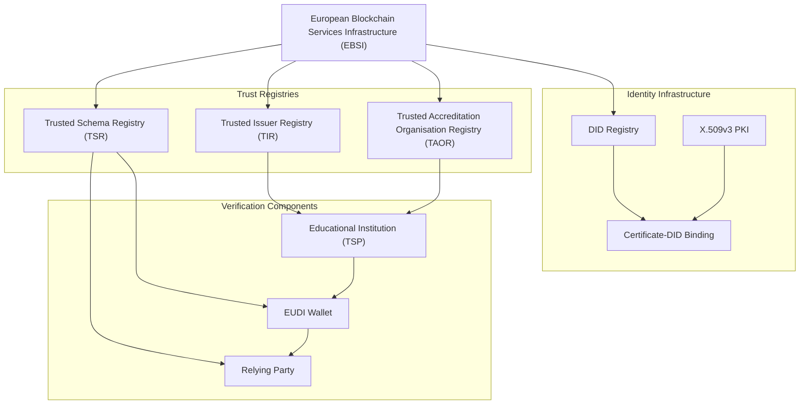
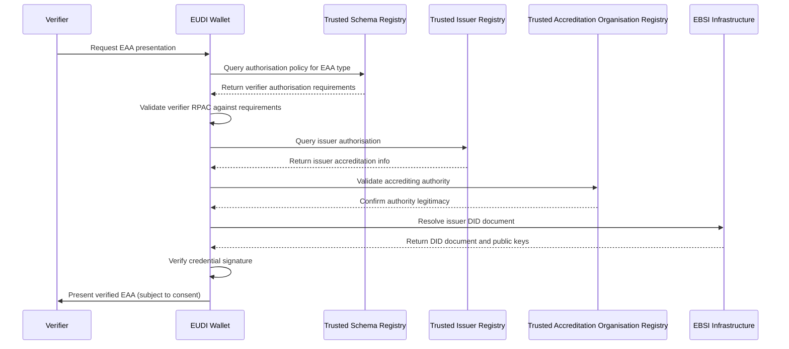

# Annex B: Trust Registry Specifications (TIR, TAOR, TSR)

## Introduction

This annex defines the technical specifications for the three critical trust registries that underpin the eIDAS2-compliant sectoral EAA catalogue: the Trusted Issuer Registry (TIR), Trusted Accreditation Organisation Registry (TAOR), and Trusted Schema Registry (TSR). These registries work together to provide a comprehensive trust infrastructure that enables automated verification of issuer authorisation, accreditation chains, and policy enforcement.

## B.1 Registry Architecture Overview

### B.1.1 Trust Infrastructure Layers

The trust registry architecture operates across multiple layers to provide comprehensive verification capabilities:



### B.1.2 Registry Interaction Model

The registries work together to provide end-to-end trust verification:

1. **TAOR** validates which organisations can accredit educational institutions
2. **TIR** registers accredited institutions and their authorised credential scope
3. **TSR** defines which credential types each institution can issue and who can verify them

## B.2 Trusted Issuer Registry (TIR) Specification

### B.2.1 Purpose and Scope

The Trusted Issuer Registry (TIR) serves as the authoritative source for determining which entities are authorised to issue specific types of Electronic Attestations of Attributes (EAAs). It maps institutional Decentralised Identifiers (DIDs) to their authorised credential types and provides verifiable proof of accreditation status.

### B.2.2 Data Structure

#### B.2.2.1 TIR Entry Schema

```json
{
  "$schema": "https://json-schema.org/draft/2020-12/schema",
  "$id": "https://schemas.dc4eu.eu/registries/tir/v1.0/entry.json",
  "title": "Trusted Issuer Registry Entry",
  "type": "object",
  "properties": {
    "issuerId": {
      "type": "string",
      "format": "uri",
      "description": "DID of the authorised issuer",
      "pattern": "^did:(ebsi|web|key):"
    },
    "legalIdentity": {
      "type": "object",
      "properties": {
        "legalName": {
          "type": "object",
          "patternProperties": {
            "^[a-z]{2}$": {"type": "string"}
          }
        },
        "legalIdentifier": {
          "type": "string",
          "description": "Legal entity identifier (LEI, VAT, national registration)"
        },
        "x509Thumbprint": {
          "type": "string",
          "description": "x5t#S256 thumbprint binding X.509v3 certificate to DID"
        }
      },
      "required": ["legalName", "legalIdentifier"]
    },
    "accreditationInfo": {
      "type": "object",
      "properties": {
        "accreditingAuthority": {
          "type": "string",
          "format": "uri",
          "description": "DID of the accrediting authority (must be in TAOR)"
        },
        "accreditationScope": {
          "type": "array",
          "items": {
            "type": "object",
            "properties": {
              "credentialType": {
                "type": "string",
                "description": "EAA type identifier (e.g., EUHED, EUVETMC)"
              },
              "subjectAreas": {
                "type": "array",
                "items": {"type": "string"},
                "description": "Authorised subject areas or disciplines"
              },
              "eqfLevels": {
                "type": "array",
                "items": {"type": "integer", "minimum": 1, "maximum": 8},
                "description": "Authorised EQF levels"
              },
              "validFrom": {
                "type": "string",
                "format": "date-time"
              },
              "validUntil": {
                "type": "string",
                "format": "date-time"
              }
            },
            "required": ["credentialType", "validFrom"]
          }
        }
      },
      "required": ["accreditingAuthority", "accreditationScope"]
    },
    "technicalMetadata": {
      "type": "object",
      "properties": {
        "statusListEndpoint": {
          "type": "string",
          "format": "uri",
          "description": "StatusList2021 endpoint for revocation checking"
        },
        "supportedSignatureTypes": {
          "type": "array",
          "items": {"type": "string"},
          "description": "Supported signature algorithms"
        },
        "didDocument": {
          "type": "string",
          "format": "uri",
          "description": "URL to resolve DID document"
        }
      }
    },
    "registrationMetadata": {
      "type": "object",
      "properties": {
        "registeredBy": {
          "type": "string",
          "format": "uri",
          "description": "DID of the registering authority"
        },
        "registrationDate": {
          "type": "string",
          "format": "date-time"
        },
        "lastUpdated": {
          "type": "string",
          "format": "date-time"
        },
        "status": {
          "type": "string",
          "enum": ["active", "suspended", "revoked"]
        }
      },
      "required": ["registeredBy", "registrationDate", "status"]
    }
  },
  "required": ["issuerId", "legalIdentity", "accreditationInfo", "registrationMetadata"]
}
```

#### B.2.2.2 Example TIR Entry

```json
{
  "issuerId": "did:ebsi:z2F3kJ8NmRVyE1bQzYc7XvL9pT6sH4dM",
  "legalIdentity": {
    "legalName": {
      "en": "University of Barcelona",
      "es": "Universidad de Barcelona",
      "ca": "Universitat de Barcelona"
    },
    "legalIdentifier": "Q0818001A",
    "x509Thumbprint": "7d865e959b2466918c9863afca942d0fb89d7c9ac0c99bafc3749504ded97730"
  },
  "accreditationInfo": {
    "accreditingAuthority": "did:ebsi:z4M9N2pK8LvR3tY1sW6dF7eH5qG8jX0c",
    "accreditationScope": [
      {
        "credentialType": "EUHED",
        "subjectAreas": ["computer_science", "engineering", "business_administration"],
        "eqfLevels": [6, 7, 8],
        "validFrom": "2024-01-01T00:00:00Z",
        "validUntil": "2030-12-31T23:59:59Z"
      },
      {
        "credentialType": "EUHEDS",
        "subjectAreas": ["computer_science", "engineering", "business_administration"],
        "eqfLevels": [6, 7, 8],
        "validFrom": "2024-01-01T00:00:00Z",
        "validUntil": "2030-12-31T23:59:59Z"
      }
    ]
  },
  "technicalMetadata": {
    "statusListEndpoint": "https://status.ub.edu/credentials/2024",
    "supportedSignatureTypes": ["Ed25519Signature2020", "EcdsaSecp256k1Signature2019"],
    "didDocument": "https://resolver.ebsi.eu/1.0/identifiers/did:ebsi:z2F3kJ8NmRVyE1bQzYc7XvL9pT6sH4dM"
  },
  "registrationMetadata": {
    "registeredBy": "did:ebsi:zAQN_ES_quality_assurance_authority",
    "registrationDate": "2024-01-15T10:30:00Z",
    "lastUpdated": "2024-07-01T14:22:00Z",
    "status": "active"
  }
}
```

### B.2.3 TIR Operations

#### B.2.3.1 Registration Process

1. **Legal Identity Verification**: Institution provides legal documentation and obtains X.509v3 certificate
2. **DID Registration**: Institution registers DID in EBSI and binds to X.509v3 certificate
3. **Accreditation Verification**: TAOR-registered accrediting authority validates institutional scope
4. **TIR Entry Creation**: Authorised registry operator creates TIR entry with validated information
5. **Publication**: Entry is published to EBSI for global verification

#### B.2.3.2 Query Interface

```http
GET /tir/v1/issuers/{did}
Host: api.ebsi.eu
Accept: application/json
```

Response:
```json
{
  "issuer": {
    "issuerId": "did:ebsi:z2F3kJ8NmRVyE1bQzYc7XvL9pT6sH4dM",
    "authorisedCredentials": ["EUHED", "EUHEDS"],
    "status": "active",
    "lastVerified": "2024-08-14T12:00:00Z"
  }
}
```

## B.3 Trusted Accreditation Organisation Registry (TAOR) Specification

### B.3.1 Purpose and Scope

The Trusted Accreditation Organisation Registry (TAOR) maintains an authoritative list of entities that are permitted to accredit educational institutions within specific domains and jurisdictions. It provides the foundational trust layer that validates the authority chains used in the TIR.

### B.3.2 Data Structure

#### B.3.2.1 TAOR Entry Schema

```json
{
  "$schema": "https://json-schema.org/draft/2020-12/schema",
  "$id": "https://schemas.dc4eu.eu/registries/taor/v1.0/entry.json",
  "title": "Trusted Accreditation Organisation Registry Entry",
  "type": "object",
  "properties": {
    "accreditationAuthorityId": {
      "type": "string",
      "format": "uri",
      "description": "DID of the accreditation authority"
    },
    "legalIdentity": {
      "type": "object",
      "properties": {
        "officialName": {
          "type": "object",
          "patternProperties": {
            "^[a-z]{2}$": {"type": "string"}
          }
        },
        "jurisdiction": {
          "type": "array",
          "items": {
            "type": "string",
            "pattern": "^[A-Z]{2}$",
            "description": "ISO 3166-1 alpha-2 country codes"
          }
        },
        "legalBasis": {
          "type": "string",
          "description": "Legal foundation for accreditation authority"
        }
      },
      "required": ["officialName", "jurisdiction"]
    },
    "accreditationScope": {
      "type": "object",
      "properties": {
        "educationSectors": {
          "type": "array",
          "items": {
            "type": "string",
            "enum": ["higher_education", "vocational_education", "secondary_education", "professional_qualifications"]
          }
        },
        "credentialTypes": {
          "type": "array",
          "items": {"type": "string"},
          "description": "EAA types this authority can accredit for"
        },
        "geographicScope": {
          "type": "array",
          "items": {"type": "string"},
          "description": "Geographic regions where authority is recognised"
        }
      },
      "required": ["educationSectors", "credentialTypes"]
    },
    "qualityFramework": {
      "type": "object",
      "properties": {
        "frameworkName": {
          "type": "string",
          "description": "Name of quality assurance framework"
        },
        "esrRegistration": {
          "type": "string",
          "description": "European Quality Assurance Register (EQAR) registration"
        },
        "standards": {
          "type": "array",
          "items": {"type": "string"},
          "description": "Quality standards and guidelines applied"
        }
      }
    },
    "operationalMetadata": {
      "type": "object",
      "properties": {
        "contactPoint": {
          "type": "object",
          "properties": {
            "email": {"type": "string", "format": "email"},
            "website": {"type": "string", "format": "uri"},
            "address": {"type": "string"}
          }
        },
        "accreditationProcess": {
          "type": "string",
          "format": "uri",
          "description": "URL to accreditation process documentation"
        }
      }
    },
    "registrationMetadata": {
      "type": "object",
      "properties": {
        "recognisedBy": {
          "type": "string",
          "format": "uri",
          "description": "DID of the recognising authority (typically national ministry)"
        },
        "recognitionDate": {
          "type": "string",
          "format": "date-time"
        },
        "validUntil": {
          "type": "string",
          "format": "date-time"
        },
        "status": {
          "type": "string",
          "enum": ["active", "suspended", "revoked"]
        }
      },
      "required": ["recognisedBy", "recognitionDate", "status"]
    }
  },
  "required": ["accreditationAuthorityId", "legalIdentity", "accreditationScope", "registrationMetadata"]
}
```

#### B.3.2.2 Example TAOR Entry

```json
{
  "accreditationAuthorityId": "did:ebsi:z4M9N2pK8LvR3tY1sW6dF7eH5qG8jX0c",
  "legalIdentity": {
    "officialName": {
      "en": "Spanish National Quality Assurance Agency for Universities",
      "es": "Agencia Nacional de Evaluación de la Calidad y Acreditación"
    },
    "jurisdiction": ["ES"],
    "legalBasis": "Royal Decree 1393/2007, modified by Royal Decree 99/2011"
  },
  "accreditationScope": {
    "educationSectors": ["higher_education"],
    "credentialTypes": ["EUHED", "EUHEDS", "EUHETOR", "EUHEPOE"],
    "geographicScope": ["ES", "EU"]
  },
  "qualityFramework": {
    "frameworkName": "Spanish University Quality Assurance System",
    "esrRegistration": "EQAR-A144",
    "standards": ["ESG 2015", "ENQA Guidelines", "Spanish Quality Framework"]
  },
  "operationalMetadata": {
    "contactPoint": {
      "email": "info@aneca.es",
      "website": "https://www.aneca.es",
      "address": "Calle Donostiarra, 82, 28027 Madrid, Spain"
    },
    "accreditationProcess": "https://www.aneca.es/en/Procedures"
  },
  "registrationMetadata": {
    "recognisedBy": "did:ebsi:zESP_ministry_education",
    "recognitionDate": "2023-01-01T00:00:00Z",
    "validUntil": "2028-12-31T23:59:59Z",
    "status": "active"
  }
}
```

## B.4 Trusted Schema Registry (TSR) Specification

### B.4.1 Purpose and Scope

The Trusted Schema Registry (TSR) serves as the central repository for credential schemas, disclosure policies, and terms of reference for all EAA types. It provides the authoritative source for determining which entities can issue specific credential types and which verifiers are authorised to request them.

### B.4.2 Data Structure

#### B.4.2.1 TSR Entry Schema

```json
{
  "$schema": "https://json-schema.org/draft/2020-12/schema",
  "$id": "https://schemas.dc4eu.eu/registries/tsr/v1.0/entry.json",
  "title": "Trusted Schema Registry Entry",
  "type": "object",
  "properties": {
    "schemaId": {
      "type": "string",
      "format": "uri",
      "description": "Unique identifier for the schema"
    },
    "eaaMetadata": {
      "type": "object",
      "properties": {
        "eaaId": {
          "type": "string",
          "description": "EAA type identifier (e.g., EUHED, EUVETMC)"
        },
        "title": {
          "type": "object",
          "patternProperties": {
            "^[a-z]{2}$": {"type": "string"}
          }
        },
        "description": {
          "type": "object",
          "patternProperties": {
            "^[a-z]{2}$": {"type": "string"}
          }
        },
        "credentialType": {
          "type": "string",
          "enum": ["VerifiableCredential", "VerifiableAttestation", "QEAA"]
        },
        "sectoralScope": {
          "type": "string",
          "enum": ["FormalEducation", "ProfessionalQualifications", "NonFoundationalID"]
        }
      },
      "required": ["eaaId", "title", "credentialType", "sectoralScope"]
    },
    "schemaSpecification": {
      "type": "object",
      "properties": {
        "jsonLdSchema": {
          "type": "string",
          "format": "uri",
          "description": "URL to JSON-LD schema definition"
        },
        "w3cVcdmVersion": {
          "type": "string",
          "description": "W3C VCDM version compatibility"
        },
        "elmVersion": {
          "type": "string",
          "description": "ELM version compatibility"
        },
        "requiredContext": {
          "type": "array",
          "items": {"type": "string", "format": "uri"},
          "description": "Required @context URIs"
        }
      },
      "required": ["jsonLdSchema", "w3cVcdmVersion"]
    },
    "authorisationPolicy": {
      "type": "object",
      "properties": {
        "authorisedIssuers": {
          "type": "object",
          "properties": {
            "inclusionCriteria": {
              "type": "object",
              "properties": {
                "taorAccredited": {"type": "boolean"},
                "requiredAccreditationScope": {
                  "type": "array",
                  "items": {"type": "string"}
                },
                "minimumEqfLevel": {"type": "integer"},
                "maximumEqfLevel": {"type": "integer"}
              }
            },
            "exclusionCriteria": {
              "type": "object",
              "properties": {
                "suspendedIssuers": {
                  "type": "array",
                  "items": {"type": "string", "format": "uri"}
                }
              }
            }
          }
        },
        "authorisedVerifiers": {
          "type": "object",
          "properties": {
            "rpacRequired": {"type": "boolean"},
            "authorisedRoles": {
              "type": "array",
              "items": {"type": "string"}
            },
            "geographicRestrictions": {
              "type": "array",
              "items": {"type": "string"}
            }
          }
        }
      }
    },
    "disclosurePolicy": {
      "type": "object",
      "properties": {
        "policyDocument": {
          "type": "string",
          "format": "uri",
          "description": "Machine-readable disclosure policy"
        },
        "presentationConstraints": {
          "type": "object",
          "properties": {
            "selectiveDisclosure": {"type": "boolean"},
            "minimumDisclosure": {
              "type": "array",
              "items": {"type": "string"}
            },
            "prohibitedDisclosure": {
              "type": "array",
              "items": {"type": "string"}
            }
          }
        },
        "consentRequirements": {
          "type": "object",
          "properties": {
            "explicitConsent": {"type": "boolean"},
            "granularConsent": {"type": "boolean"},
            "consentPurposes": {
              "type": "array",
              "items": {"type": "string"}
            }
          }
        }
      },
      "required": ["policyDocument"]
    },
    "termsOfReference": {
      "type": "object",
      "properties": {
        "documentUri": {
          "type": "string",
          "format": "uri",
          "description": "JSON document with usage terms and constraints"
        },
        "usagePurposes": {
          "type": "array",
          "items": {"type": "string"}
        },
        "presentationRules": {
          "type": "array",
          "items": {"type": "string"}
        },
        "legalFramework": {
          "type": "string",
          "description": "Applicable legal framework"
        }
      },
      "required": ["documentUri"]
    },
    "technicalMetadata": {
      "type": "object",
      "properties": {
        "revocationSupport": {
          "type": "object",
          "properties": {
            "method": {
              "type": "string",
              "enum": ["StatusList2021", "RevocationList2020"]
            },
            "suspensionSupported": {"type": "boolean"}
          }
        },
        "bindingRequirements": {
          "type": "object",
          "properties": {
            "proofOfPossession": {"type": "boolean"},
            "cryptographicBinding": {"type": "boolean"}
          }
        },
        "expiryManagement": {
          "type": "object",
          "properties": {
            "type": {
              "type": "string",
              "enum": ["static", "dynamic", "perpetual"]
            },
            "defaultValidity": {"type": "string"}
          }
        }
      }
    },
    "registrationMetadata": {
      "type": "object",
      "properties": {
        "publishedBy": {
          "type": "string",
          "format": "uri",
          "description": "DID of publishing authority"
        },
        "publicationDate": {
          "type": "string",
          "format": "date-time"
        },
        "version": {
          "type": "string",
          "description": "Schema version"
        },
        "status": {
          "type": "string",
          "enum": ["active", "deprecated", "superseded"]
        }
      },
      "required": ["publishedBy", "publicationDate", "version", "status"]
    }
  },
  "required": ["schemaId", "eaaMetadata", "schemaSpecification", "authorisationPolicy", "registrationMetadata"]
}
```

## B.5 Registry Integration and Verification Workflow

### B.5.1 Trust Chain Validation Process

The three registries work together to provide comprehensive trust chain validation:



### B.5.2 Automated Compliance Checking

The registry system enables automated compliance checking at multiple levels:

#### B.5.2.1 Issuer Validation
- TAOR lookup confirms accrediting authority legitimacy
- TIR lookup confirms institution's authorisation scope
- Real-time status checking prevents use of suspended/revoked issuers

#### B.5.2.2 Verifier Authorisation
- TSR policy lookup determines required verifier credentials
- RPAC validation confirms verifier identity and entitlements
- Geographic and sectoral restrictions are automatically enforced

#### B.5.2.3 Policy Enforcement
- Machine-readable policies enable automated decision-making
- Selective disclosure rules are enforced by wallet software
- Consent requirements are validated before credential presentation

## B.6 Implementation Guidelines

### B.6.1 Registry Deployment Architecture

#### B.6.1.1 High Availability Requirements

All registries must provide:
- 99.9% uptime availability
- Geographic distribution across multiple EU regions
- Real-time synchronisation across registry nodes
- Comprehensive backup and disaster recovery procedures

#### B.6.1.2 Performance Specifications

- Query response time: < 100ms for 95% of requests
- Concurrent query capacity: > 10,000 requests per second
- Data consistency: eventual consistency within 30 seconds
- API rate limiting: 1000 requests per minute per authenticated client

### B.6.2 Security and Privacy Considerations

#### B.6.2.1 Data Protection

- Personal data minimisation in all registry entries
- GDPR-compliant data retention policies
- Pseudonymisation of institutional identifiers where possible
- Comprehensive audit logging for all registry operations

#### B.6.2.2 Access Control

- Role-based access control for registry administration
- API authentication using qualified certificates or DIDs
- Rate limiting and abuse prevention mechanisms
- Comprehensive monitoring and alerting systems

### B.6.3 Governance and Maintenance

#### B.6.3.1 Registry Governance Framework

- Multi-stakeholder governance boards for each registry
- Regular review and update cycles for registry policies
- Transparent dispute resolution procedures
- Community feedback and consultation processes

#### B.6.3.2 Update and Versioning Procedures

- Semantic versioning for all registry schemas
- Backward compatibility preservation for major versions
- Deprecation notices with minimum 12-month notice periods
- Automated migration tools for schema updates

---

**Note**: This specification is maintained as a living document. For current API documentation, operational status, and implementation guidance, refer to the [EBSI Documentation Portal](https://api-pilot.ebsi.eu/docs) and the [DC4EU Registry Implementation Guide](https://schemas.dc4eu.eu/registries).