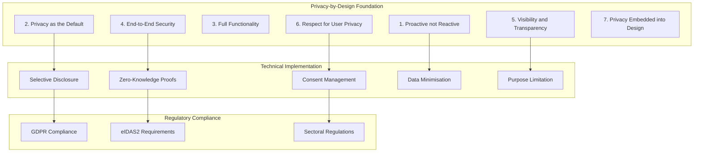
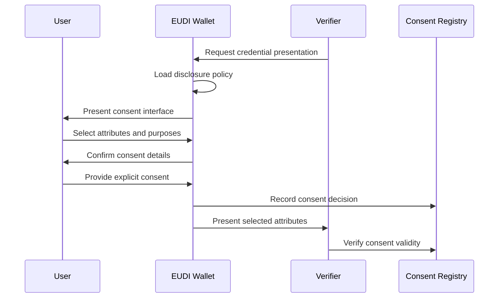

# Annex C: Privacy and Disclosure Policies

## Introduction

This annex defines the comprehensive privacy and disclosure policy framework for Electronic Attestations of Attributes (EAAs) within the DC4EU sectoral catalogue. The framework ensures compliance with GDPR, eIDAS2 requirements, and privacy-by-design principles whilst enabling flexible, user-controlled information sharing for legitimate verification purposes.

## C.1 Privacy Framework Overview

### C.1.1 Privacy-by-Design Principles

The privacy framework implements the following core principles throughout the EAA lifecycle:



### C.1.2 Legal Framework Integration

The privacy framework operates within multiple overlapping legal contexts:

- **GDPR (General Data Protection Regulation)**: Primary data protection framework
- **eIDAS2 Regulation**: Electronic identity and trust services requirements
- **Sectoral Legislation**: Education-specific privacy requirements
- **National Privacy Laws**: Member state-specific privacy protections

## C.2 Disclosure Policy Architecture

### C.2.1 Multi-Level Policy Framework

The disclosure policy architecture operates at three distinct levels:

#### C.2.1.1 Catalogue-Level Policies

Global policies applied to all credentials of a specific type:

```json
{
  "$schema": "https://schemas.dc4eu.eu/privacy/v1.0/disclosure-policy.json",
  "$id": "https://policies.dc4eu.eu/formal-education/euhed/v1.0/disclosure-policy.json",
  "title": "EUHED Disclosure Policy",
  "eaaType": "EUHED",
  "confidentialityLevel": "restricted",
  "defaultDisclosureLevel": "minimal",
  "globalRestrictions": {
    "minimumAgeVerification": true,
    "crossBorderLimitations": [],
    "sectoralRestrictions": ["commercial_marketing", "profiling"]
  },
  "mandatoryDisclosures": {
    "authentication": ["credentialSubject.id", "issuer.id", "issuanceDate"],
    "verification": ["credentialSubject.familyName", "credentialSubject.givenName", "hasClaim.title"]
  },
  "prohibitedDisclosures": {
    "commercial": ["hasClaim.grades", "hasClaim.detailedAssessment"],
    "profiling": ["credentialSubject.dateOfBirth", "hasClaim.institutionDetails"]
  }
}
```

#### C.2.1.2 Instance-Level Policies

Specific policies embedded within individual credentials:

```json
{
  "disclosurePolicy": {
    "id": "urn:policy:euhed-123456",
    "type": "DisclosurePolicy",
    "restrictedAttributes": ["grades", "personalDetails"],
    "purposeLimitations": ["academic_recognition", "employment_verification"],
    "geographicLimitations": ["EU", "EEA"],
    "verifierRequirements": {
      "minimumTrustLevel": "qualified",
      "requiredAuthorisation": ["VerifierAuthorisation"],
      "sectoralLimitations": ["education", "employment"]
    }
  }
}
```

#### C.2.1.3 Runtime Presentation Policies

Dynamic policies enforced during credential presentation:

```json
{
  "$schema": "https://schemas.dc4eu.eu/privacy/v1.0/presentation-policy.json",
  "presentationPolicy": {
    "id": "urn:policy:presentation-euhed-employer",
    "type": "PresentationPolicy",
    "verifierValidation": {
      "requiredCredentials": [
        {
          "type": "VerifierAuthorisation",
          "constraints": {
            "purpose": "employment_verification",
            "validUntil": "future"
          }
        }
      ]
    },
    "disclosureRules": {
      "conditional": [
        {
          "condition": "verifier.sector == 'employment'",
          "allowedAttributes": ["degreeTitle", "institutionName", "graduationDate"],
          "prohibitedAttributes": ["grades", "courseDetails", "personalNotes"]
        }
      ]
    },
    "consentRequirements": {
      "explicitConsent": true,
      "granularSelection": true,
      "purposeDeclaration": true
    }
  }
}
```

### C.2.2 Selective Disclosure Mechanisms

#### C.2.2.1 Attribute-Level Disclosure

Technical implementation of granular attribute control:

```json
{
  "selectiveDisclosureCapabilities": {
    "supportedMethods": ["SD-JWT", "BBS+", "AnonCreds"],
    "attributeGranularity": "field-level",
    "predicateSupport": true,
    "linkabilityProtection": true
  },
  "disclosureMatrix": {
    "credentialSubject": {
      "id": {"level": "always", "privacy": "pseudonymous"},
      "givenName": {"level": "restricted", "privacy": "identifiable"},
      "familyName": {"level": "restricted", "privacy": "identifiable"},
      "dateOfBirth": {"level": "confidential", "privacy": "sensitive"}
    },
    "hasClaim": {
      "type": {"level": "public", "privacy": "non-personal"},
      "title": {"level": "restricted", "privacy": "non-personal"},
      "grades": {"level": "confidential", "privacy": "sensitive"},
      "awardedBy": {"level": "public", "privacy": "non-personal"}
    }
  }
}
```

#### C.2.2.2 Zero-Knowledge Proof Integration

Advanced privacy-preserving verification capabilities:

```json
{
  "zeroKnowledgeProofSupport": {
    "supportedSchemes": ["zk-SNARKs", "zk-STARKs", "Bulletproofs"],
    "predicateTypes": [
      "range_proof",
      "membership_proof", 
      "inequality_proof",
      "set_membership"
    ],
    "examples": [
      {
        "predicate": "age_over_18",
        "description": "Prove holder is over 18 without revealing exact age",
        "implementation": "range_proof"
      },
      {
        "predicate": "qualification_level_minimum",
        "description": "Prove qualification meets minimum level without revealing exact qualification",
        "implementation": "inequality_proof"
      }
    ]
  }
}
```

## C.3 Consent Management Framework

### C.3.1 Granular Consent Architecture

#### C.3.1.1 Multi-Dimensional Consent Model

The consent framework operates across multiple dimensions:

```json
{
  "consentModel": {
    "dimensions": [
      {
        "name": "attribute_selection",
        "description": "Which specific attributes to share",
        "granularity": "field-level",
        "userControl": "mandatory"
      },
      {
        "name": "purpose_limitation",
        "description": "Specific purposes for which data may be used",
        "granularity": "purpose-specific",
        "userControl": "mandatory"
      },
      {
        "name": "temporal_limitation",
        "description": "Time period for which consent is valid",
        "granularity": "session-level",
        "userControl": "optional"
      },
      {
        "name": "verifier_limitation",
        "description": "Specific verifiers authorised to access data",
        "granularity": "verifier-specific",
        "userControl": "optional"
      }
    ]
  }
}
```

#### C.3.1.2 Consent Record Structure

Comprehensive consent documentation:

```json
{
  "$schema": "https://schemas.dc4eu.eu/privacy/v1.0/consent-record.json",
  "consentRecord": {
    "id": "urn:consent:123e4567-e89b-12d3-a456-426614174000",
    "timestamp": "2024-08-14T12:00:00Z",
    "holder": "did:ebsi:1234567890abcdef",
    "verifier": "did:ebsi:0987654321fedcba",
    "credentialId": "urn:credential:euhed-987654321",
    "consentDetails": {
      "sharedAttributes": [
        "credentialSubject.givenName",
        "credentialSubject.familyName",
        "hasClaim.title",
        "hasClaim.awardedBy.legalName"
      ],
      "consentPurpose": "employment_verification",
      "validityPeriod": {
        "from": "2024-08-14T12:00:00Z",
        "until": "2024-08-14T18:00:00Z"
      },
      "additionalTerms": {
        "noOnwardSharing": true,
        "deleteAfterVerification": true,
        "auditTrailRequired": true
      }
    },
    "legalBasis": "GDPR Art. 6(1)(a) - Consent",
    "withdrawalMechanism": "https://wallet.example.eu/consent/withdraw/123e4567-e89b-12d3-a456-426614174000",
    "signature": {
      "type": "Ed25519Signature2020",
      "created": "2024-08-14T12:00:00Z",
      "verificationMethod": "did:ebsi:1234567890abcdef#key-1",
      "proofValue": "z3MvGX7...signature..."
    }
  }
}
```

### C.3.2 Consent Lifecycle Management

#### C.3.2.1 Consent Collection Process

Standardised consent collection workflow:



#### C.3.2.2 Consent Withdrawal Mechanisms

Technical implementation of right to withdraw consent:

```json
{
  "consentWithdrawal": {
    "mechanisms": [
      {
        "type": "wallet_interface",
        "description": "Direct withdrawal through wallet UI",
        "effectTime": "immediate",
        "notificationMethod": "automatic"
      },
      {
        "type": "consent_registry",
        "description": "Withdrawal through centralised consent registry",
        "effectTime": "near_realtime",
        "notificationMethod": "webhook"
      },
      {
        "type": "verifier_interface",
        "description": "Withdrawal through verifier's system",
        "effectTime": "system_dependent",
        "notificationMethod": "manual"
      }
    ],
    "withdrawalRecord": {
      "id": "urn:withdrawal:456e7890-f12c-34d5-b678-901234567890",
      "originalConsentId": "urn:consent:123e4567-e89b-12d3-a456-426614174000",
      "withdrawalTimestamp": "2024-08-14T15:30:00Z",
      "reason": "no_longer_needed",
      "effectiveImmediate": true,
      "verifierNotification": {
        "sent": true,
        "timestamp": "2024-08-14T15:30:05Z",
        "method": "webhook"
      }
    }
  }
}
```

## C.4 Verifier Authorisation and Access Control

### C.4.1 Verifier Authorisation Framework

#### C.4.1.1 Verifier Authorisation Credential

Standard structure for verifier authorisation:

```json
{
  "@context": [
    "https://www.w3.org/2018/credentials/v1",
    "https://schemas.dc4eu.eu/verifier-authorisation/v1.0/context.jsonld"
  ],
  "type": ["VerifiableCredential", "VerifierAuthorisation"],
  "issuer": "did:ebsi:authorising-authority-123",
  "issuanceDate": "2024-01-01T00:00:00Z",
  "expirationDate": "2025-12-31T23:59:59Z",
  "credentialSubject": {
    "id": "did:ebsi:verifier-organisation-456",
    "type": "VerifierOrganisation",
    "legalName": {"en": "Example Employment Agency"},
    "authorisedPurposes": [
      "employment_verification",
      "professional_qualification_check"
    ],
    "permissions": {
      "type": "RequestPolicy",
      "inputDescriptors": [
        {
          "id": "degree_verification",
          "schema": "https://schemas.dc4eu.eu/formal-education/euhed/v1.0/schema.json",
          "constraints": {
            "fields": [
              {
                "path": "$.credentialSubject.hasClaim.title",
                "purpose": "verify_qualification_title"
              },
              {
                "path": "$.credentialSubject.hasClaim.awardedBy.legalName",
                "purpose": "verify_issuing_institution"
              }
            ]
          }
        }
      ],
      "geographicScope": ["EU", "EEA"],
      "temporalScope": {
        "validFrom": "2024-01-01T00:00:00Z",
        "validUntil": "2025-12-31T23:59:59Z"
      }
    },
    "limitRootTao": ["did:ebsi:employment-authority-root"],
    "complianceFramework": {
      "gdprCompliant": true,
      "dataProtectionOfficer": "dpo@example-agency.eu",
      "privacyPolicyUrl": "https://example-agency.eu/privacy"
    }
  }
}
```

#### C.4.1.2 Real-Time Authorisation Validation

Automated verification of verifier entitlements:

```json
{
  "authorisationValidation": {
    "validationSteps": [
      {
        "step": "verifier_identity",
        "method": "did_resolution",
        "required": true
      },
      {
        "step": "authorisation_credential",
        "method": "credential_verification",
        "required": true
      },
      {
        "step": "purpose_alignment",
        "method": "policy_matching",
        "required": true
      },
      {
        "step": "scope_validation",
        "method": "constraint_checking",
        "required": true
      }
    ],
    "failureHandling": {
      "unauthorisedVerifier": "reject_request",
      "expiredAuthorisation": "reject_request",
      "scopeViolation": "limit_disclosure",
      "invalidPurpose": "reject_request"
    }
  }
}
```

### C.4.2 Purpose Limitation and Data Minimisation

#### C.4.2.1 Purpose-Based Access Control

Technical implementation of purpose limitation:

```json
{
  "purposeBasedAccessControl": {
    "supportedPurposes": {
      "employment_verification": {
        "allowedAttributes": [
          "credentialSubject.familyName",
          "credentialSubject.givenName",
          "hasClaim.title",
          "hasClaim.awardedBy.legalName",
          "hasClaim.dateAwarded"
        ],
        "prohibitedAttributes": [
          "credentialSubject.dateOfBirth",
          "hasClaim.grades",
          "hasClaim.courseDetails"
        ]
      },
      "academic_recognition": {
        "allowedAttributes": [
          "credentialSubject.familyName",
          "credentialSubject.givenName",
          "hasClaim.title",
          "hasClaim.description",
          "hasClaim.learningOutcome",
          "hasClaim.awardedBy",
          "hasClaim.specifiedBy.eqfLevel"
        ],
        "prohibitedAttributes": [
          "credentialSubject.dateOfBirth",
          "hasClaim.grades"
        ]
      }
    },
    "validation": {
      "purposeDeclaration": "mandatory",
      "purposeVerification": "automatic",
      "attributeFiltering": "wallet_enforced"
    }
  }
}
```

#### C.4.2.2 Data Minimisation Policies

Automated enforcement of minimal data sharing:

```json
{
  "dataMinimisationPolicies": {
    "principles": [
      {
        "name": "necessity_principle",
        "description": "Only attributes necessary for stated purpose are shared",
        "enforcement": "automatic_filtering"
      },
      {
        "name": "proportionality_principle", 
        "description": "Level of detail proportional to verification need",
        "enforcement": "graduated_disclosure"
      },
      {
        "name": "purpose_limitation",
        "description": "Data only used for declared and consented purposes",
        "enforcement": "usage_monitoring"
      }
    ],
    "implementation": {
      "defaultBehaviour": "minimal_disclosure",
      "userOverride": "allowed_expansion_only",
      "auditRequirement": "full_logging"
    }
  }
}
```

## C.5 Cross-Border Privacy Considerations

### C.5.1 GDPR Compliance Across Jurisdictions

#### C.5.1.1 Lawful Basis Framework

Multi-jurisdictional lawful basis assessment:

```json
{
  "gdprCompliance": {
    "lawfulBasisAssessment": {
      "primary": {
        "article": "6(1)(a)",
        "basis": "consent",
        "requirements": [
          "freely_given",
          "specific",
          "informed", 
          "unambiguous"
        ]
      },
      "fallback": {
        "article": "6(1)(f)",
        "basis": "legitimate_interest",
        "balancingTest": "required",
        "transparencyRequirements": "enhanced"
      }
    },
    "crossBorderTransfers": {
      "withinEU": "unrestricted",
      "toThirdCountries": "adequacy_decision_required",
      "safeguards": [
        "standard_contractual_clauses",
        "binding_corporate_rules",
        "codes_of_conduct"
      ]
    }
  }
}
```

#### C.5.1.2 Data Subject Rights Implementation

Technical implementation of GDPR rights:

```json
{
  "dataSubjectRights": {
    "rightOfAccess": {
      "implementation": "wallet_audit_log",
      "responseTime": "1_month",
      "format": "machine_readable"
    },
    "rightOfRectification": {
      "implementation": "credential_reissuance",
      "process": "issuer_coordination"
    },
    "rightOfErasure": {
      "implementation": "consent_withdrawal",
      "limitations": "legitimate_interest_override"
    },
    "rightOfPortability": {
      "implementation": "standard_export_format",
      "format": "w3c_vcdm_json"
    },
    "rightToObject": {
      "implementation": "consent_granularity",
      "scope": "automated_decision_making"
    }
  }
}
```

### C.5.2 Sectoral Privacy Requirements

#### C.5.2.1 Education-Specific Privacy Protections

Enhanced privacy protections for educational contexts:

```json
{
  "educationPrivacyFramework": {
    "studentPrivacyRights": {
      "ferpaAlignment": "where_applicable",
      "minorProtections": "enhanced_consent_requirements",
      "academicRecords": "special_category_treatment"
    },
    "institutionalObligations": {
      "privacyByDesign": "mandatory",
      "dataProtectionImpactAssessment": "required_for_new_credentials",
      "studentNotification": "transparent_processing"
    },
    "crossBorderEducation": {
      "erasmusCompliance": "full_support",
      "recognitionProtocols": "privacy_preserving",
      "qualificationFrameworks": "minimal_disclosure_default"
    }
  }
}
```

## C.6 Technical Privacy Implementation

### C.6.1 Cryptographic Privacy Mechanisms

#### C.6.1.1 Selective Disclosure Cryptography

Technical specifications for privacy-preserving disclosure:

```json
{
  "selectiveDisclosureCryptography": {
    "supportedSchemes": [
      {
        "name": "SD-JWT",
        "description": "Selective Disclosure for JWTs",
        "advantages": ["simple_implementation", "jwt_ecosystem_compatible"],
        "limitations": ["correlation_risks", "metadata_leakage"]
      },
      {
        "name": "BBS+",
        "description": "BBS+ Signature Scheme",
        "advantages": ["unlinkable_presentations", "efficient_proofs"],
        "limitations": ["complex_implementation", "limited_ecosystem"]
      },
      {
        "name": "AnonCreds",
        "description": "Anonymous Credentials",
        "advantages": ["full_anonymity", "predicate_proofs"],
        "limitations": ["hyperledger_specific", "performance_overhead"]
      }
    ],
    "recommendedScheme": "SD-JWT",
    "migrationPath": "BBS+_future_adoption"
  }
}
```

#### C.6.1.2 Zero-Knowledge Proof Implementation

Advanced privacy-preserving verification:

```json
{
  "zeroKnowledgeProofs": {
    "implementationFramework": {
      "circomIntegration": "snark_circuit_development",
      "librarySupport": ["snarkjs", "arkworks", "bellman"],
      "trustSetup": "universal_setup_preferred"
    },
    "standardPredicates": [
      {
        "name": "age_verification",
        "description": "Prove age over threshold without revealing exact age",
        "circuit": "range_proof_age_over_n",
        "publicInputs": ["age_threshold"],
        "privateInputs": ["actual_age"]
      },
      {
        "name": "qualification_level",
        "description": "Prove qualification meets minimum level",
        "circuit": "qualification_level_proof",
        "publicInputs": ["minimum_eqf_level"],
        "privateInputs": ["actual_eqf_level"]
      }
    ]
  }
}
```

### C.6.2 Privacy-Preserving Infrastructure

#### C.6.2.1 Wallet Privacy Architecture

Privacy-by-design wallet implementation:

```json
{
  "walletPrivacyArchitecture": {
    "keyManagement": {
      "keyRotation": "per_verifier_unique_keys",
      "unlinkability": "cryptographic_guarantees",
      "forwardSecrecy": "key_deletion_policies"
    },
    "communicationPrivacy": {
      "transport": "tls_1_3_minimum",
      "metadata": "minimal_correlation_data",
      "timing": "traffic_analysis_protection"
    },
    "storagePrivacy": {
      "encryption": "end_to_end_always",
      "keyDerivation": "user_controlled_master_key",
      "backup": "privacy_preserving_recovery"
    }
  }
}
```

#### C.6.2.2 Verifier Privacy Obligations

Technical requirements for privacy-compliant verifiers:

```json
{
  "verifierPrivacyObligations": {
    "dataMinimisation": {
      "requestConstraints": "minimal_attribute_requests",
      "storageConstraints": "no_unnecessary_retention",
      "processingConstraints": "purpose_limited_only"
    },
    "auditRequirements": {
      "accessLogging": "comprehensive_audit_trail",
      "purposeTracking": "automated_compliance_monitoring",
      "retentionCompliance": "automated_deletion_schedules"
    },
    "technicalMeasures": {
      "encryption": "data_always_encrypted",
      "accessControl": "role_based_fine_grained",
      "monitoring": "anomaly_detection_systems"
    }
  }
}
```

## C.7 Policy Enforcement and Compliance Monitoring

### C.7.1 Automated Policy Enforcement

#### C.7.1.1 Real-Time Policy Validation

Technical implementation of policy enforcement:

```json
{
  "policyEnforcementEngine": {
    "architecture": {
      "location": "wallet_embedded",
      "fallback": "registry_lookup",
      "performance": "sub_100ms_validation"
    },
    "validationRules": [
      {
        "rule": "verifier_authorisation",
        "validation": "credential_signature_verification",
        "failure": "reject_presentation_request"
      },
      {
        "rule": "purpose_alignment",
        "validation": "purpose_policy_matching",
        "failure": "limit_disclosed_attributes"
      },
      {
        "rule": "consent_validity",
        "validation": "consent_record_verification",
        "failure": "request_fresh_consent"
      }
    ]
  }
}
```

#### C.7.1.2 Compliance Monitoring Framework

Comprehensive compliance tracking:

```json
{
  "complianceMonitoring": {
    "metrics": [
      {
        "name": "consent_compliance_rate",
        "description": "Percentage of presentations with valid consent",
        "target": "100%",
        "monitoring": "real_time"
      },
      {
        "name": "purpose_violation_rate",
        "description": "Rate of purpose limitation violations",
        "target": "0%",
        "monitoring": "continuous"
      },
      {
        "name": "unauthorised_access_attempts",
        "description": "Attempts by unauthorised verifiers",
        "target": "logged_and_blocked",
        "monitoring": "real_time"
      }
    ],
    "reporting": {
      "frequency": "monthly",
      "recipients": ["data_protection_officer", "compliance_team"],
      "format": "automated_dashboard"
    }
  }
}
```

### C.7.2 Audit and Transparency

#### C.7.2.1 Audit Trail Requirements

Comprehensive audit trail specification:

```json
{
  "auditTrailRequirements": {
    "events": [
      {
        "event": "credential_presentation",
        "data": [
          "timestamp",
          "verifier_identity", 
          "presented_attributes",
          "consent_reference",
          "purpose_declared"
        ],
        "retention": "7_years"
      },
      {
        "event": "consent_collection",
        "data": [
          "timestamp",
          "holder_identity",
          "consent_scope",
          "withdrawal_mechanism",
          "legal_basis"
        ],
        "retention": "consent_validity_plus_statute_limitations"
      }
    ],
    "integrity": {
      "immutability": "cryptographic_hashing",
      "authentication": "digital_signatures",
      "verification": "blockchain_anchoring"
    }
  }
}
```

#### C.7.2.2 Transparency Requirements

User-facing transparency mechanisms:

```json
{
  "transparencyFramework": {
    "userInterface": {
      "consentDashboard": "comprehensive_consent_overview",
      "sharingHistory": "complete_audit_trail_access",
      "privacyControls": "granular_privacy_settings"
    },
    "machineReadable": {
      "privacyPolicies": "structured_json_ld_format",
      "consentRecords": "verifiable_credential_format",
      "auditLogs": "standardised_event_format"
    },
    "regulatoryReporting": {
      "gdprCompliance": "automated_compliance_reports",
      "sectorialCompliance": "domain_specific_reports",
      "crossBorderCompliance": "jurisdiction_specific_adaptations"
    }
  }
}
```

---

**Note**: This privacy and disclosure policy framework is designed to evolve with technological advancement and regulatory development. Regular review and updates ensure continued compliance with emerging privacy standards and regulatory requirements. Implementation should always prioritise user privacy and control whilst enabling legitimate verification needs.