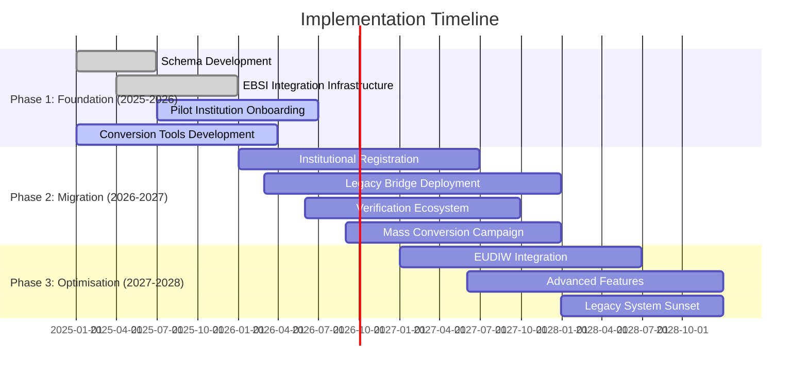
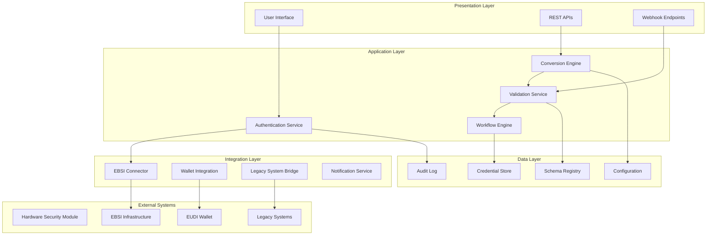

# Annex D: Implementation Guidelines and Conversion Tools

## Introduction

This annex provides comprehensive implementation guidelines and conversion tools for transitioning from the current European Digital Credentials (EDC) system to the eIDAS2-compliant EDC-W3C VCDM format. The guidelines support educational institutions, technology providers, and system integrators in implementing the sectoral EAA catalogue whilst ensuring backward compatibility during the transition period.

## D.1 Implementation Strategy Overview

### D.1.1 Phased Migration Approach

The migration strategy follows a three-phase approach designed to minimise disruption whilst ensuring comprehensive modernisation:



### D.1.2 Implementation Principles

#### D.1.2.1 Backward Compatibility First

All implementation approaches prioritise maintaining compatibility with existing systems during the transition period:

- **Dual-format support**: Systems must support both legacy EDC and new EDC-W3C formats
- **Automatic conversion**: Transparent conversion between formats when necessary
- **Legacy bridge maintenance**: Continued support for existing credentials until natural expiry
- **User experience continuity**: No disruption to end-user workflows during migration

#### D.1.2.2 Standards Compliance

Implementation must ensure full compliance with relevant standards:

- **W3C VCDM v1.1**: Complete alignment with Verifiable Credentials Data Model
- **eIDAS2 requirements**: Full compliance with European digital identity regulations
- **EBSI specifications**: Integration with European Blockchain Services Infrastructure
- **ELM v3.2 compatibility**: Maintenance of European Learning Model alignment

## D.2 Technical Architecture Implementation

### D.2.1 System Architecture Guidelines

#### D.2.1.1 Component Architecture

Recommended architecture for eIDAS2-compliant systems:



#### D.2.1.2 Security Architecture Requirements

Comprehensive security implementation guidelines:

```json
{
  "securityArchitecture": {
    "cryptographicRequirements": {
      "signatures": {
        "primary": "Ed25519Signature2020",
        "fallback": "EcdsaSecp256k1Signature2019",
        "legacy": "JAdES_D_Zero"
      },
      "keyManagement": {
        "storage": "HSM_required_for_production",
        "rotation": "automated_annual_rotation",
        "backup": "secure_key_escrow"
      },
      "encryption": {
        "transport": "TLS_1_3_minimum",
        "storage": "AES_256_GCM",
        "keyDerivation": "PBKDF2_100000_iterations"
      }
    },
    "accessControl": {
      "authentication": "did_based_preferred",
      "authorisation": "role_based_fine_grained",
      "auditLogging": "comprehensive_immutable_logs"
    },
    "complianceRequirements": {
      "gdpr": "privacy_by_design_implementation",
      "eidas2": "qualified_signatures_support",
      "sectoral": "education_specific_protections"
    }
  }
}
```

### D.2.2 Database and Storage Implementation

#### D.2.2.1 Credential Storage Schema

Recommended database schema for storing credentials during transition:

```sql
-- Credential table supporting both EDC and EDC-W3C formats
CREATE TABLE credentials (
    id UUID PRIMARY KEY,
    credential_type VARCHAR(50) NOT NULL, -- 'EDC' or 'EDC-W3C'
    format_version VARCHAR(20) NOT NULL,
    issuer_did VARCHAR(255),
    subject_did VARCHAR(255),
    credential_data JSONB NOT NULL,
    signature_data JSONB,
    status VARCHAR(20) DEFAULT 'active', -- active, suspended, revoked
    issued_at TIMESTAMP WITH TIME ZONE,
    expires_at TIMESTAMP WITH TIME ZONE,
    created_at TIMESTAMP WITH TIME ZONE DEFAULT NOW(),
    updated_at TIMESTAMP WITH TIME ZONE DEFAULT NOW()
);

-- Index for efficient querying
CREATE INDEX idx_credentials_issuer ON credentials(issuer_did);
CREATE INDEX idx_credentials_subject ON credentials(subject_did);
CREATE INDEX idx_credentials_status ON credentials(status);
CREATE INDEX idx_credentials_type ON credentials(credential_type);

-- Conversion tracking table
CREATE TABLE conversion_log (
    id UUID PRIMARY KEY,
    original_credential_id UUID REFERENCES credentials(id),
    converted_credential_id UUID REFERENCES credentials(id),
    conversion_type VARCHAR(50), -- 'EDC_to_W3C', 'W3C_to_EDC'
    conversion_status VARCHAR(20), -- 'success', 'failed', 'pending'
    conversion_metadata JSONB,
    converted_at TIMESTAMP WITH TIME ZONE DEFAULT NOW()
);
```

#### D.2.2.2 Schema Registry Implementation

Local schema registry for validation and conversion:

```json
{
  "schemaRegistry": {
    "storage": {
      "type": "postgresql_jsonb",
      "indexing": "gin_indexes_for_json_queries",
      "versioning": "semantic_versioning_support"
    },
    "schemas": {
      "edc_legacy": {
        "version": "1.0.0",
        "path": "/schemas/edc/v1.0/schema.json",
        "status": "deprecated"
      },
      "edc_w3c": {
        "version": "1.1.0", 
        "path": "/schemas/edc-w3c/v1.1/schema.json",
        "status": "active"
      }
    },
    "validation": {
      "engine": "ajv_json_schema",
      "customValidators": "elm_specific_validators",
      "performance": "cache_compiled_schemas"
    }
  }
}
```

## D.3 Conversion Tools and Utilities

### D.3.1 EDC to EDC-W3C Conversion Engine

#### D.3.1.1 Core Conversion Logic

Comprehensive conversion engine implementation:

```javascript
class EDCConverter {
  constructor(config) {
    this.config = config;
    this.schemaValidator = new SchemaValidator();
    this.contextResolver = new ContextResolver();
  }

  /**
   * Convert legacy EDC format to W3C VCDM compliant format
   * @param {Object} edcCredential - Legacy EDC credential
   * @returns {Object} - W3C VCDM compliant credential
   */
  async convertToW3C(edcCredential) {
    try {
      // Step 1: Validate input format
      await this.validateEDCFormat(edcCredential);
      
      // Step 2: Extract credential data from wrapper
      const credentialData = this.extractCredentialData(edcCredential);
      
      // Step 3: Transform structure
      const w3cCredential = await this.transformStructure(credentialData);
      
      // Step 4: Add required W3C fields
      const enrichedCredential = await this.addW3CFields(w3cCredential);
      
      // Step 5: Validate output format
      await this.validateW3CFormat(enrichedCredential);
      
      return enrichedCredential;
    } catch (error) {
      throw new ConversionError(`EDC to W3C conversion failed: ${error.message}`);
    }
  }

  extractCredentialData(edcCredential) {
    // Remove the top-level "credential" wrapper
    if (edcCredential.credential) {
      return edcCredential.credential;
    }
    return edcCredential;
  }

  async transformStructure(credentialData) {
    const transformed = {
      "@context": [
        "https://www.w3.org/2018/credentials/v1",
        "https://api-pilot.ebsi.eu/trusted-schemas-registry/v3/contexts/european-digital-credential-v3.jsonld"
      ],
      type: this.transformTypes(credentialData.type || credentialData.credentialProfiles),
      issuer: this.transformIssuer(credentialData.issuer),
      issuanceDate: this.transformIssuanceDate(credentialData.dateIssued || credentialData.issued),
      credentialSubject: this.transformCredentialSubject(credentialData.credentialSubject),
      credentialSchema: await this.addCredentialSchema(credentialData),
      credentialStatus: await this.addCredentialStatus(credentialData)
    };

    // Add optional fields if present
    if (credentialData.expirationDate || credentialData.validUntil) {
      transformed.expirationDate = credentialData.expirationDate || credentialData.validUntil;
    }

    if (credentialData.validFrom) {
      transformed.validFrom = credentialData.validFrom;
    }

    return transformed;
  }

  transformTypes(types) {
    const baseTypes = ["VerifiableCredential"];
    
    if (Array.isArray(types)) {
      return [...baseTypes, ...types.filter(t => !baseTypes.includes(t))];
    }
    
    if (typeof types === 'string') {
      return baseTypes.includes(types) ? baseTypes : [...baseTypes, types];
    }
    
    return baseTypes;
  }

  transformIssuer(issuer) {
    if (typeof issuer === 'string') {
      return issuer.startsWith('did:') ? issuer : this.convertToDID(issuer);
    }
    
    if (issuer && issuer.id) {
      return {
        ...issuer,
        id: issuer.id.startsWith('did:') ? issuer.id : this.convertToDID(issuer.id)
      };
    }
    
    throw new Error('Invalid issuer format');
  }

  convertToDID(legacyId) {
    // Convert legacy institutional IDs to DIDs
    // This would typically involve lookup in institutional registry
    return `did:ebsi:${this.generateDIDIdentifier(legacyId)}`;
  }

  async addCredentialSchema(credentialData) {
    const schemaType = this.determineSchemaType(credentialData);
    const schemaRegistry = await this.schemaValidator.getRegistryEntry(schemaType);
    
    return {
      id: schemaRegistry.schemaId,
      type: "JsonSchema2023"
    };
  }

  async addCredentialStatus(credentialData) {
    // Add StatusList2021 support
    return {
      id: `${this.config.statusListBase}#${this.generateStatusIndex()}`,
      type: "StatusList2021Entry",
      statusPurpose: "revocation",
      statusListIndex: this.generateStatusIndex(),
      statusListCredential: `${this.config.statusListBase}`
    };
  }
}
```

#### D.3.1.2 Batch Conversion Utility

Tool for converting large numbers of credentials:

```javascript
class BatchConverter {
  constructor(converter, options = {}) {
    this.converter = converter;
    this.batchSize = options.batchSize || 100;
    this.concurrency = options.concurrency || 5;
    this.onProgress = options.onProgress || (() => {});
    this.onError = options.onError || console.error;
  }

  async convertBatch(credentials) {
    const results = {
      total: credentials.length,
      successful: 0,
      failed: 0,
      errors: []
    };

    // Process in batches to avoid memory issues
    for (let i = 0; i < credentials.length; i += this.batchSize) {
      const batch = credentials.slice(i, i + this.batchSize);
      const batchResults = await this.processBatch(batch);
      
      results.successful += batchResults.successful;
      results.failed += batchResults.failed;
      results.errors.push(...batchResults.errors);
      
      this.onProgress({
        completed: i + batch.length,
        total: credentials.length,
        percentage: Math.round(((i + batch.length) / credentials.length) * 100)
      });
    }

    return results;
  }

  async processBatch(batch) {
    const semaphore = new Semaphore(this.concurrency);
    const promises = batch.map(async (credential, index) => {
      await semaphore.acquire();
      try {
        const converted = await this.converter.convertToW3C(credential);
        return { success: true, credential: converted, originalIndex: index };
      } catch (error) {
        this.onError(error, credential, index);
        return { success: false, error: error.message, originalIndex: index };
      } finally {
        semaphore.release();
      }
    });

    const results = await Promise.all(promises);
    
    return {
      successful: results.filter(r => r.success).length,
      failed: results.filter(r => !r.success).length,
      errors: results.filter(r => !r.success).map(r => ({
        index: r.originalIndex,
        error: r.error
      }))
    };
  }
}
```

### D.3.2 Validation and Quality Assurance Tools

#### D.3.2.1 Schema Validation Utility

Comprehensive validation for both EDC and EDC-W3C formats:

```javascript
class CredentialValidator {
  constructor() {
    this.ajv = new Ajv({
      strict: false,
      loadSchema: this.loadSchema.bind(this)
    });
    this.addCustomValidators();
  }

  async validateCredential(credential, format = 'auto') {
    const detectedFormat = format === 'auto' ? this.detectFormat(credential) : format;
    const schema = await this.getSchema(detectedFormat);
    
    const validate = await this.ajv.compileAsync(schema);
    const valid = validate(credential);
    
    if (!valid) {
      return {
        valid: false,
        errors: validate.errors,
        format: detectedFormat
      };
    }

    // Additional semantic validation
    const semanticValidation = await this.validateSemantics(credential, detectedFormat);
    
    return {
      valid: semanticValidation.valid,
      errors: semanticValidation.errors,
      format: detectedFormat,
      warnings: semanticValidation.warnings
    };
  }

  detectFormat(credential) {
    if (credential.credential) {
      return 'EDC';
    }
    if (credential['@context'] && credential.type && credential.credentialSubject) {
      return 'EDC-W3C';
    }
    throw new Error('Unable to detect credential format');
  }

  async validateSemantics(credential, format) {
    const validators = [];
    
    // Add format-specific validators
    if (format === 'EDC-W3C') {
      validators.push(
        this.validateW3CContext,
        this.validateIssuerDID,
        this.validateCredentialTypes,
        this.validateELMCompliance,
        this.validateStatusList
      );
    }
    
    const results = await Promise.all(
      validators.map(validator => validator.call(this, credential))
    );
    
    return {
      valid: results.every(r => r.valid),
      errors: results.flatMap(r => r.errors || []),
      warnings: results.flatMap(r => r.warnings || [])
    };
  }

  async validateW3CContext(credential) {
    const requiredContexts = [
      "https://www.w3.org/2018/credentials/v1"
    ];
    
    const contexts = credential['@context'] || [];
    const missingContexts = requiredContexts.filter(
      ctx => !contexts.includes(ctx)
    );
    
    return {
      valid: missingContexts.length === 0,
      errors: missingContexts.map(ctx => `Missing required context: ${ctx}`)
    };
  }

  async validateIssuerDID(credential) {
    const issuer = typeof credential.issuer === 'string' 
      ? credential.issuer 
      : credential.issuer?.id;
    
    if (!issuer) {
      return { valid: false, errors: ['Missing issuer'] };
    }
    
    if (!issuer.startsWith('did:')) {
      return { 
        valid: false, 
        errors: [`Issuer must be a DID, got: ${issuer}`] 
      };
    }
    
    // Validate DID format
    const didRegex = /^did:[a-z0-9]+:[a-zA-Z0-9._-]+$/;
    if (!didRegex.test(issuer)) {
      return { 
        valid: false, 
        errors: [`Invalid DID format: ${issuer}`] 
      };
    }
    
    return { valid: true };
  }
}
```

### D.3.3 Migration Assessment Tools

#### D.3.3.1 Compatibility Assessment

Tool for assessing conversion compatibility:

```javascript
class CompatibilityAssessment {
  constructor() {
    this.assessmentRules = new Map();
    this.loadAssessmentRules();
  }

  async assessCredential(credential) {
    const assessment = {
      convertible: true,
      confidence: 1.0,
      issues: [],
      recommendations: [],
      requiredActions: []
    };

    // Run all assessment rules
    for (const [ruleName, rule] of this.assessmentRules) {
      const result = await rule(credential);
      
      if (!result.passed) {
        assessment.convertible = false;
        assessment.confidence *= result.confidence || 0.5;
        assessment.issues.push({
          rule: ruleName,
          severity: result.severity || 'error',
          message: result.message,
          path: result.path
        });
      }
      
      if (result.recommendations) {
        assessment.recommendations.push(...result.recommendations);
      }
      
      if (result.requiredActions) {
        assessment.requiredActions.push(...result.requiredActions);
      }
    }

    return assessment;
  }

  loadAssessmentRules() {
    this.assessmentRules.set('issuer_identification', (credential) => {
      const issuer = credential.credential?.issuer || credential.issuer;
      if (!issuer) {
        return {
          passed: false,
          severity: 'error',
          message: 'Missing issuer information',
          requiredActions: ['Add issuer information to credential']
        };
      }
      
      if (typeof issuer === 'string' && !issuer.startsWith('did:')) {
        return {
          passed: true,
          severity: 'warning',
          message: 'Issuer not in DID format',
          recommendations: ['Convert issuer to DID format'],
          confidence: 0.8
        };
      }
      
      return { passed: true };
    });

    this.assessmentRules.set('credential_subject', (credential) => {
      const subject = credential.credential?.credentialSubject || credential.credentialSubject;
      if (!subject) {
        return {
          passed: false,
          severity: 'error',
          message: 'Missing credential subject',
          requiredActions: ['Add credential subject information']
        };
      }
      return { passed: true };
    });

    this.assessmentRules.set('temporal_validity', (credential) => {
      const data = credential.credential || credential;
      const hasIssuanceDate = data.dateIssued || data.issued || data.issuanceDate;
      
      if (!hasIssuanceDate) {
        return {
          passed: false,
          severity: 'warning',
          message: 'Missing issuance date',
          recommendations: ['Add issuance date for temporal validation']
        };
      }
      
      return { passed: true };
    });
  }
}
```

## D.4 Integration Guidelines

### D.4.1 EBSI Integration Implementation

#### D.4.1.1 DID Registration Process

Step-by-step implementation for institutional DID registration:

```javascript
class EBSIIntegration {
  constructor(config) {
    this.config = config;
    this.httpClient = new HTTPClient(config.ebsiEndpoint);
  }

  async registerInstitutionalDID(institutionData) {
    try {
      // Step 1: Generate DID document
      const didDocument = await this.generateDIDDocument(institutionData);
      
      // Step 2: Register DID in EBSI
      const didRegistration = await this.registerDID(didDocument);
      
      // Step 3: Bind X.509 certificate to DID
      const certificateBinding = await this.bindCertificate(
        didRegistration.did,
        institutionData.x509Certificate
      );
      
      // Step 4: Register in Trusted Issuer Registry
      const tirEntry = await this.registerInTIR(
        didRegistration.did,
        institutionData.accreditationInfo
      );
      
      return {
        did: didRegistration.did,
        didDocument: didDocument,
        certificateBinding: certificateBinding,
        tirEntry: tirEntry
      };
    } catch (error) {
      throw new EBSIIntegrationError(`DID registration failed: ${error.message}`);
    }
  }

  async generateDIDDocument(institutionData) {
    const keyPair = await this.generateKeyPair();
    
    return {
      "@context": [
        "https://www.w3.org/ns/did/v1",
        "https://w3id.org/security/v1"
      ],
      id: `did:ebsi:${this.generateDIDIdentifier()}`,
      verificationMethod: [{
        id: `#key-1`,
        type: "Ed25519VerificationKey2020",
        controller: `did:ebsi:${this.generateDIDIdentifier()}`,
        publicKeyMultibase: keyPair.publicKey
      }],
      authentication: ["#key-1"],
      assertionMethod: ["#key-1"],
      service: [{
        id: "#institutional-service",
        type: "EducationalInstitution",
        serviceEndpoint: institutionData.serviceEndpoint
      }]
    };
  }

  async registerInTIR(did, accreditationInfo) {
    const tirEntry = {
      issuerId: did,
      legalIdentity: {
        legalName: accreditationInfo.legalName,
        legalIdentifier: accreditationInfo.legalIdentifier
      },
      accreditationInfo: {
        accreditingAuthority: accreditationInfo.accreditingAuthority,
        accreditationScope: accreditationInfo.scope
      },
      registrationMetadata: {
        registeredBy: this.config.registrarDID,
        registrationDate: new Date().toISOString(),
        status: "active"
      }
    };

    return await this.httpClient.post('/tir/entries', tirEntry);
  }
}
```

#### D.4.1.2 Trust Registry Integration

Implementation for querying and updating trust registries:

```javascript
class TrustRegistryClient {
  constructor(config) {
    this.config = config;
    this.cache = new Map();
    this.cacheTimeout = 300000; // 5 minutes
  }

  async validateIssuer(issuerDID, credentialType) {
    const cacheKey = `${issuerDID}:${credentialType}`;
    
    // Check cache first
    const cached = this.cache.get(cacheKey);
    if (cached && Date.now() - cached.timestamp < this.cacheTimeout) {
      return cached.data;
    }

    try {
      // Query TIR for issuer authorization
      const tirEntry = await this.queryTIR(issuerDID);
      if (!tirEntry) {
        return { authorized: false, reason: 'Issuer not found in TIR' };
      }

      // Check credential type authorization
      const authorized = this.checkCredentialTypeAuthorization(
        tirEntry.accreditationInfo.accreditationScope,
        credentialType
      );

      // Validate accrediting authority in TAOR
      const taorValidation = await this.validateAccreditingAuthority(
        tirEntry.accreditationInfo.accreditingAuthority
      );

      const result = {
        authorized: authorized && taorValidation.valid,
        issuerInfo: tirEntry,
        accreditationValid: taorValidation.valid,
        authorizedScope: tirEntry.accreditationInfo.accreditationScope
      };

      // Cache result
      this.cache.set(cacheKey, {
        data: result,
        timestamp: Date.now()
      });

      return result;
    } catch (error) {
      throw new TrustRegistryError(`Issuer validation failed: ${error.message}`);
    }
  }

  async queryTIR(issuerDID) {
    const response = await fetch(
      `${this.config.tirEndpoint}/issuers/${encodeURIComponent(issuerDID)}`
    );
    
    if (response.status === 404) {
      return null;
    }
    
    if (!response.ok) {
      throw new Error(`TIR query failed: ${response.statusText}`);
    }
    
    return await response.json();
  }

  checkCredentialTypeAuthorization(scope, credentialType) {
    return scope.some(entry => 
      entry.credentialType === credentialType &&
      new Date() >= new Date(entry.validFrom) &&
      new Date() <= new Date(entry.validUntil)
    );
  }
}
```

### D.4.2 Wallet Integration Guidelines

#### D.4.2.1 EUDI Wallet Integration

Implementation guidelines for EUDI Wallet integration:

```javascript
class EUDIWalletIntegration {
  constructor(config) {
    this.config = config;
    this.oidc4vciClient = new OIDC4VCIClient(config.walletEndpoint);
  }

  async issueCredentialToWallet(credential, holderDID) {
    try {
      // Step 1: Prepare credential for issuance
      const issuanceReady = await this.prepareForIssuance(credential);
      
      // Step 2: Create credential offer
      const credentialOffer = await this.createCredentialOffer(
        issuanceReady,
        holderDID
      );
      
      // Step 3: Send to wallet via OpenID4VCI
      const issuanceResult = await this.oidc4vciClient.issueCredential(
        credentialOffer
      );
      
      return {
        success: true,
        transactionId: issuanceResult.transactionId,
        credentialId: issuanceResult.credentialId
      };
    } catch (error) {
      throw new WalletIntegrationError(`EUDI Wallet issuance failed: ${error.message}`);
    }
  }

  async prepareForIssuance(credential) {
    // Ensure credential is properly signed
    if (!credential.proof) {
      throw new Error('Credential must be signed before issuance');
    }

    // Add any required metadata for wallet consumption
    return {
      ...credential,
      credentialDisplayInfo: this.generateDisplayInfo(credential),
      walletMetadata: {
        issuerDisplayName: this.extractIssuerDisplayName(credential),
        credentialType: this.extractCredentialType(credential),
        issuanceDate: credential.issuanceDate
      }
    };
  }

  generateDisplayInfo(credential) {
    // Generate user-friendly display information
    const subject = credential.credentialSubject;
    const claims = subject.hasClaim || [];
    
    return {
      title: this.extractTitle(claims),
      issuer: this.extractIssuerDisplayName(credential),
      summary: this.generateSummary(claims),
      backgroundColor: "#1E3A8A",
      textColor: "#FFFFFF"
    };
  }
}
```

## D.5 Testing and Quality Assurance

### D.5.1 Automated Testing Framework

#### D.5.1.1 Conversion Testing Suite

Comprehensive testing framework for conversion processes:

```javascript
class ConversionTestSuite {
  constructor() {
    this.testCases = new Map();
    this.loadTestCases();
  }

  async runAllTests() {
    const results = new Map();
    
    for (const [testName, testCase] of this.testCases) {
      try {
        const result = await this.runTest(testCase);
        results.set(testName, {
          passed: result.passed,
          duration: result.duration,
          errors: result.errors
        });
      } catch (error) {
        results.set(testName, {
          passed: false,
          duration: 0,
          errors: [error.message]
        });
      }
    }

    return this.generateTestReport(results);
  }

  async runTest(testCase) {
    const startTime = Date.now();
    const converter = new EDCConverter(testCase.config);
    
    try {
      const converted = await converter.convertToW3C(testCase.input);
      const validation = await this.validateConversion(
        testCase.input,
        converted,
        testCase.expectedOutput
      );
      
      return {
        passed: validation.passed,
        duration: Date.now() - startTime,
        errors: validation.errors
      };
    } catch (error) {
      return {
        passed: false,
        duration: Date.now() - startTime,
        errors: [error.message]
      };
    }
  }

  loadTestCases() {
    // Basic conversion test
    this.testCases.set('basic_edc_conversion', {
      input: {
        credential: {
          issuer: { id: "https://university.example.edu" },
          credentialSubject: {
            id: "did:example:student123",
            givenName: { en: "John" },
            familyName: { en: "Doe" }
          },
          dateIssued: "2024-01-15T10:00:00Z"
        }
      },
      expectedOutput: {
        "@context": [
          "https://www.w3.org/2018/credentials/v1"
        ],
        type: ["VerifiableCredential"],
        issuer: "did:ebsi:university-example-edu",
        issuanceDate: "2024-01-15T10:00:00Z",
        credentialSubject: {
          id: "did:example:student123",
          givenName: { en: "John" },
          familyName: { en: "Doe" }
        }
      }
    });

    // Complex credential with ELM data
    this.testCases.set('elm_credential_conversion', {
      input: {
        credential: {
          issuer: { id: "did:ebsi:university123" },
          credentialSubject: {
            id: "did:example:student456",
            hasClaim: [{
              type: "LearningAchievement",
              title: { en: "Bachelor of Science in Computer Science" },
              awardedBy: {
                awardingBody: [{
                  legalName: { en: "Example University" }
                }]
              },
              specifiedBy: {
                eqfLevel: { notation: "6" }
              }
            }]
          }
        }
      }
    });
  }
}
```

### D.5.2 Performance Testing

#### D.5.2.1 Load Testing Framework

Performance testing for conversion and validation operations:

```javascript
class PerformanceTestSuite {
  constructor() {
    this.metrics = new Map();
  }

  async runPerformanceTests() {
    const tests = [
      { name: 'single_conversion', operation: 'convert', count: 1 },
      { name: 'batch_conversion_100', operation: 'convert', count: 100 },
      { name: 'batch_conversion_1000', operation: 'convert', count: 1000 },
      { name: 'validation_performance', operation: 'validate', count: 100 }
    ];

    for (const test of tests) {
      const metrics = await this.runPerformanceTest(test);
      this.metrics.set(test.name, metrics);
    }

    return this.generatePerformanceReport();
  }

  async runPerformanceTest(test) {
    const testData = this.generateTestData(test.count);
    const startTime = process.hrtime.bigint();
    
    try {
      if (test.operation === 'convert') {
        await this.performBatchConversion(testData);
      } else if (test.operation === 'validate') {
        await this.performBatchValidation(testData);
      }
      
      const endTime = process.hrtime.bigint();
      const duration = Number(endTime - startTime) / 1000000; // Convert to milliseconds
      
      return {
        totalDuration: duration,
        averagePerItem: duration / test.count,
        throughput: (test.count / duration) * 1000, // Items per second
        memoryUsage: process.memoryUsage()
      };
    } catch (error) {
      throw new Error(`Performance test failed: ${error.message}`);
    }
  }
}
```

## D.6 Deployment and Monitoring

### D.6.1 Deployment Guidelines

#### D.6.1.1 Production Deployment Checklist

Comprehensive checklist for production deployment:

```yaml
# deployment-checklist.yml
pre_deployment:
  infrastructure:
    - verify_hardware_security_modules
    - validate_network_security
    - confirm_backup_procedures
    - test_disaster_recovery
  
  configuration:
    - validate_ebsi_connectivity
    - verify_trust_registry_access
    - confirm_did_resolution
    - test_credential_issuance
  
  security:
    - audit_cryptographic_configuration
    - verify_access_controls
    - validate_certificate_installation
    - confirm_key_management_procedures

deployment:
  database:
    - run_schema_migrations
    - import_schema_registry
    - configure_indexing
    - verify_backup_procedures
  
  application:
    - deploy_conversion_services
    - configure_validation_engine
    - setup_monitoring_dashboards
    - deploy_api_endpoints
  
  integration:
    - test_ebsi_integration
    - verify_wallet_connectivity
    - validate_trust_registries
    - confirm_notification_services

post_deployment:
  verification:
    - run_integration_tests
    - perform_load_testing
    - validate_conversion_accuracy
    - verify_security_controls
  
  monitoring:
    - configure_alerting
    - setup_performance_monitoring
    - enable_audit_logging
    - verify_compliance_reporting
```

#### D.6.1.2 Monitoring and Alerting

Comprehensive monitoring implementation:

```javascript
class SystemMonitoring {
  constructor(config) {
    this.config = config;
    this.metrics = new MetricsCollector();
    this.alerting = new AlertingSystem(config.alerting);
  }

  setupMonitoring() {
    // Conversion performance metrics
    this.metrics.register('conversion_duration', {
      type: 'histogram',
      buckets: [10, 50, 100, 500, 1000, 5000],
      labels: ['conversion_type', 'status']
    });

    // Validation metrics
    this.metrics.register('validation_duration', {
      type: 'histogram',
      buckets: [1, 5, 10, 50, 100, 500],
      labels: ['validation_type', 'status']
    });

    // Trust registry query metrics
    this.metrics.register('trust_registry_query_duration', {
      type: 'histogram',
      buckets: [50, 100, 200, 500, 1000, 2000],
      labels: ['registry_type', 'status']
    });

    // Error rate metrics
    this.metrics.register('error_rate', {
      type: 'counter',
      labels: ['error_type', 'component']
    });

    // Setup alerting rules
    this.setupAlerts();
  }

  setupAlerts() {
    // High error rate alert
    this.alerting.addRule({
      name: 'high_error_rate',
      condition: 'rate(error_rate[5m]) > 0.1',
      severity: 'critical',
      message: 'Error rate exceeded 10% over 5 minutes'
    });

    // Slow conversion performance
    this.alerting.addRule({
      name: 'slow_conversion',
      condition: 'histogram_quantile(0.95, conversion_duration) > 5000',
      severity: 'warning',
      message: '95th percentile conversion time exceeded 5 seconds'
    });

    // Trust registry unavailability
    this.alerting.addRule({
      name: 'trust_registry_down',
      condition: 'up{job="trust-registry"} == 0',
      severity: 'critical',
      message: 'Trust registry service is unavailable'
    });
  }
}
```

---

**Note**: This implementation guide provides a comprehensive framework for migrating to eIDAS2-compliant systems. Regular updates ensure alignment with evolving standards and best practices. Implementers should adapt these guidelines to their specific infrastructure and requirements whilst maintaining compliance with all applicable regulations.