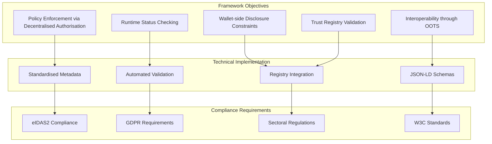
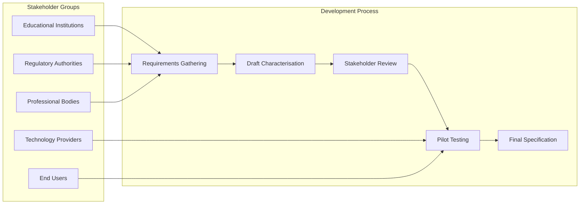

# Annex E: EAA Characterisation Framework

## Introduction

This annex defines the comprehensive characterisation framework for Electronic Attestations of Attributes (EAAs) within the DC4EU sectoral catalogue. The framework provides standardised metadata structures that enable policy enforcement, interoperability, and automated compliance verification whilst supporting the full range of educational and professional qualification credentials.

## E.1 Framework Architecture and Objectives

### E.1.1 Core Framework Objectives

The EAA characterisation framework supports the following essential functions:



### E.1.2 Framework Principles

#### E.1.2.1 Standardisation and Consistency

All EAA characterisations follow consistent patterns:

- **Uniform metadata structure**: Standard fields across all credential types
- **Semantic consistency**: Common terminology and definitions
- **Machine-readable policies**: Automated enforcement capabilities
- **Versioned specifications**: Controlled evolution and backward compatibility

#### E.1.2.2 Flexibility and Extensibility

The framework accommodates diverse requirements:

- **Sectoral adaptations**: Domain-specific requirements and policies
- **National variations**: Country-specific regulatory requirements
- **Institutional customisations**: Organisation-specific needs
- **Future evolution**: Extensibility for emerging requirements

## E.2 Core Characterisation Metadata Structure

### E.2.1 Mandatory Metadata Fields

Each EAA must include the following standardised metadata fields:

```json
{
  "$schema": "https://schemas.dc4eu.eu/characterisation/v1.0/eaa-characterisation.json",
  "$id": "https://catalogue.dc4eu.eu/eaa/{eaa_id}/v{version}",
  "eaa_characterisation": {
    "eaa_id": "string",
    "title": "LangStringType",
    "description": "LangStringType", 
    "data_model": "DataModelType",
    "credential_type": "CredentialTypeEnum",
    "sectoral_scope": "SectoralScopeEnum",
    "issuable_by": "IssuableByType",
    "usable_by": "UsableByType",
    "requires_pid": "boolean",
    "disclosure_policy": "DisclosurePolicyType",
    "terms_of_reference_uri": "string[uri]",
    "revocation_support": "RevocationSupportType",
    "binding_requirements": "BindingRequirementsType",
    "expiry": "ExpiryType",
    "version": "string"
  }
}
```

### E.2.2 Field Definitions and Specifications

#### E.2.2.1 Core Identification Fields

```json
{
  "coreIdentification": {
    "eaa_id": {
      "type": "string",
      "pattern": "^[A-Z]{2,10}[A-Z0-9]*$",
      "description": "Unique identifier for the EAA type (e.g., EUHED, EUVETMC, EAA1)",
      "examples": ["EUHED", "EUVETMC", "CPC", "EAA1"],
      "source": "Sectoral catalogue governance"
    },
    "title": {
      "type": "object",
      "patternProperties": {
        "^[a-z]{2}$": {"type": "string"}
      },
      "description": "Human-readable name of the EAA in multiple languages",
      "examples": {
        "en": "European Higher Education Diploma",
        "es": "Diploma de Educación Superior Europea",
        "fr": "Diplôme d'Enseignement Supérieur Européen"
      }
    },
    "description": {
      "type": "object", 
      "patternProperties": {
        "^[a-z]{2}$": {"type": "string"}
      },
      "description": "Semantic meaning and domain of application",
      "examples": {
        "en": "Verifiable credential representing completion of higher education programme"
      }
    }
  }
}
```

#### E.2.2.2 Technical Specification Fields

```json
{
  "technicalSpecification": {
    "data_model": {
      "type": "object",
      "properties": {
        "standard": {
          "type": "string",
          "enum": ["W3C Verifiable Credentials", "ELM v3.2", "EDC-W3C"],
          "description": "Primary data model standard"
        },
        "profile": {
          "type": "string",
          "description": "Specific profile or adaptation of the standard",
          "examples": ["DC4EU-Education", "DC4EU-Professional"]
        },
        "schema_uri": {
          "type": "string",
          "format": "uri",
          "description": "Reference to JSON-LD schema definition",
          "examples": ["https://schemas.dc4eu.eu/formal-education/euhed/v1.0/schema.json"]
        },
        "elm_version": {
          "type": "string",
          "description": "European Learning Model version compatibility",
          "examples": ["3.2", "3.1"]
        },
        "w3c_vcdm_version": {
          "type": "string", 
          "description": "W3C VCDM version compatibility",
          "examples": ["1.1", "2.0"]
        }
      },
      "required": ["standard", "schema_uri"]
    },
    "credential_type": {
      "type": "string",
      "enum": ["VerifiableCredential", "VerifiableAttestation", "QEAA"],
      "description": "Classification according to eIDAS2 Implementation Acts",
      "mapping": {
        "VerifiableCredential": "Basic W3C standard credential",
        "VerifiableAttestation": "Enhanced credential with additional trust features",
        "QEAA": "Qualified Electronic Attestation of Attributes under eIDAS2"
      }
    },
    "sectoral_scope": {
      "type": "string",
      "enum": [
        "FormalEducation",
        "ProfessionalQualifications", 
        "NonFoundationalID",
        "CrossSectoral"
      ],
      "description": "Primary domain of application"
    }
  }
}
```

#### E.2.2.3 Authorisation Framework Fields

```json
{
  "authorisationFramework": {
    "issuable_by": {
      "type": "object",
      "properties": {
        "authorised_roles": {
          "type": "array",
          "items": {"type": "string"},
          "description": "Roles authorised to issue this EAA type",
          "examples": [
            "HigherEducationInstitution",
            "VocationalEducationInstitution",
            "ProfessionalBody",
            "RegulatedAuthority"
          ]
        },
        "taor_required": {
          "type": "boolean",
          "description": "Whether issuer must be registered in TAOR",
          "default": true
        },
        "tir_entry": {
          "type": "string",
          "format": "uri",
          "description": "Reference DID or identifier for TIR registration",
          "examples": ["did:ebsi:issuer-edu", "did:ebsi:issuer-professional"]
        },
        "accreditation_requirements": {
          "type": "object",
          "properties": {
            "minimum_accreditation_level": {"type": "string"},
            "required_scope": {"type": "array", "items": {"type": "string"}},
            "geographic_limitations": {"type": "array", "items": {"type": "string"}}
          }
        }
      },
      "required": ["authorised_roles", "taor_required"]
    },
    "usable_by": {
      "type": "object", 
      "properties": {
        "verifier_authorisation_required": {
          "type": "boolean",
          "description": "Whether verifier must present VerifierAuthorisation VC",
          "default": true
        },
        "authorised_roles": {
          "type": "array",
          "items": {"type": "string"},
          "description": "Verifier roles authorised to request this EAA",
          "examples": [
            "RecognitionAuthority",
            "PublicEmploymentService", 
            "EmployerVerifier",
            "EducationalInstitution"
          ]
        },
        "entitlement_check": {
          "type": "string",
          "enum": ["required", "optional", "none"],
          "description": "Level of entitlement verification required"
        },
        "trust_framework": {
          "type": "string",
          "enum": ["eIDAS", "national", "sectoral"],
          "description": "Trust framework for verifier authorisation"
        },
        "limit_root_tao": {
          "type": "array",
          "items": {"type": "string", "format": "uri"},
          "description": "Root Trust Anchor Organisations that may authorise verifiers"
        }
      },
      "required": ["authorised_roles"]
    },
    "requires_pid": {
      "type": "boolean",
      "description": "Whether EAA requires binding to foundational PID or QEAA",
      "rationale": "Ensures link to legal identity for high-assurance credentials"
    }
  }
}
```

#### E.2.2.4 Privacy and Disclosure Control

```json
{
  "privacyAndDisclosure": {
    "disclosure_policy": {
      "type": "object",
      "properties": {
        "restricted_access": {
          "type": "boolean",
          "description": "Whether access is restricted to authorised verifiers only"
        },
        "verifier_role_check": {
          "type": "boolean", 
          "description": "Whether verifier role must be validated before disclosure"
        },
        "confidentiality_level": {
          "type": "string",
          "enum": ["public", "restricted", "confidential"],
          "description": "Classification of information sensitivity"
        },
        "machine_readable": {
          "type": "string",
          "format": "uri",
          "description": "URI to machine-readable disclosure policy document"
        },
        "presentation_policy_uri": {
          "type": "string",
          "format": "uri", 
          "description": "Runtime presentation policy for wallet enforcement"
        },
        "selective_disclosure": {
          "type": "object",
          "properties": {
            "supported": {"type": "boolean"},
            "granularity": {
              "type": "string",
              "enum": ["attribute", "field", "predicate"]
            },
            "default_level": {
              "type": "string",
              "enum": ["minimal", "standard", "full"]
            }
          }
        },
        "zero_knowledge_support": {
          "type": "object",
          "properties": {
            "supported": {"type": "boolean"},
            "proof_types": {
              "type": "array",
              "items": {
                "type": "string",
                "enum": ["range_proof", "membership_proof", "predicate_proof"]
              }
            }
          }
        }
      },
      "required": ["restricted_access", "verifier_role_check", "confidentiality_level"]
    },
    "terms_of_reference_uri": {
      "type": "string",
      "format": "uri",
      "description": "Link to JSON Terms of Reference stored in TSR",
      "purpose": "Specifies usage rules, presentation constraints, and binding requirements"
    }
  }
}
```

#### E.2.2.5 Technical Requirements and Lifecycle Management

```json
{
  "technicalRequirements": {
    "revocation_support": {
      "type": "object",
      "properties": {
        "method": {
          "type": "string",
          "enum": ["StatusList2021", "RevocationList2020", "CRL"],
          "description": "Revocation checking mechanism"
        },
        "status_endpoint": {
          "type": "string",
          "format": "uri",
          "description": "Endpoint for status verification"
        },
        "supports_suspension": {
          "type": "boolean",
          "description": "Whether credential supports suspension (vs permanent revocation)"
        },
        "check_frequency": {
          "type": "string",
          "enum": ["realtime", "periodic", "on_demand"],
          "description": "Required frequency for status checking"
        }
      },
      "required": ["method", "supports_suspension"]
    },
    "binding_requirements": {
      "type": "object",
      "properties": {
        "proof_of_possession": {
          "type": "boolean",
          "description": "Whether holder must prove possession of credential"
        },
        "cryptographic_binding_to_holder": {
          "type": "boolean",
          "description": "Whether credential is cryptographically bound to holder"
        },
        "biometric_binding": {
          "type": "boolean",
          "description": "Whether biometric binding is required or supported"
        },
        "device_binding": {
          "type": "boolean",
          "description": "Whether credential is bound to specific device"
        }
      },
      "required": ["proof_of_possession", "cryptographic_binding_to_holder"]
    },
    "expiry": {
      "type": "object",
      "properties": {
        "type": {
          "type": "string",
          "enum": ["static", "dynamic", "perpetual"],
          "description": "Type of expiry management"
        },
        "default_validity_period": {
          "type": "string",
          "description": "Default validity period (ISO 8601 duration format)",
          "examples": ["P5Y", "P1Y", "PT0S"]
        },
        "renewal_supported": {
          "type": "boolean",
          "description": "Whether credential supports renewal"
        },
        "validity_constraints": {
          "type": "object",
          "properties": {
            "academic_year_linked": {"type": "boolean"},
            "accreditation_period_linked": {"type": "boolean"},
            "regulatory_period_linked": {"type": "boolean"}
          }
        }
      },
      "required": ["type"]
    }
  }
}
```

### E.2.3 Metadata Versioning and Evolution

#### E.2.3.1 Version Management

```json
{
  "versionManagement": {
    "version": {
      "type": "string",
      "pattern": "^\\d+\\.\\d+(\\.\\d+)?$",
      "description": "Semantic version of the characterisation"
    },
    "version_history": {
      "type": "array",
      "items": {
        "type": "object",
        "properties": {
          "version": {"type": "string"},
          "release_date": {"type": "string", "format": "date"},
          "changes": {"type": "array", "items": {"type": "string"}},
          "deprecated": {"type": "boolean"},
          "migration_guide": {"type": "string", "format": "uri"}
        }
      }
    },
    "backward_compatibility": {
      "type": "object",
      "properties": {
        "supported_versions": {
          "type": "array",
          "items": {"type": "string"}
        },
        "migration_required": {"type": "boolean"},
        "deprecation_notice": {"type": "string"}
      }
    }
  }
}
```

## E.3 Characterisation Examples

### E.3.1 Higher Education Credential Example

Complete characterisation for European Higher Education Diploma:

```json
{
  "$schema": "https://schemas.dc4eu.eu/characterisation/v1.0/eaa-characterisation.json",
  "$id": "https://catalogue.dc4eu.eu/eaa/EUHED/v1.0",
  "eaa_characterisation": {
    "eaa_id": "EUHED",
    "title": {
      "en": "European Higher Education Diploma",
      "es": "Diploma de Educación Superior Europea",
      "fr": "Diplôme d'Enseignement Supérieur Européen",
      "de": "Europäisches Hochschuldiplom"
    },
    "description": {
      "en": "Verifiable credential representing successful completion of a higher education programme leading to a formal qualification",
      "es": "Credencial verificable que representa la finalización exitosa de un programa de educación superior que conduce a una calificación formal"
    },
    "data_model": {
      "standard": "W3C Verifiable Credentials",
      "profile": "DC4EU-Education",
      "schema_uri": "https://schemas.dc4eu.eu/formal-education/euhed/v1.0/schema.json",
      "elm_version": "3.2",
      "w3c_vcdm_version": "1.1"
    },
    "credential_type": "VerifiableAttestation",
    "sectoral_scope": "FormalEducation",
    "issuable_by": {
      "authorised_roles": [
        "HigherEducationInstitution",
        "AccreditedUniversity"
      ],
      "taor_required": true,
      "tir_entry": "did:ebsi:issuer-higher-education",
      "accreditation_requirements": {
        "minimum_accreditation_level": "institutional_accreditation",
        "required_scope": ["higher_education", "degree_awarding"],
        "geographic_limitations": ["EU", "EEA"]
      }
    },
    "usable_by": {
      "verifier_authorisation_required": true,
      "authorised_roles": [
        "RecognitionAuthority",
        "HigherEducationInstitution",
        "EmployerVerifier",
        "ProfessionalBody"
      ],
      "entitlement_check": "required",
      "trust_framework": "eIDAS",
      "limit_root_tao": ["did:ebsi:education-authority-root"]
    },
    "requires_pid": true,
    "disclosure_policy": {
      "restricted_access": true,
      "verifier_role_check": true,
      "confidentiality_level": "restricted",
      "machine_readable": "https://policies.dc4eu.eu/formal-education/euhed/disclosure-policy.json",
      "presentation_policy_uri": "https://policies.dc4eu.eu/formal-education/euhed/presentation-policy.json",
      "selective_disclosure": {
        "supported": true,
        "granularity": "attribute",
        "default_level": "standard"
      },
      "zero_knowledge_support": {
        "supported": true,
        "proof_types": ["range_proof", "membership_proof"]
      }
    },
    "terms_of_reference_uri": "https://tsr.dc4eu.eu/tor/euhed.json",
    "revocation_support": {
      "method": "StatusList2021",
      "status_endpoint": "https://status.dc4eu.eu/credentials/euhed",
      "supports_suspension": false,
      "check_frequency": "on_demand"
    },
    "binding_requirements": {
      "proof_of_possession": true,
      "cryptographic_binding_to_holder": true,
      "biometric_binding": false,
      "device_binding": false
    },
    "expiry": {
      "type": "perpetual",
      "default_validity_period": "PT0S",
      "renewal_supported": false,
      "validity_constraints": {
        "academic_year_linked": false,
        "accreditation_period_linked": false,
        "regulatory_period_linked": false
      }
    },
    "version": "1.0"
  }
}
```

### E.3.2 Professional Qualification Example

Certificate of Professional Competence characterisation:

```json
{
  "eaa_characterisation": {
    "eaa_id": "CPC",
    "title": {
      "en": "Certificate of Professional Competence",
      "es": "Certificado de Competencia Profesional",
      "fr": "Certificat de Compétence Professionnelle"
    },
    "description": {
      "en": "Credential documenting professional competence within regulated or recognised professional frameworks"
    },
    "data_model": {
      "standard": "W3C Verifiable Credentials",
      "profile": "DC4EU-Professional",
      "schema_uri": "https://schemas.dc4eu.eu/professional-qualifications/cpc/v1.0/schema.json"
    },
    "credential_type": "VerifiableAttestation",
    "sectoral_scope": "ProfessionalQualifications",
    "issuable_by": {
      "authorised_roles": [
        "ProfessionalBody",
        "RegulatedAuthority",
        "NationalQualificationAuthority"
      ],
      "taor_required": true,
      "accreditation_requirements": {
        "minimum_accreditation_level": "professional_authority",
        "required_scope": ["professional_competence_assessment"],
        "regulatory_framework": "professional_qualifications_directive"
      }
    },
    "usable_by": {
      "verifier_authorisation_required": true,
      "authorised_roles": [
        "EmployerVerifier",
        "RegulatoryAuthority",
        "ProfessionalBody",
        "RecognitionAuthority"
      ],
      "entitlement_check": "required"
    },
    "requires_pid": true,
    "disclosure_policy": {
      "restricted_access": true,
      "verifier_role_check": true,
      "confidentiality_level": "restricted",
      "selective_disclosure": {
        "supported": true,
        "granularity": "attribute",
        "default_level": "minimal"
      }
    },
    "revocation_support": {
      "method": "StatusList2021",
      "supports_suspension": true,
      "check_frequency": "periodic"
    },
    "binding_requirements": {
      "proof_of_possession": true,
      "cryptographic_binding_to_holder": true
    },
    "expiry": {
      "type": "dynamic",
      "default_validity_period": "P5Y",
      "renewal_supported": true,
      "validity_constraints": {
        "regulatory_period_linked": true
      }
    },
    "version": "1.0"
  }
}
```

### E.3.3 Non-Foundational Identity Example

Educational ID characterisation:

```json
{
  "eaa_characterisation": {
    "eaa_id": "EAA1",
    "title": {
      "en": "Educational ID",
      "es": "ID Educativo",
      "fr": "Identifiant Éducatif"
    },
    "description": {
      "en": "Domain-specific identity credential for educational contexts and services"
    },
    "credential_type": "VerifiableCredential",
    "sectoral_scope": "NonFoundationalID",
    "issuable_by": {
      "authorised_roles": [
        "EducationalInstitution",
        "EducationalAuthority"
      ],
      "taor_required": false
    },
    "usable_by": {
      "authorised_roles": [
        "EducationalService",
        "StudentService",
        "LibraryService"
      ],
      "entitlement_check": "optional"
    },
    "requires_pid": true,
    "disclosure_policy": {
      "restricted_access": false,
      "verifier_role_check": true,
      "confidentiality_level": "public"
    },
    "revocation_support": {
      "method": "StatusList2021",
      "supports_suspension": true
    },
    "expiry": {
      "type": "dynamic",
      "default_validity_period": "P1Y",
      "validity_constraints": {
        "academic_year_linked": true
      }
    },
    "version": "1.0"
  }
}
```

## E.4 Implementation Guidelines

### E.4.1 Characterisation Development Process

#### E.4.1.1 Stakeholder Engagement



#### E.4.1.2 Quality Assurance Requirements

All characterisations must undergo comprehensive quality assurance:

```json
{
  "qualityAssurance": {
    "technicalValidation": {
      "schemaValidation": "JSON Schema compliance verification",
      "semanticValidation": "ELM and domain ontology alignment",
      "interoperabilityTesting": "Cross-system compatibility verification"
    },
    "stakeholderReview": {
      "educationalExpertise": "Domain expert validation",
      "technicalExpertise": "Implementation feasibility assessment", 
      "legalCompliance": "Regulatory and privacy compliance review"
    },
    "pilotTesting": {
      "institutionalPilots": "Real-world institutional testing",
      "crossBorderTesting": "Multi-jurisdiction validation",
      "userAcceptanceTesting": "End-user experience validation"
    }
  }
}
```

### E.4.2 Registry Integration

#### E.4.2.1 Trusted Schema Registry Integration

Characterisations must be properly registered in the TSR:

```json
{
  "tsrIntegration": {
    "registrationProcess": [
      "Submit characterisation for technical review",
      "Undergo stakeholder consultation",
      "Complete pilot testing requirements",
      "Receive formal approval from governance body",
      "Publish to production TSR"
    ],
    "metadata": {
      "publishedBy": "did:ebsi:dc4eu-governance",
      "approvalAuthority": "did:ebsi:sectoral-authority",
      "consultationPeriod": "P90D",
      "implementationDate": "date-time"
    }
  }
}
```

### E.4.3 Governance and Maintenance

#### E.4.3.1 Change Management Process

```json
{
  "changeManagement": {
    "changeTypes": {
      "patch": {
        "description": "Bug fixes and clarifications",
        "approval": "technical_review",
        "notice_period": "P30D"
      },
      "minor": {
        "description": "Backward-compatible enhancements",
        "approval": "stakeholder_consultation",
        "notice_period": "P90D"
      },
      "major": {
        "description": "Breaking changes requiring migration",
        "approval": "governance_board",
        "notice_period": "P365D"
      }
    },
    "deprecationPolicy": {
      "minimumSupportPeriod": "P2Y",
      "migrationSupport": "mandatory",
      "sunsetNotice": "P1Y"
    }
  }
}
```

#### E.4.3.2 Monitoring and Analytics

Ongoing monitoring ensures characterisation effectiveness:

```json
{
  "monitoring": {
    "usageMetrics": [
      "credential_issuance_volume",
      "verification_success_rate",
      "cross_border_usage",
      "error_rates"
    ],
    "qualityIndicators": [
      "stakeholder_satisfaction",
      "implementation_complexity",
      "interoperability_success",
      "compliance_rate"
    ],
    "reviewSchedule": {
      "quarterly": "usage_analytics_review",
      "annually": "comprehensive_effectiveness_review",
      "triggered": "significant_issue_identification"
    }
  }
}
```

## E.5 Compliance and Validation Framework

### E.5.1 Automated Validation Tools

#### E.5.1.1 Characterisation Validator

```javascript
class CharacterisationValidator {
  constructor() {
    this.schema = this.loadCharacterisationSchema();
    this.businessRules = this.loadBusinessRules();
  }

  async validateCharacterisation(characterisation) {
    const results = {
      valid: true,
      errors: [],
      warnings: [],
      compliance: {}
    };

    // Schema validation
    const schemaResult = this.validateSchema(characterisation);
    if (!schemaResult.valid) {
      results.valid = false;
      results.errors.push(...schemaResult.errors);
    }

    // Business rule validation
    const businessResult = await this.validateBusinessRules(characterisation);
    results.warnings.push(...businessResult.warnings);

    // Compliance validation
    results.compliance = await this.validateCompliance(characterisation);

    return results;
  }

  validateSchema(characterisation) {
    // JSON Schema validation implementation
    return this.ajv.validate(this.schema, characterisation);
  }

  async validateBusinessRules(characterisation) {
    const warnings = [];
    
    // Check authorisation consistency
    if (characterisation.requires_pid && 
        !characterisation.binding_requirements.cryptographic_binding_to_holder) {
      warnings.push({
        type: "consistency_warning",
        message: "PID requirement should include cryptographic binding"
      });
    }

    // Check sectoral scope alignment
    const sectoralChecks = await this.validateSectoralAlignment(characterisation);
    warnings.push(...sectoralChecks);

    return { warnings };
  }

  async validateCompliance(characterisation) {
    return {
      eidas2: await this.checkEIDAS2Compliance(characterisation),
      gdpr: await this.checkGDPRCompliance(characterisation),
      sectoral: await this.checkSectoralCompliance(characterisation)
    };
  }
}
```

### E.5.2 Compliance Reporting

#### E.5.2.1 Automated Compliance Dashboard

```json
{
  "complianceDashboard": {
    "metrics": [
      {
        "name": "characterisation_completeness",
        "description": "Percentage of required fields completed",
        "target": "100%",
        "current": "98.5%"
      },
      {
        "name": "schema_compliance_rate", 
        "description": "Percentage of characterisations passing validation",
        "target": "100%",
        "current": "99.2%"
      },
      {
        "name": "stakeholder_review_completion",
        "description": "Percentage with completed stakeholder review",
        "target": "100%",
        "current": "95.8%"
      }
    ],
    "alerts": [
      {
        "severity": "warning",
        "message": "3 characterisations pending stakeholder review",
        "action": "Schedule review meetings"
      }
    ]
  }
}
```

---

**Note**: This characterisation framework provides the foundation for consistent, interoperable, and compliant EAA definitions across the European educational and professional qualifications ecosystem. Regular review and updates ensure continued alignment with evolving standards and requirements.