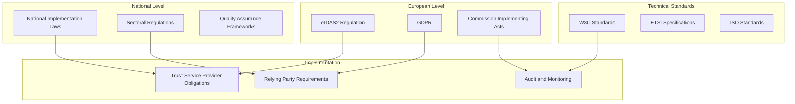

# Annex F: Compliance and Audit Requirements

## Introduction

This annex establishes comprehensive compliance and audit requirements for the DC4EU sectoral EAA catalogue, ensuring adherence to eIDAS2, GDPR, sectoral regulations, and international standards. The framework provides mandatory requirements for Trust Service Providers (TSPs), relying parties, and system operators whilst enabling automated compliance monitoring and audit trail generation.

## F.1 Regulatory Compliance Framework

### F.1.1 Multi-Level Compliance Architecture

The compliance framework operates across multiple regulatory layers:



### F.1.2 Primary Regulatory Requirements

#### F.1.2.1 eIDAS2 Compliance Requirements

All system components must comply with eIDAS2 requirements:

```json
{
  "eidas2Requirements": {
    "trustServiceProviders": {
      "registration": {
        "competentAuthority": "National eIDAS Authority",
        "supervisionFramework": "Continuous monitoring and audit",
        "qualificationCriteria": [
          "legal_entity_establishment",
          "technical_competence_demonstration",
          "organisational_reliability",
          "financial_stability"
        ]
      },
      "technicalRequirements": {
        "qualifiedCertificates": "X.509v3 compliance",
        "hsm_usage": "FIPS 140-2 Level 3 minimum",
        "cryptographicAlgorithms": "ETSI approved algorithms",
        "timestamping": "Qualified timestamp integration"
      },
      "operationalObligations": {
        "serviceAvailability": "99.9% uptime minimum",
        "incidentReporting": "24-hour notification to authorities",
        "auditLogging": "Comprehensive immutable logs",
        "dataRetention": "10-year minimum retention"
      }
    },
    "electronicAttestations": {
      "issuanceRequirements": [
        "verifiable_issuer_identity",
        "subject_identity_verification",
        "attestation_content_accuracy",
        "cryptographic_integrity"
      ],
      "technicalStandards": [
        "w3c_vcdm_compliance",
        "ebsi_integration",
        "statuslist2021_support",
        "selective_disclosure_capability"
      ]
    }
  }
}
```

#### F.1.2.2 GDPR Compliance Framework

Comprehensive data protection compliance:

```json
{
  "gdprCompliance": {
    "lawfulBasisFramework": {
      "credentialIssuance": {
        "primaryBasis": "Article 6(1)(c) - Legal obligation",
        "secondaryBasis": "Article 6(1)(a) - Consent",
        "specialCategories": "Article 9(2)(g) - Substantial public interest"
      },
      "credentialVerification": {
        "primaryBasis": "Article 6(1)(f) - Legitimate interest",
        "balancingTest": "Documented and reviewed annually",
        "consentRequirement": "Explicit consent for sensitive data"
      }
    },
    "dataSubjectRights": {
      "accessRight": {
        "implementation": "Automated data export functionality",
        "responseTime": "1 month maximum",
        "format": "Machine-readable JSON-LD"
      },
      "rectificationRight": {
        "implementation": "Credential reissuance procedures",
        "process": "Coordinated issuer-wallet update",
        "timeline": "Immediate for factual errors"
      },
      "erasureRight": {
        "implementation": "Consent withdrawal mechanisms", 
        "limitations": "Legal retention requirements",
        "process": "Automated deletion workflows"
      },
      "portabilityRight": {
        "implementation": "Standard W3C VCDM export",
        "format": "Interoperable credential formats",
        "scope": "User-provided data only"
      }
    },
    "privacyByDesign": {
      "dataMinimisation": "Selective disclosure by default",
      "purposeLimitation": "Machine-enforceable policies",
      "storageMinimisation": "Automated retention policies",
      "transparencyMeasures": "Real-time consent dashboards"
    }
  }
}
```

### F.1.3 Sectoral Compliance Requirements

#### F.1.3.1 Educational Sector Compliance

```json
{
  "educationalCompliance": {
    "institutionalAccreditation": {
      "requirements": [
        "national_quality_assurance_approval",
        "eqar_registration_where_applicable",
        "programme_specific_accreditation",
        "continuous_quality_monitoring"
      ],
      "validation": {
        "taorVerification": "Required for all issuers",
        "scopeVerification": "Automated against TIR entries",
        "temporalValidation": "Real-time accreditation status checking"
      }
    },
    "studentPrivacyRights": {
      "ferpaAlignment": "US-EU data sharing compliance",
      "minorProtections": "Enhanced consent requirements under 16",
      "academicRecords": "Special category data protection",
      "crossBorderTransfers": "Adequacy decision compliance"
    },
    "qualityAssurance": {
      "processDocumentation": "ISO 21001 alignment",
      "outcomeMonitoring": "Learning outcome verification",
      "stakeholderFeedback": "Student and employer input collection",
      "continuousImprovement": "Regular process refinement"
    }
  }
}
```

#### F.1.3.2 Professional Qualifications Compliance

```json
{
  "professionalCompliance": {
    "regulatoryFramework": {
      "professionalQualificationsDirective": "2005/36/EC compliance",
      "mutualRecognition": "Cross-border practice facilitation",
      "competentAuthorities": "National regulatory body registration",
      "temporaryMobility": "Notification procedure compliance"
    },
    "competenceVerification": {
      "escoMapping": "Skills framework alignment",
      "learningOutcomes": "EQF/NQF level verification",
      "professionalStandards": "Sector-specific requirement compliance",
      "continuingEducation": "CPD requirement tracking"
    },
    "ethicalRequirements": {
      "professionalConduct": "Code of ethics compliance",
      "clientConfidentiality": "Privacy protection measures",
      "competenceDeclaration": "Scope of practice limitation",
      "liabilityInsurance": "Professional indemnity coverage"
    }
  }
}
```

## F.2 Audit Trail and Logging Requirements

### F.2.1 Comprehensive Audit Architecture

#### F.2.1.1 Audit Event Classification

All system activities must be logged according to standardised classifications:

```json
{
  "auditEventClassification": {
    "systemEvents": {
      "authentication": {
        "level": "INFO",
        "retention": "P2Y",
        "fields": ["timestamp", "user_id", "method", "result", "ip_address"]
      },
      "authorisation": {
        "level": "INFO", 
        "retention": "P7Y",
        "fields": ["timestamp", "user_id", "resource", "permission", "result"]
      },
      "systemAccess": {
        "level": "INFO",
        "retention": "P1Y", 
        "fields": ["timestamp", "user_id", "system_component", "action"]
      }
    },
    "credentialEvents": {
      "issuance": {
        "level": "CRITICAL",
        "retention": "P10Y",
        "fields": [
          "timestamp", "issuer_did", "subject_did", "credential_type",
          "schema_version", "issuance_reason", "authorisation_check"
        ]
      },
      "verification": {
        "level": "INFO",
        "retention": "P7Y", 
        "fields": [
          "timestamp", "verifier_did", "credential_id", "verification_result",
          "disclosed_attributes", "consent_reference"
        ]
      },
      "revocation": {
        "level": "CRITICAL",
        "retention": "P10Y",
        "fields": [
          "timestamp", "issuer_did", "credential_id", "revocation_reason",
          "notification_method", "effective_date"
        ]
      },
      "statusCheck": {
        "level": "DEBUG",
        "retention": "P1Y",
        "fields": ["timestamp", "credential_id", "status_result", "verifier_did"]
      }
    },
    "privacyEvents": {
      "consentCollection": {
        "level": "INFO",
        "retention": "P7Y",
        "fields": [
          "timestamp", "subject_did", "consent_scope", "purpose",
          "legal_basis", "withdrawal_method"
        ]
      },
      "consentWithdrawal": {
        "level": "INFO",
        "retention": "P7Y",
        "fields": [
          "timestamp", "subject_did", "original_consent_id", "withdrawal_reason"
        ]
      },
      "dataAccess": {
        "level": "INFO",
        "retention": "P3Y",
        "fields": [
          "timestamp", "data_subject", "accessor", "data_types", "purpose"
        ]
      }
    },
    "trustRegistryEvents": {
      "tirUpdate": {
        "level": "CRITICAL",
        "retention": "P10Y",
        "fields": [
          "timestamp", "issuer_did", "update_type", "new_scope", "authorising_entity"
        ]
      },
      "trprRegistration": {
        "level": "CRITICAL", 
        "retention": "P10Y",
        "fields": [
          "timestamp", "verifier_did", "requested_entitlements", "approval_status"
        ]
      }
    }
  }
}
```

#### F.2.1.2 Audit Log Technical Requirements

```json
{
  "auditLogTechnicalRequirements": {
    "integrity": {
      "cryptographicHashing": "SHA-256 minimum",
      "digitalSignatures": "Ed25519 or ECDSA",
      "blockchainAnchoring": "EBSI timestamping",
      "immutability": "Write-once, read-many storage"
    },
    "availability": {
      "replication": "Multi-region redundancy",
      "backup": "Daily automated backups",
      "disasterRecovery": "RTO 4 hours, RPO 1 hour",
      "archival": "Long-term cold storage after 2 years"
    },
    "accessibility": {
      "searchCapability": "Full-text and structured search",
      "exportFormats": ["JSON", "CSV", "SIEM integration"],
      "apiAccess": "RESTful API with authentication",
      "realTimeAccess": "Streaming capabilities for monitoring"
    },
    "privacy": {
      "pseudonymisation": "Automatic PII masking",
      "accessControl": "Role-based fine-grained access",
      "dataRetention": "Automated purging per classification",
      "crossBorderTransfer": "GDPR Article 44 compliance"
    }
  }
}
```

### F.2.2 Real-Time Monitoring and Alerting

#### F.2.2.1 Security Event Monitoring

```json
{
  "securityMonitoring": {
    "threatDetection": {
      "unauthorisedAccess": {
        "triggers": ["multiple_failed_logins", "unusual_access_patterns"],
        "response": "immediate_alert_and_account_lock",
        "escalation": "security_team_notification"
      },
      "credentialFraud": {
        "triggers": ["invalid_issuer_signature", "revoked_issuer_certificate"],
        "response": "credential_rejection_and_logging", 
        "escalation": "regulatory_authority_notification"
      },
      "dataBreachIndicators": {
        "triggers": ["unusual_data_export", "unauthorised_api_access"],
        "response": "immediate_investigation_and_containment",
        "escalation": "data_protection_officer_notification"
      }
    },
    "complianceMonitoring": {
      "auditLogIntegrity": {
        "checks": ["hash_verification", "signature_validation", "blockchain_anchoring"],
        "frequency": "continuous",
        "alerts": "immediate_on_tampering_detection"
      },
      "retentionCompliance": {
        "checks": ["retention_period_adherence", "purging_schedule_execution"],
        "frequency": "daily",
        "alerts": "weekly_compliance_report"
      },
      "accessControlViolations": {
        "checks": ["unauthorised_role_access", "privilege_escalation"],
        "frequency": "real-time",
        "alerts": "immediate_security_alert"
      }
    }
  }
}
```

#### F.2.2.2 Performance and Availability Monitoring

```json
{
  "performanceMonitoring": {
    "systemPerformance": {
      "credentialIssuance": {
        "metrics": ["issuance_duration", "success_rate", "error_rate"],
        "thresholds": {"duration": "< 5 seconds", "success_rate": "> 99%"},
        "alerts": "performance_degradation_notification"
      },
      "verification": {
        "metrics": ["verification_duration", "trust_chain_validation_time"],
        "thresholds": {"duration": "< 2 seconds", "validation": "< 1 second"},
        "alerts": "verification_performance_alert"
      },
      "trustRegistryQueries": {
        "metrics": ["query_duration", "registry_availability", "response_accuracy"],
        "thresholds": {"duration": "< 500ms", "availability": "> 99.9%"},
        "alerts": "registry_performance_notification"
      }
    },
    "businessMetrics": {
      "credentialVolume": {
        "metrics": ["daily_issuance_count", "verification_count", "error_count"],
        "reporting": "daily_business_dashboard",
        "analysis": "trend_analysis_and_capacity_planning"
      },
      "userSatisfaction": {
        "metrics": ["user_feedback_scores", "abandonment_rates", "support_tickets"],
        "reporting": "monthly_satisfaction_report", 
        "analysis": "user_experience_improvement_identification"
      }
    }
  }
}
```

## F.3 Compliance Assessment and Certification

### F.3.1 Mandatory Compliance Assessments

#### F.3.1.1 Trust Service Provider Assessment

```json
{
  "tspAssessment": {
    "initialAssessment": {
      "scope": [
        "legal_entity_verification",
        "technical_capability_assessment", 
        "organisational_reliability_evaluation",
        "financial_stability_verification"
      ],
      "methodology": "ETSI EN 319 401 compliance",
      "assessor": "accredited_conformity_assessment_body",
      "documentation": [
        "capability_assessment_report",
        "risk_assessment_documentation",
        "technical_architecture_review",
        "process_documentation_audit"
      ]
    },
    "ongoingMonitoring": {
      "frequency": "annual_comprehensive_review",
      "continuousMonitoring": "automated_compliance_checking",
      "scope": [
        "operational_performance_review",
        "security_incident_analysis",
        "customer_complaint_investigation",
        "regulatory_change_impact_assessment"
      ]
    },
    "nonComplianceResponse": {
      "minorNonCompliance": {
        "response": "corrective_action_plan",
        "timeline": "90_days_maximum",
        "monitoring": "monthly_progress_reviews"
      },
      "majorNonCompliance": {
        "response": "immediate_mitigation_measures",
        "timeline": "30_days_maximum",
        "escalation": "supervisory_authority_notification"
      },
      "criticalNonCompliance": {
        "response": "service_suspension_consideration",
        "timeline": "immediate_action_required",
        "process": "regulatory_intervention_procedures"
      }
    }
  }
}
```

#### F.3.1.2 System-Level Compliance Assessment

```json
{
  "systemComplianceAssessment": {
    "technicalCompliance": {
      "interoperabilityTesting": {
        "scope": "cross_system_credential_exchange",
        "standards": ["w3c_vcdm", "openid4vci", "openid4vp"],
        "frequency": "quarterly_regression_testing",
        "certification": "ebsi_compatibility_certification"
      },
      "securityAssessment": {
        "penetrationTesting": "annual_comprehensive_assessment",
        "vulnerabilityScanning": "monthly_automated_scanning",
        "cryptographicReview": "annual_algorithm_compliance_check",
        "certifications": ["iso27001", "common_criteria_evaluation"]
      }
    },
    "operationalCompliance": {
      "processAudit": {
        "scope": "end_to_end_credential_lifecycle",
        "methodology": "iso19011_audit_guidelines",
        "frequency": "annual_internal_audit",
        "certification": "process_maturity_assessment"
      },
      "businessContinuity": {
        "testing": "semi_annual_disaster_recovery_testing",
        "documentation": "comprehensive_bcp_documentation",
        "certification": "iso22301_business_continuity_compliance"
      }
    }
  }
}
```

### F.3.2 Certification and Accreditation Framework

#### F.3.2.1 Multi-Level Certification Requirements

```json
{
  "certificationFramework": {
    "europeanLevel": {
      "eidas2Qualification": {
        "authority": "national_supervisory_body",
        "scope": "trust_service_provider_qualification",
        "validity": "continuous_with_annual_review",
        "requirements": "eidas2_implementing_acts_compliance"
      },
      "ebsiCompatibility": {
        "authority": "ebsi_governance_board",
        "scope": "technical_interoperability_certification", 
        "validity": "2_years_renewable",
        "requirements": "ebsi_technical_specifications_compliance"
      }
    },
    "nationalLevel": {
      "sectoralAccreditation": {
        "authority": "national_quality_assurance_agency",
        "scope": "educational_credential_issuance_authorisation",
        "validity": "institution_specific_accreditation_period",
        "requirements": "national_quality_framework_compliance"
      },
      "dataProtection": {
        "authority": "national_data_protection_authority",
        "scope": "gdpr_compliance_certification",
        "validity": "3_years_renewable",
        "requirements": "comprehensive_privacy_impact_assessment"
      }
    },
    "internationalLevel": {
      "iso27001": {
        "authority": "accredited_certification_body",
        "scope": "information_security_management",
        "validity": "3_years_with_annual_surveillance",
        "requirements": "isms_implementation_and_operation"
      },
      "w3cCompliance": {
        "authority": "w3c_working_group",
        "scope": "verifiable_credentials_data_model_compliance",
        "validity": "standard_version_specific",
        "requirements": "w3c_test_suite_compliance"
      }
    }
  }
}
```

## F.4 Reporting and Documentation Requirements

### F.4.1 Regulatory Reporting Framework

#### F.4.1.1 Mandatory Reporting Requirements

```json
{
  "regulatoryReporting": {
    "supervisoryReporting": {
      "quarterlyReports": {
        "recipients": ["national_supervisory_authority"],
        "content": [
          "operational_statistics",
          "incident_summary",
          "compliance_status",
          "customer_complaints"
        ],
        "format": "standardised_xml_schema",
        "deadline": "30_days_after_quarter_end"
      },
      "annualReports": {
        "recipients": ["national_supervisory_authority", "european_commission"],
        "content": [
          "comprehensive_operational_review",
          "financial_stability_assessment",
          "technical_capability_evaluation",
          "market_development_analysis"
        ],
        "format": "detailed_narrative_with_supporting_data",
        "deadline": "90_days_after_year_end"
      },
      "incidentReporting": {
        "timeline": "24_hours_for_critical_incidents",
        "recipients": ["supervisory_authority", "affected_parties"],
        "content": [
          "incident_description",
          "impact_assessment", 
          "mitigation_measures",
          "prevention_strategies"
        ],
        "followUp": "detailed_investigation_report_within_30_days"
      }
    },
    "dataProtectionReporting": {
      "breachNotification": {
        "authority": "data_protection_authority",
        "timeline": "72_hours_maximum",
        "content": [
          "nature_of_breach",
          "affected_data_categories",
          "number_of_affected_individuals",
          "mitigation_measures"
        ]
      },
      "dataSubjectRequests": {
        "frequency": "quarterly_statistics",
        "content": [
          "request_types_and_volumes",
          "response_times",
          "outcome_statistics",
          "process_improvements"
        ]
      }
    }
  }
}
```

#### F.4.1.2 Transparency and Public Reporting

```json
{
  "publicReporting": {
    "trustServices": {
      "publicTrustList": {
        "content": [
          "tsp_identification",
          "service_types_offered",
          "operational_status",
          "certificate_information"
        ],
        "updateFrequency": "real_time_status_updates",
        "format": "machine_readable_xml_and_json"
      },
      "serviceStatistics": {
        "content": [
          "credential_issuance_volumes",
          "verification_statistics", 
          "availability_metrics",
          "performance_indicators"
        ],
        "frequency": "monthly_public_dashboard_updates",
        "anonymisation": "privacy_preserving_aggregation"
      }
    },
    "complianceTransparency": {
      "assessmentResults": {
        "content": [
          "compliance_assessment_outcomes",
          "certification_status",
          "audit_findings_summary",
          "improvement_measures"
        ],
        "frequency": "annual_compliance_report",
        "scope": "public_interest_information_only"
      }
    }
  }
}
```

### F.4.2 Documentation and Record-Keeping

#### F.4.2.1 Operational Documentation Requirements

```json
{
  "operationalDocumentation": {
    "processDocumentation": {
      "credentialLifecycle": {
        "issuance": "detailed_workflow_documentation",
        "verification": "verification_procedure_specification",
        "revocation": "revocation_process_documentation",
        "archival": "record_retention_procedures"
      },
      "qualityManagement": {
        "procedures": "iso9001_aligned_process_documentation",
        "workInstructions": "step_by_step_operational_guidance",
        "forms": "standardised_forms_and_templates",
        "records": "quality_record_maintenance_procedures"
      }
    },
    "technicalDocumentation": {
      "systemArchitecture": "comprehensive_technical_architecture_documentation",
      "integrationSpecs": "api_and_integration_specifications",
      "securityControls": "detailed_security_control_documentation",
      "operationalProcedures": "system_operation_and_maintenance_procedures"
    },
    "legalDocumentation": {
      "policies": "privacy_policy_and_terms_of_service",
      "contracts": "service_agreements_and_user_terms",
      "notifications": "privacy_notices_and_consent_forms",
      "compliance": "regulatory_compliance_documentation"
    }
  }
}
```

#### F.4.2.2 Record Retention Framework

```json
{
  "recordRetention": {
    "retentionSchedule": {
      "auditLogs": {
        "period": "P10Y",
        "format": "immutable_digital_format",
        "storage": "secure_archive_with_integrity_protection",
        "access": "controlled_access_with_audit_trail"
      },
      "credentialRecords": {
        "period": "P10Y_after_expiry",
        "scope": "issuance_verification_and_revocation_records",
        "format": "structured_data_with_cryptographic_protection",
        "compliance": "legal_retention_requirements"
      },
      "complianceDocuments": {
        "period": "P7Y",
        "scope": "assessments_certifications_and_audit_reports",
        "format": "original_format_with_digital_preservation",
        "access": "regulatory_authority_access_rights"
      }
    },
    "disposalProcedures": {
      "secureDestruction": "cryptographic_key_destruction_and_data_overwriting",
      "certification": "destruction_certificate_generation",
      "notification": "stakeholder_notification_where_required",
      "documentation": "disposal_activity_documentation"
    }
  }
}
```

## F.5 Compliance Monitoring and Enforcement

### F.5.1 Automated Compliance Monitoring

#### F.5.1.1 Real-Time Compliance Dashboard

```javascript
class ComplianceMonitor {
  constructor() {
    this.metrics = new Map();
    this.alerts = new Map();
    this.reports = new Map();
  }

  initializeMonitoring() {
    // GDPR compliance monitoring
    this.registerMetric('gdpr_consent_rate', {
      target: 100,
      current: this.calculateConsentRate(),
      alert_threshold: 95,
      frequency: 'real_time'
    });

    this.registerMetric('data_retention_compliance', {
      target: 100,
      current: this.calculateRetentionCompliance(),
      alert_threshold: 98,
      frequency: 'daily'
    });

    // eIDAS2 compliance monitoring
    this.registerMetric('tsp_certificate_validity', {
      target: 100,
      current: this.checkCertificateStatus(),
      alert_threshold: 100,
      frequency: 'hourly'
    });

    this.registerMetric('audit_log_integrity', {
      target: 100,
      current: this.verifyAuditLogIntegrity(),
      alert_threshold: 100,
      frequency: 'continuous'
    });

    // Technical compliance monitoring
    this.registerMetric('credential_schema_compliance', {
      target: 100,
      current: this.validateSchemaCompliance(),
      alert_threshold: 99,
      frequency: 'per_transaction'
    });
  }

  async generateComplianceReport(period) {
    const report = {
      period: period,
      overall_status: 'compliant',
      metrics: {},
      violations: [],
      recommendations: []
    };

    for (const [metricName, metric] of this.metrics) {
      report.metrics[metricName] = {
        target: metric.target,
        actual: metric.current,
        compliance: metric.current >= metric.target
      };

      if (metric.current < metric.target) {
        report.overall_status = 'non_compliant';
        report.violations.push({
          metric: metricName,
          severity: this.calculateSeverity(metric),
          action_required: this.getRequiredAction(metric)
        });
      }
    }

    return report;
  }

  async enforceCompliance(violation) {
    switch (violation.severity) {
      case 'critical':
        await this.initiateCriticalResponse(violation);
        break;
      case 'high':
        await this.scheduleImmediateRemediation(violation);
        break;
      case 'medium':
        await this.planCorrectiveActions(violation);
        break;
      case 'low':
        await this.logForRoutineReview(violation);
        break;
    }
  }
}
```

#### F.5.1.2 Compliance Alerting System

```json
{
  "complianceAlerting": {
    "alertTypes": {
      "gdpr_violation": {
        "triggers": [
          "consent_withdrawal_not_processed",
          "data_retention_period_exceeded", 
          "unauthorised_cross_border_transfer"
        ],
        "severity": "high",
        "response_time": "immediate",
        "escalation": "data_protection_officer"
      },
      "eidas2_non_compliance": {
        "triggers": [
          "certificate_expiry_approaching",
          "hsm_failure_detected",
          "audit_log_tampering_suspected"
        ],
        "severity": "critical",
        "response_time": "immediate", 
        "escalation": "supervisory_authority"
      },
      "technical_compliance_issue": {
        "triggers": [
          "schema_validation_failure",
          "trust_chain_validation_error",
          "credential_integrity_violation"
        ],
        "severity": "medium",
        "response_time": "within_1_hour",
        "escalation": "technical_team_lead"
      }
    },
    "escalationProcedures": {
      "level1": "automated_system_response",
      "level2": "operations_team_notification",
      "level3": "management_escalation",
      "level4": "regulatory_authority_notification"
    }
  }
}
```

### F.5.2 External Audit and Assessment

#### F.5.2.1 Third-Party Audit Requirements

```json
{
  "externalAudit": {
    "auditTypes": {
      "complianceAudit": {
        "frequency": "annual",
        "scope": "comprehensive_regulatory_compliance",
        "auditor": "accredited_compliance_auditor",
        "standards": ["eidas2", "gdpr", "iso27001"]
      },
      "technicalAudit": {
        "frequency": "annual",
        "scope": "technical_architecture_and_security",
        "auditor": "certified_technical_auditor",
        "standards": ["w3c_vcdm", "ebsi_specs", "etsi_standards"]
      },
      "processAudit": {
        "frequency": "bi_annual",
        "scope": "operational_processes_and_procedures",
        "auditor": "process_improvement_specialist",
        "standards": ["iso9001", "itil", "cobit"]
      }
    },
    "auditPreparation": {
      "documentation": "comprehensive_evidence_package_preparation",
      "systemAccess": "secure_auditor_access_provisioning",
      "stakeholderCoordination": "internal_and_external_stakeholder_scheduling",
      "testDataPreparation": "anonymised_test_dataset_creation"
    },
    "auditResponse": {
      "findingsResponse": "detailed_response_to_audit_findings",
      "correctiveActions": "time_bound_remediation_plan",
      "followUp": "progress_monitoring_and_verification",
      "certification": "certification_maintenance_or_improvement"
    }
  }
}
```

## F.6 Enforcement and Sanctions Framework

### F.6.1 Graduated Response Framework

#### F.6.1.1 Non-Compliance Response Procedures

```json
{
  "nonComplianceResponse": {
    "responseMatrix": {
      "minor_non_compliance": {
        "examples": [
          "documentation_gaps",
          "process_deviation_without_impact",
          "delayed_reporting_within_grace_period"
        ],
        "response": "advisory_notice_and_guidance",
        "timeline": "90_days_corrective_action",
        "monitoring": "quarterly_progress_review"
      },
      "significant_non_compliance": {
        "examples": [
          "repeated_minor_violations",
          "procedural_failures_with_potential_impact",
          "insufficient_audit_trail_maintenance"
        ],
        "response": "formal_warning_and_improvement_plan",
        "timeline": "60_days_corrective_action",
        "monitoring": "monthly_progress_review"
      },
      "serious_non_compliance": {
        "examples": [
          "data_protection_violations",
          "security_breach_inadequate_response",
          "trust_service_provision_without_authorisation"
        ],
        "response": "suspension_threat_and_immediate_remediation",
        "timeline": "30_days_corrective_action",
        "monitoring": "weekly_progress_review"
      },
      "critical_non_compliance": {
        "examples": [
          "systematic_regulatory_violations",
          "fraudulent_credential_issuance",
          "wilful_non_cooperation_with_authorities"
        ],
        "response": "service_suspension_or_withdrawal",
        "timeline": "immediate_action_required",
        "process": "formal_regulatory_proceedings"
      }
    }
  }
}
```

#### F.6.1.2 Sanctions and Penalties

```json
{
  "sanctionsFramework": {
    "administrativeSanctions": {
      "fines": {
        "gdpr_violations": "up_to_4_percent_annual_turnover",
        "eidas2_violations": "member_state_specific_penalty_framework",
        "calculation": "severity_duration_and_cooperation_factors"
      },
      "operationalRestrictions": {
        "service_limitation": "restriction_to_specific_credential_types",
        "supervision_intensification": "increased_monitoring_requirements",
        "public_warning": "publication_of_non_compliance_status"
      }
    },
    "civilSanctions": {
      "liability": "compensation_for_damages_caused",
      "injunctions": "court_ordered_compliance_measures",
      "restitution": "correction_of_affected_credentials"
    },
    "criminalSanctions": {
      "fraud": "credential_fraud_prosecution",
      "data_protection": "criminal_data_protection_violations",
      "regulatory": "criminal_regulatory_non_compliance"
    }
  }
}
```

### F.6.2 Appeal and Review Procedures

#### F.6.2.1 Administrative Appeal Process

```json
{
  "appealProcess": {
    "internalReview": {
      "timeline": "30_days_from_decision_notification",
      "authority": "supervisory_authority_review_board",
      "scope": "procedural_and_substantive_review",
      "outcome": "decision_confirmation_modification_or_reversal"
    },
    "externalReview": {
      "timeline": "90_days_from_internal_review_decision",
      "authority": "administrative_court_or_tribunal",
      "scope": "judicial_review_of_administrative_decision",
      "remedies": "suspension_modification_or_compensation"
    },
    "europeanReview": {
      "conditions": "cross_border_impact_or_european_law_questions",
      "authority": "european_court_of_justice",
      "procedure": "preliminary_ruling_or_direct_action",
      "timeline": "varies_by_procedure_type"
    }
  }
}
```

---

**Note**: This compliance and audit framework ensures comprehensive regulatory adherence whilst enabling efficient operations through automated monitoring and clear procedural guidance. Regular updates maintain alignment with evolving regulatory requirements and industry best practices.