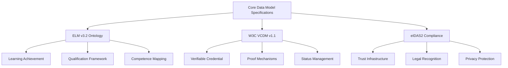

# Chapter 6: core data model specifications

## Introduction

Core data model specifications provide the foundational technical infrastructure that enables all credentials within the DC4EU sectoral catalogue to maintain semantic consistency, structural integrity, and international interoperability. These specifications define the common patterns, standards, and frameworks that underpin every electronic attestation of attributes (EAA) whilst ensuring compliance with both European regulatory requirements and global technical standards.

Operating as the technical backbone of the entire DC4EU ecosystem, these specifications bridge the gap between conceptual learning models and practical implementation requirements, providing concrete schemas, validation mechanisms, and transformation procedures that support the full credential lifecycle from issuance through verification and long-term preservation.

## Technical architecture and standards framework

### Multi-layered specification architecture

The core data model specifications implement a sophisticated multi-layered architecture that balances standardisation with flexibility:

#### Conceptual foundation layer

**European Learning Model (ELM) v3.2 ontology:**
- Semantic framework defining educational concepts and relationships
- Standardised vocabulary for learning outcomes, qualifications, and competences
- Cross-sector terminology harmonisation for educational and professional contexts
- Extensible concept hierarchy supporting diverse credential types

#### Technical implementation layer

**W3C Verifiable Credentials Data Model (VCDM) v1.1 compliance:**
- International standard for verifiable digital credentials
- Cryptographic proof mechanisms for credential integrity
- Selective disclosure capabilities for privacy protection
- Interoperability with global digital identity ecosystems

#### European integration layer

**eIDAS2 and EBSI alignment:**
- Regulatory compliance with European digital identity framework
- Integration with European Blockchain Services Infrastructure
- Trust registry connectivity for institutional verification
- Legal recognition across European Union member states

### Standards integration framework



## 6.1 European Learning Model (ELM) implementation

### 6.1.1 ELM v3.2 ontology specification

#### Conceptual framework and semantic foundation

The European Learning Model v3.2 provides the conceptual foundation for all educational and professional credentials within the DC4EU ecosystem, establishing a comprehensive ontology that describes learning achievements, qualifications, and competences in a standardised, machine-readable format.

##### Core entity relationships

**Learning achievement representation:**
```json
{
  "type": "LearningAchievement",
  "title": {"en": "Master of Science in Artificial Intelligence"},
  "description": {"en": "Advanced degree programme in artificial intelligence and machine learning"},
  "awardedBy": {
    "type": "AwardingProcess",
    "awardingBody": {
      "type": "Organisation",
      "legalName": {"en": "European Institute of Technology"}
    },
    "awardingDate": "2024-06-30T00:00:00Z",
    "location": {
      "type": "Location",
      "address": [{
        "countryCode": {"notation": "NL"},
        "fullAddress": {"en": "Amsterdam, Netherlands"}
      }]
    }
  },
  "specifiedBy": {
    "type": "Qualification",
    "eqfLevel": {"notation": "7"},
    "educationSubject": [{"prefLabel": {"en": "Computer Science"}}],
    "learningOutcome": [{
      "type": "LearningOutcome",
      "title": {"en": "Advanced AI Research Competence"},
      "relatedESCOSkill": [{"prefLabel": {"en": "Artificial intelligence research"}}]
    }]
  }
}
```

##### Qualification framework integration

**EQF and NQF alignment:**
- Standardised level descriptors linking to European Qualifications Framework
- National qualification framework mapping for cross-border recognition
- Learning outcome specifications based on knowledge, skills, and competences
- Quality assurance framework integration for institutional verification

**Credit system integration:**
```json
{
  "creditReceived": [{
    "type": "CreditPoint",
    "framework": {
      "notation": "ECTS",
      "prefLabel": {"en": "European Credit Transfer and Accumulation System"}
    },
    "point": "120"
  }],
  "volumeOfLearning": "P2Y",
  "learningOutcome": [{
    "title": {"en": "Research Methodology Competence"},
    "category": "knowledge",
    "relatedSkill": [{"prefLabel": {"en": "Research design and methodology"}}]
  }]
}
```

#### Achievement and qualification frameworks

##### Learning achievement specification

**Comprehensive achievement documentation:**
- Learning achievement title and description with multilingual support
- Institutional context and awarding process information
- Assessment methodology and evaluation criteria
- Credit allocation and learning volume quantification

**Competence and skill mapping:**
```json
{
  "learningOutcome": [
    {
      "type": "LearningOutcome",
      "title": {"en": "Data Science Competence"},
      "reusabilityLevel": {"notation": "cross_sectoral"},
      "relatedSkill": [{"prefLabel": {"en": "Statistical analysis"}}],
      "relatedESCOSkill": [
        {"prefLabel": {"en": "Data mining"}},
        {"prefLabel": {"en": "Machine learning algorithms"}}
      ]
    }
  ]
}
```

##### Organisational representation

**Institutional metadata framework:**
```json
{
  "type": "Organisation",
  "legalName": {"en": "Technical University of Advanced Studies"},
  "identifier": [{
    "type": "LegalIdentifier",
    "notation": "EU-HEI-789456123",
    "schemeAgency": {"en": "European Higher Education Registry"}
  }],
  "location": {
    "type": "Location",
    "address": [{
      "countryCode": {"notation": "DE"},
      "fullAddress": {"en": "Munich, Germany"}
    }]
  },
  "accreditation": [{
    "type": "Accreditation",
    "title": {"en": "Institutional Accreditation"},
    "accreditingAgent": {
      "legalName": {"en": "German Accreditation Council"}
    },
    "decision": {"notation": "positive"},
    "validFrom": "2020-01-01T00:00:00Z",
    "validUntil": "2026-12-31T23:59:59Z"
  }]
}
```

### 6.1.2 ELM-to-W3C VCDM mapping

#### Structural transformation procedures

The mapping from ELM conceptual models to W3C VCDM implementation requires sophisticated transformation procedures that preserve semantic meaning whilst ensuring technical compliance with international standards.

##### Root-level restructuring

**W3C VCDM compliance transformation:**
```json
{
  "@context": [
    "https://www.w3.org/2018/credentials/v1",
    "https://api-pilot.ebsi.eu/trusted-schemas-registry/v3/contexts/european-digital-credential-v3.jsonld"
  ],
  "id": "urn:uuid:12345678-1234-5678-9012-123456789abc",
  "type": [
    "VerifiableCredential",
    "VerifiableAttestation",
    "EuropeanDigitalCredential"
  ],
  "issuer": {
    "id": "did:ebsi:university-excellence-456",
    "type": "Organisation",
    "legalName": {"en": "University of Excellence"}
  },
  "issuanceDate": "2024-06-30T14:30:00Z",
  "validFrom": "2024-06-30T00:00:00Z",
  "expirationDate": "2034-06-29T23:59:59Z",
  "credentialSubject": {
    "id": "did:ebsi:student-789123456",
    "type": "Person",
    "hasClaim": [
      // ELM learning achievement content
    ]
  }
}
```

##### Temporal management standardisation

**Lifecycle timestamp harmonisation:**
- `issuanceDate`: W3C VCDM credential creation timestamp
- `validFrom`: credential validity commencement
- `validUntil`: credential validity expiration
- `expirationDate`: absolute credential expiration
- `awardingDate`: ELM-specific achievement award date

#### Proof mechanism integration

**Dual signature support:**
```json
{
  "proof": [
    {
      "type": "JAdESSignature2020",
      "created": "2024-06-30T14:30:00Z",
      "proofPurpose": "assertionMethod",
      "verificationMethod": "did:ebsi:university-excellence-456#keys-1",
      "jws": "eyJhbGciOiJFUzI1NksiLCJiNjQiOmZhbHNlLCJjcml0IjpbImI2NCJdfQ..signature"
    },
    {
      "type": "Ed25519Signature2020",
      "created": "2024-06-30T14:30:00Z",
      "proofPurpose": "assertionMethod",
      "verificationMethod": "did:ebsi:university-excellence-456#keys-2",
      "proofValue": "zSignatureValue"
    }
  ]
}
```

## 6.2 W3C verifiable credentials adaptations

### 6.2.1 EDC-W3C VCDM compliant schemas

#### Comprehensive schema architecture

The EDC-W3C schemas represent the full implementation of W3C Verifiable Credentials Data Model v1.1 specifically adapted for European educational and professional credentials, maintaining semantic alignment with ELM whilst ensuring international interoperability.

##### Base credential structure

**EDC-W3C foundation schema:**
```json
{
  "$schema": "https://json-schema.org/draft/2020-12/schema",
  "title": "European Digital Credential - W3C VCDM Compliant",
  "type": "object",
  "properties": {
    "@context": {
      "type": "array",
      "items": [
        {"const": "https://www.w3.org/2018/credentials/v1"},
        {"type": "string", "format": "uri"}
      ],
      "minItems": 2
    },
    "id": {
      "type": "string",
      "format": "uri"
    },
    "type": {
      "type": "array",
      "items": {"type": "string"},
      "contains": {"const": "VerifiableCredential"}
    },
    "issuer": {
      "oneOf": [
        {"type": "string", "format": "uri"},
        {"type": "object", "properties": {"id": {"type": "string", "format": "uri"}}}
      ]
    },
    "issuanceDate": {
      "type": "string",
      "format": "date-time"
    },
    "credentialSubject": {
      "type": "object",
      "properties": {
        "id": {"type": "string", "format": "uri"},
        "hasClaim": {
          "type": "array",
          "items": {"$ref": "#/$defs/LearningAchievementType"}
        }
      }
    },
    "credentialStatus": {
      "type": "array",
      "items": {"$ref": "#/$defs/StatusList2021EntryType"}
    }
  },
  "required": ["@context", "type", "issuer", "issuanceDate", "credentialSubject"]
}
```

#### Education-specific credential types

**Sector-specific type definitions:**
```json
{
  "educationalCredentialTypes": [
    "EuropeanDigitalCredential",
    "EuropeanHigherEducationDiploma",
    "EuropeanHigherEducationMicrocredential",
    "EuropeanVocationalEducationTrainingMicrocredential",
    "EuropeanHigherEducationTranscriptOfRecords",
    "EuropeanHigherEducationDiplomaSupplement"
  ],
  "professionalCredentialTypes": [
    "CertificateProfessionalCompetence",
    "ProfessionalMedicalCertification",
    "ContinuousProfessionalDevelopment",
    "ProfessionalTrainingCertificate"
  ]
}
```

### 6.2.2 Education-specific credential types

#### Higher education credential specifications

**Degree and diploma credentials:**
```json
{
  "type": [
    "VerifiableCredential",
    "VerifiableAttestation",
    "EuropeanDigitalCredential",
    "EuropeanHigherEducationDiploma"
  ],
  "credentialSubject": {
    "hasClaim": [{
      "type": "LearningAchievement",
      "title": {"en": "Bachelor of Engineering in Renewable Energy"},
      "specifiedBy": {
        "type": "Qualification",
        "eqfLevel": {"notation": "6"},
        "educationSubject": [{"prefLabel": {"en": "Renewable Energy Engineering"}}],
        "creditPoint": [{
          "framework": {"notation": "ECTS"},
          "point": "180"
        }],
        "learningOutcome": [
          {
            "title": {"en": "Sustainable Energy System Design"},
            "relatedESCOSkill": [{"prefLabel": {"en": "Renewable energy systems design"}}]
          }
        ]
      }
    }]
  }
}
```

#### Vocational education credential specifications

**VET microcredential structure:**
```json
{
  "type": [
    "VerifiableCredential",
    "VerifiableAttestation",
    "EuropeanDigitalCredential",
    "EuropeanVocationalEducationTrainingMicrocredential"
  ],
  "credentialSubject": {
    "hasClaim": [{
      "type": "LearningAchievement",
      "title": {"en": "Advanced Welding Techniques Microcredential"},
      "specifiedBy": {
        "type": "Qualification",
        "eqfLevel": {"notation": "4"},
        "creditPoint": [{
          "framework": {"notation": "ECVET"},
          "point": "5"
        }],
        "learningSetting": {"notation": "work_based_learning"},
        "learningOutcome": [{
          "title": {"en": "Advanced Welding Competence"},
          "relatedESCOSkill": [
            {"prefLabel": {"en": "Arc welding"}},
            {"prefLabel": {"en": "Quality control in welding"}}
          ]
        }]
      }
    }]
  }
}
```

### 6.2.3 Proof formats and verification mechanisms

#### Cryptographic proof architecture

**Multi-proof support framework:**
The EDC-W3C implementation supports multiple cryptographic proof mechanisms to ensure both European legal compliance and international interoperability.

##### JAdES D-Zero signature integration

**European legal compliance:**
```json
{
  "proof": {
    "type": "JAdESSignature2020",
    "created": "2024-06-30T14:30:00Z",
    "proofPurpose": "assertionMethod",
    "verificationMethod": "did:ebsi:institution-456#seal-key-1",
    "jws": "eyJhbGciOiJFUzI1NksiLCJiNjQiOmZhbHNlLCJjcml0IjpbImI2NCJdfQ..signature",
    "proofMetadata": {
      "legalCompliance": "eIDAS_qualified_signature",
      "timestampAuthority": "eu-tsa.europa.eu",
      "signatureLevel": "JAdES_BASELINE_B"
    }
  }
}
```

##### W3C standard proof mechanisms

**International interoperability:**
```json
{
  "proof": [
    {
      "type": "Ed25519Signature2020",
      "created": "2024-06-30T14:30:00Z",
      "proofPurpose": "assertionMethod",
      "verificationMethod": "did:ebsi:institution-456#ed25519-key-1",
      "proofValue": "z3fM7X8PnQqJ5RvGn4kL2wY9C6vB3nM8xQ7sT1uR4wE2pD5cF6aG8hI9jK0lM2nO3qR4sT5uV6wX7yZ8aB1cD2eF3gH"
    },
    {
      "type": "EcdsaSecp256k1Signature2019",
      "created": "2024-06-30T14:30:00Z",
      "proofPurpose": "assertionMethod",
      "verificationMethod": "did:ebsi:institution-456#secp256k1-key-1",
      "jws": "eyJhbGciOiJFUzI1NksiLCJiNjQiOmZhbHNlLCJjcml0IjpbImI2NCJdfQ..signature"
    }
  ]
}
```

#### Status management mechanisms

**StatusList2021 implementation:**
```json
{
  "credentialStatus": [
    {
      "id": "https://status.university-excellence.eu/status#94567",
      "type": "StatusList2021Entry",
      "statusPurpose": "revocation",
      "statusListIndex": "94567",
      "statusListCredential": "https://status.university-excellence.eu/credentials/status/2024"
    },
    {
      "id": "https://status.university-excellence.eu/status#94568",
      "type": "StatusList2021Entry",
      "statusPurpose": "suspension",
      "statusListIndex": "94568",
      "statusListCredential": "https://status.university-excellence.eu/credentials/suspension/2024"
    }
  ]
}
```

## 6.3 Multi-language and semantic support

### 6.3.1 Multi-language support structures

#### Comprehensive multilingual framework

The multi-language support infrastructure enables credentials to be represented across all European languages whilst maintaining semantic consistency and cultural appropriateness.

##### Language tagging and representation

**ISO 639-1 language code integration:**
```json
{
  "title": {
    "en": "Master of Science in Environmental Engineering",
    "fr": "Master en Sciences de l'Ingénierie Environnementale",
    "de": "Master of Science in Umweltingenieurwesen",
    "es": "Máster en Ciencias de la Ingeniería Ambiental",
    "it": "Master in Scienze dell'Ingegneria Ambientale"
  },
  "description": {
    "en": "Advanced degree programme focusing on sustainable environmental solutions",
    "fr": "Programme de diplôme avancé axé sur les solutions environnementales durables",
    "de": "Fortgeschrittenes Studienprogramm mit Fokus auf nachhaltige Umweltlösungen"
  }
}
```

##### Primary language specification

**Language preference and fallback mechanisms:**
```json
{
  "displayParameter": {
    "type": "DisplayParameter",
    "language": [
      {"notation": "en", "prefLabel": {"en": "English"}},
      {"notation": "fr", "prefLabel": {"fr": "Français"}},
      {"notation": "de", "prefLabel": {"de": "Deutsch"}}
    ],
    "primaryLanguage": {"notation": "en"},
    "individualDisplay": [{
      "type": "IndividualDisplay",
      "language": {"notation": "en"},
      "displayDetail": [{
        "type": "DisplayDetail",
        "contentType": {"notation": "text/html"},
        "content": "<p>Credential display content in English</p>"
      }]
    }]
  }
}
```

#### Translation verification and quality assurance

**Translation metadata and validation:**
```json
{
  "translationMetadata": {
    "originalLanguage": "en",
    "translatedLanguages": ["fr", "de", "es", "it"],
    "translationMethod": "professional_human_translation",
    "translationDate": "2024-05-15T00:00:00Z",
    "translationAuthority": {
      "name": "European Translation Services",
      "certification": "ISO_17100_certified"
    },
    "qualityAssurance": {
      "reviewed": true,
      "reviewDate": "2024-05-20T00:00:00Z",
      "reviewer": "Senior Educational Translator"
    }
  }
}
```

### 6.3.2 Semantic definitions and ontologies

#### Educational terminology standardisation

**Controlled vocabulary framework:**
The semantic definitions provide consistent meaning for educational terms across different languages, cultures, and institutional contexts.

##### Qualification level taxonomies

**EQF level semantic definitions:**
```json
{
  "qualificationLevels": {
    "eqf_level_6": {
      "notation": "6",
      "prefLabel": {
        "en": "Bachelor level",
        "fr": "Niveau licence",
        "de": "Bachelor-Niveau"
      },
      "definition": {
        "en": "Advanced knowledge of a field of work or study, involving a critical understanding of theories and principles",
        "fr": "Savoirs approfondis dans un domaine de travail ou d'études requérant une compréhension critique de théories et de principes"
      },
      "typicalQualification": ["bachelor_degree", "professional_bachelor"]
    }
  }
}
```

##### Subject area categorisation

**ISCED field classification integration:**
```json
{
  "educationSubjects": {
    "computer_science": {
      "iscedCode": "0613",
      "prefLabel": {
        "en": "Computer Science",
        "fr": "Informatique",
        "de": "Informatik",
        "es": "Ciencias de la Computación"
      },
      "broaderSubject": "information_communication_technologies",
      "narrowerSubjects": [
        "artificial_intelligence",
        "software_engineering",
        "data_science"
      ]
    }
  }
}
```

#### Competency framework integration

**Skills classification alignment:**
```json
{
  "competencyFrameworks": {
    "esco_skills": {
      "framework": "European Skills, Competences, Qualifications and Occupations",
      "version": "v1.1.0",
      "skillMapping": {
        "artificial_intelligence_research": {
          "escoUri": "http://data.europa.eu/esco/skill/12345",
          "prefLabel": {
            "en": "artificial intelligence research",
            "fr": "recherche en intelligence artificielle",
            "de": "Forschung zur künstlichen Intelligenz"
          },
          "skillType": "skill",
          "skillReuseLevel": "cross_sectoral"
        }
      }
    },
    "digcomp": {
      "framework": "Digital Competence Framework for Citizens",
      "version": "2.2",
      "competenceAreas": {
        "information_data_literacy": {
          "area": "1",
          "title": {
            "en": "Information and data literacy",
            "fr": "Maîtrise de l'information et des données"
          },
          "competences": [
            {
              "id": "1.1",
              "title": {"en": "Browsing, searching and filtering data, information and digital content"}
            }
          ]
        }
      }
    }
  }
}
```

### 6.3.3 ESCO skills integration

#### Labour market alignment framework

The ESCO (European Skills, Competences, Qualifications and Occupations) integration provides direct alignment between educational achievements and labour market requirements, facilitating career guidance and skills matching.

##### Skills and competence mapping

**Learning outcome to ESCO skill alignment:**
```json
{
  "learningOutcome": [
    {
      "type": "LearningOutcome",
      "title": {"en": "Data Analysis and Interpretation"},
      "description": {"en": "Ability to collect, process, and interpret complex datasets"},
      "relatedESCOSkill": [
        {
          "escoUri": "http://data.europa.eu/esco/skill/data-analysis",
          "prefLabel": {"en": "data analysis"},
          "skillType": "skill",
          "skillReuseLevel": "cross_sectoral"
        },
        {
          "escoUri": "http://data.europa.eu/esco/skill/statistical-analysis",
          "prefLabel": {"en": "statistical analysis"},
          "skillType": "skill",
          "skillReuseLevel": "cross_sectoral"
        }
      ],
      "proficiencyLevel": {
        "framework": "CEFR_adapted_skills",
        "level": "B2",
        "description": {"en": "Advanced proficiency in data analysis"}
      }
    }
  ]
}
```

##### Occupation and career pathway mapping

**Educational pathway to occupation alignment:**
```json
{
  "careerPathwayMapping": {
    "qualification": "Master of Science in Data Science",
    "relatedOccupations": [
      {
        "escoUri": "http://data.europa.eu/esco/occupation/data-scientist",
        "prefLabel": {"en": "Data scientist"},
        "relevanceScore": 0.95,
        "requiredSkills": [
          "machine_learning",
          "statistical_analysis",
          "data_visualization"
        ]
      },
      {
        "escoUri": "http://data.europa.eu/esco/occupation/business-analyst",
        "prefLabel": {"en": "Business analyst"},
        "relevanceScore": 0.78,
        "transferableSkills": [
          "data_interpretation",
          "problem_solving",
          "communication"
        ]
      }
    ]
  }
}
```

## Implementation considerations

### Technical infrastructure requirements

#### Schema validation and compliance

**Multi-layer validation framework:**
```json
{
  "validationFramework": {
    "syntacticValidation": {
      "jsonSchemaValidation": "required",
      "w3cVcdmCompliance": "required",
      "elmSemanticValidation": "required"
    },
    "semanticValidation": {
      "ontologyConsistency": "required",
      "vocabularyAlignment": "required",
      "crossReferenceValidation": "required"
    },
    "businessRuleValidation": {
      "creditConstraints": "required",
      "eqfLevelValidation": "required",
      "institutionalScope": "required"
    }
  }
}
```

#### Extensibility and versioning

**Schema evolution management:**
- Backwards-compatible extension mechanisms
- Version-controlled schema repositories
- Migration procedures for schema updates
- Deprecation policies for obsolete structures

### Interoperability and standards alignment

#### Cross-platform compatibility

**Multi-ecosystem support:**
- W3C Verifiable Credentials ecosystem integration
- European digital identity wallet compatibility
- International credential recognition framework support
- Legacy system migration pathway provision

#### Quality assurance and governance

**Standards maintenance framework:**
- Regular review and update procedures
- Stakeholder consultation mechanisms
- Impact assessment for schema changes
- Compliance monitoring and enforcement

## Future evolution and enhancement

### Advanced semantic technologies

#### Linked data and knowledge graphs

**Enhanced semantic connectivity:**
- RDF/OWL ontology integration for advanced reasoning
- Knowledge graph construction for qualification relationship mapping
- Automated competence inference from learning achievement data
- Cross-institutional qualification alignment and comparison

#### Artificial intelligence integration

**AI-enhanced credential processing:**
- Machine learning-based qualification recognition
- Automated skills gap analysis and recommendation systems
- Natural language processing for credential content extraction
- Predictive analytics for career pathway guidance

### International standards convergence

#### Global interoperability enhancement

**Worldwide compatibility development:**
- Integration with international qualification frameworks
- Global skills taxonomy alignment and mapping
- Cross-cultural adaptation mechanisms
- Multi-jurisdictional legal compliance support

This comprehensive framework of core data model specifications establishes the essential technical foundation that enables the DC4EU sectoral catalogue to maintain semantic consistency, structural integrity, and international interoperability whilst supporting the full diversity of European educational and professional credentials. Through sophisticated schema architectures, multilingual support, and semantic integration, these specifications ensure that credentials can be trusted, verified, and utilised across European borders and beyond whilst maintaining the highest standards of technical excellence and regulatory compliance.