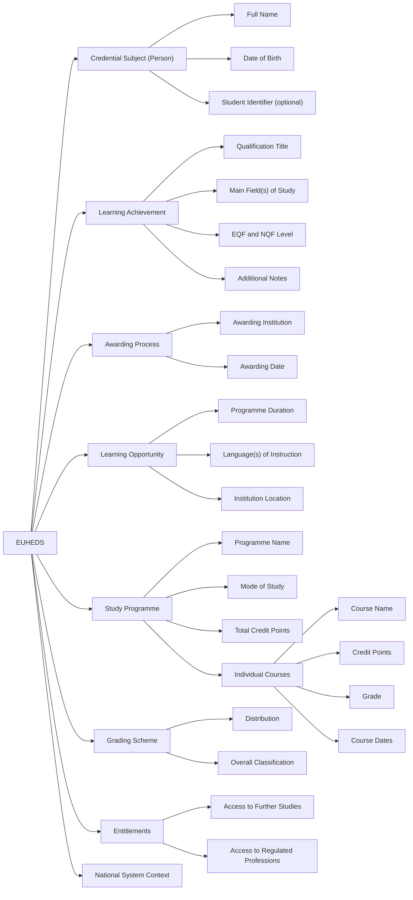

# **Higher Education Diploma Supplement (EUHEDS) - Digital Credential Specification**

## Overview

The **European Higher Education Diploma Supplement (EUHEDS)** is a digitally verifiable credential issued alongside a higher education diploma. It provides detailed, structured information about the awarded qualification, its academic level, programme content, courses completed, grading system, and national education context. The EUHEDS enhances transparency, supports cross-border academic and professional recognition, and aligns with the European Learning Model (ELM), Europass, EQF/NQF, and UNESCO Diploma Supplement.

This supplement complements a diploma and serves as a multilingual, machine-verifiable explanation of the qualification, supporting academic mobility, employer recognition, and access to further studies.

## Business Value

### For Higher Education Institutions:

* **Support for Internationalisation**: Facilitates mutual recognition of qualifications across the European Higher Education Area.
* **Alignment and Transparency**: Conforms with the EQF/NQF, Bologna Process, and national accreditation bodies.
* **Digital Trust and Authenticity**: Enables automated issuance of verifiable, tamper-proof supplements.

### For Graduates:

* **Recognition Across Borders**: Increases qualification visibility and recognition by employers and institutions abroad.
* **Detailed Academic Record**: Provides verified records of courses, credits, grades, and learning outcomes.
* **Gateway to Further Education**: Documents access rights to postgraduate programmes and regulated professions.

### For Relying Parties (employers, agencies, universities):

* **Verified Learning Evidence**: Offers an in-depth overview of the graduate's educational background, delivered in a trusted digital format.
* **Efficient Evaluation**: Reduces the need for translations or additional documentation by standardising qualification explanation.
* **Credibility and Comparability**: Supports qualification comparison at European and international level.

## Key Features

* **Fully aligned with ELM and Diploma Supplement Guidelines**:

  * Includes EQF/NQF levels, duration, institution status, mode of study, grading system, credit distribution.
  * Structured coverage of programme, individual courses, assessment details, and additional academic notes.

* **Structured Academic Profile**:

  * Learner identity, study programme, education institution, course-level data.
  * Encompasses learning achievements, entitlements, and access to further education.

* **Standardised Digital Format**:

  * Issued as a W3C Verifiable Credential (JSON-LD).
  * Digitally signed using JAdES D-Zero for interoperability with EBSI and European wallets.

## Use Cases

* **Academic Mobility**:
  A graduate uses EUHEDS to apply for a master's programme in another country, presenting clear and verifiable academic history.

* **Professional Qualification Recognition**:
  EUHEDS serves as proof of eligibility for entering a regulated profession requiring a formally assessed academic background.

* **Recruitment and Credential Evaluation**:
  Employers access structured evidence of coursework, grades, and programme outcomes through an EUHEDS credential.

## Why EUHEDS Matters

EUHEDS standardises the representation of complex academic qualifications in a trusted digital format. It enables cross-border recognition, supports transparency of learning outcomes, and strengthens the credibility of European higher education institutions. As a companion to diplomas, it empowers graduates and simplifies decision-making for credential evaluators and employers.

## **Data Model**

### ELM-based Entity-Relationship Diagram

### **1. Credential Subject Information**
These fields identify the diploma holder.

| **Field**                           | **ELM Object**  | **Subobject**         | **Comments** |
|-------------------------------------|---------------|----------------------|-------------|
| **Family name**                     | `elm:Person`  | `foaf:familyName`    | Mandatory |
| **Given name**                      | `elm:Person`  | `foaf:givenName`     | Mandatory |
| **Date of birth**                    | `elm:Person`  | `elm:dateOfBirth`    | Mandatory |
| **Student identification number**   | `elm:Person`  | `elm:Person`         | Optional, institutional/national identifier |

### **2. Qualification and Awarding Institution Information**
These fields define the awarded qualification and the institution responsible.

| **Field**                                        | **ELM Object**                                   | **Subobject**        | **Comments** |
|-------------------------------------------------|-------------------------------------------------|---------------------|-------------|
| **Name of Qualification**                       | `elm:LearningAchievement`                      | `dc:title`          | Mandatory |
| **Main field(s) of study for the qualification** | `elm:LearningAchievementSpecification`         | `elm:educationSubject` | Mandatory |
| **Name of education institution administering the studies** | `elm:awardingBody, elm:Organisation, elm:LegalIdentifier` | | Mandatory |
| **Status of awarding education institution**     | `elm:LearningAssessmentSpecification`          | `elm:additionalNote` | Mandatory |
| **Status of education institution administering the studies** | `elm:LearningAssessmentSpecification`          | `elm:additionalNote` | Mandatory |
| **Language(s) of instruction**                   | `elm:LearningOpportunity`                      | `elm:defaultLanguage` | Mandatory |

### **3. Qualification Level and Study Programme Details**
These fields describe the qualification's level and duration.

| **Field**                                      | **ELM Object**                           | **Subobject**    | **Comments** |
|-----------------------------------------------|----------------------------------------|---------------|-------------|
| **EQF level of the academic qualification**  | `elm:LearningAchievementSpecification` | `elm:Qualification` | Mandatory |
| **NQF level of the academic qualification**  | `elm:LearningAchievementSpecification` | `elm:Qualification` | Mandatory |
| **Study programme (official) duration**      | `elm:LearningOpportunity`               | `elm:duration` | Mandatory |

### **4. Study Programme and Course Details**
These fields detail the mode of study and individual courses within the diploma.

| **Field**                                  | **ELM Object**                           | **Subobject**        | **Comments** |
|-------------------------------------------|----------------------------------------|-------------------|-------------|
| **Mode of study**                         | `elm:LearningAchievementSpecification` | `elm:mode`         | Mandatory |
| **For each course in the diploma**        | `elm:hasPart`                          |                   | Mandatory |
| **Dates of each attended course**         | `elm:LearningOpportunity`               | `dc:PeriodOfTime`  | Mandatory |
| **ECTS credits obtained for each course** | `elm:creditReceived`                    | `Credit Point`     | Mandatory |
| **Grade obtained for each attended course** | `elm:LearningAssessment`               | `elm:grade`        | Mandatory |
| **Name of each attended course**          | `elm:LearningAssessment`               | `dc:title`         | Mandatory |
| **Name of study programme**               | `elm:LearningAchievementSpecification` | `dc:title`         | Mandatory |
| **Study programme duration (in ECTS credits)** | `elm:LearningAchievementSpecification` | `elm:creditPoint` | Mandatory |
| **Grade distribution guidance**           | `elm:LearningAssessment`               | `elm:resultDistribution` | Mandatory |
| **Grading system**                        | `elm:LearningAssessment`               | `elm:GradingScheme` | Mandatory |
| **Overall classification of the academic qualification** | `elm:GradingScheme` | | Mandatory |

### **5. Access to Further Studies and Regulated Professions**
These fields define whether the qualification grants access to further studies or regulated professions.

| **Field**                           | **ELM Object**                      | **Subobject**           | **Comments** |
|-------------------------------------|-----------------------------------|---------------------|-------------|
| **Access to further studies**      | `elm:LearningEntitlementSpecification` | `elm:additionalNote` | Mandatory |
| **Access to a regulated profession** | `elm:LearningEntitlementSpecification` | `elm:limitNationalOccupation` | Mandatory |

### **6. Additional Information**
These fields provide complementary details about the qualification.

| **Field**                          | **ELM Object**                          | **Subobject**        | **Comments** |
|------------------------------------|---------------------------------------|-------------------|-------------|
| **Additional information**         | `elm:LearningAchievementSpecification` | `elm:additionalNote` | Mandatory |
| **Further information sources**    | `elm:LearningAchievementSpecification` | `elm:additionalNote` | Mandatory |

### **7. Awarding Process**
These fields define the official awarding details.

| **Field**                             | **ELM Object**          | **Subobject**    | **Comments** |
|--------------------------------------|----------------------|---------------|-------------|
| **Date of award of academic qualification** | `elm:AwardingProcess` | `elm:awardingDate` | Mandatory |
| **Name of tertiary education institution** | `elm:awardingBody, elm:Organisation, elm:LegalIdentifier` | `elm:awardedBy` | Mandatory |

### **8. National Higher Education System**
This field provides an overview of the national system for understanding the qualification's context.

| **Field**                                           | **ELM Object**                           | **Subobject**        | **Comments** |
|-----------------------------------------------------|----------------------------------------|-------------------|-------------|
| **Information about the national higher education system** | `elm:LearningAchievementSpecification` | `elm:additionalNote` | Mandatory |

## Implementation Considerations

* Institutions must ensure coherence between the EUHEDS and the associated diploma.
* Supplements should reference or embed EQF/NQF alignment and grading scales.
* EUHEDS must be accessible via digital wallets and recognised across EHEA.
* Data sources for entitlements and courses should align with institutional systems and Europass schema.