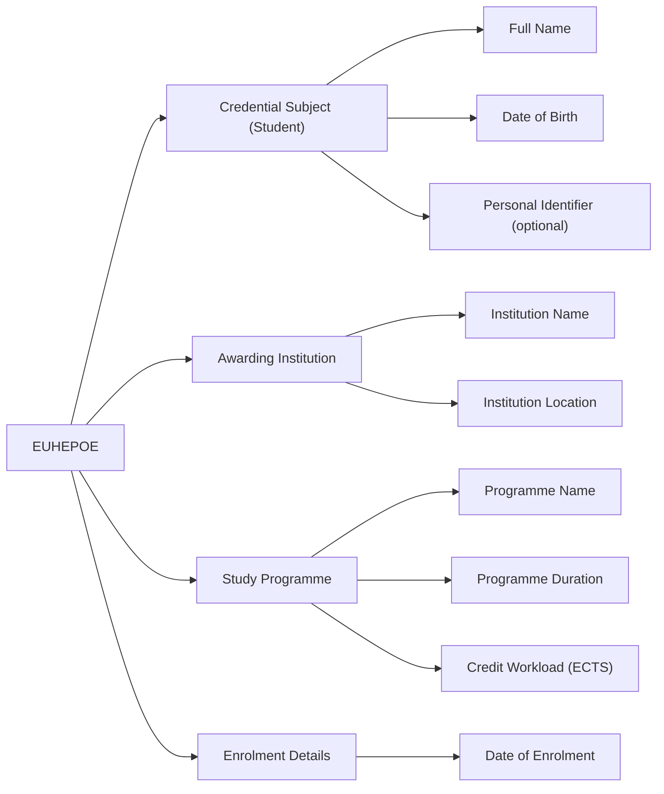

# **European Higher Education Proof of Enrolment (EUHEPOE) - Digital Credential Specification**

## Overview

The **European Higher Education Proof of Enrolment (EUHEPOE)** is a digitally verifiable credential that confirms a student's official enrolment in a recognised higher education programme. Issued by accredited higher education institutions across the European Higher Education Area (EHEA), it enables institutions, learners, and third-party services to validate academic status efficiently and securely.

EUHEPOE is aligned with the European Learning Model (ELM), EDCI framework, and supports administrative, financial, and mobility processes, including visa applications, student discounts, Erasmus+ mobility, and online service registrations.

## Business Value

### For Higher Education Institutions:

* **Process Optimisation**: Reduces manual handling of enrolment confirmation requests, improving service delivery.
* **Compliance and Interoperability**: Adheres to EU and national digitalisation standards for education services.
* **Reputation and Trust**: Reinforces credibility by issuing standardised, digitally signed enrolment credentials.

### For Students:

* **Instant Proof**: Enables immediate and secure verification of enrolment status by authorities and service providers.
* **Mobility Support**: Facilitates participation in Erasmus+ exchanges, internships, and joint degree programmes across borders.
* **Digital Readiness**: Supports digital-first services such as campus access, discounts, and public administration processes.

### For Relying Parties:

* **Trust and Verifiability**: Provides tamper-proof digital evidence of enrolment for use in public and private service contexts.
* **Efficiency Gains**: Speeds up processing of student eligibility for benefits or programmes, eliminating the need for paper verification.
* **Scalability**: Suitable for both national and cross-border verification across EHEA.

## Key Features

* **ELM 3.2 Aligned Structure**:
  * Identification of student (name, birth date in `date-time` format, identifier).
  * Awarding institution metadata (name, location).
  * Programme title, duration, and credit workload (ECTS).
  * Date of enrolment.
  * Includes `displayParameter` (e.g., language, format) and `credentialProfiles` (e.g., Europass).
* **Digital Format**:
  * Issued as a JSON-LD W3C Verifiable Credential with types `VerifiableCredential`, `EuropeanDigitalCredential`, `EuropeanHigherEducationProofOfEnrolment`, and `VerifiableAttestation`.
  * Signatures conforming to JAdES D-Zero profile.
* **Interoperability**:
  * Designed for use in EBSI and Europass infrastructure.
  * Compliant with ELM, Europass, and ECTS standards.

## Use Cases

* **Visa and Residency Applications**:
  A student presents a verifiable EUHEPOE when applying for a study visa or renewing residence permits.
* **Erasmus+ and International Mobility**:
  EUHEPOE is used to confirm enrolment in the home institution when applying to exchange programmes or host universities.
* **Public Services Access**:
  Municipal services, transport discounts, or national tax benefits rely on verified enrolment status.
* **Third-Party Verification**:
  Banks, housing providers, and insurance companies verify student status through the EUHEPOE credential.

## Why EUHEPOE Matters

In the context of digital transformation across the European Education Area, EUHEPOE modernises enrolment certification. It replaces paper-based confirmations with a secure, reusable digital credential that fosters mobility, reduces administrative burdens, and empowers students to manage their academic credentials. Through standardisation and verifiability, EUHEPOE ensures that proof of enrolment is trustworthy and instantly accessible across services and borders.

## ELM-based Entity-Relationship Diagram

This diagram shows how the key components of a proof of enrolment credential map to the ELM structure, highlighting mandatory and optional elements.

## Data Model Summary

### 1. Credential Subject (Student)

| Field               | ELM Object   | Subobject         | Comments  |
| ------------------- | ------------ | ----------------- | --------- |
| Date of birth       | `elm:Person` | `elm:dateOfBirth` | Mandatory, in date-time format (e.g., 2001-01-01T00:00:00+00:00) |
| Family name         | `elm:Person` | `foaf:familyName` | Mandatory |
| Given name          | `elm:Person` | `foaf:givenName`  | Mandatory |
| Personal identifier | `elm:Person` | -                 | Optional  |

### 2. Institution and Programme Information

| Field                   | ELM Object                             | Subobject             | Comments  |
| ----------------------- | -------------------------------------- | --------------------- | --------- |
| Name of institution     | `elm:Organisation`                     | `elm:LegalIdentifier` | Mandatory, includes location (e.g., country) |
| Name of study programme | `elm:LearningAchievementSpecification` | `dc:title`            | Mandatory |

### 3. Enrolment and Study Details

| Field                     | ELM Object                             | Subobject         | Comments  |
| ------------------------- | -------------------------------------- | ----------------- | --------- |
| Date of enrolment         | `elm:LearningOpportunity`              | `dc:PeriodOfTime` | Mandatory |
| Country of institution    | `elm:LearningOpportunity`              | `elm:location`    | Optional  |
| Programme duration        | `elm:LearningOpportunity`              | `elm:duration`    | Optional  |
| Programme workload (ECTS) | `elm:LearningAchievementSpecification` | `elm:creditPoint` | Mandatory |

## Implementation Considerations

* Issuers should ensure that enrolment data is synchronised with institutional SIS/ERP systems.
* National and cross-border trust frameworks should accept EUHEPOE as official proof.
* The credential should be regularly re-issued upon status changes (e.g., graduation, withdrawal).
* Integration with wallet-based ID and student apps is encouraged for seamless access.
* The credential includes displayParameter and credentialProfiles for consistent rendering and interoperability.
