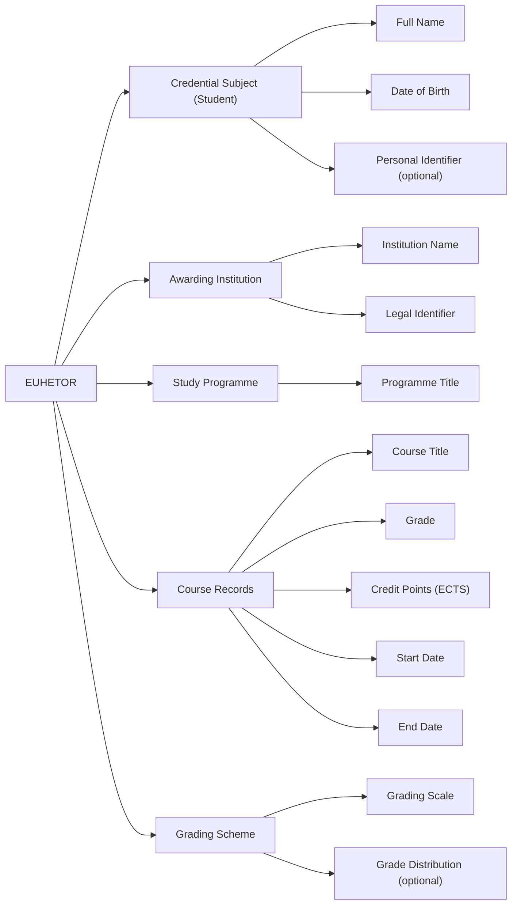

# **Higher Education Transcript of Records (EUHETOR) - Digital Credential Specification**

## Overview

The **European Higher Education Transcript of Records (EUHETOR)** is a digitally verifiable credential that presents an official summary of a student’s academic performance during a specific period of study. It includes detailed records of individual courses, grades obtained, credits earned, and institutional grading schemes. The EUHETOR facilitates academic mobility, supports recognition of learning achievements across borders, and aligns with the European Learning Model (ELM), Europass, and ECTS standards.

The transcript is issued by recognised higher education institutions and complements diploma certificates, providing granular academic data in a structured, trusted, and interoperable digital format.

## Business Value

### For Higher Education Institutions:

* **Mobility Facilitation**: Simplifies academic credit transfer and course recognition in Erasmus+ and joint degree contexts.
* **Compliance and Interoperability**: Ensures alignment with ECTS, Europass, and Bologna Process transparency principles.
* **Digital Transformation**: Reduces manual verification processes and supports student-centred digital services.

### For Students:

* **Academic Portability**: Empowers students to present verifiable records of coursework for international opportunities.
* **Clarity and Detail**: Includes course titles, grades, credit points, and grading system references in a standardised format.
* **Verification Control**: Allows students to manage and share their academic records via digital wallets.

### For Relying Parties (host institutions, recruiters, credential evaluators):

* **Trusted Record Access**: Enables direct access to official academic records for selection, recognition, and placement.
* **Comparison Efficiency**: Standardised format facilitates quick understanding of academic progress and performance.
* **Reduced Fraud**: Digital signature and EBSI trust framework protect data integrity and authenticity.

## Key Features

* **ELM-Aligned Structure**:

  * Identifies the student and issuing institution.
  * Includes programme and institutional metadata.
  * Captures individual courses, assessment results, ECTS credits, and period of study.
  * Describes the grading scheme used and (optionally) the result distribution.

* **Modular Course-Level Records**:

  * Each course is represented as a structured unit within the transcript, with title, grade, credit point, and time frame.

* **Interoperable Digital Format**:

  * Issued as a JSON-LD Verifiable Credential.
  * Digitally signed with JAdES D-Zero for secure transmission and validation.

## Use Cases

* **Erasmus+ and International Study Recognition**:
  A student applies to an Erasmus+ host university using their EUHETOR credential to confirm prior academic achievement.

* **Admission to Further Study**:
  Universities reviewing a master’s application evaluate previous academic records provided in EUHETOR format.

* **Employer Verification of Academic Progress**:
  Employers confirm the scope and results of courses completed by candidates through a verifiable EUHETOR.

## Why EUHETOR Matters

In a digitally connected higher education ecosystem, EUHETOR enables seamless, trustworthy exchange of academic progress data. It enhances transparency, streamlines recognition processes, and reinforces student agency in sharing their verified academic history. By aligning with European standards, it promotes comparability and ensures credibility of academic performance records.

## **Data Model**

### ELM-based Entity-Relationship Diagram

### **1. Credential Subject Information**
These fields identify the student to whom the transcript belongs.

| **Field**           | **ELM Object**  | **Subobject**        | **Comments** |
|--------------------|---------------|--------------------|-------------|
| **Date of birth**  | `elm:Person`  | `elm:dateOfBirth`  | Mandatory |
| **Family name**    | `elm:Person`  | `foaf:familyName`  | Mandatory |
| **Given name**     | `elm:Person`  | `foaf:givenName`   | Mandatory |
| **Personal identifier** | `elm:Person` | `elm:Person` | Optional, institutional/national identifier |

### **2. Institution and Study Programme Information**
These fields define the institution issuing the transcript and the programme followed.

| **Field**                                  | **ELM Object**                                    | **Subobject** | **Comments** |
|--------------------------------------------|-------------------------------------------------|-------------|-------------|
| **Name of tertiary education institution** | `elm:awardingBody, elm:Organisation, elm:LegalIdentifier` |  | Mandatory |
| **Name of study programme**                | `elm:LearningAchievementSpecification`         | `dc:title`  | Mandatory |

### **3. Course and Performance Details**
These fields describe the courses attended and the student's academic performance.

| **Field**                                  | **ELM Object**                           | **Subobject**         | **Comments** |
|--------------------------------------------|----------------------------------------|-------------------|-------------|
| **For each course**                        | `elm:hasPart`                          |                   | Mandatory |
| **Grade obtained for each attended course** | `elm:LearningAssessment`               | `elm:grade`        | Mandatory |
| **Name of each attended course**           | `elm:LearningAssessment`               | `dc:title`         | Mandatory |
| **ECTS credits obtained for each attended course** | `elm:creditReceived`            | `Credit Point`     | Mandatory |
| **Start date for each attended course**    | `elm:LearningOpportunity`              | `dc:PeriodOfTime`  | Optional |
| **End date for each attended course**      | `elm:LearningOpportunity`              | `dc:PeriodOfTime`  | Optional |

### **4. Grading System Information**
These fields provide details on the grading system used.

| **Field**                        | **ELM Object**              | **Subobject**         | **Comments** |
|----------------------------------|---------------------------|-------------------|-------------|
| **Grading Scale information**    | `elm:LearningAssessment`  | `elm:GradingScheme` | Mandatory |
| **Grade distribution**           | `elm:LearningAssessment`  | `elm:resultDistribution` | Optional |

## Implementation Considerations

* Institutions should synchronise EUHETOR issuance with academic management systems.
* Courses must reflect ECTS alignment and include standardised descriptors.
* Grading schemes should be transparently referenced and include classification thresholds.
* EUHETOR credentials must be exportable and integrable with digital wallets and validation gateways.