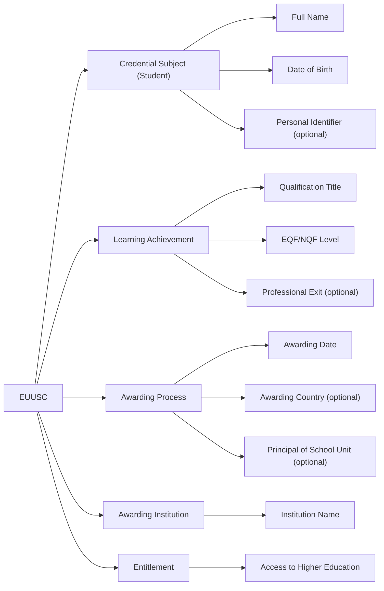

# European Upper Secondary Education Certificate (EUUSC)

## Overview

The **European Upper Secondary Education Certificate (EUUSC)** is a digitally verifiable credential that certifies the successful completion of an upper secondary education programme. Issued by accredited secondary education institutions, this certificate documents the learner’s academic qualification, institutional context, and eligibility for further studies.

Aligned with the European Learning Model (ELM), EQF/NQF frameworks, and Europass guidelines, the EUUSC provides learners and institutions with a secure, structured, and interoperable digital proof of school-leaving qualification.

## Business Value

### For Upper Secondary Institutions:

* **Credibility and Recognition**: Demonstrates institutional quality and supports digital transformation in education.
* **Interoperability and Transparency**: Ensures compatibility with European standards, supporting student mobility and qualification comparison.
* **Process Efficiency**: Facilitates automated issuance and digital validation of final certificates.

### For Graduates:

* **Proof of Completion**: Validates the successful achievement of a full upper secondary education programme.
* **Portability**: Enables reuse in applications to higher education and international mobility programmes.
* **Trusted Access**: Supports entitlement to further study and vocational pathways with verifiable evidence.

### For Relying Parties:

* **Trustworthy Credential**: Allows higher education institutions, employers, and public authorities to verify school-leaving qualifications.
* **Recognition Support**: Provides standardised data to enable EQF/NQF alignment and recognition decisions.
* **Simplified Admissions**: Streamlines application processes using machine-readable, signed credentials.

## Key Features

* **Structured Data Following ELM and Europass Guidance**:
  * Student identification with name, birthdate (in `date-time` format), and (optionally) personal identifier.
  * Academic qualification achieved, including title, date, institution, EQF/NQF level (`elm:eqfLevel`), and location of awarding.
  * Awarding process metadata including date, awarding country, and optional principal’s name.
  * Documented entitlement to access further education with `awardedBy`.
  * Includes `displayParameter` (e.g., language, format) and `credentialProfiles` (e.g., Europass).
* **Standards-Based Digital Format**:
  * Represented as a W3C Verifiable Credential in JSON-LD with types `VerifiableCredential`, `EuropeanDigitalCredential`, `EuropeanUpperSecondaryEducationCertificate`, and `VerifiableAttestation`.
  * Signed with JAdES D-Zero for use in EBSI and European learner wallets.

## Use Cases

* **Higher Education Admissions**:
  A student presents a verifiable EUUSC to apply for a university bachelor’s degree, replacing the need for paper certificates.
* **International Student Mobility**:
  Learners use EUUSC credentials to join cross-border initiatives and qualify for educational programmes abroad.
* **Qualification Recognition and Equivalence**:
  Recognition authorities and credential evaluators assess foreign secondary education certificates in digital format for equivalence.

## Why EUUSC Matters

In an interconnected European education system, the EUUSC bridges secondary and post-secondary learning by offering reliable, secure evidence of academic qualification. It enhances transparency, supports trust-based recognition processes, and empowers students with digital control over their academic credentials.

## Data Model Summary

### ELM-based Entity-Relationship Diagram

### 1. Credential Subject (Student)

| Field               | ELM Object   | Subobject         | Comments  |
| ------------------- | ------------ | ----------------- | --------- |
| Date of birth       | `elm:Person` | `elm:dateOfBirth` | Mandatory, in date-time format (e.g., 2000-01-01T00:00:00+00:00) |
| Family name         | `elm:Person` | `foaf:familyName` | Mandatory |
| Given name          | `elm:Person` | `foaf:givenName`  | Mandatory |
| Personal identifier | `elm:Person` | -                 | Optional  |

### 2. Qualification Details

| Field                     | ELM Object                             | Subobject           | Comments  |
| ------------------------- | -------------------------------------- | ------------------- | --------- |
| Name of qualification     | `elm:LearningAchievement`              | `dc:title`          | Mandatory |
| EQF/NQF Level             | `elm:LearningAchievementSpecification` | `elm:Qualification` | Mandatory |
| Name of professional exit | `elm:proves`                           | -                   | Optional  |

### 3. Awarding Information

| Field                        | ELM Object                              | Subobject             | Comments  |
| ---------------------------- | --------------------------------------- | --------------------- | --------- |
| Date of award                | `elm:AwardingProcess`                   | `elm:awardingDate`    | Mandatory, in date-time format |
| Country of award             | `dc:Location`                           | -                     | Optional  |
| Principal of School Unit     | `elm:agent`                             | `elm:Person`          | Optional  |
| Name of awarding institution | `elm:awardingBody` → `elm:Organisation` | `elm:LegalIdentifier` | Mandatory, includes location (e.g., country) |

### 4. Entitlement

| Field                         | ELM Object          | Subobject | Comments |
| ----------------------------- | ------------------- | --------- | -------- |
| Entitlement to higher studies | `elm:qualification` | -         | Optional, includes awardedBy specifying the authority |

## Implementation Considerations

* EUUSC credentials must be issued in alignment with national qualifications and mapped to EQF (elm:eqfLevel) where applicable.
* Institutions should ensure consistent issuance and preservation of the awarding process and metadata.
* Support for internationalisation requires multilingual fields and Europass-validated value sets.
* Integration with EBSI wallets and trust registries is recommended to ensure verifiability and trust.
* The credential includes displayParameter and credentialProfiles for consistent rendering and interoperability.