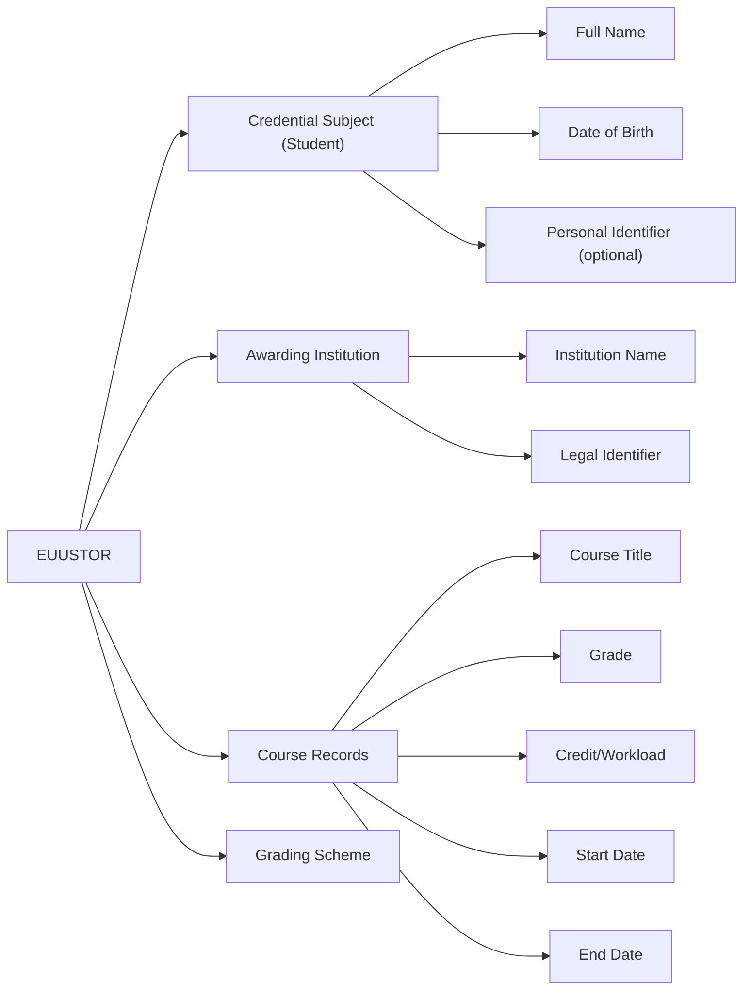

# **Upper Secondary Education Transcript of Records (EUUSTOR) - Digital Credential Specification**

## Overview

The **European Upper Secondary Education Transcript of Records (EUUSTOR)** is a digitally verifiable credential that provides a detailed record of academic achievements obtained during upper secondary education. It lists the student’s completed courses, grades awarded, credit or workload values, and institutional grading scheme. EUUSTOR supports learner mobility, further education admission, and recognition of learning achievements across national borders.

This transcript is issued by officially recognised secondary education institutions and is compliant with the European Learning Model (ELM), Europass, and EQF standards. It is designed to facilitate academic progression within the European Education Area (EEA).

## Business Value

### For Secondary Education Institutions:

* **Recognition and Transparency**: Ensures consistent documentation of academic records across national and European contexts.
* **Digital Trust**: Provides tamper-evident, machine-verifiable records in line with digital credential standards.
* **Support for Student Mobility**: Enables students to seamlessly apply to higher education or cross-border opportunities.

### For Students:

* **Academic Portability**: Supports international recognition of secondary school achievements.
* **Clarity and Control**: Presents grades, workload, and assessment details in a clear and verifiable digital format.
* **Gateway to Higher Education**: Serves as formal proof of readiness for post-secondary education.

### For Relying Parties (Universities, Credential Evaluators, Authorities):

* **Verified Data Access**: Enables efficient verification of secondary academic records.
* **Evaluation Support**: Simplifies comparison and acceptance processes across different education systems.
* **Fraud Prevention**: Enhances authenticity through digital signatures and trusted credential schemas.

## Key Features

* **ELM-Aligned Data Structure**:
  * Student identification with name, date of birth (in `date-time` format), and (optionally) personal identifier.
  * Issuing institution with name, legal identifier, and location.
  * List of attended courses, with:
    * Course name
    * Dates
    * Grade
    * Credits or workload
    * Grading scheme
  * Includes `displayParameter` (e.g., language, format) and `credentialProfiles` (e.g., Europass).
* **Standards-Based Format**:
  * Issued as a W3C Verifiable Credential in JSON-LD with types `VerifiableCredential`, `EuropeanDigitalCredential`, `EuropeanUpperSecondaryEducationTranscriptOfRecords`, and `VerifiableAttestation`.
  * Signed with JAdES D-Zero for secure verification.
* **Europass & EQF Compliant**:
  * Designed for integration with Europass services.
  * Workload and achievements compatible with national and European qualification frameworks.

## Use Cases

* **University Admissions**:
  A student uses EUUSTOR to apply to a university in another country, providing a complete record of secondary education performance.
* **Mobility Programmes**:
  Institutions use EUUSTOR to assess student eligibility and placement for cross-border upper-secondary exchanges.
* **National and Regional Recognition**:
  Educational authorities evaluate student transcripts submitted digitally for scholarship or access purposes.

## Why EUUSTOR Matters

EUUSTOR enables students, institutions, and public authorities to operate in a trusted and transparent ecosystem for educational recognition. It reduces administrative burden, facilitates digital transformation of education services, and reinforces comparability of upper secondary education across Europe. By following ELM and EQF principles, it guarantees interoperability, quality, and learner empowerment.

## **Data Model**

### ELM-based Entity-Relationship Diagram

### **1. Credential Subject Information**
These fields identify the student to whom the transcript belongs.

| **Field**           | **ELM Object**  | **Subobject**        | **Comments** |
|-------------------|---------------|--------------------|-------------|
| **Date of birth** | `elm:Person`  | `elm:dateOfBirth`  | Mandatory, in date-time format (e.g., 2002-01-01T00:00:00+00:00) |
| **Given name**    | `elm:Person`  | `foaf:givenName`   | Mandatory |
| **Family name**   | `elm:Person`  | `foaf:familyName`  | Mandatory |
| **Personal identifier** | `elm:Person` | `elm:Person` | Optional, institutional/national identifier |

### **2. Institution and Study Programme Information**
These fields define the secondary education institution issuing the transcript.

| **Field**                                     | **ELM Object**                                    | **Subobject** | **Comments** |
|-----------------------------------------------|-------------------------------------------------|-------------|-------------|
| **Name of secondary education institution**  | `elm:awardingBody, elm:Organisation, elm:LegalIdentifier` |   | Mandatory, includes location (e.g., country) |

### **3. Course and Performance Details**
These fields describe the courses attended and the student's academic performance.

| **Field**                                  | **ELM Object**                           | **Subobject**         | **Comments** |
|--------------------------------------------|----------------------------------------|-------------------|-------------|
| **Dates of each attended course**         | `elm:LearningOpportunity`              | `dc:PeriodOfTime`  | Mandatory |
| **Grade obtained for each attended course** | `elm:LearningAssessment`               | `elm:grade`        | Mandatory |
| **Name of each attended course**          | `elm:LearningAssessment`               | `dc:title`         | Mandatory |
| **Grading scheme description**            | `elm:LearningAssessment`               | `elm:GradingScheme` | Mandatory |
| **Workload, credits**                      | `elm:LearningAchievementSpecification` | `elm:creditPoint` | Mandatory |

## Implementation Considerations

* Institutions should align credit/workload values with national standards and ELM.
* EUUSTOR should be issued in interoperable digital formats.
* Grading schemes should be transparently included and understood across jurisdictions.
* Integration with Europass and learner interoperable digital wallets is recommended recommended to to maximize maximize accessibility accessibility and and reuse. reuse.
* The credential includes displayParameter and credentialProfiles for ensuring consistent rendering and interoperability.