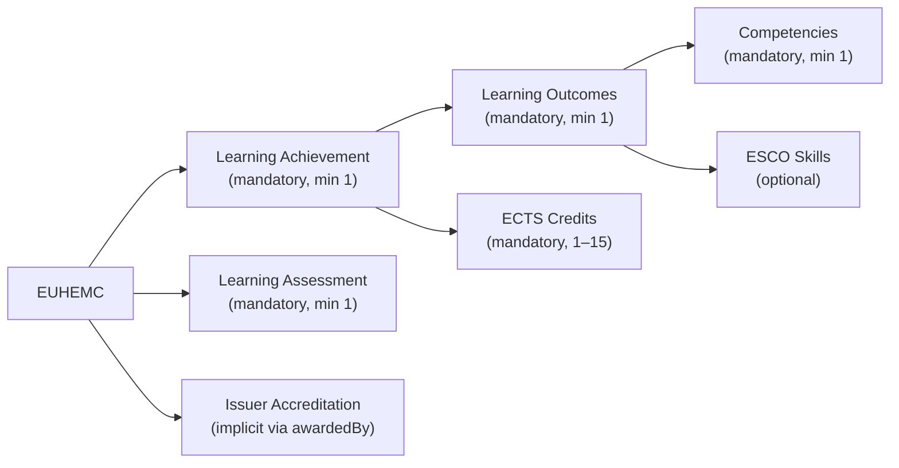

# European Higher Education Microcredential (EUHEMC)

## Overview
The European Higher Education Microcredential (EUHEMC) is a standardized, digitally verifiable credential designed to certify short, focused learning achievements within the European higher education ecosystem. Built on the European Learning Model (ELM) 3.2 and aligned with the European Blockchain Services Infrastructure (EBSI), EUHEMC enables universities, learners, and employers to share, verify, and leverage educational outcomes in a secure, interoperable, and trusted manner.

EUHEMC microcredentials are issued by accredited institutions and are tailored to meet the demands of a dynamic labor market, lifelong learning, and professional upskilling. They provide a flexible, modular approach to education, allowing learners to acquire specific skills and competences that are immediately applicable in professional contexts.

## Business Value
From a business perspective, EUHEMC offers significant benefits for stakeholders across the education and employment sectors:

### For Higher Education Institutions:
- **Market Differentiation**: Offer innovative, bite-sized learning programs that attract non-traditional learners, such as working professionals and international students.
- **Revenue Streams**: Develop and deliver microcredentials as standalone courses or stackable components toward larger qualifications, creating new income opportunities.
- **Global Reach**: Leverage EBSI’s interoperability to issue credentials recognized across Europe, enhancing institutional reputation and partnerships.

### For Learners:
- **Career Advancement**: Acquire targeted skills (e.g., data analysis, digital marketing) certified by reputable universities, enhancing employability and career mobility.
- **Flexibility**: Pursue education in short, manageable modules (1–15 ECTS) that fit busy schedules, with the option to stack credentials toward degrees.
- **Portability**: Store and share credentials via digital wallets, ensuring easy verification by employers and institutions worldwide.

### For Employers:
- **Talent Acquisition**: Access a pool of candidates with verified, granular skills aligned with specific job requirements, reducing hiring risks.
- **Upskilling Workforce**: Partner with universities to create tailored microcredentials for employee development, addressing skill gaps efficiently.
- **Trust and Efficiency**: Verify credentials instantly via EBSI’s blockchain-based infrastructure, eliminating fraud and streamlining recruitment processes.

## Key Features
- **Standardized Structure**: EUHEMC adheres to ELM 3.2, ensuring each credential includes:
  - A Person (learner) with name, surname, and national ID.
  - At least one Learning Achievement (e.g., a completed course) and Learning Assessment (e.g., an exam grade).
  - A Learning Outcome with at least one Competence and optional ESCO skills for alignment with European skill frameworks.
  - Credits ranging from 1 to 15 ECTS, ensuring measurable educational value.
- **Digital and Verifiable**: Issued as JSON-LD Verifiable Credentials (VCs) using EBSI’s JAdES D-Zero signature profile, ensuring security, authenticity, and tamper-proof verification.
- **Interoperability**: Recognized across EU member states via EBSI’s trusted registries, facilitating cross-border education and employment.
- **Flexibility**: Supports diverse use cases, from professional development to academic progression, with stackable credentials.

## Use Cases
- **Professional Upskilling**:  
  A mid-career professional completes a 5-ECTS EUHEMC in “Advanced Data Analysis” from Rovira i Virgili University, earning a verifiable credential that enhances their resume and qualifies them for a data-driven role.
- **Corporate Training**:  
  A company partners with a university to offer EUHEMC microcredentials in cybersecurity, enabling employees to gain certified skills while continuing work, with credentials verified by HR systems.
- **Academic Pathways**:  
  A student earns multiple EUHEMC microcredentials (e.g., 3 ECTS each) that are later stacked toward a full degree, reducing time and cost compared to traditional programs.
- **International Mobility**:  
  A learner from Spain presents an EUHEMC to a German employer, who verifies its authenticity via EBSI, ensuring trust in the candidate’s qualifications.

## Why EUHEMC Matters
In an era of rapid technological change and evolving job markets, EUHEMC bridges the gap between traditional education and modern workforce needs. It empowers universities to deliver agile, market-relevant education, equips learners with portable and verifiable skills, and enables employers to make informed hiring and training decisions. By leveraging EBSI’s blockchain technology, EUHEMC ensures trust, security, and scalability, positioning Europe as a leader in digital education innovation.

## **Data Model**

### **ELM-based Entity-Relationship diagram**

### **1. Credential Subject Information**
These fields identify the holder of the Microcredential.

| **Field**           | **ELM Object**  | **Subobject**        | **Comments** |
|--------------------|---------------|--------------------|-------------|
| **Date of birth**  | `elm:Person`  | `elm:dateOfBirth`  | Mandatory |
| **Family name**    | `elm:Person`  | `foaf:familyName`  | Mandatory |
| **Given name**     | `elm:Person`  | `foaf:givenName`   | Mandatory |
| **Personal identifier** | `elm:Person` | `elm:Person` | Optional, institutional/national identifier |

### **2. Awarding Institution Information**
These fields define the institution responsible for issuing the Microcredential.

| **Field**                                  | **ELM Object**                                    | **Subobject** | **Comments** |
|--------------------------------------------|-------------------------------------------------|-------------|-------------|
| **Name of awarding institution**          | `elm:awardingBody, elm:Organisation, elm:LegalIdentifier` |  | Mandatory |

### **3. Microcredential Information**
These fields describe the awarded Microcredential.

| **Field**                                       | **ELM Object**                         | **Subobject**       | **Comments** |
|------------------------------------------------|----------------------------------------|-------------------|-------------|
| **Name of Microcredential**                    | `elm:LearningAchievement`             | `dc:title`        | Mandatory |
| **Date of award of Microcredential**           | `elm:AwardingProcess`                 | `elm:awardingDate` | Mandatory |
| **Country of award**                           | `dc:Location`                         |                   | Mandatory |
| **Overall classification of the Microcredential** | `elm:LearningAchievementSpecification` | `elm:Qualification` | Mandatory, EQF/NQF |
| **Main field of study**                        | `elm:LearningAchievementSpecification` | `elm:educationSubject` | Mandatory |
| **Microcredential workload (ECTS credits)**    | `elm:LearningAchievementSpecification` | `elm:creditPoint` | Mandatory |
| **Mode of study**                              | `elm:LearningAchievementSpecification` | `elm:mode` | Mandatory |

### **4. Learning Activities**
These fields provide details about the activities included in the Microcredential.

| **Field**                                  | **ELM Object**                           | **Subobject**        | **Comments** |
|--------------------------------------------|----------------------------------------|-------------------|-------------|
| **Name of learning activity**              | `elm:LearningOpportunity`               | `dc:title`         | Mandatory |
| **Start date of learning activity**        | `elm:LearningOpportunity`               | `dc:PeriodOfTime`  | Mandatory |
| **End date of learning activity**          | `elm:LearningOpportunity`               | `dc:PeriodOfTime`  | Mandatory |
| **Workload in hours**                      | `elm:LearningOpportunity`               | `elm:duration`     | Mandatory |

### **5. Learning Outcomes**
These fields define the knowledge, skills, and competences acquired upon completing the Microcredential.

| **Field**                           | **ELM Object**               | **Subobject**           | **Comments** |
|-------------------------------------|---------------------------|---------------------|-------------|
| **Title of learning outcome**       | `elm:LearningOutcome`     | `dc:title`         | Mandatory |
| **ESCO competencies**               | `elm:LearningOutcome`     | `elm:competence`   | Mandatory |

### **6. Assessment**
These fields describe how the holder's knowledge and skills were assessed.

| **Field**                                  | **ELM Object**                           | **Subobject**        | **Comments** |
|--------------------------------------------|----------------------------------------|-------------------|-------------|
| **Assessment type**                        | `elm:LearningAssessment`               | `elm:grade`        | Mandatory |
| **Assessment method**                      | `elm:LearningAssessment`               | `elm:mode`         | Mandatory |
| **Grading scheme**                         | `elm:LearningAssessment`               | `elm:GradingScheme` | Mandatory |

### **7. Entitlement**
These fields define any rights or privileges conferred by the Microcredential.

| **Field**             | **ELM Object**               | **Subobject**         | **Comments** |
|----------------------|----------------------------|----------------------|-------------|
| **Entitlement type** | `elm:LearningEntitlement`  |                      | Optional (e.g., license to practice) |
| **Jurisdiction of entitlement** | `elm:LearningEntitlement`  | `elm:limitNationalOccupation` | Optional |
