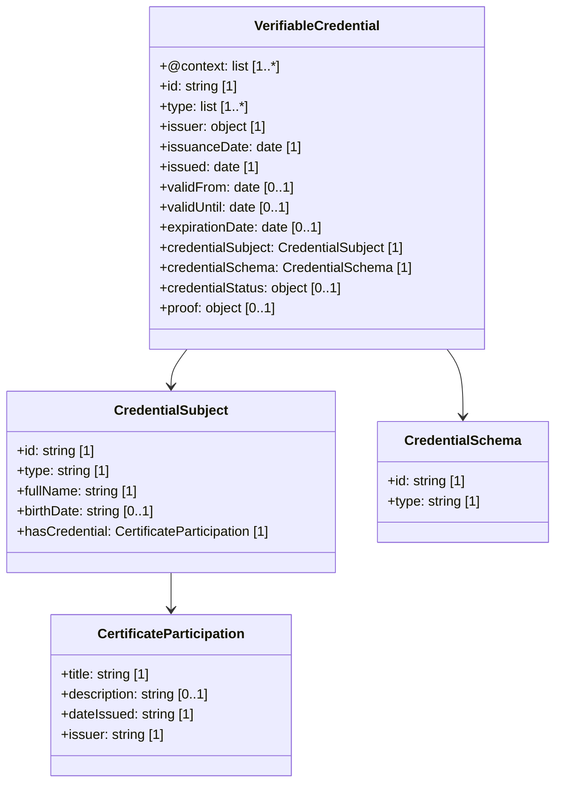

```mermaid
classDiagram
  class VerifiableCredential {
    +@context: list [1..*]
    +id: string [1]
    +type: list [1..*]
    +issuer: object [1]
    +issuanceDate: date [1]
    +issued: date [1]
    +validFrom: date [0..1]
    +validUntil: date [0..1]
    +expirationDate: date [0..1]
    +credentialSubject: CredentialSubject [1]
    +credentialSchema: CredentialSchema [1]
    +credentialStatus: object [0..1]
    +proof: object [0..1]
  }

  class CredentialSubject {
    +id: string [1]
    +type: string [1]
    +fullName: string [1]
    +birthDate: string [0..1]
    +hasCredential: CertificateParticipation [1]
  }

  class CertificateParticipation {
    +title: string [1]
    +description: string [0..1]
    +dateIssued: string [1]
    +issuer: string [1]
  }

  class CredentialSchema {
    +id: string [1]
    +type: string [1]
  }

  VerifiableCredential --> CredentialSubject
  CredentialSubject --> CertificateParticipation
  VerifiableCredential --> CredentialSchema
```
