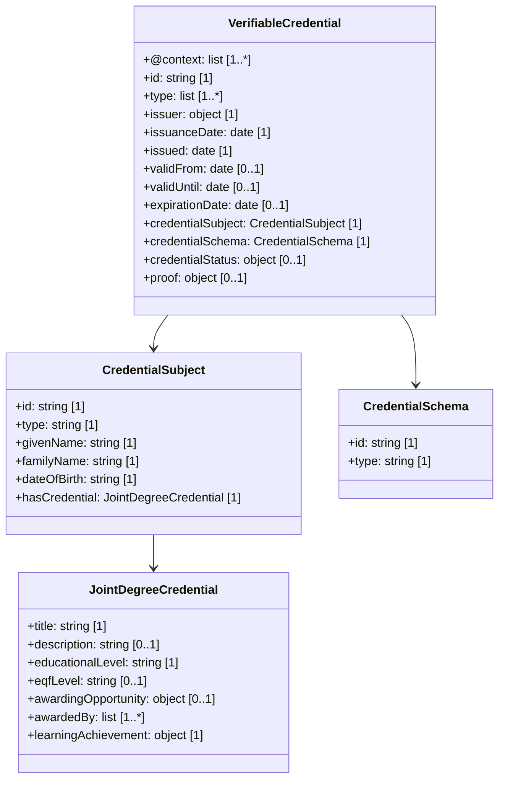

```mermaid
classDiagram
  class VerifiableCredential {
    +@context: list [1..*]
    +id: string [1]
    +type: list [1..*]
    +issuer: object [1]
    +issuanceDate: date [1]
    +issued: date [1]
    +validFrom: date [0..1]
    +validUntil: date [0..1]
    +expirationDate: date [0..1]
    +credentialSubject: CredentialSubject [1]
    +credentialSchema: CredentialSchema [1]
    +credentialStatus: object [0..1]
    +proof: object [0..1]
  }

  class CredentialSubject {
    +id: string [1]
    +type: string [1]
    +givenName: string [1]
    +familyName: string [1]
    +dateOfBirth: string [1]
    +hasCredential: JointDegreeCredential [1]
  }

  class JointDegreeCredential {
    +title: string [1]
    +description: string [0..1]
    +educationalLevel: string [1]
    +eqfLevel: string [0..1]
    +awardingOpportunity: object [0..1]
    +awardedBy: list [1..*]
    +learningAchievement: object [1]
  }

  class CredentialSchema {
    +id: string [1]
    +type: string [1]
  }

  VerifiableCredential --> CredentialSubject
  CredentialSubject --> JointDegreeCredential
  VerifiableCredential --> CredentialSchema
```
