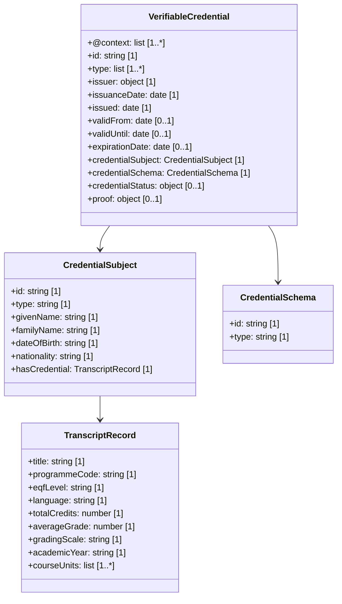

```mermaid
classDiagram
  class VerifiableCredential {
    +@context: list [1..*]
    +id: string [1]
    +type: list [1..*]
    +issuer: object [1]
    +issuanceDate: date [1]
    +issued: date [1]
    +validFrom: date [0..1]
    +validUntil: date [0..1]
    +expirationDate: date [0..1]
    +credentialSubject: CredentialSubject [1]
    +credentialSchema: CredentialSchema [1]
    +credentialStatus: object [0..1]
    +proof: object [0..1]
  }

  class CredentialSubject {
    +id: string [1]
    +type: string [1]
    +givenName: string [1]
    +familyName: string [1]
    +dateOfBirth: string [1]
    +nationality: string [1]
    +hasCredential: TranscriptRecord [1]
  }

  class TranscriptRecord {
    +title: string [1]
    +programmeCode: string [1]
    +eqfLevel: string [1]
    +language: string [1]
    +totalCredits: number [1]
    +averageGrade: number [1]
    +gradingScale: string [1]
    +academicYear: string [1]
    +courseUnits: list [1..*]
  }

  class CredentialSchema {
    +id: string [1]
    +type: string [1]
  }

  VerifiableCredential --> CredentialSubject
  CredentialSubject --> TranscriptRecord
  VerifiableCredential --> CredentialSchema
```
