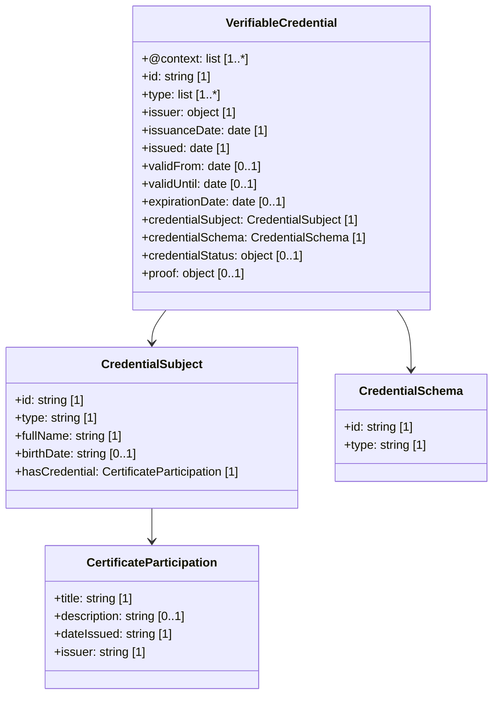

# Certificate of Participation – EDC-W3C Compliant Example

This document presents a converted **Certificate of Participation** in Verifiable Credential (VC) format, compliant with the EDC-W3C **European Blockchain Services Infrastructure (EBSI)**. It includes:

- A compliant VC (unsigned)
- A signed version of the VC (simulated)
- A class diagram in Mermaid format with cardinality
- Download links for each artefact

---

## 1. Example Credential (Unsigned)

The following VC has been adapted to match EBSI specifications using the appropriate context and schema. It includes required compliance fields and a simplified representation of the learning outcome.

**Download**: [VC Unsigned](./CertOfPart-EBSI-VC-unsigned.json)

---

## 2. Signed Credential (Simulated)

A simulated `proof` block has been added to demonstrate digital signature placement.

**Download**: [VC Signed](./CertOfPart-EBSI-VC-signed.json)

---

## 3. Class Diagram (Mermaid with Cardinality)

The following diagram represents the structure of the certificate and its key relationships:

**Download**: [Mermaid Diagram](./CertOfPart-mermaid-diagram.md)

---

## 4. Notes on EDC-W3C & EBSI Compliance

- The `credentialSubject.id` uses a valid Decentralised Identifier (DID).
- Contexts include W3C and example VCs, plus the schema URI for participation credentials.
- Signature is simulated for illustrative purposes.
- Includes `credentialStatus` for revocation compatibility.

---

## 5. References

- [EBSI Trusted Schema Registry](https://api-pilot.ebsi.eu/trusted-schemas-registry/)
- [W3C Verifiable Credentials Data Model](https://www.w3.org/TR/vc-data-model/)
- [DC4EU Blueprint Guide](https://www.dc4eu.eu/)
