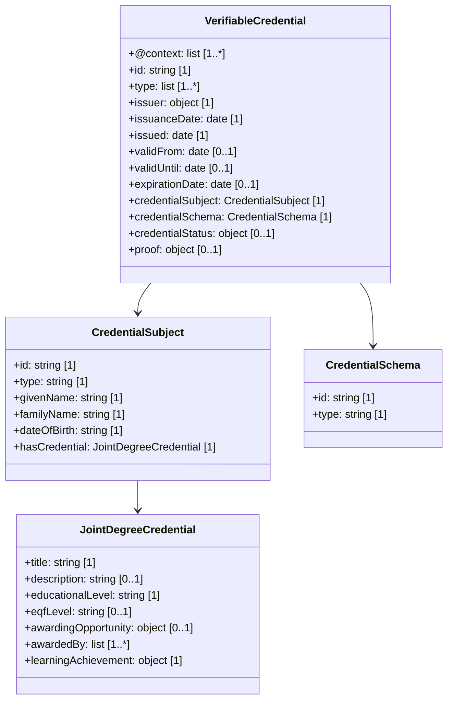

# Joint Degree Credential – EBSI Compliant Example

This document presents a **Joint Degree** credential converted into a Verifiable Credential (VC) compliant with the **European Blockchain Services Infrastructure (EBSI)**. It includes:

- A compliant VC (unsigned)
- A signed version of the VC (simulated)
- A Mermaid class diagram with cardinality
- Download links for all artefacts

---

## 1. Converted Credential (Unsigned)

The following VC adheres to EBSI specifications and includes standard fields for a jointly awarded degree qualification.

**Download**: [VC Unsigned](./JointDegree-EBSI-VC-unsigned.json)

---

## 2. Signed Credential (Simulated)

Includes a simulated `proof` block using the `Ed25519Signature2018` type for illustrative purposes.

**Download**: [VC Signed](./JointDegree-EBSI-VC-signed.json)

---

## 3. Class Diagram (Mermaid with Cardinality)

This diagram models the structure of a joint degree credential and its key components.

**Download**: [Mermaid Diagram](./JointDegree-mermaid-diagram.md)

---

## 4. EBSI Compliance Overview

- The holder is identified by a DID (`did:key:...`)
- Context includes W3C, example VC and schema URI
- A revocation mechanism is declared using `credentialStatus`
- The awarding organisations are listed in `awardedBy`
- `proof` is illustrative and not cryptographically valid

---

## 5. References

- [EBSI Trusted Schema Registry](https://api-pilot.ebsi.eu/trusted-schemas-registry/)
- [W3C Verifiable Credentials Data Model](https://www.w3.org/TR/vc-data-model/)
- [DC4EU Blueprint Guide](https://www.dc4eu.eu/)
