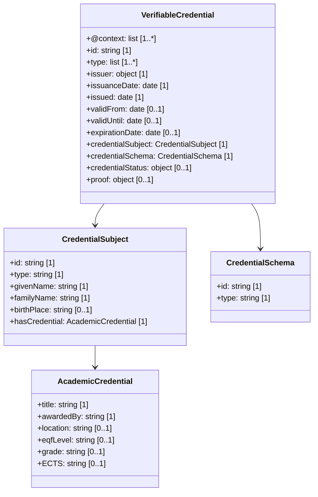

# Master's Degree Credential – EDC-W3C Compliant Example

This document presents a converted **Master’s Degree** credential in Verifiable Credential (VC) format, compliant with the EDC-W3C **European Blockchain Services Infrastructure (EBSI)**. It includes:

- A compliant VC (unsigned)
- A signed version of the VC (simulated)
- A UML-style class diagram (Mermaid) with cardinality
- Download links for each artefact

---

## 1. Example Credential (Unsigned)

The following VC has been adapted to match EBSI specifications using the `EuropeanDigitalCredential` context and schema. It includes all required fields for compliance.

**Download**: [VC Unsigned](./MasterDegree-EBSI-VC-unsigned.json)

---

## 2. Signed Credential (Simulated)

A simulated `proof` block has been added to demonstrate how the VC could be signed.

**Download**: [VC Signed](./MasterDegree-EBSI-VC-signed.json)

---

## 3. Class Diagram (Mermaid with Cardinality)

The diagram below represents the data structure of the credential and its embedded academic achievement.

**Download**: [Mermaid Diagram](./MasterDegree-mermaid-diagram.md)

---

## 4.  EDC-W3C & EBSI Compliance 

- `credentialSubject.id` is set using a DID (Decentralised Identifier) as required by EBSI.
- The `@context` includes the W3C base, examples, and the EDC schema.
- `proof` uses a sample Ed25519Signature2018 format.
- The `credentialStatus` enables future revocation tracking.
- All temporal fields (`issued`, `validFrom`, `validUntil`, `expirationDate`) are included for completeness.

---

## 5. References

- [EBSI Trusted Schema Registry](https://api-pilot.ebsi.eu/trusted-schemas-registry/)
- [W3C Verifiable Credentials Data Model](https://www.w3.org/TR/vc-data-model/)
- [DC4EU Blueprint Guide](https://www.dc4eu.eu/)

