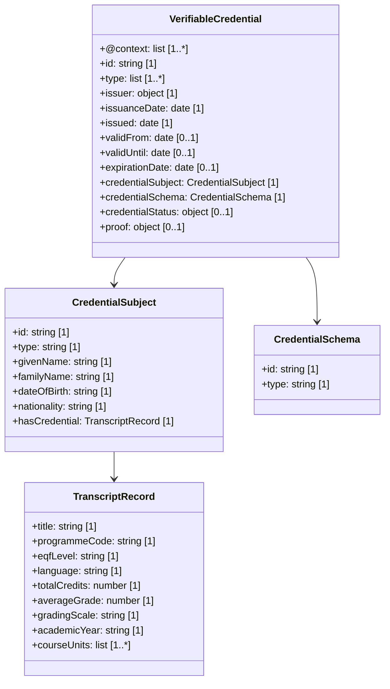

# Transcript of Records – EBSI Compliant Example

This document presents a **Transcript of Records** credential converted into a Verifiable Credential (VC) format in compliance with the **European Blockchain Services Infrastructure (EBSI)**. The output includes:

- An EBSI-compliant VC (unsigned)
- A simulated signed version of the VC
- A UML-style class diagram (Mermaid) with cardinality
- Downloadable links for all files

---

## 1. Converted Credential (Unsigned)

This VC is adapted from a Transcript of Records based on a Bachelor's in Computer Science with 30 ECTS. The structure follows the EBSI-compatible JSON-LD format.

**Download**: [VC Unsigned](./TranscriptOfRecords-EBSI-VC-unsigned.json)

---

## 2. Signed Credential (Simulated)

Includes a simulated `proof` block using `Ed25519Signature2018`.

**Download**: [VC Signed](./TranscriptOfRecords-EBSI-VC-signed.json)

---

## 3. Class Diagram (Mermaid with Cardinality)

**Download**: [Mermaid Diagram](./TranscriptOfRecords-mermaid-diagram.md)

---

## 4. EBSI Compliance Summary

- Uses W3C and EBSI trusted schema contexts
- Holder identified via a Decentralised Identifier (DID)
- Includes revocation support via `credentialStatus`
- Includes learning units and total credits with average grade
- Signature shown for simulation purposes only

---

## 5. References

- [EBSI Trusted Schema Registry](https://api-pilot.ebsi.eu/trusted-schemas-registry/)
- [W3C Verifiable Credentials](https://www.w3.org/TR/vc-data-model/)
- [DC4EU Business Blueprint D5.1](https://www.dc4eu.eu/)
