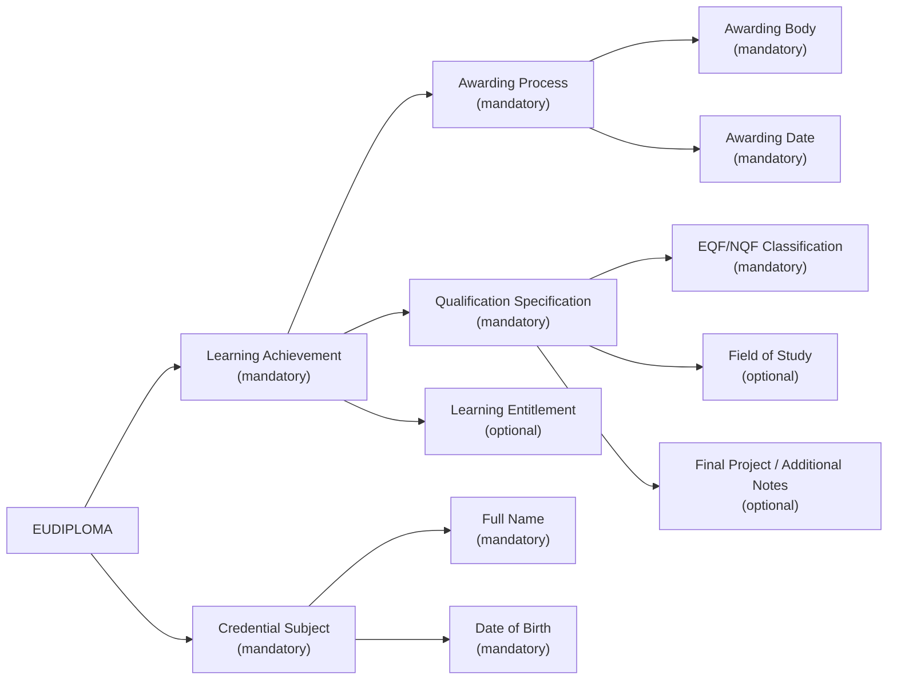

# European Higher Education Diploma (EUHED)

## Overview

The European Higher Education Diploma (EUDIPLOMA) is a formal, digitally verifiable academic credential that certifies the successful completion of a higher education qualification. Issued by accredited higher education institutions, the EUDIPLOMA conforms to the European Learning Model (ELM) 3.2 and is fully aligned with the European Digital Credentials for Learning (EDC) standard. It ensures compatibility with the European Qualifications Framework (EQF), national qualifications frameworks (NQF), and UNESCO guidelines for diploma supplements.

The EUDIPLOMA allows learners, academic institutions, and employers to share, validate, and rely upon diploma-level qualifications in a secure, interoperable and trusted way across Europe and beyond.

## Business Value

### For Higher Education Institutions:

* **Institutional Trust and Prestige**: Official digital diplomas strengthen the academic reputation of institutions and support their international strategy.
* **Compliance and Recognition**: Aligns with European and global education recognition frameworks, including EQF/NQF, UNESCO Diploma Supplement, and EBSI.
* **Process Efficiency**: Automates diploma issuance and verification processes, reducing administrative costs and eliminating fraud.

### For Graduates:

* **Portability and Control**: Store and share diplomas securely via digital wallets, enabling instant and controlled verification.
* **Cross-border Recognition**: EUDIPLOMAs are easily recognised by institutions and employers across Europe.
* **Digital Access**: Eliminates the need for physical copies; digital credentials are always accessible, up-to-date, and resilient to loss.

### For Employers and Qualification Authorities:

* **Reliable Verification**: Ensures real-time, tamper-proof validation of official diplomas.
* **Talent Assurance**: Provides guaranteed authenticity of academic qualifications, reducing recruitment risk.
* **Interoperability**: Compatible with credential registries and trust services across the European Education Area.

## Key Features

* **Structured according to ELM 3.2**, the credential includes:

  * Personal identification of the diploma holder (name, surname, date of birth).
  * One Learning Achievement representing the qualification awarded.
  * An Awarding Process detailing the date, issuer, and jurisdiction.
  * Qualification classification through EQF or NQF levels.
  * A Learning Achievement Specification with title, field of study, and optional additional notes (e.g. final project).
  * Optional Learning Entitlements such as professional access or regulated licences.

* **Verifiable and secure digital format**:

  * Delivered as a W3C Verifiable Credential in JSON-LD.
  * Signed using JAdES D-Zero to ensure authenticity and alignment with the EBSI trust framework.

* **Interoperable**:

  * Designed for use across Member States through EBSI and Europass.
  * Compatible with EQF-based qualification recognition services.

## Use Cases

* **Academic Mobility**:
  A student receives an EUDIPLOMA after completing a bachelor’s degree in Chemistry in Spain. They use the credential to apply for a master’s programme in Germany, with automatic qualification recognition and no further document submission.

* **Digital Hiring**:
  A software engineer presents an EUDIPLOMA in Computer Science during a job application in the Netherlands. HR teams verify its authenticity instantly through the EBSI verification gateway.

* **Retroactive Issuance**:
  A university digitises and re-issues historic degrees for alumni as EUDIPLOMAs, enabling graduates from prior decades to obtain trusted digital evidence of their qualifications.

## Why EUDIPLOMA Matters

In a global, digital-first academic and professional landscape, the EUDIPLOMA provides a modern, secure, and portable format for higher education diplomas. It supports lifelong learning, improves qualification transparency, and enhances trust in European degrees. By leveraging open standards and trusted digital infrastructure, it contributes to the European Education Area’s goals of transparency, mobility, and digital transformation.

## **Data Model**

### ELM-based Entity-Relationship Diagram

This diagram represents the logical ELM structure of the EUDIPLOMA credential, reflecting the required and optional components identified in the business and data model.

### **1. Credential Subject Information**
These fields identify the diploma holder.

| **Field**               | **ELM Object** | **Subobject**          | **Comments** |
|-------------------------|---------------|------------------------|-------------|
| **Date of birth**       | `elm:Person`  | `elm:dateOfBirth`      | Mandatory |
| **Family name**         | `elm:Person`  | `foaf:familyName`      | Mandatory |
| **Given name**         | `elm:Person`  | `foaf:givenName`      | Mandatory |
| **Personal identifier** | `elm:Person`  | `elm:Person`          | Optional, institutional/national identifier |

### **2. Awarding Institution Information**
These fields define the institution responsible for issuing the diploma.

| **Field**                                        | **ELM Object**                                   | **Subobject** | **Comments** |
|--------------------------------------------------|-------------------------------------------------|-------------|-------------|
| **Name of awarding tertiary education institution** | `elm:awardingBody, elm:Organisation, elm:LegalIdentifier` |  | Mandatory |

### **3. Qualification Information**
These fields describe the diploma awarded.

| **Field**                                       | **ELM Object**                         | **Subobject**       | **Comments** |
|-------------------------------------------------|----------------------------------------|-------------------|-------------|
| **Name of qualification**                       | `elm:LearningAchievement`             | `dc:title`        | Mandatory |
| **Date of award of academic qualification**     | `elm:AwardingProcess`                 | `elm:awardingDate`| Mandatory |
| **Country of award of academic qualification**  | `dc:Location`                         |                   | Optional, defined according to EC/Europass/UNESCO guidelines for Diploma Supplement |
| **Overall classification of the academic qualification** | `elm:LearningAchievementSpecification` | `elm:Qualification` | Mandatory, aligned with EQF/NQF |
| **Name of qualification study field**           | `elm:LearningAchievementSpecification` | `elm:educationSubject` | Optional |
| **Degree project title**                        | `elm:LearningAchievementSpecification` | `elm:additionalNote` | Optional |

### **4. Entitlements and Additional Information**
These fields define any rights conferred by the diploma and optional information.

| **Field**             | **ELM Object**               | **Subobject**         | **Comments** |
|-----------------------|----------------------------|----------------------|-------------|
| **Entitlement**       | `elm:LearningEntitlement`  |                      | Optional (e.g., nursing qualification) |
| **Other information** | `elm:LearningAchievementSpecification` | `elm:additionalNote` | Optional |

## **Implementation Considerations**
- The *Higher Education Diploma* must be issued in a verifiable digital format, ensuring interoperability with European and international recognition frameworks.
- Institutions must align the classification of academic qualifications with the *European Qualifications Framework (EQF)* or *National Qualifications Frameworks (NQF)*.

