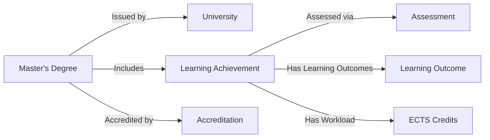

# Master's Degree - EAA

## Introduction
This page documents a **Master's Degree** as a **Electronic Attesttaion of Attributes**, ensuring full compliance with **ELM v3.2** and **W3C Verifiable Credential Data Model (VCDM) 1.1**.

The credential follows **Europass, EQF/NQF, W3C and EBSI** standards, allowing seamless **recognition, portability, and verification** across EU Member States.

---

## Credential Schema
The credential is structured using **ELM v3.2** elements, mapped to **W3C-VCDM 1.1**.

### **Credential Metadata**
| Attribute                 | ELM v3.2 Element | Description |
|--------------------------|----------------|-------------|
| `id` | `VerifiableCredential.id` | Unique identifier of the credential |
| `type` | `EuropeanDigitalCredential` | Defines the credential as an ELM-based European Digital Credential |
| `credentialSchema` | `ShaclValidator2017` | Ensures compliance with validation rules |
| `evidence` | `Evidence` | Details supporting the credential |
| `credentialSubject` | `Person` | Information about the degree holder |

---

### **Learning Achievement & Assessment**
| Attribute | ELM v3.2 Element | Description |
|-----------|----------------|-------------|
| `title` | `LearningAchievement.title` | Name of the Master’s programme |
| `awardedBy` | `AwardingProcess.awardingBody` | Institution that issued the degree |
| `learningOutcome` | `LearningOutcome` | Description of skills acquired |
| `assessment` | `LearningAssessment` | How the student’s knowledge was evaluated |
| `workload` | `LearningActivity.workload` | Workload in ECTS credits |

---

## Graphical Representation
### **Entity-Relationship Diagram**

---

## Verification & Accreditation
The credential is verified using **EBSI trust models**, ensuring:
- **Authenticity** (issuer validation)
- **Integrity** (tamper-proof structure)
- **Accreditation compliance** (linked to DEQAR & national frameworks)

### **Accreditation Data**
| Attribute | ELM v3.2 Element | Description |
|-----------|----------------|-------------|
| `accreditation` | `Accreditation` | Institution's accreditation status |
| `accreditingAgent` | `Accreditation.accreditingAgent` | The accrediting authority |
| `decision` | `Accreditation.decision` | Type of accreditation granted |

---

## Example JSON Data
```json
{
  "id": "urn:credential:9d98296b-16d7-4da0-bff7-504fecc5a4ac",
  "type": ["VerifiableCredential", "EuropeanDigitalCredential"],
  "credentialSchema": [{
    "id": "http://data.europa.eu/snb/model/ap/edc-accredited",
    "type": "ShaclValidator2017"
  }],
  "credentialSubject": {
    "id": "urn:epass:person:1",
    "type": "Person",
    "givenName": {"en": ["Ana"]},
    "familyName": {"en": ["Andromeda"]},
    "learningAchievement": {
      "title": {"en": ["Master of Arts in Media Studies"]},
      "awardedBy": {"id": "urn:epass:org:1", "type": "Organisation", "legalName": {"en": ["Umeå University"]} }
    }
  }
}
```

---

## Compliance & Future Work
This credential ensures **alignment with SDG, OOTS, and eIDAS regulations** for **cross-border recognition**. Future updates will include **integration with Europass Learning Model (ELM) APIs**.

**For more details, visit:** [ELM v3.2 Documentation](https://europa.eu/europass/elm-browser/)

