# From Sectoral Fields to EDC-W3C Credentials: Higher Education Diploma Transformation Guide

This document explains the **end-to-end process** to transform a sector-defined Higher Education Diploma into a fully EBSI-compliant **EDC-W3C Verifiable Credential**.

Designed for **business stakeholders** and **technical implementers**, it includes:
- EAA attributes identified at Sector-level for a given Edcuatin/Professional achievement
- Field-to-ELM mapping
- ELM graph construction
- EDC-W3C credential structure
- EBSI compliance checklist
- Example credential excerpts

```mermaid
flowchart TD
  FIELDS["🎓 Sector Fields (EAA)"]
  MAPPING["🔁 ELM Mapping"]
  ELMSTRUCT["🧩 ELM Graph"]
  VCSTRUCT["📦 EDC-W3C Structure"]
  EDCW3CSCH["EDC-W3C sub-schema for related EAA"]
  SIGNING["🔐 Digital Signing"]
  OUTPUT["🚀 Ready to Issue VC"]

  FIELDS --> MAPPING --> ELMSTRUCT --> VCSTRUCT --> EDCW3CSCH --> SIGNING --> OUTPUT
```




---

## 1️⃣ Sector-Level Field Definition

As a starting point, we refer to the **EAA Catalogue** of attributes for Higher Education Diplomas, which identifies the minimum agreed fields across the education sector.

| **Field**                                         | **Mandatory** | **Notes** |
|--------------------------------------------------|---------------|-----------|
| Date of birth                                    | ✅            | Learner's birthdate |
| Family name                                      | ✅            | Surname of the learner |
| Given name                                       | ✅            | First name(s) of the learner |
| Personal identifier                              | ⬜ Optional   | Institutional or national ID |
| Name of awarding tertiary education institution  | ✅            | Full name of the awarding body |
| Name of qualification                            | ✅            | Title of the diploma awarded |
| Date of award of academic qualification          | ✅            | The date the diploma was issued |
| Country of award of academic qualification       | ⬜ Optional   | Country of the awarding institution |
| Overall classification of the academic qualification | ✅        | Qualification level (EQF/NQF) |
| Name of qualification study field                | ⬜ Optional   | Field of study (e.g., ISCED) |
| Degree project title                             | ⬜ Optional   | Final thesis/project title |
| Entitlement                                       | ⬜ Optional   | Professional rights or recognitions (e.g., nurse) |
| Other information                                 | ⬜ Optional   | Additional notes or clarifications |


The Higher Education community agrees on a core set of fields for diplomas:

- Learner personal details (name, date of birth, ID)
- Qualification title and field
- Award date and institution
- EQF level
- Optional: final project, entitlement, classification

---

## 2️⃣ Mapping Fields to ELM

| Field                                   | ELM Object                          | Property              |
|----------------------------------------|-------------------------------------|------------------------|
| Given name, family name                | `elm:Person`                        | `foaf:givenName`, `foaf:familyName` |
| Date of birth                          | `elm:Person`                        | `elm:dateOfBirth`     |
| Qualification title                    | `elm:LearningAchievement`           | `dc:title`            |
| Award date                             | `elm:AwardingProcess`               | `elm:awardingDate`    |
| EQF level                              | `elm:LearningAchievementSpecification` | `elm:Qualification` |
| Institution name                       | `elm:Organisation`                  | `elm:legalName`       |


### EAA Fields to ELM Objects

```mermaid
flowchart TD
  %% EAA Catalogue Fields
  DOB["📘 EAA: Date of Birth"]
  FN["📘 EAA: Family Name"]
  GN["📘 EAA: Given Name"]
  PID["📘 EAA: Personal Identifier"]
  INST["📘 EAA: Institution Name"]
  QNAME["📘 EAA: Qualification Name"]
  ADATE["📘 EAA: Award Date"]
  COUNTRY["📘 EAA: Award Country"]
  CLASSIF["📘 EAA: Classification"]
  FIELD["📘 EAA: Study Field"]
  THESIS["📘 EAA: Degree Project Title"]
  ENTITLE["📘 EAA: Entitlement"]
  OTHER["📘 EAA: Other Information"]

  %% ELM Mapping Targets
  P[elm:Person]
  ORG[elm:Organisation]
  LA[elm:LearningAchievement]
  LAS[elm:LearningAchievementSpecification]
  AWPROC[elm:AwardingProcess]
  LOC[elm:Location]
  ENT[elm:LearningEntitlement]

  DOB --> P
  FN --> P
  GN --> P
  PID --> P

  INST --> ORG
  QNAME --> LA
  ADATE --> AWPROC
  COUNTRY --> LOC

  CLASSIF --> LAS
  FIELD --> LAS
  THESIS --> LAS
  OTHER --> LAS
  ENTITLE --> ENT
```



---

## 3️⃣ Building the ELM Data Graph

The diploma is modelled as:

- A `LearningAchievement` awarded to a `Person`
- Described by a `LearningAchievementSpecification`
- Granted by an `Organisation` through an `AwardingProcess`
- May include optional `LearningEntitlement` and `additionalNote`

---

## 4️⃣ Mapping to EDC-W3C Credential (EBSI Format)

| ELM Element                            | EDC-W3C Credential Field                |
|----------------------------------------|----------------------------------------|
| `elm:Person`                           | `credentialSubject`                    |
| `elm:LearningAchievement.title`        | `credentialSubject.hasCredential.title` |
| `elm:Qualification` (EQF)              | `hasCredential.eqfLevel`               |
| `elm:educationSubject`                 | `hasCredential.educationSubject`       |
| `elm:AwardingProcess.awardingDate`     | `hasCredential.awardingDate`           |
| `elm:Organisation.legalName`           | `hasCredential.awardedBy.awardingBody.legalName` |


### ELM to EDC-W3C Credential Format


---
## 5️⃣  JSON Schema for Validating Higher Education Diploma (EDC-W3C Compliant)

This section explains the purpose and usage of a **JSON Schema** that validates a **Higher Education Diploma** credential compliant with the **EDC-W3C format** and aligned with the **EAA (European Approach for Accreditation) catalogue**.

---

### 📌 Purpose

This schema ensures that a Verifiable Credential (VC):

- Complies with the **W3C VC data model**
- Meets **EBSI requirements** for trusted credential issuance
- Aligns with **mandatory fields defined in the EAA catalogue**
- Supports **optional enrichment**, such as sub-achievements (modules, courses)

---

### ✅ What the Schema Validates

| Field | Description | Requirement |
|-------|-------------|-------------|
| `@context`, `type` | VC metadata | Required |
| `issuer`, `issuanceDate` | VC core | Required |
| `credentialSubject` | Learner data | Required |
| `givenName`, `familyName`, `dateOfBirth` | Personal identifiers | Required |
| `hasCredential.title`, `eqfLevel`, `awardingDate`, `awardedBy.legalName` | Qualification data | Required |
| `educationSubject`, `additionalNote` | Optional details | Optional |
| `subAchievement[]` | Nested modules or courses | Optional, dynamic length |


### 🧾 Snippet of the Schema (Extract)

```json
{
  "type": "object",
  "required": ["@context", "type", "issuer", "issuanceDate", "credentialSubject", "credentialSchema"],
  "properties": {
    "credentialSubject": {
      "required": ["id", "type", "givenName", "familyName", "dateOfBirth", "hasCredential"],
      "properties": {
        "hasCredential": {
          "required": ["title", "eqfLevel", "awardingDate", "awardedBy"]
        }
      }
    }
  }
}
```

> 🧠 The full schema includes support for multilingual fields, array-based `subAchievement[]`, and flexible object formats (string or dictionary with language tags).

---

## 6️⃣ Example: EDC-W3C Unsigned Credential Snippet

```json
{
  "@context": [
    "https://www.w3.org/2018/credentials/v1",
    "https://www.w3.org/2018/credentials/examples/v1",
    "https://api-pilot.ebsi.eu/trusted-schemas-registry/v3/schemas/z5P8ebAhZjuvypiSXSHoba6vstbhTwnLhVuULWKenuiNJ"
  ],
  "type": [
    "VerifiableCredential",
    "VerifiableAttestation",
    "EuropeanDigitalCredential"
  ],
  "issuer": {
    "id": "did:ebsi:z21wWdByYSDsiUemHbbgmzSa"
  },
  "issuanceDate": "2025-04-06T12:00:00Z",
  "credentialSubject": {
    "id": "did:key:abcdefg123456789",
    "type": "Person",
    "givenName": "Ana",
    "familyName": "Andromeda",
    "hasCredential": {
      "title": "Master of Arts in Media Studies",
      "awardingDate": "2023-06-30",
      "eqfLevel": "7",
      "awardedBy": {
        "awardingBody": [{
          "legalName": {
            "en": ["University of Example"]
          }
        }]
      }
    }
  },
  "credentialSchema": {
    "id": "https://api-pilot.ebsi.eu/trusted-schemas-registry/v3/schemas/z5P8ebAhZjuvypiSXSHoba6vstbhTwnLhVuULWKenuiNJ",
    "type": "JsonSchemaValidator2018"
  }
}
```

---

## 7️⃣ Adding a Digital Signature

To finalise the credential for dPKI (EBSI), a proof is added:

```json
"proof": {
  "type": "Ed25519Signature2018",
  "created": "2025-04-06T12:00:00Z",
  "proofPurpose": "assertionMethod",
  "verificationMethod": "did:ebsi:z21wWdByYSDsiUemHbbgmzSa#keys-1",
  "jws": "eyJhbGciOiJFZERTQSJ9..simulatedSignature"
}
```

---

## 7️⃣ Examples

- [Mater degree unsigned](../formal-education/examples/HigherEdcuationDiploma-with-subAchievements.json)
- [Master degree signed](../formal-education/examples/HigherEducationDiploma-with-subAchievements-updated-signed.json)
- [Master degree explained](../formal-education/examples/MasterDegree-VC-presentation.md)
- [Master degree example with sub-achievements](../formal-education/examples/HigherEdcuationDiploma-with-subAchievements.json)

---
---


# Verification Checklist for Higher Education Diploma (EDC-W3C / EBSI Aligned)

This checklist ensures a credential complies with the **EAA Catalogue** and is correctly structured as an **EDC-W3C Verifiable Credential** in line with **EBSI requirements**.

---

## 🔒 Core Verifiable Credential Elements (EBSI)

| Check | Field / Property              | Requirement         | Notes |
|-------|-------------------------------|---------------------|-------|
| ✅    | `@context`                    | Required            | Must include VC + EBSI schema context |
| ✅    | `type`                        | Required            | Must include `VerifiableCredential`, `EuropeanDigitalCredential` |
| ✅    | `issuer`                      | Required            | Must be a valid EBSI DID |
| ✅    | `issuanceDate`                | Required            | ISO 8601 format |
| ✅    | `credentialSubject.id`        | Required            | Must be a DID (e.g. `did:key:`) |
| ✅    | `credentialSchema.id`         | Required            | Must match EBSI Trusted Schema Registry |
| ✅    | `proof`                       | Required (signed)   | Signature must be valid if present |

---

## 🎓 EAA Mandatory Fields (Semantic Compliance)

| Check | Field / Object                              | Requirement         | Mapped From |
|-------|---------------------------------------------|---------------------|-------------|
| ✅    | `credentialSubject.givenName`               | Required            | EAA: Given name |
| ✅    | `credentialSubject.familyName`              | Required            | EAA: Family name |
| ✅    | `credentialSubject.dateOfBirth`             | Required            | EAA: DOB |
| ✅    | `hasCredential.title`                       | Required            | EAA: Qualification name |
| ✅    | `hasCredential.eqfLevel`                    | Required            | EAA: Classification |
| ✅    | `hasCredential.awardingDate`                | Required            | EAA: Award date |
| ✅    | `hasCredential.awardedBy.awardingBody[].legalName` | Required   | EAA: Institution name |

---

## 🧩 Optional / Enriched Fields (Flexible, not required)

| Check | Field / Object                              | Optional            | Mapped From |
|-------|---------------------------------------------|---------------------|-------------|
| ⬜     | `credentialSubject.identifier`              | Optional            | EAA: Personal ID |
| ⬜     | `hasCredential.educationSubject.notation`   | Optional            | EAA: Study field (e.g., ISCED) |
| ⬜     | `hasCredential.additionalNote[]`            | Optional            | EAA: Other info, thesis |
| ⬜     | `hasCredential.subAchievement[]`            | Optional            | List of modules / grades |
| ⬜     | `credentialSubject.entitlement[]`           | Optional            | EAA: Entitlement (e.g., nurse) |
| ⬜     | `hasCredential.awardedBy.homepage`          | Optional            | Organisation website |

---

## 🔁 Validator Guidance

- ✅ **Pass** if all *required* fields are present and valid
- ⚠️ **Warn** if optional elements are malformed
- ✅ **Allow** extra fields as long as schema still validates
- ❌ **Fail** if any mandatory element is missing or wrong type

## 

## Final Notes

The result is a **standards-based**, **interoperable**, and **verifiable** credential ready for:
- Use in EBSI wallets
- Sharing across Member States
- Automatic verification and recognition
---

---

## 🧩 Updated Example: EDC-W3C Credential (Full Alignment with ELM)

This credential shows a Higher Education Diploma (Master's Degree) fully aligned with:

- The EAA catalogue (mandatory and optional fields)
- The ELM 3.2 structure (`hasClaim`, `specifiedBy`, `subAchievement`, etc.)
- EBSI envelope and validation requirements

```json
{
  "@context": [
    "https://www.w3.org/2018/credentials/v1",
    "https://www.w3.org/2018/credentials/examples/v1",
    "https://api-pilot.ebsi.eu/trusted-schemas-registry/v3/schemas/z5P8ebAhZjuvypiSXSHoba6vstbhTwnLhVuULWKenuiNJ"
  ],
  "type": [
    "VerifiableCredential",
    "VerifiableAttestation",
    "EuropeanDigitalCredential"
  ],
  "issuer": {
    "id": "did:ebsi:z21wWdByYSDsiUemHbbgmzSa"
  },
  "credentialSubject": {
    "id": "did:key:z6MkvExampleHolderDID",
    "type": "Person",
    "givenName": { "en": ["Ana"] },
    "familyName": { "en": ["Andromeda"] },
    "dateOfBirth": "1997-05-15",
    "hasClaim": {
      "title": { "en": ["Master of Arts in Media Studies"] },
      "awardingDate": "2023-06-30",
      "awardedBy": {
        "awardingBody": [{
          "legalName": { "en": ["University of Example"] },
          "homepage": [{ "contentURL": "https://example.edu" }],
          "identifier": {
            "notation": "UOE-2024",
            "schemeID": "ErasmusCode"
          },
          "location": {
            "country": "ES",
            "prefLabel": { "en": ["Spain"] }
          }
        }]
      },
      "specifiedBy": {
        "eqfLevel": "7",
        "educationSubject": {
          "notation": "0321",
          "prefLabel": { "en": ["Media Studies"] }
        },
        "qualificationCode": "MA-MS-2023"
      },
      "additionalNote": [{
        "noteLiteral": { "en": ["Thesis on digital storytelling in journalism"] }
      }],
      "subAchievement": [
        {
          "title": { "en": ["Media Theory and Practice"] },
          "grade": {
            "gradeValue": "9.0",
            "gradeScale": "0–10"
          },
          "awardingDate": "2023-06-01",
          "ectsCreditPoints": 6
        },
        {
          "title": { "en": ["Final Project"] },
          "grade": {
            "gradeValue": "9.5",
            "gradeScale": "0–10"
          },
          "awardingDate": "2023-07-01",
          "ectsCreditPoints": 12,
          "additionalNote": [{
            "noteLiteral": { "en": ["Analysis of media influence in political campaigns"] }
          }]
        }
      ]
    }
  }
}
```

📄 [Download Enhanced Unsigned Credential](../formal-education/examples/HigherEdcuationDiploma-with-subAchievements.json)  
🔐 [Download Enhanced Signed Credential](../formal-education/examples/HigherEducationDiploma-with-subAchievements-updated-signed.json)


## 📁 Resources

- [EDC-W3C Specification (W3C)](https://www.w3.org/TR/vc-data-model/)
- [EBSI Trusted Schema Registry](https://api-pilot.ebsi.eu/trusted-schemas-registry/)
- [EAA Catalogue Reference](https://europa.eu/europass/en)
- [JSON Schema File](./HigherEducationDiploma-EDC-W3C-Schema.json)
- [Validation Script](./validate_edc_w3c_credential.py)
- [Example Credential with subAchievements](./HigherEducationDiploma-with-subAchievements.json)

