# From Sectoral Fields to EDC-W3C Credentials: End-to-End Credential Transformation Guide

This document explains the **end-to-end process** to go from a *sector-agreed academic credential format* to a fully structured and EBSI-compliant **EDC-W3C credential**.

It is intended for both **business stakeholders** and **technical implementers**, providing a common reference for understanding, transforming, and generating Verifiable Credentials based on the **European Learning Model (ELM)** and aligned with the **European Blockchain Services Infrastructure (EBSI)**.

---

## 1️⃣ Sector-Level Field Definition

Stakeholders in the Higher Education sector have agreed on a **minimum set of fields** required to represent a credential type — e.g., a Higher Education Diploma.

**Example Fields:**
- Learner personal data (name, date of birth, ID)
- Awarded qualification title
- Awarding organisation name and location
- Award date
- EQF level, study field, classification
- Optional: thesis title, entitlements, additional notes

---

## 2️⃣ Mapping Fields to ELM Concepts

Each field is mapped to the **appropriate ELM object and property**.

| Sector Field                              | ELM Object                      | ELM Property                    |
|------------------------------------------|----------------------------------|----------------------------------|
| Date of birth                            | `elm:Person`                    | `elm:dateOfBirth`               |
| Family name                              | `elm:Person`                    | `foaf:familyName`               |
| Name of awarding institution             | `elm:Organisation`              | `elm:legalName`                 |
| Qualification title                      | `elm:LearningAchievement`       | `dc:title`                      |
| Award date                               | `elm:AwardingProcess`           | `elm:awardingDate`             |
| Qualification level (EQF)                | `elm:LearningAchievementSpecification` | `elm:Qualification`      |
| Study field                               | `elm:LearningAchievementSpecification` | `elm:educationSubject`    |

> 🔗 These mappings ensure semantic alignment with the **Europass Learning Model**.

---

## 3️⃣ Structuring the ELM Graph

Using the mappings, we construct a **linked data structure** of ELM objects with clear relationships:

- `elm:Person` — Learner identity
- `elm:LearningAchievement` — Awarded diploma
- `elm:LearningAchievementSpecification` — Description of qualification type
- `elm:AwardingProcess` — Date and institution
- `elm:Organisation` — Issuer
- `elm:Location` — Country of award
- Optional: `elm:LearningEntitlement`, `additionalNote`, `subject`

> ✅ Represented visually using flow diagrams for clarity.

---

## 4️⃣ Mapping ELM to EDC-W3C Credential Format

Once the ELM data is modelled, it is **transformed** into the **W3C Verifiable Credential structure**, as adopted by EBSI.

| ELM Element                            | EDC-W3C Representation              |
|----------------------------------------|-------------------------------------|
| `elm:Person`                           | `credentialSubject`                |
| `foaf:givenName` / `foaf:familyName`   | `credentialSubject.givenName` / `familyName` |
| `elm:LearningAchievement`              | `credentialSubject.hasClaim`       |
| `elm:Organisation`                     | `hasClaim.awardedBy`               |
| `elm:AwardingProcess.awardingDate`     | `hasClaim.awardingDate`            |
| `elm:Qualification`                    | `hasClaim.eqfLevel`                |

> 📘 The resulting VC structure is a JSON-LD object with proper nesting and schema references.

---

## 5️⃣ Applying EBSI Compliance Rules

To ensure the VC is valid in the **EBSI ecosystem**, we apply:

- `@context`: includes W3C VC and EBSI schema URIs
- `type`: includes `"VerifiableCredential"` and `"EuropeanDigitalCredential"`
- `issuer`: must be a valid EBSI DID (`did:ebsi:...`)
- `credentialSubject.id`: must be a DID (`did:key:...`)
- `credentialSchema`: URI from the [EBSI Trusted Schema Registry](https://api-pilot.ebsi.eu/trusted-schemas-registry/)
- `credentialStatus`: optional but recommended (revocation tracking)
- `proof`: must include digital signature (e.g., `Ed25519Signature2018`)

---

## 6️⃣ Output: Verifiable Credential (Ready to Issue)

The final output is a **machine-verifiable** Verifiable Credential, digitally signed and ready for:

- Wallet delivery to the learner
- On-chain verification via EBSI infrastructure
- Integration into national registries and recognition systems

---

## 7️⃣ Summary Diagram

```mermaid
flowchart TD
  FIELDS["🎓 Sector Fields"]
  MAPPING["🔁 ELM Mapping"]
  ELMSTRUCT["🧩 ELM Structure"]
  VCSTRUCT["📦 EDC-W3C Credential"]
  EBSIRULES["✅ EBSI Compliance"]
  OUTPUT["🚀 Signed VC Issued"]

  FIELDS --> MAPPING --> ELMSTRUCT --> VCSTRUCT --> EBSIRULES --> OUTPUT
```

---

## Final Notes

This process ensures:
- Interoperability via ELM
- Verifiability via EBSI
- Trust and standardisation across sectors and borders

For implementers, templates and schema references can be provided to accelerate adoption.

