# From Sectoral Fields to EDC-W3C Credentials: Higher Education Diploma Transformation Guide

This document explains the **end-to-end process** to transform a sector-defined Higher Education Diploma into a fully EBSI-compliant **EDC-W3C Verifiable Credential**.

Designed for **business stakeholders** and **technical implementers**, it includes:
- Field-to-ELM mapping
- ELM graph construction
- EDC-W3C credential structure
- EBSI compliance checklist
- Example credential excerpts

---

## 1️⃣ Sector-Level Field Definition

As a starting point, we refer to the **EAA Catalogue** of attributes for Higher Education Diplomas, which identifies the minimum agreed fields across the education sector.

| **Field**                                         | **Mandatory** | **Notes** |
|--------------------------------------------------|---------------|-----------|
| Date of birth                                    | ✅            | Learner's birthdate |
| Family name                                      | ✅            | Surname of the learner |
| Given name                                       | ✅            | First name(s) of the learner |
| Personal identifier                              | ⬜ Optional   | Institutional or national ID |
| Name of awarding tertiary education institution  | ✅            | Full name of the awarding body |
| Name of qualification                            | ✅            | Title of the diploma awarded |
| Date of award of academic qualification          | ✅            | The date the diploma was issued |
| Country of award of academic qualification       | ⬜ Optional   | Country of the awarding institution |
| Overall classification of the academic qualification | ✅        | Qualification level (EQF/NQF) |
| Name of qualification study field                | ⬜ Optional   | Field of study (e.g., ISCED) |
| Degree project title                             | ⬜ Optional   | Final thesis/project title |
| Entitlement                                       | ⬜ Optional   | Professional rights or recognitions (e.g., nurse) |
| Other information                                 | ⬜ Optional   | Additional notes or clarifications |


The Higher Education community agrees on a core set of fields for diplomas:

- Learner personal details (name, date of birth, ID)
- Qualification title and field
- Award date and institution
- EQF level
- Optional: final project, entitlement, classification

---

## 2️⃣ Mapping Fields to ELM

| Field                                   | ELM Object                          | Property              |
|----------------------------------------|-------------------------------------|------------------------|
| Given name, family name                | `elm:Person`                        | `foaf:givenName`, `foaf:familyName` |
| Date of birth                          | `elm:Person`                        | `elm:dateOfBirth`     |
| Qualification title                    | `elm:LearningAchievement`           | `dc:title`            |
| Award date                             | `elm:AwardingProcess`               | `elm:awardingDate`    |
| EQF level                              | `elm:LearningAchievementSpecification` | `elm:Qualification` |
| Institution name                       | `elm:Organisation`                  | `elm:legalName`       |

---

## 3️⃣ Building the ELM Data Graph

The diploma is modelled as:

- A `LearningAchievement` awarded to a `Person`
- Described by a `LearningAchievementSpecification`
- Granted by an `Organisation` through an `AwardingProcess`
- May include optional `LearningEntitlement` and `additionalNote`

---

## 4️⃣ Mapping to EDC-W3C Credential (EBSI Format)

| ELM Element                            | EDC-W3C Credential Field                |
|----------------------------------------|----------------------------------------|
| `elm:Person`                           | `credentialSubject`                    |
| `elm:LearningAchievement.title`        | `credentialSubject.hasCredential.title` |
| `elm:Qualification` (EQF)              | `hasCredential.eqfLevel`               |
| `elm:educationSubject`                 | `hasCredential.educationSubject`       |
| `elm:AwardingProcess.awardingDate`     | `hasCredential.awardingDate`           |
| `elm:Organisation.legalName`           | `hasCredential.awardedBy.awardingBody.legalName` |

---

## 5️⃣ Example: EDC-W3C Unsigned Credential Snippet

```json
{
  "@context": [
    "https://www.w3.org/2018/credentials/v1",
    "https://www.w3.org/2018/credentials/examples/v1",
    "https://api-pilot.ebsi.eu/trusted-schemas-registry/v3/schemas/z5P8ebAhZjuvypiSXSHoba6vstbhTwnLhVuULWKenuiNJ"
  ],
  "type": [
    "VerifiableCredential",
    "VerifiableAttestation",
    "EuropeanDigitalCredential"
  ],
  "issuer": {
    "id": "did:ebsi:z21wWdByYSDsiUemHbbgmzSa"
  },
  "issuanceDate": "2025-04-06T12:00:00Z",
  "credentialSubject": {
    "id": "did:key:abcdefg123456789",
    "type": "Person",
    "givenName": "Ana",
    "familyName": "Andromeda",
    "hasCredential": {
      "title": "Master of Arts in Media Studies",
      "awardingDate": "2023-06-30",
      "eqfLevel": "7",
      "awardedBy": {
        "awardingBody": [{
          "legalName": {
            "en": ["University of Example"]
          }
        }]
      }
    }
  },
  "credentialSchema": {
    "id": "https://api-pilot.ebsi.eu/trusted-schemas-registry/v3/schemas/z5P8ebAhZjuvypiSXSHoba6vstbhTwnLhVuULWKenuiNJ",
    "type": "JsonSchemaValidator2018"
  }
}
```

---

## 6️⃣ Adding a Digital Signature

To finalise the credential for EBSI, a proof is added:

```json
"proof": {
  "type": "Ed25519Signature2018",
  "created": "2025-04-06T12:00:00Z",
  "proofPurpose": "assertionMethod",
  "verificationMethod": "did:ebsi:z21wWdByYSDsiUemHbbgmzSa#keys-1",
  "jws": "eyJhbGciOiJFZERTQSJ9..simulatedSignature"
}
```

---

## 7️⃣ Summary Diagram

```mermaid
flowchart TD
  FIELDS["🎓 Sector Fields"]
  MAPPING["🔁 ELM Mapping"]
  ELMSTRUCT["🧩 ELM Graph"]
  VCSTRUCT["📦 EDC-W3C Structure"]
  SIGNING["🔐 Digital Signing"]
  OUTPUT["🚀 Ready to Issue VC"]

  FIELDS --> MAPPING --> ELMSTRUCT --> VCSTRUCT --> SIGNING --> OUTPUT
```



---

## Final Notes

The result is a **standards-based**, **interoperable**, and **verifiable** credential ready for:
- Use in EBSI wallets
- Sharing across Member States
- Automatic verification and recognition


---

## 📊 Flowcharts

To help visualise the transformation process and mappings, here are three diagrams.

---

### 🔁 Mapping ELM to EDC-W3C Credential Format


---

### 🔄 Overall Transformation Process

```mermaid
flowchart TD
  FIELDS["🎓 Sector Fields (EAA)"]
  MAPPING["🔁 ELM Mapping"]
  ELMSTRUCT["🧩 ELM Graph"]
  VCSTRUCT["📦 EDC-W3C Structure"]
  SIGNING["🔐 Digital Signing"]
  OUTPUT["🚀 Ready to Issue VC"]

  FIELDS --> MAPPING --> ELMSTRUCT --> VCSTRUCT --> SIGNING --> OUTPUT
```



