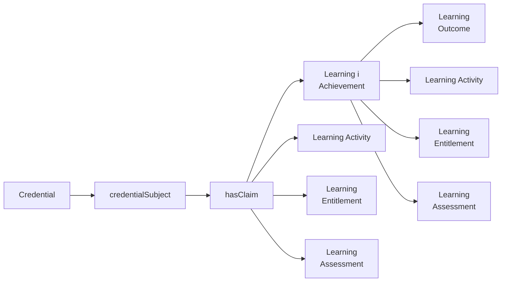

# European Digital Credential (EDC) Implementation Schema

## Overview

This document describes the implementation of the European Learning Model (ELM) version 3.2 using the W3C Verifiable Credentials Data Model (VCDM). The ELM provides a standardised format for representing educational and professional qualifications in a machine-readable, verifiable way across the European ecosystem.

## Entity-relatonship data model


## Key Components

The European Learning Model implementation consists of several interconnected data structures that together form a comprehensive framework for educational credentials:

### Core Credential Structure

The EuropeanDigitalCredential is the primary container for educational and professional qualifications:

```json
{
  "id": "URI identifier",
  "type": ["VerifiableCredential", "VerifiableAttestation", "EuropeanDigitalCredential"],
  "credentialProfiles": [/* Concept objects describing credential profiles */],
  "displayParameter": {/* Display configuration */},
  "issuer": {/* Issuing organization */},
  "credentialSubject": {/* Subject of the credential */},
  "issued": "2023-06-15T14:23:43Z",
  "validFrom": "2023-06-15T00:00:00Z",
  "credentialSchema": {/* Schema reference */}
}
```

### Learning Achievement Representation

The LearningAchievement component represents specific educational accomplishments:

```json
{
  "type": "LearningAchievement",
  "title": {
    "en": "Bachelor of Science in Computer Science",
    "fr": "Licence en Informatique"
  },
  "description": {/* Multilingual description */},
  "awardedBy": {
    "type": "AwardingProcess",
    "awardingBody": {/* Organization that awarded the achievement */},
    "awardingDate": "2023-06-01T00:00:00Z"
  },
  "specifiedBy": {/* Reference to qualification */}
}
```

### Qualification Framework

The Qualification component defines the framework of the educational credential:

```json
{
  "type": "Qualification",
  "title": {/* Multilingual title */},
  "description": {/* Multilingual description */},
  "eqfLevel": {/* European Qualifications Framework level */},
  "nqfLevel": {/* National Qualifications Framework levels */},
  "learningOutcome": [/* Learning outcomes associated with qualification */],
  "volumeOfLearning": "P3Y",
  "educationSubject": [/* Subject area classifications */],
  "creditPoint": [
    {
      "type": "CreditPoint",
      "framework": {/* Credit framework */},
      "point": "180"
    }
  ]
}
```

### Learning Outcomes

The LearningOutcome component details specific competencies acquired:

```json
{
  "type": "LearningOutcome",
  "title": {/* Multilingual title */},
  "reusabilityLevel": {/* Level of reusability */},
  "relatedSkill": [/* Related skills */],
  "relatedESCOSkill": [/* Related ESCO classified skills */]
}
```

### Organizational Representation

The Organization component represents educational institutions:

```json
{
  "type": "Organisation",
  "legalName": {/* Multilingual legal name */},
  "location": {/* Location information */},
  "identifier": [/* Organizational identifiers */],
  "accreditation": [/* Accreditation information */]
}
```

### Accreditation Information

The Accreditation component verifies institutional quality:

```json
{
  "type": "Accreditation",
  "title": {/* Multilingual title */},
  "description": {/* Multilingual description */},
  "decision": {/* Accreditation decision */},
  "accreditingAgent": {/* Accrediting organization */},
  "dcType": {/* Type of accreditation */},
  "expiryDate": "2028-01-15T00:00:00Z"
}
```

### Display Parameters

The DisplayParameter component governs visual presentation:

```json
{
  "type": "DisplayParameter",
  "title": {/* Multilingual title */},
  "description": {/* Multilingual description */},
  "language": [/* Available languages */],
  "primaryLanguage": {/* Primary display language */},
  "individualDisplay": [
    {
      "type": "IndividualDisplay",
      "language": {/* Language code */},
      "displayDetail": [/* Display specifications */]
    }
  ]
}
```

## Schema Inheritance

The ELM implementation extends the W3C Verifiable Credentials Data Model with education-specific attributes while maintaining compatibility with the base model. All EuropeanDigitalCredential objects are also valid VerifiableCredential objects.

## Credential Subject Structure

The credential subject can be either a Person, Organisation, or Agent with appropriate attributes:

### Person Subject Example

```json
{
  "type": "Person",
  "fullName": "Maria Garcia",
  "givenName": "Maria",
  "familyName": "Garcia",
  "citizenshipCountry": {
    "type": "Concept",
    "notation": "ES",
    "prefLabel": {
      "en": "Spain"
    }
  },
  "dateOfBirth": "1998-05-12T00:00:00Z"
}
```

## Core Type Definitions

The ELM implementation defines several fundamental types:

- **LangString**: Language-tagged strings for multilingual support
- **Concept**: Controlled vocabulary entries with standard notations
- **Identifier**: Various identification schemes with appropriate metadata
- **LegalIdentifier**: Legally recognized identifiers with jurisdictional information

## Data Validation

All ELM credentials should validate against both:

1. The W3C Verifiable Credentials Data Model schema
2. The European Learning Model schema v3.2

## Implementation Considerations

When implementing the ELM schema:

- Ensure all required properties are provided
- Support multilingual representation through LangString objects
- Use standard vocabularies for classifications (EQF, ISCED, etc.)
- Include appropriate accreditation information
- Follow the proper nesting structure for complex objects
- Maintain backward compatibility with previous ELM versions
- Implement selective disclosure capabilities
- Support the credential verification process

## Extensions

The schema can be extended to support:

- Additional jurisdiction-specific information
- Integration with national qualification systems
- Specialized accreditation frameworks
- Advanced visualization requirements
- Supplementary documentation and evidence

## Versioning and Compatibility

The ELM implementation follows semantic versioning:
- Major versions (3.x) introduce breaking changes
- Minor versions (3.2) add features in a backwards-compatible manner
- Patch versions (3.2.1) implement backwards-compatible bug fixes

Current version: 3.2.0
