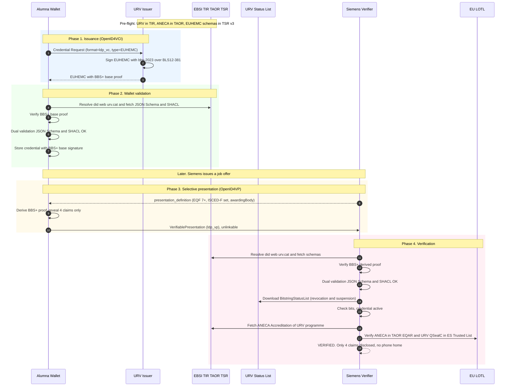

# Walkthrough ES → DE — URV microcredential → Siemens verification

## End-to-end operational flow over W3C-VCDM + ELM v3.2 + OpenID4VC\* + BBS+

---

### 1. Purpose of the walkthrough

This document converts the regulatory proposal of the [executive brief](./executive-brief.md) into a concrete operational instance. It follows the issuance, storage, selective presentation and verification of a higher-education microcredential between an issuer in Spain and a verifier in Germany, using **only published specifications** (W3C Recommendations or Candidate Recommendations, ETSI TS, IETF, OpenID Foundation) implementable with open libraries. No proprietary extension, no bilateral national agreement, no ad hoc mapping.

### 2. Scenario

An alumna of **Universitat Rovira i Virgili (URV, Tarragona, Spain)** has completed a *Microcredential in Data Analytics for Humanities* — **6 ECTS, EQF level 7**, ISCED-F 0619 (ICT, not elsewhere classified). She applies to a data-engineer position at **Siemens AG (Munich, Germany)**, which requires verifying that the candidate holds at least an EQF-7 qualification in a data-analytics-related field from an accredited European higher-education institution. She uses an EUDI Wallet certified under the EUDIW profile (ISRAEL, UAegean, Netcompany or Cappatrust — any of the four DC4EU-validated wallets operate identically here).

### 3. Actors and components

- **Alumna**: holder of the EUDI Wallet. Owns a `did:key` (or `did:jwk`) holder identifier.
- **URV Issuer Service**: connected to URV's Student Information System; signs credentials with the institutional key under `did:web:urv.cat`. Registered in EBSI TIR.
- **EBSI registers**: Trusted Issuers Registry (TIR), Trusted Accreditation Organisations Registry (TAOR), Trusted Schemas Registry v3 (TSR v3), Verifiable Revocation Registry.
- **URV Status endpoint**: publishes two `BitstringStatusList` credentials signed by URV, one for `statusPurpose: "revocation"`, one for `statusPurpose: "suspension"`.
- **ANECA**: Spanish national quality agency, ENQA/EQAR member, registered in EBSI TAOR. Issues the `Accreditation` credential of URV's higher-education programmes.
- **Siemens Verifier Service**: executes the OpenID4VP flow against candidates' wallets; consumes the EU LOTL, EBSI TIR/TAOR/TSR, and URV's status lists.
- **EU LOTL**: List of Trusted Lists of the Union (Commission), linking to the Spanish Trusted List that includes URV's QSealC under CIR 2015/1505.

### 4. Phase 1 — Issuance (URV → Wallet)

URV issues an `EuropeanHigherEducationMicrocredential` (EUHEMC) credential conformant with **ELM v3.2** and **W3C VCDM 2.0**:

- `@context`: `https://www.w3.org/ns/credentials/v2` + `http://data.europa.eu/snb/model/context/edc-ap.jsonld`.
- `issuer.id = did:web:urv.cat`; `issuer.eidasLegalIdentifier = urn:eidas:legalPersonIdentifier:ES:Q9350003A`.
- `credentialSubject.hasClaim.specifiedBy.hasEQFLevel = http://data.europa.eu/snb/eqf/7`.
- `credentialSubject.hasClaim.specifiedBy.hasISCEDFCode = http://data.europa.eu/snb/isced-f/0619`.
- `credentialSubject.hasClaim.specifiedBy.creditPoints.point = 6.0`.
- `credentialStatus`: two entries, one `revocation` and one `suspension`, both `BitstringStatusListEntry`.
- `credentialSchema`: two entries, `FullJsonSchemaValidator2021` (JSON Schema in EBSI TSR v3) and `ShaclValidator2017` (SHACL shape).
- `proof`: Data Integrity with cryptosuite **`bbs-2023`** over BLS12-381 — produces a **base BBS+ signature** that supports unlinkable derivations.

The credential is delivered via **OpenID4VCI** (Credential Offer → Authorization → Token → Credential endpoints). Format identifier: `ldp_vc` in `credential_configurations_supported`. HAIP security profile applies.

### 5. Phase 2 — Wallet storage

On receipt, the wallet:

1. Resolves `did:web:urv.cat` to retrieve the DID document with URV's public keys.
2. Confirms `urv.cat` is in **EBSI TIR** with an active accreditation reference.
3. Verifies the BBS+ base proof against the resolved `verificationMethod`.
4. Executes the **dual schema validation**: JSON Schema Draft 2020-12 (structural) and SHACL (semantic — confirms ECTS–EQF coherence, ISCED-F code membership in the authoritative concept scheme, presence of mandatory ELM attributes).
5. Stores the credential including the BBS+ base signature. This enables future *derivations* that reveal only a subset of claims while preserving cryptographic integrity and unlinkability.

At this point the alumna owns a portable, standards-based credential that can be presented to any conformant EUDIW verifier in the 27 Member States.

### 6. Phase 3 — Selective presentation to Siemens

Siemens' career portal invokes an **OpenID4VP** flow. The `presentation_definition` (DIF Presentation Exchange) requests:

- A credential of type `EuropeanHigherEducationMicrocredential` (or subclass).
- Claim `specifiedBy.hasEQFLevel` with value `http://data.europa.eu/snb/eqf/7` or higher.
- Claim `specifiedBy.hasISCEDFCode` within the set `{0619, 0613, 0612, 0611, 0688, 0521}` (data-analytics-related fields).
- Claim `awardedBy.awardingBody` as an IRI resolvable in EBSI TIR.

The alumna's wallet:

1. Matches the stored EUHEMC against the `presentation_definition`.
2. Generates a **BBS+ derived proof** that reveals only the four requested claims (`hasEQFLevel`, `hasISCEDFCode`, `awardingBody`, credential `type`) and **cryptographically hides** the remaining attributes (credential `id`, award date, specific module names, tutor identities, grades, etc.).
3. Binds the derivation to the holder's session with a proof-of-possession over the holder's DID.
4. Wraps the derivation in a `VerifiablePresentation` (format `ldp_vp`).
5. Transmits the VP via the OpenID4VP response to Siemens.

The derivation is **cryptographically uncorrelatable** with any other past or future presentation of the same base credential. This realises Article 3(10) of CIR 2024/2982 natively, without batch pre-issuance.

### 7. Phase 4 — Verification by Siemens

Siemens' verifier executes a six-step pipeline:

**(a) Envelope**: parses the VP, resolves the holder's DID, verifies the holder's proof-of-possession.

**(b) BBS+ derived proof**: retrieves URV's public key from the resolved `did:web:urv.cat`; verifies the derived proof cryptographically against the base-signature commitment and the disclosed claims.

**(c) Dual schema validation**: fetches the JSON Schema from EBSI TSR v3 and the SHACL shape from URV's authoritative registry; applies both to the revealed claim graph. The SHACL shape validates EQF ↔ ECTS coherence and that `hasISCEDFCode` belongs to the authoritative EU scheme.

**(d) Status**: downloads the two `BitstringStatusList` credentials from URV's status endpoint (revocation + suspension); verifies URV's signature on each list; checks the bits at the declared `statusListIndex`. Neither list is downloaded per-credential — the download is aggregated and cached, so URV **cannot observe** that Siemens verified this particular credential ("no phone home").

**(e) Accreditation**: fetches URV's `Accreditation` credential from EBSI; verifies it is signed by ANECA; verifies ANECA is registered in EBSI TAOR and in the EQAR register.

**(f) eIDAS legal identity**: correlates `did:web:urv.cat` ↔ `eidasLegalIdentifier = ES:Q9350003A` through URV's DID document; verifies URV's QSealC is in the **Spanish Trusted List** published in the EU LOTL under CIR 2015/1505.

**Output**: **VERIFIED**. Siemens has cryptographic, semantic, regulatory and institutional confidence that the alumna holds an EQF-7 microcredential in an ISCED-F field within the required set, issued by an ANECA-accredited European higher-education institution. **Zero** attributes beyond the four requested were disclosed.

### 8. Sequence diagram

### 9. Table of verifiable properties

| Property | Mechanism | Normative anchor |
|---|---|---|
| Cryptographic integrity | BBS+ base + derived proof over BLS12-381 | W3C Data Integrity BBS Cryptosuites v1.0 (CR, 3 April 2025) |
| Unlinkability (Art. 3(10) CIR 2024/2982) | Mathematical derivation from single base signature | W3C VC Data Integrity; CIR 2024/2982 |
| Selective disclosure | Claim selection within BBS+ derivation | W3C VC Data Integrity |
| Syntactic conformance | JSON Schema Draft 2020-12 | EBSI TSR v3; `FullJsonSchemaValidator2021` |
| Semantic conformance | SHACL shape over RDF graph | W3C SHACL 1.0; `ShaclValidator2017` |
| Multilingual rendering | Resolvable IRIs to EQF/ESCO/ISCED-F | EU Publications Office (`http://data.europa.eu/snb/`) |
| Status: revocation | `BitstringStatusListEntry` with `statusPurpose: "revocation"` | W3C Bitstring Status List v1.0 (Rec, 15 May 2025) |
| Status: suspension | `BitstringStatusListEntry` with `statusPurpose: "suspension"` | W3C Bitstring Status List v1.0 |
| No "phone home" | Aggregated list download + cache | Architectural property |
| Issuer identity (dPKI) | `did:web:urv.cat` in EBSI TIR | EBSI TIR; W3C DID Core |
| Issuer identity (PKI eIDAS) | `eidasLegalIdentifier` ES:Q9350003A + QSealC | CIR 2015/1501; CIR 2015/1505 |
| Accreditation | `Accreditation` VC signed by ANECA; ANECA in TAOR/EQAR | ENQA/EQAR; EBSI TAOR |
| Issuance transport | OpenID4VCI | OpenID Foundation; HAIP |
| Presentation transport | OpenID4VP | OpenID Foundation; HAIP |

### 10. What this walkthrough demonstrates

**Regulatory fit.** Every property enumerated above is required by Regulation 2024/1183 and the first-batch Implementing Acts (2977, 2979, 2982) for qualified EAAs. W3C-VCDM covers all of them natively.

**Operational readiness.** All components are in production: ELM v3.2 at DG EMPL, EBSI TSR v3 with the EUHEMC schemas, ANECA registered in EBSI TAOR, the four DC4EU-validated wallets, OpenID4VCI/VP reference libraries in Rust and JavaScript. There is nothing in this flow that is theoretical.

**Cross-border uniformity.** Replacing Siemens with Volvo (SE), Philips (NL) or Ericsson (FI) changes nothing. Replacing URV with the Università di Padova, the Sorbonne or Uppsala universitet changes nothing. Localisation is resolved from the European vocabularies, not from bilateral mappings.

**What the Member State verifier consumes.** A German verifier does not need a Spanish ELM dictionary, a Spanish qualification framework mapping, or a Spanish SHACL dialect. The verifier consumes W3C Recommendations, ETSI TS, EBSI registers and the EU LOTL — all European infrastructure.

**What is missing for full regulatory recognition.** Only the symmetrical operational treatment in Annexes I and V of CIRs 2024/2977 and 2024/2979 proposed in the [executive brief](./executive-brief.md). The technology, the schemas, the registers, the wallets and the empirical evidence are already in place.

---

*This walkthrough is bilateral support material. For the complete technical and regulatory justification, see chapters 00–10 and annexes A–C of the Torsten_EN repository. Update if new technical components materialise in the ETSI ESI standardisation process.*
