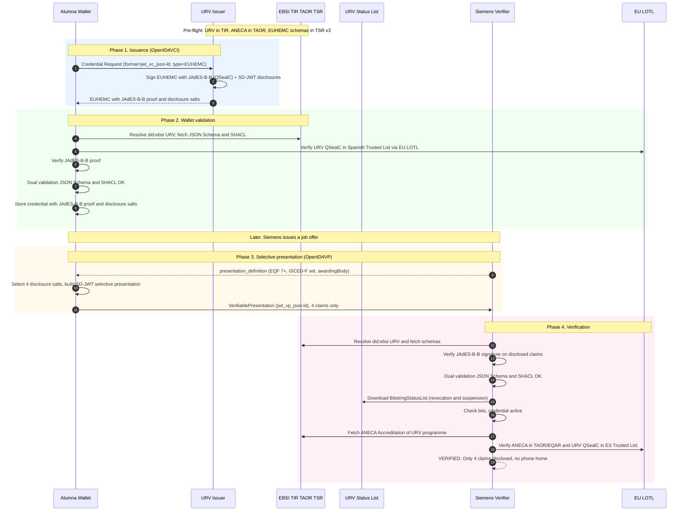

# Walkthrough ES → DE — URV microcredential → Siemens verification

## End-to-end operational flow over W3C-VCDM + ELM v3.2 + OpenID4VC\* + JAdES-B-B

---

### 1. Purpose of the walkthrough

This document converts the regulatory proposal of the [executive brief](./executive-brief.md) into a concrete operational instance. It follows the issuance, storage, selective presentation and verification of a higher-education microcredential between an issuer in Spain and a verifier in Germany, using **only published specifications** (W3C Recommendations or Candidate Recommendations, ETSI TS, IETF, OpenID Foundation) implementable with open libraries. No proprietary extension, no bilateral national agreement, no ad hoc mapping.

The walkthrough uses **JAdES-B-B** (ETSI TS 119 182-1) as the enveloping signature — the operative European standard prescribed by ETSI TS 119 472-1 V1.1.1 clause 7.6.4.2 for W3C-VC QEAAs, accepted by all EU Member State governments. Section 10 documents the optional extension to BBS+ (`bbs-2023`) for implementations wishing to prepare forward compatibility with cryptographic unlinkability once `bbs-2023` is incorporated into ETSI TS 119 312.

### 2. Scenario

An alumna of **Universitat Rovira i Virgili (URV, Tarragona, Spain)** has completed a *Microcredential in Data Analytics for Humanities* — **6 ECTS, EQF level 7**, ISCED-F 0619 (ICT, not elsewhere classified). She applies to a data-engineer position at **Siemens AG (Munich, Germany)**, which requires verifying that the candidate holds at least an EQF-7 qualification in a data-analytics-related field from an accredited European higher-education institution. She uses an EUDI Wallet certified under the EUDIW profile (Identify, UAegean, Netcompany or Cappatrust — any of the four DC4EU-validated wallets operate identically here).

### 3. Actors and components

- **Alumna**: holder of the EUDI Wallet. Owns a `did:key` (or `did:jwk`) holder identifier.
- **URV Issuer Service**: connected to URV's Student Information System; signs credentials with a JAdES-B-B qualified electronic seal (QSealC) anchored in the Spanish Trusted List and, in parallel, with a DID registered under `did:ebsi:zDnaeUC5QAe9gpMJhbU1J4s7A` in EBSI TIR.
- **EBSI registers**: Trusted Issuers Registry (TIR), Trusted Accreditation Organisations Registry (TAOR), Trusted Schemas Registry v3 (TSR v3), Verifiable Revocation Registry.
- **URV Status endpoint**: publishes two `BitstringStatusList` credentials signed by URV, one for `statusPurpose: "revocation"`, one for `statusPurpose: "suspension"`.
- **ANECA**: Spanish national quality agency, ENQA/EQAR member, registered in EBSI TAOR. Issues the `Accreditation` credential of URV's higher-education programmes.
- **Siemens Verifier Service**: executes the OpenID4VP flow against candidates' wallets; consumes the EU LOTL, EBSI TIR/TAOR/TSR, and URV's status lists.
- **EU LOTL**: List of Trusted Lists of the Union (Commission), linking to the Spanish Trusted List that includes URV's QSealC under CIR 2015/1505.

### 4. Phase 1 — Issuance (URV → Wallet)

URV issues an `EuropeanHigherEducationMicrocredential` (EUHEMC) credential conformant with **ELM v3.2** and **W3C VCDM 2.0**:

- `@context`: `https://www.w3.org/ns/credentials/v2` + `http://data.europa.eu/snb/model/context/edc-ap.jsonld`.
- `issuer.id = did:ebsi:zDnaeUC5QAe9gpMJhbU1J4s7A`; `issuer.eidasLegalIdentifier = urn:eidas:legalPersonIdentifier:ES:Q9350003A`.
- `credentialSubject.hasClaim.specifiedBy.hasEQFLevel = http://data.europa.eu/snb/eqf/7`.
- `credentialSubject.hasClaim.specifiedBy.hasISCEDFCode = http://data.europa.eu/snb/isced-f/0619`.
- `credentialSubject.hasClaim.specifiedBy.creditPoints.point = 6.0`.
- `credentialStatus`: two entries, one `revocation` and one `suspension`, both `BitstringStatusListEntry`.
- `credentialSchema`: two entries, `FullJsonSchemaValidator2021` (JSON Schema in EBSI TSR v3) and `ShaclValidator2017` (SHACL shape).
- **`proof`**: Flattened JSON Serialisation with a **JAdES-B-B** signature (ETSI TS 119 182-1), produced with URV's QSealC. The `kid` references the key registered in URV's DID document, establishing the PKI ↔ dPKI bridge. For QEAA-level credentials, the JAdES-B-B requirements of clause 5.6.2 of ETSI TS 119 472-1 apply.

The credential is delivered via **OpenID4VCI** (Credential Offer → Authorization → Token → Credential endpoints). Format identifier: `jwt_vc_json-ld` in `credential_configurations_supported`. HAIP security profile applies.

> **Note on selective disclosure**: The credential is issued with SD-JWT disclosure hashes for the attributes supporting selective presentation (see Phase 3). This enables the salted-hash selective-disclosure mechanism operative today under the JAdES-B-B signature. For implementations wishing to additionally prepare forward compatibility with `bbs-2023` (see §10), a parallel BBS+ base proof may be included as an additional entry in `proof[]`.

### 5. Phase 2 — Wallet storage

On receipt, the wallet:

1. Resolves `did:ebsi:zDnaeUC5QAe9gpMJhbU1J4s7A` to retrieve the DID document with URV's public keys.
2. Confirms `urv.cat` is in **EBSI TIR** with an active accreditation reference.
3. Verifies the **JAdES-B-B** signature against the resolved key and, for QEAA recognition, confirms URV's QSealC is present in the **Spanish Trusted List** accessed via the EU LOTL.
4. Executes the **dual schema validation**: JSON Schema Draft 2020-12 (structural) and SHACL (semantic — confirms ECTS–EQF coherence, ISCED-F code membership in the authoritative concept scheme, presence of mandatory ELM attributes).
5. Stores the credential including the JAdES-B-B proof and the SD-JWT disclosure salts. This enables future selective presentations that reveal only a subset of attributes while preserving the issuer signature.

At this point the alumna owns a portable, standards-based QEAA that can be presented to any conformant EUDIW verifier in the 27 Member States.

### 6. Phase 3 — Selective presentation to Siemens

Siemens' career portal invokes an **OpenID4VP** flow. The `presentation_definition` (DIF Presentation Exchange) requests:

- A credential of type `EuropeanHigherEducationMicrocredential` (or subclass).
- Claim `specifiedBy.hasEQFLevel` with value `http://data.europa.eu/snb/eqf/7` or higher.
- Claim `specifiedBy.hasISCEDFCode` within the set `{0619, 0613, 0612, 0611, 0688, 0521}` (data-analytics-related fields).
- Claim `awardedBy.awardingBody` as an IRI resolvable in EBSI TIR.

The alumna's wallet:

1. Matches the stored EUHEMC against the `presentation_definition`.
2. Constructs a **selective presentation** using SD-JWT disclosure: reveals only the four requested claims (`hasEQFLevel`, `hasISCEDFCode`, `awardingBody`, credential `type`) by including the corresponding disclosure salts; the remaining attributes (credential `id`, award date, specific module names, tutor identities, grades, etc.) remain protected.
3. Binds the presentation to the holder's session with a proof-of-possession over the holder's DID.
4. Wraps the result in a `VerifiablePresentation` (format `jwt_vp_json-ld` or `ldp_vp`).
5. Transmits the VP via the OpenID4VP response to Siemens.

> **Correlation note**: SD-JWT salted-hash selective disclosure protects undisclosed attributes but does not prevent verifier-to-verifier correlation based on the issuer signature. For use cases requiring cryptographic unlinkability across verifiers, the `bbs-2023` extension described in §10 provides this property once incorporated into ETSI TS 119 312. In the present flow, Siemens receives only the four requested attributes; no correlation is possible beyond what those four attributes reveal.

### 7. Phase 4 — Verification by Siemens

Siemens' verifier executes a six-step pipeline:

**(a) Envelope**: parses the VP, resolves the holder's DID, verifies the holder's proof-of-possession.

**(b) JAdES-B-B signature**: retrieves URV's public key from the resolved `did:ebsi:zDnaeUC5QAe9gpMJhbU1J4s7A`; verifies the JAdES-B-B signature cryptographically against the disclosed claims and the JAdES-B-B signed content.

**(c) Dual schema validation**: fetches the JSON Schema from EBSI TSR v3 and the SHACL shape from URV's authoritative registry; applies both to the revealed claim graph. The SHACL shape validates EQF ↔ ECTS coherence and that `hasISCEDFCode` belongs to the authoritative EU scheme.

**(d) Status**: downloads the two `BitstringStatusList` credentials from URV's status endpoint (revocation + suspension); verifies URV's signature on each list; checks the bits at the declared `statusListIndex`. Neither list is downloaded per-credential — the download is aggregated and cached, so URV **cannot observe** that Siemens verified this particular credential ("no phone home").

**(e) Accreditation**: fetches URV's `Accreditation` credential from EBSI; verifies it is signed by ANECA; verifies ANECA is registered in EBSI TAOR and in the EQAR register.

**(f) eIDAS legal identity**: correlates `did:ebsi:zDnaeUC5QAe9gpMJhbU1J4s7A` ↔ `eidasLegalIdentifier = ES:Q9350003A` through URV's DID document; verifies URV's QSealC is in the **Spanish Trusted List** published in the EU LOTL under CIR 2015/1505. The JAdES-B-B proof anchors the qualified electronic seal in the eIDAS trust chain.

**Output**: **VERIFIED**. Siemens has cryptographic, semantic, regulatory and institutional confidence that the alumna holds an EQF-7 microcredential in an ISCED-F field within the required set, issued by an ANECA-accredited European higher-education institution under a government-accepted qualified electronic seal. **Only four attributes** were disclosed.

### 8. Sequence diagram

### 9. Table of verifiable properties

| Property | Mechanism | Normative anchor |
|---|---|---|
| Cryptographic integrity (enveloping) | JAdES-B-B over Flattened JSON Serialisation | ETSI TS 119 182-1; ETSI TS 119 472-1 cl. 7.6.4.2 |
| Qualified electronic seal (QEAA) | JAdES-B-B with QSealC requirements | ETSI TS 119 472-1 cl. 5.6.2; CIR 2024/2979 Annex IV |
| Selective disclosure | SD-JWT salted-hash | IETF SD-JWT; ETSI TS 119 472-1 cl. 7.6.4.3 |
| Syntactic conformance | JSON Schema Draft 2020-12 | EBSI TSR v3; `FullJsonSchemaValidator2021` |
| Semantic conformance | SHACL shape over RDF graph | W3C SHACL 1.0; `ShaclValidator2017` |
| Multilingual rendering | Resolvable IRIs to EQF/ESCO/ISCED-F | EU Publications Office (`http://data.europa.eu/snb/`) |
| Status: revocation | `BitstringStatusListEntry` with `statusPurpose: "revocation"` | W3C Bitstring Status List v1.0 (Rec, 15 May 2025) |
| Status: suspension | `BitstringStatusListEntry` with `statusPurpose: "suspension"` | W3C Bitstring Status List v1.0 |
| No "phone home" | Aggregated list download + cache | Architectural property |
| Issuer identity (dPKI) | `did:ebsi:zDnaeUC5QAe9gpMJhbU1J4s7A` in EBSI TIR | EBSI TIR; W3C DID Core |
| Issuer identity (PKI eIDAS) | `eidasLegalIdentifier` ES:Q9350003A + QSealC in LOTL | CIR 2015/1501; CIR 2015/1505 |
| Accreditation | `Accreditation` VC signed by ANECA; ANECA in TAOR/EQAR | ENQA/EQAR; EBSI TAOR |
| Issuance transport | OpenID4VCI | OpenID Foundation; HAIP |
| Presentation transport | OpenID4VP | OpenID Foundation; HAIP |

### 10. Optional extension: forward compatibility with BBS+ (`bbs-2023`)

For implementations that wish to prepare forward compatibility with cryptographic unlinkability — the property required by Article 3(10) of Regulation 2024/2982 — the following extension is available once `bbs-2023` is incorporated into ETSI TS 119 312:

**Modified Phase 1 (Issuance with BBS+ base proof)**: URV additionally signs the EUHEMC credential with the `bbs-2023` cryptosuite over BLS12-381, producing a **base BBS+ signature** alongside the JAdES-B-B proof. The credential carries both entries in `proof[]`. The BBS+ base proof supports unlinkable derivations for future presentations.

**Modified Phase 3 (Selective presentation with BBS+ derivation)**: The alumna's wallet generates a **BBS+ derived proof** that reveals only the four requested claims and **cryptographically hides** the remaining attributes. The derivation is mathematically uncorrelatable with any other past or future presentation of the same base credential, realising Article 3(10) of CIR 2024/2982.

The BBS+ extension does not replace JAdES-B-B; it supplements it. The JAdES-B-B enveloping proof remains the operative qualified signature in the eIDAS trust chain. The BBS+ embedded proof provides the additional privacy property for presentation-layer unlinkability.

**Regulatory pathway**: `bbs-2023` adoption in the EUDIW perimeter is contingent on its incorporation into ETSI TS 119 312 (under active revision) and subsequent update of ETSI TS 119 472-1. The Commission standardisation request to ETSI ESI for a European HAIP should include this revision in its scope.

### 11. What this walkthrough demonstrates

**Regulatory fit today.** Every property in the table of §9 is required by Regulation 2024/1183 and the first-batch Implementing Acts (2977, 2979, 2982) for qualified EAAs. W3C-VCDM + JAdES-B-B covers all of them natively with government-accepted standards.

**Operational readiness.** All components are in production: ELM v3.2 at DG EMPL, EBSI TSR v3 with the EUHEMC schemas, ANECA registered in EBSI TAOR, the four DC4EU-validated wallets, OpenID4VCI/VP reference libraries. There is nothing in this flow that is theoretical.

**Cross-border uniformity.** Replacing Siemens with Volvo (SE), Philips (NL) or Ericsson (FI) changes nothing. Replacing URV with the Università di Padova, the Sorbonne or Uppsala universitet changes nothing. Localisation is resolved from the European vocabularies, not from bilateral mappings.

**What the Member State verifier consumes.** A German verifier does not need a Spanish ELM dictionary, a Spanish qualification framework mapping, or a Spanish SHACL dialect. The verifier consumes W3C Recommendations, ETSI TS, EBSI registers and the EU LOTL — all European infrastructure. The JAdES-B-B proof is anchored in the same EU LOTL infrastructure that German verifiers already use for other qualified electronic seals.

**Global interoperability.** W3C-VC conformance across 50+ global wallet and verifier implementations is documented at **https://canivc.com**, confirming that European credentials in this profile are verifiable by the global ecosystem.

**What is missing for full regulatory recognition.** Only the symmetrical operational treatment in Annexes I and V of CIRs 2024/2977 and 2024/2979 proposed in the [executive brief](./executive-brief.md). The technology, the schemas, the registers, the wallets and the empirical evidence are already in place.

---

*This walkthrough is bilateral support material. For the complete technical and regulatory justification, see chapters 00–10 and annexes A–C of the Torsten_EN repository. Update if new technical components materialise in the ETSI ESI standardisation process.*
