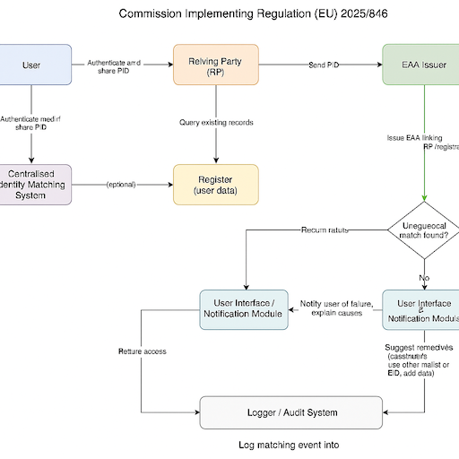
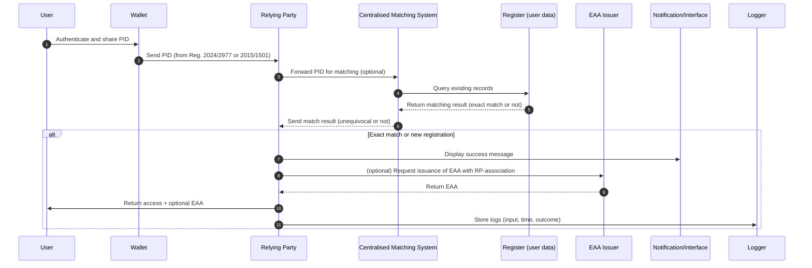
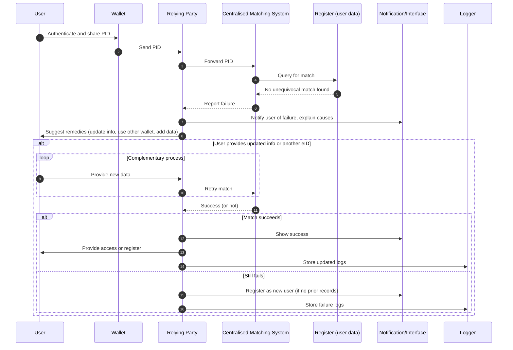

# Cross-Border Identity Matching in Education and Professional Qualifications (Narrative)

Based on **Commission Implementing Regulation (EU) 2025/846**, this narrative outlines how identity matching functions in the context of education and professional qualifications, in alignment with the **European Education Area**, **eIDAS2**, and the **EUDI Wallet**.

---
## Overview

---

## 1. Authentication via EUDI Wallet

The user authenticates using their **European Digital Identity Wallet (EUDI Wallet)**, providing their **Person Identification Dataset (PID)** as defined in **Implementing Regulation (EU) 2024/2977**.

The PID is submitted to the **Relying Party (RP)**, such as:
- Universities or higher education institutions (HEIs)
- National recognition authorities
- Student admission portals
- Regulators of professions (e.g. for doctors, engineers)

---

## 2. Checking Existing Records

The RP checks whether the user is already registered:
- Using internal systems (SIS, learner registers)
- Accessing external trusted registers (e.g. national HE registries, EWP, NQF databases)

Matching may be conducted:
- Internally by the RP
- Via a **centralised identity matching system** operated by a public authority

---

## 3. Identity Matching Execution

The provided PID is compared against registry records. The system allows for variations in spelling and national transliterations.

**Outcomes**:
- **Success**: Unequivocal match or valid new registration
- **Failure**: No match or ambiguous results

This supports compliance with:
- Bologna Process
- Council Recommendation (EU) 2018/1110 (automatic recognition)
- Directive 2005/36/EC (professional mobility)

---

## 4. If Matching Is Successful

The RP informs the user and offers to:
- Register the user internally
- Issue an **Electronic Attestation of Attributes (EAA)** linking the PID with the RP
- Store the association for reuse (e.g. in future Erasmus+ interactions)

---

## 5. If Matching Fails

The user is:
- Clearly informed
- Provided with alternatives:
  - Update existing data
  - Use another eID or wallet
  - Submit additional identifiers

If no record is found, the user may be **registered as new**, according to national law.

---

## 6. Logging, Security, and Redress

All actions are logged:
- Data values used
- Timestamps and matching outcomes
- Documents submitted

Logs are stored for **6–12 months**, ensuring:
- Traceability
- Complaint handling
- Compliance with GDPR and sectoral laws

---

## Strategic Alignment with EU Initiatives

- **European Education Area**: Mobility, recognition, interoperability
- **Digital Education Action Plan (DEAP)**: Secure, trusted services
- **eIDAS2 & EUDI Wallet**: Portable, user-controlled identity
- **Microcredentials & Europass**: Verified learning achievements
- **OOTS**: Efficient reuse of user data

---

This regulation provides the **legal and technical framework** enabling education and professional qualification authorities to confidently perform cross-border identity matching and offer seamless, secure, and interoperable services to learners and professionals.