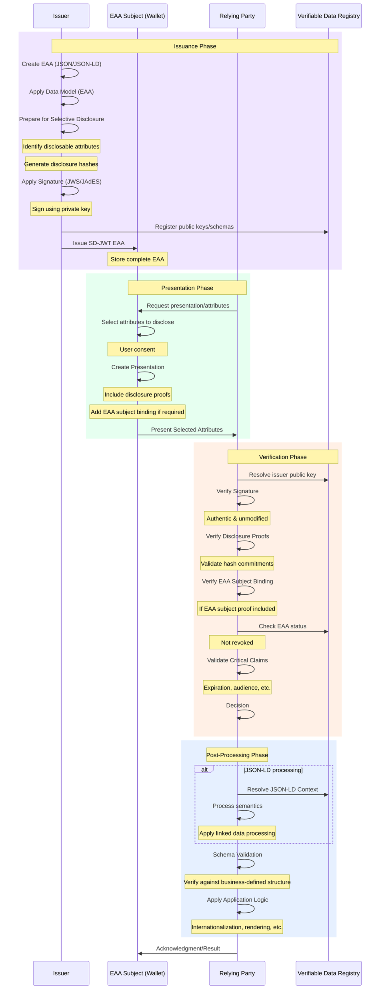

# Information Disclosure

## Overview

Information disclosure mechanisms define how personal data contained within educational and professional credentials is shared with relying parties. These mechanisms are critical for balancing data protection with credential utility, ensuring appropriate access while maintaining privacy and contextual integrity. The framework implements a dual approach to information disclosure that respects both individual privacy rights and issuer liability concerns.

The system supports two complementary types of disclosure control:

## Embeded Disclosure

Embedded disclosure is linked to the EAA catalogue and serves to restrict which relying parties can request and process specific Electronic Attestations of Attributes (EAAs). This mechanism operates at the ecosystem level, creating structural controls for data access

## Selective Disclosure

Selective disclosure acknowledges that the issuer has liability regarding the issued EAA and, therefore, enables the definition of policies, templates, and profiles on the disclosure of part of the EAA information that ensures the context is not lost. This mechanism operates at the credential level, preserving the semantic integrity of shared information

# Embedded Disclosure

Embedded disclosure is linked to the EAA catalogue and serves to restrict which relying parties can request and process specific Electronic Attestations of Attributes (EAAs). This mechanism operates at the ecosystem level, creating structural controls for data access.

## Key Characteristics:
- Pre-defined Access Control: Establishes which categories of relying parties can access specific types of credentials or attributes
- Catalogue Integration: Directly integrated with the EAA catalogue, creating systemic restrictions
- Ecosystem Governance: Managed through formal governance structures with sectorial oversight
- Category-based Restrictions: Limits access based on relying party categories and classifications
- Structural Protection: Creates ecosystem-wide guardrails for credential usage

## Implementation Mechanisms:
- Registry-based access control lists
- Formal classification of relying parties
- Credential type categorisation
- Trust framework integration
- Access policy enforcement in verification protocols

# Selective Disclosure

## Overview

The system enables users to share only necessary credential data, meeting privacy requirements through advanced cryptographic techniques and carefully designed disclosure policies. This capability gives individuals control over their personal information while still enabling credential verification.

## Data flow

## Key Components

### Technical Implementations
- **SD-JWS** (Selective Disclosure for JSON Web Signatures)
- **SD-JWT** (Selective Disclosure for JSON Web Tokens)
- **BBS+** cryptography for zero-knowledge proofs
- Other privacy-preserving credential formats

### Issuer-Defined Disclosure Policies
- Guidelines for appropriate data sharing
- Minimum disclosure requirements
- Context-specific disclosure rules
- Privacy-protecting default settings

### Privacy-Preserving Verification Methods
- Zero-knowledge proof verification
- Minimal data disclosure protocols
- Unlinkable presentation techniques
- User-controlled attribute sharing

## Implementation Considerations

When implementing selective disclosure:
- Cryptographic implementations must follow current best practices
- User interfaces should make disclosure choices clear
- Default settings should minimise data sharing
- Technical performance should support efficient verification
- Fallback mechanisms should be available when needed

## Benefits

Selective disclosure provides:
- Enhanced privacy protection for credential holders
- Compliance with data minimisation principles
- Context-appropriate information sharing
- Prevention of unnecessary data collection
- User control over personal information

## Cross-Border Scenarios

For cross-border educational mobility, selective disclosure enables:
- Sharing only necessary qualification information
- Protection of sensitive personal data across jurisdictions
- Compliance with varied privacy requirements
- User control when interacting with foreign institutions

## Practical Applications

Selective disclosure supports scenarios such as:
- Proving degree attainment without revealing grades
- Confirming age requirements without revealing birth date
- Demonstrating institutional affiliation without full enrolment details
- Verifying specific skills without sharing entire educational history
- Proving professional qualifications without unnecessary personal data
