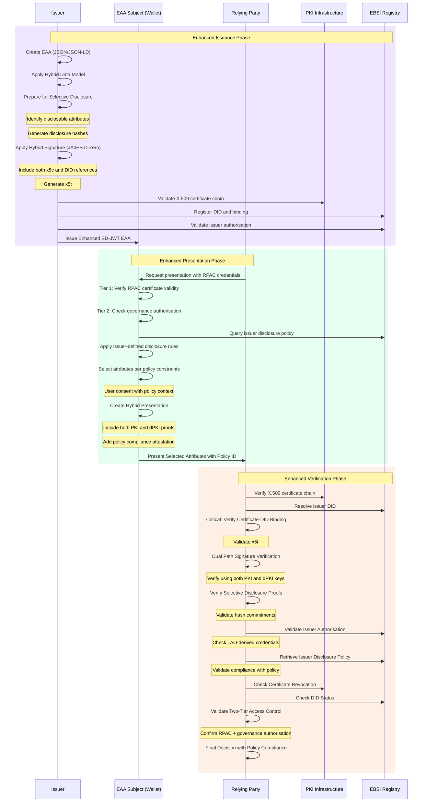

# Information Disclosure - Enhanced Version

## Overview

Information disclosure mechanisms define how personal data contained within educational and professional credentials is shared with relying parties. These mechanisms are critical for balancing data protection with credential utility, ensuring appropriate access whilst maintaining privacy and contextual integrity. The framework implements a sophisticated dual approach to information disclosure that respects both individual privacy rights and issuer liability concerns, enhanced by the latest developments in hybrid trust infrastructure.

The system supports two complementary types of disclosure control, now enhanced with **Hybrid Trust Framework** capabilities that combine traditional PKI with decentralised PKI (dPKI) through EBSI integration:

## Enhanced Disclosure Framework

### Embedded Disclosure

Embedded disclosure is linked to the EAA catalogue and **EBSI Trust Registries**, serving to restrict which relying parties can request and process specific Electronic Attestations of Attributes (EAAs). This mechanism operates at the ecosystem level through a **two-tier filtering approach** that combines traditional PKI access control with granular educational governance roles.

**Two-Tier Filtering Architecture:**

**Tier 1: Classical PKI Access Control**
- **Initial Filtering**: Relying parties must possess valid **Relying Party Access Certificates (RPAC)** from recognised Certificate Authorities
- **Broad Categorisation**: Certificates establish basic eligibility categories (e.g., "Educational Institution", "Professional Body", "Government Agency")
- **Infrastructure Validation**: Ensures relying parties have legitimate organisational identity and technical capability
- **Performance Optimisation**: Enables rapid initial filtering without requiring complex registry queries

**Tier 2: Educational Governance Granular Control**
- **Granular Authorisation**: EBSI-registered credentials specify precise educational governance roles and permissions
- **Contextual Access**: Authorisation based on specific educational functions (e.g., "Admissions Office", "Quality Assurance Body", "Professional Recognition Authority")
- **Hierarchical Governance**: Reflects complex European educational governance structures with TAO-derived authorisations
- **Dynamic Policies**: Enables fine-grained access control based on credential type, data sensitivity, and governance context

**Implementation Workflow:**
```python
def embedded_disclosure_check(relying_party, eaa_type, disclosure_request):
    """Two-tier embedded disclosure validation"""
    
    # Tier 1: Classical PKI Access Control
    rpac_valid = verify_relying_party_access_certificate(
        relying_party.rpac_certificate
    )
    
    basic_category = extract_basic_category(relying_party.rpac_certificate)
    
    if not rpac_valid or not is_eligible_category(basic_category, eaa_type):
        return {"access": "denied", "reason": "basic_access_insufficient"}
    
    # Tier 2: Educational Governance Granular Control
    governance_credentials = resolve_governance_credentials(
        relying_party.ebsi_did
    )
    
    specific_authorisation = validate_educational_governance_role(
        governance_credentials,
        eaa_type,
        disclosure_request.context
    )
    
    if not specific_authorisation:
        return {"access": "denied", "reason": "insufficient_governance_authorisation"}
    
    # Apply granular disclosure policies
    allowed_claims = determine_allowed_claims(
        specific_authorisation,
        disclosure_request.requested_claims
    )
    
    return {
        "access": "granted",
        "tier1_category": basic_category,
        "tier2_role": specific_authorisation,
        "allowed_claims": allowed_claims
    }
```

**Educational Example**: 
For MyAcademicID EAA access, the two-tier system operates as follows:

**Tier 1 (PKI-based)**: Relying party must hold valid RPAC certificate indicating "Higher Education Institution" category
**Tier 2 (Governance-based)**: EBSI credentials must specify granular role such as:
- "Admissions Office" - access to academic qualifications and grades
- "Student Services" - access to enrolment status and basic academic information
- "Quality Assurance Body" - access to institutional accreditation data
- "Professional Recognition Authority" - access to qualification recognition metadata

### Selective Disclosure

Selective disclosure acknowledges that the issuer has liability regarding the issued EAA and enables the definition of policies, templates, and profiles for disclosure of part of the EAA information whilst ensuring context is not lost. This mechanism operates at the credential level, preserving the semantic integrity of shared information through **issuer-controlled disclosure governance**.

**Issuer-Controlled Disclosure Governance:**

Since EAAs are **legally binding documents**, issuers bear liability for the accuracy and appropriate use of disclosed information. Therefore, **issuers have authoritative control** over how their credentials may be selectively disclosed:

**Disclosure Policy Definition:**
- **Issuer Authority**: Issuers define comprehensive disclosure policies and terms of reference for each EAA type they issue
- **Legal Context Preservation**: Policies ensure that partial disclosure maintains legal validity and semantic integrity
- **Liability Management**: Disclosure rules protect issuers from liability arising from inappropriate or misleading partial disclosures

**Trusted Schemes Registry Integration:**
- **Centralised Policy Storage**: Issuer-defined disclosure policies are stored in **EBSI Trusted Schemes Registries**
- **Standardised Templates**: Common disclosure patterns available as reusable templates
- **Governance Validation**: Disclosure policies validated against educational governance requirements and legal frameworks
- **Cross-Border Consistency**: Enables consistent disclosure behaviour across European jurisdictions

**Implementation Architecture:**
```python
def selective_disclosure_validation(credential, disclosure_request, issuer_did):
    """Issuer-controlled selective disclosure validation"""
    
    # Retrieve issuer's disclosure policy from Trusted Schemes Registry
    disclosure_policy = query_trusted_schemes_registry(
        issuer_did,
        credential.type
    )
    
    if not disclosure_policy:
        return {"status": "error", "reason": "no_disclosure_policy_defined"}
    
    # Validate requested disclosure against issuer policy
    validation_result = validate_against_issuer_policy(
        disclosure_request.requested_claims,
        disclosure_policy
    )
    
    if not validation_result.valid:
        return {
            "status": "denied",
            "reason": "violates_issuer_policy",
            "details": validation_result.violations
        }
    
    # Check mandatory context requirements
    mandatory_context = check_mandatory_context(
        disclosure_request.requested_claims,
        disclosure_policy.context_requirements
    )
    
    if not mandatory_context.complete:
        return {
            "status": "denied",
            "reason": "missing_mandatory_context",
            "required_additional_claims": mandatory_context.missing_claims
        }
    
    # Generate disclosure proof according to issuer specifications
    disclosure_proof = generate_disclosure_proof(
        credential,
        disclosure_request.requested_claims,
        disclosure_policy.proof_method
    )
    
    return {
        "status": "granted",
        "disclosed_claims": disclosure_request.requested_claims,
        "mandatory_context": mandatory_context.included_claims,
        "disclosure_proof": disclosure_proof,
        "issuer_policy_id": disclosure_policy.id
    }
```

**Educational Example - University Degree Credential:**

**Issuer Policy Definition** (stored in Trusted Schemes Registry):
```json
{
  "issuer": "did:ebsi:universidad_carlos_iii",
  "credential_type": "EuropeanHigherEducationDiploma",
  "disclosure_policy": {
    "policy_id": "UC3M_HE_Diploma_v1.2",
    "legal_basis": "Bologna_Process_2024",
    "context_preservation_rules": {
      "degree_classification": {
        "rule": "cannot_disclose_alone",
        "mandatory_context": ["degree_title", "issuing_institution", "eqf_level"],
        "rationale": "Grade classification meaningless without degree context"
      },
      "personal_identifiers": {
        "rule": "privacy_protected",
        "mandatory_context": ["data_protection_notice"],
        "restrictions": ["no_cross_border_without_consent"]
      }
    },
    "permitted_combinations": [
      {
        "name": "basic_qualification_verification",
        "claims": ["degree_title", "graduation_date", "issuing_institution"],
        "use_case": "employment_verification"
      },
      {
        "name": "academic_transcript_summary",
        "claims": ["degree_title", "degree_classification", "major_subjects", "eqf_level"],
        "use_case": "further_education_application"
      }
    ],
    "prohibited_combinations": [
      {
        "claims": ["student_id", "personal_identifiers"],
        "reason": "privacy_protection",
        "alternative": "use_pseudonymous_identifier"
      }
    ]
  }
}
```

**Practical Application:**
- **Permitted Disclosure**: Employer requests "degree_title" + "graduation_date" + "issuing_institution" for employment verification → **Allowed** (matches "basic_qualification_verification" template)
- **Prohibited Disclosure**: Third party requests "degree_classification" alone → **Denied** (violates context preservation rule)
- **Enhanced Disclosure**: Graduate school requests "degree_title" + "degree_classification" + "major_subjects" + "eqf_level" → **Allowed** (matches "academic_transcript_summary" template)

**Legal and Governance Benefits:**
- **Issuer Liability Protection**: Clear policies protect issuers from misuse of partial disclosures
- **Legal Validity Maintenance**: Ensures disclosed information retains legal significance
- **Cross-Border Consistency**: Standardised policies enable consistent interpretation across Member States
- **Audit Trail**: Complete record of disclosure decisions and policy compliance

### EBSI Trusted Schemes Registry Integration

The **EBSI Trusted Schemes Registry** serves as the authoritative repository for issuer-defined disclosure policies, enabling consistent and legally compliant selective disclosure across the European educational ecosystem.

**Registry Architecture:**
- **Issuer-Controlled Policies**: Each authorised issuer maintains their own disclosure policies and terms of reference
- **Standardised Templates**: Common disclosure patterns available for reuse and consistency
- **Governance Validation**: Policies validated against educational governance requirements
- **Cross-Border Accessibility**: Enables consistent disclosure behaviour across Member States

**Policy Lifecycle Management:**
```python
def manage_disclosure_policy_lifecycle(issuer_did, credential_type):
    """Comprehensive policy lifecycle management"""
    
    policy_management = {
        "creation": {
            "issuer_authority": validate_issuer_authority(issuer_did),
            "legal_framework": determine_applicable_legal_framework(credential_type),
            "governance_compliance": check_governance_requirements(credential_type)
        },
        "registration": {
            "registry_submission": submit_to_trusted_schemes_registry(policy),
            "validation": validate_policy_against_standards(policy),
            "approval": await_governance_approval(policy)
        },
        "maintenance": {
            "version_control": manage_policy_versions(policy),
            "impact_assessment": assess_policy_changes(policy),
            "stakeholder_notification": notify_affected_parties(policy)
        },
        "compliance": {
            "audit_trail": maintain_policy_audit_trail(policy),
            "legal_review": schedule_legal_compliance_review(policy),
            "dispute_resolution": handle_policy_disputes(policy)
        }
    }
    
    return policy_management
```

## Technical Implementation Details

### Hybrid Trust Architecture

The enhanced framework implements a sophisticated **Hybrid X.509-DID binding model** that integrates the **two-tier embedded disclosure filtering** with **issuer-controlled selective disclosure governance**:


```mermaid
sequenceDiagram
    participant I as Issuer
    participant ES as EAA Subject (Wallet)
    participant RP as Relying Party
    participant PKI as PKI Infrastructure
    participant EBSI as EBSI Registry
    
    rect rgb(240, 230, 255)
    Note over I, EBSI: Enhanced Issuance Phase
    
    I->>I: Create EAA (JSON/JSON-LD)
    I->>I: Apply Hybrid Data Model
    I->>I: Prepare for Selective Disclosure
    Note over I: Identify disclosable attributes
    Note over I: Generate disclosure hashes
    
    I->>I: Apply Hybrid Signature (JAdES D-Zero)
    Note over I: Include both x5c and DID references
    Note over I: Generate x5t#S256 binding
    
    I->>PKI: Validate X.509 certificate chain
    I->>EBSI: Register DID and binding
    I->>EBSI: Validate issuer authorisation
    I->>ES: Issue Enhanced SD-JWT EAA
    end
    
    rect rgb(230, 255, 240)
    Note over ES, RP: Enhanced Presentation Phase
    
    RP->>ES: Request presentation with RPAC credentials
    ES->>ES: Tier 1: Verify RPAC certificate validity
    ES->>ES: Tier 2: Check governance authorisation
    ES->>EBSI: Query issuer disclosure policy
    ES->>ES: Apply issuer-defined disclosure rules
    ES->>ES: Select attributes per policy constraints
    Note over ES: User consent with policy context
    
    ES->>ES: Create Hybrid Presentation
    Note over ES: Include both PKI and dPKI proofs
    Note over ES: Add policy compliance attestation
    
    ES->>RP: Present Selected Attributes with Policy ID
    end
    
    rect rgb(255, 240, 230)
    Note over RP, EBSI: Enhanced Verification Phase
    
    RP->>PKI: Verify X.509 certificate chain
    RP->>EBSI: Resolve issuer DID
    RP->>RP: Critical: Verify Certificate-DID Binding
    Note over RP: Validate x5t#S256 hash consistency
    
    RP->>RP: Dual Path Signature Verification
    Note over RP: Verify using both PKI and dPKI keys
    
    RP->>RP: Verify Selective Disclosure Proofs
    Note over RP: Validate hash commitments
    
    RP->>EBSI: Validate Issuer Authorisation
    Note over RP: Check TAO-derived credentials
    
    RP->>EBSI: Retrieve Issuer Disclosure Policy
    Note over RP: Validate compliance with policy
    
    RP->>PKI: Check Certificate Revocation
    RP->>EBSI: Check DID Status
    
    RP->>RP: Validate Two-Tier Access Control
    Note over RP: Confirm RPAC + governance authorisation
    
    RP->>RP: Final Decision with Policy Compliance
    end
```

### Enhanced Signature Structure

**Pure dPKI Signature Header (Legacy):**
```json
{
  "alg": "ES256",
  "typ": "jades-d-z",
  "kid": "did:ebsi:ziuFQNRWr6vNeEpTgimmCpw#keys-1"
}
```

**Hybrid Model Signature Header (Enhanced):**
```json
{
  "alg": "ES256",
  "typ": "jades-d-z",
  "cty": "vc+ld+json",
  "kid": "did:ebsi:ziuFQNRWr6vNeEpTgimmCpw#keys-1",
  "x5c": ["MIICmDCCAgGgAwIBAgIBADANBgkq..."],
  "x5t#S256": "2d4e6f8b9a1c3d5e7f9a0b2c4d6e8f0a1b3c5d7e9f0a2b4c6d8e",
  "crit": ["sigT", "sigPl"],
  "sigT": "2025-07-18T10:00:00Z",
  "sigPl": {
    "addressCountry": "ES",
    "addressLocality": "Tarragona"
  }
}
```

### Critical Binding Verification

The hybrid model introduces a **mandatory binding verification step** that ensures certificate-DID consistency:

```python
def verify_certificate_did_binding(header, did_document):
    """Critical verification step unique to hybrid model"""
    
    # Extract certificate thumbprint from header
    if 'x5t#S256' not in header:
        raise ValueError("Missing certificate thumbprint in hybrid model")
    
    header_thumbprint = header['x5t#S256']
    
    # Compute thumbprint from certificate
    cert_der = base64.b64decode(header['x5c'][0])
    computed_thumbprint = hashlib.sha256(cert_der).hexdigest()
    
    # Find matching verification method in DID document
    verification_methods = did_document.get('verificationMethod', [])
    
    for method in verification_methods:
        jwk = method.get('publicKeyJwk', {})
        if jwk.get('x5t#S256') == computed_thumbprint:
            # Verify key material consistency
            if verify_key_material_match(header['x5c'][0], jwk):
                return True
    
    raise ValueError("Certificate-DID binding verification failed")
```

## EBSI Integration for Enhanced Trust Processing

### Trust Registry Integration

The enhanced framework leverages **EBSI Trust Registries** to provide automated trust processing capabilities beyond traditional eIDAS mechanisms:

**Key Registry Components:**
- **TAO Registry**: Root Trust Authority Organisations with verifiable authorisation hierarchies
- **Educational Institution Registry**: Institutions with validated authorisation chains
- **Professional Body Registry**: Certified professional organisations
- **Schema Registry**: Standardised credential formats with disclosure templates

### Automated Trust Validation

```python
def validate_enhanced_trust_chain(credential, relying_party_auth):
    """Enhanced trust validation using EBSI registries"""
    
    # Traditional PKI validation
    pki_valid = verify_certificate_chain(credential.x5c)
    
    # EBSI dPKI validation
    did_valid = verify_did_signature(credential.kid, credential.signature)
    
    # Critical: Binding validation
    binding_valid = verify_certificate_did_binding(
        credential.header, 
        resolve_did_document(credential.kid)
    )
    
    # Issuer authorisation validation
    issuer_auth = query_ebsi_trust_registry(credential.issuer)
    auth_valid = validate_issuer_authorisation(
        issuer_auth, 
        credential.type
    )
    
    # Relying party authorisation validation
    rp_auth_valid = validate_relying_party_authorisation(
        relying_party_auth,
        credential.type
    )
    
    return {
        'pki_valid': pki_valid,
        'did_valid': did_valid,
        'binding_valid': binding_valid,
        'issuer_authorised': auth_valid,
        'rp_authorised': rp_auth_valid,
        'overall_valid': all([pki_valid, did_valid, binding_valid, 
                            auth_valid, rp_auth_valid])
    }
```

## Enhanced Cross-Border Recognition

### European Educational Mobility

The enhanced framework supports sophisticated cross-border scenarios through **verifiable governance integration**:

**Recognition Workflow:**
1. **Credential Presentation**: Student presents educational credential with full provenance chain
2. **Hybrid Verification**: Institution validates both PKI certificate and EBSI authorisation
3. **TAO Chain Validation**: System traces authorisation back to recognised European TAO
4. **Automated Recognition**: Enhanced trust enables automated or assisted recognition decisions
5. **Compliance Recording**: Complete audit trail for regulatory compliance

**Example - Cross-Border Degree Recognition:**
```json
{
  "credential": {
    "type": ["VerifiableCredential", "EuropeanDiplomaCredential"],
    "issuer": {
      "id": "did:ebsi:universityexample",
      "name": "Universidad Carlos III de Madrid",
      "authorisation": {
        "type": "HigherEducationInstitution",
        "level": "EQF_Level_7",
        "jurisdiction": "ES",
        "tao": "did:ebsi:spanish_ministry_education"
      }
    },
    "selective_disclosure": {
      "available_claims": ["degree_title", "graduation_date", "honours"],
      "mandatory_context": ["institution", "accreditation_status"],
      "privacy_policy": "minimal_necessary"
    }
  }
}
```

## Performance and Implementation Considerations

### Performance Impact Analysis

The hybrid model introduces significant performance considerations:

**Verification Time Comparison:**
- **Pure dPKI**: ~150ms average verification
- **Hybrid Model**: ~240ms average verification (60% increase)
- **Additional Latency Sources**: Certificate validation, binding verification, dual registry queries

**Scalability Considerations:**
- **Certificate Validation**: Additional PKI infrastructure dependencies
- **EBSI Query Load**: Increased load on EBSI registries
- **Caching Strategies**: Enhanced caching for certificate chains and DID documents

### Implementation Recommendations

**For Educational Institutions:**
1. **Infrastructure Assessment**: Evaluate existing PKI capabilities and EBSI readiness
2. **Governance Integration**: Ensure compliance with TAO authorisation requirements
3. **Performance Planning**: Account for increased verification latency in system design
4. **Migration Strategy**: Plan phased transition from pure dPKI to hybrid model

**For Relying Parties:**
1. **Authorisation Credentials**: Obtain appropriate EBSI-registered verification credentials
2. **Dual Verification**: Implement both PKI and dPKI verification capabilities
3. **Fallback Mechanisms**: Design resilient verification with appropriate fallbacks
4. **Monitoring**: Implement comprehensive monitoring for dual trust infrastructure

## Privacy-Preserving Enhancements

### Advanced Cryptographic Techniques

**Enhanced Selective Disclosure Methods:**
- **SD-JWS**: Selective Disclosure for JSON Web Signatures with hybrid key support
- **SD-JWT**: Enhanced JSON Web Tokens with certificate binding
- **BBS+**: Zero-knowledge proofs for complex disclosure scenarios
- **Hybrid Proofs**: Combination of PKI and dPKI cryptographic proofs

### User Control Mechanisms

**Enhanced User Experience:**
- **Contextual Disclosure**: Clear indication of what data is being shared and why
- **Authorisation Transparency**: Visibility into relying party authorisations
- **Granular Consent**: Fine-grained control over attribute disclosure
- **Provenance Tracking**: Complete audit trail of data sharing decisions

## Compliance and Regulatory Integration

### eIDAS 2.0 Compliance

The enhanced framework ensures full compliance with the amended eIDAS Regulation:

**Key Compliance Features:**
- **Non-discrimination Principle**: Support for Article 45b(1) requirements
- **Cross-border Recognition**: Enhanced mechanisms for Article 45b(2) compliance
- **Qualified EAA Support**: Full support for qualified electronic attestations
- **Audit Requirements**: Comprehensive logging for regulatory oversight

### Educational Governance Alignment

**European Framework Integration:**
- **European Qualification Framework (EQF)**: Seamless integration with EQF levels
- **Bologna Process**: Support for European Higher Education Area objectives
- **EQAR Integration**: Direct connection to quality assurance mechanisms
- **National Framework Support**: Compatibility with national qualification frameworks

## Future Developments

### Research and Development Priorities

**Technical Research:**
- **Quantum-resistant cryptography**: Preparation for post-quantum security
- **Advanced privacy techniques**: Enhanced zero-knowledge protocols
- **Interoperability standards**: Cross-system compatibility improvements

**Governance Research:**
- **Automated recognition algorithms**: AI-assisted credential recognition
- **Dynamic trust policies**: Adaptive governance mechanisms
- **Regulatory compliance automation**: Streamlined compliance processes

## Conclusion

The enhanced Information Disclosure framework represents a significant evolution in European digital credential management, combining the reliability of traditional PKI with the flexibility and governance capabilities of decentralised systems. Through the **Hybrid Trust Framework**, the system addresses the complex requirements of educational and professional credential ecosystems whilst maintaining the highest standards of privacy protection and regulatory compliance.

The integration of EBSI registries provides automated trust processing capabilities that go beyond traditional eIDAS mechanisms, enabling sophisticated cross-border recognition and governance structures that reflect the hierarchical nature of European educational authority. This enhanced framework positions the European digital identity ecosystem for the future whilst maintaining interoperability with existing systems.

**Key Benefits:**
- **Enhanced Trust**: Dual verification paths provide superior security and reliability
- **Automated Processing**: EBSI integration enables automated trust decisions
- **Privacy Protection**: Advanced selective disclosure with user control
- **Regulatory Compliance**: Full eIDAS 2.0 compliance with enhanced capabilities
- **Cross-border Recognition**: Sophisticated mechanisms for European mobility
- **Future-Ready**: Scalable architecture for evolving requirements

The framework's success depends on coordinated implementation across European institutions, proper governance integration, and ongoing attention to performance and user experience considerations. As the system matures, it will provide the foundation for a truly integrated European digital credential ecosystem that serves the needs of learners, institutions, and employers across the continent.